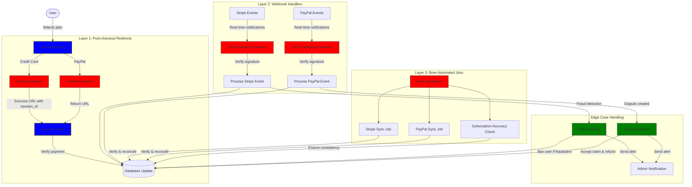
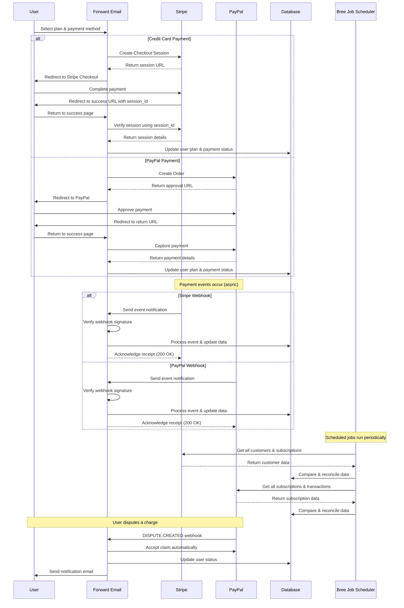
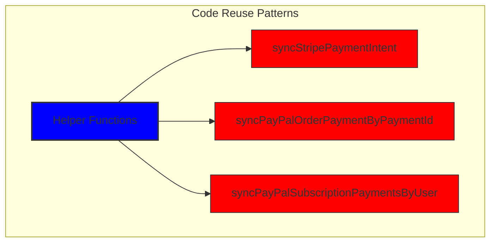
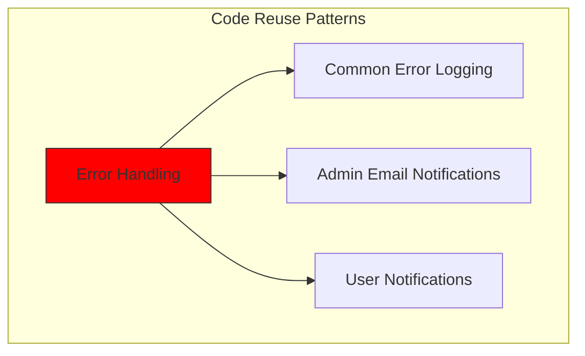
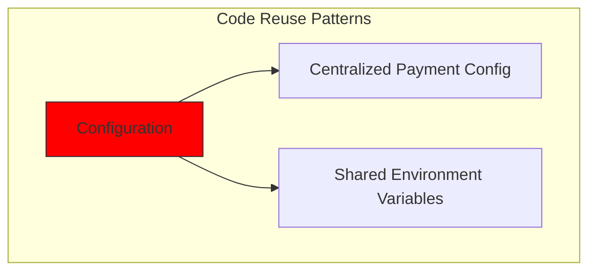
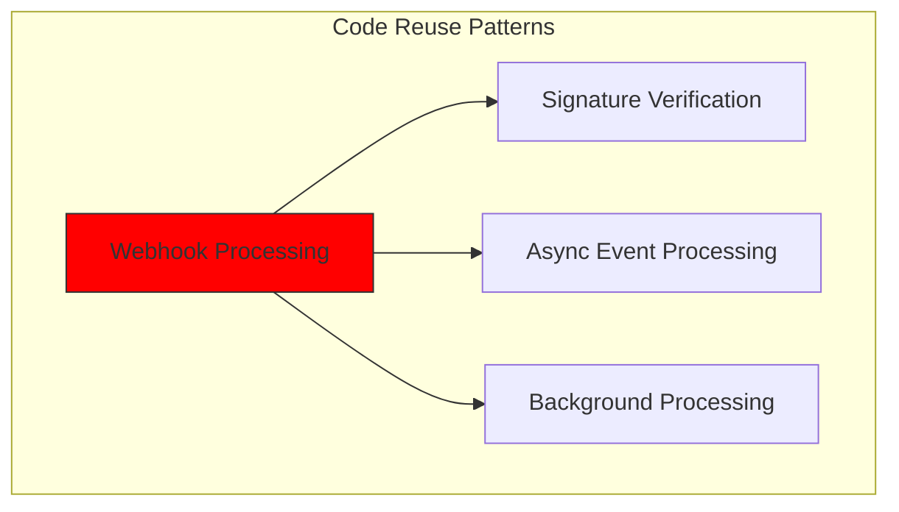
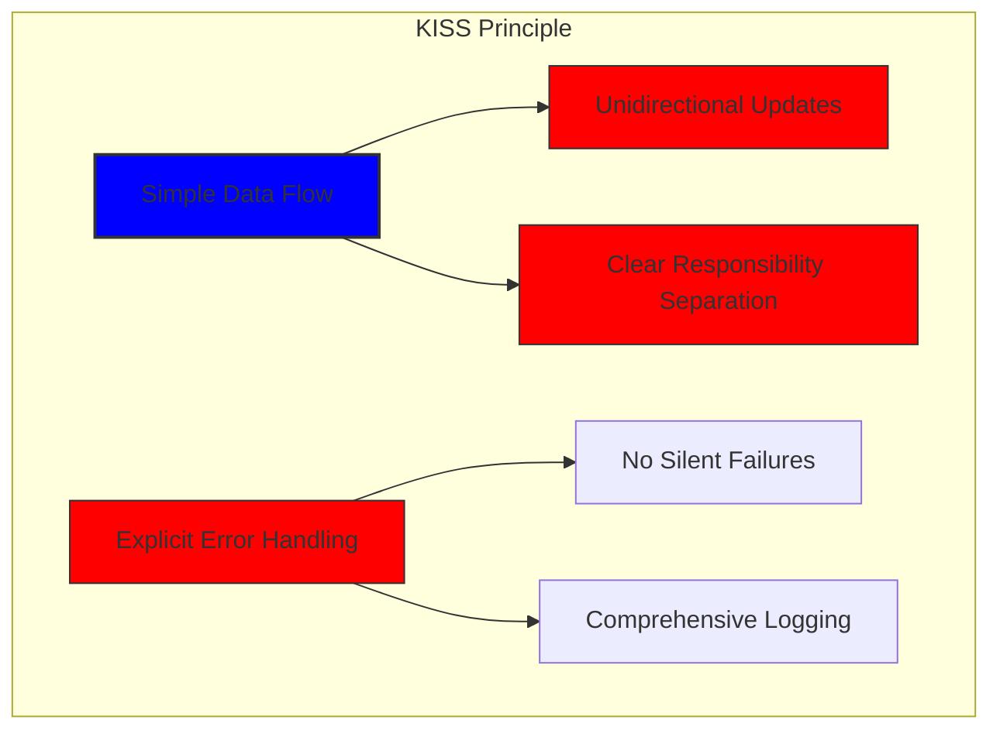
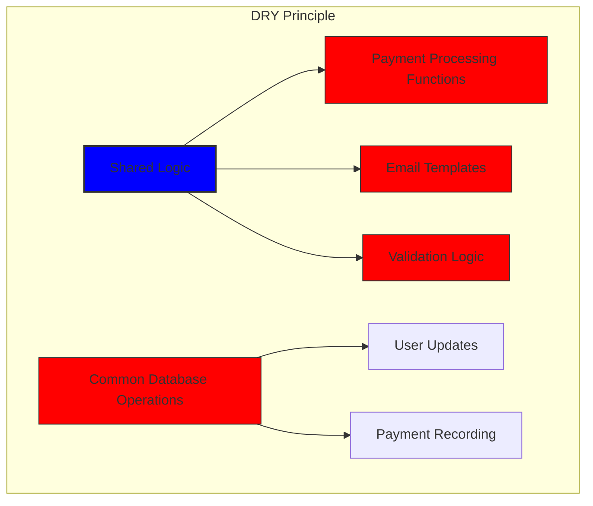

# 我们如何使用 Stripe 和 PayPal 构建强大的支付系统：三重奏方法 {#how-we-built-a-robust-payment-system-with-stripe-and-paypal-a-trifecta-approach}


## 目录 {#table-of-contents}

* [前言](#foreword)
* [挑战：多个支付处理器，一个真实来源](#the-challenge-multiple-payment-processors-one-source-of-truth)
* [三重方法：三层可靠性](#the-trifecta-approach-three-layers-of-reliability)
* [第 1 层：结账后重定向](#layer-1-post-checkout-redirects)
  * [Stripe Checkout 实施](#stripe-checkout-implementation)
  * [PayPal付款流程](#paypal-payment-flow)
* [第 2 层：带有签名验证的 Webhook 处理程序](#layer-2-webhook-handlers-with-signature-verification)
  * [Stripe Webhook 实现](#stripe-webhook-implementation)
  * [PayPal Webhook 实现](#paypal-webhook-implementation)
* [第 3 层：使用 Bree 实现自动化作业](#layer-3-automated-jobs-with-bree)
  * [订阅准确性检查器](#subscription-accuracy-checker)
  * [PayPal 订阅同步](#paypal-subscription-synchronization)
* [处理边缘情况](#handling-edge-cases)
  * [欺诈检测与预防](#fraud-detection-and-prevention)
  * [争议处理](#dispute-handling)
* [代码重用：KISS 和 DRY 原则](#code-reuse-kiss-and-dry-principles)
* [VISA 订阅要求实施](#visa-subscription-requirements-implementation)
  * [自动续订前电子邮件通知](#automated-pre-renewal-email-notifications)
  * [处理边缘情况](#handling-edge-cases-1)
  * [试用期和订阅条款](#trial-periods-and-subscription-terms)
* [结论：我们的三重奏方法的优势](#conclusion-the-benefits-of-our-trifecta-approach)

## 前言 {#foreword}

在 Forward Email，我们始终将创建可靠、准确且用户友好的系统放在首位。在实施支付处理系统时，我们深知需要一个能够处理多个支付处理器，同时保持完美数据一致性的解决方案。这篇博文详细介绍了我们的开发团队如何采用三重奏方法集成 Stripe 和 PayPal，以确保整个系统达到 1:1 的实时准确性。

## 挑战：多个支付处理器，一个真实来源 {#the-challenge-multiple-payment-processors-one-source-of-truth}

作为一家注重隐私的电子邮件服务商，我们希望为用户提供多种支付选项。有些人喜欢通过 Stripe 便捷的信用卡支付，而另一些人则更看重 PayPal 提供的额外安全保障。然而，支持多种支付处理器会带来显著的复杂性：

1. 我们如何确保不同支付系统之间的数据一致性？
2. 我们如何应对争议、退款或支付失败等极端情况？
3. 我们如何维护数据库中的单一真实来源？

我们的解决方案是实施所谓的“三重方法”——一个三层系统，无论发生什么情况，都能提供冗余并确保数据的一致性。

## 三重方法：三层可靠性 {#the-trifecta-approach-three-layers-of-reliability}

我们的支付系统由三个关键组件组成，它们协同工作以确保完美的数据同步：

1. **结账后重定向** - 结账后立即获取付款信息
2. **Webhook 处理程序** - 处理来自支付处理器的实时事件
3. **自动化作业** - 定期验证和核对付款数据

让我们深入研究每个组件并看看它们如何协同工作。



## 第 1 层：结帐后重定向 {#layer-1-post-checkout-redirects}

我们的三重奏方案的第一层在用户完成付款后立即生效。Stripe 和 PayPal 都提供了将用户重定向回我们网站的机制，并提供交易信息。

### Stripe Checkout 实施 {#stripe-checkout-implementation}

对于 Stripe，我们使用他们的 Checkout Sessions API 来打造无缝的支付体验。当用户选择套餐并使用信用卡付款时，我们会创建一个 Checkout Session，其中包含具体的成功和取消 URL：

```javascript
const options = {
  mode: paymentType === 'one-time' ? 'payment' : 'subscription',
  customer: ctx.state.user[config.userFields.stripeCustomerID],
  client_reference_id: reference,
  metadata: {
    plan
  },
  line_items: [
    {
      price,
      quantity: 1,
      description
    }
  ],
  locale: config.STRIPE_LOCALES.has(ctx.locale) ? ctx.locale : 'auto',
  cancel_url: `${config.urls.web}${ctx.path}${
    isMakePayment || isEnableAutoRenew ? '' : `/?plan=${plan}`
  }`,
  success_url: `${config.urls.web}${ctx.path}/?${
    isMakePayment || isEnableAutoRenew ? '' : `plan=${plan}&`
  }session_id={CHECKOUT_SESSION_ID}`,
  allow_promotion_codes: true
};

// Create the checkout session and redirect
const session = await stripe.checkout.sessions.create(options);
const redirectTo = session.url;
if (ctx.accepts('html')) {
  ctx.status = 303;
  ctx.redirect(redirectTo);
} else {
  ctx.body = { redirectTo };
}
```

这里的关键部分是 `success_url` 参数，它包含 `session_id` 作为查询参数。当 Stripe 在付款成功后将用户重定向回我们的网站时，我们可以使用此会话 ID 来验证交易并相应地更新数据库。

### PayPal 付款流程 {#paypal-payment-flow}

对于 PayPal，我们对其订单 API 采用了类似的方法：

```javascript
const requestBody = {
  intent: 'CAPTURE',
  application_context: {
    cancel_url: `${config.urls.web}${ctx.path}${
      isMakePayment || isEnableAutoRenew ? '' : `/?plan=${plan}`
    }`,
    return_url: `${config.urls.web}${ctx.path}/?plan=${plan}`,
    brand_name: 'Forward Email',
    shipping_preference: 'NO_SHIPPING',
    user_action: 'PAY_NOW'
  },
  payer: {
    email_address: ctx.state.user.email
  },
  purchase_units: [
    {
      reference_id: ctx.state.user.id,
      description,
      custom_id: sku,
      invoice_id: reference,
      soft_descriptor: sku,
      amount: {
        currency_code: 'USD',
        value: price,
        breakdown: {
          item_total: {
            currency_code: 'USD',
            value: price
          }
        }
      },
      items: [
        {
          name,
          description,
          sku,
          unit_amount: {
            currency_code: 'USD',
            value: price
          },
          quantity: '1',
          category: 'DIGITAL_GOODS'
        }
      ]
    }
  ]
};
```

与 Stripe 类似，我们指定 `return_url` 和 `cancel_url` 参数来处理付款后重定向。当 PayPal 将用户重定向回我们的网站时，我们可以获取付款详情并更新数据库。



## 第 2 层：带有签名验证的 Webhook 处理程序 {#layer-2-webhook-handlers-with-signature-verification}

虽然结账后重定向在大多数情况下都能很好地发挥作用，但它并非万无一失。用户可能会在重定向之前关闭浏览器，或者网络问题可能导致重定向无法完成。这时，Webhook 就派上用场了。

Stripe 和 PayPal 均提供 Webhook 系统，用于发送有关支付事件的实时通知。我们已实现强大的 Webhook 处理程序，用于验证这些通知的真实性并进行相应的处理。

### Stripe Webhook 实现 {#stripe-webhook-implementation}

我们的 Stripe webhook 处理程序会验证传入的 webhook 事件的签名，以确保它们合法：

```javascript
async function webhook(ctx) {
  const sig = ctx.request.get('stripe-signature');
  // throw an error if something was wrong
  if (!isSANB(sig))
    throw Boom.badRequest(ctx.translateError('INVALID_STRIPE_SIGNATURE'));
  const event = stripe.webhooks.constructEvent(
    ctx.request.rawBody,
    sig,
    env.STRIPE_ENDPOINT_SECRET
  );
  // throw an error if something was wrong
  if (!event)
    throw Boom.badRequest(ctx.translateError('INVALID_STRIPE_SIGNATURE'));
  ctx.logger.info('stripe webhook', { event });
  // return a response to acknowledge receipt of the event
  ctx.body = { received: true };
  // run in background
  processEvent(ctx, event)
    .then()
    .catch((err) => {
      ctx.logger.fatal(err, { event });
      // email admin errors
      emailHelper({
        template: 'alert',
        message: {
          to: config.email.message.from,
          subject: `Error with Stripe Webhook (Event ID ${event.id})`
        },
        locals: {
          message: `<pre><code>${safeStringify(
            parseErr(err),
            null,
            2
          )}</code></pre>`
        }
      })
        .then()
        .catch((err) => ctx.logger.fatal(err, { event }));
    });
}
```

`stripe.webhooks.constructEvent` 函数使用我们的端点密钥验证签名。如果签名有效，我们将异步处理该事件，以避免阻塞 Webhook 响应。

### PayPal Webhook 实施 {#paypal-webhook-implementation}

类似地，我们的 PayPal webhook 处理程序会验证传入通知的真实性：

```javascript
async function webhook(ctx) {
  const response = await promisify(
    paypal.notification.webhookEvent.verify,
    paypal.notification.webhookEvent
  )(ctx.request.headers, ctx.request.body, env.PAYPAL_WEBHOOK_ID);
  // throw an error if something was wrong
  if (!_.isObject(response) || response.verification_status !== 'SUCCESS')
    throw Boom.badRequest(ctx.translateError('INVALID_PAYPAL_SIGNATURE'));
  // return a response to acknowledge receipt of the event
  ctx.body = { received: true };
  // run in background
  processEvent(ctx)
    .then()
    .catch((err) => {
      ctx.logger.fatal(err);
      // email admin errors
      emailHelper({
        template: 'alert',
        message: {
          to: config.email.message.from,
          subject: `Error with PayPal Webhook (Event ID ${ctx.request.body.id})`
        },
        locals: {
          message: `<pre><code>${safeStringify(
            parseErr(err),
            null,
            2
          )}</code></pre>`
        }
      })
        .then()
        .catch((err) => ctx.logger.fatal(err));
    });
}
```

两个 webhook 处理程序都遵循相同的模式：验证签名、确认收货，然后异步处理事件。这确保了即使结账后重定向失败，我们也不会错过任何支付事件。

## 第 3 层：使用 Bree 的自动化作业 {#layer-3-automated-jobs-with-bree}

我们三重奏方法的最后一层是一组自动化作业，用于定期验证和核对支付数据。我们使用 Node.js 的作业调度程序 Bree 定期运行这些作业。

### 订阅准确性检查器 {#subscription-accuracy-checker}

我们的一项关键工作是订阅准确性检查器，它确保我们的数据库准确反映 Stripe 中的订阅状态：

```javascript
async function mapper(customer) {
  // wait a second to prevent rate limitation error
  await setTimeout(ms('1s'));
  // check for user on our side
  let user = await Users.findOne({
    [config.userFields.stripeCustomerID]: customer.id
  })
    .lean()
    .exec();
  if (!user) return;
  if (user.is_banned) return;

  // if emails did not match
  if (user.email !== customer.email) {
    logger.info(
      `User email ${user.email} did not match customer email ${customer.email} (${customer.id})`
    );
    customer = await stripe.customers.update(customer.id, {
      email: user.email
    });
    logger.info(`Updated user email to match ${user.email}`);
  }

  // check for active subscriptions
  const [activeSubscriptions, trialingSubscriptions] = await Promise.all([
    stripe.subscriptions.list({
      customer: customer.id,
      status: 'active'
    }),
    stripe.subscriptions.list({
      customer: customer.id,
      status: 'trialing'
    })
  ]);

  // Combine active and trialing subscriptions
  let subscriptions = [
    ...activeSubscriptions.data,
    ...trialingSubscriptions.data
  ];

  // Handle edge case: multiple subscriptions for one user
  if (subscriptions.length > 1) {
    await logger.error(
      new Error(
        `We may need to refund: User had multiple subscriptions ${user.email} (${customer.id})`
      )
    );
    await emailHelper({
      template: 'alert',
      message: {
        to: config.email.message.from,
        subject: `User had multiple subscriptions ${user.email}`
      },
      locals: {
        message: `User ${user.email} (${customer.id}) had multiple subscriptions: ${JSON.stringify(
          subscriptions.map((s) => s.id)
        )}`
      }
    });
  }
}
```

这项作业会检查我们的数据库与 Stripe 之间的差异，例如电子邮件地址不匹配或多个有效订阅。如果发现任何问题，它会记录下来并向我们的管理团队发送警报。

### PayPal 订阅同步 {#paypal-subscription-synchronization}

对于 PayPal 订阅，我们也有类似的工作：

```javascript
async function syncPayPalSubscriptionPayments() {
  const paypalCustomers = await Users.find({
    $or: [
      {
        [config.userFields.paypalSubscriptionID]: { $exists: true, $ne: null }
      },
      {
        [config.userFields.paypalPayerID]: { $exists: true, $ne: null }
      }
    ]
  })
    // sort by newest customers first
    .sort('-created_at')
    .lean()
    .exec();

  await logger.info(
    `Syncing payments for ${paypalCustomers.length} paypal customers`
  );

  // Process each customer and sync their payments
  const errorEmails = await pReduce(
    paypalCustomers,
    // Implementation details...
  );
}
```

这些自动化作业是我们最后的安全网，确保我们的数据库始终反映 Stripe 和 PayPal 中订阅和付款的真实状态。

## 处理边缘情况 {#handling-edge-cases}

一个强大的支付系统必须能够妥善处理各种极端情况。让我们来看看我们如何处理一些常见的情况。

### 欺诈检测与预防 {#fraud-detection-and-prevention}

我们实施了复杂的欺诈检测机制，可以自动识别和处理可疑的支付活动：

```javascript
case 'charge.failed': {
  // Get all failed charges in the last 30 days
  const charges = await stripe.charges.list({
    customer: event.data.object.customer,
    created: {
      gte: dayjs().subtract(1, 'month').unix()
    }
  });

  // Filter for declined charges
  const filtered = charges.data.filter(
    (d) => d.status === 'failed' && d.failure_code === 'card_declined'
  );

  // if not more than 5 then return early
  if (filtered.length < 5) break;

  // Check if user has verified domains
  const count = await Domains.countDocuments({
    members: {
      $elemMatch: {
        user: user._id,
        group: 'admin'
      }
    },
    plan: { $in: ['enhanced_protection', 'team'] },
    has_txt_record: true
  });

  if (!user.is_banned) {
    // If no verified domains, ban the user and refund all charges
    if (count === 0) {
      // Ban the user
      user.is_banned = true;
      await user.save();

      // Refund all successful charges
    }
  }
}
```

此代码会自动禁止多次收费失败且没有验证域名的用户，这是欺诈活动的强烈指标。

### 争议处理 {#dispute-handling}

当用户对收费提出异议时，我们会自动接受索赔并采取适当的措施：

```javascript
case 'CUSTOMER.DISPUTE.CREATED': {
  // accept claim
  const agent = await paypalAgent();
  await agent
    .post(`/v1/customer/disputes/${body.resource.dispute_id}/accept-claim`)
    .send({
      note: 'Full refund to the customer.'
    });

  // Find the payment in our database
  const payment = await Payments.findOne({ $or });
  if (!payment) throw new Error('Payment does not exist');

  const user = await Users.findById(payment.user);
  if (!user) throw new Error('User did not exist for customer');

  // Cancel the user's subscription if they have one
  if (isSANB(user[config.userFields.paypalSubscriptionID])) {
    try {
      const agent = await paypalAgent();
      await agent.post(
        `/v1/billing/subscriptions/${
          user[config.userFields.paypalSubscriptionID]
        }/cancel`
      );
    } catch (err) {
      // Handle subscription cancellation errors
    }
  }
}
```

这种方法最大限度地减少了纠纷对我们业务的影响，同时确保了良好的客户体验。

## 代码重用：KISS 和 DRY 原则 {#code-reuse-kiss-and-dry-principles}

在我们的整个支付系统中，我们始终坚持 KISS（保持简单，简洁）和 DRY（避免重复）原则。以下是一些示例：

1. **共享辅助函数**：我们为同步付款和发送电子邮件等常见任务创建了可重复使用的辅助函数。

2. **一致的错误处理**：Stripe 和 PayPal webhook 处理程序都使用相同的模式进行错误处理和管理通知。

3. **统一数据库模式**：我们的数据库模式旨在适应 Stripe 和 PayPal 数据，并具有支付状态、金额和计划信息的通用字段。

4.**集中配置**：支付相关配置集中在一个文件中，方便更新定价和产品信息。













## VISA 订阅要求实施 {#visa-subscription-requirements-implementation}

除了三重奏方案外，我们还实施了特定功能，以符合 VISA 的订阅要求，同时提升用户体验。VISA 的一项关键要求是，在用户支付订阅费用之前必须通知他们，尤其是在从试用版过渡到付费订阅时。

### 自动续订前电子邮件通知 {#automated-pre-renewal-email-notifications}

我们构建了一个自动化系统，可以识别正在试用订阅的用户，并在首次扣款前向他们发送通知电子邮件。这不仅使我们符合 VISA 的要求，还能减少退款并提高客户满意度。

以下是我们实现此功能的方法：

```javascript
// Find users with trial subscriptions who haven't received a notification yet
const users = await Users.find({
  $or: [
    {
      $and: [
        { [config.userFields.stripeSubscriptionID]: { $exists: true } },
        { [config.userFields.stripeTrialSentAt]: { $exists: false } },
        // Exclude subscriptions that have already had payments
        ...(paidStripeSubscriptionIds.length > 0
          ? [
              {
                [config.userFields.stripeSubscriptionID]: {
                  $nin: paidStripeSubscriptionIds
                }
              }
            ]
          : [])
      ]
    },
    {
      $and: [
        { [config.userFields.paypalSubscriptionID]: { $exists: true } },
        { [config.userFields.paypalTrialSentAt]: { $exists: false } },
        // Exclude subscriptions that have already had payments
        ...(paidPayPalSubscriptionIds.length > 0
          ? [
              {
                [config.userFields.paypalSubscriptionID]: {
                  $nin: paidPayPalSubscriptionIds
                }
              }
            ]
          : [])
      ]
    }
  ]
});

// Process each user and send notification
for (const user of users) {
  // Get subscription details from payment processor
  const subscription = await getSubscriptionDetails(user);

  // Calculate subscription duration and frequency
  const duration = getDurationFromPlanId(subscription.plan_id);
  const frequency = getHumanReadableFrequency(duration, user.locale);
  const amount = getPlanAmount(user.plan, duration);

  // Get user's domains for personalized email
  const domains = await Domains.find({
    'members.user': user._id
  }).sort('name').lean().exec();

  // Send VISA-compliant notification email
  await emailHelper({
    template: 'visa-trial-subscription-requirement',
    message: {
      to: user.receipt_email || user.email,
      ...(user.receipt_email ? { cc: user.email } : {})
    },
    locals: {
      user,
      firstChargeDate: new Date(subscription.start_time),
      frequency,
      formattedAmount: numeral(amount).format('$0,0,0.00'),
      domains
    }
  });

  // Record that notification was sent
  await Users.findByIdAndUpdate(user._id, {
    $set: {
      [config.userFields.paypalTrialSentAt]: new Date()
    }
  });
}
```

此实施可确保用户始终了解即将发生的收费，并提供有关以下方面的清晰详细信息：

1. 首次收费时间
2. 未来收费频率（月费、年费等）
3. 确切收费金额
4. 他们的订阅涵盖哪些域名

通过自动化这一过程，我们可以完全遵守 VISA 的要求（规定在收费前至少 7 天通知），同时减少支持查询并改善整体用户体验。

### 处理边缘情况 {#handling-edge-cases-1}

我们的实施还包括强大的错误处理功能。如果在通知过程中出现任何问题，我们的系统会自动向我们的团队发出警报：

```javascript
try {
  await mapper(user);
} catch (err) {
  logger.error(err);

  // Send alert to administrators
  await emailHelper({
    template: 'alert',
    message: {
      to: config.email.message.from,
      subject: 'VISA Trial Subscription Requirement Error'
    },
    locals: {
      message: `<pre><code>${safeStringify(
        parseErr(err),
        null,
        2
      )}</code></pre>`
    }
  });
}
```

这确保即使通知系统出现问题，我们的团队也能快速解决并保持符合 VISA 的要求。

VISA 订阅通知系统是我们在构建支付基础设施时同时考虑合规性和用户体验的另一个例子，它补充了我们的三重方法，以确保可靠、透明的支付处理。

### 试用期和订阅条款 {#trial-periods-and-subscription-terms}

对于在现有计划中启用自动续订的用户，我们会计算适当的试用期，以确保在当前计划到期之前不会向他们收费：

```javascript
if (
  isEnableAutoRenew &&
  dayjs(ctx.state.user[config.userFields.planExpiresAt]).isAfter(
    dayjs()
  )
) {
  const hours = dayjs(
    ctx.state.user[config.userFields.planExpiresAt]
  ).diff(dayjs(), 'hours');

  // Handle trial period calculation
}
```

我们还提供有关订阅条款的清晰信息，包括计费频率和取消政策，并在每个订阅中包含详细的元数据，以确保正确的跟踪和管理。

## 结论：我们的三重奏方法的优势 {#conclusion-the-benefits-of-our-trifecta-approach}

我们的三重支付处理方法提供了几个主要优势：

1.**可靠性**：通过实施三层付款验证，我们确保不会错过任何付款或错误处理。

2.**准确性**：我们的数据库始终反映 Stripe 和 PayPal 中订阅和付款的真实状态。

3.**灵活性**：用户可以选择他们喜欢的付款方式，而不会影响我们系统的可靠性。

4.**稳健性**：我们的系统可以很好地处理各种边缘情况，从网络故障到欺诈活动。

如果您正在实施支持多种处理器的支付系统，我们强烈推荐这种三重方案。虽然前期开发工作量较大，但从可靠性和准确性的长期效益来看，这样做绝对值得。

有关转发电子邮件和我们以隐私为重点的电子邮件服务的更多信息，请访问我们的[网站](https://forwardemail.net)。

<!-- *关键词：支付处理、Stripe 集成、PayPal 集成、webhook 处理、支付同步、订阅管理、欺诈预防、争议处理、Node.js 支付系统、多处理器支付系统、支付网关集成、实时支付验证、支付数据一致性、订阅计费、支付安全、支付自动化、支付 webhook、支付对账、支付边缘情况、支付错误处理、VISA 订阅要求、续订前通知、订阅合规性* -->