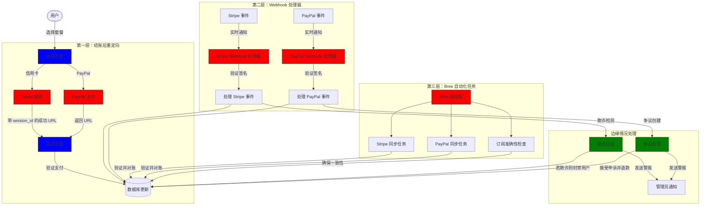
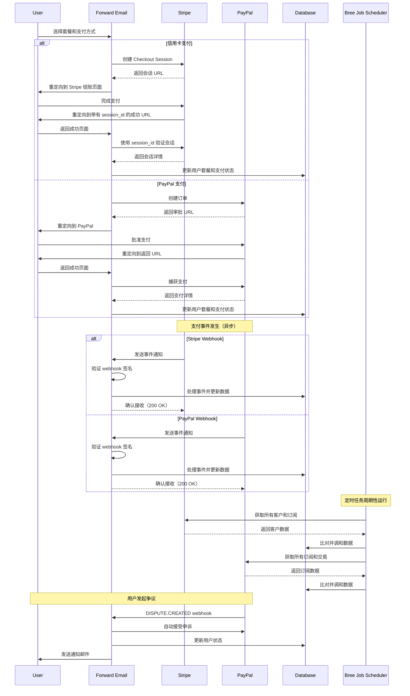
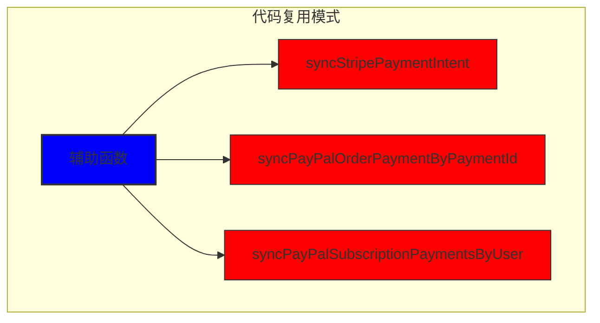
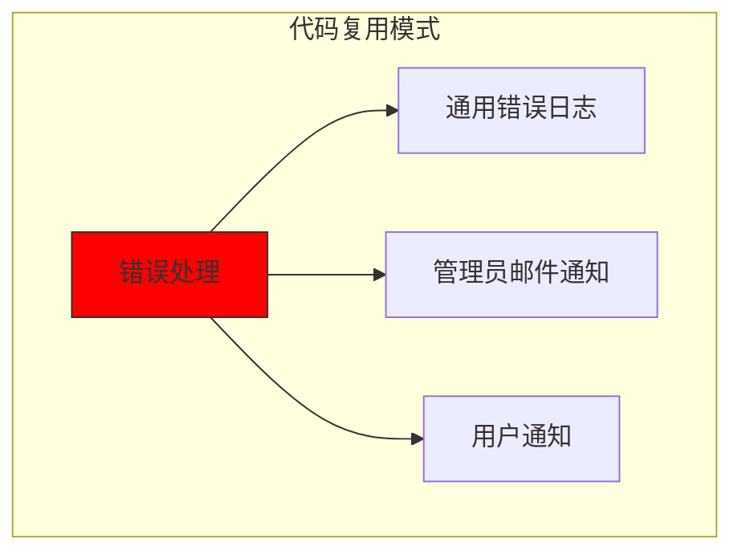
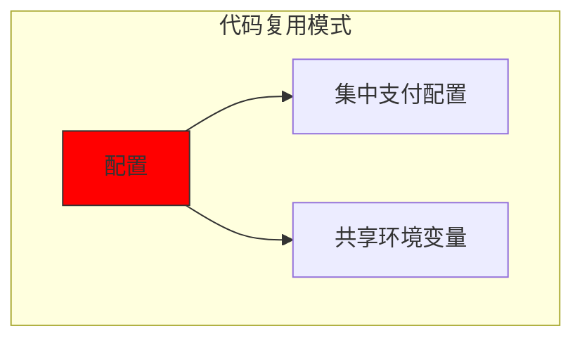
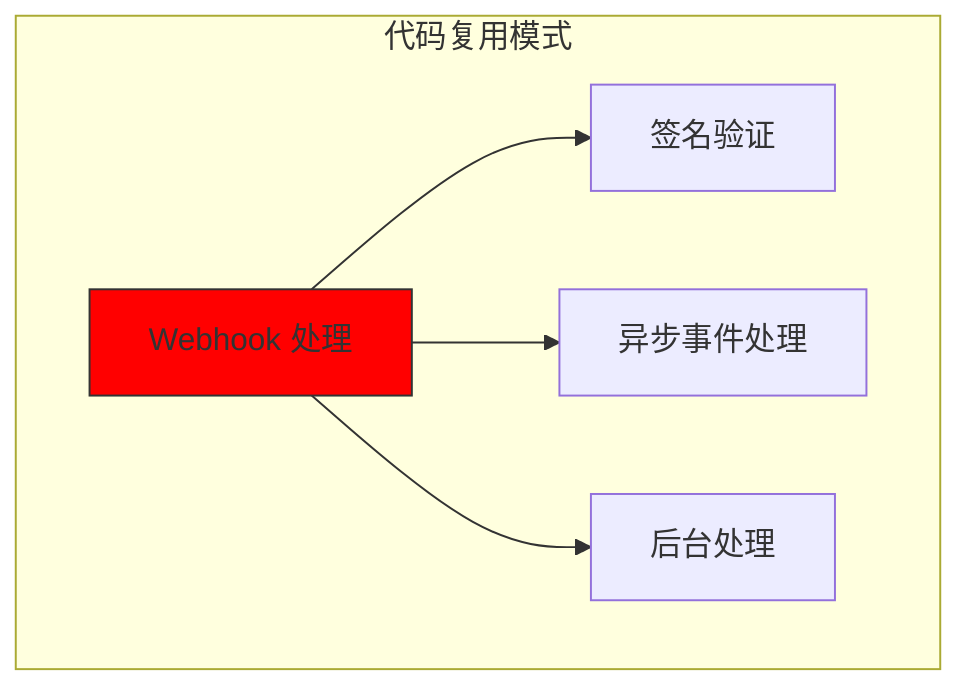
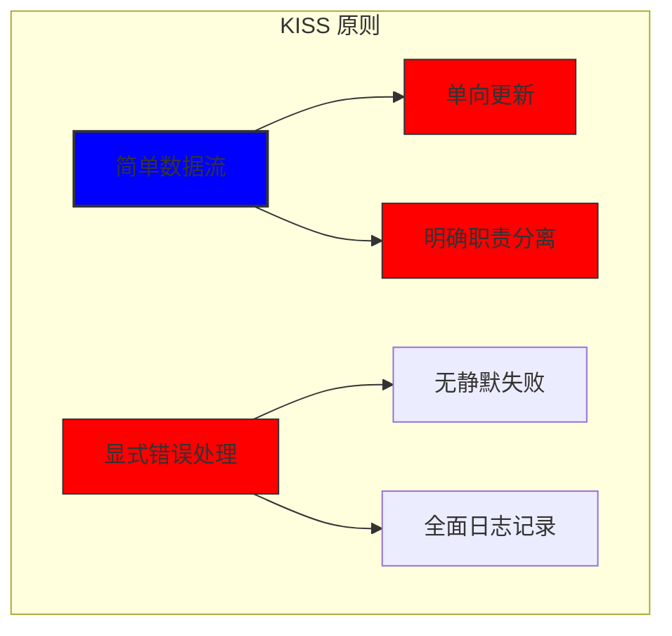

# 我们如何用 Stripe 和 PayPal 构建了一个强大的支付系统：三重奏方法 {#how-we-built-a-robust-payment-system-with-stripe-and-paypal-a-trifecta-approach}


## 目录 {#table-of-contents}

* [前言](#foreword)
* [挑战：多支付处理器，一个真实数据源](#the-challenge-multiple-payment-processors-one-source-of-truth)
* [三重奏方法：三层可靠性](#the-trifecta-approach-three-layers-of-reliability)
* [第一层：结账后重定向](#layer-1-post-checkout-redirects)
  * [Stripe 结账实现](#stripe-checkout-implementation)
  * [PayPal 支付流程](#paypal-payment-flow)
* [第二层：带签名验证的 Webhook 处理器](#layer-2-webhook-handlers-with-signature-verification)
  * [Stripe Webhook 实现](#stripe-webhook-implementation)
  * [PayPal Webhook 实现](#paypal-webhook-implementation)
* [第三层：使用 Bree 的自动化任务](#layer-3-automated-jobs-with-bree)
  * [订阅准确性检查器](#subscription-accuracy-checker)
  * [PayPal 订阅同步](#paypal-subscription-synchronization)
* [处理边缘情况](#handling-edge-cases)
  * [欺诈检测与防范](#fraud-detection-and-prevention)
  * [争议处理](#dispute-handling)
* [代码复用：KISS 和 DRY 原则](#code-reuse-kiss-and-dry-principles)
* [VISA 订阅要求实现](#visa-subscription-requirements-implementation)
  * [自动化续订前邮件通知](#automated-pre-renewal-email-notifications)
  * [处理边缘情况](#handling-edge-cases-1)
  * [试用期和订阅条款](#trial-periods-and-subscription-terms)
* [结论：我们的三重奏方法的优势](#conclusion-the-benefits-of-our-trifecta-approach)


## 前言 {#foreword}

在 Forward Email，我们始终优先打造可靠、准确且用户友好的系统。在实现我们的支付处理系统时，我们知道需要一个能够处理多支付处理器且保持数据完美一致性的解决方案。本文详细介绍了我们的开发团队如何采用三重奏方法集成 Stripe 和 PayPal，确保整个系统中 1:1 的实时准确性。


## 挑战：多支付处理器，一个真实数据源 {#the-challenge-multiple-payment-processors-one-source-of-truth}

作为一家注重隐私的邮件服务，我们希望为用户提供多种支付选项。有些用户偏好通过 Stripe 使用信用卡支付的简便性，而另一些用户则看重 PayPal 提供的额外隔离层。然而，支持多支付处理器带来了显著的复杂性：

1. 如何确保不同支付系统间数据的一致性？
2. 如何处理争议、退款或支付失败等边缘情况？
3. 如何在数据库中维护单一真实数据源？

我们的解决方案是实施所谓的“三重奏方法”——一个三层系统，提供冗余并确保无论发生什么都能保持数据一致性。


## 三重奏方法：三层可靠性 {#the-trifecta-approach-three-layers-of-reliability}

我们的支付系统由三个关键组件组成，协同工作以确保完美的数据同步：

1. **结账后重定向** - 在结账后立即捕获支付信息
2. **Webhook 处理器** - 处理支付处理器的实时事件
3. **自动化任务** - 定期验证和对账支付数据

让我们深入了解每个组件及其协作方式。


```mermaid
flowchart TD
    User([用户]) --> |选择套餐| Checkout[结账页面]

    %% 第一层：结账后重定向
    subgraph "第一层：结账后重定向"
        Checkout --> |信用卡| Stripe[Stripe 结账]
        Checkout --> |PayPal| PayPal[PayPal 支付]

        Stripe --> |带 session_id 的成功 URL| SuccessPage[成功页面]
        PayPal --> |返回 URL| SuccessPage

        SuccessPage --> |验证支付| Database[(数据库更新)]
    end

    %% 第二层：Webhook
    subgraph "第二层：Webhook 处理器"
        StripeEvents[Stripe 事件] --> |实时通知| StripeWebhook[Stripe Webhook 处理器]
        PayPalEvents[PayPal 事件] --> |实时通知| PayPalWebhook[PayPal Webhook 处理器]

        StripeWebhook --> |验证签名| ProcessStripeEvent[处理 Stripe 事件]
        PayPalWebhook --> |验证签名| ProcessPayPalEvent[处理 PayPal 事件]

        ProcessStripeEvent --> Database
        ProcessPayPalEvent --> Database
    end

    %% 第三层：自动化任务
    subgraph "第三层：Bree 自动化任务"
        BreeScheduler[Bree 调度器] --> StripeSync[Stripe 同步任务]
        BreeScheduler --> PayPalSync[PayPal 同步任务]
        BreeScheduler --> AccuracyCheck[订阅准确性检查]

        StripeSync --> |验证并对账| Database
        PayPalSync --> |验证并对账| Database
        AccuracyCheck --> |确保一致性| Database
    end

    %% 边缘情况
    subgraph "边缘情况处理"
        ProcessStripeEvent --> |欺诈检测| FraudCheck[欺诈检测]
        ProcessPayPalEvent --> |争议创建| DisputeHandler[争议处理]

        FraudCheck --> |若欺诈则封禁用户| Database
        DisputeHandler --> |接受申诉并退款| Database

        FraudCheck --> |发送警报| AdminNotification[管理员通知]
        DisputeHandler --> |发送警报| AdminNotification
    end

    %% 样式定义
    classDef primary fill:blue,stroke:#333,stroke-width:2px;
    classDef secondary fill:red,stroke:#333,stroke-width:1px;
    classDef tertiary fill:green,stroke:#333,stroke-width:1px;

    class Checkout,SuccessPage primary;
    class Stripe,PayPal,StripeWebhook,PayPalWebhook,BreeScheduler secondary;
    class FraudCheck,DisputeHandler tertiary;
```
## 第1层：结账后重定向 {#layer-1-post-checkout-redirects}

我们三管齐下方法的第一层发生在用户完成支付后。Stripe 和 PayPal 都提供机制，将用户连同交易信息重定向回我们的网站。

### Stripe 结账实现 {#stripe-checkout-implementation}

对于 Stripe，我们使用他们的 Checkout Sessions API 来创建无缝的支付体验。当用户选择一个套餐并选择用信用卡支付时，我们创建一个带有特定成功和取消 URL 的 Checkout Session：

```javascript
const options = {
  mode: paymentType === 'one-time' ? 'payment' : 'subscription',
  customer: ctx.state.user[config.userFields.stripeCustomerID],
  client_reference_id: reference,
  metadata: {
    plan
  },
  line_items: [
    {
      price,
      quantity: 1,
      description
    }
  ],
  locale: config.STRIPE_LOCALES.has(ctx.locale) ? ctx.locale : 'auto',
  cancel_url: `${config.urls.web}${ctx.path}${
    isMakePayment || isEnableAutoRenew ? '' : `/?plan=${plan}`
  }`,
  success_url: `${config.urls.web}${ctx.path}/?${
    isMakePayment || isEnableAutoRenew ? '' : `plan=${plan}&`
  }session_id={CHECKOUT_SESSION_ID}`,
  allow_promotion_codes: true
};

// Create the checkout session and redirect
const session = await stripe.checkout.sessions.create(options);
const redirectTo = session.url;
if (ctx.accepts('html')) {
  ctx.status = 303;
  ctx.redirect(redirectTo);
} else {
  ctx.body = { redirectTo };
}
```

这里关键部分是 `success_url` 参数，其中包含了作为查询参数的 `session_id`。当 Stripe 在支付成功后将用户重定向回我们的网站时，我们可以使用此会话 ID 来验证交易并相应地更新数据库。

### PayPal 支付流程 {#paypal-payment-flow}

对于 PayPal，我们使用类似的方法，调用他们的 Orders API：

```javascript
const requestBody = {
  intent: 'CAPTURE',
  application_context: {
    cancel_url: `${config.urls.web}${ctx.path}${
      isMakePayment || isEnableAutoRenew ? '' : `/?plan=${plan}`
    }`,
    return_url: `${config.urls.web}${ctx.path}/?plan=${plan}`,
    brand_name: 'Forward Email',
    shipping_preference: 'NO_SHIPPING',
    user_action: 'PAY_NOW'
  },
  payer: {
    email_address: ctx.state.user.email
  },
  purchase_units: [
    {
      reference_id: ctx.state.user.id,
      description,
      custom_id: sku,
      invoice_id: reference,
      soft_descriptor: sku,
      amount: {
        currency_code: 'USD',
        value: price,
        breakdown: {
          item_total: {
            currency_code: 'USD',
            value: price
          }
        }
      },
      items: [
        {
          name,
          description,
          sku,
          unit_amount: {
            currency_code: 'USD',
            value: price
          },
          quantity: '1',
          category: 'DIGITAL_GOODS'
        }
      ]
    }
  ]
};
```

与 Stripe 类似，我们指定了 `return_url` 和 `cancel_url` 参数来处理支付后的重定向。当 PayPal 将用户重定向回我们的网站时，我们可以捕获支付详情并更新数据库。


```mermaid
sequenceDiagram
    participant User
    participant FE as Forward Email
    participant Stripe
    participant PayPal
    participant DB as Database
    participant Bree as Bree Job Scheduler

    %% Initial checkout flow
    User->>FE: 选择套餐和支付方式

    alt 信用卡支付
        FE->>Stripe: 创建 Checkout Session
        Stripe-->>FE: 返回会话 URL
        FE->>User: 重定向到 Stripe 结账页面
        User->>Stripe: 完成支付
        Stripe->>User: 重定向到带有 session_id 的成功 URL
        User->>FE: 返回成功页面
        FE->>Stripe: 使用 session_id 验证会话
        Stripe-->>FE: 返回会话详情
        FE->>DB: 更新用户套餐和支付状态
    else PayPal 支付
        FE->>PayPal: 创建订单
        PayPal-->>FE: 返回审批 URL
        FE->>User: 重定向到 PayPal
        User->>PayPal: 批准支付
        PayPal->>User: 重定向到返回 URL
        User->>FE: 返回成功页面
        FE->>PayPal: 捕获支付
        PayPal-->>FE: 返回支付详情
        FE->>DB: 更新用户套餐和支付状态
    end

    %% Webhook flow (asynchronous)
    Note over Stripe,PayPal: 支付事件发生（异步）

    alt Stripe Webhook
        Stripe->>FE: 发送事件通知
        FE->>FE: 验证 webhook 签名
        FE->>DB: 处理事件并更新数据
        FE-->>Stripe: 确认接收（200 OK）
    else PayPal Webhook
        PayPal->>FE: 发送事件通知
        FE->>FE: 验证 webhook 签名
        FE->>DB: 处理事件并更新数据
        FE-->>PayPal: 确认接收（200 OK）
    end

    %% Bree automated jobs
    Note over Bree: 定时任务周期性运行

    Bree->>Stripe: 获取所有客户和订阅
    Stripe-->>Bree: 返回客户数据
    Bree->>DB: 比对并调和数据

    Bree->>PayPal: 获取所有订阅和交易
    PayPal-->>Bree: 返回订阅数据
    Bree->>DB: 比对并调和数据

    %% Edge case: Dispute handling
    Note over User,PayPal: 用户发起争议

    PayPal->>FE: DISPUTE.CREATED webhook
    FE->>PayPal: 自动接受申诉
    FE->>DB: 更新用户状态
    FE->>User: 发送通知邮件
```
## Layer 2: 带签名验证的 Webhook 处理程序 {#layer-2-webhook-handlers-with-signature-verification}

虽然结账后重定向适用于大多数场景，但它们并非万无一失。用户可能在重定向之前关闭浏览器，或者网络问题可能导致重定向未完成。这时就需要使用 webhook。

Stripe 和 PayPal 都提供 webhook 系统，实时发送有关支付事件的通知。我们实现了强大的 webhook 处理程序，验证这些通知的真实性并相应地处理它们。

### Stripe Webhook 实现 {#stripe-webhook-implementation}

我们的 Stripe webhook 处理程序验证传入 webhook 事件的签名，以确保其合法性：

```javascript
async function webhook(ctx) {
  const sig = ctx.request.get('stripe-signature');
  // throw an error if something was wrong
  if (!isSANB(sig))
    throw Boom.badRequest(ctx.translateError('INVALID_STRIPE_SIGNATURE'));
  const event = stripe.webhooks.constructEvent(
    ctx.request.rawBody,
    sig,
    env.STRIPE_ENDPOINT_SECRET
  );
  // throw an error if something was wrong
  if (!event)
    throw Boom.badRequest(ctx.translateError('INVALID_STRIPE_SIGNATURE'));
  ctx.logger.info('stripe webhook', { event });
  // return a response to acknowledge receipt of the event
  ctx.body = { received: true };
  // run in background
  processEvent(ctx, event)
    .then()
    .catch((err) => {
      ctx.logger.fatal(err, { event });
      // email admin errors
      emailHelper({
        template: 'alert',
        message: {
          to: config.email.message.from,
          subject: `Error with Stripe Webhook (Event ID ${event.id})`
        },
        locals: {
          message: `<pre><code>${safeStringify(
            parseErr(err),
            null,
            2
          )}</code></pre>`
        }
      })
        .then()
        .catch((err) => ctx.logger.fatal(err, { event }));
    });
}
```

`stripe.webhooks.constructEvent` 函数使用我们的端点密钥验证签名。如果签名有效，我们会异步处理事件，以避免阻塞 webhook 响应。

### PayPal Webhook 实现 {#paypal-webhook-implementation}

同样，我们的 PayPal webhook 处理程序验证传入通知的真实性：

```javascript
async function webhook(ctx) {
  const response = await promisify(
    paypal.notification.webhookEvent.verify,
    paypal.notification.webhookEvent
  )(ctx.request.headers, ctx.request.body, env.PAYPAL_WEBHOOK_ID);
  // throw an error if something was wrong
  if (!_.isObject(response) || response.verification_status !== 'SUCCESS')
    throw Boom.badRequest(ctx.translateError('INVALID_PAYPAL_SIGNATURE'));
  // return a response to acknowledge receipt of the event
  ctx.body = { received: true };
  // run in background
  processEvent(ctx)
    .then()
    .catch((err) => {
      ctx.logger.fatal(err);
      // email admin errors
      emailHelper({
        template: 'alert',
        message: {
          to: config.email.message.from,
          subject: `Error with PayPal Webhook (Event ID ${ctx.request.body.id})`
        },
        locals: {
          message: `<pre><code>${safeStringify(
            parseErr(err),
            null,
            2
          )}</code></pre>`
        }
      })
        .then()
        .catch((err) => ctx.logger.fatal(err));
    });
}
```

两个 webhook 处理程序遵循相同的模式：验证签名、确认接收并异步处理事件。这确保即使结账后重定向失败，我们也不会错过任何支付事件。

## Layer 3: 使用 Bree 的自动化任务 {#layer-3-automated-jobs-with-bree}

我们三层方法的最后一层是一组定期验证和对账支付数据的自动化任务。我们使用 Bree，这是一个 Node.js 的任务调度器，定期运行这些任务。

### 订阅准确性检查器 {#subscription-accuracy-checker}

我们的关键任务之一是订阅准确性检查器，它确保我们的数据库准确反映 Stripe 中的订阅状态：
```javascript
async function mapper(customer) {
  // wait a second to prevent rate limitation error
  await setTimeout(ms('1s'));
  // check for user on our side
  let user = await Users.findOne({
    [config.userFields.stripeCustomerID]: customer.id
  })
    .lean()
    .exec();
  if (!user) return;
  if (user.is_banned) return;

  // if emails did not match
  if (user.email !== customer.email) {
    logger.info(
      `User email ${user.email} did not match customer email ${customer.email} (${customer.id})`
    );
    customer = await stripe.customers.update(customer.id, {
      email: user.email
    });
    logger.info(`Updated user email to match ${user.email}`);
  }

  // check for active subscriptions
  const [activeSubscriptions, trialingSubscriptions] = await Promise.all([
    stripe.subscriptions.list({
      customer: customer.id,
      status: 'active'
    }),
    stripe.subscriptions.list({
      customer: customer.id,
      status: 'trialing'
    })
  ]);

  // Combine active and trialing subscriptions
  let subscriptions = [
    ...activeSubscriptions.data,
    ...trialingSubscriptions.data
  ];

  // Handle edge case: multiple subscriptions for one user
  if (subscriptions.length > 1) {
    await logger.error(
      new Error(
        `We may need to refund: User had multiple subscriptions ${user.email} (${customer.id})`
      )
    );
    await emailHelper({
      template: 'alert',
      message: {
        to: config.email.message.from,
        subject: `User had multiple subscriptions ${user.email}`
      },
      locals: {
        message: `User ${user.email} (${customer.id}) had multiple subscriptions: ${JSON.stringify(
          subscriptions.map((s) => s.id)
        )}`
      }
    });
  }
}
```

This job checks for discrepancies between our database and Stripe, such as mismatched email addresses or multiple active subscriptions. If it finds any issues, it logs them and sends alerts to our admin team.

### PayPal Subscription Synchronization {#paypal-subscription-synchronization}

We have a similar job for PayPal subscriptions:

```javascript
async function syncPayPalSubscriptionPayments() {
  const paypalCustomers = await Users.find({
    $or: [
      {
        [config.userFields.paypalSubscriptionID]: { $exists: true, $ne: null }
      },
      {
        [config.userFields.paypalPayerID]: { $exists: true, $ne: null }
      }
    ]
  })
    // sort by newest customers first
    .sort('-created_at')
    .lean()
    .exec();

  await logger.info(
    `Syncing payments for ${paypalCustomers.length} paypal customers`
  );

  // Process each customer and sync their payments
  const errorEmails = await pReduce(
    paypalCustomers,
    // Implementation details...
  );
}
```

These automated jobs serve as our final safety net, ensuring that our database always reflects the true state of subscriptions and payments in both Stripe and PayPal.


## Handling Edge Cases {#handling-edge-cases}

A robust payment system must handle edge cases gracefully. Let's look at how we handle some common scenarios.

### Fraud Detection and Prevention {#fraud-detection-and-prevention}

We've implemented sophisticated fraud detection mechanisms that automatically identify and handle suspicious payment activities:

```javascript
case 'charge.failed': {
  // Get all failed charges in the last 30 days
  const charges = await stripe.charges.list({
    customer: event.data.object.customer,
    created: {
      gte: dayjs().subtract(1, 'month').unix()
    }
  });

  // Filter for declined charges
  const filtered = charges.data.filter(
    (d) => d.status === 'failed' && d.failure_code === 'card_declined'
  );

  // if not more than 5 then return early
  if (filtered.length < 5) break;

  // Check if user has verified domains
  const count = await Domains.countDocuments({
    members: {
      $elemMatch: {
        user: user._id,
        group: 'admin'
      }
    },
    plan: { $in: ['enhanced_protection', 'team'] },
    has_txt_record: true
  });

  if (!user.is_banned) {
    // If no verified domains, ban the user and refund all charges
    if (count === 0) {
      // Ban the user
      user.is_banned = true;
      await user.save();

      // Refund all successful charges
    }
  }
}
```

此代码会自动禁止那些多次支付失败且没有验证域名的用户，这通常是欺诈行为的强烈信号。

### 争议处理 {#dispute-handling}

当用户对收费提出争议时，我们会自动接受申诉并采取相应措施：

```javascript
case 'CUSTOMER.DISPUTE.CREATED': {
  // 接受申诉
  const agent = await paypalAgent();
  await agent
    .post(`/v1/customer/disputes/${body.resource.dispute_id}/accept-claim`)
    .send({
      note: '向客户全额退款。'
    });

  // 在数据库中查找付款记录
  const payment = await Payments.findOne({ $or });
  if (!payment) throw new Error('付款记录不存在');

  const user = await Users.findById(payment.user);
  if (!user) throw new Error('客户对应的用户不存在');

  // 如果用户有订阅，则取消订阅
  if (isSANB(user[config.userFields.paypalSubscriptionID])) {
    try {
      const agent = await paypalAgent();
      await agent.post(
        `/v1/billing/subscriptions/${
          user[config.userFields.paypalSubscriptionID]
        }/cancel`
      );
    } catch (err) {
      // 处理订阅取消错误
    }
  }
}
```

这种方法最大限度地减少了争议对我们业务的影响，同时确保了良好的客户体验。


## 代码复用：KISS 和 DRY 原则 {#code-reuse-kiss-and-dry-principles}

在我们的支付系统中，我们始终遵循 KISS（保持简单，笨蛋）和 DRY（不要重复自己）原则。以下是一些示例：

1. **共享辅助函数**：我们为常见任务创建了可重用的辅助函数，如同步支付和发送邮件。

2. **一致的错误处理**：Stripe 和 PayPal 的 webhook 处理程序都使用相同的错误处理和管理员通知模式。

3. **统一的数据库模式**：我们的数据库模式设计兼容 Stripe 和 PayPal 数据，包含支付状态、金额和计划信息等通用字段。

4. **集中配置**：支付相关配置集中在一个文件中，方便更新价格和产品信息。


```mermaid
graph TD
    subgraph "代码复用模式"
        A[辅助函数] --> B[syncStripePaymentIntent]
        A --> C[syncPayPalOrderPaymentByPaymentId]
        A --> D[syncPayPalSubscriptionPaymentsByUser]
    end

    classDef primary fill:blue,stroke:#333,stroke-width:2px;
    classDef secondary fill:red,stroke:#333,stroke-width:1px;

    class A,P,V primary;
    class B,C,D,E,I,L,Q,R,S,W,X,Y,Z secondary;
```


```mermaid
graph TD
    subgraph "代码复用模式"
        E[错误处理] --> F[通用错误日志]
        E --> G[管理员邮件通知]
        E --> H[用户通知]
    end

    classDef primary fill:blue,stroke:#333,stroke-width:2px;
    classDef secondary fill:red,stroke:#333,stroke-width:1px;

    class A,P,V primary;
    class B,C,D,E,I,L,Q,R,S,W,X,Y,Z secondary;
```


```mermaid
graph TD
    subgraph "代码复用模式"
        I[配置] --> J[集中支付配置]
        I --> K[共享环境变量]
    end

    classDef primary fill:blue,stroke:#333,stroke-width:2px;
    classDef secondary fill:red,stroke:#333,stroke-width:1px;

    class A,P,V primary;
    class B,C,D,E,I,L,Q,R,S,W,X,Y,Z secondary;
```


```mermaid
graph TD
    subgraph "代码复用模式"
        L[Webhook 处理] --> M[签名验证]
        L --> N[异步事件处理]
        L --> O[后台处理]
    end

    classDef primary fill:blue,stroke:#333,stroke-width:2px;
    classDef secondary fill:red,stroke:#333,stroke-width:1px;

    class A,P,V primary;
    class B,C,D,E,I,L,Q,R,S,W,X,Y,Z secondary;
```


```mermaid
graph TD
    subgraph "KISS 原则"
        P[简单数据流] --> Q[单向更新]
        P --> R[明确职责分离]

        S[显式错误处理] --> T[无静默失败]
        S --> U[全面日志记录]
    end

    classDef primary fill:blue,stroke:#333,stroke-width:2px;
    classDef secondary fill:red,stroke:#333,stroke-width:1px;

    class A,P,V primary;
    class B,C,D,E,I,L,Q,R,S,W,X,Y,Z secondary;
```
graph TD
    subgraph "DRY 原则"
        V[共享逻辑] --> W[支付处理功能]
        V --> X[电子邮件模板]
        V --> Y[验证逻辑]

        Z[通用数据库操作] --> AA[用户更新]
        Z --> AB[支付记录]
    end

    classDef primary fill:blue,stroke:#333,stroke-width:2px;
    classDef secondary fill:red,stroke:#333,stroke-width:1px;

    class A,P,V primary;
    class B,C,D,E,I,L,Q,R,S,W,X,Y,Z secondary;
```


## VISA 订阅要求实现 {#visa-subscription-requirements-implementation}

除了我们的三管齐下方法外，我们还实现了特定功能以符合 VISA 的订阅要求，同时提升用户体验。VISA 的一项关键要求是，用户在被收取订阅费用之前必须收到通知，尤其是在从试用转为付费订阅时。

### 自动预续订邮件通知 {#automated-pre-renewal-email-notifications}

我们构建了一个自动化系统，识别拥有有效试用订阅的用户，并在首次收费前向他们发送通知邮件。这不仅使我们符合 VISA 要求，还减少了拒付率并提升了客户满意度。

以下是我们实现该功能的方式：

```javascript
// 查找拥有试用订阅且尚未收到通知的用户
const users = await Users.find({
  $or: [
    {
      $and: [
        { [config.userFields.stripeSubscriptionID]: { $exists: true } },
        { [config.userFields.stripeTrialSentAt]: { $exists: false } },
        // 排除已经有过付款的订阅
        ...(paidStripeSubscriptionIds.length > 0
          ? [
              {
                [config.userFields.stripeSubscriptionID]: {
                  $nin: paidStripeSubscriptionIds
                }
              }
            ]
          : [])
      ]
    },
    {
      $and: [
        { [config.userFields.paypalSubscriptionID]: { $exists: true } },
        { [config.userFields.paypalTrialSentAt]: { $exists: false } },
        // 排除已经有过付款的订阅
        ...(paidPayPalSubscriptionIds.length > 0
          ? [
              {
                [config.userFields.paypalSubscriptionID]: {
                  $nin: paidPayPalSubscriptionIds
                }
              }
            ]
          : [])
      ]
    }
  ]
});

// 处理每个用户并发送通知
for (const user of users) {
  // 从支付处理器获取订阅详情
  const subscription = await getSubscriptionDetails(user);

  // 计算订阅时长和频率
  const duration = getDurationFromPlanId(subscription.plan_id);
  const frequency = getHumanReadableFrequency(duration, user.locale);
  const amount = getPlanAmount(user.plan, duration);

  // 获取用户的域名以便个性化邮件
  const domains = await Domains.find({
    'members.user': user._id
  }).sort('name').lean().exec();

  // 发送符合 VISA 要求的通知邮件
  await emailHelper({
    template: 'visa-trial-subscription-requirement',
    message: {
      to: user.receipt_email || user.email,
      ...(user.receipt_email ? { cc: user.email } : {})
    },
    locals: {
      user,
      firstChargeDate: new Date(subscription.start_time),
      frequency,
      formattedAmount: numeral(amount).format('$0,0,0.00'),
      domains
    }
  });

  // 记录通知已发送
  await Users.findByIdAndUpdate(user._id, {
    $set: {
      [config.userFields.paypalTrialSentAt]: new Date()
    }
  });
}
```

此实现确保用户始终被告知即将发生的收费，且清晰说明：

1. 首次收费的时间
2. 未来收费的频率（月度、年度等）
3. 他们将被收取的确切金额
4. 订阅涵盖的域名

通过自动化此流程，我们完美遵守了 VISA 的要求（规定至少在收费前 7 天通知），同时减少了支持咨询并提升了整体用户体验。
### 处理边缘情况 {#handling-edge-cases-1}

我们的实现还包括强大的错误处理功能。如果通知过程中出现任何问题，我们的系统会自动提醒团队：

```javascript
try {
  await mapper(user);
} catch (err) {
  logger.error(err);

  // 发送警报给管理员
  await emailHelper({
    template: 'alert',
    message: {
      to: config.email.message.from,
      subject: 'VISA 试用订阅需求错误'
    },
    locals: {
      message: `<pre><code>${safeStringify(
        parseErr(err),
        null,
        2
      )}</code></pre>`
    }
  });
}
```

这确保即使通知系统出现问题，我们的团队也能迅速处理，保持符合 VISA 的要求。

VISA 订阅通知系统是我们如何构建支付基础设施的又一例证，兼顾合规性和用户体验，补充了我们的三重保障方法，确保支付处理的可靠性和透明度。

### 试用期和订阅条款 {#trial-periods-and-subscription-terms}

对于启用自动续订的现有计划用户，我们会计算合适的试用期，确保他们在当前计划到期前不会被收费：

```javascript
if (
  isEnableAutoRenew &&
  dayjs(ctx.state.user[config.userFields.planExpiresAt]).isAfter(
    dayjs()
  )
) {
  const hours = dayjs(
    ctx.state.user[config.userFields.planExpiresAt]
  ).diff(dayjs(), 'hours');

  // 处理试用期计算
}
```

我们还提供关于订阅条款的清晰信息，包括计费频率和取消政策，并在每个订阅中包含详细的元数据，以确保正确的跟踪和管理。

## 结论：我们的三重保障方法的优势 {#conclusion-the-benefits-of-our-trifecta-approach}

我们的三重保障支付处理方法带来了几个关键优势：

1. **可靠性**：通过实施三层支付验证，确保没有支付被遗漏或错误处理。

2. **准确性**：我们的数据库始终反映 Stripe 和 PayPal 中订阅和支付的真实状态。

3. **灵活性**：用户可以选择他们偏好的支付方式，同时不影响系统的可靠性。

4. **稳健性**：我们的系统能够优雅地处理各种边缘情况，从网络故障到欺诈行为。

如果您正在实现支持多支付处理器的支付系统，我们强烈推荐这种三重保障方法。虽然前期开发工作更多，但从长期来看，其在可靠性和准确性方面的优势非常值得。

欲了解有关 Forward Email 及我们注重隐私的电子邮件服务的更多信息，请访问我们的[网站](https://forwardemail.net)。

<!-- *关键词：支付处理，Stripe 集成，PayPal 集成，Webhook 处理，支付同步，订阅管理，防欺诈，争议处理，Node.js 支付系统，多处理器支付系统，支付网关集成，实时支付验证，支付数据一致性，订阅计费，支付安全，支付自动化，支付 Webhook，支付对账，支付边缘情况，支付错误处理，VISA 订阅要求，预续订通知，订阅合规* -->
