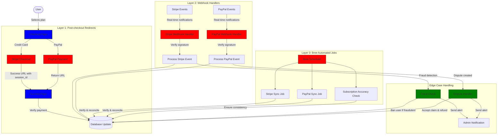
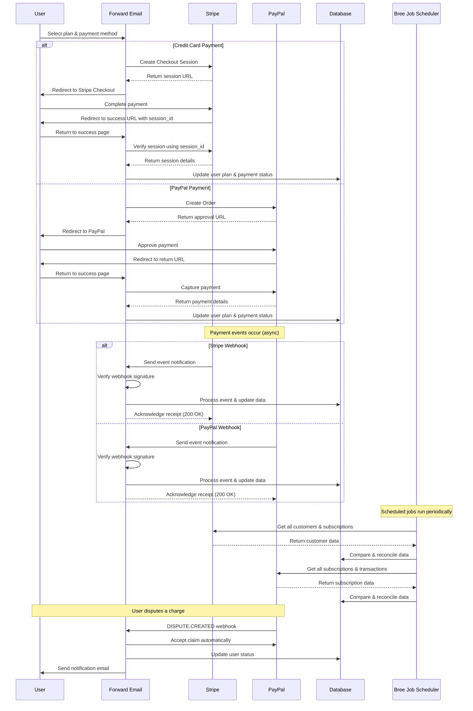
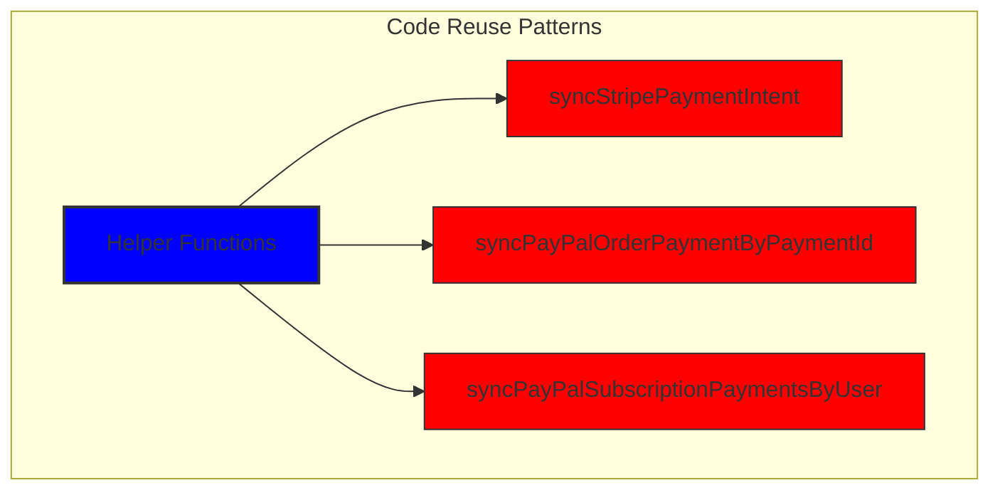
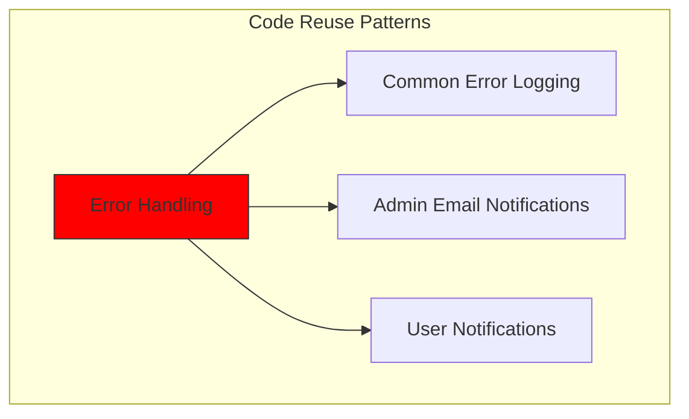
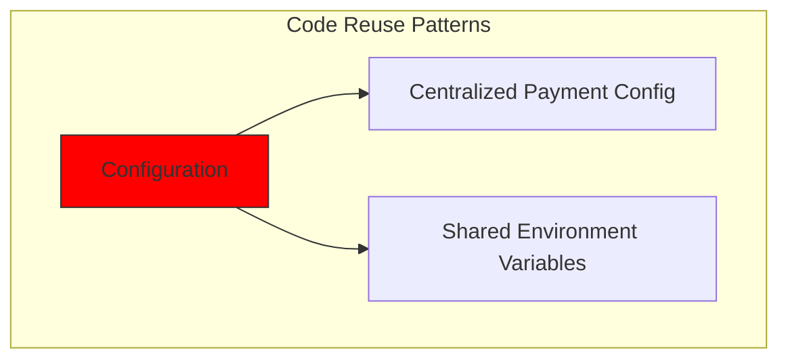
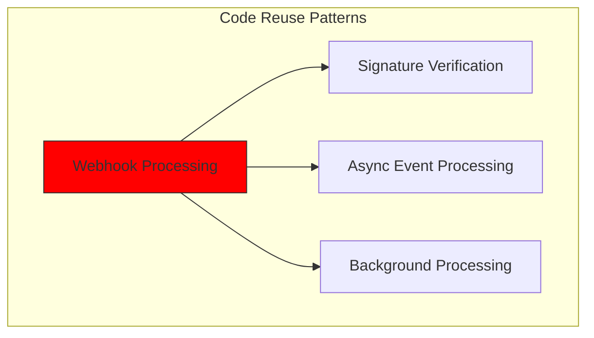
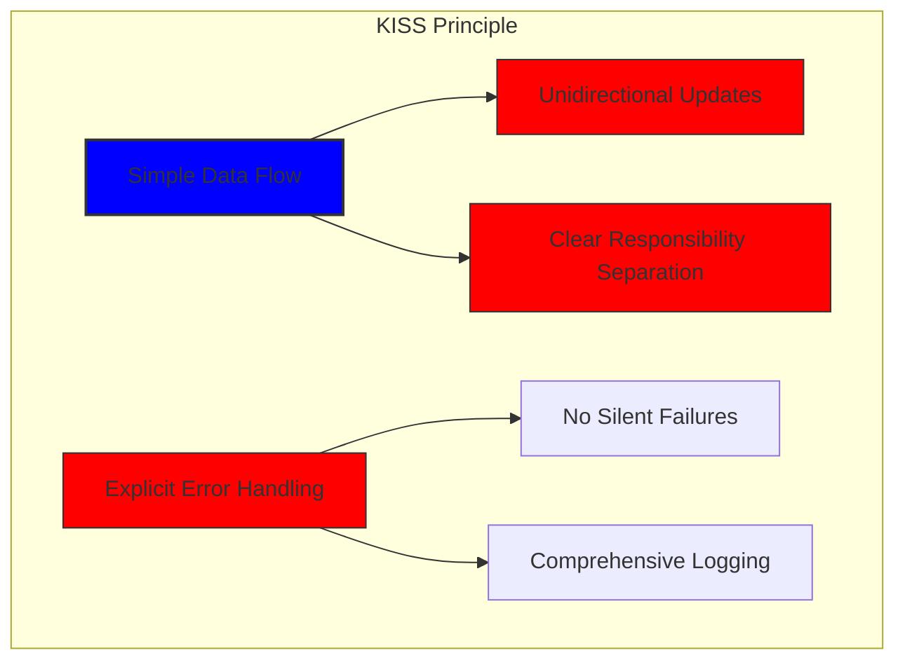
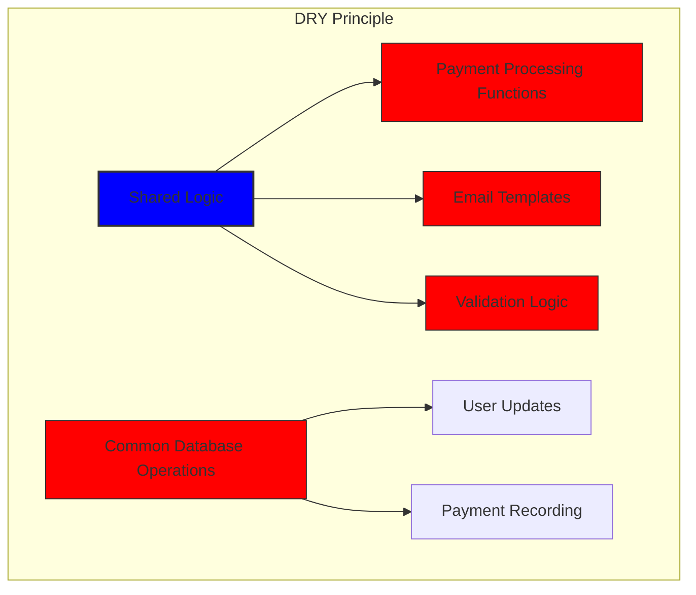

# How We Built a Robust Payment System with Stripe and PayPal: A Trifecta Approach


## Table of Contents

* [Foreword](#foreword)
* [The Challenge: Multiple Payment Processors, One Source of Truth](#the-challenge-multiple-payment-processors-one-source-of-truth)
* [The Trifecta Approach: Three Layers of Reliability](#the-trifecta-approach-three-layers-of-reliability)
* [Layer 1: Post-Checkout Redirects](#layer-1-post-checkout-redirects)
  * [Stripe Checkout Implementation](#stripe-checkout-implementation)
  * [PayPal Payment Flow](#paypal-payment-flow)
* [Layer 2: Webhook Handlers with Signature Verification](#layer-2-webhook-handlers-with-signature-verification)
  * [Stripe Webhook Implementation](#stripe-webhook-implementation)
  * [PayPal Webhook Implementation](#paypal-webhook-implementation)
* [Layer 3: Automated Jobs with Bree](#layer-3-automated-jobs-with-bree)
  * [Subscription Accuracy Checker](#subscription-accuracy-checker)
  * [PayPal Subscription Synchronization](#paypal-subscription-synchronization)
* [Handling Edge Cases](#handling-edge-cases)
  * [Fraud Detection and Prevention](#fraud-detection-and-prevention)
  * [Dispute Handling](#dispute-handling)
* [Code Reuse: KISS and DRY Principles](#code-reuse-kiss-and-dry-principles)
* [VISA Subscription Requirements Implementation](#visa-subscription-requirements-implementation)
  * [Automated Pre-Renewal Email Notifications](#automated-pre-renewal-email-notifications)
  * [Handling Edge Cases](#handling-edge-cases-1)
  * [Trial Periods and Subscription Terms](#trial-periods-and-subscription-terms)
* [Conclusion: The Benefits of Our Trifecta Approach](#conclusion-the-benefits-of-our-trifecta-approach)


## Foreword

At Forward Email, we've always prioritized creating systems that are reliable, accurate, and user-friendly. When it came to implementing our payment processing system, we knew we needed a solution that could handle multiple payment processors while maintaining perfect data consistency. This blog post details how our development team integrated both Stripe and PayPal using a trifecta approach that ensures 1:1 real-time accuracy across our entire system.


## The Challenge: Multiple Payment Processors, One Source of Truth

As a privacy-focused email service, we wanted to give our users payment options. Some prefer the simplicity of credit card payments through Stripe, while others value the additional layer of separation that PayPal provides. However, supporting multiple payment processors introduces significant complexity:

1. How do we ensure consistent data across different payment systems?
2. How do we handle edge cases like disputes, refunds, or failed payments?
3. How do we maintain a single source of truth in our database?

Our solution was to implement what we call the "trifecta approach" - a three-layered system that provides redundancy and ensures data consistency no matter what happens.


## The Trifecta Approach: Three Layers of Reliability

Our payment system consists of three critical components that work together to ensure perfect data synchronization:

1. **Post-checkout redirects** - Capturing payment information immediately after checkout
2. **Webhook handlers** - Processing real-time events from payment processors
3. **Automated jobs** - Periodically verifying and reconciling payment data

Let's dive into each component and see how they work together.




## Layer 1: Post-Checkout Redirects

The first layer of our trifecta approach happens immediately after a user completes a payment. Both Stripe and PayPal provide mechanisms to redirect users back to our site with transaction information.

### Stripe Checkout Implementation

For Stripe, we use their Checkout Sessions API to create a seamless payment experience. When a user selects a plan and chooses to pay with a credit card, we create a Checkout Session with specific success and cancel URLs:

```javascript
const options = {
  mode: paymentType === 'one-time' ? 'payment' : 'subscription',
  customer: ctx.state.user[config.userFields.stripeCustomerID],
  client_reference_id: reference,
  metadata: {
    plan
  },
  line_items: [
    {
      price,
      quantity: 1,
      description
    }
  ],
  locale: config.STRIPE_LOCALES.has(ctx.locale) ? ctx.locale : 'auto',
  cancel_url: `${config.urls.web}${ctx.path}${
    isMakePayment || isEnableAutoRenew ? '' : `/?plan=${plan}`
  }`,
  success_url: `${config.urls.web}${ctx.path}/?${
    isMakePayment || isEnableAutoRenew ? '' : `plan=${plan}&`
  }session_id={CHECKOUT_SESSION_ID}`,
  allow_promotion_codes: true
};

// Create the checkout session and redirect
const session = await stripe.checkout.sessions.create(options);
const redirectTo = session.url;
if (ctx.accepts('html')) {
  ctx.status = 303;
  ctx.redirect(redirectTo);
} else {
  ctx.body = { redirectTo };
}
```

The critical part here is the `success_url` parameter, which includes the `session_id` as a query parameter. When Stripe redirects the user back to our site after a successful payment, we can use this session ID to verify the transaction and update our database accordingly.

### PayPal Payment Flow

For PayPal, we use a similar approach with their Orders API:

```javascript
const requestBody = {
  intent: 'CAPTURE',
  application_context: {
    cancel_url: `${config.urls.web}${ctx.path}${
      isMakePayment || isEnableAutoRenew ? '' : `/?plan=${plan}`
    }`,
    return_url: `${config.urls.web}${ctx.path}/?plan=${plan}`,
    brand_name: 'Forward Email',
    shipping_preference: 'NO_SHIPPING',
    user_action: 'PAY_NOW'
  },
  payer: {
    email_address: ctx.state.user.email
  },
  purchase_units: [
    {
      reference_id: ctx.state.user.id,
      description,
      custom_id: sku,
      invoice_id: reference,
      soft_descriptor: sku,
      amount: {
        currency_code: 'USD',
        value: price,
        breakdown: {
          item_total: {
            currency_code: 'USD',
            value: price
          }
        }
      },
      items: [
        {
          name,
          description,
          sku,
          unit_amount: {
            currency_code: 'USD',
            value: price
          },
          quantity: '1',
          category: 'DIGITAL_GOODS'
        }
      ]
    }
  ]
};
```

Similar to Stripe, we specify `return_url` and `cancel_url` parameters to handle post-payment redirects. When PayPal redirects the user back to our site, we can capture the payment details and update our database.




## Layer 2: Webhook Handlers with Signature Verification

While post-checkout redirects work well for most scenarios, they're not foolproof. Users might close their browser before being redirected, or network issues might prevent the redirect from completing. That's where webhooks come in.

Both Stripe and PayPal provide webhook systems that send real-time notifications about payment events. We've implemented robust webhook handlers that verify the authenticity of these notifications and process them accordingly.

### Stripe Webhook Implementation

Our Stripe webhook handler verifies the signature of incoming webhook events to ensure they're legitimate:

```javascript
async function webhook(ctx) {
  const sig = ctx.request.get('stripe-signature');
  // throw an error if something was wrong
  if (!isSANB(sig))
    throw Boom.badRequest(ctx.translateError('INVALID_STRIPE_SIGNATURE'));
  const event = stripe.webhooks.constructEvent(
    ctx.request.rawBody,
    sig,
    env.STRIPE_ENDPOINT_SECRET
  );
  // throw an error if something was wrong
  if (!event)
    throw Boom.badRequest(ctx.translateError('INVALID_STRIPE_SIGNATURE'));
  ctx.logger.info('stripe webhook', { event });
  // return a response to acknowledge receipt of the event
  ctx.body = { received: true };
  // run in background
  processEvent(ctx, event)
    .then()
    .catch((err) => {
      ctx.logger.fatal(err, { event });
      // email admin errors
      emailHelper({
        template: 'alert',
        message: {
          to: config.email.message.from,
          subject: `Error with Stripe Webhook (Event ID ${event.id})`
        },
        locals: {
          message: `<pre><code>${safeStringify(
            parseErr(err),
            null,
            2
          )}</code></pre>`
        }
      })
        .then()
        .catch((err) => ctx.logger.fatal(err, { event }));
    });
}
```

The `stripe.webhooks.constructEvent` function verifies the signature using our endpoint secret. If the signature is valid, we process the event asynchronously to avoid blocking the webhook response.

### PayPal Webhook Implementation

Similarly, our PayPal webhook handler verifies the authenticity of incoming notifications:

```javascript
async function webhook(ctx) {
  const response = await promisify(
    paypal.notification.webhookEvent.verify,
    paypal.notification.webhookEvent
  )(ctx.request.headers, ctx.request.body, env.PAYPAL_WEBHOOK_ID);
  // throw an error if something was wrong
  if (!_.isObject(response) || response.verification_status !== 'SUCCESS')
    throw Boom.badRequest(ctx.translateError('INVALID_PAYPAL_SIGNATURE'));
  // return a response to acknowledge receipt of the event
  ctx.body = { received: true };
  // run in background
  processEvent(ctx)
    .then()
    .catch((err) => {
      ctx.logger.fatal(err);
      // email admin errors
      emailHelper({
        template: 'alert',
        message: {
          to: config.email.message.from,
          subject: `Error with PayPal Webhook (Event ID ${ctx.request.body.id})`
        },
        locals: {
          message: `<pre><code>${safeStringify(
            parseErr(err),
            null,
            2
          )}</code></pre>`
        }
      })
        .then()
        .catch((err) => ctx.logger.fatal(err));
    });
}
```

Both webhook handlers follow the same pattern: verify the signature, acknowledge receipt, and process the event asynchronously. This ensures that we never miss a payment event, even if the post-checkout redirect fails.


## Layer 3: Automated Jobs with Bree

The final layer of our trifecta approach is a set of automated jobs that periodically verify and reconcile payment data. We use Bree, a job scheduler for Node.js, to run these jobs at regular intervals.

### Subscription Accuracy Checker

One of our key jobs is the subscription accuracy checker, which ensures that our database accurately reflects the subscription status in Stripe:

```javascript
async function mapper(customer) {
  // wait a second to prevent rate limitation error
  await setTimeout(ms('1s'));
  // check for user on our side
  let user = await Users.findOne({
    [config.userFields.stripeCustomerID]: customer.id
  })
    .lean()
    .exec();
  if (!user) return;
  if (user.is_banned) return;

  // if emails did not match
  if (user.email !== customer.email) {
    logger.info(
      `User email ${user.email} did not match customer email ${customer.email} (${customer.id})`
    );
    customer = await stripe.customers.update(customer.id, {
      email: user.email
    });
    logger.info(`Updated user email to match ${user.email}`);
  }

  // check for active subscriptions
  const [activeSubscriptions, trialingSubscriptions] = await Promise.all([
    stripe.subscriptions.list({
      customer: customer.id,
      status: 'active'
    }),
    stripe.subscriptions.list({
      customer: customer.id,
      status: 'trialing'
    })
  ]);

  // Combine active and trialing subscriptions
  let subscriptions = [
    ...activeSubscriptions.data,
    ...trialingSubscriptions.data
  ];

  // Handle edge case: multiple subscriptions for one user
  if (subscriptions.length > 1) {
    await logger.error(
      new Error(
        `We may need to refund: User had multiple subscriptions ${user.email} (${customer.id})`
      )
    );
    await emailHelper({
      template: 'alert',
      message: {
        to: config.email.message.from,
        subject: `User had multiple subscriptions ${user.email}`
      },
      locals: {
        message: `User ${user.email} (${customer.id}) had multiple subscriptions: ${JSON.stringify(
          subscriptions.map((s) => s.id)
        )}`
      }
    });
  }
}
```

This job checks for discrepancies between our database and Stripe, such as mismatched email addresses or multiple active subscriptions. If it finds any issues, it logs them and sends alerts to our admin team.

### PayPal Subscription Synchronization

We have a similar job for PayPal subscriptions:

```javascript
async function syncPayPalSubscriptionPayments() {
  const paypalCustomers = await Users.find({
    $or: [
      {
        [config.userFields.paypalSubscriptionID]: { $exists: true, $ne: null }
      },
      {
        [config.userFields.paypalPayerID]: { $exists: true, $ne: null }
      }
    ]
  })
    // sort by newest customers first
    .sort('-created_at')
    .lean()
    .exec();

  await logger.info(
    `Syncing payments for ${paypalCustomers.length} paypal customers`
  );

  // Process each customer and sync their payments
  const errorEmails = await pReduce(
    paypalCustomers,
    // Implementation details...
  );
}
```

These automated jobs serve as our final safety net, ensuring that our database always reflects the true state of subscriptions and payments in both Stripe and PayPal.


## Handling Edge Cases

A robust payment system must handle edge cases gracefully. Let's look at how we handle some common scenarios.

### Fraud Detection and Prevention

We've implemented sophisticated fraud detection mechanisms that automatically identify and handle suspicious payment activities:

```javascript
case 'charge.failed': {
  // Get all failed charges in the last 30 days
  const charges = await stripe.charges.list({
    customer: event.data.object.customer,
    created: {
      gte: dayjs().subtract(1, 'month').unix()
    }
  });

  // Filter for declined charges
  const filtered = charges.data.filter(
    (d) => d.status === 'failed' && d.failure_code === 'card_declined'
  );

  // if not more than 5 then return early
  if (filtered.length < 5) break;

  // Check if user has verified domains
  const count = await Domains.countDocuments({
    members: {
      $elemMatch: {
        user: user._id,
        group: 'admin'
      }
    },
    plan: { $in: ['enhanced_protection', 'team'] },
    has_txt_record: true
  });

  if (!user.is_banned) {
    // If no verified domains, ban the user and refund all charges
    if (count === 0) {
      // Ban the user
      user.is_banned = true;
      await user.save();

      // Refund all successful charges
    }
  }
}
```

This code automatically bans users who have multiple failed charges and no verified domains, which is a strong indicator of fraudulent activity.

### Dispute Handling

When a user disputes a charge, we automatically accept the claim and take appropriate action:

```javascript
case 'CUSTOMER.DISPUTE.CREATED': {
  // accept claim
  const agent = await paypalAgent();
  await agent
    .post(`/v1/customer/disputes/${body.resource.dispute_id}/accept-claim`)
    .send({
      note: 'Full refund to the customer.'
    });

  // Find the payment in our database
  const payment = await Payments.findOne({ $or });
  if (!payment) throw new Error('Payment does not exist');

  const user = await Users.findById(payment.user);
  if (!user) throw new Error('User did not exist for customer');

  // Cancel the user's subscription if they have one
  if (isSANB(user[config.userFields.paypalSubscriptionID])) {
    try {
      const agent = await paypalAgent();
      await agent.post(
        `/v1/billing/subscriptions/${
          user[config.userFields.paypalSubscriptionID]
        }/cancel`
      );
    } catch (err) {
      // Handle subscription cancellation errors
    }
  }
}
```

This approach minimizes the impact of disputes on our business while ensuring a good customer experience.


## Code Reuse: KISS and DRY Principles

Throughout our payment system, we've adhered to the KISS (Keep It Simple, Stupid) and DRY (Don't Repeat Yourself) principles. Here are some examples:

1. **Shared Helper Functions**: We've created reusable helper functions for common tasks like syncing payments and sending emails.

2. **Consistent Error Handling**: Both Stripe and PayPal webhook handlers use the same pattern for error handling and admin notifications.

3. **Unified Database Schema**: Our database schema is designed to accommodate both Stripe and PayPal data, with common fields for payment status, amount, and plan information.

4. **Centralized Configuration**: Payment-related configuration is centralized in a single file, making it easy to update pricing and product information.














## VISA Subscription Requirements Implementation

In addition to our trifecta approach, we've implemented specific features to comply with VISA's subscription requirements while enhancing the user experience. One key requirement from VISA is that users must be notified before they're charged for a subscription, especially when transitioning from a trial to a paid subscription.

### Automated Pre-Renewal Email Notifications

We've built an automated system that identifies users with active trial subscriptions and sends them a notification email before their first charge occurs. This not only keeps us compliant with VISA requirements but also reduces chargebacks and improves customer satisfaction.

Here's how we implemented this feature:

```javascript
// Find users with trial subscriptions who haven't received a notification yet
const users = await Users.find({
  $or: [
    {
      $and: [
        { [config.userFields.stripeSubscriptionID]: { $exists: true } },
        { [config.userFields.stripeTrialSentAt]: { $exists: false } },
        // Exclude subscriptions that have already had payments
        ...(paidStripeSubscriptionIds.length > 0
          ? [
              {
                [config.userFields.stripeSubscriptionID]: {
                  $nin: paidStripeSubscriptionIds
                }
              }
            ]
          : [])
      ]
    },
    {
      $and: [
        { [config.userFields.paypalSubscriptionID]: { $exists: true } },
        { [config.userFields.paypalTrialSentAt]: { $exists: false } },
        // Exclude subscriptions that have already had payments
        ...(paidPayPalSubscriptionIds.length > 0
          ? [
              {
                [config.userFields.paypalSubscriptionID]: {
                  $nin: paidPayPalSubscriptionIds
                }
              }
            ]
          : [])
      ]
    }
  ]
});

// Process each user and send notification
for (const user of users) {
  // Get subscription details from payment processor
  const subscription = await getSubscriptionDetails(user);

  // Calculate subscription duration and frequency
  const duration = getDurationFromPlanId(subscription.plan_id);
  const frequency = getHumanReadableFrequency(duration, user.locale);
  const amount = getPlanAmount(user.plan, duration);

  // Get user's domains for personalized email
  const domains = await Domains.find({
    'members.user': user._id
  }).sort('name').lean().exec();

  // Send VISA-compliant notification email
  await emailHelper({
    template: 'visa-trial-subscription-requirement',
    message: {
      to: user.receipt_email || user.email,
      ...(user.receipt_email ? { cc: user.email } : {})
    },
    locals: {
      user,
      firstChargeDate: new Date(subscription.start_time),
      frequency,
      formattedAmount: numeral(amount).format('$0,0,0.00'),
      domains
    }
  });

  // Record that notification was sent
  await Users.findByIdAndUpdate(user._id, {
    $set: {
      [config.userFields.paypalTrialSentAt]: new Date()
    }
  });
}
```

This implementation ensures that users are always informed about upcoming charges, with clear details about:

1. When the first charge will occur
2. The frequency of future charges (monthly, yearly, etc.)
3. The exact amount they'll be charged
4. Which domains are covered by their subscription

By automating this process, we maintain perfect compliance with VISA's requirements (which mandate notification at least 7 days before charging) while reducing support inquiries and improving the overall user experience.

### Handling Edge Cases

Our implementation also includes robust error handling. If anything goes wrong during the notification process, our system automatically alerts our team:

```javascript
try {
  await mapper(user);
} catch (err) {
  logger.error(err);

  // Send alert to administrators
  await emailHelper({
    template: 'alert',
    message: {
      to: config.email.message.from,
      subject: 'VISA Trial Subscription Requirement Error'
    },
    locals: {
      message: `<pre><code>${safeStringify(
        parseErr(err),
        null,
        2
      )}</code></pre>`
    }
  });
}
```

This ensures that even if there's an issue with the notification system, our team can quickly address it and maintain compliance with VISA's requirements.

The VISA subscription notification system is another example of how we've built our payment infrastructure with both compliance and user experience in mind, complementing our trifecta approach to ensure reliable, transparent payment processing.

### Trial Periods and Subscription Terms

For users enabling auto-renew on existing plans, we calculate the appropriate trial period to ensure they're not charged until their current plan expires:

```javascript
if (
  isEnableAutoRenew &&
  dayjs(ctx.state.user[config.userFields.planExpiresAt]).isAfter(
    dayjs()
  )
) {
  const hours = dayjs(
    ctx.state.user[config.userFields.planExpiresAt]
  ).diff(dayjs(), 'hours');

  // Handle trial period calculation
}
```

We also provide clear information about subscription terms, including billing frequency and cancellation policies, and include detailed metadata with each subscription to ensure proper tracking and management.


## Conclusion: The Benefits of Our Trifecta Approach

Our trifecta approach to payment processing has provided several key benefits:

1. **Reliability**: By implementing three layers of payment verification, we ensure that no payment is missed or incorrectly processed.

2. **Accuracy**: Our database always reflects the true state of subscriptions and payments in both Stripe and PayPal.

3. **Flexibility**: Users can choose their preferred payment method without compromising the reliability of our system.

4. **Robustness**: Our system handles edge cases gracefully, from network failures to fraudulent activities.

If you're implementing a payment system that supports multiple processors, we highly recommend this trifecta approach. It requires more upfront development effort, but the long-term benefits in terms of reliability and accuracy are well worth it.

For more information about Forward Email and our privacy-focused email services, visit our [website](https://forwardemail.net).

<!-- *Keywords: payment processing, Stripe integration, PayPal integration, webhook handling, payment synchronization, subscription management, fraud prevention, dispute handling, Node.js payment system, multi-processor payment system, payment gateway integration, real-time payment verification, payment data consistency, subscription billing, payment security, payment automation, payment webhooks, payment reconciliation, payment edge cases, payment error handling, VISA subscription requirements, pre-renewal notifications, subscription compliance* -->
