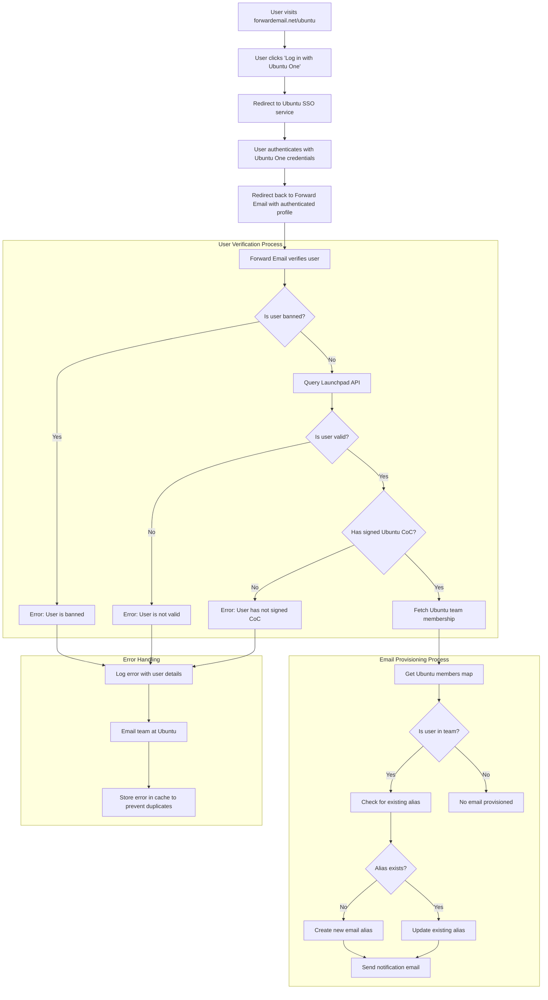

# دراسة حالة: كيف تدعم Canonical إدارة البريد الإلكتروني في Ubuntu باستخدام حل المؤسسة مفتوح المصدر من Forward Email {#case-study-how-canonical-powers-ubuntu-email-management-with-forward-emails-open-source-enterprise-solution}


## جدول المحتويات {#table-of-contents}

* [مقدمة](#foreword)
* [التحدي: إدارة نظام بيئي معقد للبريد الإلكتروني](#the-challenge-managing-a-complex-email-ecosystem)
* [النقاط الرئيسية](#key-takeaways)
* [لماذا إعادة توجيه البريد الإلكتروني](#why-forward-email)
* [التنفيذ: تكامل SSO السلس](#the-implementation-seamless-sso-integration)
  * [تصور تدفق المصادقة](#authentication-flow-visualization)
  * [تفاصيل التنفيذ الفني](#technical-implementation-details)
* [تكوين DNS وتوجيه البريد الإلكتروني](#dns-configuration-and-email-routing)
* [النتائج: إدارة بريد إلكتروني مبسطة وأمان معزز](#results-streamlined-email-management-and-enhanced-security)
  * [الكفاءة التشغيلية](#operational-efficiency)
  * [تعزيز الأمن والخصوصية](#enhanced-security-and-privacy)
  * [توفير التكاليف](#cost-savings)
  * [تحسين تجربة المساهمين](#improved-contributor-experience)
* [التطلع إلى المستقبل: استمرار التعاون](#looking-forward-continued-collaboration)
* [الخلاصة: شراكة مثالية مفتوحة المصدر](#conclusion-a-perfect-open-source-partnership)
* [دعم عملاء المؤسسات](#supporting-enterprise-clients)
  * [تواصل معنا](#get-in-touch)
  * [حول إعادة توجيه البريد الإلكتروني](#about-forward-email)

## مقدمة {#foreword}

في عالم البرمجيات مفتوحة المصدر، قلّما نجد أسماءً تُضاهي [قانوني](https://en.wikipedia.org/wiki/Canonical_\(company\)، الشركة التي تقف وراء [أوبونتو](https://en.wikipedia.org/wiki/Ubuntu)، إحدى أشهر توزيعات لينكس عالميًا. بفضل نظامها البيئي الواسع الذي يشمل توزيعات متعددة، بما في ذلك أوبونتو، و[حر](https://en.wikipedia.org/wiki/Kubuntu)، و[لوبنتو](https://en.wikipedia.org/wiki/Lubuntu)، و[إديوبونتو](https://en.wikipedia.org/wiki/Edubuntu)، وغيرها، واجهت كانونيكال تحديات فريدة في إدارة عناوين البريد الإلكتروني عبر نطاقاتها المتعددة. تستكشف دراسة الحالة هذه كيف تعاونت كانونيكال مع فورورد إيميل لإنشاء حل إدارة بريد إلكتروني سلس وآمن ومركّز على الخصوصية للمؤسسات، ويتماشى تمامًا مع قيمها مفتوحة المصدر.

## التحدي: إدارة نظام بيئي معقد للبريد الإلكتروني {#the-challenge-managing-a-complex-email-ecosystem}

يتميز نظام كانونيكال بتنوعه واتساع نطاقه. ومع وجود ملايين المستخدمين حول العالم وآلاف المساهمين في مشاريع متنوعة، شكّلت إدارة عناوين البريد الإلكتروني عبر نطاقات متعددة تحديات كبيرة. احتاج المساهمون الأساسيون إلى عناوين بريد إلكتروني رسمية (@ubuntu.com، @kubuntu.org، إلخ) تعكس مشاركتهم في المشروع، مع الحفاظ على الأمان وسهولة الاستخدام من خلال نظام إدارة نطاقات أوبونتو قوي.

قبل تنفيذ ميزة البريد الإلكتروني المباشر، واجهت Canonical صعوبات في:

* إدارة عناوين البريد الإلكتروني عبر نطاقات متعددة (@ubuntu.com، @kubuntu.org، @lubuntu.me، @edubuntu.org، و@ubuntu.net)
* توفير تجربة بريد إلكتروني متسقة للمساهمين الرئيسيين
* دمج خدمات البريد الإلكتروني مع نظام تسجيل الدخول الموحد (SSO) الحالي [أوبونتو ون](https://en.wikipedia.org/wiki/Ubuntu_One)
* إيجاد حل يتماشى مع التزامهم بالخصوصية والأمان وأمن البريد الإلكتروني مفتوح المصدر
* توسيع نطاق البنية التحتية الآمنة للبريد الإلكتروني بتكلفة معقولة

النقاط الرئيسية {#key-takeaways}}

* نجحت كانونيكال في تطبيق حل موحد لإدارة البريد الإلكتروني عبر نطاقات أوبونتو متعددة.
* يتوافق نهج Forward Email المفتوح المصدر بالكامل مع قيم كانونيكال تمامًا.
* يوفر تكامل SSO مع Ubuntu One مصادقة سلسة للمساهمين.
* يضمن التشفير المقاوم للكميات الكبيرة أمانًا طويل الأمد لجميع اتصالات البريد الإلكتروني.
* يتسع الحل بتكلفة معقولة لدعم قاعدة المساهمين المتنامية في كانونيكال.

## لماذا إعادة توجيه البريد الإلكتروني؟ {#why-forward-email}

بصفتنا مزود خدمة البريد الإلكتروني الوحيد مفتوح المصدر بنسبة 100%، مع التركيز على الخصوصية والأمان، كان Forward Email الخيار الأمثل لتلبية احتياجات Canonical في إعادة توجيه البريد الإلكتروني للمؤسسات. وتتوافق قيمنا تمامًا مع التزام Canonical بالبرمجيات مفتوحة المصدر والخصوصية.

ومن بين العوامل الرئيسية التي جعلت Forward Email الخيار الأمثل ما يلي:

١. **قاعدة بيانات مفتوحة المصدر بالكامل**: منصتنا مفتوحة المصدر بالكامل ومتاحة على [جيثب](https://en.wikipedia.org/wiki/GitHub)، مما يتيح الشفافية ومساهمات المجتمع. على عكس العديد من مزودي خدمات البريد الإلكتروني "المهتمين بالخصوصية" الذين يكتفون بفتح واجهاتهم الأمامية مع إبقاء واجهاتهم الخلفية مغلقة، فقد جعلنا قاعدة بياناتنا كاملةً - الواجهة الأمامية والخلفية - متاحةً للجميع للاطلاع عليها على [جيثب](https://github.com/forwardemail/forwardemail.net).

٢. **نهج يركز على الخصوصية**: بخلاف مقدمي الخدمات الآخرين، لا نخزن رسائل البريد الإلكتروني في قواعد بيانات مشتركة، ونستخدم تشفيرًا قويًا مع بروتوكول TLS. فلسفتنا الأساسية للخصوصية بسيطة: **رسائلك الإلكترونية ملك لك وحدك**. هذا المبدأ هو أساس كل قرار فني نتخذه، بدءًا من كيفية إعادة توجيه البريد الإلكتروني ووصولًا إلى كيفية تطبيق التشفير.

3. **عدم الاعتماد على جهات خارجية**: نحن لا نستخدم Amazon SES أو أي خدمات أخرى تابعة لجهات خارجية، مما يمنحنا سيطرة كاملة على البنية التحتية للبريد الإلكتروني ويقضي على تسربات الخصوصية المحتملة من خلال خدمات الجهات الخارجية.

4. **التوسع الفعال من حيث التكلفة**: يسمح نموذج التسعير الخاص بنا للمؤسسات بالتوسع دون دفع رسوم لكل مستخدم، مما يجعله مثاليًا لقاعدة المساهمين الكبيرة في Canonical.

٥. **تشفير مقاوم للكم**: نستخدم صناديق بريد SQLite مُشفّرة بشكل فردي، مع استخدام [تشاتشا20-بولي1305](https://en.wikipedia.org/wiki/ChaCha20-Poly1305) كشفرة لـ [التشفير المقاوم للكم](/blog/docs/best-quantum-safe-encrypted-email-service). كل صندوق بريد هو ملف مُشفّر منفصل، مما يعني أن الوصول إلى بيانات مستخدم واحد لا يمنح الآخرين حق الوصول.

## التنفيذ: تكامل SSO سلس {#the-implementation-seamless-sso-integration}

كان من أهم جوانب التنفيذ التكامل مع نظام تسجيل الدخول الأحادي (SSO) الحالي من كانونيكال، Ubuntu One. سيسمح هذا التكامل للمساهمين الأساسيين بإدارة عناوين بريدهم الإلكتروني @ubuntu.com باستخدام بيانات اعتماد Ubuntu One الحالية.

### تصور تدفق المصادقة {#authentication-flow-visualization}

يوضح الرسم التخطيطي التالي التدفق الكامل للمصادقة وتوفير البريد الإلكتروني:



### تفاصيل التنفيذ الفني لـ {#technical-implementation-details}

تم تحقيق التكامل بين نظامي Forward Email وUbuntu One SSO من خلال تطبيق مُخصص لاستراتيجية مصادقة Passport-Ubuntu. وقد سمح ذلك بتدفق مصادقة سلس بين نظامي Ubuntu One وForward Email.

#### تدفق المصادقة {#the-authentication-flow}

تتم عملية المصادقة على النحو التالي:

١. يزور المستخدمون صفحة إدارة بريد أوبونتو الإلكتروني المخصصة على [forwardemail.net/ubuntu](https://forwardemail.net/ubuntu).
٢. ينقرون على "تسجيل الدخول باستخدام أوبونتو ون" ويُعاد توجيههم إلى خدمة تسجيل الدخول الموحد (SSO) لأوبونتو.
٣. بعد المصادقة باستخدام بيانات اعتماد أوبونتو ون، يُعاد توجيههم إلى خدمة "إعادة توجيه البريد الإلكتروني" باستخدام ملفهم الشخصي المُصادق عليه.
٤. تتحقق خدمة "إعادة توجيه البريد الإلكتروني" من حالة مساهميهم وصلاحياتهم، أو تُدير عنوان بريدهم الإلكتروني وفقًا لذلك.

استفاد التنفيذ الفني من حزمة [`passport-ubuntu`](https://www.npmjs.com/package/passport-ubuntu)، وهي استراتيجية [جواز سفر](https://www.npmjs.com/package/passport) للمصادقة مع أوبونتو باستخدام [معرف مفتوح](https://en.wikipedia.org/wiki/OpenID). تضمن التكوين ما يلي:

```javascript
passport.use(new UbuntuStrategy({
  returnURL: process.env.UBUNTU_CALLBACK_URL,
  realm: process.env.UBUNTU_REALM,
  stateless: true
}, function(identifier, profile, done) {
  // User verification and email provisioning logic
}));
```

#### تكامل واجهة برمجة التطبيقات والتحقق منها في Launchpad {#launchpad-api-integration-and-validation}

يُعدّ التكامل مع واجهة برمجة التطبيقات (API) الخاصة بـ [منصة الإطلاق](https://en.wikipedia.org/wiki/Launchpad_\(website\) للتحقق من صحة مستخدمي أوبونتو وعضويات فرقهم أحد المكونات الأساسية لتطبيقنا. وقد أنشأنا دوال مساعدة قابلة لإعادة الاستخدام لإدارة هذا التكامل بكفاءة وموثوقية.

دالة المساعدة `sync-ubuntu-user.js` مسؤولة عن التحقق من صحة المستخدمين عبر واجهة برمجة تطبيقات Launchpad وإدارة عناوين بريدهم الإلكتروني. إليك شرح مبسط لكيفية عملها:

```javascript
async function syncUbuntuUser(user, map) {
  try {
    // Validate user object
    if (!_.isObject(user) ||
        !isSANB(user[fields.ubuntuUsername]) ||
        !isSANB(user[fields.ubuntuProfileID]) ||
        !isEmail(user.email))
      throw new TypeError('Invalid user object');

    // Get Ubuntu members map if not provided
    if (!(map instanceof Map))
      map = await getUbuntuMembersMap(resolver);

    // Check if user is banned
    if (user[config.userFields.isBanned]) {
      throw new InvalidUbuntuUserError('User was banned', { ignoreHook: true });
    }

    // Query Launchpad API to validate user
    const url = `https://api.launchpad.net/1.0/~${user[fields.ubuntuUsername]}`;
    const response = await retryRequest(url, { resolver });
    const json = await response.body.json();

    // Validate required boolean properties
    if (!json.is_valid)
      throw new InvalidUbuntuUserError('Property "is_valid" was false');

    if (!json.is_ubuntu_coc_signer)
      throw new InvalidUbuntuUserError('Property "is_ubuntu_coc_signer" was false');

    // Process each domain for the user
    await pMap([...map.keys()], async (name) => {
      // Find domain in database
      const domain = await Domains.findOne({
        name,
        plan: 'team',
        has_txt_record: true
      }).populate('members.user');

      // Process user's email alias for this domain
      if (map.get(name).has(user[fields.ubuntuUsername])) {
        // User is a member of this team, create or update alias
        let alias = await Aliases.findOne({
          user: user._id,
          domain: domain._id,
          name: user[fields.ubuntuUsername].toLowerCase()
        });

        if (!alias) {
          // Create new alias with appropriate error handling
          alias = await Aliases.create({
            user: user._id,
            domain: domain._id,
            name: user[fields.ubuntuUsername].toLowerCase(),
            recipients: [user.email],
            locale: user[config.lastLocaleField],
            is_enabled: true
          });

          // Notify admins about new alias creation
          await emailHelper({
            template: 'alert',
            message: {
              to: adminEmailsForDomain,
              subject: `New @${domain.name} email address created`
            },
            locals: {
              message: `A new email address ${user[fields.ubuntuUsername].toLowerCase()}@${domain.name} was created for ${user.email}`
            }
          });
        }
      }
    });

    return true;
  } catch (err) {
    // Handle and log errors
    await logErrorWithUser(err, user);
    throw err;
  }
}
```

لتبسيط إدارة عضويات الفريق عبر نطاقات Ubuntu المختلفة، قمنا بإنشاء تعيين مباشر بين أسماء النطاقات وفرق Launchpad المقابلة لها:

```javascript
ubuntuTeamMapping: {
  'ubuntu.com': '~ubuntumembers',
  'kubuntu.org': '~kubuntu-members',
  'lubuntu.me': '~lubuntu-members',
  'edubuntu.org': '~edubuntu-members',
  'ubuntustudio.com': '~ubuntustudio-core',
  'ubuntu.net': '~ubuntu-smtp-test'
},
```

تتيح لنا هذه الخريطة البسيطة أتمتة عملية التحقق من عضوية الفريق وتوفير عناوين البريد الإلكتروني، مما يجعل النظام سهل الصيانة والتوسع مع إضافة نطاقات جديدة.

#### معالجة الأخطاء والإشعارات {#error-handling-and-notifications}

لقد قمنا بتنفيذ نظام قوي لمعالجة الأخطاء والذي:

١. تسجيل جميع الأخطاء مع معلومات المستخدم المفصلة.
٢. إرسال بريد إلكتروني إلى فريق أوبونتو عند اكتشاف أي مشاكل.
٣. إخطار المسؤولين عند تسجيل مساهمين جدد وإنشاء عناوين بريد إلكتروني لهم.
٤. التعامل مع الحالات الطارئة، مثل المستخدمين الذين لم يوقعوا على مدونة قواعد سلوك أوبونتو.

ويضمن هذا تحديد أي مشكلات ومعالجتها بسرعة، والحفاظ على سلامة نظام البريد الإلكتروني.

## تكوين DNS وتوجيه البريد الإلكتروني {#dns-configuration-and-email-routing}

بالنسبة لكل نطاق تتم إدارته من خلال إعادة توجيه البريد الإلكتروني، أضافت Canonical سجل DNS TXT بسيطًا للتحقق من الصحة:

```sh
❯ dig ubuntu.com txt
ubuntu.com.             600     IN      TXT     "forward-email-site-verification=6IsURgl2t7"
```

يؤكد سجل التحقق هذا ملكية النطاق، ويُمكّن نظامنا من إدارة البريد الإلكتروني لهذه النطاقات بأمان. تُوجّه Canonical البريد عبر خدمتنا عبر Postfix، الذي يوفر بنية تحتية موثوقة وآمنة لتسليم البريد الإلكتروني.

## النتائج: إدارة بريد إلكتروني مبسطة وأمان معزز {#results-streamlined-email-management-and-enhanced-security}

أدى تنفيذ حل المؤسسة من Forward Email إلى تقديم فوائد كبيرة لإدارة البريد الإلكتروني لشركة Canonical عبر جميع نطاقاتها:

### الكفاءة التشغيلية {#operational-efficiency}

* **إدارة مركزية**: تُدار جميع نطاقات أوبونتو الآن من خلال واجهة واحدة.
* **تكاليف إدارية أقل**: توفير آلي وإدارة ذاتية الخدمة للمساهمين.
* **إعداد مبسط**: يمكن للمساهمين الجدد الحصول على عناوين بريدهم الإلكتروني الرسمية بسرعة.

### تعزيز الأمان والخصوصية {#enhanced-security-and-privacy}

* **تشفير شامل**: جميع رسائل البريد الإلكتروني مشفرة باستخدام معايير متقدمة.
* **لا قواعد بيانات مشتركة**: تُخزّن رسائل البريد الإلكتروني لكل مستخدم في قواعد بيانات SQLite مشفرة بشكل فردي، مما يوفر نهج تشفير معزولًا وأكثر أمانًا من قواعد البيانات العلائقية المشتركة التقليدية.
* **أمان مفتوح المصدر**: قاعدة بيانات شفافة تسمح بمراجعات أمنية من قِبل المجتمع.
* **معالجة في الذاكرة**: لا نخزن رسائل البريد الإلكتروني المُعاد توجيهها على القرص، مما يُعزز حماية الخصوصية.
* **لا تخزين للبيانات الوصفية**: لا نحتفظ بسجلات لمن يُراسل، على عكس العديد من مزودي خدمات البريد الإلكتروني.

### توفير التكاليف {#cost-savings}

* **نموذج تسعير قابل للتطوير**: لا رسوم لكل مستخدم، مما يسمح لشركة Canonical بإضافة مساهمين دون زيادة التكاليف.
* **احتياجات بنية تحتية أقل**: لا حاجة لصيانة خوادم بريد إلكتروني منفصلة لنطاقات مختلفة.
* **متطلبات دعم أقل**: تُقلل إدارة الخدمة الذاتية من طلبات دعم تكنولوجيا المعلومات.

### تحسين تجربة المساهم {#improved-contributor-experience}

* **مصادقة سلسة**: تسجيل دخول واحد باستخدام بيانات اعتماد Ubuntu One الحالية.
* **هوية تجارية متسقة**: تجربة موحدة عبر جميع الخدمات المتعلقة بأوبونتو.
* **توصيل بريد إلكتروني موثوق به**: تضمن سمعة IP عالية الجودة وصول رسائل البريد الإلكتروني إلى وجهتها.

أدى التكامل مع Forward Email إلى تبسيط عملية إدارة البريد الإلكتروني في Canonical بشكل ملحوظ. أصبح بإمكان المساهمين الآن إدارة عناوين بريدهم الإلكتروني @ubuntu.com بسلاسة تامة، مع تقليل التكاليف الإدارية وتعزيز الأمان.

## نتطلع إلى المستقبل: استمرار التعاون {#looking-forward-continued-collaboration}

تستمر الشراكة بين كانونيكال وفوروارد إيميل في التطور. نعمل معًا على عدة مبادرات:

* توسيع خدمات البريد الإلكتروني لتشمل نطاقات إضافية مرتبطة بنظام أوبونتو
* تحسين واجهة المستخدم بناءً على ملاحظات المساهمين
* تطبيق ميزات أمان إضافية
* استكشاف طرق جديدة للاستفادة من تعاوننا في مجال المصادر المفتوحة

## الخاتمة: شراكة مثالية مفتوحة المصدر {#conclusion-a-perfect-open-source-partnership}

يُظهر التعاون بين كانونيكال وفوروارد إيميل قوة الشراكات القائمة على قيم مشتركة. باختيارها فوروارد إيميل كمزود خدمة بريد إلكتروني، وجدت كانونيكال حلاً لا يلبي متطلباتها التقنية فحسب، بل يتماشى تمامًا مع التزامها بالبرمجيات مفتوحة المصدر والخصوصية والأمان.

للمؤسسات التي تدير نطاقات متعددة وتحتاج إلى مصادقة سلسة مع الأنظمة الحالية، يوفر Forward Email حلاً مرنًا وآمنًا يركز على الخصوصية. يضمن [نهج مفتوح المصدر](https://forwardemail.net/blog/docs/why-open-source-email-security-privacy) الشفافية ويسمح بمساهمات المجتمع، مما يجعله خيارًا مثاليًا للمؤسسات التي تُقدّر هذه المبادئ.

وبينما تواصل كل من Canonical وForward Email الابتكار في مجالاتهما الخاصة، فإن هذه الشراكة تمثل شهادة على قوة التعاون مفتوح المصدر والقيم المشتركة في إنشاء حلول فعالة.

يمكنك التحقق من [حالة الخدمة في الوقت الفعلي](https://status.forwardemail.net) لمعرفة أداء تسليم البريد الإلكتروني الحالي لدينا، والذي نراقبه باستمرار لضمان سمعة IP عالية الجودة وإمكانية تسليم البريد الإلكتروني.

## دعم عملاء المؤسسة {#supporting-enterprise-clients}

في حين تركز دراسة الحالة هذه على شراكتنا مع Canonical، تدعم Forward Email بكل فخر العديد من عملاء المؤسسات عبر مختلف الصناعات الذين يقدرون التزامنا بالخصوصية والأمان ومبادئ المصدر المفتوح.

تم تصميم حلولنا المؤسسية لتلبية الاحتياجات المحددة للمؤسسات من جميع الأحجام، وتقدم:

* نطاق مخصص [إدارة البريد الإلكتروني](/) عبر نطاقات متعددة
* تكامل سلس مع أنظمة المصادقة الحالية
* قناة دعم دردشة Matrix مخصصة
* ميزات أمان مُحسّنة، بما في ذلك [التشفير المقاوم للكم](/blog/docs/best-quantum-safe-encrypted-email-service)
* إمكانية نقل البيانات وملكيتها بالكامل
* بنية تحتية مفتوحة المصدر بالكامل لضمان الشفافية والثقة

### تواصل معنا {#get-in-touch}

إذا كانت مؤسستك لديها احتياجات بريد إلكتروني مؤسسية أو كنت مهتمًا بمعرفة المزيد حول كيفية مساعدة Forward Email في تبسيط إدارة البريد الإلكتروني لديك مع تعزيز الخصوصية والأمان، فسنكون سعداء بسماع رأيك:

* راسلنا مباشرةً على `support@forwardemail.net`
* أرسل طلب مساعدة على [صفحة المساعدة](https://forwardemail.net/help)
* راجع [صفحة التسعير](https://forwardemail.net/pricing) لخطط المؤسسات

فريقنا جاهز لمناقشة متطلباتك المحددة وتطوير حل مخصص يتماشى مع قيم مؤسستك واحتياجاتها الفنية.

### حول إعادة توجيه البريد الإلكتروني {#about-forward-email}

إعادة توجيه البريد الإلكتروني هي خدمة بريد إلكتروني مفتوحة المصدر بالكامل، تُركز على الخصوصية. نوفر إعادة توجيه البريد الإلكتروني لنطاق مخصص، وخدمات SMTP وIMAP وPOP3، مع التركيز على الأمان والخصوصية والشفافية. قاعدة بياناتنا البرمجية كاملةً متاحة على [جيثب](https://github.com/forwardemail/forwardemail.net)، ونلتزم بتقديم خدمات بريد إلكتروني تحترم خصوصية المستخدم وأمانه. تعرّف على المزيد حول [لماذا البريد الإلكتروني مفتوح المصدر هو المستقبل](https://forwardemail.net/blog/docs/why-open-source-email-security-privacy) و[كيف تعمل خدمة إعادة توجيه البريد الإلكتروني لدينا](https://forwardemail.net/blog/docs/best-email-forwarding-service) و[نهجنا لحماية خصوصية البريد الإلكتروني](https://forwardemail.net/blog/docs/email-privacy-protection-technical-implementation).