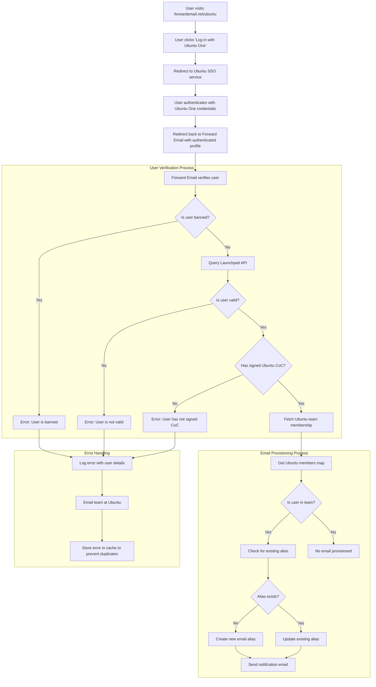

# دراسة حالة: كيف تدير Canonical بريد Ubuntu الإلكتروني باستخدام حل المؤسسات مفتوح المصدر من Forward Email {#case-study-how-canonical-powers-ubuntu-email-management-with-forward-emails-open-source-enterprise-solution}


## جدول المحتويات {#table-of-contents}

* [مقدمة](#foreword)
* [التحدي: إدارة نظام بريد إلكتروني معقد](#the-challenge-managing-a-complex-email-ecosystem)
* [النقاط الرئيسية](#key-takeaways)
* [لماذا Forward Email](#why-forward-email)
* [التنفيذ: تكامل سلس لتسجيل الدخول الموحد](#the-implementation-seamless-sso-integration)
  * [تصور تدفق المصادقة](#authentication-flow-visualization)
  * [تفاصيل التنفيذ التقنية](#technical-implementation-details)
* [تكوين DNS وتوجيه البريد الإلكتروني](#dns-configuration-and-email-routing)
* [النتائج: إدارة بريد إلكتروني مبسطة وأمان معزز](#results-streamlined-email-management-and-enhanced-security)
  * [الكفاءة التشغيلية](#operational-efficiency)
  * [تعزيز الأمان والخصوصية](#enhanced-security-and-privacy)
  * [توفير التكاليف](#cost-savings)
  * [تحسين تجربة المساهمين](#improved-contributor-experience)
* [نظرة مستقبلية: استمرار التعاون](#looking-forward-continued-collaboration)
* [الخاتمة: شراكة مفتوحة المصدر مثالية](#conclusion-a-perfect-open-source-partnership)
* [دعم عملاء المؤسسات](#supporting-enterprise-clients)
  * [تواصل معنا](#get-in-touch)
  * [حول Forward Email](#about-forward-email)


## مقدمة {#foreword}

في عالم البرمجيات مفتوحة المصدر، قليل من الأسماء تحمل وزنًا مثل [Canonical](https://en.wikipedia.org/wiki/Canonical_\(company\))، الشركة وراء [Ubuntu](https://en.wikipedia.org/wiki/Ubuntu)، واحدة من أكثر توزيعات لينكس شعبية على مستوى العالم. مع نظام بيئي واسع يشمل توزيعات متعددة مثل Ubuntu، [Kubuntu](https://en.wikipedia.org/wiki/Kubuntu)، [Lubuntu](https://en.wikipedia.org/wiki/Lubuntu)، [Edubuntu](https://en.wikipedia.org/wiki/Edubuntu)، وغيرها، واجهت Canonical تحديات فريدة في إدارة عناوين البريد الإلكتروني عبر نطاقاتها العديدة. تستعرض هذه الدراسة كيف تعاونت Canonical مع Forward Email لإنشاء حل إدارة بريد إلكتروني مؤسسي سلس وآمن ويركز على الخصوصية يتماشى تمامًا مع قيمهم مفتوحة المصدر.


## التحدي: إدارة نظام بريد إلكتروني معقد {#the-challenge-managing-a-complex-email-ecosystem}

نظام Canonical البيئي متنوع وواسع. مع ملايين المستخدمين حول العالم وآلاف المساهمين عبر مشاريع مختلفة، شكلت إدارة عناوين البريد الإلكتروني عبر نطاقات متعددة تحديات كبيرة. كان المساهمون الأساسيون بحاجة إلى عناوين بريد إلكتروني رسمية (@ubuntu.com، @kubuntu.org، إلخ) تعكس مشاركتهم في المشروع مع الحفاظ على الأمان وسهولة الاستخدام من خلال نظام إدارة نطاقات Ubuntu قوي.

قبل تنفيذ Forward Email، كانت Canonical تواجه صعوبات في:

* إدارة عناوين البريد الإلكتروني عبر نطاقات متعددة (@ubuntu.com، @kubuntu.org، @lubuntu.me، @edubuntu.org، و @ubuntu.net)
* توفير تجربة بريد إلكتروني متسقة للمساهمين الأساسيين
* دمج خدمات البريد الإلكتروني مع نظام تسجيل الدخول الموحد (SSO) الحالي الخاص بهم [Ubuntu One](https://en.wikipedia.org/wiki/Ubuntu_One)
* إيجاد حل يتماشى مع التزامهم بالخصوصية والأمان وأمن البريد الإلكتروني مفتوح المصدر
* توسيع بنيتهم التحتية للبريد الإلكتروني الآمن بطريقة فعالة من حيث التكلفة


## النقاط الرئيسية {#key-takeaways}

* نجحت Canonical في تنفيذ حل موحد لإدارة البريد الإلكتروني عبر نطاقات Ubuntu متعددة
* نهج Forward Email المفتوح المصدر 100% تماشى تمامًا مع قيم Canonical
* يوفر تكامل تسجيل الدخول الموحد مع Ubuntu One مصادقة سلسة للمساهمين
* التشفير المقاوم للحوسبة الكمومية يضمن أمانًا طويل الأمد لجميع الاتصالات البريدية
* الحل يتوسع بطريقة فعالة من حيث التكلفة لدعم قاعدة المساهمين المتنامية لدى Canonical


## لماذا Forward Email {#why-forward-email}
باعتبارها المزود الوحيد لخدمة البريد الإلكتروني مفتوحة المصدر بنسبة 100% مع التركيز على الخصوصية والأمان، كانت Forward Email الخيار الطبيعي لاحتياجات التوجيه البريدي المؤسسية لشركة Canonical. كانت قيمنا متوافقة تمامًا مع التزام Canonical بالبرمجيات مفتوحة المصدر والخصوصية.

العوامل الرئيسية التي جعلت Forward Email الخيار المثالي تشمل:

1. **قاعدة شفرة مفتوحة المصدر كاملة**: منصتنا بأكملها مفتوحة المصدر ومتاحة على [GitHub](https://en.wikipedia.org/wiki/GitHub)، مما يسمح بالشفافية ومساهمات المجتمع. على عكس العديد من مزودي البريد الإلكتروني "الذين يركزون على الخصوصية" والذين يفتحون فقط الواجهات الأمامية بينما يحتفظون بالواجهات الخلفية مغلقة، لقد جعلنا قاعدة الشفرة بأكملها—الواجهة الأمامية والخلفية—متاحة لأي شخص للتفتيش على [GitHub](https://github.com/forwardemail/forwardemail.net).

2. **نهج يركز على الخصوصية**: على عكس المزودين الآخرين، نحن لا نخزن الرسائل الإلكترونية في قواعد بيانات مشتركة، ونستخدم تشفيرًا قويًا مع TLS. فلسفتنا الأساسية في الخصوصية بسيطة: **رسائلك الإلكترونية تخصك أنت فقط**. هذا المبدأ يوجه كل قرار تقني نتخذه، من كيفية تعاملنا مع توجيه البريد الإلكتروني إلى كيفية تنفيذ التشفير.

3. **عدم الاعتماد على أطراف ثالثة**: نحن لا نستخدم Amazon SES أو خدمات طرف ثالث أخرى، مما يمنحنا السيطرة الكاملة على بنية البريد الإلكتروني ويقضي على احتمالية تسرب الخصوصية عبر خدمات الطرف الثالث.

4. **التوسع بتكلفة فعالة**: نموذج التسعير لدينا يسمح للمنظمات بالتوسع دون دفع مقابل كل مستخدم، مما يجعله مثاليًا لقاعدة المساهمين الكبيرة في Canonical.

5. **تشفير مقاوم للحوسبة الكمومية**: نستخدم صناديق بريد SQLite مشفرة بشكل فردي مع [ChaCha20-Poly1305](https://en.wikipedia.org/wiki/ChaCha20-Poly1305) كخوارزمية تشفير لـ [التشفير المقاوم للحوسبة الكمومية](/blog/docs/best-quantum-safe-encrypted-email-service). كل صندوق بريد هو ملف مشفر منفصل، مما يعني أن الوصول إلى بيانات مستخدم واحد لا يمنح الوصول إلى بيانات الآخرين.


## التنفيذ: تكامل سلس لتسجيل الدخول الموحد {#the-implementation-seamless-sso-integration}

كان أحد الجوانب الأكثر أهمية في التنفيذ هو التكامل مع نظام تسجيل الدخول الموحد Ubuntu One الحالي الخاص بـ Canonical. هذا التكامل سيسمح للمساهمين الأساسيين بإدارة عناوين بريدهم الإلكتروني @ubuntu.com باستخدام بيانات اعتماد Ubuntu One الحالية الخاصة بهم.

### تصور تدفق المصادقة {#authentication-flow-visualization}

يوضح المخطط التالي تدفق المصادقة الكامل وتوفير البريد الإلكتروني:


```mermaid
flowchart TD
    A[User visits forwardemail.net/ubuntu] --> B[User clicks 'Log in with Ubuntu One']
    B --> C[Redirect to Ubuntu SSO service]
    C --> D[User authenticates with Ubuntu One credentials]
    D --> E[Redirect back to Forward Email with authenticated profile]
    E --> F[Forward Email verifies user]

    subgraph "User Verification Process"
        F --> G{Is user banned?}
        G -->|Yes| H[Error: User is banned]
        G -->|No| I[Query Launchpad API]
        I --> J{Is user valid?}
        J -->|No| K[Error: User is not valid]
        J -->|Yes| L{Has signed Ubuntu CoC?}
        L -->|No| M[Error: User has not signed CoC]
        L -->|Yes| N[Fetch Ubuntu team membership]
    end

    subgraph "Email Provisioning Process"
        N --> O[Get Ubuntu members map]
        O --> P{Is user in team?}
        P -->|Yes| Q[Check for existing alias]
        Q --> R{Alias exists?}
        R -->|No| S[Create new email alias]
        R -->|Yes| T[Update existing alias]
        S --> U[Send notification email]
        T --> U
        P -->|No| V[No email provisioned]
    end

    subgraph "Error Handling"
        H --> W[Log error with user details]
        K --> W
        M --> W
        W --> X[Email team at Ubuntu]
        X --> Y[Store error in cache to prevent duplicates]
    end
```

### تفاصيل التنفيذ الفني {#technical-implementation-details}

تم تحقيق التكامل بين Forward Email ونظام تسجيل الدخول الموحد Ubuntu One من خلال تنفيذ مخصص لاستراتيجية المصادقة passport-ubuntu. سمح هذا بتدفق مصادقة سلس بين Ubuntu One وأنظمة Forward Email.
#### تدفق المصادقة {#the-authentication-flow}

تعمل عملية المصادقة كما يلي:

1. يزور المستخدمون صفحة إدارة البريد الإلكتروني المخصصة لأوبونتو على [forwardemail.net/ubuntu](https://forwardemail.net/ubuntu)
2. ينقرون على "تسجيل الدخول باستخدام Ubuntu One" ويتم إعادة توجيههم إلى خدمة SSO الخاصة بأوبونتو
3. بعد المصادقة باستخدام بيانات اعتماد Ubuntu One الخاصة بهم، يتم إعادة توجيههم مرة أخرى إلى Forward Email مع ملفهم الشخصي المصادق عليه
4. يتحقق Forward Email من حالة مساهمتهم ويقوم بتوفير أو إدارة عنوان بريدهم الإلكتروني وفقًا لذلك

استخدم التنفيذ الفني حزمة [`passport-ubuntu`](https://www.npmjs.com/package/passport-ubuntu)، وهي استراتيجية [Passport](https://www.npmjs.com/package/passport) للمصادقة باستخدام أوبونتو عبر [OpenID](https://en.wikipedia.org/wiki/OpenID). شملت التهيئة:

```javascript
passport.use(new UbuntuStrategy({
  returnURL: process.env.UBUNTU_CALLBACK_URL,
  realm: process.env.UBUNTU_REALM,
  stateless: true
}, function(identifier, profile, done) {
  // User verification and email provisioning logic
}));
```

#### تكامل واجهة برمجة تطبيقات Launchpad والتحقق منها {#launchpad-api-integration-and-validation}

مكون حاسم في تنفيذنا هو التكامل مع واجهة برمجة تطبيقات [Launchpad](https://en.wikipedia.org/wiki/Launchpad_\(website\)) للتحقق من مستخدمي أوبونتو وعضويات فرقهم. أنشأنا دوال مساعدة قابلة لإعادة الاستخدام للتعامل مع هذا التكامل بكفاءة وموثوقية.

الدالة المساعدة `sync-ubuntu-user.js` مسؤولة عن التحقق من المستخدمين عبر واجهة برمجة تطبيقات Launchpad وإدارة عناوين بريدهم الإلكتروني. إليك نسخة مبسطة من كيفية عملها:

```javascript
async function syncUbuntuUser(user, map) {
  try {
    // Validate user object
    if (!_.isObject(user) ||
        !isSANB(user[fields.ubuntuUsername]) ||
        !isSANB(user[fields.ubuntuProfileID]) ||
        !isEmail(user.email))
      throw new TypeError('Invalid user object');

    // Get Ubuntu members map if not provided
    if (!(map instanceof Map))
      map = await getUbuntuMembersMap(resolver);

    // Check if user is banned
    if (user[config.userFields.isBanned]) {
      throw new InvalidUbuntuUserError('User was banned', { ignoreHook: true });
    }

    // Query Launchpad API to validate user
    const url = `https://api.launchpad.net/1.0/~${user[fields.ubuntuUsername]}`;
    const response = await retryRequest(url, { resolver });
    const json = await response.body.json();

    // Validate required boolean properties
    if (!json.is_valid)
      throw new InvalidUbuntuUserError('Property "is_valid" was false');

    if (!json.is_ubuntu_coc_signer)
      throw new InvalidUbuntuUserError('Property "is_ubuntu_coc_signer" was false');

    // Process each domain for the user
    await pMap([...map.keys()], async (name) => {
      // Find domain in database
      const domain = await Domains.findOne({
        name,
        plan: 'team',
        has_txt_record: true
      }).populate('members.user');

      // Process user's email alias for this domain
      if (map.get(name).has(user[fields.ubuntuUsername])) {
        // User is a member of this team, create or update alias
        let alias = await Aliases.findOne({
          user: user._id,
          domain: domain._id,
          name: user[fields.ubuntuUsername].toLowerCase()
        });

        if (!alias) {
          // Create new alias with appropriate error handling
          alias = await Aliases.create({
            user: user._id,
            domain: domain._id,
            name: user[fields.ubuntuUsername].toLowerCase(),
            recipients: [user.email],
            locale: user[config.lastLocaleField],
            is_enabled: true
          });

          // Notify admins about new alias creation
          await emailHelper({
            template: 'alert',
            message: {
              to: adminEmailsForDomain,
              subject: `New @${domain.name} email address created`
            },
            locals: {
              message: `A new email address ${user[fields.ubuntuUsername].toLowerCase()}@${domain.name} was created for ${user.email}`
            }
          });
        }
      }
    });

    return true;
  } catch (err) {
    // Handle and log errors
    await logErrorWithUser(err, user);
    throw err;
  }
}
```
لتبسيط إدارة عضويات الفرق عبر نطاقات أوبونتو المختلفة، أنشأنا خريطة بسيطة بين أسماء النطاقات والفرق المقابلة لها في Launchpad:

```javascript
ubuntuTeamMapping: {
  'ubuntu.com': '~ubuntumembers',
  'kubuntu.org': '~kubuntu-members',
  'lubuntu.me': '~lubuntu-members',
  'edubuntu.org': '~edubuntu-members',
  'ubuntustudio.com': '~ubuntustudio-core',
  'ubuntu.net': '~ubuntu-smtp-test'
},
```

تسمح لنا هذه الخريطة البسيطة بأتمتة عملية التحقق من عضويات الفرق وتوفير عناوين البريد الإلكتروني، مما يجعل النظام سهل الصيانة والتوسيع مع إضافة نطاقات جديدة.

#### معالجة الأخطاء والإشعارات {#error-handling-and-notifications}

قمنا بتنفيذ نظام قوي لمعالجة الأخطاء يقوم بـ:

1. تسجيل جميع الأخطاء مع معلومات مفصلة عن المستخدم
2. إرسال بريد إلكتروني إلى فريق أوبونتو عند اكتشاف مشكلات
3. إعلام المسؤولين عند تسجيل مساهمين جدد وإنشاء عناوين بريد إلكتروني لهم
4. التعامل مع الحالات الخاصة مثل المستخدمين الذين لم يوقعوا على مدونة سلوك أوبونتو

هذا يضمن التعرف السريع على أي مشكلات ومعالجتها، مما يحافظ على سلامة نظام البريد الإلكتروني.


## تكوين DNS وتوجيه البريد الإلكتروني {#dns-configuration-and-email-routing}

لكل نطاق تتم إدارته عبر Forward Email، أضافت Canonical سجل DNS TXT بسيط للتحقق:

```sh
❯ dig ubuntu.com txt
ubuntu.com.             600     IN      TXT     "forward-email-site-verification=6IsURgl2t7"
```

يؤكد سجل التحقق هذا ملكية النطاق ويمكّن نظامنا من إدارة البريد الإلكتروني لهذه النطاقات بأمان. تقوم Canonical بتوجيه البريد عبر خدمتنا باستخدام Postfix، الذي يوفر بنية تحتية موثوقة وآمنة لتوصيل البريد الإلكتروني.


## النتائج: إدارة بريد إلكتروني مبسطة وأمان معزز {#results-streamlined-email-management-and-enhanced-security}

قدمت تنفيذ حل Forward Email المؤسسي فوائد كبيرة لإدارة البريد الإلكتروني في Canonical عبر جميع نطاقاتهم:

### الكفاءة التشغيلية {#operational-efficiency}

* **إدارة مركزية**: تُدار جميع نطاقات أوبونتو من خلال واجهة واحدة
* **تقليل العبء الإداري**: توفير تلقائي وإدارة ذاتية للمساهمين
* **تبسيط الانضمام**: يمكن للمساهمين الجدد الحصول بسرعة على عناوين بريدهم الرسمية

### الأمان والخصوصية المعززة {#enhanced-security-and-privacy}

* **تشفير من الطرف إلى الطرف**: جميع الرسائل مشفرة باستخدام معايير متقدمة
* **عدم وجود قواعد بيانات مشتركة**: تُخزن رسائل كل مستخدم في قواعد بيانات SQLite مشفرة فردية، مما يوفر نهج تشفير معزول أكثر أمانًا من قواعد البيانات العلائقية المشتركة التقليدية
* **أمان مفتوح المصدر**: يسمح شفرة المصدر الشفافة بمراجعات أمان من المجتمع
* **المعالجة في الذاكرة**: لا نخزن الرسائل المعاد توجيهها على القرص، مما يعزز حماية الخصوصية
* **عدم تخزين بيانات وصفية**: لا نحتفظ بسجلات من يرسل البريد إلى من، على عكس العديد من مزودي البريد الإلكتروني

### توفير التكاليف {#cost-savings}

* **نموذج تسعير قابل للتوسع**: لا توجد رسوم لكل مستخدم، مما يسمح لـ Canonical بإضافة مساهمين دون زيادة التكاليف
* **تقليل احتياجات البنية التحتية**: لا حاجة لصيانة خوادم بريد منفصلة لكل نطاق
* **تقليل متطلبات الدعم**: الإدارة الذاتية تقلل من تذاكر دعم تكنولوجيا المعلومات

### تحسين تجربة المساهمين {#improved-contributor-experience}

* **مصادقة سلسة**: تسجيل دخول موحد باستخدام بيانات اعتماد Ubuntu One الحالية
* **توحيد العلامة التجارية**: تجربة موحدة عبر جميع خدمات أوبونتو
* **توصيل بريد موثوق**: سمعة IP عالية الجودة تضمن وصول الرسائل إلى وجهتها

لقد ساهم التكامل مع Forward Email في تبسيط عملية إدارة البريد الإلكتروني في Canonical بشكل كبير. يتمتع المساهمون الآن بتجربة سلسة في إدارة عناوين بريدهم @ubuntu.com، مع تقليل العبء الإداري وتعزيز الأمان.


## التطلع للمستقبل: التعاون المستمر {#looking-forward-continued-collaboration}

تستمر الشراكة بين Canonical وForward Email في التطور. نحن نعمل معًا على عدة مبادرات:
* توسيع خدمات البريد الإلكتروني لتشمل نطاقات إضافية مرتبطة بأوبونتو
* تحسين واجهة المستخدم بناءً على ملاحظات المساهمين
* تنفيذ ميزات أمان إضافية
* استكشاف طرق جديدة للاستفادة من تعاوننا المفتوح المصدر


## الخاتمة: شراكة مثالية مفتوحة المصدر {#conclusion-a-perfect-open-source-partnership}

تُظهر الشراكة بين كانونكال وForward Email قوة الشراكات المبنية على القيم المشتركة. من خلال اختيار Forward Email كمزود خدمة البريد الإلكتروني الخاص بهم، وجدت كانونكال حلاً لا يلبي فقط متطلباتهم التقنية بل يتماشى أيضًا تمامًا مع التزامهم بالبرمجيات المفتوحة المصدر والخصوصية والأمان.

بالنسبة للمنظمات التي تدير عدة نطاقات وتتطلب مصادقة سلسة مع الأنظمة القائمة، تقدم Forward Email حلاً مرنًا وآمنًا ويركز على الخصوصية. يضمن [نهجنا المفتوح المصدر](https://forwardemail.net/blog/docs/why-open-source-email-security-privacy) الشفافية ويسمح بمساهمات المجتمع، مما يجعله خيارًا مثاليًا للمنظمات التي تقدر هذه المبادئ.

بينما تواصل كل من كانونكال وForward Email الابتكار في مجالاتهما، تقف هذه الشراكة كشهادة على قوة التعاون المفتوح المصدر والقيم المشتركة في خلق حلول فعالة.

يمكنك التحقق من [حالة الخدمة في الوقت الحقيقي](https://status.forwardemail.net) لرؤية أداء تسليم البريد الإلكتروني الحالي لدينا، والذي نراقبه باستمرار لضمان سمعة IP عالية الجودة وقابلية تسليم البريد الإلكتروني.


## دعم عملاء المؤسسات {#supporting-enterprise-clients}

بينما تركز هذه الدراسة على شراكتنا مع كانونكال، تفخر Forward Email بدعم العديد من عملاء المؤسسات عبر صناعات مختلفة الذين يقدرون التزامنا بالخصوصية والأمان ومبادئ المصدر المفتوح.

تم تصميم حلولنا للمؤسسات لتلبية الاحتياجات المحددة للمنظمات من جميع الأحجام، وتقدم:

* [إدارة البريد الإلكتروني](/) للنطاقات المخصصة عبر عدة نطاقات
* تكامل سلس مع أنظمة المصادقة القائمة
* قناة دعم مخصصة عبر دردشة Matrix
* ميزات أمان محسنة بما في ذلك [التشفير المقاوم للحوسبة الكمومية](/blog/docs/best-quantum-safe-encrypted-email-service)
* قابلية كاملة لنقل البيانات وامتلاكها
* بنية تحتية مفتوحة المصدر 100% للشفافية والثقة

### تواصل معنا {#get-in-touch}

إذا كانت مؤسستك لديها احتياجات بريد إلكتروني للمؤسسات أو كنت مهتمًا بمعرفة المزيد حول كيف يمكن لـ Forward Email المساعدة في تبسيط إدارة بريدك الإلكتروني مع تعزيز الخصوصية والأمان، نود سماعك:

* راسلنا مباشرة عبر البريد الإلكتروني على `support@forwardemail.net`
* قدم طلب مساعدة عبر [صفحة المساعدة](https://forwardemail.net/help)
* اطلع على [صفحة الأسعار](https://forwardemail.net/pricing) لخطط المؤسسات

فريقنا جاهز لمناقشة متطلباتك الخاصة وتطوير حل مخصص يتماشى مع قيم واحتياجات مؤسستك التقنية.

### عن Forward Email {#about-forward-email}

Forward Email هي خدمة بريد إلكتروني مفتوحة المصدر 100% وتركز على الخصوصية. نوفر إعادة توجيه البريد الإلكتروني للنطاقات المخصصة، وخدمات SMTP وIMAP وPOP3 مع التركيز على الأمان والخصوصية والشفافية. يتوفر كامل كودنا على [GitHub](https://github.com/forwardemail/forwardemail.net)، ونحن ملتزمون بتقديم خدمات بريد إلكتروني تحترم خصوصية وأمان المستخدمين. تعرف على المزيد حول [لماذا البريد الإلكتروني المفتوح المصدر هو المستقبل](https://forwardemail.net/blog/docs/why-open-source-email-security-privacy)، و[كيف تعمل إعادة توجيه البريد الإلكتروني لدينا](https://forwardemail.net/blog/docs/best-email-forwarding-service)، و[نهجنا في حماية خصوصية البريد الإلكتروني](https://forwardemail.net/blog/docs/email-privacy-protection-technical-implementation).
