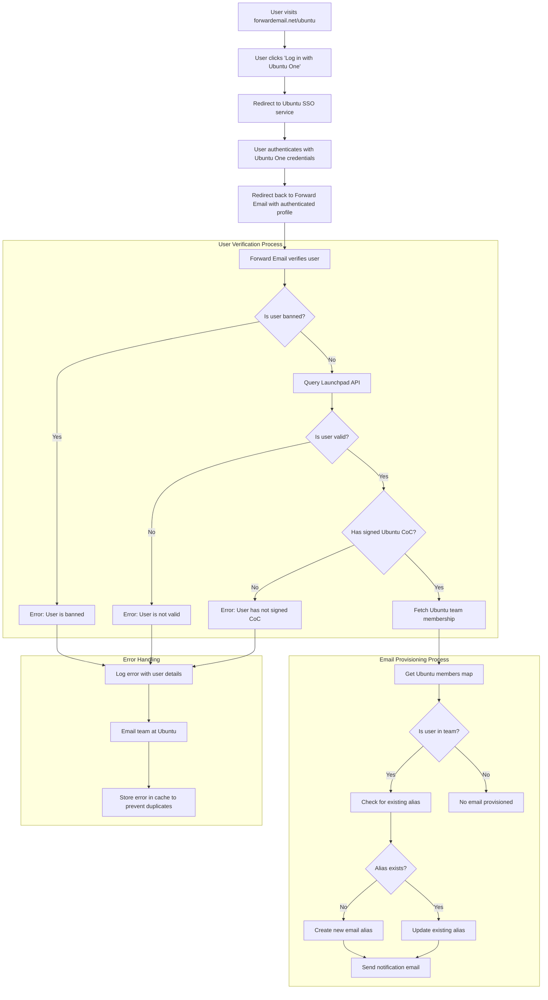

# Případová studie: Jak Canonical vylepšuje správu e-mailů v Ubuntu pomocí open-source podnikového řešení Forward Email {#case-study-how-canonical-powers-ubuntu-email-management-with-forward-emails-open-source-enterprise-solution}


## Obsah {#table-of-contents}

* [Předmluva](#foreword)
* [Výzva: Správa komplexního e-mailového ekosystému](#the-challenge-managing-a-complex-email-ecosystem)
* [Klíčové poznatky](#key-takeaways)
* [Proč přeposílat e-maily](#why-forward-email)
* [Implementace: Bezproblémová integrace SSO](#the-implementation-seamless-sso-integration)
  * [Vizualizace procesu ověřování](#authentication-flow-visualization)
  * [Technické implementační detaily](#technical-implementation-details)
* [Konfigurace DNS a směrování e-mailů](#dns-configuration-and-email-routing)
* [Výsledky: Zjednodušená správa e-mailů a vylepšené zabezpečení](#results-streamlined-email-management-and-enhanced-security)
  * [Provozní efektivita](#operational-efficiency)
  * [Vylepšené zabezpečení a soukromí](#enhanced-security-and-privacy)
  * [Úspory nákladů](#cost-savings)
  * [Vylepšené prostředí pro přispěvatele](#improved-contributor-experience)
* [Pohled do budoucna: Pokračující spolupráce](#looking-forward-continued-collaboration)
* [Závěr: Dokonalé partnerství s otevřeným zdrojovým kódem](#conclusion-a-perfect-open-source-partnership)
* [Podpora podnikových klientů](#supporting-enterprise-clients)
  * [Kontaktujte nás](#get-in-touch)
  * [O přeposlání e-mailu](#about-forward-email)

## Předmluva {#foreword}

Ve světě open-source softwaru má jen málo jmen takovou váhu jako [Kanonický](https://en.wikipedia.org/wiki/Canonical_\(company\)), společnost stojící za [Ubuntu](https://en.wikipedia.org/wiki/Ubuntu), jednou z nejpopulárnějších linuxových distribucí na světě. Společnost Canonical se svým rozsáhlým ekosystémem zahrnujícím několik distribucí včetně Ubuntu, [Uvolnit](https://en.wikipedia.org/wiki/Kubuntu), [Lubuntu](https://en.wikipedia.org/wiki/Lubuntu), [Edubuntu](https://en.wikipedia.org/wiki/Edubuntu) a dalších se potýkala s jedinečnými výzvami při správě e-mailových adres napříč svými četnými doménami. Tato případová studie zkoumá, jak se společnost Canonical spojila se společností Forward Email, aby vytvořila bezproblémové, bezpečné a na soukromí zaměřené řešení pro správu podnikových e-mailů, které je dokonale v souladu s jejími hodnotami open-source.

## Výzva: Správa komplexního e-mailového ekosystému {#the-challenge-managing-a-complex-email-ecosystem}

Ekosystém společnosti Canonical je rozmanitý a rozsáhlý. S miliony uživatelů po celém světě a tisíci přispěvatelů v různých projektech představovala správa e-mailových adres napříč více doménami značné výzvy. Hlavní přispěvatelé potřebovali oficiální e-mailové adresy (@ubuntu.com, @kubuntu.org atd.), které by odrážely jejich zapojení do projektu a zároveň zachovaly bezpečnost a snadnou použitelnost prostřednictvím robustního systému správy domén Ubuntu.

Před implementací Forward Email se společnost Canonical potýkala s:

* Správa e-mailových adres napříč více doménami (@ubuntu.com, @kubuntu.org, @lubuntu.me, @edubuntu.org a @ubuntu.net)
* Zajištění konzistentního e-mailového prostředí pro klíčové přispěvatele
* Integrace e-mailových služeb s jejich stávajícím systémem jednotného přihlašování (SSO) [Ubuntu One](https://en.wikipedia.org/wiki/Ubuntu_One)
* Nalezení řešení, které by bylo v souladu s jejich závazkem k ochraně soukromí, zabezpečení a zabezpečení e-mailů s otevřeným zdrojovým kódem
* Nákladově efektivní škálování jejich zabezpečené e-mailové infrastruktury

## Klíčové poznatky {#key-takeaways}

* Společnost Canonical úspěšně implementovala jednotné řešení pro správu e-mailů napříč několika doménami Ubuntu
* 100% open-source přístup služby Forward Email dokonale odpovídá hodnotám společnosti Canonical
* Integrace SSO s Ubuntu One poskytuje bezproblémové ověřování pro přispěvatele
* Kvantově odolné šifrování zajišťuje dlouhodobé zabezpečení veškeré e-mailové komunikace
* Řešení se dá nákladově efektivně škálovat, aby podporovalo rostoucí základnu přispěvatelů společnosti Canonical

## Proč přeposílat e-mail {#why-forward-email}

Jako jediný poskytovatel e-mailových služeb s otevřeným zdrojovým kódem a zaměřením na soukromí a bezpečnost byla společnost Forward Email přirozeným řešením pro potřeby společnosti Canonical v oblasti přeposílání podnikových e-mailů. Naše hodnoty se dokonale shodovaly se závazkem společnosti Canonical k softwaru s otevřeným zdrojovým kódem a ochraně soukromí.

Mezi klíčové faktory, které z Forward Email udělaly ideální volbu, patřily:

1. **Kompletní kódová základna s otevřeným zdrojovým kódem**: Celá naše platforma je open-source a dostupná na [GitHub](https://en.wikipedia.org/wiki/GitHub), což umožňuje transparentnost a příspěvky komunity. Na rozdíl od mnoha poskytovatelů e-mailů „zaměřených na soukromí“, kteří open-source poskytují pouze svá frontendová rozhraní, zatímco backendová rozhraní nechávají uzavřená, jsme zpřístupnili celou naši kódovou základnu – frontend i backend – komukoli k nahlédnutí na [GitHub](https://github.com/forwardemail/forwardemail.net).

2. **Přístup zaměřený na soukromí**: Na rozdíl od jiných poskytovatelů neukládáme e-maily ve sdílených databázích a používáme robustní šifrování pomocí TLS. Naše základní filozofie ochrany soukromí je jednoduchá: **vaše e-maily patří vám a pouze vám**. Tímto principem se řídí každé naše technické rozhodnutí, od způsobu přeposílání e-mailů až po implementaci šifrování.

3. **Žádná závislost na třetích stranách**: Nepoužíváme Amazon SES ani jiné služby třetích stran, což nám dává plnou kontrolu nad e-mailovou infrastrukturou a eliminuje potenciální úniky soukromí prostřednictvím služeb třetích stran.

4. **Cenovo efektivní škálování**: Náš cenový model umožňuje organizacím škálovat bez placení za uživatele, což je ideální pro velkou základnu přispěvatelů společnosti Canonical.

5. **Kvantově odolné šifrování**: Používáme individuálně šifrované poštovní schránky SQLite s šifrou [ChaCha20-Poly1305](https://en.wikipedia.org/wiki/ChaCha20-Poly1305) pro [kvantově odolné šifrování](/blog/docs/best-quantum-safe-encrypted-email-service). Každá poštovní schránka je samostatný šifrovaný soubor, což znamená, že přístup k datům jednoho uživatele neumožňuje přístup ostatním.

## Implementace: Bezproblémová integrace SSO {#the-implementation-seamless-sso-integration}

Jedním z nejdůležitějších aspektů implementace byla integrace se stávajícím systémem Ubuntu One SSO společnosti Canonical. Tato integrace by umožnila klíčovým přispěvatelům spravovat své e-mailové adresy @ubuntu.com pomocí svých stávajících přihlašovacích údajů Ubuntu One.

### Vizualizace procesu ověřování {#authentication-flow-visualization}

Následující diagram znázorňuje kompletní postup ověřování a zřizování e-mailů:



### Technické podrobnosti implementace {#technical-implementation-details}

Integrace mezi Forward Email a Ubuntu One SSO byla provedena vlastní implementací strategie ověřování passport-ubuntu. To umožnilo bezproblémový tok ověřování mezi systémy Ubuntu One a Forward Email.

#### Proces ověřování {#the-authentication-flow}

Proces ověřování funguje následovně:

1. Uživatelé navštíví vyhrazenou stránku pro správu e-mailů v Ubuntu na adrese [forwardemail.net/ubuntu](https://forwardemail.net/ubuntu)
2. Kliknou na „Přihlásit se pomocí Ubuntu One“ a jsou přesměrováni na službu Ubuntu SSO
3. Po ověření pomocí svých přihlašovacích údajů v Ubuntu One jsou přesměrováni zpět na službu Forward Email s jejich ověřeným profilem
4. Služba Forward Email ověří jejich status přispěvatele a odpovídajícím způsobem zřídí nebo spravuje jejich e-mailovou adresu

Technická implementace využila balíček [`passport-ubuntu`](https://www.npmjs.com/package/passport-ubuntu), což je strategie [Pas](https://www.npmjs.com/package/passport) pro autentizaci v Ubuntu pomocí [OpenID](https://en.wikipedia.org/wiki/OpenID). Konfigurace zahrnovala:

```javascript
passport.use(new UbuntuStrategy({
  returnURL: process.env.UBUNTU_CALLBACK_URL,
  realm: process.env.UBUNTU_REALM,
  stateless: true
}, function(identifier, profile, done) {
  // User verification and email provisioning logic
}));
```

#### Integrace a ověření Launchpad API {#launchpad-api-integration-and-validation}

Klíčovou součástí naší implementace je integrace s API [Launchpad](https://en.wikipedia.org/wiki/Launchpad_\(website\)) pro ověřování uživatelů Ubuntu a jejich členství v týmech. Vytvořili jsme opakovaně použitelné pomocné funkce, které tuto integraci zvládnou efektivně a spolehlivě.

Pomocná funkce `sync-ubuntu-user.js` je zodpovědná za ověřování uživatelů prostřednictvím Launchpad API a správu jejich e-mailových adres. Zde je zjednodušená verze fungování:

```javascript
async function syncUbuntuUser(user, map) {
  try {
    // Validate user object
    if (!_.isObject(user) ||
        !isSANB(user[fields.ubuntuUsername]) ||
        !isSANB(user[fields.ubuntuProfileID]) ||
        !isEmail(user.email))
      throw new TypeError('Invalid user object');

    // Get Ubuntu members map if not provided
    if (!(map instanceof Map))
      map = await getUbuntuMembersMap(resolver);

    // Check if user is banned
    if (user[config.userFields.isBanned]) {
      throw new InvalidUbuntuUserError('User was banned', { ignoreHook: true });
    }

    // Query Launchpad API to validate user
    const url = `https://api.launchpad.net/1.0/~${user[fields.ubuntuUsername]}`;
    const response = await retryRequest(url, { resolver });
    const json = await response.body.json();

    // Validate required boolean properties
    if (!json.is_valid)
      throw new InvalidUbuntuUserError('Property "is_valid" was false');

    if (!json.is_ubuntu_coc_signer)
      throw new InvalidUbuntuUserError('Property "is_ubuntu_coc_signer" was false');

    // Process each domain for the user
    await pMap([...map.keys()], async (name) => {
      // Find domain in database
      const domain = await Domains.findOne({
        name,
        plan: 'team',
        has_txt_record: true
      }).populate('members.user');

      // Process user's email alias for this domain
      if (map.get(name).has(user[fields.ubuntuUsername])) {
        // User is a member of this team, create or update alias
        let alias = await Aliases.findOne({
          user: user._id,
          domain: domain._id,
          name: user[fields.ubuntuUsername].toLowerCase()
        });

        if (!alias) {
          // Create new alias with appropriate error handling
          alias = await Aliases.create({
            user: user._id,
            domain: domain._id,
            name: user[fields.ubuntuUsername].toLowerCase(),
            recipients: [user.email],
            locale: user[config.lastLocaleField],
            is_enabled: true
          });

          // Notify admins about new alias creation
          await emailHelper({
            template: 'alert',
            message: {
              to: adminEmailsForDomain,
              subject: `New @${domain.name} email address created`
            },
            locals: {
              message: `A new email address ${user[fields.ubuntuUsername].toLowerCase()}@${domain.name} was created for ${user.email}`
            }
          });
        }
      }
    });

    return true;
  } catch (err) {
    // Handle and log errors
    await logErrorWithUser(err, user);
    throw err;
  }
}
```

Pro zjednodušení správy členství v týmech napříč různými doménami Ubuntu jsme vytvořili jednoduché mapování mezi názvy domén a jejich odpovídajícími týmy Launchpadu:

```javascript
ubuntuTeamMapping: {
  'ubuntu.com': '~ubuntumembers',
  'kubuntu.org': '~kubuntu-members',
  'lubuntu.me': '~lubuntu-members',
  'edubuntu.org': '~edubuntu-members',
  'ubuntustudio.com': '~ubuntustudio-core',
  'ubuntu.net': '~ubuntu-smtp-test'
},
```

Toto jednoduché mapování nám umožňuje automatizovat proces kontroly členství v týmu a přidělování e-mailových adres, což usnadňuje údržbu a rozšiřování systému s přidáváním nových domén.

#### Zpracování chyb a oznámení {#error-handling-and-notifications}

Implementovali jsme robustní systém pro ošetřování chyb, který:

1. Zaznamenává všechny chyby s podrobnými informacemi o uživateli.
2. Odesílá e-maily týmu Ubuntu, když jsou zjištěny problémy.
3. Upozorňuje administrátory, když se zaregistrují noví přispěvatelé a vytvoří se jim e-mailové adresy.
4. Řeší okrajové případy, jako jsou uživatelé, kteří nepodepsali Kodex chování Ubuntu.

Díky tomu je zajištěna rychlá identifikace a řešení jakýchkoli problémů a zachování integrity e-mailového systému.

## Konfigurace DNS a směrování e-mailů {#dns-configuration-and-email-routing}

Pro každou doménu spravovanou prostřednictvím služby Forward Email přidala společnost Canonical pro ověření jednoduchý DNS TXT záznam:

```sh
❯ dig ubuntu.com txt
ubuntu.com.             600     IN      TXT     "forward-email-site-verification=6IsURgl2t7"
```

Tento ověřovací záznam potvrzuje vlastnictví domény a umožňuje našemu systému bezpečně spravovat e-maily pro tyto domény. Canonical směruje poštu prostřednictvím naší služby přes Postfix, který poskytuje spolehlivou a bezpečnou infrastrukturu pro doručování e-mailů.

## Výsledky: Zjednodušená správa e-mailů a vylepšené zabezpečení {#results-streamlined-email-management-and-enhanced-security}

Implementace podnikového řešení Forward Email přinesla společnosti Canonical významné výhody pro správu e-mailů ve všech jejích doménách:

### Provozní efektivita {#operational-efficiency}

* **Centralizovaná správa**: Všechny domény související s Ubuntu jsou nyní spravovány prostřednictvím jednoho rozhraní
* **Snížená administrativní režie**: Automatizované zřizování a samoobslužná správa pro přispěvatele
* **Zjednodušený onboarding**: Noví přispěvatelé mohou rychle získat své oficiální e-mailové adresy

### Vylepšené zabezpečení a soukromí {#enhanced-security-and-privacy}

* **End-to-end šifrování**: Všechny e-maily jsou šifrovány pomocí pokročilých standardů.
* **Žádné sdílené databáze**: E-maily každého uživatele jsou uloženy v samostatných šifrovaných databázích SQLite, což poskytuje přístup k šifrování v sandboxu, který je zásadně bezpečnější než tradiční sdílené relační databáze.
* **Zabezpečení s otevřeným zdrojovým kódem**: Transparentní kódová základna umožňuje kontroly zabezpečení komunitou.
* **Zpracování v paměti**: Neukládáme přeposílané e-maily na disk, což zvyšuje ochranu soukromí.
* **Žádné ukládání metadat**: Na rozdíl od mnoha poskytovatelů e-mailů nevedeme záznamy o tom, kdo komu e-mailuje.

### Úspora nákladů {#cost-savings}

* **Škálovatelný cenový model**: Žádné poplatky za uživatele, což umožňuje společnosti Canonical přidávat přispěvatele bez zvyšování nákladů
* **Snížené nároky na infrastrukturu**: Není třeba udržovat samostatné e-mailové servery pro různé domény
* **Nižší požadavky na podporu**: Samoobslužná správa snižuje počet požadavků na IT podporu

### Vylepšené prostředí pro přispěvatele {#improved-contributor-experience}

* **Bezproblémové ověřování**: Jednotné přihlášení se stávajícími přihlašovacími údaji Ubuntu One
* **Konzistentní branding**: Jednotné prostředí napříč všemi službami souvisejícími s Ubuntu
* **Spolehlivé doručování e-mailů**: Vysoce kvalitní reputace IP adresy zajišťuje, že e-maily dorazí na místo určení

Integrace s Forward Email výrazně zjednodušila proces správy e-mailů ve společnosti Canonical. Přispěvatelé nyní mohou bezproblémově spravovat své e-mailové adresy @ubuntu.com se sníženou administrativní režií a vyšším zabezpečením.

## Těžký pohled: Pokračování spolupráce {#looking-forward-continued-collaboration}

Partnerství mezi společnostmi Canonical a Forward Email se neustále vyvíjí. Spolupracujeme na několika iniciativách:

* Rozšíření e-mailových služeb do dalších domén souvisejících s Ubuntu
* Vylepšení uživatelského rozhraní na základě zpětné vazby od přispěvatelů
* Implementace dalších bezpečnostních funkcí
* Prozkoumání nových způsobů, jak využít naši spolupráci s otevřeným zdrojovým kódem

## Závěr: Dokonalé partnerství s otevřeným zdrojovým kódem {#conclusion-a-perfect-open-source-partnership}

Spolupráce mezi společnostmi Canonical a Forward Email demonstruje sílu partnerství založených na sdílených hodnotách. Výběrem společnosti Forward Email jako poskytovatele e-mailových služeb nalezla společnost Canonical řešení, které nejen splňovalo její technické požadavky, ale také dokonale odpovídalo jejímu závazku k softwaru s otevřeným zdrojovým kódem, ochraně soukromí a zabezpečení.

Pro organizace spravující více domén a vyžadující bezproblémové ověřování se stávajícími systémy nabízí Forward Email flexibilní, bezpečné a na soukromí zaměřené řešení. Náš [přístup s otevřeným zdrojovým kódem](https://forwardemail.net/blog/docs/why-open-source-email-security-privacy) zajišťuje transparentnost a umožňuje příspěvky komunity, což z něj činí ideální volbu pro organizace, které si těchto principů cení.

Vzhledem k tomu, že společnosti Canonical i Forward Email neustále inovují ve svých oborech, toto partnerství svědčí o síle spolupráce v oblasti open-source technologií a sdílených hodnot při vytváření efektivních řešení.

Aktuální výkonnost doručování e-mailů si můžete prohlédnout v našem [stav služby v reálném čase](https://status.forwardemail.net). Průběžně monitorujeme, abychom zajistili vysokou reputaci IP adresy a doručitelnost e-mailů.

## Podpora podnikových klientů {#supporting-enterprise-clients}

Ačkoli se tato případová studie zaměřuje na naše partnerství se společností Canonical, společnost Forward Email hrdě podporuje řadu podnikových klientů z různých odvětví, kteří si cení našeho závazku k ochraně soukromí, bezpečnosti a principům open source.

Naše podniková řešení jsou přizpůsobena specifickým potřebám organizací všech velikostí a nabízejí:

* Vlastní doména [správa e-mailů](/) napříč více doménami
* Bezproblémová integrace se stávajícími ověřovacími systémy
* Vyhrazený chatový kanál podpory Matrix
* Vylepšené bezpečnostní funkce včetně [kvantově odolné šifrování](/blog/docs/best-quantum-safe-encrypted-email-service)
* Kompletní přenositelnost a vlastnictví dat
* 100% open-source infrastruktura pro transparentnost a důvěru

### Kontaktujte nás {#get-in-touch}

Pokud má vaše organizace potřeby v oblasti podnikového e-mailu nebo se chcete dozvědět více o tom, jak vám může Forward Email zefektivnit správu e-mailů a zároveň zvýšit soukromí a zabezpečení, rádi se s vámi spojíme:

* Napište nám přímo na adresu `support@forwardemail.net`
* Odešlete žádost o pomoc na naši adresu [stránka nápovědy](https://forwardemail.net/help)
* Podívejte se na naši adresu [ceník](https://forwardemail.net/pricing) pro firemní plány

Náš tým je připraven s vámi prodiskutovat vaše specifické požadavky a vyvinout řešení na míru, které bude odpovídat hodnotám a technickým potřebám vaší organizace.

### O přeposílaném e-mailu {#about-forward-email}

Forward Email je e-mailová služba se 100% otevřeným zdrojovým kódem a zaměřením na soukromí. Nabízíme služby přesměrování e-mailů na vlastní domény, SMTP, IMAP a POP3 se zaměřením na bezpečnost, soukromí a transparentnost. Celá naše kódová základna je k dispozici na adrese [GitHub](https://github.com/forwardemail/forwardemail.net) a zavázali jsme se poskytovat e-mailové služby, které respektují soukromí a bezpečnost uživatelů. Zjistěte více o [Proč je open-source e-mail budoucností](https://forwardemail.net/blog/docs/why-open-source-email-security-privacy), [jak funguje naše přeposílání e-mailů](https://forwardemail.net/blog/docs/best-email-forwarding-service) a [náš přístup k ochraně soukromí v e-mailech](https://forwardemail.net/blog/docs/email-privacy-protection-technical-implementation).