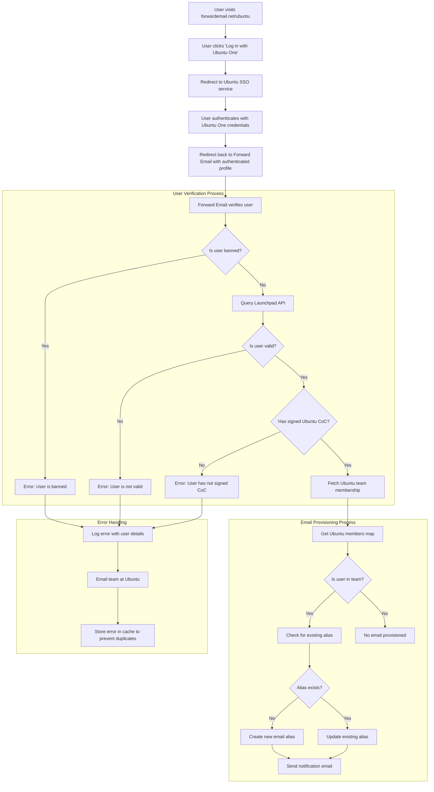

# Případová studie: Jak Canonical pohání správu e-mailů Ubuntu pomocí open-source podnikového řešení Forward Email {#case-study-how-canonical-powers-ubuntu-email-management-with-forward-emails-open-source-enterprise-solution}


## Obsah {#table-of-contents}

* [Předmluva](#foreword)
* [Výzva: Správa složitého e-mailového ekosystému](#the-challenge-managing-a-complex-email-ecosystem)
* [Klíčové poznatky](#key-takeaways)
* [Proč Forward Email](#why-forward-email)
* [Implementace: Bezproblémová integrace SSO](#the-implementation-seamless-sso-integration)
  * [Vizualizace autentizačního toku](#authentication-flow-visualization)
  * [Technické detaily implementace](#technical-implementation-details)
* [Konfigurace DNS a směrování e-mailů](#dns-configuration-and-email-routing)
* [Výsledky: Zjednodušená správa e-mailů a zvýšená bezpečnost](#results-streamlined-email-management-and-enhanced-security)
  * [Provozní efektivita](#operational-efficiency)
  * [Zvýšená bezpečnost a soukromí](#enhanced-security-and-privacy)
  * [Úspory nákladů](#cost-savings)
  * [Zlepšená zkušenost přispěvatelů](#improved-contributor-experience)
* [Výhled do budoucna: Pokračující spolupráce](#looking-forward-continued-collaboration)
* [Závěr: Perfektní open-source partnerství](#conclusion-a-perfect-open-source-partnership)
* [Podpora podnikových klientů](#supporting-enterprise-clients)
  * [Kontaktujte nás](#get-in-touch)
  * [O Forward Email](#about-forward-email)


## Předmluva {#foreword}

Ve světě open-source softwaru má jen málo jmen takovou váhu jako [Canonical](https://en.wikipedia.org/wiki/Canonical_\(company\)), společnost stojící za [Ubuntu](https://en.wikipedia.org/wiki/Ubuntu), jednou z nejpopulárnějších linuxových distribucí na světě. S rozsáhlým ekosystémem zahrnujícím několik distribucí včetně Ubuntu, [Kubuntu](https://en.wikipedia.org/wiki/Kubuntu), [Lubuntu](https://en.wikipedia.org/wiki/Lubuntu), [Edubuntu](https://en.wikipedia.org/wiki/Edubuntu) a dalších, čelil Canonical jedinečným výzvám při správě e-mailových adres napříč svými četnými doménami. Tato případová studie zkoumá, jak Canonical navázal partnerství s Forward Email, aby vytvořil bezproblémové, bezpečné a na soukromí zaměřené podnikové řešení správy e-mailů, které dokonale odpovídá jejich open-source hodnotám.


## Výzva: Správa složitého e-mailového ekosystému {#the-challenge-managing-a-complex-email-ecosystem}

Ekosystém Canonical je rozmanitý a rozsáhlý. S miliony uživatelů po celém světě a tisíci přispěvatelů napříč různými projekty představovala správa e-mailových adres napříč více doménami značné výzvy. Hlavní přispěvatelé potřebovali oficiální e-mailové adresy (@ubuntu.com, @kubuntu.org atd.), které odrážely jejich zapojení do projektu, přičemž bylo třeba zachovat bezpečnost a snadné použití prostřednictvím robustního systému správy domén Ubuntu.

Před zavedením Forward Email měl Canonical potíže s:

* Správou e-mailových adres napříč více doménami (@ubuntu.com, @kubuntu.org, @lubuntu.me, @edubuntu.org a @ubuntu.net)
* Poskytováním konzistentního e-mailového zážitku pro hlavní přispěvatele
* Integrací e-mailových služeb s jejich stávajícím systémem Single Sign-On (SSO) [Ubuntu One](https://en.wikipedia.org/wiki/Ubuntu_One)
* Nalezením řešení, které by odpovídalo jejich závazku k ochraně soukromí, bezpečnosti a open-source zabezpečení e-mailů
* Nákladově efektivním škálováním jejich zabezpečené e-mailové infrastruktury


## Klíčové poznatky {#key-takeaways}

* Canonical úspěšně implementoval jednotné řešení správy e-mailů napříč více doménami Ubuntu
* 100% open-source přístup Forward Email dokonale ladí s hodnotami Canonical
* Integrace SSO s Ubuntu One poskytuje bezproblémovou autentizaci pro přispěvatele
* Kvantově odolné šifrování zajišťuje dlouhodobou bezpečnost všech e-mailových komunikací
* Řešení škáluje nákladově efektivně, aby podporovalo rostoucí základnu přispěvatelů Canonical


## Proč Forward Email {#why-forward-email}
Jako jediný 100% open-source poskytovatel e-mailových služeb se zaměřením na soukromí a bezpečnost byl Forward Email přirozenou volbou pro potřeby přeposílání e-mailů ve společnosti Canonical. Naše hodnoty dokonale ladily se závazkem společnosti Canonical k open-source softwaru a ochraně soukromí.

Klíčové faktory, které učinily Forward Email ideální volbou, zahrnovaly:

1. **Úplný open-source kódový základ**: Celá naše platforma je open-source a dostupná na [GitHub](https://en.wikipedia.org/wiki/GitHub), což umožňuje transparentnost a příspěvky komunity. Na rozdíl od mnoha „na soukromí zaměřených“ poskytovatelů e-mailů, kteří zveřejňují pouze své frontendové části a backend drží uzavřený, jsme zpřístupnili celý náš kódový základ — frontend i backend — k nahlédnutí komukoli na [GitHub](https://github.com/forwardemail/forwardemail.net).

2. **Přístup zaměřený na soukromí**: Na rozdíl od jiných poskytovatelů neukládáme e-maily do sdílených databází a používáme robustní šifrování pomocí TLS. Naše základní filozofie ochrany soukromí je jednoduchá: **vaše e-maily patří vám a pouze vám**. Tento princip řídí každé technické rozhodnutí, které činíme, od způsobu, jakým zpracováváme přeposílání e-mailů, až po implementaci šifrování.

3. **Bez závislosti na třetích stranách**: Nepoužíváme Amazon SES ani jiné služby třetích stran, což nám dává plnou kontrolu nad e-mailovou infrastrukturou a eliminuje potenciální úniky soukromí skrze služby třetích stran.

4. **Nákladově efektivní škálování**: Náš cenový model umožňuje organizacím škálovat bez placení za uživatele, což je ideální pro rozsáhlou základnu přispěvatelů společnosti Canonical.

5. **Kvantově odolné šifrování**: Používáme individuálně šifrované SQLite poštovní schránky s [ChaCha20-Poly1305](https://en.wikipedia.org/wiki/ChaCha20-Poly1305) jako šifrou pro [kvantově odolné šifrování](/blog/docs/best-quantum-safe-encrypted-email-service). Každá schránka je samostatný šifrovaný soubor, což znamená, že přístup k datům jednoho uživatele nezaručuje přístup k datům ostatních.


## Implementace: Bezproblémová integrace SSO {#the-implementation-seamless-sso-integration}

Jedním z nejdůležitějších aspektů implementace byla integrace se stávajícím systémem Ubuntu One SSO společnosti Canonical. Tato integrace umožnila hlavním přispěvatelům spravovat své e-mailové adresy @ubuntu.com pomocí stávajících přihlašovacích údajů Ubuntu One.

### Vizualizace autentizačního toku {#authentication-flow-visualization}

Následující diagram znázorňuje kompletní tok autentizace a poskytování e-mailů:


```mermaid
flowchart TD
    A[User visits forwardemail.net/ubuntu] --> B[User clicks 'Log in with Ubuntu One']
    B --> C[Redirect to Ubuntu SSO service]
    C --> D[User authenticates with Ubuntu One credentials]
    D --> E[Redirect back to Forward Email with authenticated profile]
    E --> F[Forward Email verifies user]

    subgraph "User Verification Process"
        F --> G{Is user banned?}
        G -->|Yes| H[Error: User is banned]
        G -->|No| I[Query Launchpad API]
        I --> J{Is user valid?}
        J -->|No| K[Error: User is not valid]
        J -->|Yes| L{Has signed Ubuntu CoC?}
        L -->|No| M[Error: User has not signed CoC]
        L -->|Yes| N[Fetch Ubuntu team membership]
    end

    subgraph "Email Provisioning Process"
        N --> O[Get Ubuntu members map]
        O --> P{Is user in team?}
        P -->|Yes| Q[Check for existing alias]
        Q --> R{Alias exists?}
        R -->|No| S[Create new email alias]
        R -->|Yes| T[Update existing alias]
        S --> U[Send notification email]
        T --> U
        P -->|No| V[No email provisioned]
    end

    subgraph "Error Handling"
        H --> W[Log error with user details]
        K --> W
        M --> W
        W --> X[Email team at Ubuntu]
        X --> Y[Store error in cache to prevent duplicates]
    end
```

### Technické detaily implementace {#technical-implementation-details}

Integrace mezi Forward Email a Ubuntu One SSO byla realizována prostřednictvím vlastní implementace autentizační strategie passport-ubuntu. To umožnilo bezproblémový autentizační tok mezi systémy Ubuntu One a Forward Email.
#### Průběh autentizace {#the-authentication-flow}

Proces autentizace funguje následovně:

1. Uživatelé navštíví speciální stránku pro správu e-mailů Ubuntu na [forwardemail.net/ubuntu](https://forwardemail.net/ubuntu)
2. Kliknou na „Přihlásit se pomocí Ubuntu One“ a jsou přesměrováni na službu Ubuntu SSO
3. Po autentizaci pomocí svých přihlašovacích údajů Ubuntu One jsou přesměrováni zpět na Forward Email se svým autentizovaným profilem
4. Forward Email ověří jejich status přispěvatele a podle toho zřizuje nebo spravuje jejich e-mailovou adresu

Technická implementace využila balíček [`passport-ubuntu`](https://www.npmjs.com/package/passport-ubuntu), což je [Passport](https://www.npmjs.com/package/passport) strategie pro autentizaci s Ubuntu pomocí [OpenID](https://en.wikipedia.org/wiki/OpenID). Konfigurace zahrnovala:

```javascript
passport.use(new UbuntuStrategy({
  returnURL: process.env.UBUNTU_CALLBACK_URL,
  realm: process.env.UBUNTU_REALM,
  stateless: true
}, function(identifier, profile, done) {
  // Logika ověření uživatele a zřizování e-mailu
}));
```

#### Integrace a validace Launchpad API {#launchpad-api-integration-and-validation}

Klíčovou součástí naší implementace je integrace s API [Launchpad](https://en.wikipedia.org/wiki/Launchpad_\(website\)) pro ověření uživatelů Ubuntu a jejich členství v týmech. Vytvořili jsme znovupoužitelné pomocné funkce pro efektivní a spolehlivou správu této integrace.

Pomocná funkce `sync-ubuntu-user.js` je zodpovědná za ověřování uživatelů přes Launchpad API a správu jejich e-mailových adres. Zde je zjednodušená verze jejího fungování:

```javascript
async function syncUbuntuUser(user, map) {
  try {
    // Ověření objektu uživatele
    if (!_.isObject(user) ||
        !isSANB(user[fields.ubuntuUsername]) ||
        !isSANB(user[fields.ubuntuProfileID]) ||
        !isEmail(user.email))
      throw new TypeError('Neplatný objekt uživatele');

    // Získání mapy členů Ubuntu, pokud není poskytnuta
    if (!(map instanceof Map))
      map = await getUbuntuMembersMap(resolver);

    // Kontrola, zda uživatel není zabanován
    if (user[config.userFields.isBanned]) {
      throw new InvalidUbuntuUserError('Uživatel byl zabanován', { ignoreHook: true });
    }

    // Dotaz na Launchpad API pro ověření uživatele
    const url = `https://api.launchpad.net/1.0/~${user[fields.ubuntuUsername]}`;
    const response = await retryRequest(url, { resolver });
    const json = await response.body.json();

    // Ověření požadovaných boolean vlastností
    if (!json.is_valid)
      throw new InvalidUbuntuUserError('Vlastnost "is_valid" byla nepravdivá');

    if (!json.is_ubuntu_coc_signer)
      throw new InvalidUbuntuUserError('Vlastnost "is_ubuntu_coc_signer" byla nepravdivá');

    // Zpracování každé domény pro uživatele
    await pMap([...map.keys()], async (name) => {
      // Vyhledání domény v databázi
      const domain = await Domains.findOne({
        name,
        plan: 'team',
        has_txt_record: true
      }).populate('members.user');

      // Zpracování e-mailového aliasu uživatele pro tuto doménu
      if (map.get(name).has(user[fields.ubuntuUsername])) {
        // Uživatel je členem tohoto týmu, vytvoření nebo aktualizace aliasu
        let alias = await Aliases.findOne({
          user: user._id,
          domain: domain._id,
          name: user[fields.ubuntuUsername].toLowerCase()
        });

        if (!alias) {
          // Vytvoření nového aliasu s odpovídajícím ošetřením chyb
          alias = await Aliases.create({
            user: user._id,
            domain: domain._id,
            name: user[fields.ubuntuUsername].toLowerCase(),
            recipients: [user.email],
            locale: user[config.lastLocaleField],
            is_enabled: true
          });

          // Informování administrátorů o vytvoření nového aliasu
          await emailHelper({
            template: 'alert',
            message: {
              to: adminEmailsForDomain,
              subject: `Byla vytvořena nová e-mailová adresa @${domain.name}`
            },
            locals: {
              message: `Byla vytvořena nová e-mailová adresa ${user[fields.ubuntuUsername].toLowerCase()}@${domain.name} pro ${user.email}`
            }
          });
        }
      }
    });

    return true;
  } catch (err) {
    // Zpracování a logování chyb
    await logErrorWithUser(err, user);
    throw err;
  }
}
```
Pro zjednodušení správy členství v týmech napříč různými doménami Ubuntu jsme vytvořili jednoduché mapování mezi názvy domén a odpovídajícími týmy Launchpad:

```javascript
ubuntuTeamMapping: {
  'ubuntu.com': '~ubuntumembers',
  'kubuntu.org': '~kubuntu-members',
  'lubuntu.me': '~lubuntu-members',
  'edubuntu.org': '~edubuntu-members',
  'ubuntustudio.com': '~ubuntustudio-core',
  'ubuntu.net': '~ubuntu-smtp-test'
},
```

Toto jednoduché mapování nám umožňuje automatizovat proces kontroly členství v týmech a poskytování e-mailových adres, což činí systém snadno udržovatelným a rozšiřitelným s přidáváním nových domén.

#### Zpracování chyb a oznámení {#error-handling-and-notifications}

Implementovali jsme robustní systém zpracování chyb, který:

1. Loguje všechny chyby s podrobnými informacemi o uživateli
2. Posílá e-maily týmu Ubuntu při zjištění problémů
3. Informuje administrátory, když se noví přispěvatelé zaregistrují a mají vytvořeny e-mailové adresy
4. Řeší okrajové případy, jako jsou uživatelé, kteří nepodepsali Ubuntu Code of Conduct

To zajišťuje, že jakékoliv problémy jsou rychle identifikovány a řešeny, čímž se udržuje integrita e-mailového systému.


## Konfigurace DNS a směrování e-mailů {#dns-configuration-and-email-routing}

Pro každou doménu spravovanou přes Forward Email přidal Canonical jednoduchý DNS TXT záznam pro ověření:

```sh
❯ dig ubuntu.com txt
ubuntu.com.             600     IN      TXT     "forward-email-site-verification=6IsURgl2t7"
```

Tento ověřovací záznam potvrzuje vlastnictví domény a umožňuje našemu systému bezpečně spravovat e-maily pro tyto domény. Canonical směruje poštu přes naši službu pomocí Postfixu, který poskytuje spolehlivou a bezpečnou infrastrukturu pro doručování e-mailů.


## Výsledky: Zjednodušená správa e-mailů a zvýšená bezpečnost {#results-streamlined-email-management-and-enhanced-security}

Implementace podnikové verze Forward Email přinesla významné výhody pro správu e-mailů Canonical napříč všemi jejich doménami:

### Provozní efektivita {#operational-efficiency}

* **Centralizovaná správa**: Všechny domény související s Ubuntu jsou nyní spravovány přes jedno rozhraní
* **Snížená administrativní zátěž**: Automatizované poskytování a samoobslužná správa pro přispěvatele
* **Zjednodušené zapojení**: Noví přispěvatelé mohou rychle získat své oficiální e-mailové adresy

### Zvýšená bezpečnost a soukromí {#enhanced-security-and-privacy}

* **End-to-end šifrování**: Všechny e-maily jsou šifrovány pomocí pokročilých standardů
* **Žádné sdílené databáze**: E-maily každého uživatele jsou uloženy v individuálních šifrovaných SQLite databázích, což poskytuje sandboxovaný přístup k šifrování, který je zásadně bezpečnější než tradiční sdílené relační databáze
* **Open-source bezpečnost**: Transparentní zdrojový kód umožňuje komunitní bezpečnostní audity
* **Zpracování v paměti**: Nepřechováváme přeposlané e-maily na disku, čímž zvyšujeme ochranu soukromí
* **Žádné ukládání metadat**: Neuchováváme záznamy o tom, kdo komu posílá e-maily, na rozdíl od mnoha poskytovatelů e-mailů

### Úspora nákladů {#cost-savings}

* **Škálovatelný cenový model**: Žádné poplatky za uživatele, což umožňuje Canonical přidávat přispěvatele bez navyšování nákladů
* **Snížené nároky na infrastrukturu**: Není potřeba udržovat samostatné e-mailové servery pro různé domény
* **Nižší požadavky na podporu**: Samoobslužná správa snižuje počet požadavků na IT podporu

### Zlepšená zkušenost přispěvatelů {#improved-contributor-experience}

* **Bezproblémová autentizace**: Jednotné přihlášení pomocí stávajících přihlašovacích údajů Ubuntu One
* **Konzistentní branding**: Jednotný zážitek napříč všemi službami souvisejícími s Ubuntu
* **Spolehlivé doručování e-mailů**: Vysoce kvalitní reputace IP zajišťuje, že e-maily dorazí do cíle

Integrace s Forward Email výrazně zjednodušila proces správy e-mailů u Canonical. Přispěvatelé nyní mají bezproblémový zážitek při správě svých e-mailových adres @ubuntu.com, s nižší administrativní zátěží a zvýšenou bezpečností.


## Výhled do budoucna: Pokračující spolupráce {#looking-forward-continued-collaboration}

Partnerství mezi Canonical a Forward Email se nadále rozvíjí. Společně pracujeme na několika iniciativách:
* Rozšiřování e-mailových služeb na další domény související s Ubuntu
* Vylepšování uživatelského rozhraní na základě zpětné vazby přispěvatelů
* Implementace dalších bezpečnostních funkcí
* Zkoumání nových způsobů využití naší open-source spolupráce


## Závěr: Dokonalé partnerství v open-source {#conclusion-a-perfect-open-source-partnership}

Spolupráce mezi Canonical a Forward Email ukazuje sílu partnerství založených na sdílených hodnotách. Volbou Forward Email jako poskytovatele e-mailových služeb našel Canonical řešení, které nejen splnilo jejich technické požadavky, ale také dokonale odpovídalo jejich závazku k open-source softwaru, ochraně soukromí a bezpečnosti.

Pro organizace spravující více domén a vyžadující bezproblémovou autentizaci s existujícími systémy nabízí Forward Email flexibilní, bezpečné a na soukromí zaměřené řešení. Náš [open-source přístup](https://forwardemail.net/blog/docs/why-open-source-email-security-privacy) zajišťuje transparentnost a umožňuje příspěvky komunity, což z něj činí ideální volbu pro organizace, které si těchto principů váží.

Jak Canonical, tak Forward Email pokračují v inovacích ve svých oborech, toto partnerství je důkazem síly open-source spolupráce a sdílených hodnot při vytváření efektivních řešení.

Můžete si zkontrolovat náš [aktuální stav služby v reálném čase](https://status.forwardemail.net), kde uvidíte naši současnou výkonnost doručování e-mailů, kterou neustále monitorujeme, abychom zajistili vysokou kvalitu reputace IP a doručitelnost e-mailů.


## Podpora podnikových klientů {#supporting-enterprise-clients}

I když se tato případová studie zaměřuje na naše partnerství s Canonical, Forward Email hrdě podporuje řadu podnikových klientů z různých odvětví, kteří oceňují náš závazek k ochraně soukromí, bezpečnosti a open-source principům.

Naše podniková řešení jsou přizpůsobena specifickým potřebám organizací všech velikostí a nabízejí:

* Správu e-mailů s vlastní doménou [email management](/) napříč více doménami
* Bezproblémovou integraci s existujícími autentizačními systémy
* Vyhrazený kanál podpory v Matrix chatu
* Vylepšené bezpečnostní funkce včetně [kvantově odolného šifrování](/blog/docs/best-quantum-safe-encrypted-email-service)
* Kompletní přenositelnost a vlastnictví dat
* 100% open-source infrastrukturu pro transparentnost a důvěru

### Kontaktujte nás {#get-in-touch}

Pokud vaše organizace potřebuje podnikové e-mailové řešení nebo máte zájem dozvědět se více o tom, jak Forward Email může pomoci zjednodušit správu e-mailů a zároveň zvýšit ochranu soukromí a bezpečnost, rádi vás uslyšíme:

* Napište nám přímo na `support@forwardemail.net`
* Podání žádosti o pomoc na naší [stránce podpory](https://forwardemail.net/help)
* Prohlédněte si naše [cenové plány](https://forwardemail.net/pricing) pro podnikové zákazníky

Náš tým je připraven prodiskutovat vaše konkrétní požadavky a vyvinout přizpůsobené řešení, které bude odpovídat hodnotám a technickým potřebám vaší organizace.

### O Forward Email {#about-forward-email}

Forward Email je 100% open-source a na soukromí zaměřená e-mailová služba. Poskytujeme přesměrování e-mailů s vlastní doménou, SMTP, IMAP a POP3 služby se zaměřením na bezpečnost, soukromí a transparentnost. Celý náš kód je dostupný na [GitHubu](https://github.com/forwardemail/forwardemail.net) a zavazujeme se poskytovat e-mailové služby, které respektují soukromí a bezpečnost uživatelů. Dozvíte se více o [proč je open-source e-mail budoucnost](https://forwardemail.net/blog/docs/why-open-source-email-security-privacy), [jak funguje naše přesměrování e-mailů](https://forwardemail.net/blog/docs/best-email-forwarding-service) a [náš přístup k ochraně soukromí e-mailů](https://forwardemail.net/blog/docs/email-privacy-protection-technical-implementation).
