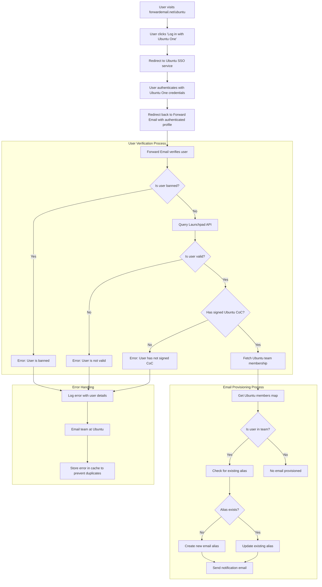

# Casestudie: Hvordan Canonical styrker Ubuntus e-mailhåndtering med videresendelses-e-mails open source-løsning til virksomheder {#case-study-how-canonical-powers-ubuntu-email-management-with-forward-emails-open-source-enterprise-solution}


## Indholdsfortegnelse {#table-of-contents}

* [Forord](#foreword)
* [Udfordringen: Håndtering af et komplekst e-mailøkosystem](#the-challenge-managing-a-complex-email-ecosystem)
* [Vigtige konklusioner](#key-takeaways)
* [Hvorfor videresende e-mail](#why-forward-email)
* [Implementeringen: Problemfri SSO-integration](#the-implementation-seamless-sso-integration)
  * [Visualisering af godkendelsesflow](#authentication-flow-visualization)
  * [Tekniske implementeringsdetaljer](#technical-implementation-details)
* [DNS-konfiguration og e-mailrouting](#dns-configuration-and-email-routing)
* [Resultater: Strømlinet e-mailhåndtering og forbedret sikkerhed](#results-streamlined-email-management-and-enhanced-security)
  * [Operationel effektivitet](#operational-efficiency)
  * [Forbedret sikkerhed og privatliv](#enhanced-security-and-privacy)
  * [Omkostningsbesparelser](#cost-savings)
  * [Forbedret bidragyderoplevelse](#improved-contributor-experience)
* [Fremadrettet: Fortsat samarbejde](#looking-forward-continued-collaboration)
* [Konklusion: Et perfekt open source-partnerskab](#conclusion-a-perfect-open-source-partnership)
* [Support til virksomhedskunder](#supporting-enterprise-clients)
  * [Kontakt os](#get-in-touch)
  * [Om videresendelse af e-mail](#about-forward-email)

## Forord {#foreword}

I open source-softwareverdenen er der få navne, der bærer så meget vægt som [Kanonisk](https://en.wikipedia.org/wiki/Canonical_\(company\)), virksomheden bag [Ubuntu](https://en.wikipedia.org/wiki/Ubuntu), en af de mest populære Linux-distributioner globalt. Med et stort økosystem, der spænder over flere distributioner, herunder Ubuntu, [Gratis](https://en.wikipedia.org/wiki/Kubuntu), [Lubuntu](https://en.wikipedia.org/wiki/Lubuntu), [Edubuntu](https://en.wikipedia.org/wiki/Edubuntu) og andre, stod Canonical over for unikke udfordringer med at administrere e-mailadresser på tværs af deres mange domæner. Denne casestudie undersøger, hvordan Canonical indgik et partnerskab med Forward Email for at skabe en problemfri, sikker og privatlivsfokuseret e-mail-administrationsløsning til virksomheder, der er perfekt i overensstemmelse med deres open source-værdier.

## Udfordringen: Håndtering af et komplekst e-mailøkosystem {#the-challenge-managing-a-complex-email-ecosystem}

Canonicals økosystem er mangfoldigt og omfattende. Med millioner af brugere verden over og tusindvis af bidragydere på tværs af forskellige projekter, var det en betydelig udfordring at administrere e-mailadresser på tværs af flere domæner. Kernebidragydere havde brug for officielle e-mailadresser (@ubuntu.com, @kubuntu.org osv.), der afspejlede deres involvering i projektet, samtidig med at sikkerhed og brugervenlighed blev opretholdt gennem et robust Ubuntu-domæneadministrationssystem.

Før implementeringen af Videresendt E-mail, kæmpede Canonical med:

* Administration af e-mailadresser på tværs af flere domæner (@ubuntu.com, @kubuntu.org, @lubuntu.me, @edubuntu.org og @ubuntu.net)
* Tilbyder en ensartet e-mailoplevelse for kernebidragydere
* Integrering af e-mailtjenester med deres eksisterende [Ubuntu One](https://en.wikipedia.org/wiki/Ubuntu_One) Single Sign-On (SSO)-system
* Finder en løsning, der stemmer overens med deres engagement i privatliv, sikkerhed og open source-e-mailsikkerhed
* Skalerer deres sikre e-mailinfrastruktur omkostningseffektivt

## Vigtige konklusioner {#key-takeaways}

* Canonical implementerede med succes en samlet e-mailhåndteringsløsning på tværs af flere Ubuntu-domæner
* Videresend e-mails 100 % open source-tilgang stemmer perfekt overens med Canonicals værdier
* SSO-integration med Ubuntu One giver problemfri godkendelse for bidragydere
* Kvantebestandig kryptering sikrer langsigtet sikkerhed for al e-mailkommunikation
* Løsningen skalerer omkostningseffektivt for at understøtte Canonicals voksende bidragyderbase

## Hvorfor videresende e-mail {#why-forward-email}

Som den eneste 100 % open source-e-mailudbyder med fokus på privatliv og sikkerhed, var Forward Email et naturligt match for Canonicals behov for videresendelse af e-mail til virksomheder. Vores værdier stemte perfekt overens med Canonicals engagement i open source-software og privatliv.

Nøglefaktorer, der gjorde Forward Email til det ideelle valg, var blandt andet:

1. **Komplet open source-kodebase**: Hele vores platform er open source og tilgængelig på [GitHub](https://en.wikipedia.org/wiki/GitHub), hvilket giver mulighed for gennemsigtighed og bidrag fra fællesskabet. I modsætning til mange "privatlivsfokuserede" e-mailudbydere, der kun open source deres frontends, mens de holder deres backends lukkede, har vi gjort hele vores kodebase - både frontend og backend - tilgængelig for alle at inspicere på [GitHub](https://github.com/forwardemail/forwardemail.net).

2. **Privatlivsfokuseret tilgang**: I modsætning til andre udbydere gemmer vi ikke e-mails i delte databaser, og vi bruger robust kryptering med TLS. Vores grundlæggende privatlivsfilosofi er enkel: **dine e-mails tilhører dig og kun dig**. Dette princip styrer alle tekniske beslutninger, vi træffer, lige fra hvordan vi håndterer videresendelse af e-mails til hvordan vi implementerer kryptering.

3. **Ingen afhængighed af tredjeparter**: Vi bruger ikke Amazon SES eller andre tredjepartstjenester, hvilket giver os fuld kontrol over e-mailinfrastrukturen og eliminerer potentielle privatlivslækager gennem tredjepartstjenester.

4. **Omkostningseffektiv skalering**: Vores prismodel giver organisationer mulighed for at skalere uden at betale pr. bruger, hvilket gør den ideel til Canonicals store bidragyderbase.

5. **Kvantebestandig kryptering**: Vi bruger individuelt krypterede SQLite-postkasser med [ChaCha20-Poly1305](https://en.wikipedia.org/wiki/ChaCha20-Poly1305) som kryptering for [kvanteresistent kryptering](/blog/docs/best-quantum-safe-encrypted-email-service). Hver postkasse er en separat krypteret fil, hvilket betyder, at adgang til én brugers data ikke giver adgang til andre.

## Implementeringen: Problemfri SSO-integration {#the-implementation-seamless-sso-integration}

Et af de mest kritiske aspekter ved implementeringen var integrationen med Canonicals eksisterende Ubuntu One SSO-system. Denne integration ville give kernebidragydere mulighed for at administrere deres @ubuntu.com e-mailadresser ved hjælp af deres eksisterende Ubuntu One-loginoplysninger.

### Visualisering af godkendelsesflow {#authentication-flow-visualization}

Følgende diagram illustrerer den komplette godkendelses- og e-mailklargøringsproces:



### Tekniske implementeringsdetaljer {#technical-implementation-details}

Integrationen mellem Forward Email og Ubuntu One SSO blev opnået gennem en brugerdefineret implementering af passport-ubuntu-godkendelsesstrategien. Dette muliggjorde en problemfri godkendelsesstrøm mellem Ubuntu One og Forward Emails systemer.

#### Godkendelsesflowet {#the-authentication-flow}

Godkendelsesprocessen fungerer som følger:

1. Brugere besøger den dedikerede Ubuntu e-mail-administrationsside på [forwardemail.net/ubuntu](https://forwardemail.net/ubuntu)
2. De klikker på "Log ind med Ubuntu One" og omdirigeres til Ubuntu SSO-tjenesten
3. Efter at have godkendt med deres Ubuntu One-legitimationsoplysninger, omdirigeres de tilbage til Videresend e-mail med deres godkendte profil
4. Videresend e-mail verificerer deres bidragyderstatus og tildeler eller administrerer deres e-mailadresse i overensstemmelse hermed

Den tekniske implementering udnyttede [`passport-ubuntu`](https://www.npmjs.com/package/passport-ubuntu)-pakken, som er en [Pas](https://www.npmjs.com/package/passport)-strategi til godkendelse med Ubuntu ved hjælp af [OpenID](https://en.wikipedia.org/wiki/OpenID). Konfigurationen omfattede:

```javascript
passport.use(new UbuntuStrategy({
  returnURL: process.env.UBUNTU_CALLBACK_URL,
  realm: process.env.UBUNTU_REALM,
  stateless: true
}, function(identifier, profile, done) {
  // User verification and email provisioning logic
}));
```

#### Launchpad API-integration og -validering {#launchpad-api-integration-and-validation}

En kritisk del af vores implementering er integrationen med [Launchpad](https://en.wikipedia.org/wiki/Launchpad_\(website\))'s API for at validere Ubuntu-brugere og deres teammedlemskaber. Vi har skabt genbrugelige hjælpefunktioner for at håndtere denne integration effektivt og pålideligt.

Hjælpefunktionen `sync-ubuntu-user.js` er ansvarlig for at validere brugere via Launchpad API'en og administrere deres e-mailadresser. Her er en forenklet version af, hvordan det fungerer:

```javascript
async function syncUbuntuUser(user, map) {
  try {
    // Validate user object
    if (!_.isObject(user) ||
        !isSANB(user[fields.ubuntuUsername]) ||
        !isSANB(user[fields.ubuntuProfileID]) ||
        !isEmail(user.email))
      throw new TypeError('Invalid user object');

    // Get Ubuntu members map if not provided
    if (!(map instanceof Map))
      map = await getUbuntuMembersMap(resolver);

    // Check if user is banned
    if (user[config.userFields.isBanned]) {
      throw new InvalidUbuntuUserError('User was banned', { ignoreHook: true });
    }

    // Query Launchpad API to validate user
    const url = `https://api.launchpad.net/1.0/~${user[fields.ubuntuUsername]}`;
    const response = await retryRequest(url, { resolver });
    const json = await response.body.json();

    // Validate required boolean properties
    if (!json.is_valid)
      throw new InvalidUbuntuUserError('Property "is_valid" was false');

    if (!json.is_ubuntu_coc_signer)
      throw new InvalidUbuntuUserError('Property "is_ubuntu_coc_signer" was false');

    // Process each domain for the user
    await pMap([...map.keys()], async (name) => {
      // Find domain in database
      const domain = await Domains.findOne({
        name,
        plan: 'team',
        has_txt_record: true
      }).populate('members.user');

      // Process user's email alias for this domain
      if (map.get(name).has(user[fields.ubuntuUsername])) {
        // User is a member of this team, create or update alias
        let alias = await Aliases.findOne({
          user: user._id,
          domain: domain._id,
          name: user[fields.ubuntuUsername].toLowerCase()
        });

        if (!alias) {
          // Create new alias with appropriate error handling
          alias = await Aliases.create({
            user: user._id,
            domain: domain._id,
            name: user[fields.ubuntuUsername].toLowerCase(),
            recipients: [user.email],
            locale: user[config.lastLocaleField],
            is_enabled: true
          });

          // Notify admins about new alias creation
          await emailHelper({
            template: 'alert',
            message: {
              to: adminEmailsForDomain,
              subject: `New @${domain.name} email address created`
            },
            locals: {
              message: `A new email address ${user[fields.ubuntuUsername].toLowerCase()}@${domain.name} was created for ${user.email}`
            }
          });
        }
      }
    });

    return true;
  } catch (err) {
    // Handle and log errors
    await logErrorWithUser(err, user);
    throw err;
  }
}
```

For at forenkle administrationen af teammedlemskaber på tværs af forskellige Ubuntu-domæner har vi oprettet en enkel kortlægning mellem domænenavne og deres tilsvarende Launchpad-teams:

```javascript
ubuntuTeamMapping: {
  'ubuntu.com': '~ubuntumembers',
  'kubuntu.org': '~kubuntu-members',
  'lubuntu.me': '~lubuntu-members',
  'edubuntu.org': '~edubuntu-members',
  'ubuntustudio.com': '~ubuntustudio-core',
  'ubuntu.net': '~ubuntu-smtp-test'
},
```

Denne enkle kortlægning giver os mulighed for at automatisere processen med at kontrollere teammedlemskaber og klargøre e-mailadresser, hvilket gør systemet nemt at vedligeholde og udvide, efterhånden som nye domæner tilføjes.

#### Fejlhåndtering og notifikationer {#error-handling-and-notifications}

Vi implementerede et robust fejlhåndteringssystem, der:

1. Logger alle fejl med detaljerede brugeroplysninger
2. Sender e-mails til Ubuntu-teamet, når der opdages problemer
3. Giver administratorer besked, når nye bidragydere tilmelder sig og får oprettet e-mailadresser
4. Håndterer edge-sager, såsom brugere, der ikke har underskrevet Ubuntus adfærdskodeks

Dette sikrer, at eventuelle problemer hurtigt identificeres og håndteres, hvilket opretholder e-mailsystemets integritet.

## DNS-konfiguration og e-mailrouting {#dns-configuration-and-email-routing}

For hvert domæne, der administreres via Forward Email, tilføjede Canonical en simpel DNS TXT-post til validering:

```sh
❯ dig ubuntu.com txt
ubuntu.com.             600     IN      TXT     "forward-email-site-verification=6IsURgl2t7"
```

Denne verifikationspost bekræfter domæneejerskab og gør det muligt for vores system at administrere e-mail for disse domæner sikkert. Canonical sender e-mail gennem vores tjeneste via Postfix, som leverer en pålidelig og sikker e-mailleveringsinfrastruktur.

## Resultater: Strømlinet e-mailhåndtering og forbedret sikkerhed {#results-streamlined-email-management-and-enhanced-security}

Implementeringen af Forward Emails virksomhedsløsning har givet Canonical betydelige fordele for e-mailhåndtering på tværs af alle deres domæner:

### Driftseffektivitet {#operational-efficiency}

* **Centraliseret administration**: Alle Ubuntu-relaterede domæner administreres nu via en enkelt grænseflade
* **Reduceret administrativ administration**: Automatiseret provisionering og selvbetjeningsadministration for bidragydere
* **Forenklet onboarding**: Nye bidragydere kan hurtigt få deres officielle e-mailadresser

### Forbedret sikkerhed og privatliv {#enhanced-security-and-privacy}

* **End-to-end-kryptering**: Alle e-mails krypteres ved hjælp af avancerede standarder
* **Ingen delte databaser**: Hver brugers e-mails gemmes i individuelle krypterede SQLite-databaser, hvilket giver en sandbox-krypteringstilgang, der er fundamentalt mere sikker end traditionelle delte relationsdatabaser
* **Open source-sikkerhed**: Den transparente kodebase muliggør sikkerhedsgennemgange i fællesskabet
* **In-memory-behandling**: Vi gemmer ikke videresendte e-mails på disken, hvilket forbedrer beskyttelsen af privatlivets fred
* **Ingen metadatalagring**: Vi fører ikke registrering af, hvem der sender e-mails til hvem, i modsætning til mange e-mailudbydere

### Omkostningsbesparelser {#cost-savings}

* **Skalerbar prismodel**: Ingen gebyrer pr. bruger, hvilket giver Canonical mulighed for at tilføje bidragydere uden at øge omkostningerne
* **Reduceret infrastrukturbehov**: Intet behov for at vedligeholde separate e-mailservere for forskellige domæner
* **Lavere supportkrav**: Selvbetjeningsadministration reducerer IT-supportsager

### Forbedret bidragyderoplevelse {#improved-contributor-experience}

* **Problemfri godkendelse**: Enkelt login med eksisterende Ubuntu One-legitimationsoplysninger
* **Konsistent branding**: En samlet oplevelse på tværs af alle Ubuntu-relaterede tjenester
* **Pålidelig e-maillevering**: IP-omdømme af høj kvalitet sikrer, at e-mails når deres destination

Integrationen med Forward Email har strømlinet Canonicals e-mailhåndteringsproces betydeligt. Bidragydere har nu en problemfri oplevelse med at administrere deres @ubuntu.com e-mailadresser med reduceret administrativ belastning og forbedret sikkerhed.

## Fremadrettet: Fortsat samarbejde {#looking-forward-continued-collaboration}

Partnerskabet mellem Canonical og Forward Email fortsætter med at udvikle sig. Vi arbejder sammen om flere initiativer:

* Udvidelse af e-mailtjenester til yderligere Ubuntu-relaterede domæner
* Forbedring af brugergrænsefladen baseret på feedback fra bidragydere
* Implementering af yderligere sikkerhedsfunktioner
* Udforskning af nye måder at udnytte vores open source-samarbejde på

## Konklusion: Et perfekt open source-partnerskab {#conclusion-a-perfect-open-source-partnership}

Samarbejdet mellem Canonical og Forward Email demonstrerer styrken i partnerskaber bygget på fælles værdier. Ved at vælge Forward Email som deres e-mailudbyder fandt Canonical en løsning, der ikke kun opfyldte deres tekniske krav, men også passede perfekt til deres engagement i open source-software, privatliv og sikkerhed.

For organisationer, der administrerer flere domæner og kræver problemfri godkendelse med eksisterende systemer, tilbyder Forward Email en fleksibel, sikker og privatlivsfokuseret løsning. Vores [open source-tilgang](https://forwardemail.net/blog/docs/why-open-source-email-security-privacy) sikrer gennemsigtighed og giver mulighed for bidrag fra fællesskabet, hvilket gør den til et ideelt valg for organisationer, der værdsætter disse principper.

I takt med at både Canonical og Forward Email fortsætter med at innovere inden for deres respektive områder, står dette partnerskab som et bevis på styrken ved open source-samarbejde og fælles værdier i forbindelse med at skabe effektive løsninger.

Du kan tjekke vores [servicestatus i realtid](https://status.forwardemail.net) for at se vores nuværende e-mailleveringsydelse, som vi overvåger løbende for at sikre et IP-omdømme og e-mailleveringsevne af høj kvalitet.

## Support til virksomhedskunder {#supporting-enterprise-clients}

Selvom denne casestudie fokuserer på vores partnerskab med Canonical, støtter Forward Email med stolthed adskillige virksomhedskunder på tværs af forskellige brancher, der værdsætter vores engagement i privatliv, sikkerhed og open source-principper.

Vores virksomhedsløsninger er skræddersyet til at imødekomme de specifikke behov hos organisationer i alle størrelser og tilbyder:

* Brugerdefineret domæne [e-mailhåndtering](/) på tværs af flere domæner
* Problemfri integration med eksisterende godkendelsessystemer
* Dedikeret Matrix chat supportkanal
* Forbedrede sikkerhedsfunktioner, herunder [kvanteresistent kryptering](/blog/docs/best-quantum-safe-encrypted-email-service)
* Fuld dataportabilitet og ejerskab
* 100% open source-infrastruktur for gennemsigtighed og tillid

### Kontakt os {#get-in-touch}

Hvis din organisation har behov for e-mail i virksomheder, eller du er interesseret i at lære mere om, hvordan Videresend Email kan hjælpe med at strømline din e-mailadministration og samtidig forbedre privatlivets fred og sikkerhed, vil vi meget gerne høre fra dig:

* Send os en e-mail direkte på `support@forwardemail.net`
* Indsend en anmodning om hjælp på vores [hjælpeside](https://forwardemail.net/help)
* Tjek vores [prisside](https://forwardemail.net/pricing) for virksomhedsabonnementer

Vores team er klar til at drøfte dine specifikke krav og udvikle en skræddersyet løsning, der er i overensstemmelse med din organisations værdier og tekniske behov.

### Om videresendelse af e-mail {#about-forward-email}

Forward Email er en 100% open source og privatlivsfokuseret e-mailtjeneste. Vi tilbyder e-mail-videresendelse via brugerdefinerede domæner, SMTP, IMAP og POP3-tjenester med fokus på sikkerhed, privatliv og gennemsigtighed. Hele vores kodebase er tilgængelig på [GitHub](https://github.com/forwardemail/forwardemail.net), og vi er forpligtet til at levere e-mailtjenester, der respekterer brugernes privatliv og sikkerhed. Få mere at vide om [Hvorfor open source e-mail er fremtiden](https://forwardemail.net/blog/docs/why-open-source-email-security-privacy), [hvordan vores videresendelse af e-mails fungerer](https://forwardemail.net/blog/docs/best-email-forwarding-service) og [vores tilgang til beskyttelse af e-mail-privatlivets fred](https://forwardemail.net/blog/docs/email-privacy-protection-technical-implementation).