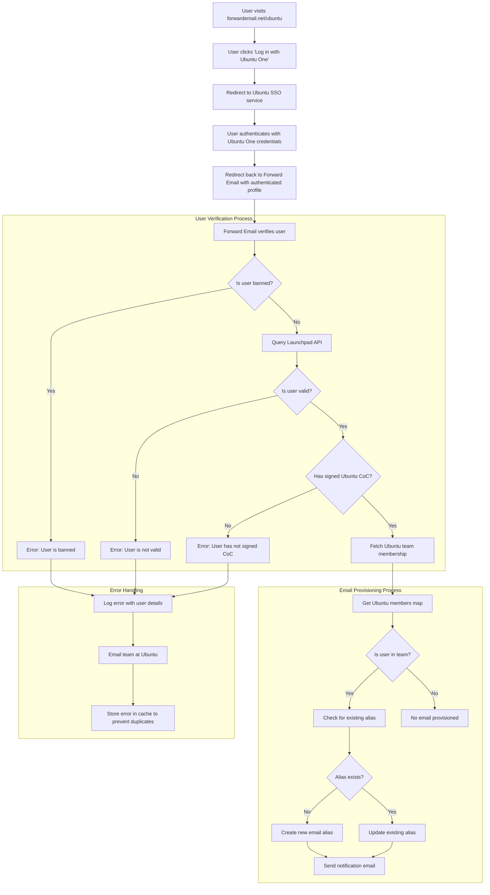

# Case Study: Hvordan Canonical driver Ubuntu e-mailhåndtering med Forward Emails open source enterprise-løsning {#case-study-how-canonical-powers-ubuntu-email-management-with-forward-emails-open-source-enterprise-solution}


## Indholdsfortegnelse {#table-of-contents}

* [Forord](#foreword)
* [Udfordringen: At håndtere et komplekst e-mailøkosystem](#the-challenge-managing-a-complex-email-ecosystem)
* [Vigtige pointer](#key-takeaways)
* [Hvorfor Forward Email](#why-forward-email)
* [Implementeringen: Problemfri SSO-integration](#the-implementation-seamless-sso-integration)
  * [Visualisering af autentificeringsflow](#authentication-flow-visualization)
  * [Tekniske implementeringsdetaljer](#technical-implementation-details)
* [DNS-konfiguration og e-mailrouting](#dns-configuration-and-email-routing)
* [Resultater: Strømlinet e-mailhåndtering og forbedret sikkerhed](#results-streamlined-email-management-and-enhanced-security)
  * [Operationel effektivitet](#operational-efficiency)
  * [Forbedret sikkerhed og privatliv](#enhanced-security-and-privacy)
  * [Omkostningsbesparelser](#cost-savings)
  * [Forbedret bidrageroplevelse](#improved-contributor-experience)
* [Fremadrettet: Fortsat samarbejde](#looking-forward-continued-collaboration)
* [Konklusion: Et perfekt open source-partnerskab](#conclusion-a-perfect-open-source-partnership)
* [Support til enterprise-kunder](#supporting-enterprise-clients)
  * [Kontakt os](#get-in-touch)
  * [Om Forward Email](#about-forward-email)


## Forord {#foreword}

I open source-softwareverdenen er få navne så betydningsfulde som [Canonical](https://en.wikipedia.org/wiki/Canonical_\(company\)), virksomheden bag [Ubuntu](https://en.wikipedia.org/wiki/Ubuntu), en af de mest populære Linux-distributioner globalt. Med et omfattende økosystem, der spænder over flere distributioner inklusive Ubuntu, [Kubuntu](https://en.wikipedia.org/wiki/Kubuntu), [Lubuntu](https://en.wikipedia.org/wiki/Lubuntu), [Edubuntu](https://en.wikipedia.org/wiki/Edubuntu) og andre, stod Canonical over for unikke udfordringer med at administrere e-mailadresser på tværs af deres mange domæner. Denne case study undersøger, hvordan Canonical samarbejdede med Forward Email for at skabe en problemfri, sikker og privatlivsfokuseret enterprise e-mailhåndteringsløsning, der passer perfekt til deres open source-værdier.


## Udfordringen: At håndtere et komplekst e-mailøkosystem {#the-challenge-managing-a-complex-email-ecosystem}

Canonicals økosystem er mangfoldigt og omfattende. Med millioner af brugere verden over og tusindvis af bidragydere på tværs af forskellige projekter, udgjorde håndteringen af e-mailadresser på tværs af flere domæner en betydelig udfordring. Kernebidragydere havde brug for officielle e-mailadresser (@ubuntu.com, @kubuntu.org osv.), der afspejlede deres engagement i projektet, samtidig med at sikkerhed og brugervenlighed blev opretholdt gennem et robust Ubuntu-domænestyringssystem.

Før implementeringen af Forward Email kæmpede Canonical med:

* At administrere e-mailadresser på tværs af flere domæner (@ubuntu.com, @kubuntu.org, @lubuntu.me, @edubuntu.org og @ubuntu.net)
* At levere en ensartet e-mailoplevelse for kernebidragydere
* At integrere e-mailtjenester med deres eksisterende [Ubuntu One](https://en.wikipedia.org/wiki/Ubuntu_One) Single Sign-On (SSO) system
* At finde en løsning, der stemte overens med deres engagement i privatliv, sikkerhed og open source e-mailsikkerhed
* At skalere deres sikre e-mailinfrastruktur omkostningseffektivt


## Vigtige pointer {#key-takeaways}

* Canonical implementerede med succes en samlet e-mailhåndteringsløsning på tværs af flere Ubuntu-domæner
* Forward Emails 100% open source-tilgang stemte perfekt overens med Canonicals værdier
* SSO-integration med Ubuntu One giver problemfri autentificering for bidragydere
* Kvante-resistent kryptering sikrer langsigtet sikkerhed for al e-mailkommunikation
* Løsningen skalerer omkostningseffektivt for at understøtte Canonicals voksende bidragerbase


## Hvorfor Forward Email {#why-forward-email}
Som den eneste 100% open-source e-mailtjenesteudbyder med fokus på privatliv og sikkerhed var Forward Email et naturligt valg til Canonicals behov for virksomhedens e-mail videresendelse. Vores værdier stemte perfekt overens med Canonicals engagement i open-source software og privatliv.

Nøglefaktorer, der gjorde Forward Email til det ideelle valg, inkluderede:

1. **Fuldstændig open-source kodebase**: Hele vores platform er open-source og tilgængelig på [GitHub](https://en.wikipedia.org/wiki/GitHub), hvilket muliggør gennemsigtighed og bidrag fra fællesskabet. I modsætning til mange "privatlivsfokuserede" e-mailudbydere, der kun open-sourcer deres frontend, mens de holder deres backend lukket, har vi gjort hele vores kodebase—både frontend og backend—tilgængelig for alle til inspektion på [GitHub](https://github.com/forwardemail/forwardemail.net).

2. **Privatlivsfokuseret tilgang**: I modsætning til andre udbydere gemmer vi ikke e-mails i delte databaser, og vi bruger robust kryptering med TLS. Vores grundlæggende privatlivsfilosofi er enkel: **dine e-mails tilhører dig og kun dig**. Dette princip styrer hver teknisk beslutning, vi træffer, fra hvordan vi håndterer e-mail videresendelse til hvordan vi implementerer kryptering.

3. **Ingen afhængighed af tredjepart**: Vi bruger ikke Amazon SES eller andre tredjepartstjenester, hvilket giver os fuld kontrol over e-mail infrastrukturen og eliminerer potentielle privatlivslækager gennem tredjepartstjenester.

4. **Omkostningseffektiv skalering**: Vores prismodel tillader organisationer at skalere uden at betale per bruger, hvilket gør det ideelt til Canonicals store bidragsyderbase.

5. **Kvantemodstandsdygtig kryptering**: Vi bruger individuelt krypterede SQLite-mailbokse med [ChaCha20-Poly1305](https://en.wikipedia.org/wiki/ChaCha20-Poly1305) som cipher til [kvantemodstandsdygtig kryptering](/blog/docs/best-quantum-safe-encrypted-email-service). Hver mailboks er en separat krypteret fil, hvilket betyder, at adgang til én brugers data ikke giver adgang til andres.


## Implementeringen: Problemfri SSO-integration {#the-implementation-seamless-sso-integration}

Et af de mest kritiske aspekter ved implementeringen var integrationen med Canonicals eksisterende Ubuntu One SSO-system. Denne integration ville tillade kernebidragsydere at administrere deres @ubuntu.com e-mailadresser ved hjælp af deres eksisterende Ubuntu One legitimationsoplysninger.

### Visualisering af autentificeringsflow {#authentication-flow-visualization}

Følgende diagram illustrerer det komplette autentificerings- og e-mailprovisioneringsflow:


```mermaid
flowchart TD
    A[User visits forwardemail.net/ubuntu] --> B[User clicks 'Log in with Ubuntu One']
    B --> C[Redirect to Ubuntu SSO service]
    C --> D[User authenticates with Ubuntu One credentials]
    D --> E[Redirect back to Forward Email with authenticated profile]
    E --> F[Forward Email verifies user]

    subgraph "User Verification Process"
        F --> G{Is user banned?}
        G -->|Yes| H[Error: User is banned]
        G -->|No| I[Query Launchpad API]
        I --> J{Is user valid?}
        J -->|No| K[Error: User is not valid]
        J -->|Yes| L{Has signed Ubuntu CoC?}
        L -->|No| M[Error: User has not signed CoC]
        L -->|Yes| N[Fetch Ubuntu team membership]
    end

    subgraph "Email Provisioning Process"
        N --> O[Get Ubuntu members map]
        O --> P{Is user in team?}
        P -->|Yes| Q[Check for existing alias]
        Q --> R{Alias exists?}
        R -->|No| S[Create new email alias]
        R -->|Yes| T[Update existing alias]
        S --> U[Send notification email]
        T --> U
        P -->|No| V[No email provisioned]
    end

    subgraph "Error Handling"
        H --> W[Log error with user details]
        K --> W
        M --> W
        W --> X[Email team at Ubuntu]
        X --> Y[Store error in cache to prevent duplicates]
    end
```

### Tekniske implementeringsdetaljer {#technical-implementation-details}

Integration mellem Forward Email og Ubuntu One SSO blev opnået gennem en brugerdefineret implementering af passport-ubuntu autentificeringsstrategien. Dette muliggjorde et problemfrit autentificeringsflow mellem Ubuntu One og Forward Emails systemer.
#### Godkendelsesflowet {#the-authentication-flow}

Godkendelsesprocessen fungerer som følger:

1. Brugere besøger den dedikerede Ubuntu e-mail administrationsside på [forwardemail.net/ubuntu](https://forwardemail.net/ubuntu)
2. De klikker på "Log ind med Ubuntu One" og bliver omdirigeret til Ubuntu SSO-tjenesten
3. Efter at have godkendt med deres Ubuntu One legitimationsoplysninger, bliver de omdirigeret tilbage til Forward Email med deres godkendte profil
4. Forward Email verificerer deres bidragyderstatus og opretter eller administrerer deres e-mailadresse i overensstemmelse hermed

Den tekniske implementering benyttede [`passport-ubuntu`](https://www.npmjs.com/package/passport-ubuntu) pakken, som er en [Passport](https://www.npmjs.com/package/passport) strategi til godkendelse med Ubuntu ved hjælp af [OpenID](https://en.wikipedia.org/wiki/OpenID). Konfigurationen omfattede:

```javascript
passport.use(new UbuntuStrategy({
  returnURL: process.env.UBUNTU_CALLBACK_URL,
  realm: process.env.UBUNTU_REALM,
  stateless: true
}, function(identifier, profile, done) {
  // Brugerverificering og e-mail provisioning logik
}));
```

#### Launchpad API-integration og validering {#launchpad-api-integration-and-validation}

En kritisk komponent i vores implementering er integrationen med [Launchpad](https://en.wikipedia.org/wiki/Launchpad_\(website\))'s API for at validere Ubuntu-brugere og deres teammedlemskaber. Vi oprettede genanvendelige hjælpefunktioner til at håndtere denne integration effektivt og pålideligt.

`sync-ubuntu-user.js` hjælpefunktionen er ansvarlig for at validere brugere gennem Launchpad API'en og administrere deres e-mailadresser. Her er en forenklet version af, hvordan den fungerer:

```javascript
async function syncUbuntuUser(user, map) {
  try {
    // Valider brugerobjekt
    if (!_.isObject(user) ||
        !isSANB(user[fields.ubuntuUsername]) ||
        !isSANB(user[fields.ubuntuProfileID]) ||
        !isEmail(user.email))
      throw new TypeError('Ugyldigt brugerobjekt');

    // Hent Ubuntu-medlemskort, hvis det ikke er angivet
    if (!(map instanceof Map))
      map = await getUbuntuMembersMap(resolver);

    // Tjek om brugeren er udelukket
    if (user[config.userFields.isBanned]) {
      throw new InvalidUbuntuUserError('Brugeren blev udelukket', { ignoreHook: true });
    }

    // Forespørg Launchpad API for at validere bruger
    const url = `https://api.launchpad.net/1.0/~${user[fields.ubuntuUsername]}`;
    const response = await retryRequest(url, { resolver });
    const json = await response.body.json();

    // Valider nødvendige boolske egenskaber
    if (!json.is_valid)
      throw new InvalidUbuntuUserError('Egenskaben "is_valid" var falsk');

    if (!json.is_ubuntu_coc_signer)
      throw new InvalidUbuntuUserError('Egenskaben "is_ubuntu_coc_signer" var falsk');

    // Behandl hvert domæne for brugeren
    await pMap([...map.keys()], async (name) => {
      // Find domæne i databasen
      const domain = await Domains.findOne({
        name,
        plan: 'team',
        has_txt_record: true
      }).populate('members.user');

      // Behandl brugerens e-mailalias for dette domæne
      if (map.get(name).has(user[fields.ubuntuUsername])) {
        // Brugeren er medlem af dette team, opret eller opdater alias
        let alias = await Aliases.findOne({
          user: user._id,
          domain: domain._id,
          name: user[fields.ubuntuUsername].toLowerCase()
        });

        if (!alias) {
          // Opret nyt alias med passende fejlhåndtering
          alias = await Aliases.create({
            user: user._id,
            domain: domain._id,
            name: user[fields.ubuntuUsername].toLowerCase(),
            recipients: [user.email],
            locale: user[config.lastLocaleField],
            is_enabled: true
          });

          // Underret administratorer om ny aliasoprettelse
          await emailHelper({
            template: 'alert',
            message: {
              to: adminEmailsForDomain,
              subject: `Ny @${domain.name} e-mailadresse oprettet`
            },
            locals: {
              message: `En ny e-mailadresse ${user[fields.ubuntuUsername].toLowerCase()}@${domain.name} blev oprettet for ${user.email}`
            }
          });
        }
      }
    });

    return true;
  } catch (err) {
    // Håndter og log fejl
    await logErrorWithUser(err, user);
    throw err;
  }
}
```
For at forenkle håndteringen af teammedlemskaber på tværs af forskellige Ubuntu-domæner, har vi oprettet en enkel kortlægning mellem domænenavne og deres tilsvarende Launchpad-teams:

```javascript
ubuntuTeamMapping: {
  'ubuntu.com': '~ubuntumembers',
  'kubuntu.org': '~kubuntu-members',
  'lubuntu.me': '~lubuntu-members',
  'edubuntu.org': '~edubuntu-members',
  'ubuntustudio.com': '~ubuntustudio-core',
  'ubuntu.net': '~ubuntu-smtp-test'
},
```

Denne simple kortlægning gør det muligt for os at automatisere processen med at tjekke teammedlemskaber og oprette e-mailadresser, hvilket gør systemet nemt at vedligeholde og udvide, når nye domæner tilføjes.

#### Fejlhåndtering og Notifikationer {#error-handling-and-notifications}

Vi har implementeret et robust fejlhåndteringssystem, der:

1. Logger alle fejl med detaljerede brugeroplysninger
2. Sender e-mails til Ubuntu-teamet, når der opdages problemer
3. Underretter administratorer, når nye bidragydere tilmelder sig og får oprettet e-mailadresser
4. Håndterer kanttilfælde såsom brugere, der ikke har underskrevet Ubuntu Code of Conduct

Dette sikrer, at eventuelle problemer hurtigt identificeres og håndteres, hvilket opretholder integriteten af e-mailsystemet.


## DNS-konfiguration og E-mail Routing {#dns-configuration-and-email-routing}

For hvert domæne, der administreres gennem Forward Email, tilføjede Canonical en simpel DNS TXT-post til validering:

```sh
❯ dig ubuntu.com txt
ubuntu.com.             600     IN      TXT     "forward-email-site-verification=6IsURgl2t7"
```

Denne verifikationspost bekræfter ejerskabet af domænet og gør det muligt for vores system sikkert at administrere e-mail for disse domæner. Canonical ruter mail gennem vores service via Postfix, som leverer en pålidelig og sikker e-mailleveringsinfrastruktur.


## Resultater: Strømlinet E-mailhåndtering og Forbedret Sikkerhed {#results-streamlined-email-management-and-enhanced-security}

Implementeringen af Forward Emails enterprise-løsning har givet betydelige fordele for Canonicals e-mailhåndtering på tværs af alle deres domæner:

### Operationel Effektivitet {#operational-efficiency}

* **Centraliseret administration**: Alle Ubuntu-relaterede domæner administreres nu gennem en enkelt grænseflade
* **Reduceret administrativ byrde**: Automatiseret oprettelse og selvbetjeningsstyring for bidragydere
* **Forenklet onboarding**: Nye bidragydere kan hurtigt få deres officielle e-mailadresser

### Forbedret Sikkerhed og Privatliv {#enhanced-security-and-privacy}

* **End-to-end kryptering**: Alle e-mails krypteres med avancerede standarder
* **Ingen delte databaser**: Hver brugers e-mails gemmes i individuelle krypterede SQLite-databaser, hvilket giver en sandboxed krypteringstilgang, der er fundamentalt mere sikker end traditionelle delte relationelle databaser
* **Open-source sikkerhed**: Den transparente kodebase muliggør sikkerhedsgennemgang af fællesskabet
* **Behandling i hukommelsen**: Vi gemmer ikke videresendte e-mails på disk, hvilket øger beskyttelsen af privatlivet
* **Ingen metadata-lagring**: Vi gemmer ikke optegnelser over, hvem der sender e-mails til hvem, i modsætning til mange e-mailudbydere

### Omkostningsbesparelser {#cost-savings}

* **Skalerbar prismodel**: Ingen brugerafgifter, hvilket gør det muligt for Canonical at tilføje bidragydere uden at øge omkostningerne
* **Reducerede infrastrukturbehov**: Ingen behov for at vedligeholde separate e-mailservere for forskellige domæner
* **Lavere supportbehov**: Selvbetjeningsstyring reducerer IT-supportsager

### Forbedret Bidragyderoplevelse {#improved-contributor-experience}

* **Sømløs autentificering**: Single sign-on med eksisterende Ubuntu One-legitimationsoplysninger
* **Konsistent branding**: En ensartet oplevelse på tværs af alle Ubuntu-relaterede tjenester
* **Pålidelig e-maillevering**: Høj kvalitet IP-rygte sikrer, at e-mails når deres destination

Integrationen med Forward Email har betydeligt strømlinet Canonicals e-mailhåndteringsproces. Bidragydere har nu en sømløs oplevelse med at administrere deres @ubuntu.com e-mailadresser, med reduceret administrativ byrde og forbedret sikkerhed.


## Fremadrettet: Fortsat Samarbejde {#looking-forward-continued-collaboration}

Partnerskabet mellem Canonical og Forward Email fortsætter med at udvikle sig. Vi arbejder sammen om flere initiativer:
* Udvidelse af e-mailtjenester til yderligere Ubuntu-relaterede domæner
* Forbedring af brugergrænsefladen baseret på bidragsyderes feedback
* Implementering af yderligere sikkerhedsfunktioner
* Undersøgelse af nye måder at udnytte vores open-source samarbejde på


## Konklusion: Et Perfekt Open-Source Partnerskab {#conclusion-a-perfect-open-source-partnership}

Samarbejdet mellem Canonical og Forward Email demonstrerer styrken i partnerskaber baseret på fælles værdier. Ved at vælge Forward Email som deres e-mailtjenesteudbyder fandt Canonical en løsning, der ikke kun opfyldte deres tekniske krav, men også passede perfekt til deres engagement i open-source software, privatliv og sikkerhed.

For organisationer, der administrerer flere domæner og kræver problemfri autentificering med eksisterende systemer, tilbyder Forward Email en fleksibel, sikker og privatlivsfokuseret løsning. Vores [open-source tilgang](https://forwardemail.net/blog/docs/why-open-source-email-security-privacy) sikrer gennemsigtighed og muliggør bidrag fra fællesskabet, hvilket gør det til et ideelt valg for organisationer, der værdsætter disse principper.

Efterhånden som både Canonical og Forward Email fortsætter med at innovere inden for deres respektive områder, står dette partnerskab som et bevis på styrken i open-source samarbejde og fælles værdier i skabelsen af effektive løsninger.

Du kan tjekke vores [real-time service status](https://status.forwardemail.net) for at se vores aktuelle e-mailleveringspræstation, som vi overvåger løbende for at sikre høj kvalitet i IP-rygte og e-maillevering.


## Support til Enterprise-kunder {#supporting-enterprise-clients}

Selvom denne casestudie fokuserer på vores partnerskab med Canonical, støtter Forward Email stolt adskillige enterprise-kunder på tværs af forskellige brancher, som værdsætter vores engagement i privatliv, sikkerhed og open-source principper.

Vores enterprise-løsninger er skræddersyet til at opfylde de specifikke behov hos organisationer i alle størrelser og tilbyder:

* Tilpasset domæne [e-mailadministration](/) på tværs af flere domæner
* Problemfri integration med eksisterende autentificeringssystemer
* Dedikeret Matrix chat-supportkanal
* Forbedrede sikkerhedsfunktioner inklusive [kvante-resistent kryptering](/blog/docs/best-quantum-safe-encrypted-email-service)
* Fuld dataportabilitet og ejerskab
* 100% open-source infrastruktur for gennemsigtighed og tillid

### Kontakt os {#get-in-touch}

Hvis din organisation har enterprise e-mailbehov, eller du er interesseret i at lære mere om, hvordan Forward Email kan hjælpe med at strømline din e-mailadministration samtidig med at forbedre privatliv og sikkerhed, vil vi meget gerne høre fra dig:

* Send os en e-mail direkte på `support@forwardemail.net`
* Indsend en hjælpeanmodning på vores [hjælpeside](https://forwardemail.net/help)
* Se vores [prisside](https://forwardemail.net/pricing) for enterprise-planer

Vores team er klar til at diskutere dine specifikke krav og udvikle en skræddersyet løsning, der stemmer overens med din organisations værdier og tekniske behov.

### Om Forward Email {#about-forward-email}

Forward Email er den 100% open-source og privatlivsfokuserede e-mailtjeneste. Vi tilbyder tilpasset domæne e-mail videresendelse, SMTP, IMAP og POP3 tjenester med fokus på sikkerhed, privatliv og gennemsigtighed. Hele vores kodebase er tilgængelig på [GitHub](https://github.com/forwardemail/forwardemail.net), og vi er forpligtet til at levere e-mailtjenester, der respekterer brugerens privatliv og sikkerhed. Lær mere om [hvorfor open-source e-mail er fremtiden](https://forwardemail.net/blog/docs/why-open-source-email-security-privacy), [hvordan vores e-mail videresendelse fungerer](https://forwardemail.net/blog/docs/best-email-forwarding-service), og [vores tilgang til beskyttelse af e-mail privatliv](https://forwardemail.net/blog/docs/email-privacy-protection-technical-implementation).
