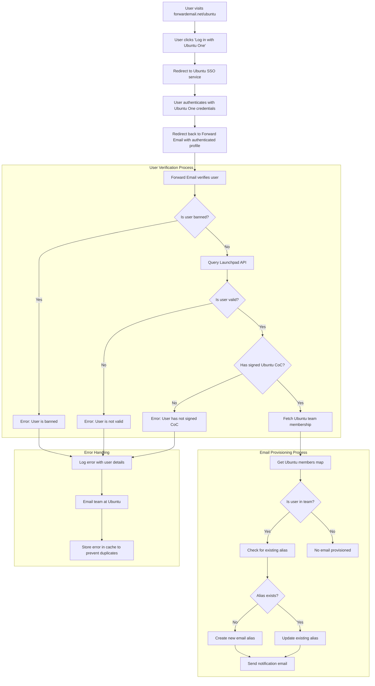

# Fallstudie: Wie Canonical Ubuntu-E-Mail-Management mit der Open-Source-Unternehmenslösung von Forward Email unterstützt {#case-study-how-canonical-powers-ubuntu-email-management-with-forward-emails-open-source-enterprise-solution}


## Inhaltsverzeichnis {#table-of-contents}

* [Vorwort](#foreword)
* [Die Herausforderung: Verwaltung eines komplexen E-Mail-Ökosystems](#the-challenge-managing-a-complex-email-ecosystem)
* [Die wichtigsten Erkenntnisse](#key-takeaways)
* [Warum E-Mails weiterleiten?](#why-forward-email)
* [Die Implementierung: Nahtlose SSO-Integration](#the-implementation-seamless-sso-integration)
  * [Visualisierung des Authentifizierungsflusses](#authentication-flow-visualization)
  * [Details zur technischen Implementierung](#technical-implementation-details)
* [DNS-Konfiguration und E-Mail-Routing](#dns-configuration-and-email-routing)
* [Ergebnisse: Optimiertes E-Mail-Management und verbesserte Sicherheit](#results-streamlined-email-management-and-enhanced-security)
  * [Betriebseffizienz](#operational-efficiency)
  * [Verbesserte Sicherheit und Privatsphäre](#enhanced-security-and-privacy)
  * [Kosteneinsparungen](#cost-savings)
  * [Verbesserte Erfahrung für Mitwirkende](#improved-contributor-experience)
* [Ausblick: Weitere Zusammenarbeit](#looking-forward-continued-collaboration)
* [Fazit: Eine perfekte Open-Source-Partnerschaft](#conclusion-a-perfect-open-source-partnership)
* [Unterstützung von Unternehmenskunden](#supporting-enterprise-clients)
  * [Schreiben Sie uns](#get-in-touch)
  * [Informationen zur E-Mail-Weiterleitung](#about-forward-email)

## Vorwort {#foreword}

In der Welt der Open-Source-Software haben nur wenige Namen so viel Gewicht wie [Kanonisch](https://en.wikipedia.org/wiki/Canonical_\(company\)), das Unternehmen hinter [Ubuntu](https://en.wikipedia.org/wiki/Ubuntu), einer der weltweit beliebtesten Linux-Distributionen. Mit einem riesigen Ökosystem, das mehrere Distributionen umfasst, darunter Ubuntu, [Frei](https://en.wikipedia.org/wiki/Kubuntu), [Lubuntu](https://en.wikipedia.org/wiki/Lubuntu), [Edubuntu](https://en.wikipedia.org/wiki/Edubuntu) und andere, stand Canonical vor besonderen Herausforderungen bei der Verwaltung von E-Mail-Adressen über seine zahlreichen Domänen hinweg. Diese Fallstudie untersucht, wie Canonical in Zusammenarbeit mit Forward Email eine nahtlose, sichere und datenschutzorientierte E-Mail-Management-Lösung für Unternehmen entwickelte, die perfekt zu den Open-Source-Werten des Unternehmens passt.

## Die Herausforderung: Verwaltung eines komplexen E-Mail-Ökosystems {#the-challenge-managing-a-complex-email-ecosystem}

Das Ökosystem von Canonical ist vielfältig und umfangreich. Mit Millionen von Nutzern weltweit und Tausenden von Mitwirkenden in verschiedenen Projekten stellte die Verwaltung von E-Mail-Adressen über mehrere Domänen hinweg eine große Herausforderung dar. Die wichtigsten Mitwirkenden benötigten offizielle E-Mail-Adressen (@ubuntu.com, @kubuntu.org usw.), die ihr Engagement im Projekt widerspiegelten und gleichzeitig Sicherheit und Benutzerfreundlichkeit durch ein robustes Ubuntu-Domänenverwaltungssystem gewährleisteten.

Vor der Implementierung von Forward Email hatte Canonical mit folgenden Problemen zu kämpfen:

* Verwaltung von E-Mail-Adressen über mehrere Domänen hinweg (@ubuntu.com, @kubuntu.org, @lubuntu.me, @edubuntu.org und @ubuntu.net)
* Bereitstellung eines einheitlichen E-Mail-Erlebnisses für wichtige Mitwirkende
* Integration von E-Mail-Diensten in das bestehende [Ubuntu One](https://en.wikipedia.org/wiki/Ubuntu_One) Single Sign-On (SSO)-System
* Suche nach einer Lösung, die mit dem Engagement für Datenschutz, Sicherheit und Open-Source-E-Mail-Sicherheit im Einklang steht
* Kosteneffiziente Skalierung der sicheren E-Mail-Infrastruktur

## Wichtige Erkenntnisse {#key-takeaways}

Canonical implementierte erfolgreich eine einheitliche E-Mail-Management-Lösung für mehrere Ubuntu-Domänen.

Der 100 % Open-Source-Ansatz von Forward Email passt perfekt zu den Werten von Canonical.

Die SSO-Integration mit Ubuntu One ermöglicht eine nahtlose Authentifizierung für Mitwirkende.

Quantenresistente Verschlüsselung gewährleistet langfristige Sicherheit für die gesamte E-Mail-Kommunikation.

Die Lösung ist kostengünstig skalierbar, um die wachsende Anzahl an Mitwirkenden von Canonical zu unterstützen.

## Warum E-Mail weiterleiten {#why-forward-email}

Als einziger 100 % Open-Source-E-Mail-Dienstleister mit Fokus auf Datenschutz und Sicherheit war Forward Email die ideale Lösung für Canonicals Anforderungen an die E-Mail-Weiterleitung im Unternehmen. Unsere Werte harmonieren perfekt mit Canonicals Engagement für Open-Source-Software und Datenschutz.

Zu den wichtigsten Faktoren, die Forward Email zur idealen Wahl machten, gehörten:

1. **Vollständige Open-Source-Codebasis**: Unsere gesamte Plattform ist Open Source und auf [GitHub](https://en.wikipedia.org/wiki/GitHub) verfügbar. Dies ermöglicht Transparenz und Community-Beiträge. Im Gegensatz zu vielen datenschutzorientierten E-Mail-Anbietern, die nur ihre Frontends als Open Source anbieten und ihre Backends geschlossen halten, haben wir unsere gesamte Codebasis – sowohl Frontend als auch Backend – unter [GitHub](https://github.com/forwardemail/forwardemail.net) für jedermann zugänglich gemacht.

2. **Datenschutzorientierter Ansatz**: Im Gegensatz zu anderen Anbietern speichern wir E-Mails nicht in gemeinsamen Datenbanken und verwenden robuste TLS-Verschlüsselung. Unsere grundlegende Datenschutzphilosophie ist einfach: **Ihre E-Mails gehören Ihnen und nur Ihnen**. Dieses Prinzip bestimmt jede unserer technischen Entscheidungen, von der E-Mail-Weiterleitung bis zur Implementierung der Verschlüsselung.

3. **Keine Abhängigkeit von Drittanbietern**: Wir verwenden weder Amazon SES noch andere Dienste von Drittanbietern. Dadurch haben wir die vollständige Kontrolle über die E-Mail-Infrastruktur und vermeiden potenzielle Datenschutzlecks durch Dienste von Drittanbietern.

4. **Kostengünstige Skalierung**: Unser Preismodell ermöglicht Unternehmen eine Skalierung, ohne pro Benutzer zu zahlen, und ist daher ideal für die große Beitragsbasis von Canonical.

5. **Quantenresistente Verschlüsselung**: Wir verwenden einzeln verschlüsselte SQLite-Postfächer mit [ChaCha20-Poly1305](https://en.wikipedia.org/wiki/ChaCha20-Poly1305) als Chiffre für [quantenresistente Verschlüsselung](/blog/docs/best-quantum-safe-encrypted-email-service). Jedes Postfach ist eine separate verschlüsselte Datei. Das bedeutet, dass der Zugriff auf die Daten eines Benutzers keinen Zugriff auf andere Benutzer gewährt.

## Die Implementierung: Nahtlose SSO-Integration {#the-implementation-seamless-sso-integration}

Einer der wichtigsten Aspekte der Implementierung war die Integration in das bestehende Ubuntu One SSO-System von Canonical. Diese Integration ermöglicht es den Hauptbeitragenden, ihre @ubuntu.com-E-Mail-Adressen mit ihren bestehenden Ubuntu One-Anmeldeinformationen zu verwalten.

### Visualisierung des Authentifizierungsflusses {#authentication-flow-visualization}

Das folgende Diagramm veranschaulicht den vollständigen Ablauf der Authentifizierung und E-Mail-Bereitstellung:



### Technische Implementierungsdetails {#technical-implementation-details}

Die Integration zwischen Forward Email und Ubuntu One SSO erfolgte durch eine benutzerdefinierte Implementierung der Passport-Ubuntu-Authentifizierungsstrategie. Dies ermöglichte einen nahtlosen Authentifizierungsfluss zwischen Ubuntu One und den Systemen von Forward Email.

#### Der Authentifizierungsablauf {#the-authentication-flow}

Der Authentifizierungsprozess funktioniert wie folgt:

1. Nutzer besuchen die Ubuntu-E-Mail-Verwaltungsseite unter [forwardemail.net/ubuntu](https://forwardemail.net/ubuntu).
2. Sie klicken auf „Mit Ubuntu One anmelden“ und werden zum Ubuntu-SSO-Dienst weitergeleitet.
3. Nach der Authentifizierung mit ihren Ubuntu-One-Anmeldedaten werden sie mit ihrem authentifizierten Profil zurück zu Forward Email geleitet.
4. Forward Email überprüft den Beitragsstatus und stellt die E-Mail-Adresse entsprechend bereit oder verwaltet sie.

Die technische Implementierung nutzte das Paket [`passport-ubuntu`](https://www.npmjs.com/package/passport-ubuntu), eine [Reisepass](https://www.npmjs.com/package/passport)-Strategie zur Authentifizierung bei Ubuntu mit [OpenID](https://en.wikipedia.org/wiki/OpenID). Die Konfiguration umfasste:

```javascript
passport.use(new UbuntuStrategy({
  returnURL: process.env.UBUNTU_CALLBACK_URL,
  realm: process.env.UBUNTU_REALM,
  stateless: true
}, function(identifier, profile, done) {
  // User verification and email provisioning logic
}));
```

#### Launchpad-API-Integration und -Validierung {#launchpad-api-integration-and-validation}

Ein wichtiger Bestandteil unserer Implementierung ist die Integration mit der API von [Launchpad](https://en.wikipedia.org/wiki/Launchpad_\(website\)), um Ubuntu-Benutzer und ihre Teammitgliedschaften zu validieren. Wir haben wiederverwendbare Hilfsfunktionen entwickelt, um diese Integration effizient und zuverlässig zu handhaben.

Die Hilfsfunktion `sync-ubuntu-user.js` ist für die Validierung von Benutzern über die Launchpad-API und die Verwaltung ihrer E-Mail-Adressen zuständig. Hier ist eine vereinfachte Darstellung der Funktionsweise:

```javascript
async function syncUbuntuUser(user, map) {
  try {
    // Validate user object
    if (!_.isObject(user) ||
        !isSANB(user[fields.ubuntuUsername]) ||
        !isSANB(user[fields.ubuntuProfileID]) ||
        !isEmail(user.email))
      throw new TypeError('Invalid user object');

    // Get Ubuntu members map if not provided
    if (!(map instanceof Map))
      map = await getUbuntuMembersMap(resolver);

    // Check if user is banned
    if (user[config.userFields.isBanned]) {
      throw new InvalidUbuntuUserError('User was banned', { ignoreHook: true });
    }

    // Query Launchpad API to validate user
    const url = `https://api.launchpad.net/1.0/~${user[fields.ubuntuUsername]}`;
    const response = await retryRequest(url, { resolver });
    const json = await response.body.json();

    // Validate required boolean properties
    if (!json.is_valid)
      throw new InvalidUbuntuUserError('Property "is_valid" was false');

    if (!json.is_ubuntu_coc_signer)
      throw new InvalidUbuntuUserError('Property "is_ubuntu_coc_signer" was false');

    // Process each domain for the user
    await pMap([...map.keys()], async (name) => {
      // Find domain in database
      const domain = await Domains.findOne({
        name,
        plan: 'team',
        has_txt_record: true
      }).populate('members.user');

      // Process user's email alias for this domain
      if (map.get(name).has(user[fields.ubuntuUsername])) {
        // User is a member of this team, create or update alias
        let alias = await Aliases.findOne({
          user: user._id,
          domain: domain._id,
          name: user[fields.ubuntuUsername].toLowerCase()
        });

        if (!alias) {
          // Create new alias with appropriate error handling
          alias = await Aliases.create({
            user: user._id,
            domain: domain._id,
            name: user[fields.ubuntuUsername].toLowerCase(),
            recipients: [user.email],
            locale: user[config.lastLocaleField],
            is_enabled: true
          });

          // Notify admins about new alias creation
          await emailHelper({
            template: 'alert',
            message: {
              to: adminEmailsForDomain,
              subject: `New @${domain.name} email address created`
            },
            locals: {
              message: `A new email address ${user[fields.ubuntuUsername].toLowerCase()}@${domain.name} was created for ${user.email}`
            }
          });
        }
      }
    });

    return true;
  } catch (err) {
    // Handle and log errors
    await logErrorWithUser(err, user);
    throw err;
  }
}
```

Um die Verwaltung von Teammitgliedschaften über verschiedene Ubuntu-Domänen hinweg zu vereinfachen, haben wir eine einfache Zuordnung zwischen Domänennamen und den entsprechenden Launchpad-Teams erstellt:

```javascript
ubuntuTeamMapping: {
  'ubuntu.com': '~ubuntumembers',
  'kubuntu.org': '~kubuntu-members',
  'lubuntu.me': '~lubuntu-members',
  'edubuntu.org': '~edubuntu-members',
  'ubuntustudio.com': '~ubuntustudio-core',
  'ubuntu.net': '~ubuntu-smtp-test'
},
```

Diese einfache Zuordnung ermöglicht uns die Automatisierung der Überprüfung von Teammitgliedschaften und der Bereitstellung von E-Mail-Adressen. Dadurch lässt sich das System einfach warten und erweitern, wenn neue Domänen hinzugefügt werden.

#### Fehlerbehandlung und Benachrichtigungen {#error-handling-and-notifications}

Wir haben ein robustes Fehlerbehandlungssystem implementiert, das:

1. Protokolliert alle Fehler mit detaillierten Benutzerinformationen.
2. Benachrichtigt das Ubuntu-Team per E-Mail, wenn Probleme erkannt werden.
3. Benachrichtigt Administratoren, wenn sich neue Mitwirkende anmelden und E-Mail-Adressen erstellt werden.
4. Behandelt Sonderfälle, z. B. Benutzer, die den Ubuntu-Verhaltenskodex nicht unterzeichnet haben.

Dadurch wird sichergestellt, dass etwaige Probleme schnell erkannt und behoben werden und die Integrität des E-Mail-Systems gewahrt bleibt.

## DNS-Konfiguration und E-Mail-Routing {#dns-configuration-and-email-routing}

Für jede über Forward Email verwaltete Domäne hat Canonical zur Validierung einen einfachen DNS-TXT-Eintrag hinzugefügt:

```sh
❯ dig ubuntu.com txt
ubuntu.com.             600     IN      TXT     "forward-email-site-verification=6IsURgl2t7"
```

Dieser Verifizierungsdatensatz bestätigt den Domänenbesitz und ermöglicht unserem System die sichere Verwaltung von E-Mails für diese Domänen. Canonical leitet E-Mails über unseren Dienst über Postfix weiter, das eine zuverlässige und sichere Infrastruktur für die E-Mail-Zustellung bietet.

## Ergebnisse: Optimiertes E-Mail-Management und verbesserte Sicherheit {#results-streamlined-email-management-and-enhanced-security}

Die Implementierung der Unternehmenslösung von Forward Email hat Canonicals E-Mail-Management in allen Domänen erhebliche Vorteile gebracht:

### Betriebseffizienz {#operational-efficiency}

* **Zentralisierte Verwaltung**: Alle Ubuntu-bezogenen Domänen werden jetzt über eine einzige Oberfläche verwaltet.
* **Reduzierter Verwaltungsaufwand**: Automatisierte Bereitstellung und Self-Service-Verwaltung für Mitwirkende.
* **Vereinfachtes Onboarding**: Neue Mitwirkende erhalten schnell ihre offizielle E-Mail-Adresse.

### Verbesserte Sicherheit und Datenschutz {#enhanced-security-and-privacy}

* **Ende-zu-Ende-Verschlüsselung**: Alle E-Mails werden nach fortschrittlichen Standards verschlüsselt.
* **Keine gemeinsamen Datenbanken**: Die E-Mails jedes Nutzers werden in individuellen, verschlüsselten SQLite-Datenbanken gespeichert. Dies bietet einen Sandbox-Verschlüsselungsansatz, der wesentlich sicherer ist als herkömmliche, gemeinsam genutzte relationale Datenbanken.
* **Open-Source-Sicherheit**: Die transparente Codebasis ermöglicht Sicherheitsüberprüfungen durch die Community.
* **In-Memory-Verarbeitung**: Wir speichern weitergeleitete E-Mails nicht auf der Festplatte, was den Datenschutz erhöht.
* **Keine Metadatenspeicherung**: Im Gegensatz zu vielen anderen E-Mail-Anbietern führen wir keine Aufzeichnungen darüber, wer wem E-Mails sendet.

### Kosteneinsparungen {#cost-savings}

* **Skalierbares Preismodell**: Keine Benutzergebühren, sodass Canonical weitere Mitarbeiter hinzufügen kann, ohne die Kosten zu erhöhen.
* **Geringere Infrastrukturanforderungen**: Keine separaten E-Mail-Server für verschiedene Domänen erforderlich.
* **Geringere Supportanforderungen**: Self-Service-Management reduziert die Anzahl der IT-Support-Tickets.

### Verbesserte Erfahrung für Mitwirkende {#improved-contributor-experience}

* **Nahtlose Authentifizierung**: Single Sign-On mit bestehenden Ubuntu One-Anmeldeinformationen
* **Konsistentes Branding**: Einheitliches Erlebnis für alle Ubuntu-Dienste
* **Zuverlässige E-Mail-Zustellung**: Hochwertige IP-Reputation stellt sicher, dass E-Mails ihr Ziel erreichen

Die Integration mit Forward Email hat den E-Mail-Verwaltungsprozess von Canonical deutlich optimiert. Mitarbeiter können ihre @ubuntu.com-E-Mail-Adressen nun nahtlos verwalten, mit reduziertem Verwaltungsaufwand und erhöhter Sicherheit.

## Ausblick: Weitere Zusammenarbeit {#looking-forward-continued-collaboration}

Die Partnerschaft zwischen Canonical und Forward Email entwickelt sich kontinuierlich weiter. Wir arbeiten gemeinsam an mehreren Initiativen:

* Erweiterung der E-Mail-Dienste auf weitere Ubuntu-bezogene Domänen
* Verbesserung der Benutzeroberfläche basierend auf dem Feedback der Mitwirkenden
* Implementierung zusätzlicher Sicherheitsfunktionen
* Erkundung neuer Möglichkeiten zur Nutzung unserer Open-Source-Zusammenarbeit

## Fazit: Eine perfekte Open-Source-Partnerschaft {#conclusion-a-perfect-open-source-partnership}

Die Zusammenarbeit zwischen Canonical und Forward Email zeigt, wie stark Partnerschaften auf gemeinsamen Werten basieren. Mit Forward Email als E-Mail-Dienstleister fand Canonical eine Lösung, die nicht nur die technischen Anforderungen erfüllte, sondern auch perfekt zu seinem Engagement für Open-Source-Software, Datenschutz und Sicherheit passte.

Für Organisationen, die mehrere Domänen verwalten und eine nahtlose Authentifizierung mit bestehenden Systemen benötigen, bietet Forward Email eine flexible, sichere und datenschutzorientierte Lösung. Unser [Open-Source-Ansatz](https://forwardemail.net/blog/docs/why-open-source-email-security-privacy) sorgt für Transparenz und ermöglicht Community-Beiträge. Damit ist er die ideale Wahl für Organisationen, die diese Prinzipien schätzen.

Da sowohl Canonical als auch Forward Email in ihren jeweiligen Bereichen weiterhin Innovationen hervorbringen, ist diese Partnerschaft ein Beweis für die Leistungsfähigkeit der Open-Source-Zusammenarbeit und gemeinsamer Werte bei der Schaffung effektiver Lösungen.

Sie können unseren [Servicestatus in Echtzeit](https://status.forwardemail.net) überprüfen, um unsere aktuelle E-Mail-Zustellungsleistung anzuzeigen, die wir kontinuierlich überwachen, um eine hochwertige IP-Reputation und E-Mail-Zustellbarkeit sicherzustellen.

## Unterstützung von Enterprise-Clients {#supporting-enterprise-clients}

Während sich diese Fallstudie auf unsere Partnerschaft mit Canonical konzentriert, unterstützt Forward Email stolz zahlreiche Unternehmenskunden aus verschiedenen Branchen, die unser Engagement für Datenschutz, Sicherheit und Open-Source-Prinzipien schätzen.

Unsere Unternehmenslösungen sind auf die spezifischen Anforderungen von Organisationen jeder Größe zugeschnitten und bieten:

* Benutzerdefinierte Domain [E-Mail-Verwaltung](/) über mehrere Domains hinweg
* Nahtlose Integration mit bestehenden Authentifizierungssystemen
* Eigener Matrix-Chat-Supportkanal
* Erweiterte Sicherheitsfunktionen, einschließlich [quantenresistente Verschlüsselung](/blog/docs/best-quantum-safe-encrypted-email-service)
* Vollständige Datenportabilität und -eigentümerschaft
* 100 % Open-Source-Infrastruktur für Transparenz und Vertrauen

### Kontaktieren Sie uns {#get-in-touch}

Wenn Ihr Unternehmen Bedarf an Enterprise-E-Mail hat oder Sie mehr darüber erfahren möchten, wie Forward Email Ihnen dabei helfen kann, Ihr E-Mail-Management zu optimieren und gleichzeitig Datenschutz und Sicherheit zu verbessern, würden wir uns freuen, von Ihnen zu hören:

* Senden Sie uns eine E-Mail an `support@forwardemail.net`
* Senden Sie eine Hilfeanfrage an [Hilfeseite](https://forwardemail.net/help)
* Informieren Sie sich über unsere Enterprise-Tarife in [Preisseite](https://forwardemail.net/pricing)

Unser Team ist bereit, Ihre spezifischen Anforderungen zu besprechen und eine maßgeschneiderte Lösung zu entwickeln, die den Werten und technischen Anforderungen Ihres Unternehmens entspricht.

### Informationen zum Weiterleiten von E-Mails {#about-forward-email}

Forward Email ist der 100 % Open-Source-E-Mail-Dienst mit Fokus auf Datenschutz. Wir bieten benutzerdefinierte Domain-E-Mail-Weiterleitungen sowie SMTP-, IMAP- und POP3-Dienste mit Fokus auf Sicherheit, Datenschutz und Transparenz. Unsere gesamte Codebasis ist auf [GitHub](https://github.com/forwardemail/forwardemail.net) verfügbar. Wir setzen uns dafür ein, E-Mail-Dienste anzubieten, die die Privatsphäre und Sicherheit unserer Nutzer respektieren. Erfahren Sie mehr über [Warum Open-Source-E-Mail die Zukunft ist](https://forwardemail.net/blog/docs/why-open-source-email-security-privacy), [So funktioniert unsere E-Mail-Weiterleitung](https://forwardemail.net/blog/docs/best-email-forwarding-service) und [Unser Ansatz zum Schutz der E-Mail-Privatsphäre](https://forwardemail.net/blog/docs/email-privacy-protection-technical-implementation).