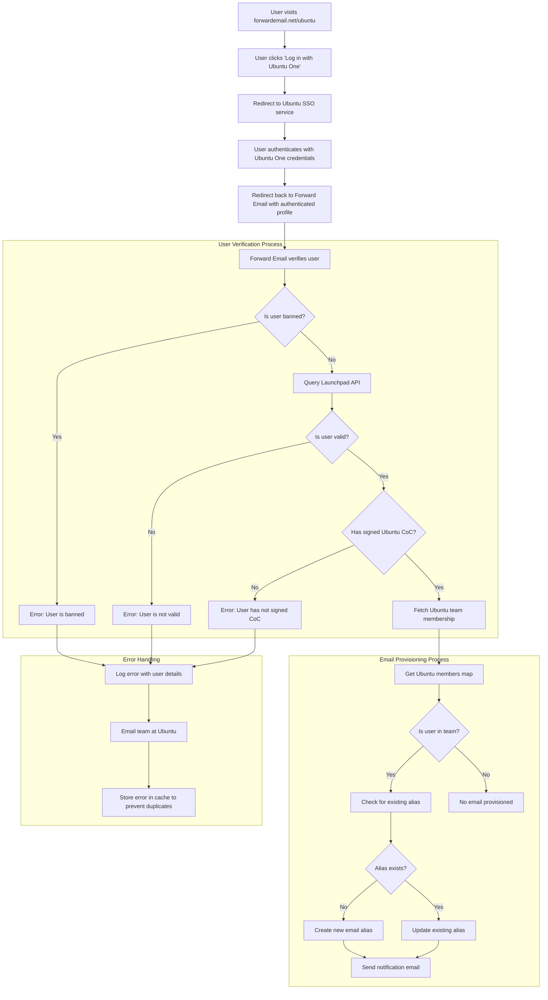

# Fallstudie: Wie Canonical das E-Mail-Management von Ubuntu mit der Open-Source-Enterprise-Lösung von Forward Email unterstützt {#case-study-how-canonical-powers-ubuntu-email-management-with-forward-emails-open-source-enterprise-solution}


## Inhaltsverzeichnis {#table-of-contents}

* [Vorwort](#foreword)
* [Die Herausforderung: Verwaltung eines komplexen E-Mail-Ökosystems](#the-challenge-managing-a-complex-email-ecosystem)
* [Wichtigste Erkenntnisse](#key-takeaways)
* [Warum Forward Email](#why-forward-email)
* [Die Implementierung: Nahtlose SSO-Integration](#the-implementation-seamless-sso-integration)
  * [Visualisierung des Authentifizierungsablaufs](#authentication-flow-visualization)
  * [Technische Implementierungsdetails](#technical-implementation-details)
* [DNS-Konfiguration und E-Mail-Routing](#dns-configuration-and-email-routing)
* [Ergebnisse: Optimiertes E-Mail-Management und verbesserte Sicherheit](#results-streamlined-email-management-and-enhanced-security)
  * [Betriebliche Effizienz](#operational-efficiency)
  * [Verbesserte Sicherheit und Datenschutz](#enhanced-security-and-privacy)
  * [Kosteneinsparungen](#cost-savings)
  * [Verbesserte Erfahrung für Mitwirkende](#improved-contributor-experience)
* [Ausblick: Fortgesetzte Zusammenarbeit](#looking-forward-continued-collaboration)
* [Fazit: Eine perfekte Open-Source-Partnerschaft](#conclusion-a-perfect-open-source-partnership)
* [Unterstützung von Enterprise-Kunden](#supporting-enterprise-clients)
  * [Kontakt aufnehmen](#get-in-touch)
  * [Über Forward Email](#about-forward-email)


## Vorwort {#foreword}

In der Welt der Open-Source-Software gibt es nur wenige Namen mit so viel Gewicht wie [Canonical](https://en.wikipedia.org/wiki/Canonical_\(company\)), das Unternehmen hinter [Ubuntu](https://en.wikipedia.org/wiki/Ubuntu), einer der weltweit beliebtesten Linux-Distributionen. Mit einem umfangreichen Ökosystem, das mehrere Distributionen wie Ubuntu, [Kubuntu](https://en.wikipedia.org/wiki/Kubuntu), [Lubuntu](https://en.wikipedia.org/wiki/Lubuntu), [Edubuntu](https://en.wikipedia.org/wiki/Edubuntu) und andere umfasst, stand Canonical vor einzigartigen Herausforderungen bei der Verwaltung von E-Mail-Adressen über ihre zahlreichen Domains hinweg. Diese Fallstudie zeigt, wie Canonical mit Forward Email zusammenarbeitete, um eine nahtlose, sichere und datenschutzorientierte Enterprise-E-Mail-Management-Lösung zu schaffen, die perfekt mit ihren Open-Source-Werten übereinstimmt.


## Die Herausforderung: Verwaltung eines komplexen E-Mail-Ökosystems {#the-challenge-managing-a-complex-email-ecosystem}

Das Ökosystem von Canonical ist vielfältig und umfangreich. Mit Millionen von Nutzern weltweit und Tausenden von Mitwirkenden in verschiedenen Projekten stellte die Verwaltung von E-Mail-Adressen über mehrere Domains hinweg erhebliche Herausforderungen dar. Kernmitwirkende benötigten offizielle E-Mail-Adressen (@ubuntu.com, @kubuntu.org usw.), die ihre Beteiligung am Projekt widerspiegelten und gleichzeitig Sicherheit und Benutzerfreundlichkeit durch ein robustes Ubuntu-Domain-Management-System gewährleisteten.

Vor der Implementierung von Forward Email hatte Canonical Schwierigkeiten mit:

* Verwaltung von E-Mail-Adressen über mehrere Domains (@ubuntu.com, @kubuntu.org, @lubuntu.me, @edubuntu.org und @ubuntu.net)
* Bereitstellung einer konsistenten E-Mail-Erfahrung für Kernmitwirkende
* Integration der E-Mail-Dienste in ihr bestehendes [Ubuntu One](https://en.wikipedia.org/wiki/Ubuntu_One) Single Sign-On (SSO)-System
* Finden einer Lösung, die mit ihrem Engagement für Datenschutz, Sicherheit und Open-Source-E-Mail-Sicherheit übereinstimmt
* Kosteneffiziente Skalierung ihrer sicheren E-Mail-Infrastruktur


## Wichtigste Erkenntnisse {#key-takeaways}

* Canonical hat erfolgreich eine einheitliche E-Mail-Management-Lösung über mehrere Ubuntu-Domains implementiert
* Der 100 % Open-Source-Ansatz von Forward Email passte perfekt zu den Werten von Canonical
* Die SSO-Integration mit Ubuntu One ermöglicht eine nahtlose Authentifizierung für Mitwirkende
* Quantenresistente Verschlüsselung gewährleistet langfristige Sicherheit aller E-Mail-Kommunikationen
* Die Lösung skaliert kosteneffizient, um die wachsende Mitwirkendenbasis von Canonical zu unterstützen


## Warum Forward Email {#why-forward-email}
Als der einzige zu 100 % Open-Source-E-Mail-Dienstanbieter mit Fokus auf Datenschutz und Sicherheit war Forward Email eine natürliche Wahl für die E-Mail-Weiterleitungsanforderungen von Canonical im Unternehmensbereich. Unsere Werte stimmten perfekt mit Canonicals Engagement für Open-Source-Software und Datenschutz überein.

Wichtige Faktoren, die Forward Email zur idealen Wahl machten, waren:

1. **Vollständig offene Codebasis**: Unsere gesamte Plattform ist Open Source und auf [GitHub](https://en.wikipedia.org/wiki/GitHub) verfügbar, was Transparenz und Beiträge der Community ermöglicht. Im Gegensatz zu vielen „datenschutzorientierten“ E-Mail-Anbietern, die nur ihre Frontends offenlegen, während ihre Backends geschlossen bleiben, haben wir unseren gesamten Code – sowohl Frontend als auch Backend – für jeden zur Einsicht auf [GitHub](https://github.com/forwardemail/forwardemail.net) bereitgestellt.

2. **Datenschutzorientierter Ansatz**: Im Gegensatz zu anderen Anbietern speichern wir keine E-Mails in gemeinsamen Datenbanken und verwenden eine robuste Verschlüsselung mit TLS. Unsere grundlegende Datenschutzphilosophie ist einfach: **Ihre E-Mails gehören Ihnen und nur Ihnen**. Dieses Prinzip leitet jede technische Entscheidung, die wir treffen, von der Handhabung der E-Mail-Weiterleitung bis zur Implementierung der Verschlüsselung.

3. **Keine Abhängigkeit von Drittanbietern**: Wir verwenden weder Amazon SES noch andere Drittanbieterdienste, was uns die vollständige Kontrolle über die E-Mail-Infrastruktur gibt und potenzielle Datenschutzlecks durch Drittanbieter eliminiert.

4. **Kosten-effiziente Skalierung**: Unser Preismodell ermöglicht es Organisationen, ohne Benutzergebühren zu skalieren, was ideal für Canonicals große Beiträgerbasis ist.

5. **Quantenresistente Verschlüsselung**: Wir verwenden individuell verschlüsselte SQLite-Mailboxen mit [ChaCha20-Poly1305](https://en.wikipedia.org/wiki/ChaCha20-Poly1305) als Verschlüsselungsverfahren für [quantenresistente Verschlüsselung](/blog/docs/best-quantum-safe-encrypted-email-service). Jede Mailbox ist eine separate verschlüsselte Datei, was bedeutet, dass der Zugriff auf die Daten eines Benutzers keinen Zugriff auf andere gewährt.


## Die Implementierung: Nahtlose SSO-Integration {#the-implementation-seamless-sso-integration}

Einer der kritischsten Aspekte der Implementierung war die Integration mit Canonicals bestehendem Ubuntu One SSO-System. Diese Integration ermöglicht es Kernbeiträgern, ihre @ubuntu.com-E-Mail-Adressen mit ihren bestehenden Ubuntu One-Anmeldedaten zu verwalten.

### Visualisierung des Authentifizierungsablaufs {#authentication-flow-visualization}

Das folgende Diagramm veranschaulicht den vollständigen Authentifizierungs- und E-Mail-Bereitstellungsablauf:


```mermaid
flowchart TD
    A[User visits forwardemail.net/ubuntu] --> B[User clicks 'Log in with Ubuntu One']
    B --> C[Redirect to Ubuntu SSO service]
    C --> D[User authenticates with Ubuntu One credentials]
    D --> E[Redirect back to Forward Email with authenticated profile]
    E --> F[Forward Email verifies user]

    subgraph "User Verification Process"
        F --> G{Is user banned?}
        G -->|Yes| H[Error: User is banned]
        G -->|No| I[Query Launchpad API]
        I --> J{Is user valid?}
        J -->|No| K[Error: User is not valid]
        J -->|Yes| L{Has signed Ubuntu CoC?}
        L -->|No| M[Error: User has not signed CoC]
        L -->|Yes| N[Fetch Ubuntu team membership]
    end

    subgraph "Email Provisioning Process"
        N --> O[Get Ubuntu members map]
        O --> P{Is user in team?}
        P -->|Yes| Q[Check for existing alias]
        Q --> R{Alias exists?}
        R -->|No| S[Create new email alias]
        R -->|Yes| T[Update existing alias]
        S --> U[Send notification email]
        T --> U
        P -->|No| V[No email provisioned]
    end

    subgraph "Error Handling"
        H --> W[Log error with user details]
        K --> W
        M --> W
        W --> X[Email team at Ubuntu]
        X --> Y[Store error in cache to prevent duplicates]
    end
```

### Technische Implementierungsdetails {#technical-implementation-details}

Die Integration zwischen Forward Email und Ubuntu One SSO wurde durch eine benutzerdefinierte Implementierung der passport-ubuntu-Authentifizierungsstrategie realisiert. Dies ermöglichte einen nahtlosen Authentifizierungsablauf zwischen Ubuntu One und den Systemen von Forward Email.
#### Der Authentifizierungsablauf {#the-authentication-flow}

Der Authentifizierungsprozess funktioniert wie folgt:

1. Benutzer besuchen die spezielle Ubuntu-E-Mail-Verwaltungsseite unter [forwardemail.net/ubuntu](https://forwardemail.net/ubuntu)
2. Sie klicken auf „Mit Ubuntu One anmelden“ und werden zum Ubuntu SSO-Dienst weitergeleitet
3. Nach der Authentifizierung mit ihren Ubuntu One-Anmeldedaten werden sie mit ihrem authentifizierten Profil zurück zu Forward Email geleitet
4. Forward Email überprüft ihren Mitwirkendenstatus und richtet ihre E-Mail-Adresse entsprechend ein oder verwaltet sie

Die technische Umsetzung nutzte das [`passport-ubuntu`](https://www.npmjs.com/package/passport-ubuntu) Paket, eine [Passport](https://www.npmjs.com/package/passport) Strategie zur Authentifizierung mit Ubuntu über [OpenID](https://en.wikipedia.org/wiki/OpenID). Die Konfiguration beinhaltete:

```javascript
passport.use(new UbuntuStrategy({
  returnURL: process.env.UBUNTU_CALLBACK_URL,
  realm: process.env.UBUNTU_REALM,
  stateless: true
}, function(identifier, profile, done) {
  // Benutzerverifizierungs- und E-Mail-Bereitstellungslogik
}));
```

#### Launchpad API-Integration und Validierung {#launchpad-api-integration-and-validation}

Ein kritischer Bestandteil unserer Implementierung ist die Integration mit der API von [Launchpad](https://en.wikipedia.org/wiki/Launchpad_\(website\)), um Ubuntu-Benutzer und deren Teammitgliedschaften zu validieren. Wir haben wiederverwendbare Hilfsfunktionen erstellt, um diese Integration effizient und zuverlässig zu handhaben.

Die Hilfsfunktion `sync-ubuntu-user.js` ist verantwortlich für die Validierung von Benutzern über die Launchpad API und die Verwaltung ihrer E-Mail-Adressen. Hier ist eine vereinfachte Version, wie sie funktioniert:

```javascript
async function syncUbuntuUser(user, map) {
  try {
    // Benutzerobjekt validieren
    if (!_.isObject(user) ||
        !isSANB(user[fields.ubuntuUsername]) ||
        !isSANB(user[fields.ubuntuProfileID]) ||
        !isEmail(user.email))
      throw new TypeError('Ungültiges Benutzerobjekt');

    // Ubuntu-Mitgliederkarte abrufen, falls nicht bereitgestellt
    if (!(map instanceof Map))
      map = await getUbuntuMembersMap(resolver);

    // Prüfen, ob Benutzer gesperrt ist
    if (user[config.userFields.isBanned]) {
      throw new InvalidUbuntuUserError('Benutzer wurde gesperrt', { ignoreHook: true });
    }

    // Launchpad API abfragen, um Benutzer zu validieren
    const url = `https://api.launchpad.net/1.0/~${user[fields.ubuntuUsername]}`;
    const response = await retryRequest(url, { resolver });
    const json = await response.body.json();

    // Erforderliche boolesche Eigenschaften validieren
    if (!json.is_valid)
      throw new InvalidUbuntuUserError('Eigenschaft „is_valid“ war falsch');

    if (!json.is_ubuntu_coc_signer)
      throw new InvalidUbuntuUserError('Eigenschaft „is_ubuntu_coc_signer“ war falsch');

    // Jede Domain für den Benutzer verarbeiten
    await pMap([...map.keys()], async (name) => {
      // Domain in der Datenbank finden
      const domain = await Domains.findOne({
        name,
        plan: 'team',
        has_txt_record: true
      }).populate('members.user');

      // E-Mail-Alias des Benutzers für diese Domain verarbeiten
      if (map.get(name).has(user[fields.ubuntuUsername])) {
        // Benutzer ist Mitglied dieses Teams, Alias erstellen oder aktualisieren
        let alias = await Aliases.findOne({
          user: user._id,
          domain: domain._id,
          name: user[fields.ubuntuUsername].toLowerCase()
        });

        if (!alias) {
          // Neuen Alias mit entsprechender Fehlerbehandlung erstellen
          alias = await Aliases.create({
            user: user._id,
            domain: domain._id,
            name: user[fields.ubuntuUsername].toLowerCase(),
            recipients: [user.email],
            locale: user[config.lastLocaleField],
            is_enabled: true
          });

          // Administratoren über die Erstellung des neuen Alias benachrichtigen
          await emailHelper({
            template: 'alert',
            message: {
              to: adminEmailsForDomain,
              subject: `Neue @${domain.name} E-Mail-Adresse erstellt`
            },
            locals: {
              message: `Eine neue E-Mail-Adresse ${user[fields.ubuntuUsername].toLowerCase()}@${domain.name} wurde für ${user.email} erstellt`
            }
          });
        }
      }
    });

    return true;
  } catch (err) {
    // Fehler behandeln und protokollieren
    await logErrorWithUser(err, user);
    throw err;
  }
}
```
Um die Verwaltung von Teammitgliedschaften über verschiedene Ubuntu-Domains hinweg zu vereinfachen, haben wir eine einfache Zuordnung zwischen Domainnamen und den entsprechenden Launchpad-Teams erstellt:

```javascript
ubuntuTeamMapping: {
  'ubuntu.com': '~ubuntumembers',
  'kubuntu.org': '~kubuntu-members',
  'lubuntu.me': '~lubuntu-members',
  'edubuntu.org': '~edubuntu-members',
  'ubuntustudio.com': '~ubuntustudio-core',
  'ubuntu.net': '~ubuntu-smtp-test'
},
```

Diese einfache Zuordnung ermöglicht es uns, den Prozess der Überprüfung von Teammitgliedschaften und der Bereitstellung von E-Mail-Adressen zu automatisieren, wodurch das System leicht zu warten und zu erweitern ist, wenn neue Domains hinzugefügt werden.

#### Fehlerbehandlung und Benachrichtigungen {#error-handling-and-notifications}

Wir haben ein robustes Fehlerbehandlungssystem implementiert, das:

1. Alle Fehler mit detaillierten Benutzerinformationen protokolliert
2. Das Ubuntu-Team per E-Mail benachrichtigt, wenn Probleme erkannt werden
3. Administratoren informiert, wenn neue Mitwirkende sich anmelden und E-Mail-Adressen erstellt werden
4. Randfälle behandelt, wie Benutzer, die den Ubuntu-Verhaltenskodex nicht unterschrieben haben

Dies stellt sicher, dass Probleme schnell erkannt und behoben werden, um die Integrität des E-Mail-Systems zu gewährleisten.


## DNS-Konfiguration und E-Mail-Routing {#dns-configuration-and-email-routing}

Für jede Domain, die über Forward Email verwaltet wird, hat Canonical einen einfachen DNS-TXT-Eintrag zur Validierung hinzugefügt:

```sh
❯ dig ubuntu.com txt
ubuntu.com.             600     IN      TXT     "forward-email-site-verification=6IsURgl2t7"
```

Dieser Verifizierungs-Eintrag bestätigt den Domainbesitz und ermöglicht unserem System, E-Mails für diese Domains sicher zu verwalten. Canonical leitet E-Mails über unseren Dienst mittels Postfix weiter, der eine zuverlässige und sichere E-Mail-Zustellinfrastruktur bereitstellt.


## Ergebnisse: Optimierte E-Mail-Verwaltung und verbesserte Sicherheit {#results-streamlined-email-management-and-enhanced-security}

Die Implementierung der Enterprise-Lösung von Forward Email hat für Canonical bei der E-Mail-Verwaltung über alle ihre Domains hinweg erhebliche Vorteile gebracht:

### Operative Effizienz {#operational-efficiency}

* **Zentralisierte Verwaltung**: Alle Ubuntu-bezogenen Domains werden jetzt über eine einzige Schnittstelle verwaltet
* **Reduzierter administrativer Aufwand**: Automatisierte Bereitstellung und Selbstverwaltung für Mitwirkende
* **Vereinfachtes Onboarding**: Neue Mitwirkende können schnell ihre offiziellen E-Mail-Adressen erhalten

### Verbesserte Sicherheit und Datenschutz {#enhanced-security-and-privacy}

* **Ende-zu-Ende-Verschlüsselung**: Alle E-Mails werden mit fortschrittlichen Standards verschlüsselt
* **Keine gemeinsamen Datenbanken**: Die E-Mails jedes Benutzers werden in individuellen verschlüsselten SQLite-Datenbanken gespeichert, was einen sandboxartigen Verschlüsselungsansatz bietet, der grundlegend sicherer ist als traditionelle gemeinsame relationale Datenbanken
* **Open-Source-Sicherheit**: Der transparente Code ermöglicht Sicherheitsüberprüfungen durch die Community
* **In-Memory-Verarbeitung**: Weitergeleitete E-Mails werden nicht auf der Festplatte gespeichert, was den Datenschutz erhöht
* **Keine Metadatenspeicherung**: Wir speichern keine Aufzeichnungen darüber, wer wem E-Mails sendet, im Gegensatz zu vielen E-Mail-Anbietern

### Kosteneinsparungen {#cost-savings}

* **Skalierbares Preismodell**: Keine Gebühren pro Benutzer, wodurch Canonical Mitwirkende hinzufügen kann, ohne die Kosten zu erhöhen
* **Reduzierter Infrastrukturbedarf**: Kein Bedarf, separate E-Mail-Server für verschiedene Domains zu betreiben
* **Geringerer Supportbedarf**: Selbstverwaltung reduziert IT-Support-Tickets

### Verbesserte Mitwirkenden-Erfahrung {#improved-contributor-experience}

* **Nahtlose Authentifizierung**: Single Sign-On mit bestehenden Ubuntu One-Anmeldedaten
* **Konsistentes Branding**: Einheitliches Erlebnis über alle Ubuntu-bezogenen Dienste hinweg
* **Zuverlässige E-Mail-Zustellung**: Hochwertiger IP-Ruf stellt sicher, dass E-Mails ihr Ziel erreichen

Die Integration mit Forward Email hat den E-Mail-Verwaltungsprozess bei Canonical erheblich vereinfacht. Mitwirkende haben nun ein nahtloses Erlebnis bei der Verwaltung ihrer @ubuntu.com-E-Mail-Adressen, mit reduziertem administrativem Aufwand und verbesserter Sicherheit.


## Ausblick: Fortgesetzte Zusammenarbeit {#looking-forward-continued-collaboration}

Die Partnerschaft zwischen Canonical und Forward Email entwickelt sich weiterhin. Wir arbeiten gemeinsam an mehreren Initiativen:
* Erweiterung der E-Mail-Dienste auf weitere Ubuntu-bezogene Domains
* Verbesserung der Benutzeroberfläche basierend auf dem Feedback der Mitwirkenden
* Implementierung zusätzlicher Sicherheitsfunktionen
* Erkundung neuer Möglichkeiten zur Nutzung unserer Open-Source-Zusammenarbeit


## Fazit: Eine perfekte Open-Source-Partnerschaft {#conclusion-a-perfect-open-source-partnership}

Die Zusammenarbeit zwischen Canonical und Forward Email zeigt die Stärke von Partnerschaften, die auf gemeinsamen Werten basieren. Durch die Wahl von Forward Email als ihren E-Mail-Dienstleister fand Canonical eine Lösung, die nicht nur ihre technischen Anforderungen erfüllte, sondern auch perfekt mit ihrem Engagement für Open-Source-Software, Datenschutz und Sicherheit übereinstimmte.

Für Organisationen, die mehrere Domains verwalten und eine nahtlose Authentifizierung mit bestehenden Systemen benötigen, bietet Forward Email eine flexible, sichere und datenschutzorientierte Lösung. Unser [Open-Source-Ansatz](https://forwardemail.net/blog/docs/why-open-source-email-security-privacy) gewährleistet Transparenz und ermöglicht Beiträge der Community, was es zu einer idealen Wahl für Organisationen macht, die diese Prinzipien schätzen.

Während Canonical und Forward Email weiterhin in ihren jeweiligen Bereichen innovativ sind, steht diese Partnerschaft als Beweis für die Kraft der Open-Source-Zusammenarbeit und gemeinsamer Werte bei der Schaffung effektiver Lösungen.

Sie können unseren [Echtzeit-Service-Status](https://status.forwardemail.net) überprüfen, um unsere aktuelle E-Mail-Zustellungsleistung zu sehen, die wir kontinuierlich überwachen, um eine hochwertige IP-Reputation und E-Mail-Zustellbarkeit sicherzustellen.


## Unterstützung von Unternehmenskunden {#supporting-enterprise-clients}

Obwohl diese Fallstudie sich auf unsere Partnerschaft mit Canonical konzentriert, unterstützt Forward Email stolz zahlreiche Unternehmenskunden aus verschiedenen Branchen, die unser Engagement für Datenschutz, Sicherheit und Open-Source-Prinzipien schätzen.

Unsere Unternehmenslösungen sind maßgeschneidert, um die spezifischen Bedürfnisse von Organisationen jeder Größe zu erfüllen, und bieten:

* Verwaltung von benutzerdefinierten Domains [E-Mail-Verwaltung](/) über mehrere Domains hinweg
* Nahtlose Integration mit bestehenden Authentifizierungssystemen
* Dedizierter Matrix-Chat-Support-Kanal
* Erweiterte Sicherheitsfunktionen einschließlich [quantensicherer Verschlüsselung](/blog/docs/best-quantum-safe-encrypted-email-service)
* Vollständige Datenportabilität und Eigentum
* 100 % Open-Source-Infrastruktur für Transparenz und Vertrauen

### Kontakt aufnehmen {#get-in-touch}

Wenn Ihre Organisation Unternehmens-E-Mail-Bedürfnisse hat oder Sie mehr darüber erfahren möchten, wie Forward Email Ihnen helfen kann, Ihre E-Mail-Verwaltung zu optimieren und gleichzeitig Datenschutz und Sicherheit zu verbessern, freuen wir uns auf Ihre Kontaktaufnahme:

* Schreiben Sie uns direkt an `support@forwardemail.net`
* Senden Sie eine Hilfsanfrage auf unserer [Hilfeseite](https://forwardemail.net/help)
* Sehen Sie sich unsere [Preisseite](https://forwardemail.net/pricing) für Unternehmenspläne an

Unser Team steht bereit, um Ihre spezifischen Anforderungen zu besprechen und eine maßgeschneiderte Lösung zu entwickeln, die mit den Werten und technischen Bedürfnissen Ihrer Organisation übereinstimmt.

### Über Forward Email {#about-forward-email}

Forward Email ist der 100 % Open-Source- und datenschutzorientierte E-Mail-Dienst. Wir bieten E-Mail-Weiterleitung für benutzerdefinierte Domains, SMTP-, IMAP- und POP3-Dienste mit Fokus auf Sicherheit, Datenschutz und Transparenz. Unser gesamter Code ist auf [GitHub](https://github.com/forwardemail/forwardemail.net) verfügbar, und wir verpflichten uns, E-Mail-Dienste anzubieten, die die Privatsphäre und Sicherheit der Nutzer respektieren. Erfahren Sie mehr darüber, [warum Open-Source-E-Mail die Zukunft ist](https://forwardemail.net/blog/docs/why-open-source-email-security-privacy), [wie unsere E-Mail-Weiterleitung funktioniert](https://forwardemail.net/blog/docs/best-email-forwarding-service) und [unseren Ansatz zum Schutz der E-Mail-Privatsphäre](https://forwardemail.net/blog/docs/email-privacy-protection-technical-implementation).
