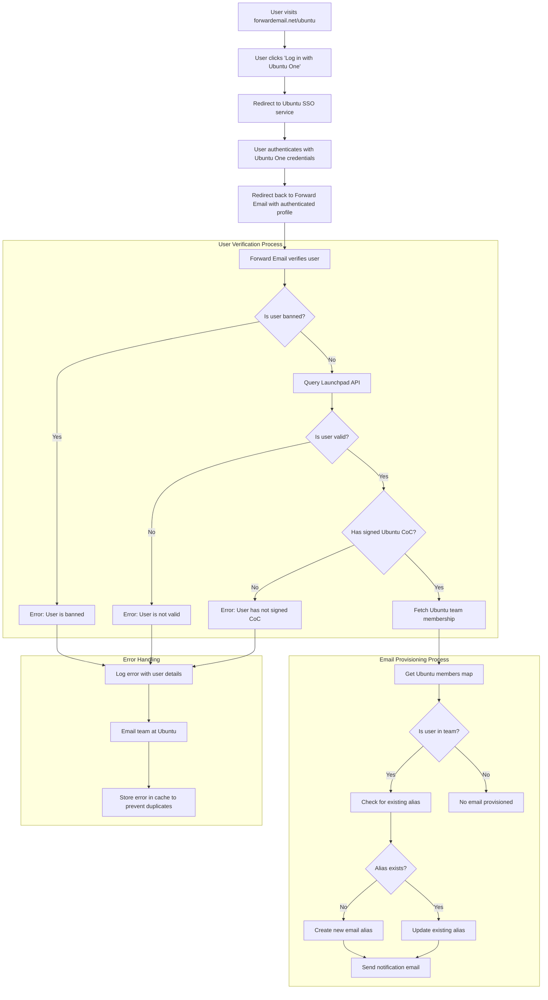

# Caso práctico: Cómo Canonical potencia la gestión de correo electrónico de Ubuntu con la solución empresarial de código abierto de Forward Email {#case-study-how-canonical-powers-ubuntu-email-management-with-forward-emails-open-source-enterprise-solution}


## Tabla de contenido {#table-of-contents}

* [Prefacio](#foreword)
* [El desafío: gestionar un ecosistema de correo electrónico complejo](#the-challenge-managing-a-complex-email-ecosystem)
* [Conclusiones clave](#key-takeaways)
* [¿Por qué reenviar correos electrónicos?](#why-forward-email)
* [La implementación: Integración perfecta de SSO](#the-implementation-seamless-sso-integration)
  * [Visualización del flujo de autenticación](#authentication-flow-visualization)
  * [Detalles de implementación técnica](#technical-implementation-details)
* [Configuración de DNS y enrutamiento de correo electrónico](#dns-configuration-and-email-routing)
* [Resultados: Gestión optimizada del correo electrónico y seguridad mejorada](#results-streamlined-email-management-and-enhanced-security)
  * [Eficiencia operativa](#operational-efficiency)
  * [Seguridad y privacidad mejoradas](#enhanced-security-and-privacy)
  * [Ahorro de costes](#cost-savings)
  * [Experiencia mejorada para los colaboradores](#improved-contributor-experience)
* [Mirando hacia el futuro: Colaboración continua](#looking-forward-continued-collaboration)
* [Conclusión: Una asociación perfecta de código abierto](#conclusion-a-perfect-open-source-partnership)
* [Apoyo a clientes empresariales](#supporting-enterprise-clients)
  * [Contáctanos](#get-in-touch)
  * [Acerca del reenvío de correo electrónico](#about-forward-email)

## Prólogo {#foreword}

En el mundo del software de código abierto, pocos nombres tienen tanto peso como [Canónico](https://en.wikipedia.org/wiki/Canonical_\(company\), la empresa detrás de [Ubuntu](https://en.wikipedia.org/wiki/Ubuntu), una de las distribuciones de Linux más populares a nivel mundial. Con un vasto ecosistema que abarca múltiples distribuciones, como Ubuntu, [Gratis](https://en.wikipedia.org/wiki/Kubuntu), [Lubuntu](https://en.wikipedia.org/wiki/Lubuntu), [Edubuntu](https://en.wikipedia.org/wiki/Edubuntu) y otras, Canonical se enfrentó a desafíos únicos en la gestión de direcciones de correo electrónico en sus numerosos dominios. Este caso práctico explora cómo Canonical se asoció con Forward Email para crear una solución de gestión de correo electrónico empresarial fluida, segura y centrada en la privacidad, que se alinea perfectamente con sus valores de código abierto.

## El desafío: gestionar un ecosistema de correo electrónico complejo {#the-challenge-managing-a-complex-email-ecosystem}

El ecosistema de Canonical es diverso y extenso. Con millones de usuarios en todo el mundo y miles de colaboradores en diversos proyectos, gestionar direcciones de correo electrónico en múltiples dominios presentaba importantes desafíos. Los colaboradores principales necesitaban direcciones de correo electrónico oficiales (@ubuntu.com, @kubuntu.org, etc.) que reflejaran su participación en el proyecto, a la vez que mantenían la seguridad y la facilidad de uso mediante un sólido sistema de gestión de dominios Ubuntu.

Antes de implementar Forward Email, Canonical tenía problemas con:

* Administrar direcciones de correo electrónico en múltiples dominios (@ubuntu.com, @kubuntu.org, @lubuntu.me, @edubuntu.org y @ubuntu.net)
* Ofrecer una experiencia de correo electrónico consistente a los colaboradores principales
* Integrar los servicios de correo electrónico con su sistema de inicio de sesión único (SSO) [Ubuntu One](https://en.wikipedia.org/wiki/Ubuntu_One) existente
* Encontrar una solución que se ajuste a su compromiso con la privacidad, la seguridad y la protección del correo electrónico de código abierto
* Escalar su infraestructura de correo electrónico seguro de forma rentable

## Conclusiones clave {#key-takeaways}

* Canonical implementó con éxito una solución unificada de gestión de correo electrónico en múltiples dominios de Ubuntu.
* El enfoque 100 % de código abierto de Forward Email se alineó perfectamente con los valores de Canonical.
* La integración de SSO con Ubuntu One proporciona una autenticación fluida para los colaboradores.
* El cifrado resistente a la tecnología cuántica garantiza la seguridad a largo plazo de todas las comunicaciones por correo electrónico.
* La solución se escala de forma rentable para respaldar la creciente base de colaboradores de Canonical.

## ¿Por qué reenviar correo electrónico? {#why-forward-email}

Como único proveedor de servicios de correo electrónico 100 % de código abierto centrado en la privacidad y la seguridad, Forward Email se adaptó perfectamente a las necesidades de reenvío de correo electrónico empresarial de Canonical. Nuestros valores se alinearon a la perfección con el compromiso de Canonical con el software de código abierto y la privacidad.

Los factores clave que hicieron de Forward Email la opción ideal incluyeron:

1. **Código base completo de código abierto**: Toda nuestra plataforma es de código abierto y está disponible en [GitHub](https://en.wikipedia.org/wiki/GitHub), lo que permite la transparencia y las contribuciones de la comunidad. A diferencia de muchos proveedores de correo electrónico centrados en la privacidad, que solo publican sus frontends de código abierto y mantienen sus backends cerrados, hemos puesto a disposición de cualquier persona nuestro código base, tanto frontend como backend, en [GitHub](https://github.com/forwardemail/forwardemail.net).

2. **Enfoque centrado en la privacidad**: A diferencia de otros proveedores, no almacenamos correos electrónicos en bases de datos compartidas y utilizamos un cifrado robusto con TLS. Nuestra filosofía fundamental de privacidad es simple: **sus correos electrónicos le pertenecen a usted y solo a usted**. Este principio guía cada decisión técnica que tomamos, desde cómo gestionamos el reenvío de correo electrónico hasta cómo implementamos el cifrado.

3. **Sin dependencia de terceros**: No utilizamos Amazon SES ni otros servicios de terceros, lo que nos da control total sobre la infraestructura de correo electrónico y elimina posibles fugas de privacidad a través de servicios de terceros.

4. **Escalamiento rentable**: Nuestro modelo de precios permite a las organizaciones escalar sin pagar por usuario, lo que lo hace ideal para la gran base de colaboradores de Canonical.

5. **Cifrado resistente a la tecnología cuántica**: Utilizamos buzones SQLite cifrados individualmente con [ChaCha20-Poli1305](https://en.wikipedia.org/wiki/ChaCha20-Poly1305) como cifrado para [cifrado resistente a los cuánticos](/blog/docs/best-quantum-safe-encrypted-email-service). Cada buzón es un archivo cifrado independiente, lo que significa que el acceso a los datos de un usuario no permite el acceso a los demás.

## La implementación: Integración perfecta de SSO {#the-implementation-seamless-sso-integration}

Uno de los aspectos más críticos de la implementación fue la integración con el sistema SSO de Ubuntu One de Canonical. Esta integración permitiría a los colaboradores principales gestionar sus direcciones de correo electrónico @ubuntu.com con sus credenciales de Ubuntu One.

### Visualización del flujo de autenticación {#authentication-flow-visualization}

El siguiente diagrama ilustra el flujo completo de autenticación y aprovisionamiento de correo electrónico:



### Detalles de implementación técnica {#technical-implementation-details}

La integración entre Forward Email y el SSO de Ubuntu One se logró mediante una implementación personalizada de la estrategia de autenticación Passport-Ubuntu. Esto permitió un flujo de autenticación fluido entre los sistemas de Ubuntu One y Forward Email.

#### El flujo de autenticación {#the-authentication-flow}

El proceso de autenticación funciona de la siguiente manera:

1. Los usuarios visitan la página dedicada a la gestión de correo electrónico de Ubuntu en [forwardemail.net/ubuntu](https://forwardemail.net/ubuntu).
2. Hacen clic en "Iniciar sesión con Ubuntu One" y son redirigidos al servicio SSO de Ubuntu.
3. Tras autenticarse con sus credenciales de Ubuntu One, son redirigidos a Forward Email con su perfil autenticado.
4. Forward Email verifica su condición de colaborador y proporciona o gestiona su dirección de correo electrónico según corresponda.

La implementación técnica aprovechó el paquete [`passport-ubuntu`](https://www.npmjs.com/package/passport-ubuntu), que es una estrategia [Pasaporte](https://www.npmjs.com/package/passport) para la autenticación con Ubuntu mediante [OpenID](https://en.wikipedia.org/wiki/OpenID). La configuración incluyó:

```javascript
passport.use(new UbuntuStrategy({
  returnURL: process.env.UBUNTU_CALLBACK_URL,
  realm: process.env.UBUNTU_REALM,
  stateless: true
}, function(identifier, profile, done) {
  // User verification and email provisioning logic
}));
```

#### Integración y validación de la API de Launchpad {#launchpad-api-integration-and-validation}

Un componente crucial de nuestra implementación es la integración con la API de [Plataforma de lanzamiento](https://en.wikipedia.org/wiki/Launchpad_\(website\) para validar a los usuarios de Ubuntu y sus membresías de equipo. Creamos funciones auxiliares reutilizables para gestionar esta integración de forma eficiente y fiable.

La función auxiliar `sync-ubuntu-user.js` se encarga de validar a los usuarios mediante la API de Launchpad y de administrar sus direcciones de correo electrónico. A continuación, se muestra una versión simplificada de su funcionamiento:

```javascript
async function syncUbuntuUser(user, map) {
  try {
    // Validate user object
    if (!_.isObject(user) ||
        !isSANB(user[fields.ubuntuUsername]) ||
        !isSANB(user[fields.ubuntuProfileID]) ||
        !isEmail(user.email))
      throw new TypeError('Invalid user object');

    // Get Ubuntu members map if not provided
    if (!(map instanceof Map))
      map = await getUbuntuMembersMap(resolver);

    // Check if user is banned
    if (user[config.userFields.isBanned]) {
      throw new InvalidUbuntuUserError('User was banned', { ignoreHook: true });
    }

    // Query Launchpad API to validate user
    const url = `https://api.launchpad.net/1.0/~${user[fields.ubuntuUsername]}`;
    const response = await retryRequest(url, { resolver });
    const json = await response.body.json();

    // Validate required boolean properties
    if (!json.is_valid)
      throw new InvalidUbuntuUserError('Property "is_valid" was false');

    if (!json.is_ubuntu_coc_signer)
      throw new InvalidUbuntuUserError('Property "is_ubuntu_coc_signer" was false');

    // Process each domain for the user
    await pMap([...map.keys()], async (name) => {
      // Find domain in database
      const domain = await Domains.findOne({
        name,
        plan: 'team',
        has_txt_record: true
      }).populate('members.user');

      // Process user's email alias for this domain
      if (map.get(name).has(user[fields.ubuntuUsername])) {
        // User is a member of this team, create or update alias
        let alias = await Aliases.findOne({
          user: user._id,
          domain: domain._id,
          name: user[fields.ubuntuUsername].toLowerCase()
        });

        if (!alias) {
          // Create new alias with appropriate error handling
          alias = await Aliases.create({
            user: user._id,
            domain: domain._id,
            name: user[fields.ubuntuUsername].toLowerCase(),
            recipients: [user.email],
            locale: user[config.lastLocaleField],
            is_enabled: true
          });

          // Notify admins about new alias creation
          await emailHelper({
            template: 'alert',
            message: {
              to: adminEmailsForDomain,
              subject: `New @${domain.name} email address created`
            },
            locals: {
              message: `A new email address ${user[fields.ubuntuUsername].toLowerCase()}@${domain.name} was created for ${user.email}`
            }
          });
        }
      }
    });

    return true;
  } catch (err) {
    // Handle and log errors
    await logErrorWithUser(err, user);
    throw err;
  }
}
```

Para simplificar la gestión de las membresías de equipos en diferentes dominios de Ubuntu, creamos un mapeo sencillo entre los nombres de dominio y sus equipos de Launchpad correspondientes:

```javascript
ubuntuTeamMapping: {
  'ubuntu.com': '~ubuntumembers',
  'kubuntu.org': '~kubuntu-members',
  'lubuntu.me': '~lubuntu-members',
  'edubuntu.org': '~edubuntu-members',
  'ubuntustudio.com': '~ubuntustudio-core',
  'ubuntu.net': '~ubuntu-smtp-test'
},
```

Este mapeo simple nos permite automatizar el proceso de verificación de membresías de equipo y aprovisionamiento de direcciones de correo electrónico, lo que hace que el sistema sea fácil de mantener y ampliar a medida que se agregan nuevos dominios.

#### Manejo de errores y notificaciones {#error-handling-and-notifications}

Implementamos un sistema robusto de manejo de errores que:

1. Registra todos los errores con información detallada del usuario.
2. Envía un correo electrónico al equipo de Ubuntu cuando se detectan problemas.
3. Notifica a los administradores cuando se registran nuevos colaboradores y se crean direcciones de correo electrónico.
4. Gestiona casos excepcionales, como los usuarios que no han firmado el Código de Conducta de Ubuntu.

Esto garantiza que cualquier problema se identifique y solucione rápidamente, manteniendo la integridad del sistema de correo electrónico.

## Configuración de DNS y enrutamiento de correo electrónico {#dns-configuration-and-email-routing}

Para cada dominio administrado a través de Forward Email, Canonical agregó un registro DNS TXT simple para validación:

```sh
❯ dig ubuntu.com txt
ubuntu.com.             600     IN      TXT     "forward-email-site-verification=6IsURgl2t7"
```

Este registro de verificación confirma la propiedad del dominio y permite que nuestro sistema gestione el correo electrónico de forma segura para estos dominios. Canonical enruta el correo a través de nuestro servicio mediante Postfix, que proporciona una infraestructura de entrega de correo electrónico fiable y segura.

## Resultados: Gestión de correo electrónico optimizada y seguridad mejorada {#results-streamlined-email-management-and-enhanced-security}

La implementación de la solución empresarial de Forward Email ha proporcionado beneficios significativos para la gestión del correo electrónico de Canonical en todos sus dominios:

### Eficiencia operativa {#operational-efficiency}

**Gestión centralizada**: Todos los dominios relacionados con Ubuntu ahora se gestionan a través de una única interfaz.
* **Reducción de la carga administrativa**: Aprovisionamiento automatizado y gestión de autoservicio para colaboradores.
* **Incorporación simplificada**: Los nuevos colaboradores pueden obtener rápidamente sus direcciones de correo electrónico oficiales.

### Seguridad y privacidad mejoradas {#enhanced-security-and-privacy}

* **Cifrado de extremo a extremo**: Todos los correos electrónicos se cifran con estándares avanzados.
* **Sin bases de datos compartidas**: Los correos electrónicos de cada usuario se almacenan en bases de datos SQLite individuales cifradas, lo que proporciona un enfoque de cifrado en espacio aislado que es fundamentalmente más seguro que las bases de datos relacionales compartidas tradicionales.
* **Seguridad de código abierto**: La base de código transparente permite revisiones de seguridad por parte de la comunidad.
* **Procesamiento en memoria**: No almacenamos los correos electrónicos reenviados en el disco, lo que mejora la protección de la privacidad.
* **Sin almacenamiento de metadatos**: No guardamos registros de quién envía correos electrónicos a quién, a diferencia de muchos proveedores de correo electrónico.

### Ahorro de costos {#cost-savings}

**Modelo de precios escalable**: Sin tarifas por usuario, lo que permite a Canonical añadir colaboradores sin aumentar los costes.
* **Necesidades de infraestructura reducidas**: No es necesario mantener servidores de correo electrónico independientes para distintos dominios.
* **Requisitos de soporte más bajos**: La gestión de autoservicio reduce los tickets de soporte de TI.

### Experiencia mejorada para colaboradores {#improved-contributor-experience}

* **Autenticación fluida**: Inicio de sesión único con credenciales existentes de Ubuntu One
* **Marca consistente**: Experiencia unificada en todos los servicios relacionados con Ubuntu
* **Entrega de correo electrónico confiable**: La reputación de IP de alta calidad garantiza que los correos electrónicos lleguen a su destino

La integración con Forward Email ha optimizado significativamente la gestión del correo electrónico de Canonical. Los colaboradores ahora disfrutan de una experiencia fluida al gestionar sus direcciones de correo electrónico @ubuntu.com, con menos gastos administrativos y mayor seguridad.

## Mirando hacia el futuro: Colaboración continua {#looking-forward-continued-collaboration}

La colaboración entre Canonical y Forward Email continúa evolucionando. Trabajamos juntos en varias iniciativas:

* Ampliación de los servicios de correo electrónico a otros dominios relacionados con Ubuntu
* Mejora de la interfaz de usuario basada en los comentarios de los colaboradores
* Implementación de funciones de seguridad adicionales
* Exploración de nuevas formas de aprovechar nuestra colaboración de código abierto

## Conclusión: Una asociación perfecta de código abierto {#conclusion-a-perfect-open-source-partnership}

La colaboración entre Canonical y Forward Email demuestra el poder de las alianzas basadas en valores compartidos. Al elegir a Forward Email como proveedor de servicios de correo electrónico, Canonical encontró una solución que no solo satisfacía sus necesidades técnicas, sino que también se alineaba a la perfección con su compromiso con el software de código abierto, la privacidad y la seguridad.

Para organizaciones que gestionan múltiples dominios y requieren una autenticación fluida con sus sistemas existentes, Forward Email ofrece una solución flexible, segura y centrada en la privacidad. Nuestro [enfoque de código abierto](https://forwardemail.net/blog/docs/why-open-source-email-security-privacy) garantiza la transparencia y permite las contribuciones de la comunidad, lo que lo convierte en la opción ideal para organizaciones que valoran estos principios.

A medida que Canonical y Forward Email continúan innovando en sus respectivos campos, esta asociación es un testimonio del poder de la colaboración de código abierto y los valores compartidos para crear soluciones efectivas.

Puede consultar nuestro [estado del servicio en tiempo real](https://status.forwardemail.net) para ver nuestro rendimiento actual de entrega de correo electrónico, que monitoreamos continuamente para garantizar una reputación de IP de alta calidad y capacidad de entrega de correo electrónico.

## Soporte para clientes empresariales {#supporting-enterprise-clients}

Si bien este estudio de caso se centra en nuestra asociación con Canonical, Forward Email apoya con orgullo a numerosos clientes empresariales de diversas industrias que valoran nuestro compromiso con la privacidad, la seguridad y los principios de código abierto.

Nuestras soluciones empresariales están diseñadas para satisfacer las necesidades específicas de organizaciones de todos los tamaños, ofreciendo:

* Dominio personalizado [gestión de correo electrónico](/) en múltiples dominios
* Integración perfecta con los sistemas de autenticación existentes
* Canal de soporte de chat Matrix dedicado
* Funciones de seguridad mejoradas, incluyendo [cifrado resistente a los cuánticos](/blog/docs/best-quantum-safe-encrypted-email-service)
* Portabilidad y propiedad total de los datos
* Infraestructura 100 % de código abierto para mayor transparencia y confianza

### Contáctanos {#get-in-touch}

Si su organización tiene necesidades de correo electrónico empresarial o está interesado en obtener más información sobre cómo Forward Email puede ayudar a optimizar la administración de su correo electrónico y al mismo tiempo mejorar la privacidad y la seguridad, nos encantaría saber de usted:

* Envíenos un correo electrónico directamente a `support@forwardemail.net`
* Envíe una solicitud de ayuda a [página de ayuda](https://forwardemail.net/help)
* Consulte [página de precios](https://forwardemail.net/pricing) para planes empresariales

Nuestro equipo está listo para discutir sus requisitos específicos y desarrollar una solución personalizada que se alinee con los valores y las necesidades técnicas de su organización.

### Acerca del reenvío de correo electrónico {#about-forward-email}

Forward Email es un servicio de correo electrónico 100 % de código abierto y centrado en la privacidad. Ofrecemos reenvío de correo electrónico de dominio personalizado, servicios SMTP, IMAP y POP3, priorizando la seguridad, la privacidad y la transparencia. Nuestro código fuente completo está disponible en [GitHub](https://github.com/forwardemail/forwardemail.net) y nos comprometemos a ofrecer servicios de correo electrónico que respeten la privacidad y la seguridad del usuario. Obtenga más información sobre [Por qué el correo electrónico de código abierto es el futuro](https://forwardemail.net/blog/docs/why-open-source-email-security-privacy), [Cómo funciona nuestro reenvío de correo electrónico](https://forwardemail.net/blog/docs/best-email-forwarding-service) y [Nuestro enfoque para la protección de la privacidad del correo electrónico](https://forwardemail.net/blog/docs/email-privacy-protection-technical-implementation).