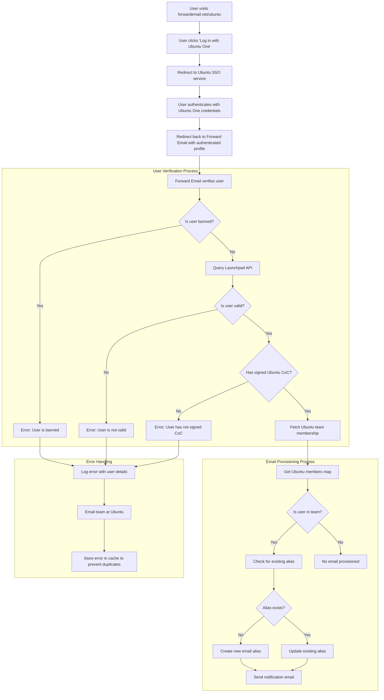

# Estudio de Caso: Cómo Canonical Potencia la Gestión de Correo Electrónico de Ubuntu con la Solución Empresarial de Código Abierto de Forward Email {#case-study-how-canonical-powers-ubuntu-email-management-with-forward-emails-open-source-enterprise-solution}


## Tabla de Contenidos {#table-of-contents}

* [Prólogo](#foreword)
* [El Desafío: Gestionar un Ecosistema de Correo Electrónico Complejo](#the-challenge-managing-a-complex-email-ecosystem)
* [Puntos Clave](#key-takeaways)
* [Por Qué Forward Email](#why-forward-email)
* [La Implementación: Integración SSO Sin Problemas](#the-implementation-seamless-sso-integration)
  * [Visualización del Flujo de Autenticación](#authentication-flow-visualization)
  * [Detalles Técnicos de la Implementación](#technical-implementation-details)
* [Configuración DNS y Enrutamiento de Correo Electrónico](#dns-configuration-and-email-routing)
* [Resultados: Gestión de Correo Electrónico Simplificada y Seguridad Mejorada](#results-streamlined-email-management-and-enhanced-security)
  * [Eficiencia Operativa](#operational-efficiency)
  * [Seguridad y Privacidad Mejoradas](#enhanced-security-and-privacy)
  * [Ahorro de Costos](#cost-savings)
  * [Mejora en la Experiencia de los Colaboradores](#improved-contributor-experience)
* [Mirando Hacia el Futuro: Colaboración Continua](#looking-forward-continued-collaboration)
* [Conclusión: Una Asociación Perfecta de Código Abierto](#conclusion-a-perfect-open-source-partnership)
* [Apoyo a Clientes Empresariales](#supporting-enterprise-clients)
  * [Contacto](#get-in-touch)
  * [Acerca de Forward Email](#about-forward-email)


## Prólogo {#foreword}

En el mundo del software de código abierto, pocos nombres tienen tanto peso como [Canonical](https://en.wikipedia.org/wiki/Canonical_\(company\)), la empresa detrás de [Ubuntu](https://en.wikipedia.org/wiki/Ubuntu), una de las distribuciones de Linux más populares a nivel mundial. Con un vasto ecosistema que abarca múltiples distribuciones incluyendo Ubuntu, [Kubuntu](https://en.wikipedia.org/wiki/Kubuntu), [Lubuntu](https://en.wikipedia.org/wiki/Lubuntu), [Edubuntu](https://en.wikipedia.org/wiki/Edubuntu), y otras, Canonical enfrentaba desafíos únicos para gestionar direcciones de correo electrónico a través de sus numerosos dominios. Este estudio de caso explora cómo Canonical se asoció con Forward Email para crear una solución empresarial de gestión de correo electrónico fluida, segura y enfocada en la privacidad que se alinea perfectamente con sus valores de código abierto.


## El Desafío: Gestionar un Ecosistema de Correo Electrónico Complejo {#the-challenge-managing-a-complex-email-ecosystem}

El ecosistema de Canonical es diverso y expansivo. Con millones de usuarios en todo el mundo y miles de colaboradores en varios proyectos, gestionar direcciones de correo electrónico en múltiples dominios presentaba desafíos significativos. Los colaboradores principales necesitaban direcciones oficiales de correo electrónico (@ubuntu.com, @kubuntu.org, etc.) que reflejaran su participación en el proyecto, manteniendo al mismo tiempo la seguridad y facilidad de uso mediante un sistema robusto de gestión de dominios Ubuntu.

Antes de implementar Forward Email, Canonical enfrentaba dificultades con:

* Gestionar direcciones de correo electrónico en múltiples dominios (@ubuntu.com, @kubuntu.org, @lubuntu.me, @edubuntu.org y @ubuntu.net)
* Proporcionar una experiencia de correo electrónico consistente para los colaboradores principales
* Integrar los servicios de correo electrónico con su sistema de Inicio de Sesión Único (SSO) [Ubuntu One](https://en.wikipedia.org/wiki/Ubuntu_One) existente
* Encontrar una solución que se alineara con su compromiso con la privacidad, seguridad y seguridad de correo electrónico de código abierto
* Escalar su infraestructura segura de correo electrónico de manera rentable


## Puntos Clave {#key-takeaways}

* Canonical implementó con éxito una solución unificada de gestión de correo electrónico en múltiples dominios de Ubuntu
* El enfoque 100% de código abierto de Forward Email se alineó perfectamente con los valores de Canonical
* La integración SSO con Ubuntu One proporciona autenticación fluida para los colaboradores
* El cifrado resistente a la computación cuántica garantiza seguridad a largo plazo para todas las comunicaciones por correo electrónico
* La solución escala de manera rentable para soportar la creciente base de colaboradores de Canonical


## Por Qué Forward Email {#why-forward-email}
Como el único proveedor de servicios de correo electrónico 100% de código abierto con un enfoque en la privacidad y seguridad, Forward Email fue una opción natural para las necesidades de reenvío de correo electrónico empresarial de Canonical. Nuestros valores se alinearon perfectamente con el compromiso de Canonical con el software de código abierto y la privacidad.

Los factores clave que hicieron de Forward Email la elección ideal incluyeron:

1. **Base de código completamente de código abierto**: Toda nuestra plataforma es de código abierto y está disponible en [GitHub](https://en.wikipedia.org/wiki/GitHub), lo que permite transparencia y contribuciones de la comunidad. A diferencia de muchos proveedores de correo electrónico "enfocados en la privacidad" que solo abren el código de sus frontends mientras mantienen cerrados sus backends, hemos puesto a disposición todo nuestro código—tanto frontend como backend—para que cualquiera pueda inspeccionarlo en [GitHub](https://github.com/forwardemail/forwardemail.net).

2. **Enfoque centrado en la privacidad**: A diferencia de otros proveedores, no almacenamos correos electrónicos en bases de datos compartidas, y usamos cifrado robusto con TLS. Nuestra filosofía fundamental de privacidad es simple: **tus correos electrónicos te pertenecen a ti y solo a ti**. Este principio guía cada decisión técnica que tomamos, desde cómo manejamos el reenvío de correos hasta cómo implementamos el cifrado.

3. **Sin dependencia de terceros**: No usamos Amazon SES ni otros servicios de terceros, lo que nos da control total sobre la infraestructura de correo electrónico y elimina posibles fugas de privacidad a través de servicios externos.

4. **Escalabilidad rentable**: Nuestro modelo de precios permite a las organizaciones escalar sin pagar por usuario, lo que lo hace ideal para la gran base de colaboradores de Canonical.

5. **Cifrado resistente a la computación cuántica**: Usamos buzones SQLite cifrados individualmente con [ChaCha20-Poly1305](https://en.wikipedia.org/wiki/ChaCha20-Poly1305) como cifrado para [cifrado resistente a la computación cuántica](/blog/docs/best-quantum-safe-encrypted-email-service). Cada buzón es un archivo cifrado separado, lo que significa que el acceso a los datos de un usuario no otorga acceso a los de otros.


## La Implementación: Integración SSO sin interrupciones {#the-implementation-seamless-sso-integration}

Uno de los aspectos más críticos de la implementación fue la integración con el sistema SSO Ubuntu One existente de Canonical. Esta integración permitiría a los colaboradores principales gestionar sus direcciones de correo @ubuntu.com usando sus credenciales existentes de Ubuntu One.

### Visualización del Flujo de Autenticación {#authentication-flow-visualization}

El siguiente diagrama ilustra el flujo completo de autenticación y provisión de correo electrónico:


```mermaid
flowchart TD
    A[User visits forwardemail.net/ubuntu] --> B[User clicks 'Log in with Ubuntu One']
    B --> C[Redirect to Ubuntu SSO service]
    C --> D[User authenticates with Ubuntu One credentials]
    D --> E[Redirect back to Forward Email with authenticated profile]
    E --> F[Forward Email verifies user]

    subgraph "User Verification Process"
        F --> G{Is user banned?}
        G -->|Yes| H[Error: User is banned]
        G -->|No| I[Query Launchpad API]
        I --> J{Is user valid?}
        J -->|No| K[Error: User is not valid]
        J -->|Yes| L{Has signed Ubuntu CoC?}
        L -->|No| M[Error: User has not signed CoC]
        L -->|Yes| N[Fetch Ubuntu team membership]
    end

    subgraph "Email Provisioning Process"
        N --> O[Get Ubuntu members map]
        O --> P{Is user in team?}
        P -->|Yes| Q[Check for existing alias]
        Q --> R{Alias exists?}
        R -->|No| S[Create new email alias]
        R -->|Yes| T[Update existing alias]
        S --> U[Send notification email]
        T --> U
        P -->|No| V[No email provisioned]
    end

    subgraph "Error Handling"
        H --> W[Log error with user details]
        K --> W
        M --> W
        W --> X[Email team at Ubuntu]
        X --> Y[Store error in cache to prevent duplicates]
    end
```

### Detalles Técnicos de la Implementación {#technical-implementation-details}

La integración entre Forward Email y Ubuntu One SSO se logró mediante una implementación personalizada de la estrategia de autenticación passport-ubuntu. Esto permitió un flujo de autenticación sin interrupciones entre Ubuntu One y los sistemas de Forward Email.
#### El Flujo de Autenticación {#the-authentication-flow}

El proceso de autenticación funciona de la siguiente manera:

1. Los usuarios visitan la página dedicada a la gestión de correo electrónico de Ubuntu en [forwardemail.net/ubuntu](https://forwardemail.net/ubuntu)
2. Hacen clic en "Iniciar sesión con Ubuntu One" y son redirigidos al servicio SSO de Ubuntu
3. Después de autenticarse con sus credenciales de Ubuntu One, son redirigidos de vuelta a Forward Email con su perfil autenticado
4. Forward Email verifica su estado de contribuidor y provisiona o gestiona su dirección de correo electrónico en consecuencia

La implementación técnica utilizó el paquete [`passport-ubuntu`](https://www.npmjs.com/package/passport-ubuntu), que es una estrategia de [Passport](https://www.npmjs.com/package/passport) para autenticarse con Ubuntu usando [OpenID](https://en.wikipedia.org/wiki/OpenID). La configuración incluyó:

```javascript
passport.use(new UbuntuStrategy({
  returnURL: process.env.UBUNTU_CALLBACK_URL,
  realm: process.env.UBUNTU_REALM,
  stateless: true
}, function(identifier, profile, done) {
  // User verification and email provisioning logic
}));
```

#### Integración y Validación de la API de Launchpad {#launchpad-api-integration-and-validation}

Un componente crítico de nuestra implementación es la integración con la API de [Launchpad](https://en.wikipedia.org/wiki/Launchpad_\(website\)) para validar usuarios de Ubuntu y sus membresías en equipos. Creamos funciones auxiliares reutilizables para manejar esta integración de manera eficiente y confiable.

La función auxiliar `sync-ubuntu-user.js` es responsable de validar usuarios a través de la API de Launchpad y gestionar sus direcciones de correo electrónico. Aquí hay una versión simplificada de cómo funciona:

```javascript
async function syncUbuntuUser(user, map) {
  try {
    // Validate user object
    if (!_.isObject(user) ||
        !isSANB(user[fields.ubuntuUsername]) ||
        !isSANB(user[fields.ubuntuProfileID]) ||
        !isEmail(user.email))
      throw new TypeError('Invalid user object');

    // Get Ubuntu members map if not provided
    if (!(map instanceof Map))
      map = await getUbuntuMembersMap(resolver);

    // Check if user is banned
    if (user[config.userFields.isBanned]) {
      throw new InvalidUbuntuUserError('User was banned', { ignoreHook: true });
    }

    // Query Launchpad API to validate user
    const url = `https://api.launchpad.net/1.0/~${user[fields.ubuntuUsername]}`;
    const response = await retryRequest(url, { resolver });
    const json = await response.body.json();

    // Validate required boolean properties
    if (!json.is_valid)
      throw new InvalidUbuntuUserError('Property "is_valid" was false');

    if (!json.is_ubuntu_coc_signer)
      throw new InvalidUbuntuUserError('Property "is_ubuntu_coc_signer" was false');

    // Process each domain for the user
    await pMap([...map.keys()], async (name) => {
      // Find domain in database
      const domain = await Domains.findOne({
        name,
        plan: 'team',
        has_txt_record: true
      }).populate('members.user');

      // Process user's email alias for this domain
      if (map.get(name).has(user[fields.ubuntuUsername])) {
        // User is a member of this team, create or update alias
        let alias = await Aliases.findOne({
          user: user._id,
          domain: domain._id,
          name: user[fields.ubuntuUsername].toLowerCase()
        });

        if (!alias) {
          // Create new alias with appropriate error handling
          alias = await Aliases.create({
            user: user._id,
            domain: domain._id,
            name: user[fields.ubuntuUsername].toLowerCase(),
            recipients: [user.email],
            locale: user[config.lastLocaleField],
            is_enabled: true
          });

          // Notify admins about new alias creation
          await emailHelper({
            template: 'alert',
            message: {
              to: adminEmailsForDomain,
              subject: `Nueva dirección de correo @${domain.name} creada`
            },
            locals: {
              message: `Se creó una nueva dirección de correo ${user[fields.ubuntuUsername].toLowerCase()}@${domain.name} para ${user.email}`
            }
          });
        }
      }
    });

    return true;
  } catch (err) {
    // Handle and log errors
    await logErrorWithUser(err, user);
    throw err;
  }
}
```
Para simplificar la gestión de membresías de equipos en diferentes dominios de Ubuntu, creamos un mapeo sencillo entre los nombres de dominio y sus equipos correspondientes en Launchpad:

```javascript
ubuntuTeamMapping: {
  'ubuntu.com': '~ubuntumembers',
  'kubuntu.org': '~kubuntu-members',
  'lubuntu.me': '~lubuntu-members',
  'edubuntu.org': '~edubuntu-members',
  'ubuntustudio.com': '~ubuntustudio-core',
  'ubuntu.net': '~ubuntu-smtp-test'
},
```

Este mapeo simple nos permite automatizar el proceso de verificación de membresías en equipos y la provisión de direcciones de correo electrónico, haciendo que el sistema sea fácil de mantener y ampliar a medida que se agregan nuevos dominios.

#### Manejo de Errores y Notificaciones {#error-handling-and-notifications}

Implementamos un sistema robusto de manejo de errores que:

1. Registra todos los errores con información detallada del usuario
2. Envía correos electrónicos al equipo de Ubuntu cuando se detectan problemas
3. Notifica a los administradores cuando nuevos colaboradores se registran y se crean direcciones de correo electrónico
4. Maneja casos límite como usuarios que no han firmado el Código de Conducta de Ubuntu

Esto asegura que cualquier problema sea identificado y resuelto rápidamente, manteniendo la integridad del sistema de correo electrónico.


## Configuración DNS y Enrutamiento de Correo {#dns-configuration-and-email-routing}

Para cada dominio gestionado a través de Forward Email, Canonical añadió un registro DNS TXT simple para validación:

```sh
❯ dig ubuntu.com txt
ubuntu.com.             600     IN      TXT     "forward-email-site-verification=6IsURgl2t7"
```

Este registro de verificación confirma la propiedad del dominio y permite que nuestro sistema gestione de forma segura el correo electrónico para estos dominios. Canonical enruta el correo a través de nuestro servicio mediante Postfix, que proporciona una infraestructura confiable y segura para la entrega de correos.


## Resultados: Gestión de Correo Simplificada y Seguridad Mejorada {#results-streamlined-email-management-and-enhanced-security}

La implementación de la solución empresarial de Forward Email ha entregado beneficios significativos para la gestión de correo de Canonical en todos sus dominios:

### Eficiencia Operativa {#operational-efficiency}

* **Gestión centralizada**: Todos los dominios relacionados con Ubuntu ahora se gestionan a través de una única interfaz
* **Reducción de la carga administrativa**: Provisión automatizada y gestión de autoservicio para colaboradores
* **Incorporación simplificada**: Los nuevos colaboradores pueden obtener rápidamente sus direcciones oficiales de correo electrónico

### Seguridad y Privacidad Mejoradas {#enhanced-security-and-privacy}

* **Cifrado de extremo a extremo**: Todos los correos están cifrados usando estándares avanzados
* **Sin bases de datos compartidas**: Los correos de cada usuario se almacenan en bases de datos SQLite cifradas individuales, proporcionando un enfoque de cifrado aislado que es fundamentalmente más seguro que las bases de datos relacionales compartidas tradicionales
* **Seguridad de código abierto**: La base de código transparente permite revisiones de seguridad por parte de la comunidad
* **Procesamiento en memoria**: No almacenamos correos reenviados en disco, mejorando la protección de la privacidad
* **Sin almacenamiento de metadatos**: No guardamos registros de quién envía correos a quién, a diferencia de muchos proveedores de correo

### Ahorro de Costos {#cost-savings}

* **Modelo de precios escalable**: Sin tarifas por usuario, permitiendo a Canonical agregar colaboradores sin aumentar costos
* **Reducción de necesidades de infraestructura**: No es necesario mantener servidores de correo separados para diferentes dominios
* **Menores requerimientos de soporte**: La gestión de autoservicio reduce los tickets de soporte de TI

### Mejor Experiencia para los Colaboradores {#improved-contributor-experience}

* **Autenticación sin interrupciones**: Inicio de sesión único con las credenciales existentes de Ubuntu One
* **Marca consistente**: Experiencia unificada en todos los servicios relacionados con Ubuntu
* **Entrega confiable de correo**: Reputación de IP de alta calidad asegura que los correos lleguen a su destino

La integración con Forward Email ha simplificado significativamente el proceso de gestión de correo de Canonical. Los colaboradores ahora tienen una experiencia fluida gestionando sus direcciones de correo @ubuntu.com, con menor carga administrativa y mayor seguridad.


## Mirando hacia el futuro: Colaboración continua {#looking-forward-continued-collaboration}

La asociación entre Canonical y Forward Email continúa evolucionando. Estamos trabajando juntos en varias iniciativas:
* Expansión de los servicios de correo electrónico a dominios adicionales relacionados con Ubuntu
* Mejora de la interfaz de usuario basada en los comentarios de los colaboradores
* Implementación de funciones adicionales de seguridad
* Exploración de nuevas formas de aprovechar nuestra colaboración de código abierto


## Conclusión: Una asociación perfecta de código abierto {#conclusion-a-perfect-open-source-partnership}

La colaboración entre Canonical y Forward Email demuestra el poder de las asociaciones basadas en valores compartidos. Al elegir Forward Email como su proveedor de servicios de correo electrónico, Canonical encontró una solución que no solo cumplía con sus requisitos técnicos, sino que también se alineaba perfectamente con su compromiso con el software de código abierto, la privacidad y la seguridad.

Para las organizaciones que gestionan múltiples dominios y requieren una autenticación fluida con sistemas existentes, Forward Email ofrece una solución flexible, segura y centrada en la privacidad. Nuestro [enfoque de código abierto](https://forwardemail.net/blog/docs/why-open-source-email-security-privacy) garantiza transparencia y permite contribuciones de la comunidad, lo que lo convierte en una opción ideal para organizaciones que valoran estos principios.

A medida que tanto Canonical como Forward Email continúan innovando en sus respectivos campos, esta asociación se erige como un testimonio del poder de la colaboración de código abierto y los valores compartidos para crear soluciones efectivas.

Puedes consultar nuestro [estado del servicio en tiempo real](https://status.forwardemail.net) para ver nuestro rendimiento actual en la entrega de correos electrónicos, que monitoreamos continuamente para garantizar una reputación de IP y una entregabilidad de correo electrónico de alta calidad.


## Apoyo a clientes empresariales {#supporting-enterprise-clients}

Aunque este estudio de caso se centra en nuestra asociación con Canonical, Forward Email apoya con orgullo a numerosos clientes empresariales en diversas industrias que valoran nuestro compromiso con la privacidad, la seguridad y los principios de código abierto.

Nuestras soluciones empresariales están diseñadas para satisfacer las necesidades específicas de organizaciones de todos los tamaños, ofreciendo:

* Gestión de correo electrónico de dominio personalizado [email management](/) en múltiples dominios
* Integración fluida con sistemas de autenticación existentes
* Canal de soporte dedicado en chat Matrix
* Funciones de seguridad mejoradas, incluyendo [cifrado resistente a la computación cuántica](/blog/docs/best-quantum-safe-encrypted-email-service)
* Portabilidad y propiedad completa de los datos
* Infraestructura 100% de código abierto para transparencia y confianza

### Ponte en contacto {#get-in-touch}

Si tu organización tiene necesidades empresariales de correo electrónico o estás interesado en aprender más sobre cómo Forward Email puede ayudar a optimizar la gestión de tu correo electrónico mientras mejora la privacidad y la seguridad, nos encantaría saber de ti:

* Envíanos un correo directamente a `support@forwardemail.net`
* Envía una solicitud de ayuda en nuestra [página de ayuda](https://forwardemail.net/help)
* Consulta nuestra [página de precios](https://forwardemail.net/pricing) para planes empresariales

Nuestro equipo está listo para discutir tus requisitos específicos y desarrollar una solución personalizada que se alinee con los valores y necesidades técnicas de tu organización.

### Acerca de Forward Email {#about-forward-email}

Forward Email es el servicio de correo electrónico 100% de código abierto y centrado en la privacidad. Proveemos reenvío de correo electrónico para dominios personalizados, servicios SMTP, IMAP y POP3 con un enfoque en la seguridad, privacidad y transparencia. Todo nuestro código está disponible en [GitHub](https://github.com/forwardemail/forwardemail.net), y estamos comprometidos a ofrecer servicios de correo electrónico que respeten la privacidad y seguridad del usuario. Aprende más sobre [por qué el correo electrónico de código abierto es el futuro](https://forwardemail.net/blog/docs/why-open-source-email-security-privacy), [cómo funciona nuestro reenvío de correo electrónico](https://forwardemail.net/blog/docs/best-email-forwarding-service) y [nuestro enfoque para la protección de la privacidad del correo electrónico](https://forwardemail.net/blog/docs/email-privacy-protection-technical-implementation).
