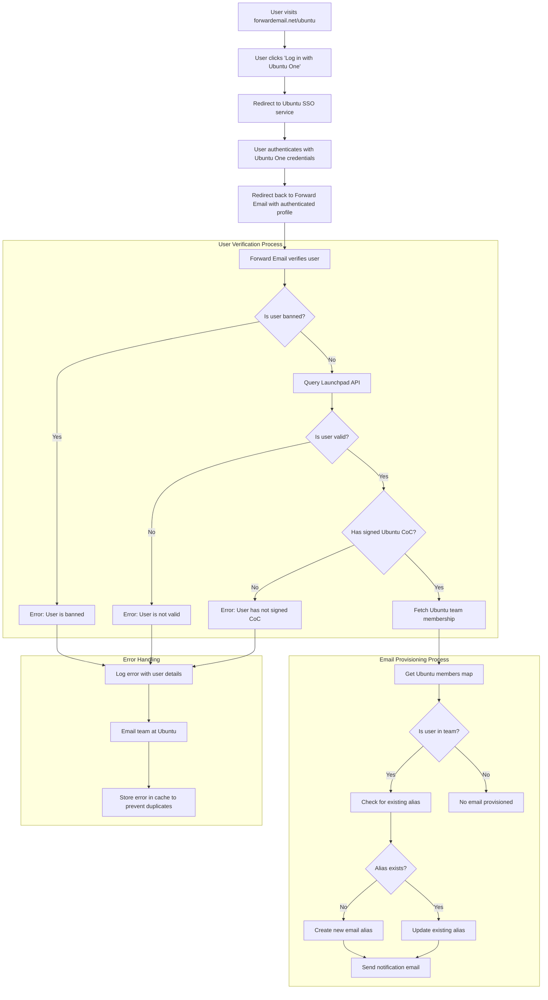

# Case-tutkimus: Kuinka Canonical tukee Ubuntu-sähköpostien hallintaa Forward Emailin avoimen lähdekoodin yritysratkaisulla {#case-study-how-canonical-powers-ubuntu-email-management-with-forward-emails-open-source-enterprise-solution}


## Sisällysluettelo {#table-of-contents}

* [Esipuhe](#foreword)
* [Haaste: Monimutkaisen sähköpostiekosysteemin hallinta](#the-challenge-managing-a-complex-email-ecosystem)
* [Keskeiset tiedot](#key-takeaways)
* [Miksi sähköpostin välittäminen](#why-forward-email)
* [Toteutus: Saumaton kertakirjautumisintegraatio](#the-implementation-seamless-sso-integration)
  * [Todennuskulun visualisointi](#authentication-flow-visualization)
  * [Tekniset toteutustiedot](#technical-implementation-details)
* [DNS-konfigurointi ja sähköpostin reititys](#dns-configuration-and-email-routing)
* [Tulokset: Virtaviivaistettu sähköpostinhallinta ja parannettu tietoturva](#results-streamlined-email-management-and-enhanced-security)
  * [Toiminnan tehokkuus](#operational-efficiency)
  * [Parannettu turvallisuus ja yksityisyys](#enhanced-security-and-privacy)
  * [Kustannussäästöt](#cost-savings)
  * [Parannettu avustajan käyttökokemus](#improved-contributor-experience)
* [Tulevaisuudessa: Jatkuva yhteistyö](#looking-forward-continued-collaboration)
* [Johtopäätös: Täydellinen avoimen lähdekoodin kumppanuus](#conclusion-a-perfect-open-source-partnership)
* [Yritysasiakkaiden tukeminen](#supporting-enterprise-clients)
  * [Ota yhteyttä](#get-in-touch)
  * [Tietoja sähköpostin edelleenlähettämisestä](#about-forward-email)

## Esipuhe {#foreword}

Avoimen lähdekoodin ohjelmistojen maailmassa harvalla nimellä on yhtä paljon painoarvoa kuin [Kanoninen](https://en.wikipedia.org/wiki/Canonical_\(company\):lla), yrityksellä [Ubuntu](https://en.wikipedia.org/wiki/Ubuntu):n takana, joka on yksi maailmanlaajuisesti suosituimmista Linux-jakeluista. Laajan ekosysteeminsä ansiosta Canonical kohtasi ainutlaatuisia haasteita hallitessaan sähköpostiosoitteita lukuisilla verkkotunnuksillaan. Tässä tapaustutkimuksessa tarkastellaan, kuinka Canonical teki yhteistyötä Forward Emailin kanssa luodakseen saumattoman, turvallisen ja yksityisyyteen keskittyvän yrityssähköpostien hallintaratkaisun, joka on täydellisesti linjassa heidän avoimen lähdekoodin arvojensa kanssa.

## Haaste: Monimutkaisen sähköpostiekosysteemin hallinta {#the-challenge-managing-a-complex-email-ecosystem}

Canonicalin ekosysteemi on monipuolinen ja laaja. Miljoonien käyttäjien maailmanlaajuisesti ja tuhansien eri projektien avustajien vuoksi sähköpostiosoitteiden hallinta useilla eri verkkotunnuksilla toi mukanaan merkittäviä haasteita. Ydinavustajat tarvitsivat viralliset sähköpostiosoitteet (@ubuntu.com, @kubuntu.org jne.), jotka heijastaisivat heidän osallistumistaan projektiin samalla, kun ne säilyttäisivät turvallisuuden ja helppokäyttöisyyden vankan Ubuntu-verkkotunnusten hallintajärjestelmän avulla.

Ennen sähköpostin edelleenlähetyksen käyttöönottoa Canonical kamppaili seuraavien kanssa:

* Sähköpostiosoitteiden hallinta useilla eri verkkotunnuksilla (@ubuntu.com, @kubuntu.org, @lubuntu.me, @edubuntu.org ja @ubuntu.net)
* Yhtenäisen sähköpostikokemuksen tarjoaminen ydinavustajille
* Sähköpostipalveluiden integrointi heidän olemassa olevaan [Ubuntu Yksi](https://en.wikipedia.org/wiki/Ubuntu_One) Single Sign-On (SSO) -järjestelmään
* Ratkaisun löytäminen, joka on linjassa heidän sitoutumisensa kanssa yksityisyyteen, tietoturvaan ja avoimen lähdekoodin sähköpostin tietoturvaan
* Turvallisen sähköposti-infrastruktuurin skaalaaminen kustannustehokkaasti

## Keskeiset huomiot {#key-takeaways}

* Canonical otti onnistuneesti käyttöön yhtenäisen sähköpostinhallintaratkaisun useille Ubuntu-verkkotunnuksille
* Forward Emailin 100 % avoimen lähdekoodin lähestymistapa oli täydellisesti linjassa Canonicalin arvojen kanssa
* SSO-integraatio Ubuntu Onen kanssa tarjoaa saumattoman todennuksen avustajille
* Kvanttisuojattu salaus varmistaa pitkäaikaisen turvallisuuden kaikelle sähköpostiviestinnälle
* Ratkaisu skaalautuu kustannustehokkaasti tukemaan Canonicalin kasvavaa avustajakuntaa

## Miksi sähköposti lähetetään edelleen {#why-forward-email}

Ainoana täysin avoimen lähdekoodin sähköpostipalveluntarjoajana, joka keskittyy yksityisyyteen ja tietoturvaan, Forward Email oli luonnollinen valinta Canonicalin yrityssähköpostin edelleenlähetystarpeisiin. Arvomme sopivat täydellisesti yhteen Canonicalin sitoutumisen kanssa avoimen lähdekoodin ohjelmistoihin ja yksityisyyteen.

Keskeisiä tekijöitä, jotka tekivät Forward Emailista ihanteellisen valinnan, olivat:

1. **Täydellinen avoimen lähdekoodin koodikanta**: Koko alustamme on avoimen lähdekoodin ja saatavilla [GitHub](https://en.wikipedia.org/wiki/GitHub)-sivustolla, mikä mahdollistaa läpinäkyvyyden ja yhteisön osallistumisen. Toisin kuin monet "yksityisyyteen keskittyvät" sähköpostipalveluntarjoajat, jotka julkaisevat avoimen lähdekoodin vain käyttöliittymänsä pitäen taustansa suljettuina, me olemme tehneet koko koodikantaamme – sekä käyttöliittymän että taustajärjestelmän – kaikkien nähtäville [GitHub](https://github.com/forwardemail/forwardemail.net)-sivustolla.

2. **Tietosuojaan keskittyvä lähestymistapa**: Toisin kuin muut palveluntarjoajat, emme tallenna sähköposteja jaettuihin tietokantoihin, ja käytämme vankkaa TLS-salausta. Perustietosuojafilosofiamme on yksinkertainen: **sähköpostisi kuuluvat sinulle ja vain sinulle**. Tämä periaate ohjaa kaikkia teknisiä päätöksiämme sähköpostin edelleenlähetyksestä salauksen toteuttamiseen.

3. **Ei ole riippuvainen kolmansista osapuolista**: Emme käytä Amazon SES:ää tai muita kolmannen osapuolen palveluita, mikä antaa meille täyden hallinnan sähköpostiinfrastruktuurista ja estää mahdolliset tietosuojavuodot kolmansien osapuolten palveluiden kautta.

4. **Kustannustehokas skaalaus**: Hinnoittelumallimme mahdollistaa organisaatioiden skaalautumisen maksamatta käyttäjäkohtaisesti, mikä tekee siitä ihanteellisen Canonicalin laajalle avustajakunnalle.

5. **Kvanttisuojattu salaus**: Käytämme yksilöllisesti salattuja SQLite-postilaatikoita, joissa [kvanttiresistentti salaus](/blog/docs/best-quantum-safe-encrypted-email-service)-salaus on [ChaCha20-Poly1305](https://en.wikipedia.org/wiki/ChaCha20-Poly1305). Jokainen postilaatikko on erillinen salattu tiedosto, mikä tarkoittaa, että yhden käyttäjän tietojen käyttöoikeus ei myönnä pääsyä muille.

## Toteutus: Saumaton kertakirjautumisen integrointi {#the-implementation-seamless-sso-integration}

Yksi toteutuksen kriittisimmistä osa-alueista oli integrointi Canonicalin olemassa olevaan Ubuntu One SSO -järjestelmään. Tämä integraatio mahdollistaisi ydinosaajien hallinnan @ubuntu.com-sähköpostiosoitteillaan olemassa olevilla Ubuntu One -tunnuksillaan.

### Todennuskulun visualisointi {#authentication-flow-visualization}

Seuraava kaavio havainnollistaa koko todennus- ja sähköpostin valmisteluprosessin:



### Tekniset toteutustiedot {#technical-implementation-details}

Forward Emailin ja Ubuntu One SSO:n välinen integrointi toteutettiin mukautetulla passport-ubuntu-todennusstrategialla. Tämä mahdollisti saumattoman todennusprosessin Ubuntu Onen ja Forward Emailin järjestelmien välillä.

#### Todennusprosessi {#the-authentication-flow}

Todennusprosessi toimii seuraavasti:

1. Käyttäjät käyvät Ubuntun sähköpostinhallintasivulla osoitteessa [forwardemail.net/ubuntu](https://forwardemail.net/ubuntu)
2. He napsauttavat "Kirjaudu sisään Ubuntu Onella" ja heidät ohjataan Ubuntu SSO -palveluun
3. Ubuntu One -tunnuksilla todennuksen jälkeen heidät ohjataan takaisin Sähköpostin välityspalveluun todennetulla profiilillaan
4. Sähköpostin välityspalvelu vahvistaa heidän avustajastatuksensa ja määrittää tai hallinnoi heidän sähköpostiosoitettaan sen mukaisesti

Teknisessä toteutuksessa hyödynnettiin [`passport-ubuntu`](https://www.npmjs.com/package/passport-ubuntu)-pakettia, joka on [Passi](https://www.npmjs.com/package/passport)-strategia Ubuntu-todennukseen [OpenID](https://en.wikipedia.org/wiki/OpenID):n avulla. Kokoonpanoon sisältyivät:

```javascript
passport.use(new UbuntuStrategy({
  returnURL: process.env.UBUNTU_CALLBACK_URL,
  realm: process.env.UBUNTU_REALM,
  stateless: true
}, function(identifier, profile, done) {
  // User verification and email provisioning logic
}));
```

#### Launchpad-rajapinnan integrointi ja validointi {#launchpad-api-integration-and-validation}

Toteutuksemme kriittinen osa on integrointi [Launchpad](https://en.wikipedia.org/wiki/Launchpad_\(website\)):n API:n kanssa Ubuntu-käyttäjien ja heidän tiimijäsenyyksiensä validoimiseksi. Loimme uudelleenkäytettäviä apufunktioita tämän integraation tehokkaan ja luotettavan käsittelyn varmistamiseksi.

`sync-ubuntu-user.js`-apufunktio vastaa käyttäjien validoinnista Launchpad-rajapinnan kautta ja heidän sähköpostiosoitteidensa hallinnasta. Tässä on yksinkertaistettu versio siitä, miten se toimii:

```javascript
async function syncUbuntuUser(user, map) {
  try {
    // Validate user object
    if (!_.isObject(user) ||
        !isSANB(user[fields.ubuntuUsername]) ||
        !isSANB(user[fields.ubuntuProfileID]) ||
        !isEmail(user.email))
      throw new TypeError('Invalid user object');

    // Get Ubuntu members map if not provided
    if (!(map instanceof Map))
      map = await getUbuntuMembersMap(resolver);

    // Check if user is banned
    if (user[config.userFields.isBanned]) {
      throw new InvalidUbuntuUserError('User was banned', { ignoreHook: true });
    }

    // Query Launchpad API to validate user
    const url = `https://api.launchpad.net/1.0/~${user[fields.ubuntuUsername]}`;
    const response = await retryRequest(url, { resolver });
    const json = await response.body.json();

    // Validate required boolean properties
    if (!json.is_valid)
      throw new InvalidUbuntuUserError('Property "is_valid" was false');

    if (!json.is_ubuntu_coc_signer)
      throw new InvalidUbuntuUserError('Property "is_ubuntu_coc_signer" was false');

    // Process each domain for the user
    await pMap([...map.keys()], async (name) => {
      // Find domain in database
      const domain = await Domains.findOne({
        name,
        plan: 'team',
        has_txt_record: true
      }).populate('members.user');

      // Process user's email alias for this domain
      if (map.get(name).has(user[fields.ubuntuUsername])) {
        // User is a member of this team, create or update alias
        let alias = await Aliases.findOne({
          user: user._id,
          domain: domain._id,
          name: user[fields.ubuntuUsername].toLowerCase()
        });

        if (!alias) {
          // Create new alias with appropriate error handling
          alias = await Aliases.create({
            user: user._id,
            domain: domain._id,
            name: user[fields.ubuntuUsername].toLowerCase(),
            recipients: [user.email],
            locale: user[config.lastLocaleField],
            is_enabled: true
          });

          // Notify admins about new alias creation
          await emailHelper({
            template: 'alert',
            message: {
              to: adminEmailsForDomain,
              subject: `New @${domain.name} email address created`
            },
            locals: {
              message: `A new email address ${user[fields.ubuntuUsername].toLowerCase()}@${domain.name} was created for ${user.email}`
            }
          });
        }
      }
    });

    return true;
  } catch (err) {
    // Handle and log errors
    await logErrorWithUser(err, user);
    throw err;
  }
}
```

Yksinkertaistaaksemme tiimijäsenyyksien hallintaa eri Ubuntu-verkkotunnuksissa, loimme selkeän määrityksen verkkotunnusten ja niitä vastaavien Launchpad-tiimien välille:

```javascript
ubuntuTeamMapping: {
  'ubuntu.com': '~ubuntumembers',
  'kubuntu.org': '~kubuntu-members',
  'lubuntu.me': '~lubuntu-members',
  'edubuntu.org': '~edubuntu-members',
  'ubuntustudio.com': '~ubuntustudio-core',
  'ubuntu.net': '~ubuntu-smtp-test'
},
```

Tämän yksinkertaisen yhdistämismäärityksen avulla voimme automatisoida tiimijäsenyyksien tarkistamisen ja sähköpostiosoitteiden lisäämisen, mikä helpottaa järjestelmän ylläpitoa ja laajentamista uusien verkkotunnusten lisäyksen myötä.

#### Virheiden käsittely ja ilmoitukset {#error-handling-and-notifications}

Toteutimme vankan virheenkäsittelyjärjestelmän, joka:

1. Kirjaa kaikki virheet yksityiskohtaisine käyttäjätietoineen
2. Lähettää sähköpostia Ubuntu-tiimille, kun ongelmia havaitaan
3. Ilmoittaa ylläpitäjille, kun uusia osallistujia rekisteröityy ja heille on luotu sähköpostiosoitteita
4. Käsittelee reunatapaukset, kuten käyttäjät, jotka eivät ole allekirjoittaneet Ubuntun käytännesääntöjä

Tämä varmistaa, että mahdolliset ongelmat tunnistetaan ja korjataan nopeasti, mikä säilyttää sähköpostijärjestelmän eheyden.

## DNS-määritys ja sähköpostin reititys {#dns-configuration-and-email-routing}

Canonical lisäsi jokaiselle Forward Emailin kautta hallinnoidulle verkkotunnukselle yksinkertaisen DNS TXT -tietueen validointia varten:

```sh
❯ dig ubuntu.com txt
ubuntu.com.             600     IN      TXT     "forward-email-site-verification=6IsURgl2t7"
```

Tämä vahvistustietue vahvistaa verkkotunnuksen omistajuuden ja mahdollistaa järjestelmämme näiden verkkotunnusten sähköpostin turvallisen hallinnan. Canonical reitittää postin palvelumme kautta Postfixin kautta, joka tarjoaa luotettavan ja turvallisen sähköpostin toimitusinfrastruktuurin.

## Tulokset: Virtaviivaistettu sähköpostinhallinta ja parannettu suojaus {#results-streamlined-email-management-and-enhanced-security}

Forward Emailin yritysratkaisun käyttöönotto on tuonut merkittäviä etuja Canonicalin sähköpostinhallinnalle kaikilla heidän toimialueillaan:

### Toiminnallinen tehokkuus {#operational-efficiency}

* **Keskitetty hallinta**: Kaikkia Ubuntuun liittyviä verkkotunnuksia hallitaan nyt yhden käyttöliittymän kautta
* **Vähennetty hallinnollinen työ**: Automaattinen käyttöönotto ja itsepalveluhallinta osallistujille
* **Yksinkertaistettu käyttöönotto**: Uudet osallistujat voivat nopeasti saada viralliset sähköpostiosoitteensa

### Parannettu tietoturva ja yksityisyys {#enhanced-security-and-privacy}

* **Päästä päähän -salaus**: Kaikki sähköpostit salataan edistyneiden standardien mukaisesti.* **Ei jaettuja tietokantoja**: Kunkin käyttäjän sähköpostit tallennetaan yksittäisiin salattuihin SQLite-tietokantoihin, mikä tarjoaa hiekkalaatikkopohjaisen salausmenetelmän, joka on pohjimmiltaan turvallisempi kuin perinteiset jaetut relaatiotietokannat.* **Avoimen lähdekoodin tietoturva**: Läpinäkyvä koodikanta mahdollistaa yhteisön tietoturvatarkastukset.* **Muistissa tapahtuva käsittely**: Emme tallenna edelleen lähetettyjä sähköposteja levylle, mikä parantaa yksityisyyden suojaa.* **Ei metatietojen tallennusta**: Emme pidä kirjaa siitä, kuka lähettää sähköpostia kenelle, toisin kuin monet sähköpostipalveluntarjoajat.

### Kustannussäästöt {#cost-savings}

* **Skaalautuva hinnoittelumalli**: Ei käyttäjäkohtaisia maksuja, joten Canonical voi lisätä avustajia ilman kustannusten nousua
* **Pienemmät infrastruktuuritarpeet**: Ei tarvetta ylläpitää erillisiä sähköpostipalvelimia eri verkkotunnuksille
* **Pienemmät tukivaatimukset**: Itsepalveluhallinta vähentää IT-tukipyyntöjä

### Parannettu osallistujakokemus {#improved-contributor-experience}

* **Saumaton todennus**: Kertakirjautuminen olemassa olevilla Ubuntu One -tunnuksilla
* **Yhtenäinen brändäys**: Yhtenäinen kokemus kaikissa Ubuntuun liittyvissä palveluissa
* **Luotettava sähköpostin toimitus**: Korkealaatuinen IP-maine varmistaa, että sähköpostit pääsevät perille

Integrointi Forward Emailin kanssa on virtaviivaistanut Canonicalin sähköpostinhallintaprosessia merkittävästi. Avustajat voivat nyt hallita @ubuntu.com-sähköpostiosoitteitaan saumattomalla tavalla, mikä vähentää hallinnollisia kustannuksia ja parantaa turvallisuutta.

## Tulevaisuudessa: Jatkuva yhteistyö {#looking-forward-continued-collaboration}

Canonicalin ja Forward Emailin välinen kumppanuus kehittyy jatkuvasti. Työskentelemme yhdessä useiden hankkeiden parissa:

* Sähköpostipalveluiden laajentaminen muille Ubuntuun liittyville verkkotunnuksille
* Käyttöliittymän parantaminen osallistujien palautteen perusteella
* Lisäturvaominaisuuksien käyttöönotto
* Uusien tapojen tutkiminen avoimen lähdekoodin yhteistyömme hyödyntämiseksi

## Yhteenveto: Täydellinen avoimen lähdekoodin kumppanuus {#conclusion-a-perfect-open-source-partnership}

Canonicalin ja Forward Emailin yhteistyö osoittaa yhteisten arvojen varaan rakennettujen kumppanuuksien voiman. Valitsemalla Forward Emailin sähköpostipalveluntarjoajakseen Canonical löysi ratkaisun, joka paitsi täytti heidän tekniset vaatimukset, myös oli täydellisesti linjassa heidän sitoutumisensa avoimen lähdekoodin ohjelmistoihin, yksityisyyteen ja tietoturvaan kanssa.

Useita verkkotunnuksia hallinnoiville organisaatioille, jotka tarvitsevat saumatonta todennusta olemassa olevien järjestelmien kanssa, Forward Email tarjoaa joustavan, turvallisen ja yksityisyyteen keskittyvän ratkaisun. [avoimen lähdekoodin lähestymistapa](https://forwardemail.net/blog/docs/why-open-source-email-security-privacy)-ominaisuuden ansiosta voimme varmistaa läpinäkyvyyden ja mahdollistaa yhteisön osallistumisen, joten se on ihanteellinen valinta näitä periaatteita arvostaville organisaatioille.

Sekä Canonicalin että Forward Emailin jatkaessa innovointia omilla aloillaan, tämä kumppanuus on osoitus avoimen lähdekoodin yhteistyön ja yhteisten arvojen voimasta tehokkaiden ratkaisujen luomisessa.

Voit tarkistaa [reaaliaikainen palvelun tila](https://status.forwardemail.net)-tietokannastamme sähköpostin nykyisen toimitussuorituskykymme, jota seuraamme jatkuvasti varmistaaksemme korkealaatuisen IP-maineellisen maineen ja sähköpostin toimitettavuuden.

## Yritysasiakkaiden tukeminen {#supporting-enterprise-clients}

Vaikka tämä tapaustutkimus keskittyy kumppanuuteemme Canonicalin kanssa, Forward Email tukee ylpeänä lukuisia yritysasiakkaita eri toimialoilla, jotka arvostavat sitoutumistamme yksityisyyteen, tietoturvaan ja avoimen lähdekoodin periaatteisiin.

Yritysratkaisumme on räätälöity vastaamaan kaikenkokoisten organisaatioiden erityistarpeisiin ja tarjoavat:

* Mukautettu verkkotunnus [sähköpostinhallinta](/) useille verkkotunnuksille
* Saumaton integrointi olemassa oleviin todennusjärjestelmiin
* Oma Matrix-chat-tukikanava
* Parannetut tietoturvaominaisuudet, mukaan lukien [kvanttiresistentti salaus](/blog/docs/best-quantum-safe-encrypted-email-service)
* Täydellinen tietojen siirrettävyys ja omistajuus
* 100 % avoimen lähdekoodin infrastruktuuri läpinäkyvyyttä ja luottamusta varten

### Ota yhteyttä {#get-in-touch}

Jos organisaatiollasi on yritystason sähköpostitarpeita tai olet kiinnostunut kuulemaan lisää siitä, miten sähköpostin edelleenlähetys voi auttaa tehostamaan sähköpostinhallintaa ja parantamaan yksityisyyttä ja turvallisuutta, kuulisimme mielellämme sinusta:

* Lähetä meille sähköpostia suoraan osoitteeseen `support@forwardemail.net`
* Lähetä tukipyyntö osoitteeseen [ohjesivu](https://forwardemail.net/help)
* Tarkista [hinnoittelusivu](https://forwardemail.net/pricing) yritysasiakkaille

Tiimimme on valmis keskustelemaan erityisvaatimuksistasi ja kehittämään räätälöidyn ratkaisun, joka vastaa organisaatiosi arvoja ja teknisiä tarpeita.

### Tietoja sähköpostin edelleenlähetyksestä {#about-forward-email}

Forward Email on 100 % avoimen lähdekoodin ja yksityisyyteen keskittyvä sähköpostipalvelu. Tarjoamme mukautettuja verkkotunnussähköpostin edelleenlähetys-, SMTP-, IMAP- ja POP3-palveluita keskittyen turvallisuuteen, yksityisyyteen ja läpinäkyvyyteen. Koko koodikanta on saatavilla [GitHub](https://github.com/forwardemail/forwardemail.net)-palvelussa, ja olemme sitoutuneet tarjoamaan sähköpostipalveluita, jotka kunnioittavat käyttäjien yksityisyyttä ja turvallisuutta. Lue lisää [Miksi avoimen lähdekoodin sähköposti on tulevaisuus](https://forwardemail.net/blog/docs/why-open-source-email-security-privacy)-, [sähköpostin edelleenlähetys toimii](https://forwardemail.net/blog/docs/best-email-forwarding-service)- ja [lähestymistapamme sähköpostin yksityisyyden suojaan](https://forwardemail.net/blog/docs/email-privacy-protection-technical-implementation)-palveluista.