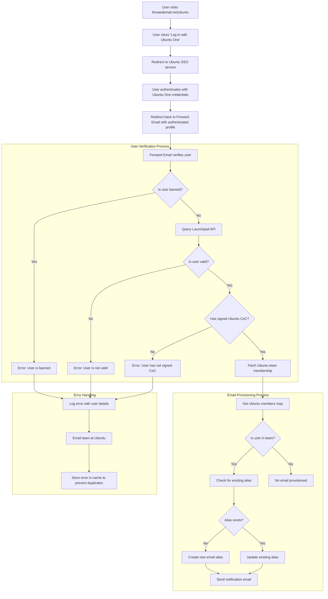

# Case Study: Kuinka Canonical tehostaa Ubuntun sähköpostinhallintaa Forward Emailin avoimen lähdekoodin yritysratkaisulla {#case-study-how-canonical-powers-ubuntu-email-management-with-forward-emails-open-source-enterprise-solution}


## Sisällysluettelo {#table-of-contents}

* [Esipuhe](#foreword)
* [Haaste: Monimutkaisen sähköpostiekosysteemin hallinta](#the-challenge-managing-a-complex-email-ecosystem)
* [Keskeiset opit](#key-takeaways)
* [Miksi Forward Email](#why-forward-email)
* [Toteutus: Saumaton SSO-integraatio](#the-implementation-seamless-sso-integration)
  * [Todennusprosessin visualisointi](#authentication-flow-visualization)
  * [Tekniset toteutustiedot](#technical-implementation-details)
* [DNS-konfiguraatio ja sähköpostin reititys](#dns-configuration-and-email-routing)
* [Tulokset: Virtaviivaistettu sähköpostinhallinta ja parannettu turvallisuus](#results-streamlined-email-management-and-enhanced-security)
  * [Toiminnallinen tehokkuus](#operational-efficiency)
  * [Parannettu turvallisuus ja yksityisyys](#enhanced-security-and-privacy)
  * [Kustannussäästöt](#cost-savings)
  * [Parannettu osallistujakokemus](#improved-contributor-experience)
* [Tulevaisuuden näkymät: Jatkuva yhteistyö](#looking-forward-continued-collaboration)
* [Yhteenveto: Täydellinen avoimen lähdekoodin kumppanuus](#conclusion-a-perfect-open-source-partnership)
* [Yritysasiakkaiden tukeminen](#supporting-enterprise-clients)
  * [Ota yhteyttä](#get-in-touch)
  * [Tietoa Forward Emailista](#about-forward-email)


## Esipuhe {#foreword}

Avoimen lähdekoodin ohjelmistojen maailmassa harvat nimet kantavat yhtä suurta painoarvoa kuin [Canonical](https://en.wikipedia.org/wiki/Canonical_\(company\)), yritys, joka on [Ubuntun](https://en.wikipedia.org/wiki/Ubuntu) takana – yksi maailman suosituimmista Linux-jakeluista. Laajan ekosysteemin, johon kuuluu useita jakeluja kuten Ubuntu, [Kubuntu](https://en.wikipedia.org/wiki/Kubuntu), [Lubuntu](https://en.wikipedia.org/wiki/Lubuntu), [Edubuntu](https://en.wikipedia.org/wiki/Edubuntu) ja muita, hallinta asetti Canonicalille ainutlaatuisia haasteita sähköpostiosoitteiden hallinnassa lukuisilla verkkotunnuksilla. Tämä tapaustutkimus käsittelee, kuinka Canonical teki yhteistyötä Forward Emailin kanssa luodakseen saumattoman, turvallisen ja yksityisyyttä korostavan yritystason sähköpostinhallintaratkaisun, joka sopii täydellisesti heidän avoimen lähdekoodin arvoihinsa.


## Haaste: Monimutkaisen sähköpostiekosysteemin hallinta {#the-challenge-managing-a-complex-email-ecosystem}

Canonicalin ekosysteemi on monimuotoinen ja laaja. Miljoonien käyttäjien ja tuhansien eri projektien osallistujien kanssa sähköpostiosoitteiden hallinta useilla verkkotunnuksilla aiheutti merkittäviä haasteita. Keskeisille osallistujille tarvittiin viralliset sähköpostiosoitteet (@ubuntu.com, @kubuntu.org jne.), jotka heijastivat heidän rooliaan projektissa samalla kun turvallisuus ja helppokäyttöisyys säilytettiin vahvan Ubuntun verkkotunnusten hallintajärjestelmän avulla.

Ennen Forward Emailin käyttöönottoa Canonical kohtasi seuraavia ongelmia:

* Sähköpostiosoitteiden hallinta useilla verkkotunnuksilla (@ubuntu.com, @kubuntu.org, @lubuntu.me, @edubuntu.org ja @ubuntu.net)
* Johdonmukaisen sähköpostikokemuksen tarjoaminen keskeisille osallistujille
* Sähköpostipalveluiden integrointi olemassa olevaan [Ubuntu One](https://en.wikipedia.org/wiki/Ubuntu_One) Single Sign-On (SSO) -järjestelmään
* Ratkaisun löytäminen, joka vastaa sitoutumista yksityisyyteen, turvallisuuteen ja avoimen lähdekoodin sähköpostiturvallisuuteen
* Turvallisen sähköpostiinfrastruktuurin skaalaaminen kustannustehokkaasti


## Keskeiset opit {#key-takeaways}

* Canonical otti onnistuneesti käyttöön yhtenäisen sähköpostinhallintaratkaisun useilla Ubuntu-verkkotunnuksilla
* Forward Emailin 100 % avoimen lähdekoodin lähestymistapa sopi täydellisesti Canonicalin arvoihin
* SSO-integraatio Ubuntu Onen kanssa tarjoaa saumattoman todennuksen osallistujille
* Kvanttikestävä salaus takaa pitkäaikaisen turvallisuuden kaikille sähköpostiviesteille
* Ratkaisu skaalautuu kustannustehokkaasti tukemaan Canonicalin kasvavaa osallistujapohjaa


## Miksi Forward Email {#why-forward-email}
Ainoana 100 % avoimen lähdekoodin sähköpostipalveluntarjoajana, joka keskittyy yksityisyyteen ja turvallisuuteen, Forward Email oli luonnollinen valinta Canonicalin yrityksen sähköpostin edelleenlähetyksen tarpeisiin. Arvomme sopivat täydellisesti yhteen Canonicalin sitoutumisen kanssa avoimen lähdekoodin ohjelmistoihin ja yksityisyyteen.

Keskeiset tekijät, jotka tekivät Forward Emailista ihanteellisen valinnan, olivat:

1. **Täydellinen avoimen lähdekoodin koodipohja**: Koko alustamme on avoimen lähdekoodin ja saatavilla [GitHubissa](https://en.wikipedia.org/wiki/GitHub), mikä mahdollistaa läpinäkyvyyden ja yhteisön panokset. Toisin kuin monet "yksityisyyteen keskittyvät" sähköpostipalveluntarjoajat, jotka avaavat vain käyttöliittymänsä ja pitävät taustajärjestelmänsä suljettuina, olemme tehneet koko koodipohjamme—sekä käyttöliittymän että taustajärjestelmän—katsottavaksi kenelle tahansa osoitteessa [GitHub](https://github.com/forwardemail/forwardemail.net).

2. **Yksityisyyteen keskittyvä lähestymistapa**: Toisin kuin muut palveluntarjoajat, emme tallenna sähköposteja jaettuihin tietokantoihin, ja käytämme vahvaa salausta TLS:n avulla. Perusperiaatteemme yksityisyydestä on yksinkertainen: **sähköpostisi kuuluvat sinulle ja vain sinulle**. Tämä periaate ohjaa jokaista teknistä päätöstämme, siitä miten käsittelemme sähköpostin edelleenlähetystä siihen, miten toteutamme salauksen.

3. **Ei riippuvuutta kolmansista osapuolista**: Emme käytä Amazon SES:ää tai muita kolmannen osapuolen palveluita, mikä antaa meille täydellisen hallinnan sähköpostin infrastruktuuriin ja poistaa mahdolliset yksityisyysvuodot kolmansien osapuolien palveluiden kautta.

4. **Kustannustehokas skaalaus**: Hinnoittelumallimme mahdollistaa organisaatioiden kasvun ilman käyttäjäkohtaista maksua, mikä tekee siitä ihanteellisen Canonicalin suurelle kontribuuttipohjalle.

5. **Kvanttikestävä salaus**: Käytämme yksilöllisesti salattuja SQLite-postilaatikoita, joissa salausalgoritmina on [ChaCha20-Poly1305](https://en.wikipedia.org/wiki/ChaCha20-Poly1305) [kvanttikestävässä salauksessa](/blog/docs/best-quantum-safe-encrypted-email-service). Jokainen postilaatikko on erillinen salattu tiedosto, mikä tarkoittaa, että yhden käyttäjän tietoihin pääsy ei anna pääsyä muiden tietoihin.


## Toteutus: Saumaton SSO-integraatio {#the-implementation-seamless-sso-integration}

Yksi toteutuksen kriittisimmistä osa-alueista oli integraatio Canonicalin olemassa olevaan Ubuntu One SSO -järjestelmään. Tämä integraatio mahdollistaisi ydinkontribuuttoreiden hallita @ubuntu.com-sähköpostiosoitteitaan olemassa olevilla Ubuntu One -tunnuksillaan.

### Todennusprosessin visualisointi {#authentication-flow-visualization}

Seuraava kaavio kuvaa täydellisen todennus- ja sähköpostin tarjoamisprosessin:


```mermaid
flowchart TD
    A[User visits forwardemail.net/ubuntu] --> B[User clicks 'Log in with Ubuntu One']
    B --> C[Redirect to Ubuntu SSO service]
    C --> D[User authenticates with Ubuntu One credentials]
    D --> E[Redirect back to Forward Email with authenticated profile]
    E --> F[Forward Email verifies user]

    subgraph "User Verification Process"
        F --> G{Is user banned?}
        G -->|Yes| H[Error: User is banned]
        G -->|No| I[Query Launchpad API]
        I --> J{Is user valid?}
        J -->|No| K[Error: User is not valid]
        J -->|Yes| L{Has signed Ubuntu CoC?}
        L -->|No| M[Error: User has not signed CoC]
        L -->|Yes| N[Fetch Ubuntu team membership]
    end

    subgraph "Email Provisioning Process"
        N --> O[Get Ubuntu members map]
        O --> P{Is user in team?}
        P -->|Yes| Q[Check for existing alias]
        Q --> R{Alias exists?}
        R -->|No| S[Create new email alias]
        R -->|Yes| T[Update existing alias]
        S --> U[Send notification email]
        T --> U
        P -->|No| V[No email provisioned]
    end

    subgraph "Error Handling"
        H --> W[Log error with user details]
        K --> W
        M --> W
        W --> X[Email team at Ubuntu]
        X --> Y[Store error in cache to prevent duplicates]
    end
```

### Teknisen toteutuksen yksityiskohdat {#technical-implementation-details}

Forward Emailin ja Ubuntu One SSO:n välinen integraatio toteutettiin räätälöidyllä passport-ubuntu-todennusstrategian toteutuksella. Tämä mahdollisti saumattoman todennusprosessin Ubuntu Onen ja Forward Emailin järjestelmien välillä.
#### Todennusprosessi {#the-authentication-flow}

Todennusprosessi toimii seuraavasti:

1. Käyttäjät vierailevat omistetulla Ubuntu-sähköpostinhallintasivulla osoitteessa [forwardemail.net/ubuntu](https://forwardemail.net/ubuntu)
2. He klikkaavat "Kirjaudu sisään Ubuntu Onella" ja ohjataan Ubuntu SSO -palveluun
3. Todennettuaan itsensä Ubuntu One -tunnuksillaan heidät ohjataan takaisin Forward Emailiin todennetun profiilinsa kanssa
4. Forward Email tarkistaa heidän kontribuuttoristatuksensa ja luo tai hallinnoi heidän sähköpostiosoitettaan sen mukaisesti

Tekninen toteutus hyödynsi [`passport-ubuntu`](https://www.npmjs.com/package/passport-ubuntu) -pakettia, joka on [Passport](https://www.npmjs.com/package/passport) -strategia Ubuntu-todennukseen käyttäen [OpenID](https://en.wikipedia.org/wiki/OpenID) -protokollaa. Konfiguraatio sisälsi:

```javascript
passport.use(new UbuntuStrategy({
  returnURL: process.env.UBUNTU_CALLBACK_URL,
  realm: process.env.UBUNTU_REALM,
  stateless: true
}, function(identifier, profile, done) {
  // Käyttäjän vahvistus ja sähköpostin luontilogiikka
}));
```

#### Launchpad API -integraatio ja validointi {#launchpad-api-integration-and-validation}

Keskeinen osa toteutustamme on integraatio [Launchpad](https://en.wikipedia.org/wiki/Launchpad_\(website\))'n API:in Ubuntu-käyttäjien ja heidän tiimijäsentyyksiensä validointiin. Loimme uudelleenkäytettäviä apufunktioita tämän integraation tehokkaaseen ja luotettavaan hoitamiseen.

`sync-ubuntu-user.js` -apufunktio vastaa käyttäjien validoinnista Launchpad API:n kautta ja heidän sähköpostiosoitteidensa hallinnasta. Tässä on yksinkertaistettu versio sen toiminnasta:

```javascript
async function syncUbuntuUser(user, map) {
  try {
    // Vahvista käyttäjäobjekti
    if (!_.isObject(user) ||
        !isSANB(user[fields.ubuntuUsername]) ||
        !isSANB(user[fields.ubuntuProfileID]) ||
        !isEmail(user.email))
      throw new TypeError('Virheellinen käyttäjäobjekti');

    // Hae Ubuntu-jäsenkartta, jos sitä ei ole annettu
    if (!(map instanceof Map))
      map = await getUbuntuMembersMap(resolver);

    // Tarkista onko käyttäjä estetty
    if (user[config.userFields.isBanned]) {
      throw new InvalidUbuntuUserError('Käyttäjä oli estetty', { ignoreHook: true });
    }

    // Kysy Launchpad API:sta käyttäjän validointia varten
    const url = `https://api.launchpad.net/1.0/~${user[fields.ubuntuUsername]}`;
    const response = await retryRequest(url, { resolver });
    const json = await response.body.json();

    // Vahvista vaaditut boolean-ominaisuudet
    if (!json.is_valid)
      throw new InvalidUbuntuUserError('Ominaisuus "is_valid" oli epätosi');

    if (!json.is_ubuntu_coc_signer)
      throw new InvalidUbuntuUserError('Ominaisuus "is_ubuntu_coc_signer" oli epätosi');

    // Käsittele jokainen käyttäjän domain
    await pMap([...map.keys()], async (name) => {
      // Etsi domain tietokannasta
      const domain = await Domains.findOne({
        name,
        plan: 'team',
        has_txt_record: true
      }).populate('members.user');

      // Käsittele käyttäjän sähköpostialias tälle domainille
      if (map.get(name).has(user[fields.ubuntuUsername])) {
        // Käyttäjä on tämän tiimin jäsen, luo tai päivitä alias
        let alias = await Aliases.findOne({
          user: user._id,
          domain: domain._id,
          name: user[fields.ubuntuUsername].toLowerCase()
        });

        if (!alias) {
          // Luo uusi alias asianmukaisella virheenkäsittelyllä
          alias = await Aliases.create({
            user: user._id,
            domain: domain._id,
            name: user[fields.ubuntuUsername].toLowerCase(),
            recipients: [user.email],
            locale: user[config.lastLocaleField],
            is_enabled: true
          });

          // Ilmoita ylläpitäjille uudesta aliasin luomisesta
          await emailHelper({
            template: 'alert',
            message: {
              to: adminEmailsForDomain,
              subject: `Uusi @${domain.name} sähköpostiosoite luotu`
            },
            locals: {
              message: `Uusi sähköpostiosoite ${user[fields.ubuntuUsername].toLowerCase()}@${domain.name} luotiin käyttäjälle ${user.email}`
            }
          });
        }
      }
    });

    return true;
  } catch (err) {
    // Käsittele ja kirjaa virheet
    await logErrorWithUser(err, user);
    throw err;
  }
}
```
Yksinkertaistaaksemme tiimijäsenyyksien hallintaa eri Ubuntu-verkkotunnusten välillä, loimme suoraviivaisen kartoituksen verkkotunnusten nimien ja niiden vastaavien Launchpad-tiimien välille:

```javascript
ubuntuTeamMapping: {
  'ubuntu.com': '~ubuntumembers',
  'kubuntu.org': '~kubuntu-members',
  'lubuntu.me': '~lubuntu-members',
  'edubuntu.org': '~edubuntu-members',
  'ubuntustudio.com': '~ubuntustudio-core',
  'ubuntu.net': '~ubuntu-smtp-test'
},
```

Tämä yksinkertainen kartoitus mahdollistaa tiimijäsenyyksien tarkistamisen ja sähköpostiosoitteiden provisioinnin automatisoinnin, tehden järjestelmästä helpon ylläpitää ja laajentaa uusien verkkotunnusten lisääntyessä.

#### Virheenkäsittely ja Ilmoitukset {#error-handling-and-notifications}

Otimme käyttöön vankan virheenkäsittelyjärjestelmän, joka:

1. Kirjaa kaikki virheet yksityiskohtaisilla käyttäjätiedoilla
2. Lähettää sähköpostia Ubuntu-tiimille, kun ongelmia havaitaan
3. Ilmoittaa ylläpitäjille, kun uudet kontribuuttorit rekisteröityvät ja heidän sähköpostiosoitteensa luodaan
4. Käsittelee erityistapauksia, kuten käyttäjiä, jotka eivät ole allekirjoittaneet Ubuntu Code of Conductia

Tämä varmistaa, että mahdolliset ongelmat havaitaan ja korjataan nopeasti, säilyttäen sähköpostijärjestelmän eheyden.


## DNS-konfiguraatio ja Sähköpostin Reititys {#dns-configuration-and-email-routing}

Jokaiselle Forward Emailin kautta hallinnoidulle verkkotunnukselle Canonical lisäsi yksinkertaisen DNS TXT -tietueen varmennusta varten:

```sh
❯ dig ubuntu.com txt
ubuntu.com.             600     IN      TXT     "forward-email-site-verification=6IsURgl2t7"
```

Tämä varmennustietue vahvistaa verkkotunnuksen omistajuuden ja mahdollistaa järjestelmämme turvallisen sähköpostin hallinnan näille verkkotunnuksille. Canonical reitittää postin palvelumme kautta Postfixin avulla, joka tarjoaa luotettavan ja turvallisen sähköpostin toimitusinfrastruktuurin.


## Tulokset: Virtaviivaistettu Sähköpostinhallinta ja Parannettu Turvallisuus {#results-streamlined-email-management-and-enhanced-security}

Forward Emailin yritysratkaisun käyttöönotto on tuonut merkittäviä hyötyjä Canonicalin sähköpostinhallintaan kaikilla heidän verkkotunnuksillaan:

### Toiminnallinen Tehokkuus {#operational-efficiency}

* **Keskitetty hallinta**: Kaikki Ubuntuun liittyvät verkkotunnukset hallitaan nyt yhdestä käyttöliittymästä
* **Vähentynyt hallinnollinen kuorma**: Automaattinen provisiointi ja itsepalveluhallinta kontribuuttoreille
* **Yksinkertaistettu perehdytys**: Uudet kontribuuttorit saavat nopeasti viralliset sähköpostiosoitteensa

### Parannettu Turvallisuus ja Yksityisyys {#enhanced-security-and-privacy}

* **Päästä päähän -salauksen**: Kaikki sähköpostit salataan edistyneillä standardeilla
* **Ei jaettuja tietokantoja**: Jokaisen käyttäjän sähköpostit tallennetaan yksilöllisiin salattuihin SQLite-tietokantoihin, tarjoten hiekkalaatikkopohjaisen salausmenetelmän, joka on periaatteessa turvallisempi kuin perinteiset jaetut relaatiotietokannat
* **Avoimen lähdekoodin turvallisuus**: Läpinäkyvä koodipohja mahdollistaa yhteisön turvallisuustarkastukset
* **Muistipohjainen käsittely**: Emme tallenna välitettyjä sähköposteja levylle, mikä parantaa yksityisyyden suojaa
* **Ei metatietojen tallennusta**: Emme pidä kirjaa siitä, kuka lähettää kenelle, toisin kuin monet sähköpostipalveluntarjoajat

### Kustannussäästöt {#cost-savings}

* **Skaalautuva hinnoittelumalli**: Ei käyttäjäkohtaisia maksuja, jolloin Canonical voi lisätä kontribuuttoreita ilman kustannusten kasvua
* **Vähentyneet infrastruktuuritarpeet**: Ei tarvetta ylläpitää erillisiä sähköpostipalvelimia eri verkkotunnuksille
* **Alhaisemmat tukitarpeet**: Itsepalveluhallinta vähentää IT-tukipyyntöjä

### Parannettu Kontribuuttorikokemus {#improved-contributor-experience}

* **Saumaton todennus**: Yksi kirjautuminen olemassa olevilla Ubuntu One -tunnuksilla
* **Yhtenäinen brändäys**: Yhtenäinen käyttökokemus kaikissa Ubuntuun liittyvissä palveluissa
* **Luotettava sähköpostin toimitus**: Korkealaatuinen IP-maine varmistaa sähköpostien perillemenon

Forward Emailin integrointi on merkittävästi virtaviivaistanut Canonicalin sähköpostinhallintaprosessia. Kontribuuttoreilla on nyt saumaton kokemus @ubuntu.com-sähköpostiosoitteidensa hallinnasta, vähentyneen hallinnollisen kuorman ja parannetun turvallisuuden kera.


## Tulevaisuuteen: Jatkuva Yhteistyö {#looking-forward-continued-collaboration}

Canonicalin ja Forward Emailin välinen kumppanuus kehittyy edelleen. Teemme yhteistyötä useissa hankkeissa:
* Sähköpostipalveluiden laajentaminen lisä-Ubuntu-aiheisiin domaineihin
* Käyttöliittymän parantaminen osallistujapalautteen perusteella
* Lisäturvaominaisuuksien toteuttaminen
* Uusien tapojen tutkiminen avoimen lähdekoodin yhteistyön hyödyntämiseksi


## Yhteenveto: Täydellinen avoimen lähdekoodin kumppanuus {#conclusion-a-perfect-open-source-partnership}

Canonicalin ja Forward Emailin välinen yhteistyö osoittaa jaettuihin arvoihin perustuvien kumppanuuksien voiman. Valitsemalla Forward Emailin sähköpostipalveluntarjoajakseen Canonical löysi ratkaisun, joka ei ainoastaan täyttänyt heidän teknisiä vaatimuksiaan, vaan myös sopi täydellisesti heidän sitoutumiseensa avoimen lähdekoodin ohjelmistoihin, yksityisyyteen ja turvallisuuteen.

Monia domaineja hallinnoiville organisaatioille, jotka tarvitsevat saumattoman todennuksen olemassa olevien järjestelmien kanssa, Forward Email tarjoaa joustavan, turvallisen ja yksityisyyttä korostavan ratkaisun. Meidän [avoin lähdekoodi -lähestymistapamme](https://forwardemail.net/blog/docs/why-open-source-email-security-privacy) takaa läpinäkyvyyden ja mahdollistaa yhteisön panokset, tehden siitä ihanteellisen valinnan organisaatioille, jotka arvostavat näitä periaatteita.

Kun sekä Canonical että Forward Email jatkavat innovointia omilla aloillaan, tämä kumppanuus toimii todisteena avoimen lähdekoodin yhteistyön ja jaettujen arvojen voimasta tehokkaiden ratkaisujen luomisessa.

Voit tarkistaa [reaaliaikaisen palvelutilanteemme](https://status.forwardemail.net) nähdäksesi nykyisen sähköpostin toimitustilanteemme, jota valvomme jatkuvasti varmistaaksemme korkean IP-maineen ja sähköpostin toimitettavuuden.


## Yritysasiakkaiden tukeminen {#supporting-enterprise-clients}

Vaikka tämä tapaustutkimus keskittyy kumppanuuteemme Canonicalin kanssa, Forward Email tukee ylpeänä lukuisia yritysasiakkaita eri toimialoilla, jotka arvostavat sitoutumistamme yksityisyyteen, turvallisuuteen ja avoimen lähdekoodin periaatteisiin.

Yritysratkaisumme on räätälöity vastaamaan kaiken kokoisten organisaatioiden erityistarpeita, tarjoten:

* Räätälöityjen domainien [sähköpostinhallinta](/) useissa domaineissa
* Saumaton integraatio olemassa oleviin todennushallintajärjestelmiin
* Omistettu Matrix-chat-tukikanava
* Parannetut turvaominaisuudet, mukaan lukien [kvanttiturvallinen salaus](/blog/docs/best-quantum-safe-encrypted-email-service)
* Täydellinen datansiirrettävyys ja omistajuus
* 100 % avoimen lähdekoodin infrastruktuuri läpinäkyvyyden ja luottamuksen takaamiseksi

### Ota yhteyttä {#get-in-touch}

Jos organisaatiollasi on yrityssähköpostitarpeita tai haluat tietää lisää siitä, miten Forward Email voi auttaa sähköpostinhallinnan sujuvoittamisessa samalla kun parannetaan yksityisyyttä ja turvallisuutta, kuulemme mielellämme sinusta:

* Lähetä sähköpostia suoraan osoitteeseen `support@forwardemail.net`
* Lähetä tukipyyntö [tukisivullamme](https://forwardemail.net/help)
* Tutustu [hinnoittelusivuumme](https://forwardemail.net/pricing) yrityssuunnitelmiin

Tiimimme on valmis keskustelemaan erityisvaatimuksistasi ja kehittämään räätälöidyn ratkaisun, joka vastaa organisaatiosi arvoja ja teknisiä tarpeita.

### Tietoa Forward Emailista {#about-forward-email}

Forward Email on 100 % avoimen lähdekoodin ja yksityisyyttä korostava sähköpostipalvelu. Tarjoamme räätälöityjen domainien sähköpostin edelleenlähetyksen, SMTP-, IMAP- ja POP3-palvelut keskittyen turvallisuuteen, yksityisyyteen ja läpinäkyvyyteen. Koko koodipohjamme on saatavilla [GitHubissa](https://github.com/forwardemail/forwardemail.net), ja olemme sitoutuneet tarjoamaan sähköpostipalveluita, jotka kunnioittavat käyttäjien yksityisyyttä ja turvallisuutta. Lue lisää siitä, [miksi avoimen lähdekoodin sähköposti on tulevaisuus](https://forwardemail.net/blog/docs/why-open-source-email-security-privacy), [miten sähköpostin edelleenlähetys toimii](https://forwardemail.net/blog/docs/best-email-forwarding-service) ja [lähestymistavastamme sähköpostin yksityisyyden suojaamiseen](https://forwardemail.net/blog/docs/email-privacy-protection-technical-implementation).
