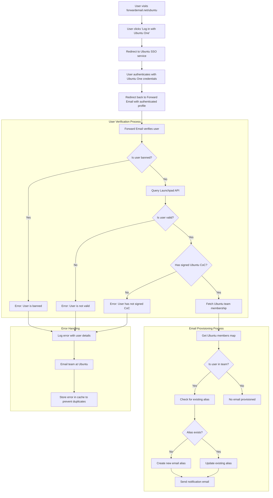

# Étude de cas : Comment Canonical optimise la gestion des e-mails Ubuntu avec la solution d'entreprise open source Forward Email {#case-study-how-canonical-powers-ubuntu-email-management-with-forward-emails-open-source-enterprise-solution}


## Table des matières {#table-of-contents}

* [Avant-propos](#foreword)
* [Le défi : gérer un écosystème de messagerie électronique complexe](#the-challenge-managing-a-complex-email-ecosystem)
* [Points clés à retenir](#key-takeaways)
* [Pourquoi transférer un e-mail](#why-forward-email)
* [La mise en œuvre : intégration SSO transparente](#the-implementation-seamless-sso-integration)
  * [Visualisation du flux d'authentification](#authentication-flow-visualization)
  * [Détails de mise en œuvre technique](#technical-implementation-details)
* [Configuration DNS et routage des e-mails](#dns-configuration-and-email-routing)
* [Résultats : gestion simplifiée des e-mails et sécurité renforcée](#results-streamlined-email-management-and-enhanced-security)
  * [Efficacité opérationnelle](#operational-efficiency)
  * [Sécurité et confidentialité renforcées](#enhanced-security-and-privacy)
  * [Économies de coûts](#cost-savings)
  * [Expérience de contributeur améliorée](#improved-contributor-experience)
* [Perspectives d'avenir : collaboration continue](#looking-forward-continued-collaboration)
* [Conclusion : un partenariat open source parfait](#conclusion-a-perfect-open-source-partnership)
* [Accompagnement des clients d'entreprise](#supporting-enterprise-clients)
  * [Entrer en contact](#get-in-touch)
  * [À propos de la fonction de transfert d'e-mails](#about-forward-email)

## Avant-propos {#foreword}

Dans le monde des logiciels open source, peu de noms ont autant de poids que [Canonique](https://en.wikipedia.org/wiki/Canonical_\(company\), l'entreprise à l'origine de [Ubuntu](https://en.wikipedia.org/wiki/Ubuntu), l'une des distributions Linux les plus populaires au monde. Avec un vaste écosystème couvrant plusieurs distributions, dont Ubuntu, [Gratuit](https://en.wikipedia.org/wiki/Kubuntu), [Lubuntu](https://en.wikipedia.org/wiki/Lubuntu), [Edubuntu](https://en.wikipedia.org/wiki/Edubuntu) et d'autres, Canonical a dû relever des défis uniques pour gérer les adresses e-mail sur ses nombreux domaines. Cette étude de cas explore comment Canonical s'est associé à Forward Email pour créer une solution de gestion des e-mails d'entreprise transparente, sécurisée et respectueuse de la confidentialité, parfaitement en phase avec ses valeurs open source.

## Le défi : gérer un écosystème de messagerie complexe {#the-challenge-managing-a-complex-email-ecosystem}

L'écosystème de Canonical est diversifié et étendu. Avec des millions d'utilisateurs dans le monde et des milliers de contributeurs sur divers projets, la gestion des adresses e-mail sur plusieurs domaines représentait un défi majeur. Les contributeurs principaux avaient besoin d'adresses e-mail officielles (@ubuntu.com, @kubuntu.org, etc.) reflétant leur implication dans le projet, tout en garantissant la sécurité et la simplicité d'utilisation grâce à un système de gestion de domaines Ubuntu robuste.

Avant de mettre en œuvre Forward Email, Canonical rencontrait des difficultés avec :

* Gestion des adresses e-mail sur plusieurs domaines (@ubuntu.com, @kubuntu.org, @lubuntu.me, @edubuntu.org et @ubuntu.net)
* Offre une expérience de messagerie cohérente aux principaux contributeurs
* Intégration des services de messagerie à leur système d'authentification unique (SSO) [Ubuntu One](https://en.wikipedia.org/wiki/Ubuntu_One) existant
* Recherche d'une solution conforme à leur engagement en matière de confidentialité, de sécurité et de sécurité des e-mails open source
* Mise à l'échelle rentable de leur infrastructure de messagerie sécurisée

## Points clés à retenir {#key-takeaways}

* Canonical a implémenté avec succès une solution unifiée de gestion des e-mails sur plusieurs domaines Ubuntu.
* L'approche 100 % open source de Forward Email s'inscrit parfaitement dans les valeurs de Canonical.
* L'intégration SSO avec Ubuntu One offre une authentification transparente aux contributeurs.
* Le chiffrement quantique garantit la sécurité à long terme de toutes les communications par e-mail.
* La solution s'adapte de manière rentable à la base croissante de contributeurs de Canonical.

## Pourquoi transférer un e-mail ? {#why-forward-email}

En tant que seul fournisseur de services de messagerie 100 % open source axé sur la confidentialité et la sécurité, Forward Email était la solution idéale pour répondre aux besoins de Canonical en matière de transfert d'e-mails d'entreprise. Nos valeurs correspondaient parfaitement à l'engagement de Canonical en faveur des logiciels open source et de la confidentialité.

Les facteurs clés qui ont fait de Forward Email le choix idéal comprenaient :

1. **Base de code open source complète** : L'intégralité de notre plateforme est open source et disponible sur [GitHub](https://en.wikipedia.org/wiki/GitHub), ce qui favorise la transparence et les contributions de la communauté. Contrairement à de nombreux fournisseurs de messagerie soucieux de la confidentialité qui ne publient en open source que leurs interfaces et maintiennent leurs back-ends fermés, nous avons mis à disposition de tous notre base de code (interface et back-end) pour consultation sur [GitHub](https://github.com/forwardemail/forwardemail.net).

2. **Approche axée sur la confidentialité** : Contrairement à d’autres fournisseurs, nous ne stockons pas les e-mails dans des bases de données partagées et utilisons un chiffrement robuste avec TLS. Notre philosophie fondamentale en matière de confidentialité est simple : **vos e-mails vous appartiennent, à vous seul**. Ce principe guide chacune de nos décisions techniques, de la gestion du transfert des e-mails à la mise en œuvre du chiffrement.

3. **Aucune dépendance à l'égard de tiers** : Nous n'utilisons pas Amazon SES ni d'autres services tiers, ce qui nous donne un contrôle total sur l'infrastructure de messagerie et élimine les fuites potentielles de confidentialité via des services tiers.

4. **Mise à l'échelle rentable** : Notre modèle de tarification permet aux organisations d'évoluer sans payer par utilisateur, ce qui le rend idéal pour la large base de contributeurs de Canonical.

5. **Chiffrement résistant aux attaques quantiques** : Nous utilisons des boîtes aux lettres SQLite chiffrées individuellement avec [ChaCha20-Poly1305](https://en.wikipedia.org/wiki/ChaCha20-Poly1305) comme chiffrement pour [cryptage résistant aux quanta](/blog/docs/best-quantum-safe-encrypted-email-service). Chaque boîte aux lettres est un fichier chiffré distinct, ce qui signifie que l'accès aux données d'un utilisateur ne donne pas accès aux autres.

## L'implémentation : intégration SSO transparente {#the-implementation-seamless-sso-integration}

L'un des aspects les plus critiques de la mise en œuvre a été l'intégration avec le système SSO Ubuntu One de Canonical. Cette intégration permettrait aux contributeurs principaux de gérer leurs adresses e-mail @ubuntu.com avec leurs identifiants Ubuntu One existants.

### Visualisation du flux d'authentification {#authentication-flow-visualization}

Le diagramme suivant illustre le flux complet d’authentification et de provisionnement des e-mails :



### Détails de mise en œuvre technique de {#technical-implementation-details}

L'intégration entre Forward Email et Ubuntu One SSO a été réalisée grâce à une implémentation personnalisée de la stratégie d'authentification passport-ubuntu. Cela a permis un flux d'authentification fluide entre les systèmes Ubuntu One et Forward Email.

#### Le flux d'authentification {#the-authentication-flow}

Le processus d’authentification fonctionne comme suit :

1. Les utilisateurs consultent la page dédiée à la gestion des e-mails Ubuntu à l'adresse [forwardemail.net/ubuntu](https://forwardemail.net/ubuntu).
2. Ils cliquent sur « Se connecter avec Ubuntu One » et sont redirigés vers le service SSO Ubuntu.
3. Après s'être authentifiés avec leurs identifiants Ubuntu One, ils sont redirigés vers la page de transfert d'e-mails avec leur profil authentifié.
4. La page de transfert d'e-mails vérifie leur statut de contributeur et gère leur adresse e-mail en conséquence.

L'implémentation technique s'appuyait sur le paquet [`passport-ubuntu`](https://www.npmjs.com/package/passport-ubuntu), une stratégie [Passeport](https://www.npmjs.com/package/passport) permettant l'authentification auprès d'Ubuntu via [OpenID](https://en.wikipedia.org/wiki/OpenID). La configuration comprenait :

```javascript
passport.use(new UbuntuStrategy({
  returnURL: process.env.UBUNTU_CALLBACK_URL,
  realm: process.env.UBUNTU_REALM,
  stateless: true
}, function(identifier, profile, done) {
  // User verification and email provisioning logic
}));
```

#### Intégration et validation de l'API Launchpad {#launchpad-api-integration-and-validation}

Un élément essentiel de notre implémentation est l'intégration avec l'API [Rampe de lancement](https://en.wikipedia.org/wiki/Launchpad_\(website\)) pour valider les utilisateurs Ubuntu et leur appartenance à une équipe. Nous avons créé des fonctions d'assistance réutilisables pour gérer cette intégration de manière efficace et fiable.

La fonction d'assistance `sync-ubuntu-user.js` est chargée de valider les utilisateurs via l'API Launchpad et de gérer leurs adresses e-mail. Voici une version simplifiée de son fonctionnement :

```javascript
async function syncUbuntuUser(user, map) {
  try {
    // Validate user object
    if (!_.isObject(user) ||
        !isSANB(user[fields.ubuntuUsername]) ||
        !isSANB(user[fields.ubuntuProfileID]) ||
        !isEmail(user.email))
      throw new TypeError('Invalid user object');

    // Get Ubuntu members map if not provided
    if (!(map instanceof Map))
      map = await getUbuntuMembersMap(resolver);

    // Check if user is banned
    if (user[config.userFields.isBanned]) {
      throw new InvalidUbuntuUserError('User was banned', { ignoreHook: true });
    }

    // Query Launchpad API to validate user
    const url = `https://api.launchpad.net/1.0/~${user[fields.ubuntuUsername]}`;
    const response = await retryRequest(url, { resolver });
    const json = await response.body.json();

    // Validate required boolean properties
    if (!json.is_valid)
      throw new InvalidUbuntuUserError('Property "is_valid" was false');

    if (!json.is_ubuntu_coc_signer)
      throw new InvalidUbuntuUserError('Property "is_ubuntu_coc_signer" was false');

    // Process each domain for the user
    await pMap([...map.keys()], async (name) => {
      // Find domain in database
      const domain = await Domains.findOne({
        name,
        plan: 'team',
        has_txt_record: true
      }).populate('members.user');

      // Process user's email alias for this domain
      if (map.get(name).has(user[fields.ubuntuUsername])) {
        // User is a member of this team, create or update alias
        let alias = await Aliases.findOne({
          user: user._id,
          domain: domain._id,
          name: user[fields.ubuntuUsername].toLowerCase()
        });

        if (!alias) {
          // Create new alias with appropriate error handling
          alias = await Aliases.create({
            user: user._id,
            domain: domain._id,
            name: user[fields.ubuntuUsername].toLowerCase(),
            recipients: [user.email],
            locale: user[config.lastLocaleField],
            is_enabled: true
          });

          // Notify admins about new alias creation
          await emailHelper({
            template: 'alert',
            message: {
              to: adminEmailsForDomain,
              subject: `New @${domain.name} email address created`
            },
            locals: {
              message: `A new email address ${user[fields.ubuntuUsername].toLowerCase()}@${domain.name} was created for ${user.email}`
            }
          });
        }
      }
    });

    return true;
  } catch (err) {
    // Handle and log errors
    await logErrorWithUser(err, user);
    throw err;
  }
}
```

Pour simplifier la gestion des appartenances aux équipes dans différents domaines Ubuntu, nous avons créé un mappage simple entre les noms de domaine et leurs équipes Launchpad correspondantes :

```javascript
ubuntuTeamMapping: {
  'ubuntu.com': '~ubuntumembers',
  'kubuntu.org': '~kubuntu-members',
  'lubuntu.me': '~lubuntu-members',
  'edubuntu.org': '~edubuntu-members',
  'ubuntustudio.com': '~ubuntustudio-core',
  'ubuntu.net': '~ubuntu-smtp-test'
},
```

Ce mappage simple nous permet d'automatiser le processus de vérification des appartenances aux équipes et de provisionnement des adresses e-mail, ce qui rend le système facile à entretenir et à étendre à mesure que de nouveaux domaines sont ajoutés.

#### Gestion des erreurs et notifications {#error-handling-and-notifications}

Nous avons mis en place un système robuste de gestion des erreurs qui :

1. Enregistre toutes les erreurs avec des informations utilisateur détaillées.
2. Envoie un e-mail à l'équipe Ubuntu en cas de problème.
3. Avertit les administrateurs de l'inscription et de la création d'adresses e-mail de nouveaux contributeurs.
4. Gère les cas particuliers, comme les utilisateurs n'ayant pas signé le Code de conduite d'Ubuntu.

Cela garantit que tous les problèmes sont rapidement identifiés et traités, préservant ainsi l’intégrité du système de messagerie.

## Configuration DNS et routage des e-mails {#dns-configuration-and-email-routing}

Pour chaque domaine géré via Forward Email, Canonical a ajouté un simple enregistrement DNS TXT pour validation :

```sh
❯ dig ubuntu.com txt
ubuntu.com.             600     IN      TXT     "forward-email-site-verification=6IsURgl2t7"
```

Cet enregistrement de vérification confirme la propriété du domaine et permet à notre système de gérer les e-mails de ces domaines en toute sécurité. Canonical achemine le courrier via Postfix, qui fournit une infrastructure de distribution d'e-mails fiable et sécurisée.

Résultats ## : gestion simplifiée des e-mails et sécurité renforcée {#results-streamlined-email-management-and-enhanced-security}

La mise en œuvre de la solution d'entreprise Forward Email a apporté des avantages significatifs à la gestion des e-mails de Canonical dans tous ses domaines :

### Efficacité opérationnelle {#operational-efficiency}

* **Gestion centralisée** : Tous les domaines liés à Ubuntu sont désormais gérés via une interface unique.
* **Charge administrative réduite** : Provisionnement automatisé et gestion en libre-service pour les contributeurs.
* **Intégration simplifiée** : Les nouveaux contributeurs peuvent obtenir rapidement leur adresse e-mail officielle.

### Sécurité et confidentialité renforcées {#enhanced-security-and-privacy}

* **Chiffrement de bout en bout** : Tous les e-mails sont chiffrés selon des normes avancées
* **Aucune base de données partagée** : Les e-mails de chaque utilisateur sont stockés dans des bases de données SQLite chiffrées individuelles, offrant une approche de chiffrement en sandbox fondamentalement plus sécurisée que les bases de données relationnelles partagées traditionnelles
* **Sécurité open source** : La base de code transparente permet des contrôles de sécurité communautaires
* **Traitement en mémoire** : Nous ne stockons pas les e-mails transférés sur le disque, ce qui renforce la protection de la confidentialité
* **Aucun stockage de métadonnées** : Contrairement à de nombreux fournisseurs de messagerie, nous ne conservons pas de trace des e-mails échangés.

### Économies de coûts {#cost-savings}

* **Modèle de tarification évolutif** : Aucun frais par utilisateur, ce qui permet à Canonical d'ajouter des contributeurs sans augmenter les coûts.
* **Besoins d'infrastructure réduits** : Plus besoin de maintenir des serveurs de messagerie distincts pour différents domaines.
* **Besoins d'assistance réduits** : La gestion en libre-service réduit le nombre de tickets d'assistance informatique.

### Expérience de contributeur améliorée {#improved-contributor-experience}

* **Authentification transparente** : Authentification unique avec les identifiants Ubuntu One existants
* **Image de marque cohérente** : Expérience unifiée sur tous les services Ubuntu
* **Livraison fiable des e-mails** : Une réputation IP de haute qualité garantit que les e-mails parviennent à destination

L'intégration avec Forward Email a considérablement simplifié le processus de gestion des e-mails de Canonical. Les contributeurs bénéficient désormais d'une expérience fluide pour gérer leurs adresses e-mail @ubuntu.com, avec des frais administratifs réduits et une sécurité renforcée.

## Perspectives d'avenir : collaboration continue {#looking-forward-continued-collaboration}

Le partenariat entre Canonical et Forward Email continue d'évoluer. Nous collaborons sur plusieurs initiatives :

* Extension des services de messagerie à d'autres domaines liés à Ubuntu
* Amélioration de l'interface utilisateur grâce aux retours des contributeurs
* Mise en œuvre de fonctionnalités de sécurité supplémentaires
* Exploration de nouvelles façons de tirer parti de notre collaboration open source

## Conclusion : un partenariat open source parfait {#conclusion-a-perfect-open-source-partnership}

La collaboration entre Canonical et Forward Email démontre la puissance des partenariats fondés sur des valeurs communes. En choisissant Forward Email comme fournisseur de services de messagerie, Canonical a trouvé une solution qui répondait non seulement à ses exigences techniques, mais aussi à son engagement en matière de logiciels open source, de confidentialité et de sécurité.

Pour les organisations gérant plusieurs domaines et nécessitant une authentification transparente avec les systèmes existants, Forward Email offre une solution flexible, sécurisée et respectueuse de la confidentialité. Notre [approche open source](https://forwardemail.net/blog/docs/why-open-source-email-security-privacy) garantit la transparence et permet les contributions de la communauté, ce qui en fait un choix idéal pour les organisations qui adhèrent à ces principes.

Alors que Canonical et Forward Email continuent d’innover dans leurs domaines respectifs, ce partenariat témoigne de la puissance de la collaboration open source et des valeurs partagées dans la création de solutions efficaces.

Vous pouvez consulter notre [état du service en temps réel](https://status.forwardemail.net) pour voir nos performances actuelles de livraison d'e-mails, que nous surveillons en permanence pour garantir une réputation IP et une délivrabilité d'e-mails de haute qualité.

## Prise en charge des clients d'entreprise {#supporting-enterprise-clients}

Bien que cette étude de cas se concentre sur notre partenariat avec Canonical, Forward Email soutient fièrement de nombreux clients d'entreprise dans divers secteurs qui apprécient notre engagement envers la confidentialité, la sécurité et les principes open source.

Nos solutions d'entreprise sont conçues pour répondre aux besoins spécifiques des organisations de toutes tailles, offrant :

* Domaine personnalisé [gestion des e-mails](/) sur plusieurs domaines
* Intégration transparente aux systèmes d'authentification existants
* Canal d'assistance Matrix dédié par chat
* Fonctionnalités de sécurité améliorées, notamment [cryptage résistant aux quanta](/blog/docs/best-quantum-safe-encrypted-email-service)
* Portabilité et propriété complètes des données
* Infrastructure 100 % open source pour plus de transparence et de confiance

### Contactez-nous {#get-in-touch}

Si votre organisation a des besoins en matière de messagerie d'entreprise ou si vous souhaitez en savoir plus sur la manière dont Forward Email peut vous aider à rationaliser la gestion de votre messagerie tout en améliorant la confidentialité et la sécurité, nous aimerions avoir de vos nouvelles :

* Envoyez-nous un e-mail directement à `support@forwardemail.net`
* Soumettez une demande d'assistance à [page d'aide](https://forwardemail.net/help)
* Consultez [page de tarification](https://forwardemail.net/pricing) pour les forfaits Entreprise

Notre équipe est prête à discuter de vos besoins spécifiques et à développer une solution personnalisée qui correspond aux valeurs et aux besoins techniques de votre organisation.

### À propos de Transférer un e-mail {#about-forward-email}

Forward Email est un service de messagerie 100 % open source et respectueux de la confidentialité. Nous proposons des services de transfert d'e-mails personnalisés, SMTP, IMAP et POP3, axés sur la sécurité, la confidentialité et la transparence. L'intégralité de notre code source est disponible sur [GitHub](https://github.com/forwardemail/forwardemail.net), et nous nous engageons à fournir des services de messagerie respectueux de la confidentialité et de la sécurité des utilisateurs. En savoir plus sur [pourquoi le courrier électronique open source est l'avenir](https://forwardemail.net/blog/docs/why-open-source-email-security-privacy), [comment fonctionne notre transfert d'e-mails](https://forwardemail.net/blog/docs/best-email-forwarding-service) et [notre approche de la protection de la confidentialité des e-mails](https://forwardemail.net/blog/docs/email-privacy-protection-technical-implementation).