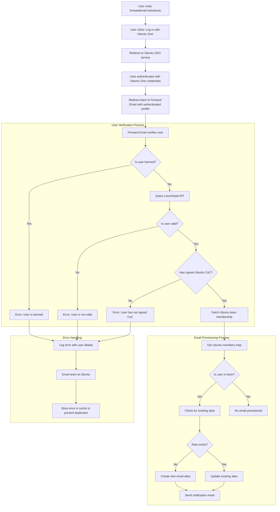

# Étude de Cas : Comment Canonical Alimente la Gestion des Emails Ubuntu avec la Solution Entreprise Open-Source de Forward Email {#case-study-how-canonical-powers-ubuntu-email-management-with-forward-emails-open-source-enterprise-solution}


## Table des Matières {#table-of-contents}

* [Avant-propos](#foreword)
* [Le Défi : Gérer un Écosystème Email Complexe](#the-challenge-managing-a-complex-email-ecosystem)
* [Points Clés](#key-takeaways)
* [Pourquoi Forward Email](#why-forward-email)
* [La Mise en Œuvre : Intégration SSO Transparente](#the-implementation-seamless-sso-integration)
  * [Visualisation du Flux d’Authentification](#authentication-flow-visualization)
  * [Détails Techniques de la Mise en Œuvre](#technical-implementation-details)
* [Configuration DNS et Routage des Emails](#dns-configuration-and-email-routing)
* [Résultats : Gestion des Emails Simplifiée et Sécurité Renforcée](#results-streamlined-email-management-and-enhanced-security)
  * [Efficacité Opérationnelle](#operational-efficiency)
  * [Sécurité et Confidentialité Renforcées](#enhanced-security-and-privacy)
  * [Économies](#cost-savings)
  * [Expérience Améliorée des Contributeurs](#improved-contributor-experience)
* [Perspectives : Collaboration Continue](#looking-forward-continued-collaboration)
* [Conclusion : Un Partenariat Open-Source Parfait](#conclusion-a-perfect-open-source-partnership)
* [Soutien aux Clients Entreprises](#supporting-enterprise-clients)
  * [Contactez-nous](#get-in-touch)
  * [À propos de Forward Email](#about-forward-email)


## Avant-propos {#foreword}

Dans le monde des logiciels open-source, peu de noms ont autant de poids que [Canonical](https://en.wikipedia.org/wiki/Canonical_\(company\)), la société derrière [Ubuntu](https://en.wikipedia.org/wiki/Ubuntu), l’une des distributions Linux les plus populaires au monde. Avec un vaste écosystème couvrant plusieurs distributions dont Ubuntu, [Kubuntu](https://en.wikipedia.org/wiki/Kubuntu), [Lubuntu](https://en.wikipedia.org/wiki/Lubuntu), [Edubuntu](https://en.wikipedia.org/wiki/Edubuntu), et d’autres, Canonical faisait face à des défis uniques pour gérer les adresses email à travers leurs nombreux domaines. Cette étude de cas explore comment Canonical s’est associé à Forward Email pour créer une solution de gestion d’emails d’entreprise fluide, sécurisée et axée sur la confidentialité, parfaitement alignée avec leurs valeurs open-source.


## Le Défi : Gérer un Écosystème Email Complexe {#the-challenge-managing-a-complex-email-ecosystem}

L’écosystème de Canonical est diversifié et étendu. Avec des millions d’utilisateurs dans le monde et des milliers de contributeurs sur divers projets, gérer les adresses email sur plusieurs domaines présentait des défis importants. Les contributeurs principaux avaient besoin d’adresses email officielles (@ubuntu.com, @kubuntu.org, etc.) reflétant leur implication dans le projet tout en maintenant la sécurité et la facilité d’utilisation via un système robuste de gestion des domaines Ubuntu.

Avant la mise en place de Forward Email, Canonical rencontrait des difficultés pour :

* Gérer les adresses email sur plusieurs domaines (@ubuntu.com, @kubuntu.org, @lubuntu.me, @edubuntu.org, et @ubuntu.net)
* Offrir une expérience email cohérente aux contributeurs principaux
* Intégrer les services email avec leur système d’authentification unique (SSO) [Ubuntu One](https://en.wikipedia.org/wiki/Ubuntu_One)
* Trouver une solution conforme à leur engagement en matière de confidentialité, sécurité et sécurité email open-source
* Faire évoluer leur infrastructure email sécurisée de manière rentable


## Points Clés {#key-takeaways}

* Canonical a réussi à mettre en œuvre une solution unifiée de gestion des emails sur plusieurs domaines Ubuntu
* L’approche 100 % open-source de Forward Email s’est parfaitement alignée avec les valeurs de Canonical
* L’intégration SSO avec Ubuntu One offre une authentification transparente pour les contributeurs
* Le chiffrement résistant à la cryptographie quantique garantit une sécurité à long terme pour toutes les communications email
* La solution évolue de manière rentable pour soutenir la base croissante de contributeurs de Canonical


## Pourquoi Forward Email {#why-forward-email}
En tant que seul fournisseur de service email 100 % open-source axé sur la confidentialité et la sécurité, Forward Email était un choix naturel pour les besoins de transfert d’emails d’entreprise de Canonical. Nos valeurs s’alignaient parfaitement avec l’engagement de Canonical envers les logiciels open-source et la confidentialité.

Les facteurs clés qui ont fait de Forward Email le choix idéal incluaient :

1. **Code source entièrement open-source** : Notre plateforme entière est open-source et disponible sur [GitHub](https://en.wikipedia.org/wiki/GitHub), permettant transparence et contributions de la communauté. Contrairement à de nombreux fournisseurs d’emails « axés sur la confidentialité » qui ne rendent open-source que leurs frontends tout en gardant leurs backends fermés, nous avons rendu disponible l’intégralité de notre code—frontend et backend—pour que chacun puisse l’inspecter sur [GitHub](https://github.com/forwardemail/forwardemail.net).

2. **Approche axée sur la confidentialité** : Contrairement à d’autres fournisseurs, nous ne stockons pas les emails dans des bases de données partagées, et nous utilisons un chiffrement robuste avec TLS. Notre philosophie fondamentale en matière de confidentialité est simple : **vos emails vous appartiennent et à vous seul**. Ce principe guide chaque décision technique que nous prenons, de la gestion du transfert d’emails à la mise en œuvre du chiffrement.

3. **Aucune dépendance à des tiers** : Nous n’utilisons pas Amazon SES ni d’autres services tiers, ce qui nous donne un contrôle total sur l’infrastructure email et élimine les fuites potentielles de confidentialité via des services tiers.

4. **Montée en charge économique** : Notre modèle tarifaire permet aux organisations de monter en charge sans payer par utilisateur, ce qui est idéal pour la large base de contributeurs de Canonical.

5. **Chiffrement résistant au quantique** : Nous utilisons des boîtes aux lettres SQLite chiffrées individuellement avec [ChaCha20-Poly1305](https://en.wikipedia.org/wiki/ChaCha20-Poly1305) comme chiffre pour le [chiffrement résistant au quantique](/blog/docs/best-quantum-safe-encrypted-email-service). Chaque boîte aux lettres est un fichier chiffré séparé, ce qui signifie que l’accès aux données d’un utilisateur ne donne pas accès à celles des autres.


## L’implémentation : Intégration SSO transparente {#the-implementation-seamless-sso-integration}

Un des aspects les plus critiques de l’implémentation était l’intégration avec le système SSO Ubuntu One existant de Canonical. Cette intégration permettrait aux contributeurs principaux de gérer leurs adresses email @ubuntu.com en utilisant leurs identifiants Ubuntu One existants.

### Visualisation du flux d’authentification {#authentication-flow-visualization}

Le diagramme suivant illustre le flux complet d’authentification et de provisionnement des emails :


```mermaid
flowchart TD
    A[User visits forwardemail.net/ubuntu] --> B[User clicks 'Log in with Ubuntu One']
    B --> C[Redirect to Ubuntu SSO service]
    C --> D[User authenticates with Ubuntu One credentials]
    D --> E[Redirect back to Forward Email with authenticated profile]
    E --> F[Forward Email verifies user]

    subgraph "User Verification Process"
        F --> G{Is user banned?}
        G -->|Yes| H[Error: User is banned]
        G -->|No| I[Query Launchpad API]
        I --> J{Is user valid?}
        J -->|No| K[Error: User is not valid]
        J -->|Yes| L{Has signed Ubuntu CoC?}
        L -->|No| M[Error: User has not signed CoC]
        L -->|Yes| N[Fetch Ubuntu team membership]
    end

    subgraph "Email Provisioning Process"
        N --> O[Get Ubuntu members map]
        O --> P{Is user in team?}
        P -->|Yes| Q[Check for existing alias]
        Q --> R{Alias exists?}
        R -->|No| S[Create new email alias]
        R -->|Yes| T[Update existing alias]
        S --> U[Send notification email]
        T --> U
        P -->|No| V[No email provisioned]
    end

    subgraph "Error Handling"
        H --> W[Log error with user details]
        K --> W
        M --> W
        W --> X[Email team at Ubuntu]
        X --> Y[Store error in cache to prevent duplicates]
    end
```

### Détails techniques de l’implémentation {#technical-implementation-details}

L’intégration entre Forward Email et Ubuntu One SSO a été réalisée via une implémentation personnalisée de la stratégie d’authentification passport-ubuntu. Cela a permis un flux d’authentification fluide entre Ubuntu One et les systèmes de Forward Email.
#### Le flux d'authentification {#the-authentication-flow}

Le processus d'authentification fonctionne comme suit :

1. Les utilisateurs visitent la page dédiée à la gestion des emails Ubuntu sur [forwardemail.net/ubuntu](https://forwardemail.net/ubuntu)
2. Ils cliquent sur "Se connecter avec Ubuntu One" et sont redirigés vers le service SSO d'Ubuntu
3. Après s'être authentifiés avec leurs identifiants Ubuntu One, ils sont redirigés vers Forward Email avec leur profil authentifié
4. Forward Email vérifie leur statut de contributeur et provisionne ou gère leur adresse email en conséquence

La mise en œuvre technique a utilisé le paquet [`passport-ubuntu`](https://www.npmjs.com/package/passport-ubuntu), qui est une stratégie [Passport](https://www.npmjs.com/package/passport) pour s'authentifier avec Ubuntu en utilisant [OpenID](https://en.wikipedia.org/wiki/OpenID). La configuration comprenait :

```javascript
passport.use(new UbuntuStrategy({
  returnURL: process.env.UBUNTU_CALLBACK_URL,
  realm: process.env.UBUNTU_REALM,
  stateless: true
}, function(identifier, profile, done) {
  // Logique de vérification de l'utilisateur et de provisionnement de l'email
}));
```

#### Intégration et validation de l'API Launchpad {#launchpad-api-integration-and-validation}

Un composant critique de notre mise en œuvre est l'intégration avec l'API de [Launchpad](https://en.wikipedia.org/wiki/Launchpad_\(website\)) pour valider les utilisateurs Ubuntu et leurs appartenances aux équipes. Nous avons créé des fonctions utilitaires réutilisables pour gérer cette intégration de manière efficace et fiable.

La fonction utilitaire `sync-ubuntu-user.js` est responsable de la validation des utilisateurs via l'API Launchpad et de la gestion de leurs adresses email. Voici une version simplifiée de son fonctionnement :

```javascript
async function syncUbuntuUser(user, map) {
  try {
    // Valider l'objet utilisateur
    if (!_.isObject(user) ||
        !isSANB(user[fields.ubuntuUsername]) ||
        !isSANB(user[fields.ubuntuProfileID]) ||
        !isEmail(user.email))
      throw new TypeError('Objet utilisateur invalide');

    // Obtenir la map des membres Ubuntu si non fournie
    if (!(map instanceof Map))
      map = await getUbuntuMembersMap(resolver);

    // Vérifier si l'utilisateur est banni
    if (user[config.userFields.isBanned]) {
      throw new InvalidUbuntuUserError('Utilisateur banni', { ignoreHook: true });
    }

    // Interroger l'API Launchpad pour valider l'utilisateur
    const url = `https://api.launchpad.net/1.0/~${user[fields.ubuntuUsername]}`;
    const response = await retryRequest(url, { resolver });
    const json = await response.body.json();

    // Valider les propriétés booléennes requises
    if (!json.is_valid)
      throw new InvalidUbuntuUserError('La propriété "is_valid" était fausse');

    if (!json.is_ubuntu_coc_signer)
      throw new InvalidUbuntuUserError('La propriété "is_ubuntu_coc_signer" était fausse');

    // Traiter chaque domaine pour l'utilisateur
    await pMap([...map.keys()], async (name) => {
      // Trouver le domaine dans la base de données
      const domain = await Domains.findOne({
        name,
        plan: 'team',
        has_txt_record: true
      }).populate('members.user');

      // Traiter l'alias email de l'utilisateur pour ce domaine
      if (map.get(name).has(user[fields.ubuntuUsername])) {
        // L'utilisateur est membre de cette équipe, créer ou mettre à jour l'alias
        let alias = await Aliases.findOne({
          user: user._id,
          domain: domain._id,
          name: user[fields.ubuntuUsername].toLowerCase()
        });

        if (!alias) {
          // Créer un nouvel alias avec gestion appropriée des erreurs
          alias = await Aliases.create({
            user: user._id,
            domain: domain._id,
            name: user[fields.ubuntuUsername].toLowerCase(),
            recipients: [user.email],
            locale: user[config.lastLocaleField],
            is_enabled: true
          });

          // Notifier les administrateurs de la création du nouvel alias
          await emailHelper({
            template: 'alert',
            message: {
              to: adminEmailsForDomain,
              subject: `Nouvelle adresse email @${domain.name} créée`
            },
            locals: {
              message: `Une nouvelle adresse email ${user[fields.ubuntuUsername].toLowerCase()}@${domain.name} a été créée pour ${user.email}`
            }
          });
        }
      }
    });

    return true;
  } catch (err) {
    // Gérer et enregistrer les erreurs
    await logErrorWithUser(err, user);
    throw err;
  }
}
```
Pour simplifier la gestion des adhésions aux équipes à travers différents domaines Ubuntu, nous avons créé une correspondance simple entre les noms de domaine et leurs équipes Launchpad correspondantes :

```javascript
ubuntuTeamMapping: {
  'ubuntu.com': '~ubuntumembers',
  'kubuntu.org': '~kubuntu-members',
  'lubuntu.me': '~lubuntu-members',
  'edubuntu.org': '~edubuntu-members',
  'ubuntustudio.com': '~ubuntustudio-core',
  'ubuntu.net': '~ubuntu-smtp-test'
},
```

Cette correspondance simple nous permet d'automatiser le processus de vérification des adhésions aux équipes et de provisionnement des adresses email, rendant le système facile à maintenir et à étendre à mesure que de nouveaux domaines sont ajoutés.

#### Gestion des erreurs et notifications {#error-handling-and-notifications}

Nous avons mis en place un système robuste de gestion des erreurs qui :

1. Enregistre toutes les erreurs avec des informations détaillées sur l'utilisateur
2. Envoie un email à l'équipe Ubuntu lorsque des problèmes sont détectés
3. Notifie les administrateurs lorsque de nouveaux contributeurs s'inscrivent et que des adresses email sont créées
4. Gère les cas particuliers tels que les utilisateurs n'ayant pas signé le Code de Conduite Ubuntu

Cela garantit que tout problème est rapidement identifié et traité, maintenant l'intégrité du système de messagerie.


## Configuration DNS et routage des emails {#dns-configuration-and-email-routing}

Pour chaque domaine géré via Forward Email, Canonical a ajouté un simple enregistrement DNS TXT pour la validation :

```sh
❯ dig ubuntu.com txt
ubuntu.com.             600     IN      TXT     "forward-email-site-verification=6IsURgl2t7"
```

Cet enregistrement de vérification confirme la propriété du domaine et permet à notre système de gérer de manière sécurisée les emails pour ces domaines. Canonical fait transiter le courrier via notre service grâce à Postfix, qui fournit une infrastructure de livraison d'emails fiable et sécurisée.


## Résultats : Gestion simplifiée des emails et sécurité renforcée {#results-streamlined-email-management-and-enhanced-security}

La mise en œuvre de la solution entreprise de Forward Email a apporté des bénéfices significatifs pour la gestion des emails de Canonical sur tous leurs domaines :

### Efficacité opérationnelle {#operational-efficiency}

* **Gestion centralisée** : Tous les domaines liés à Ubuntu sont désormais gérés via une interface unique
* **Réduction de la charge administrative** : Provisionnement automatisé et gestion en libre-service pour les contributeurs
* **Intégration simplifiée** : Les nouveaux contributeurs peuvent rapidement obtenir leurs adresses email officielles

### Sécurité et confidentialité renforcées {#enhanced-security-and-privacy}

* **Chiffrement de bout en bout** : Tous les emails sont chiffrés selon des standards avancés
* **Pas de bases de données partagées** : Les emails de chaque utilisateur sont stockés dans des bases SQLite chiffrées individuelles, offrant une approche de chiffrement isolée fondamentalement plus sécurisée que les bases relationnelles partagées traditionnelles
* **Sécurité open-source** : Le code transparent permet des revues de sécurité communautaires
* **Traitement en mémoire** : Nous ne stockons pas les emails transférés sur disque, renforçant la protection de la vie privée
* **Pas de stockage de métadonnées** : Nous ne conservons pas de traces de qui envoie des emails à qui, contrairement à de nombreux fournisseurs de messagerie

### Économies {#cost-savings}

* **Modèle tarifaire évolutif** : Pas de frais par utilisateur, permettant à Canonical d'ajouter des contributeurs sans augmenter les coûts
* **Réduction des besoins en infrastructure** : Pas besoin de maintenir des serveurs email séparés pour différents domaines
* **Moins de support nécessaire** : La gestion en libre-service réduit les tickets de support informatique

### Expérience améliorée pour les contributeurs {#improved-contributor-experience}

* **Authentification fluide** : Connexion unique avec les identifiants Ubuntu One existants
* **Image de marque cohérente** : Expérience unifiée sur tous les services liés à Ubuntu
* **Livraison fiable des emails** : Réputation IP de haute qualité garantissant la bonne réception des emails

L’intégration avec Forward Email a considérablement simplifié le processus de gestion des emails chez Canonical. Les contributeurs bénéficient désormais d’une expérience fluide pour gérer leurs adresses @ubuntu.com, avec une charge administrative réduite et une sécurité renforcée.


## Perspectives : Collaboration continue {#looking-forward-continued-collaboration}

Le partenariat entre Canonical et Forward Email continue d’évoluer. Nous travaillons ensemble sur plusieurs initiatives :
* Extension des services de messagerie à des domaines supplémentaires liés à Ubuntu
* Amélioration de l'interface utilisateur basée sur les retours des contributeurs
* Mise en œuvre de fonctionnalités de sécurité supplémentaires
* Exploration de nouvelles façons de tirer parti de notre collaboration open-source


## Conclusion : Un partenariat open-source parfait {#conclusion-a-perfect-open-source-partnership}

La collaboration entre Canonical et Forward Email démontre la puissance des partenariats fondés sur des valeurs partagées. En choisissant Forward Email comme fournisseur de services de messagerie, Canonical a trouvé une solution qui non seulement répondait à leurs exigences techniques, mais s'alignait également parfaitement avec leur engagement envers les logiciels open-source, la confidentialité et la sécurité.

Pour les organisations gérant plusieurs domaines et nécessitant une authentification transparente avec les systèmes existants, Forward Email offre une solution flexible, sécurisée et axée sur la confidentialité. Notre [approche open-source](https://forwardemail.net/blog/docs/why-open-source-email-security-privacy) garantit la transparence et permet les contributions de la communauté, ce qui en fait un choix idéal pour les organisations qui valorisent ces principes.

Alors que Canonical et Forward Email continuent d'innover dans leurs domaines respectifs, ce partenariat témoigne de la puissance de la collaboration open-source et des valeurs partagées dans la création de solutions efficaces.

Vous pouvez consulter notre [statut de service en temps réel](https://status.forwardemail.net) pour voir notre performance actuelle de livraison des emails, que nous surveillons en continu afin d'assurer une réputation IP de haute qualité et une bonne délivrabilité des emails.


## Soutien aux clients d'entreprise {#supporting-enterprise-clients}

Bien que cette étude de cas se concentre sur notre partenariat avec Canonical, Forward Email soutient fièrement de nombreux clients d'entreprise dans divers secteurs qui apprécient notre engagement envers la confidentialité, la sécurité et les principes open-source.

Nos solutions d'entreprise sont adaptées pour répondre aux besoins spécifiques des organisations de toutes tailles, offrant :

* Gestion d'[email](/) de domaine personnalisé sur plusieurs domaines
* Intégration transparente avec les systèmes d'authentification existants
* Canal de support dédié via chat Matrix
* Fonctionnalités de sécurité renforcées incluant le [chiffrement résistant au quantique](/blog/docs/best-quantum-safe-encrypted-email-service)
* Portabilité et propriété complètes des données
* Infrastructure 100 % open-source pour la transparence et la confiance

### Contactez-nous {#get-in-touch}

Si votre organisation a des besoins en messagerie d'entreprise ou si vous souhaitez en savoir plus sur la manière dont Forward Email peut aider à simplifier la gestion de vos emails tout en améliorant la confidentialité et la sécurité, nous serions ravis de vous entendre :

* Envoyez-nous un email directement à `support@forwardemail.net`
* Soumettez une demande d'aide sur notre [page d'aide](https://forwardemail.net/help)
* Consultez notre [page de tarification](https://forwardemail.net/pricing) pour les plans entreprise

Notre équipe est prête à discuter de vos besoins spécifiques et à développer une solution personnalisée qui s'aligne avec les valeurs et les besoins techniques de votre organisation.

### À propos de Forward Email {#about-forward-email}

Forward Email est un service de messagerie 100 % open-source et axé sur la confidentialité. Nous fournissons le transfert d'email de domaine personnalisé, SMTP, IMAP et POP3 avec un accent sur la sécurité, la confidentialité et la transparence. L'intégralité de notre code est disponible sur [GitHub](https://github.com/forwardemail/forwardemail.net), et nous nous engageons à fournir des services de messagerie qui respectent la confidentialité et la sécurité des utilisateurs. En savoir plus sur [pourquoi l'email open-source est l'avenir](https://forwardemail.net/blog/docs/why-open-source-email-security-privacy), [comment fonctionne notre transfert d'email](https://forwardemail.net/blog/docs/best-email-forwarding-service), et [notre approche de la protection de la confidentialité des emails](https://forwardemail.net/blog/docs/email-privacy-protection-technical-implementation).
