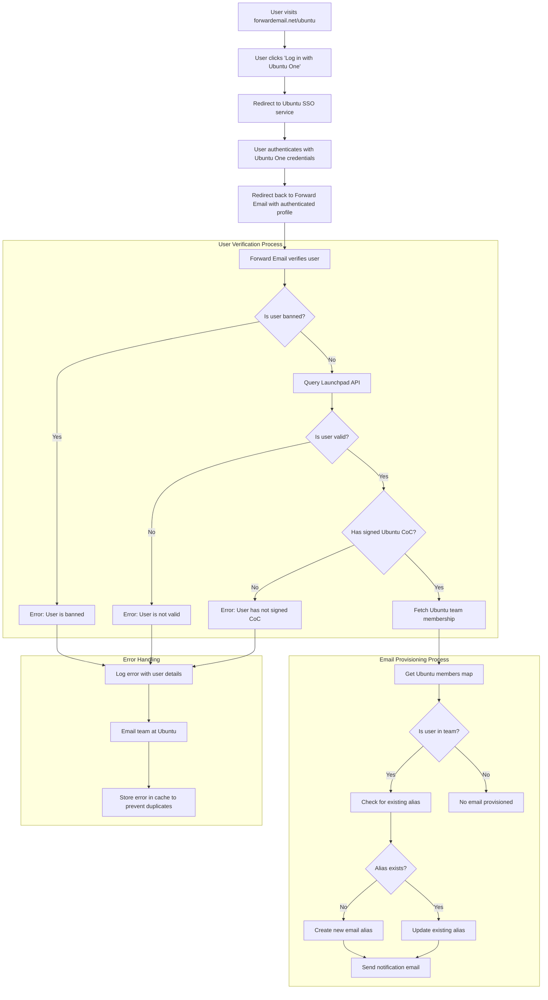

# מקרה בוחן: כיצד קנוניקל מעצימה את ניהול הדוא"ל של אובונטו עם פתרון קוד פתוח לארגונים של דוא"ל מורחב {#case-study-how-canonical-powers-ubuntu-email-management-with-forward-emails-open-source-enterprise-solution}


## תוכן עניינים

* [הַקדָמָה](#foreword)
* [האתגר: ניהול מערכת אקולוגית מורכבת של דוא"ל](#the-challenge-managing-a-complex-email-ecosystem)
* [נקודות מפתח](#key-takeaways)
* [למה להעביר אימייל](#why-forward-email)
* [היישום: שילוב חלק של SSO](#the-implementation-seamless-sso-integration)
  * [ויזואליזציה של זרימת אימות](#authentication-flow-visualization)
  * [פרטי יישום טכניים](#technical-implementation-details)
* [תצורת DNS וניתוב דוא"ל](#dns-configuration-and-email-routing)
* [תוצאות: ניהול דוא"ל יעיל ואבטחה משופרת](#results-streamlined-email-management-and-enhanced-security)
  * [יעילות תפעולית](#operational-efficiency)
  * [אבטחה ופרטיות משופרות](#enhanced-security-and-privacy)
  * [חיסכון בעלויות](#cost-savings)
  * [חוויית תורם משופרת](#improved-contributor-experience)
* [מצפה: שיתוף פעולה מתמשך](#looking-forward-continued-collaboration)
* [סיכום: שותפות מושלמת בקוד פתוח](#conclusion-a-perfect-open-source-partnership)
* [תמיכה בלקוחות ארגוניים](#supporting-enterprise-clients)
  * [לְהִתְקַשֵׁר](#get-in-touch)
  * [אודות העברת דוא"ל](#about-forward-email)

## הקדמה {#foreword}

בעולם תוכנות הקוד הפתוח, מעט שמות נושאים משקל רב כמו [קנוני](https://en.wikipedia.org/wiki/Canonical_\(company\)), החברה שמאחורי [אובונטו](https://en.wikipedia.org/wiki/Ubuntu), אחת מהפצות לינוקס הפופולריות ביותר בעולם. עם מערכת אקולוגית עצומה המשתרעת על פני הפצות מרובות, כולל Ubuntu, [לְשַׁחְרֵר](https://en.wikipedia.org/wiki/Kubuntu), [לובונטו](https://en.wikipedia.org/wiki/Lubuntu), [אדובונטו](https://en.wikipedia.org/wiki/Edubuntu) ואחרות, קנוניקל התמודדה עם אתגרים ייחודיים בניהול כתובות דוא"ל על פני הדומיינים הרבים שלה. מקרה בוחן כיצד קנוניקל שיתפה פעולה עם Forward Email כדי ליצור פתרון ניהול דוא"ל ארגוני חלק, מאובטח וממוקד פרטיות, שתואם בצורה מושלמת את ערכי הקוד הפתוח שלהם.

## האתגר: ניהול מערכת אקולוגית מורכבת של דוא"ל {#the-challenge-managing-a-complex-email-ecosystem}

המערכת האקולוגית של קנוניקל מגוונת ורחבה. עם מיליוני משתמשים ברחבי העולם ואלפי תורמים בפרויקטים שונים, ניהול כתובות דוא"ל על פני דומיינים מרובים הציב אתגרים משמעותיים. תורמים מרכזיים היו זקוקים לכתובות דוא"ל רשמיות (@ubuntu.com, @kubuntu.org וכו') שישקפו את מעורבותם בפרויקט תוך שמירה על אבטחה וקלות שימוש באמצעות מערכת ניהול דומיינים חזקה של אובונטו.

לפני הטמעת Forward Email, קנוניקל התקשתה עם:

* ניהול כתובות דוא"ל על פני מספר דומיינים (@ubuntu.com, @kubuntu.org, @lubuntu.me, @edubuntu.org, ו-@ubuntu.net)
* מתן חוויית דוא"ל עקבית לתורמים מרכזיים
* שילוב שירותי דוא"ל עם מערכת הכניסה היחידה (SSO) הקיימת שלהם [אובונטו וואן](https://en.wikipedia.org/wiki/Ubuntu_One)
* מציאת פתרון התואם את מחויבותם לפרטיות, אבטחה ואבטחת דוא"ל בקוד פתוח
* הרחבת תשתית הדוא"ל המאובטחת שלהם בצורה חסכונית

## נקודות מפתח {#key-takeaways}

* קנוניקל יישמה בהצלחה פתרון ניהול דוא"ל מאוחד על פני מספר דומיינים של אובונטו
* גישת קוד פתוח של 100% של Forward Email תואמת באופן מושלם את ערכי קנוניקל
* שילוב SSO עם Ubuntu One מספק אימות חלק לתורמים
* הצפנה עמידה בפני קוונטום מבטיחה אבטחה ארוכת טווח לכל תקשורת הדוא"ל
* הפתרון ניתן להרחבה חסכונית כדי לתמוך בבסיס התורמים הגדל של קנוניקל

## למה להעביר אימייל {#why-forward-email}

כספקית שירותי הדוא"ל היחידה בקוד פתוח לחלוטין, עם דגש על פרטיות ואבטחה, Forward Email התאים באופן טבעי לצורכי העברת הדוא"ל הארגוניים של Canonical. הערכים שלנו תאמו באופן מושלם את מחויבותה של Canonical לתוכנה בקוד פתוח ופרטיות.

גורמים מרכזיים שהפכו את Forward Email לבחירה האידיאלית כללו:

1. **בסיס קוד פתוח מלא**: כל הפלטפורמה שלנו היא בקוד פתוח וזמינה ב-[גיטהאב](https://en.wikipedia.org/wiki/GitHub), מה שמאפשר שקיפות ותרומה לקהילה. בניגוד לספקי דוא"ל רבים "הממוקדים בפרטיות" שמפתחים קוד פתוח רק לחזיתות שלהם תוך שמירה על גבולות סגורים, הפכנו את כל בסיס הקוד שלנו - הן לחזית והן לחזית - לזמין לכל אחד לעיון ב-[גיטהאב](https://github.com/forwardemail/forwardemail.net).

2. **גישה ממוקדת פרטיות**: בניגוד לספקים אחרים, איננו מאחסנים אימיילים בבסיסי נתונים משותפים, ואנו משתמשים בהצפנה חזקה עם TLS. פילוסופיית הפרטיות הבסיסית שלנו היא פשוטה: **האימיילים שלך שייכים לך ורק לך**. עיקרון זה מנחה כל החלטה טכנית שאנו מקבלים, החל מאופן הטיפול בהעברת אימיילים ועד לאופן שבו אנו מיישמים הצפנה.

3. **אין תלות בשירותי צד שלישי**: איננו משתמשים ב-Amazon SES או בשירותי צד שלישי אחרים, מה שנותן לנו שליטה מלאה על תשתית הדוא"ל ומבטל דליפות פרטיות אפשריות באמצעות שירותי צד שלישי.

4. **הרחבה חסכונית**: מודל התמחור שלנו מאפשר לארגונים להרחיב את הפרויקט מבלי לשלם לפי משתמש, מה שהופך אותו לאידיאלי עבור בסיס התורמים הגדול של Canonical.

5. **הצפנה עמידה בפני קוונטים**: אנו משתמשים בתיבות דואר SQLite מוצפנות בנפרד עם [צ'אצ'ה20-פולי1305](https://en.wikipedia.org/wiki/ChaCha20-Poly1305) כצופן עבור [הצפנה עמידה קוונטית](/blog/docs/best-quantum-safe-encrypted-email-service). כל תיבת דואר היא קובץ מוצפן נפרד, כלומר גישה לנתונים של משתמש אחד אינה מעניקה גישה לאחרים.

## היישום: שילוב חלק של SSO {#the-implementation-seamless-sso-integration}

אחד ההיבטים הקריטיים ביותר של היישום היה שילוב עם מערכת ה-SSO הקיימת של Canonical, Ubuntu One. שילוב זה יאפשר לתורמים מרכזיים לנהל את כתובות הדוא"ל שלהם ב-@ubuntu.com באמצעות אישורי Ubuntu One הקיימים שלהם.

### ויזואליזציה של זרימת אימות {#authentication-flow-visualization}

התרשים הבא ממחיש את תהליך האימות וההקצאה המלא של דוא"ל:



### פרטי יישום טכניים {#technical-implementation-details}

האינטגרציה בין Forward Email לבין Ubuntu One SSO הושלמה באמצעות יישום מותאם אישית של אסטרטגיית האימות passport-ubuntu. זה אפשר זרימת אימות חלקה בין מערכות Ubuntu One ו-Forward Email.

#### זרימת האימות {#the-authentication-flow}

תהליך האימות פועל באופן הבא:

1. משתמשים מבקרים בדף ניהול הדוא"ל הייעודי של Ubuntu בכתובת [forwardemail.net/ubuntu](https://forwardemail.net/ubuntu)
2. הם לוחצים על "התחבר עם Ubuntu One" ומופנים לשירות SSO של Ubuntu
3. לאחר האימות עם אישורי Ubuntu One שלהם, הם מנותבים חזרה ל"העברת דוא"ל" עם הפרופיל המאומת שלהם
4. "העברת דוא"ל" מאמתת את סטטוס התורם שלהם ומספקת או מנהלת את כתובת הדוא"ל שלהם בהתאם.

היישום הטכני מינף את חבילת [`passport-ubuntu`](https://www.npmjs.com/package/passport-ubuntu), שהיא אסטרטגיית [דַרכּוֹן](https://www.npmjs.com/package/passport) לאימות עם אובונטו באמצעות [OpenID](https://en.wikipedia.org/wiki/OpenID). התצורה כללה:

```javascript
passport.use(new UbuntuStrategy({
  returnURL: process.env.UBUNTU_CALLBACK_URL,
  realm: process.env.UBUNTU_REALM,
  stateless: true
}, function(identifier, profile, done) {
  // User verification and email provisioning logic
}));
```

#### שילוב ואימות של Launchpad API {#launchpad-api-integration-and-validation}

מרכיב קריטי ביישום שלנו הוא האינטגרציה עם ה-API של [לאנצ'פד](https://en.wikipedia.org/wiki/Launchpad_\(website\)) כדי לאמת משתמשי אובונטו וחברי הצוות שלהם. יצרנו פונקציות עזר רב פעמיות כדי לטפל באינטגרציה זו ביעילות ובאמינות.

פונקציית העזר `sync-ubuntu-user.js` אחראית על אימות משתמשים דרך ממשק ה-API של Launchpad ועל ניהול כתובות הדוא"ל שלהם. הנה גרסה פשוטה של אופן פעולתה:

```javascript
async function syncUbuntuUser(user, map) {
  try {
    // Validate user object
    if (!_.isObject(user) ||
        !isSANB(user[fields.ubuntuUsername]) ||
        !isSANB(user[fields.ubuntuProfileID]) ||
        !isEmail(user.email))
      throw new TypeError('Invalid user object');

    // Get Ubuntu members map if not provided
    if (!(map instanceof Map))
      map = await getUbuntuMembersMap(resolver);

    // Check if user is banned
    if (user[config.userFields.isBanned]) {
      throw new InvalidUbuntuUserError('User was banned', { ignoreHook: true });
    }

    // Query Launchpad API to validate user
    const url = `https://api.launchpad.net/1.0/~${user[fields.ubuntuUsername]}`;
    const response = await retryRequest(url, { resolver });
    const json = await response.body.json();

    // Validate required boolean properties
    if (!json.is_valid)
      throw new InvalidUbuntuUserError('Property "is_valid" was false');

    if (!json.is_ubuntu_coc_signer)
      throw new InvalidUbuntuUserError('Property "is_ubuntu_coc_signer" was false');

    // Process each domain for the user
    await pMap([...map.keys()], async (name) => {
      // Find domain in database
      const domain = await Domains.findOne({
        name,
        plan: 'team',
        has_txt_record: true
      }).populate('members.user');

      // Process user's email alias for this domain
      if (map.get(name).has(user[fields.ubuntuUsername])) {
        // User is a member of this team, create or update alias
        let alias = await Aliases.findOne({
          user: user._id,
          domain: domain._id,
          name: user[fields.ubuntuUsername].toLowerCase()
        });

        if (!alias) {
          // Create new alias with appropriate error handling
          alias = await Aliases.create({
            user: user._id,
            domain: domain._id,
            name: user[fields.ubuntuUsername].toLowerCase(),
            recipients: [user.email],
            locale: user[config.lastLocaleField],
            is_enabled: true
          });

          // Notify admins about new alias creation
          await emailHelper({
            template: 'alert',
            message: {
              to: adminEmailsForDomain,
              subject: `New @${domain.name} email address created`
            },
            locals: {
              message: `A new email address ${user[fields.ubuntuUsername].toLowerCase()}@${domain.name} was created for ${user.email}`
            }
          });
        }
      }
    });

    return true;
  } catch (err) {
    // Handle and log errors
    await logErrorWithUser(err, user);
    throw err;
  }
}
```

כדי לפשט את ניהול חברי הצוותים בדומיינים שונים של אובונטו, יצרנו מיפוי פשוט בין שמות דומיינים לצוותי Launchpad התואמים להם:

```javascript
ubuntuTeamMapping: {
  'ubuntu.com': '~ubuntumembers',
  'kubuntu.org': '~kubuntu-members',
  'lubuntu.me': '~lubuntu-members',
  'edubuntu.org': '~edubuntu-members',
  'ubuntustudio.com': '~ubuntustudio-core',
  'ubuntu.net': '~ubuntu-smtp-test'
},
```

מיפוי פשוט זה מאפשר לנו להפוך את תהליך בדיקת חברי הצוות וקביעת כתובות הדוא"ל לאוטומטי, מה שהופך את המערכת לקלה לתחזוקה ולהרחבה ככל שנוספים דומיינים חדשים.

#### טיפול בשגיאות והודעות {#error-handling-and-notifications}

יישמנו מערכת חזקה לטיפול בשגיאות אשר:

1. רושם את כל השגיאות עם מידע מפורט על המשתמש
2. שולח דוא"ל לצוות אובונטו כאשר מתגלות בעיות
3. מודיע למנהלים כאשר תורמים חדשים נרשמים ונוצרות להם כתובות דוא"ל
4. מטפל במקרים של בעיות קצה כגון משתמשים שלא חתמו על קוד ההתנהגות של אובונטו

זה מבטיח שכל בעיה תזוהה ותטופל במהירות, תוך שמירה על שלמות מערכת הדוא"ל.

## הגדרת DNS וניתוב דוא"ל {#dns-configuration-and-email-routing}

עבור כל דומיין המנוהל באמצעות Forward Email, קנוניקל הוסיפה רשומת DNS TXT פשוטה לצורך אימות:

```sh
❯ dig ubuntu.com txt
ubuntu.com.             600     IN      TXT     "forward-email-site-verification=6IsURgl2t7"
```

רשומת אימות זו מאשרת בעלות על הדומיין ומאפשרת למערכת שלנו לנהל דוא"ל בצורה מאובטחת עבור דומיינים אלה. קנוניקל מנתבת דוא"ל דרך השירות שלנו באמצעות Postfix, המספק תשתית אמינה ומאובטחת למשלוח דוא"ל.

תוצאות ##: ניהול דוא"ל יעיל ואבטחה משופרת {#results-streamlined-email-management-and-enhanced-security}

הטמעת פתרון הארגון של Forward Email סיפקה יתרונות משמעותיים לניהול הדוא"ל של Canonical בכל התחומים שלה:

### יעילות תפעולית

* **ניהול מרכזי**: כל הדומיינים הקשורים לאובונטו מנוהלים כעת דרך ממשק יחיד
* **הוצאות ניהול מופחתות**: ניהול אוטומטי של הקצאה ושירות עצמי עבור תורמים
* **קליטה פשוטה יותר**: תורמים חדשים יכולים לקבל במהירות את כתובות הדוא"ל הרשמיות שלהם

### אבטחה ופרטיות משופרות {#enhanced-security-and-privacy}

* **הצפנה מקצה לקצה**: כל האימיילים מוצפנים באמצעות סטנדרטים מתקדמים
* **ללא מסדי נתונים משותפים**: האימיילים של כל משתמש מאוחסנים במסדי נתונים מוצפנים של SQLite, המספקים גישת הצפנה מבוססת ארגז חול (sandbox) שהיא מאובטחת באופן מהותי יותר ממסדי נתונים יחסיים משותפים מסורתיים
* **אבטחה בקוד פתוח**: בסיס הקוד השקוף מאפשר סקירות אבטחה קהילתיות
* **עיבוד בזיכרון**: איננו מאחסנים אימיילים שהועברו לדיסק, מה שמשפר את הגנת הפרטיות
* **ללא אחסון מטא-נתונים**: איננו שומרים תיעוד של מי שולח אימייל למי, בניגוד לספקי אימייל רבים

### חיסכון בעלויות {#cost-savings}

* **מודל תמחור ניתן להרחבה**: ללא עמלות לפי משתמש, מה שמאפשר ל-Canonical להוסיף תורמים מבלי להגדיל את העלויות
* **צרכי תשתית מופחתים**: אין צורך לתחזק שרתי דוא"ל נפרדים עבור דומיינים שונים
* **דרישות תמיכה נמוכות יותר**: ניהול שירות עצמי מפחית פניות תמיכה ב-IT

### חוויית תורמים משופרת {#improved-contributor-experience}

* **אימות חלק**: כניסה יחידה עם אישורי Ubuntu One קיימים
* **מיתוג עקבי**: חוויה מאוחדת בכל השירותים הקשורים לאובונטו
* **משלוח דוא"ל אמין**: מוניטין IP איכותי מבטיח שדוא"ל יגיע ליעדו

האינטגרציה עם Forward Email ייעלה משמעותית את תהליך ניהול הדוא"ל של Canonical. כעת תורמים נהנים מחוויה חלקה בניהול כתובות הדוא"ל שלהם ב-@ubuntu.com, עם הפחתת הוצאות ניהול ואבטחה משופרת.

## מצפה להמשך: שיתוף פעולה מתמשך {#looking-forward-continued-collaboration}

השותפות בין Canonical ו-Forward Email ממשיכה להתפתח. אנו עובדים יחד על מספר יוזמות:

* הרחבת שירותי הדוא"ל לדומיינים נוספים הקשורים לאובונטו
* שיפור ממשק המשתמש בהתבסס על משוב מהתורמים
* הטמעת תכונות אבטחה נוספות
* בחינת דרכים חדשות למנף את שיתוף הפעולה שלנו בקוד פתוח

## סיכום: שותפות מושלמת בקוד פתוח {#conclusion-a-perfect-open-source-partnership}

שיתוף הפעולה בין Canonical ו-Forward Email מדגים את כוחן של שותפויות הבנויות על ערכים משותפים. על ידי בחירת Forward Email כספק שירותי הדוא"ל שלהם, Canonical מצאה פתרון שלא רק עמד בדרישות הטכניות שלהם, אלא גם התאים בצורה מושלמת למחויבות שלהם לתוכנה בקוד פתוח, פרטיות ואבטחה.

עבור ארגונים המנהלים מספר דומיינים ודורשים אימות חלק עם מערכות קיימות, Forward Email מציע פתרון גמיש, מאובטח וממוקד פרטיות. [גישת קוד פתוח](https://forwardemail.net/blog/docs/why-open-source-email-security-privacy) שלנו מבטיח שקיפות ומאפשר תרומות לקהילה, מה שהופך אותו לבחירה אידיאלית עבור ארגונים המעריכים עקרונות אלה.

בעוד ש-Canonical ו-Forward Email ממשיכים לחדש בתחומם, שותפות זו מהווה עדות לכוחו של שיתוף פעולה בקוד פתוח וערכים משותפים ביצירת פתרונות יעילים.

באפשרותך לבדוק את ה-[סטטוס שירות בזמן אמת](https://status.forwardemail.net) שלנו כדי לראות את ביצועי מסירת הדוא"ל הנוכחיים שלנו, שאותם אנו עוקבים באופן רציף כדי להבטיח מוניטין IP איכותי ומסירת דוא"ל.

## תמיכה בלקוחות ארגוניים {#supporting-enterprise-clients}

בעוד שמקרה זה מתמקד בשותפות שלנו עם Canonical, Forward Email גאה לתמוך בלקוחות ארגוניים רבים במגוון תעשיות, אשר מעריכים את מחויבותנו לפרטיות, אבטחה ועקרונות קוד פתוח.

פתרונות הארגון שלנו מותאמים לצרכים הספציפיים של ארגונים מכל הגדלים, ומציעים:

* דומיין מותאם אישית [ניהול דוא"ל](/) על פני מספר דומיינים
* שילוב חלק עם מערכות אימות קיימות
* ערוץ תמיכה ייעודי בצ'אט של Matrix
* תכונות אבטחה משופרות כולל [הצפנה עמידה קוונטית](/blog/docs/best-quantum-safe-encrypted-email-service)
* ניידות נתונים ובעלות מלאה
* תשתית קוד פתוח 100% לשקיפות ואמון

### צור קשר {#get-in-touch}

אם לארגון שלכם יש צרכים בתחום הדוא"ל הארגוני או שאתם מעוניינים ללמוד עוד על האופן שבו Forward Email יכול לעזור לכם לייעל את ניהול הדוא"ל שלכם תוך שיפור הפרטיות והאבטחה, נשמח לשמוע מכם:

* שלחו לנו דוא"ל ישירות לכתובת `support@forwardemail.net`
* שלחו בקשת עזרה לכתובת [דף עזרה](https://forwardemail.net/help)
* בדקו את [דף התמחור](https://forwardemail.net/pricing) לקבלת תוכניות ארגוניות

הצוות שלנו מוכן לדון בדרישות הספציפיות שלכם ולפתח פתרון מותאם אישית שתואם את ערכי הארגון והצרכים הטכניים שלו.

### אודות העברת דוא"ל {#about-forward-email}

Forward Email הוא שירות דוא"ל בקוד פתוח לחלוטין המתמקד בפרטיות. אנו מספקים שירותי העברת דוא"ל בדומיין מותאם אישית, SMTP, IMAP ו-POP3 תוך התמקדות באבטחה, פרטיות ושקיפות. בסיס הקוד המלא שלנו זמין ב-[גיטהאב](https://github.com/forwardemail/forwardemail.net), ואנו מחויבים לספק שירותי דוא"ל המכבדים את פרטיות ואבטחת המשתמש. למידע נוסף על [למה דוא"ל בקוד פתוח הוא העתיד](https://forwardemail.net/blog/docs/why-open-source-email-security-privacy), [איך העברת הדוא"ל שלנו עובדת](https://forwardemail.net/blog/docs/best-email-forwarding-service) ו-[הגישה שלנו להגנה על פרטיות הדוא"ל](https://forwardemail.net/blog/docs/email-privacy-protection-technical-implementation).