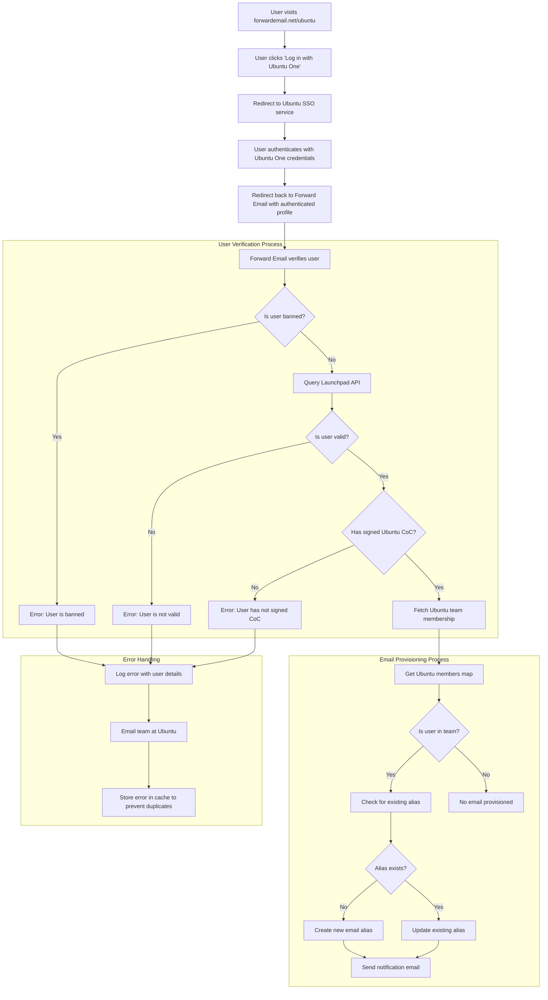

# מקרה בוחן: כיצד Canonical מחזקת את ניהול האימייל של Ubuntu עם פתרון הארגוני בקוד פתוח של Forward Email {#case-study-how-canonical-powers-ubuntu-email-management-with-forward-emails-open-source-enterprise-solution}


## תוכן העניינים {#table-of-contents}

* [הקדמה](#foreword)
* [האתגר: ניהול מערכת אימייל מורכבת](#the-challenge-managing-a-complex-email-ecosystem)
* [מסקנות מרכזיות](#key-takeaways)
* [למה Forward Email](#why-forward-email)
* [היישום: אינטגרציה חלקה של SSO](#the-implementation-seamless-sso-integration)
  * [הדמיית זרימת האימות](#authentication-flow-visualization)
  * [פרטי היישום הטכניים](#technical-implementation-details)
* [הגדרת DNS וניתוב אימיילים](#dns-configuration-and-email-routing)
* [תוצאות: ניהול אימייל יעיל ומאובטח] (#results-streamlined-email-management-and-enhanced-security)
  * [יעילות תפעולית](#operational-efficiency)
  * [אבטחה ופרטיות משופרות](#enhanced-security-and-privacy)
  * [חיסכון בעלויות](#cost-savings)
  * [שיפור חוויית התורמים](#improved-contributor-experience)
* [מבט לעתיד: שיתוף פעולה מתמשך](#looking-forward-continued-collaboration)
* [סיכום: שותפות מושלמת בקוד פתוח](#conclusion-a-perfect-open-source-partnership)
* [תמיכה בלקוחות ארגוניים](#supporting-enterprise-clients)
  * [צור קשר](#get-in-touch)
  * [אודות Forward Email](#about-forward-email)


## הקדמה {#foreword}

בעולם התוכנה בקוד פתוח, מעטים השמות שנושאים משקל כמו [Canonical](https://en.wikipedia.org/wiki/Canonical_\(company\)), החברה שמאחורי [Ubuntu](https://en.wikipedia.org/wiki/Ubuntu), אחת מהפצות הלינוקס הפופולריות ביותר בעולם. עם מערכת אקולוגית רחבה הכוללת הפצות רבות כמו Ubuntu, [Kubuntu](https://en.wikipedia.org/wiki/Kubuntu), [Lubuntu](https://en.wikipedia.org/wiki/Lubuntu), [Edubuntu](https://en.wikipedia.org/wiki/Edubuntu) ואחרות, Canonical התמודדה עם אתגרים ייחודיים בניהול כתובות אימייל ברחבי הדומיינים הרבים שלה. מקרה בוחן זה בוחן כיצד Canonical שיתפה פעולה עם Forward Email ליצירת פתרון ניהול אימייל ארגוני חלק, מאובטח וממוקד פרטיות, התואם באופן מושלם לערכי הקוד הפתוח שלהם.


## האתגר: ניהול מערכת אימייל מורכבת {#the-challenge-managing-a-complex-email-ecosystem}

המערכת האקולוגית של Canonical מגוונת ומורחבת. עם מיליוני משתמשים ברחבי העולם ואלפי תורמים בפרויקטים שונים, ניהול כתובות אימייל בדומיינים מרובים הציג אתגרים משמעותיים. תורמים מרכזיים נזקקו לכתובות אימייל רשמיות (@ubuntu.com, @kubuntu.org, וכו') המשקפות את מעורבותם בפרויקט, תוך שמירה על אבטחה ונוחות שימוש באמצעות מערכת ניהול דומיינים חזקה של Ubuntu.

לפני יישום Forward Email, Canonical התמודדה עם:

* ניהול כתובות אימייל בדומיינים מרובים (@ubuntu.com, @kubuntu.org, @lubuntu.me, @edubuntu.org, ו-@ubuntu.net)
* מתן חוויית אימייל עקבית לתורמים המרכזיים
* אינטגרציה של שירותי אימייל עם מערכת ה-SSO הקיימת שלהם [Ubuntu One](https://en.wikipedia.org/wiki/Ubuntu_One)
* מציאת פתרון התואם למחויבות שלהם לפרטיות, אבטחה ואבטחת אימייל בקוד פתוח
* הרחבת תשתית האימייל המאובטחת שלהם בצורה חסכונית


## מסקנות מרכזיות {#key-takeaways}

* Canonical יישמה בהצלחה פתרון ניהול אימייל מאוחד בדומיינים מרובים של Ubuntu
* הגישה של Forward Email שהיא 100% בקוד פתוח התאימה באופן מושלם לערכי Canonical
* אינטגרציית SSO עם Ubuntu One מספקת אימות חלק לתורמים
* הצפנה עמידה בפני קוונטים מבטיחה אבטחה לטווח ארוך לכל תקשורת האימייל
* הפתרון מתרחב בצורה חסכונית לתמיכה בבסיס התורמים הגדל של Canonical


## למה Forward Email {#why-forward-email}
כספק שירות דואר אלקטרוני היחיד שהוא 100% קוד פתוח עם דגש על פרטיות ואבטחה, Forward Email היה התאמה טבעית לצרכי ההפניה של דואר אלקטרוני ארגוני של Canonical. הערכים שלנו התאימו בצורה מושלמת למחויבות של Canonical לתוכנה בקוד פתוח ולפרטיות.

הגורמים המרכזיים שהפכו את Forward Email לבחירה האידיאלית כללו:

1. **קוד פתוח מלא**: כל הפלטפורמה שלנו היא קוד פתוח וזמינה ב-[GitHub](https://en.wikipedia.org/wiki/GitHub), מה שמאפשר שקיפות ותרומות מהקהילה. בניגוד לספקי דואר "ממוקדי פרטיות" רבים שפותחים רק את הממשקים הקדמיים שלהם בעוד שהמערכות האחוריות נשארות סגורות, פתחנו את כל בסיס הקוד שלנו—גם את הממשק הקדמי וגם את הממשק האחורי—זמין לכל אחד לבדיקה ב-[GitHub](https://github.com/forwardemail/forwardemail.net).

2. **גישה ממוקדת פרטיות**: בניגוד לספקים אחרים, אנחנו לא מאחסנים מיילים במסדי נתונים משותפים, ואנחנו משתמשים בהצפנה חזקה עם TLS. הפילוסופיה הבסיסית שלנו לגבי פרטיות פשוטה: **המיילים שלך שייכים לך ולך בלבד**. עיקרון זה מנחה כל החלטה טכנית שאנחנו מקבלים, מהאופן שבו אנחנו מטפלים בהפניית דואר ועד לאופן שבו אנחנו מיישמים הצפנה.

3. **ללא תלות בגורמים שלישיים**: אנחנו לא משתמשים ב-Amazon SES או בשירותים של צד שלישי אחרים, מה שמעניק לנו שליטה מלאה על תשתית הדואר ומונע דליפות פרטיות אפשריות דרך שירותים חיצוניים.

4. **קנה מידה חסכוני**: מודל התמחור שלנו מאפשר לארגונים להתרחב מבלי לשלם על כל משתמש, מה שהופך אותו לאידיאלי עבור בסיס התורמים הגדול של Canonical.

5. **הצפנה עמידה בפני מחשוב קוונטי**: אנחנו משתמשים בתיבות דואר SQLite מוצפנות בנפרד עם [ChaCha20-Poly1305](https://en.wikipedia.org/wiki/ChaCha20-Poly1305) כצופן עבור [הצפנה עמידה בפני מחשוב קוונטי](/blog/docs/best-quantum-safe-encrypted-email-service). כל תיבת דואר היא קובץ מוצפן נפרד, כלומר גישה לנתוני משתמש אחד לא מעניקה גישה לאחרים.


## היישום: אינטגרציה חלקה של SSO {#the-implementation-seamless-sso-integration}

אחד ההיבטים הקריטיים ביותר ביישום היה האינטגרציה עם מערכת ה-SSO הקיימת של Canonical, Ubuntu One. אינטגרציה זו אפשרה לתורמים המרכזיים לנהל את כתובות הדואר האלקטרוני שלהם ב-@ubuntu.com באמצעות האישורים הקיימים שלהם ב-Ubuntu One.

### המחשה של זרימת האימות {#authentication-flow-visualization}

הדיאגרמה הבאה ממחישה את זרימת האימות וההקצאה של הדואר האלקטרוני במלואה:


```mermaid
flowchart TD
    A[User visits forwardemail.net/ubuntu] --> B[User clicks 'Log in with Ubuntu One']
    B --> C[Redirect to Ubuntu SSO service]
    C --> D[User authenticates with Ubuntu One credentials]
    D --> E[Redirect back to Forward Email with authenticated profile]
    E --> F[Forward Email verifies user]

    subgraph "User Verification Process"
        F --> G{Is user banned?}
        G -->|Yes| H[Error: User is banned]
        G -->|No| I[Query Launchpad API]
        I --> J{Is user valid?}
        J -->|No| K[Error: User is not valid]
        J -->|Yes| L{Has signed Ubuntu CoC?}
        L -->|No| M[Error: User has not signed CoC]
        L -->|Yes| N[Fetch Ubuntu team membership]
    end

    subgraph "Email Provisioning Process"
        N --> O[Get Ubuntu members map]
        O --> P{Is user in team?}
        P -->|Yes| Q[Check for existing alias]
        Q --> R{Alias exists?}
        R -->|No| S[Create new email alias]
        R -->|Yes| T[Update existing alias]
        S --> U[Send notification email]
        T --> U
        P -->|No| V[No email provisioned]
    end

    subgraph "Error Handling"
        H --> W[Log error with user details]
        K --> W
        M --> W
        W --> X[Email team at Ubuntu]
        X --> Y[Store error in cache to prevent duplicates]
    end
```

### פרטי היישום הטכניים {#technical-implementation-details}

האינטגרציה בין Forward Email ל-SSO של Ubuntu One הושגה באמצעות יישום מותאם אישית של אסטרטגיית האימות passport-ubuntu. זה אפשר זרימת אימות חלקה בין Ubuntu One למערכות של Forward Email.
#### תהליך האימות {#the-authentication-flow}

תהליך האימות פועל כך:

1. משתמשים מבקרים בדף הניהול המיועד של דואר אלקטרוני באובונטו בכתובת [forwardemail.net/ubuntu](https://forwardemail.net/ubuntu)
2. הם לוחצים על "התחבר עם Ubuntu One" ומועברים לשירות ה-SSO של אובונטו
3. לאחר אימות עם פרטי ההתחברות של Ubuntu One שלהם, הם מועברים חזרה ל-Forward Email עם הפרופיל המאומת שלהם
4. Forward Email מאמת את סטטוס התורם שלהם ומספק או מנהל את כתובת הדואר האלקטרוני שלהם בהתאם

היישום הטכני השתמש בחבילת [`passport-ubuntu`](https://www.npmjs.com/package/passport-ubuntu), שהיא אסטרטגיית [Passport](https://www.npmjs.com/package/passport) לאימות עם אובונטו באמצעות [OpenID](https://en.wikipedia.org/wiki/OpenID). התצורה כללה:

```javascript
passport.use(new UbuntuStrategy({
  returnURL: process.env.UBUNTU_CALLBACK_URL,
  realm: process.env.UBUNTU_REALM,
  stateless: true
}, function(identifier, profile, done) {
  // User verification and email provisioning logic
}));
```

#### אינטגרציה ואימות API של Launchpad {#launchpad-api-integration-and-validation}

רכיב קריטי ביישום שלנו הוא האינטגרציה עם ה-API של [Launchpad](https://en.wikipedia.org/wiki/Launchpad_\(website\)) לאימות משתמשי אובונטו וחברותיהם בצוותים. יצרנו פונקציות עזר לשימוש חוזר כדי לטפל באינטגרציה זו ביעילות ובאמינות.

פונקציית העזר `sync-ubuntu-user.js` אחראית על אימות משתמשים דרך ה-API של Launchpad וניהול כתובות הדואר האלקטרוני שלהם. הנה גרסה מפושטת של אופן פעולתה:

```javascript
async function syncUbuntuUser(user, map) {
  try {
    // Validate user object
    if (!_.isObject(user) ||
        !isSANB(user[fields.ubuntuUsername]) ||
        !isSANB(user[fields.ubuntuProfileID]) ||
        !isEmail(user.email))
      throw new TypeError('Invalid user object');

    // Get Ubuntu members map if not provided
    if (!(map instanceof Map))
      map = await getUbuntuMembersMap(resolver);

    // Check if user is banned
    if (user[config.userFields.isBanned]) {
      throw new InvalidUbuntuUserError('User was banned', { ignoreHook: true });
    }

    // Query Launchpad API to validate user
    const url = `https://api.launchpad.net/1.0/~${user[fields.ubuntuUsername]}`;
    const response = await retryRequest(url, { resolver });
    const json = await response.body.json();

    // Validate required boolean properties
    if (!json.is_valid)
      throw new InvalidUbuntuUserError('Property "is_valid" was false');

    if (!json.is_ubuntu_coc_signer)
      throw new InvalidUbuntuUserError('Property "is_ubuntu_coc_signer" was false');

    // Process each domain for the user
    await pMap([...map.keys()], async (name) => {
      // Find domain in database
      const domain = await Domains.findOne({
        name,
        plan: 'team',
        has_txt_record: true
      }).populate('members.user');

      // Process user's email alias for this domain
      if (map.get(name).has(user[fields.ubuntuUsername])) {
        // User is a member of this team, create or update alias
        let alias = await Aliases.findOne({
          user: user._id,
          domain: domain._id,
          name: user[fields.ubuntuUsername].toLowerCase()
        });

        if (!alias) {
          // Create new alias with appropriate error handling
          alias = await Aliases.create({
            user: user._id,
            domain: domain._id,
            name: user[fields.ubuntuUsername].toLowerCase(),
            recipients: [user.email],
            locale: user[config.lastLocaleField],
            is_enabled: true
          });

          // Notify admins about new alias creation
          await emailHelper({
            template: 'alert',
            message: {
              to: adminEmailsForDomain,
              subject: `כתובת דואר אלקטרוני חדשה ב-@${domain.name} נוצרה`
            },
            locals: {
              message: `כתובת דואר אלקטרוני חדשה ${user[fields.ubuntuUsername].toLowerCase()}@${domain.name} נוצרה עבור ${user.email}`
            }
          });
        }
      }
    });

    return true;
  } catch (err) {
    // Handle and log errors
    await logErrorWithUser(err, user);
    throw err;
  }
}
```
כדי לפשט את ניהול חברות הצוותים בין דומיינים שונים של אובונטו, יצרנו מיפוי פשוט בין שמות הדומיינים לצוותי Launchpad המתאימים להם:

```javascript
ubuntuTeamMapping: {
  'ubuntu.com': '~ubuntumembers',
  'kubuntu.org': '~kubuntu-members',
  'lubuntu.me': '~lubuntu-members',
  'edubuntu.org': '~edubuntu-members',
  'ubuntustudio.com': '~ubuntustudio-core',
  'ubuntu.net': '~ubuntu-smtp-test'
},
```

מיפוי פשוט זה מאפשר לנו לאוטומט את תהליך בדיקת חברות הצוותים והקצאת כתובות דוא"ל, מה שהופך את המערכת לקלה לתחזוקה ולהרחבה כאשר מתווספים דומיינים חדשים.

#### טיפול בשגיאות והודעות {#error-handling-and-notifications}

יישמנו מערכת טיפול בשגיאות חזקה ש:

1. מתעדת את כל השגיאות עם מידע מפורט על המשתמש
2. שולחת מייל לצוות אובונטו כאשר מתגלות בעיות
3. מודיעה למנהלים כאשר תורמים חדשים נרשמים ונוצרות להם כתובות דוא"ל
4. מטפלת במקרים מיוחדים כמו משתמשים שטרם חתמו על קוד ההתנהגות של אובונטו

זה מבטיח שכל הבעיות מזוהות ומטופלות במהירות, תוך שמירה על שלמות מערכת הדוא"ל.


## הגדרת DNS וניתוב דוא"ל {#dns-configuration-and-email-routing}

לכל דומיין המנוהל דרך Forward Email, קנוניקל הוסיפה רשומת DNS TXT פשוטה לאימות:

```sh
❯ dig ubuntu.com txt
ubuntu.com.             600     IN      TXT     "forward-email-site-verification=6IsURgl2t7"
```

רשומת האימות הזו מאשרת את בעלות הדומיין ומאפשרת למערכת שלנו לנהל דוא"ל בצורה מאובטחת עבור דומיינים אלו. קנוניקל מנתבת את הדואר דרך השירות שלנו באמצעות Postfix, המספק תשתית אמינה ומאובטחת למשלוח דוא"ל.


## תוצאות: ניהול דוא"ל יעיל ומאובטח יותר {#results-streamlined-email-management-and-enhanced-security}

היישום של פתרון Forward Email לארגונים סיפק יתרונות משמעותיים לניהול הדוא"ל של קנוניקל בכל הדומיינים שלהם:

### יעילות תפעולית {#operational-efficiency}

* **ניהול מרכזי**: כל הדומיינים הקשורים לאובונטו מנוהלים כעת דרך ממשק אחד
* **הפחתת עומס מנהלי**: הקצאה אוטומטית וניהול עצמי לתורמים
* **קלות בהצטרפות**: תורמים חדשים יכולים לקבל במהירות את כתובות הדוא"ל הרשמיות שלהם

### אבטחה ופרטיות משופרות {#enhanced-security-and-privacy}

* **הצפנה מקצה לקצה**: כל המיילים מוצפנים באמצעות תקנים מתקדמים
* **אין מסדי נתונים משותפים**: המיילים של כל משתמש מאוחסנים במסדי נתונים SQLite מוצפנים נפרדים, המספקים גישה מבודדת להצפנה שהיא בטוחה יותר באופן מהותי ממסדי נתונים יחסיים משותפים מסורתיים
* **אבטחה בקוד פתוח**: בסיס הקוד השקוף מאפשר סקירות אבטחה על ידי הקהילה
* **עיבוד בזיכרון בלבד**: איננו מאחסנים מיילים מועברים בדיסק, מה שמגביר את הגנת הפרטיות
* **אין אחסון מטא-נתונים**: איננו שומרים רשומות של מי שולח למי, בניגוד לרבים מספקי הדוא"ל

### חיסכון בעלויות {#cost-savings}

* **מודל תמחור מדרגי**: ללא תשלום פר משתמש, מה שמאפשר לקנוניקל להוסיף תורמים ללא עלויות נוספות
* **הפחתת צרכי תשתית**: אין צורך לתחזק שרתי דוא"ל נפרדים לדומיינים שונים
* **הפחתת דרישות תמיכה**: ניהול עצמי מפחית פניות לתמיכה טכנית

### שיפור חוויית התורם {#improved-contributor-experience}

* **אימות חלק**: כניסה יחידה עם אישורי Ubuntu One קיימים
* **מיתוג עקבי**: חוויה מאוחדת בכל השירותים הקשורים לאובונטו
* **מסירת דוא"ל אמינה**: מוניטין IP איכותי מבטיח שהמיילים מגיעים ליעדם

האינטגרציה עם Forward Email פישטה משמעותית את תהליך ניהול הדוא"ל של קנוניקל. התורמים נהנים כעת מחוויה חלקה בניהול כתובות הדוא"ל שלהם ב-@ubuntu.com, עם הפחתת עומס מנהלי ואבטחה משופרת.


## מבט לעתיד: שיתוף פעולה מתמשך {#looking-forward-continued-collaboration}

השותפות בין קנוניקל ל-Forward Email ממשיכה להתפתח. אנו עובדים יחד על מספר יוזמות:
* הרחבת שירותי הדואר האלקטרוני לתחומים נוספים הקשורים לאובונטו
* שיפור ממשק המשתמש בהתבסס על משוב תורמים
* יישום תכונות אבטחה נוספות
* חקירת דרכים חדשות לניצול שיתוף הפעולה בקוד פתוח שלנו


## סיכום: שותפות מושלמת בקוד פתוח {#conclusion-a-perfect-open-source-partnership}

שיתוף הפעולה בין Canonical ל-Forward Email מדגים את כוחן של שותפויות המבוססות על ערכים משותפים. בבחירת Forward Email כספק שירותי הדואר האלקטרוני שלהם, Canonical מצאה פתרון שלא רק ענה על הדרישות הטכניות שלהם אלא גם התאמה מושלמת למחויבות שלהם לתוכנה בקוד פתוח, פרטיות ואבטחה.

לארגונים המנהלים מספר תחומים ודורשים אימות חלק עם מערכות קיימות, Forward Email מציעה פתרון גמיש, מאובטח וממוקד פרטיות. הגישה שלנו [בקוד פתוח](https://forwardemail.net/blog/docs/why-open-source-email-security-privacy) מבטיחה שקיפות ומאפשרת תרומות מהקהילה, מה שהופך אותה לבחירה אידיאלית לארגונים שמעריכים עקרונות אלו.

ככל ש-Canonical ו-Forward Email ממשיכים לחדש בתחומם, שותפות זו מהווה עדות לכוח שיתוף הפעולה בקוד פתוח וערכים משותפים ביצירת פתרונות יעילים.

ניתן לבדוק את [מצב השירות בזמן אמת](https://status.forwardemail.net) שלנו כדי לראות את ביצועי משלוח הדואר הנוכחיים, אותם אנו עוקבים באופן רציף כדי להבטיח מוניטין IP איכותי ויכולת מסירת דואר גבוהה.


## תמיכה בלקוחות ארגוניים {#supporting-enterprise-clients}

בעוד שמחקר מקרה זה מתמקד בשותפות שלנו עם Canonical, Forward Email תומכת בגאווה במספר רב של לקוחות ארגוניים בתעשיות שונות שמעריכים את המחויבות שלנו לפרטיות, אבטחה ועקרונות קוד פתוח.

הפתרונות הארגוניים שלנו מותאמים לצרכים הספציפיים של ארגונים בכל הגדלים, ומציעים:

* [ניהול דואר אלקטרוני](/) מותאם לתחומים מותאמים אישית מרובים
* אינטגרציה חלקה עם מערכות אימות קיימות
* ערוץ תמיכה ייעודי בצ'אט Matrix
* תכונות אבטחה משופרות כולל [הצפנה עמידה לקוונטים](/blog/docs/best-quantum-safe-encrypted-email-service)
* ניידות ובעלות מלאה על הנתונים
* תשתית 100% בקוד פתוח לשקיפות ואמון

### צרו קשר {#get-in-touch}

אם לארגון שלכם יש צרכי דואר אלקטרוני ארגוניים או שאתם מעוניינים ללמוד עוד כיצד Forward Email יכולה לסייע לייעל את ניהול הדואר שלכם תוך שיפור הפרטיות והאבטחה, נשמח לשמוע מכם:

* שלחו לנו דואר אלקטרוני ישירות ל-`support@forwardemail.net`
* הגישו בקשת עזרה בדף ה-[עזרה שלנו](https://forwardemail.net/help)
* בדקו את דף ה-[תמחור שלנו](https://forwardemail.net/pricing) לתכניות ארגוניות

הצוות שלנו מוכן לדון בדרישות הספציפיות שלכם ולפתח פתרון מותאם אישית התואם לערכי הארגון והצרכים הטכניים שלכם.

### אודות Forward Email {#about-forward-email}

Forward Email היא שירות דואר אלקטרוני 100% בקוד פתוח וממוקד פרטיות. אנו מספקים העברת דואר מותאמת לתחומים מותאמים אישית, שירותי SMTP, IMAP ו-POP3 עם דגש על אבטחה, פרטיות ושקיפות. כל קוד המקור שלנו זמין ב-[GitHub](https://github.com/forwardemail/forwardemail.net), ואנו מחויבים לספק שירותי דואר אלקטרוני המכבדים את פרטיות ואבטחת המשתמשים. למדו עוד על [מדוע דואר אלקטרוני בקוד פתוח הוא העתיד](https://forwardemail.net/blog/docs/why-open-source-email-security-privacy), [כיצד פועלת העברת הדואר שלנו](https://forwardemail.net/blog/docs/best-email-forwarding-service), ו-[הגישה שלנו להגנת פרטיות הדואר האלקטרוני](https://forwardemail.net/blog/docs/email-privacy-protection-technical-implementation).
