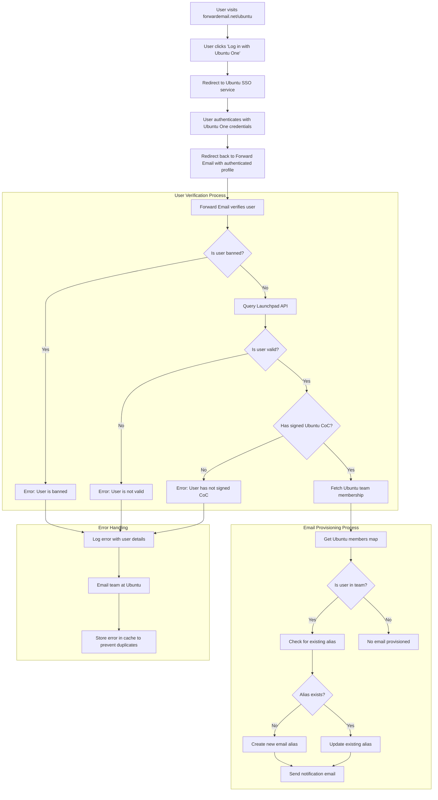

# Esettanulmány: Hogyan működik a Canonical Ubuntu e-mail-kezeléssel a Forward Email nyílt forráskódú vállalati megoldásával {#case-study-how-canonical-powers-ubuntu-email-management-with-forward-emails-open-source-enterprise-solution}


## Tartalomjegyzék {#table-of-contents}

* [Előszó](#foreword)
* [A kihívás: Egy összetett e-mail ökoszisztéma kezelése](#the-challenge-managing-a-complex-email-ecosystem)
* [Kulcs elvitelek](#key-takeaways)
* [Miért továbbítsa az e-mailt](#why-forward-email)
* [A megvalósítás: Zökkenőmentes SSO-integráció](#the-implementation-seamless-sso-integration)
  * [Hitelesítési folyamatábrázolás](#authentication-flow-visualization)
  * [A műszaki megvalósítás részletei](#technical-implementation-details)
* [DNS-konfiguráció és e-mail-útválasztás](#dns-configuration-and-email-routing)
* [Eredmények: Egyszerűbb e-mail-kezelés és fokozott biztonság](#results-streamlined-email-management-and-enhanced-security)
  * [Működési hatékonyság](#operational-efficiency)
  * [Fokozott biztonság és adatvédelem](#enhanced-security-and-privacy)
  * [Költségmegtakarítás](#cost-savings)
  * [Továbbfejlesztett közreműködői élmény](#improved-contributor-experience)
* [Előretekintve: Folyamatos együttműködés](#looking-forward-continued-collaboration)
* [Következtetés: Tökéletes nyílt forráskódú partnerség](#conclusion-a-perfect-open-source-partnership)
* [Vállalati ügyfelek támogatása](#supporting-enterprise-clients)
  * [Vegye fel a kapcsolatot](#get-in-touch)
  * [Az e-mail továbbításáról](#about-forward-email)

## Előszó {#foreword}

A nyílt forráskódú szoftverek világában kevés névnek van akkora súllyal bíró ereje, mint a [Kánoni](https://en.wikipedia.org/wiki/Canonical_\(company\)), a [Ubuntu](https://en.wikipedia.org/wiki/Ubuntu) mögött álló vállalatnak, amely a világ egyik legnépszerűbb Linux disztribúciója. A hatalmas ökoszisztémájával, amely számos disztribúciót felölel, beleértve az Ubuntut, az [Az emberiségben](https://en.wikipedia.org/wiki/Kubuntu)-t, a [Lubuntu](https://en.wikipedia.org/wiki/Lubuntu)-t, a [Edubuntu](https://en.wikipedia.org/wiki/Edubuntu)-t és másokat, a Canonical egyedi kihívásokkal nézett szembe az e-mail címek kezelése során számos domainjén. Ez az esettanulmány azt vizsgálja, hogyan működött együtt a Canonical a Forward Email-lel, hogy egy zökkenőmentes, biztonságos és adatvédelmet figyelembe vevő vállalati e-mail-kezelési megoldást hozzon létre, amely tökéletesen illeszkedik a nyílt forráskódú értékeikhez.

## A kihívás: Komplex e-mail ökoszisztéma kezelése {#the-challenge-managing-a-complex-email-ecosystem}

A Canonical ökoszisztémája változatos és kiterjedt. A világszerte több millió felhasználóval és a különböző projektekben több ezer közreműködővel, az e-mail címek kezelése több domainben jelentős kihívásokat jelentett. A fő közreműködőknek hivatalos e-mail címekre volt szükségük (@ubuntu.com, @kubuntu.org stb.), amelyek tükrözik a projektben való részvételüket, miközben megőrizték a biztonságot és a könnyű használatot egy robusztus Ubuntu tartománykezelő rendszeren keresztül.

A Forward Email bevezetése előtt a Canonical a következő problémákkal küzdött:

* E-mail címek kezelése több domainen (@ubuntu.com, @kubuntu.org, @lubuntu.me, @edubuntu.org és @ubuntu.net)
* Egységes e-mail élmény biztosítása a fő közreműködők számára
* E-mail szolgáltatások integrálása a meglévő [Ubuntu One](https://en.wikipedia.org/wiki/Ubuntu_One) egyszeri bejelentkezési (SSO) rendszerükkel
* Olyan megoldás keresése, amely összhangban van az adatvédelem, a biztonság és a nyílt forráskódú e-mail biztonság iránti elkötelezettségükkel
* Biztonságos e-mail infrastruktúrájuk költséghatékony skálázása

## Főbb tudnivalók {#key-takeaways}

* A Canonical sikeresen bevezetett egy egységes e-mail-kezelési megoldást több Ubuntu domainen keresztül.
* A Forward Email 100%-ban nyílt forráskódú megközelítése tökéletesen illeszkedett a Canonical értékeihez.
* Az Ubuntu One-nal való SSO-integráció zökkenőmentes hitelesítést biztosít a közreműködők számára.
* A kvantumrezisztens titkosítás hosszú távú biztonságot nyújt minden e-mail-kommunikációhoz.
* A megoldás költséghatékonyan skálázható, hogy támogassa a Canonical növekvő közreműködői bázisát.

## Miért továbbítsuk az e-mailt? {#why-forward-email}

Az egyetlen 100%-ban nyílt forráskódú e-mail szolgáltató, amely az adatvédelemre és a biztonságra összpontosít, ezért a Forward Email természetes módon illeszkedik a Canonical vállalati e-mail-továbbítási igényeihez. Értékeink tökéletesen illeszkednek a Canonical nyílt forráskódú szoftverek és adatvédelem iránti elkötelezettségéhez.

A legfontosabb tényezők, amelyek a Forward Emailt ideális választássá tették:

1. **Teljes nyílt forráskódú kódbázis**: Teljes platformunk nyílt forráskódú és elérhető a [GitHub](https://en.wikipedia.org/wiki/GitHub) oldalon, lehetővé téve az átláthatóságot és a közösségi hozzájárulásokat. Sok „adatvédelemre összpontosító” e-mail szolgáltatóval ellentétben, akik csak a frontendjeiket teszik nyílt forráskódúvá, miközben a backendjeik zárva maradnak, mi a teljes kódbázisunkat – mind a frontendet, mind a backendet – bárki számára megtekinthetővé tettük a [GitHub](https://github.com/forwardemail/forwardemail.net) oldalon.

2. **Adatvédelemre összpontosító megközelítés**: Más szolgáltatókkal ellentétben mi nem tárolunk e-maileket megosztott adatbázisokban, és robusztus TLS titkosítást használunk. Alapvető adatvédelmi filozófiánk egyszerű: **az e-mailek csak Önhöz tartoznak**. Ez az elv vezérli minden technikai döntésünket, az e-mail-továbbítás kezelésétől kezdve a titkosítás megvalósításáig.

3. **Nincs szükség harmadik felekre**: Nem használunk Amazon SES-t vagy más harmadik féltől származó szolgáltatásokat, így teljes ellenőrzést gyakorolhatunk az e-mail infrastruktúra felett, és kiküszöböljük a harmadik féltől származó szolgáltatásokon keresztüli esetleges adatvédelmi szivárgásokat.

4. **Költséghatékony skálázás**: Árképzési modellünk lehetővé teszi a szervezetek számára a skálázást felhasználónkénti fizetés nélkül, így ideális a Canonical széles közreműködői bázisa számára.

5. **Kvantumálló titkosítás**: Egyedileg titkosított SQLite postaládákat használunk, amelyekhez a [ChaCha20-Poly1305](https://en.wikipedia.org/wiki/ChaCha20-Poly1305) kódot használjuk a [kvantum-rezisztens titkosítás](/blog/docs/best-quantum-safe-encrypted-email-service) titkosításhoz. Minden postaláda egy külön titkosított fájl, ami azt jelenti, hogy az egyik felhasználó adataihoz való hozzáférés nem biztosít hozzáférést másoknak.

## Megvalósítás: Zökkenőmentes SSO-integráció {#the-implementation-seamless-sso-integration}

A megvalósítás egyik legkritikusabb szempontja a Canonical meglévő Ubuntu One SSO rendszerével való integráció volt. Ez az integráció lehetővé tenné a fő közreműködők számára, hogy a meglévő Ubuntu One hitelesítő adataik segítségével kezeljék @ubuntu.com e-mail címeiket.

### Hitelesítési folyamat vizualizációja {#authentication-flow-visualization}

Az alábbi diagram a teljes hitelesítési és e-mail-kiépítési folyamatot szemlélteti:



### Technikai megvalósítási részletek {#technical-implementation-details}

A Forward Email és az Ubuntu One SSO közötti integráció a passport-ubuntu hitelesítési stratégia egyedi megvalósításán keresztül valósult meg. Ez zökkenőmentes hitelesítési folyamatot tett lehetővé az Ubuntu One és a Forward Email rendszerei között.

#### A hitelesítési folyamat {#the-authentication-flow}

A hitelesítési folyamat a következőképpen működik:

1. A felhasználók felkeresik az Ubuntu e-mail-kezelési oldalát a [forwardemail.net/ubuntu](https://forwardemail.net/ubuntu) címen.
2. A „Bejelentkezés Ubuntu One-nal” gombra kattintanak, és átirányítják őket az Ubuntu SSO szolgáltatásra.
3. Miután hitelesítették magukat Ubuntu One hitelesítő adataikkal, visszairányítják őket a Forward Email oldalra a hitelesített profiljukkal.
4. A Forward Email ellenőrzi a közreműködői státuszukat, és ennek megfelelően biztosítja vagy kezeli az e-mail címüket.

A technikai megvalósítás a [`passport-ubuntu`](https://www.npmjs.com/package/passport-ubuntu) csomagot használta, amely egy [Útlevél](https://www.npmjs.com/package/passport) stratégia az Ubuntuval történő hitelesítéshez a [OpenID](https://en.wikipedia.org/wiki/OpenID) csomag használatával. A konfiguráció a következőket tartalmazta:

```javascript
passport.use(new UbuntuStrategy({
  returnURL: process.env.UBUNTU_CALLBACK_URL,
  realm: process.env.UBUNTU_REALM,
  stateless: true
}, function(identifier, profile, done) {
  // User verification and email provisioning logic
}));
```

#### Launchpad API integráció és validáció {#launchpad-api-integration-and-validation}

Implementációnk egyik kritikus eleme a [Indítópad](https://en.wikipedia.org/wiki/Launchpad_\(website\)) API-jával való integráció az Ubuntu felhasználók és csapattagságaik validálására. Újrafelhasználható segítőfüggvényeket hoztunk létre az integráció hatékony és megbízható kezeléséhez.

A `sync-ubuntu-user.js` segédfüggvény felelős a felhasználók Launchpad API-n keresztüli ellenőrzéséért és e-mail címeik kezeléséért. Íme egy egyszerűsített változata a működésének:

```javascript
async function syncUbuntuUser(user, map) {
  try {
    // Validate user object
    if (!_.isObject(user) ||
        !isSANB(user[fields.ubuntuUsername]) ||
        !isSANB(user[fields.ubuntuProfileID]) ||
        !isEmail(user.email))
      throw new TypeError('Invalid user object');

    // Get Ubuntu members map if not provided
    if (!(map instanceof Map))
      map = await getUbuntuMembersMap(resolver);

    // Check if user is banned
    if (user[config.userFields.isBanned]) {
      throw new InvalidUbuntuUserError('User was banned', { ignoreHook: true });
    }

    // Query Launchpad API to validate user
    const url = `https://api.launchpad.net/1.0/~${user[fields.ubuntuUsername]}`;
    const response = await retryRequest(url, { resolver });
    const json = await response.body.json();

    // Validate required boolean properties
    if (!json.is_valid)
      throw new InvalidUbuntuUserError('Property "is_valid" was false');

    if (!json.is_ubuntu_coc_signer)
      throw new InvalidUbuntuUserError('Property "is_ubuntu_coc_signer" was false');

    // Process each domain for the user
    await pMap([...map.keys()], async (name) => {
      // Find domain in database
      const domain = await Domains.findOne({
        name,
        plan: 'team',
        has_txt_record: true
      }).populate('members.user');

      // Process user's email alias for this domain
      if (map.get(name).has(user[fields.ubuntuUsername])) {
        // User is a member of this team, create or update alias
        let alias = await Aliases.findOne({
          user: user._id,
          domain: domain._id,
          name: user[fields.ubuntuUsername].toLowerCase()
        });

        if (!alias) {
          // Create new alias with appropriate error handling
          alias = await Aliases.create({
            user: user._id,
            domain: domain._id,
            name: user[fields.ubuntuUsername].toLowerCase(),
            recipients: [user.email],
            locale: user[config.lastLocaleField],
            is_enabled: true
          });

          // Notify admins about new alias creation
          await emailHelper({
            template: 'alert',
            message: {
              to: adminEmailsForDomain,
              subject: `New @${domain.name} email address created`
            },
            locals: {
              message: `A new email address ${user[fields.ubuntuUsername].toLowerCase()}@${domain.name} was created for ${user.email}`
            }
          });
        }
      }
    });

    return true;
  } catch (err) {
    // Handle and log errors
    await logErrorWithUser(err, user);
    throw err;
  }
}
```

A különböző Ubuntu tartományok csapattagságainak kezelésének egyszerűsítése érdekében létrehoztunk egy egyszerű leképezést a domain nevek és a megfelelő Launchpad csapatok között:

```javascript
ubuntuTeamMapping: {
  'ubuntu.com': '~ubuntumembers',
  'kubuntu.org': '~kubuntu-members',
  'lubuntu.me': '~lubuntu-members',
  'edubuntu.org': '~edubuntu-members',
  'ubuntustudio.com': '~ubuntustudio-core',
  'ubuntu.net': '~ubuntu-smtp-test'
},
```

Ez az egyszerű leképezés lehetővé teszi számunkra, hogy automatizáljuk a csapattagságok ellenőrzését és az e-mail-címek biztosítását, így a rendszer könnyen karbantartható és bővíthető új domainek hozzáadásával.

#### Hibakezelés és értesítések {#error-handling-and-notifications}

Robusztus hibakezelő rendszert vezettünk be, amely:

1. Naplózza az összes hibát részletes felhasználói információkkal.
2. E-mailben értesíti az Ubuntu csapatot, ha problémákat észlel.
3. Értesíti az adminisztrátorokat, amikor új közreműködők regisztrálnak és e-mail címeket hoznak létre.
4. Kezeli a szélsőséges eseteket, például azokat a felhasználókat, akik nem írták alá az Ubuntu magatartási kódexét.

Ez biztosítja a problémák gyors azonosítását és kezelését, megőrizve az e-mail rendszer integritását.

## DNS-konfiguráció és e-mail-útválasztás {#dns-configuration-and-email-routing}

A Canonical minden egyes e-mail továbbítással kezelt domainhez hozzáadott egy egyszerű DNS TXT rekordot az ellenőrzéshez:

```sh
❯ dig ubuntu.com txt
ubuntu.com.             600     IN      TXT     "forward-email-site-verification=6IsURgl2t7"
```

Ez az ellenőrző rekord megerősíti a domain tulajdonjogát, és lehetővé teszi rendszerünk számára az e-mailek biztonságos kezelését ezekhez a domainekhez. A Canonical a Postfixen keresztül irányítja a leveleket szolgáltatásunkon keresztül, amely megbízható és biztonságos e-mail kézbesítési infrastruktúrát biztosít.

## Eredmények: Egyszerűsített e-mail-kezelés és fokozott biztonság {#results-streamlined-email-management-and-enhanced-security}

A Forward Email vállalati megoldásának megvalósítása jelentős előnyökkel járt a Canonical e-mail-kezelése számára az összes domainben:

### Működési hatékonyság {#operational-efficiency}

* **Központosított kezelés**: Minden Ubuntuhoz kapcsolódó domain mostantól egyetlen felületen keresztül kezelhető.
* **Csökkentett adminisztratív terhek**: Automatizált kiépítés és önkiszolgáló kezelés a közreműködők számára.
* **Egyszerűsített bevezetési folyamat**: Az új közreműködők gyorsan megkaphatják hivatalos e-mail címüket.

### Fokozott biztonság és adatvédelem {#enhanced-security-and-privacy}

* **Végponttól végpontig terjedő titkosítás**: Minden e-mailt fejlett szabványok szerint titkosítunk.* **Nincsenek megosztott adatbázisok**: Minden felhasználó e-mailjeit külön titkosított SQLite adatbázisokban tároljuk, ami egy sandboxos titkosítási megközelítést biztosít, amely alapvetően biztonságosabb, mint a hagyományos megosztott relációs adatbázisok.* **Nyílt forráskódú biztonság**: Az átlátható kódbázis lehetővé teszi a közösségi biztonsági felülvizsgálatokat.* **Memóriában történő feldolgozás**: A továbbított e-maileket nem tároljuk lemezen, ami fokozza az adatvédelmet.* **Nincs metaadat-tárolás**: Sok e-mail szolgáltatóval ellentétben nem nyilvántartjuk, hogy ki kinek küld e-mailt.

### Költségmegtakarítás {#cost-savings}

* **Skálázható árképzési modell**: Nincsenek felhasználónkénti díjak, így a Canonical költségek növelése nélkül adhat hozzá közreműködőket.
* **Kevesebb infrastrukturális igény**: Nincs szükség külön e-mail szerverek fenntartására a különböző domainekhez.
* **Alacsonyabb támogatási követelmények**: Az önkiszolgáló kezelés csökkenti az informatikai támogatási kérelmek számát.

### Továbbfejlesztett közreműködői élmény {#improved-contributor-experience}

* **Zökkenőmentes hitelesítés**: Egyszeri bejelentkezés a meglévő Ubuntu One hitelesítő adatokkal
* **Konzisztens márkaépítés**: Egységes élmény az összes Ubuntuhoz kapcsolódó szolgáltatásban
* **Megbízható e-mail kézbesítés**: A kiváló minőségű IP-cím biztosítja, hogy az e-mailek eljussanak a célállomásukhoz

A Forward Email integrációja jelentősen leegyszerűsítette a Canonical e-mail kezelési folyamatát. A közreműködők zökkenőmentesen kezelhetik @ubuntu.com e-mail címeiket, csökkentett adminisztrációs ráfordítással és fokozott biztonsággal.

## Előretekintés: Folyamatos együttműködés {#looking-forward-continued-collaboration}

A Canonical és a Forward Email közötti partnerség folyamatosan fejlődik. Több kezdeményezésen is dolgozunk együtt:

* E-mail szolgáltatások kiterjesztése további Ubuntu-hoz kapcsolódó domainekre
* A felhasználói felület fejlesztése a közreműködők visszajelzései alapján
* További biztonsági funkciók bevezetése
* Új módszerek feltárása a nyílt forráskódú együttműködésünk kihasználására

## Konklúzió: Tökéletes nyílt forráskódú partnerség {#conclusion-a-perfect-open-source-partnership}

A Canonical és a Forward Email együttműködése demonstrálja a közös értékekre épülő partnerségek erejét. A Forward Email e-mail szolgáltatójának választásával a Canonical olyan megoldást talált, amely nemcsak műszaki követelményeinek felel meg, hanem tökéletesen illeszkedik a nyílt forráskódú szoftverek, az adatvédelem és a biztonság iránti elkötelezettségükhöz is.

A több domaint kezelő és a meglévő rendszerekkel zökkenőmentes hitelesítést igénylő szervezetek számára a Forward Email rugalmas, biztonságos és adatvédelmet figyelembe vevő megoldást kínál. [nyílt forráskódú megközelítés](https://forwardemail.net/blog/docs/why-open-source-email-security-privacy) szolgáltatásunk biztosítja az átláthatóságot és lehetővé teszi a közösségi hozzájárulásokat, így ideális választás azoknak a szervezeteknek, amelyek értékelik ezeket az elveket.

Mivel mind a Canonical, mind a Forward Email továbbra is innovációt hajt végre saját területükön, ez a partnerség a nyílt forráskódú együttműködés erejének és a közös értékeknek a bizonyítéka a hatékony megoldások létrehozásában.

Aktuális e-mail kézbesítési teljesítményünket a [valós idejű szolgáltatás állapota](https://status.forwardemail.net) oldalon tekintheti meg, amelyet folyamatosan figyelemmel kísérünk az IP-címek kiváló hírnevének és az e-mail kézbesíthetőségének biztosítása érdekében.

## Vállalati ügyfelek támogatása {#supporting-enterprise-clients}

Míg ez az esettanulmány a Canonical-lal fennálló partnerségünkre összpontosít, a Forward Email büszkén támogat számos olyan vállalati ügyfelet a különböző iparágakban, akik értékelik az adatvédelem, a biztonság és a nyílt forráskódú elvek iránti elkötelezettségünket.

Vállalati megoldásainkat úgy alakítottuk ki, hogy megfeleljenek minden méretű szervezet speciális igényeinek, és a következőket kínálják:

* Egyéni domain [email kezelése](/) több domainen keresztül
* Zökkenőmentes integráció a meglévő hitelesítési rendszerekkel
* Dedikált Matrix chat támogatási csatorna
* Továbbfejlesztett biztonsági funkciók, beleértve a [kvantum-rezisztens titkosítás](/blog/docs/best-quantum-safe-encrypted-email-service)-t
* Teljes adathordozhatóság és tulajdonjog
* 100%-ban nyílt forráskódú infrastruktúra az átláthatóság és a bizalom érdekében

### Kapcsolatfelvétel {#get-in-touch}

Ha szervezetének vállalati e-mailekre van szüksége, vagy szeretne többet megtudni arról, hogy a Forward Email miként segítheti az e-mailek kezelésének egyszerűsítését, miközben javítja az adatvédelmet és a biztonságot, örömmel fogadjuk:

* Írjon nekünk közvetlenül a `support@forwardemail.net` címre
* Küldjön segítségkérést a [súgóoldal](https://forwardemail.net/help) címen
* Vállalati csomagokért tekintse meg a [árképzési oldal](https://forwardemail.net/pricing) oldalt

Csapatunk készen áll arra, hogy megvitassa egyedi igényeit, és személyre szabott megoldást dolgozzon ki, amely összhangban van szervezete értékeivel és műszaki igényeivel.

### Az e-mailek továbbításáról {#about-forward-email}

A Forward Email egy 100%-ban nyílt forráskódú és adatvédelemre összpontosító e-mail szolgáltatás. Egyedi domain e-mail továbbítást, SMTP, IMAP és POP3 szolgáltatásokat kínálunk, a biztonságra, az adatvédelemre és az átláthatóságra összpontosítva. Teljes kódbázisunk elérhető a [GitHub](https://github.com/forwardemail/forwardemail.net) oldalon, és elkötelezettek vagyunk a felhasználók adatainak védelmét és biztonságát tiszteletben tartó e-mail szolgáltatások nyújtása iránt. Tudjon meg többet a [miért a nyílt forráskódú e-mail a jövő](https://forwardemail.net/blog/docs/why-open-source-email-security-privacy), [hogyan működik az e-mail továbbításunk](https://forwardemail.net/blog/docs/best-email-forwarding-service) és [az e-mail adatvédelemmel kapcsolatos megközelítésünk](https://forwardemail.net/blog/docs/email-privacy-protection-technical-implementation) szolgáltatásokról.