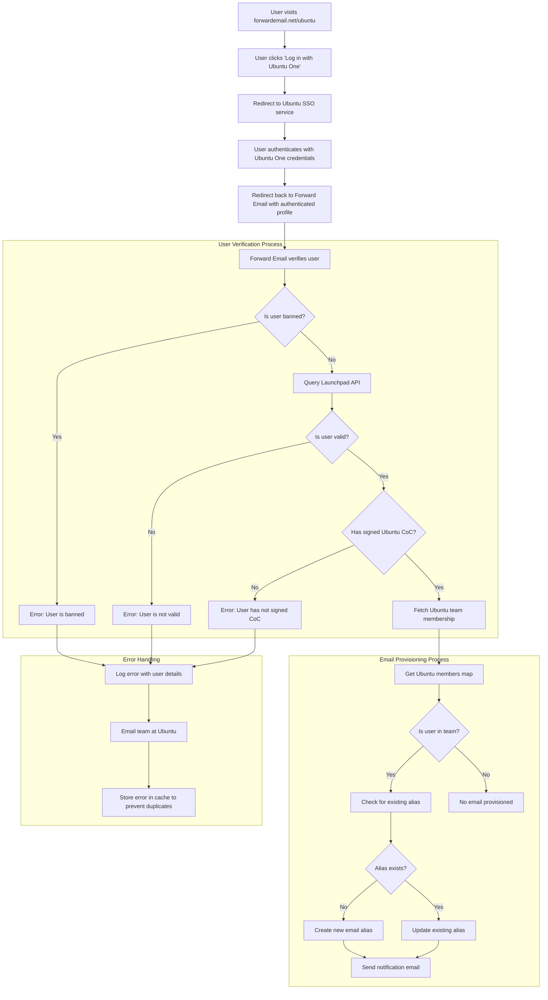

# Esettanulmány: Hogyan támogatja a Canonical az Ubuntu e-mail-kezelését a Forward Email nyílt forráskódú vállalati megoldásával {#case-study-how-canonical-powers-ubuntu-email-management-with-forward-emails-open-source-enterprise-solution}


## Tartalomjegyzék {#table-of-contents}

* [Előszó](#foreword)
* [A kihívás: Egy összetett e-mail ökoszisztéma kezelése](#the-challenge-managing-a-complex-email-ecosystem)
* [Főbb tanulságok](#key-takeaways)
* [Miért a Forward Email](#why-forward-email)
* [A megvalósítás: Zökkenőmentes SSO integráció](#the-implementation-seamless-sso-integration)
  * [Hitelesítési folyamat vizualizációja](#authentication-flow-visualization)
  * [Technikai megvalósítás részletei](#technical-implementation-details)
* [DNS konfiguráció és e-mail irányítás](#dns-configuration-and-email-routing)
* [Eredmények: Egyszerűsített e-mail-kezelés és fokozott biztonság](#results-streamlined-email-management-and-enhanced-security)
  * [Működési hatékonyság](#operational-efficiency)
  * [Fokozott biztonság és adatvédelem](#enhanced-security-and-privacy)
  * [Költségmegtakarítás](#cost-savings)
  * [Javított közreműködői élmény](#improved-contributor-experience)
* [Előre tekintve: Folyamatos együttműködés](#looking-forward-continued-collaboration)
* [Összegzés: Egy tökéletes nyílt forráskódú partnerség](#conclusion-a-perfect-open-source-partnership)
* [Vállalati ügyfelek támogatása](#supporting-enterprise-clients)
  * [Lépjen kapcsolatba velünk](#get-in-touch)
  * [A Forward Emailről](#about-forward-email)


## Előszó {#foreword}

A nyílt forráskódú szoftverek világában kevés névnek van akkora súlya, mint a [Canonical](https://en.wikipedia.org/wiki/Canonical_\(company\)) cégnek, amely az egyik legnépszerűbb Linux-disztribúció, az [Ubuntu](https://en.wikipedia.org/wiki/Ubuntu) mögött áll. Egy hatalmas ökoszisztémával, amely több disztribúciót foglal magában, beleértve az Ubuntut, a [Kubuntut](https://en.wikipedia.org/wiki/Kubuntu), a [Lubuntut](https://en.wikipedia.org/wiki/Lubuntu), az [Edubuntut](https://en.wikipedia.org/wiki/Edubuntu) és másokat, a Canonical egyedi kihívásokkal nézett szembe az e-mail címek kezelésében számos domainjükön keresztül. Ez az esettanulmány bemutatja, hogyan működött együtt a Canonical a Forward Email-lel egy zökkenőmentes, biztonságos és adatvédelmi szempontból kiemelt vállalati e-mail-kezelő megoldás létrehozásában, amely tökéletesen illeszkedik nyílt forráskódú értékeikhez.


## A kihívás: Egy összetett e-mail ökoszisztéma kezelése {#the-challenge-managing-a-complex-email-ecosystem}

A Canonical ökoszisztémája sokszínű és kiterjedt. Világszerte millió felhasználóval és több ezer közreműködővel különböző projektekben, az e-mail címek kezelése több domainen keresztül jelentős kihívásokat jelentett. Az alapvető közreműködőknek hivatalos e-mail címekre volt szükségük (@ubuntu.com, @kubuntu.org stb.), amelyek tükrözték részvételüket a projektben, miközben meg kellett őrizni a biztonságot és a könnyű használatot egy robusztus Ubuntu domain-kezelő rendszer segítségével.

A Forward Email bevezetése előtt a Canonical nehézségekkel küzdött:

* E-mail címek kezelése több domainen keresztül (@ubuntu.com, @kubuntu.org, @lubuntu.me, @edubuntu.org és @ubuntu.net)
* Egységes e-mail élmény biztosítása az alapvető közreműködők számára
* Az e-mail szolgáltatások integrálása a meglévő [Ubuntu One](https://en.wikipedia.org/wiki/Ubuntu_One) Single Sign-On (SSO) rendszerrel
* Olyan megoldás megtalálása, amely összhangban áll az adatvédelem, a biztonság és a nyílt forráskódú e-mail biztonság iránti elkötelezettségükkel
* Biztonságos e-mail infrastruktúrájuk költséghatékony skálázása


## Főbb tanulságok {#key-takeaways}

* A Canonical sikeresen valósított meg egységes e-mail-kezelő megoldást több Ubuntu domainen keresztül
* A Forward Email 100%-ban nyílt forráskódú megközelítése tökéletesen illeszkedett a Canonical értékeihez
* Az Ubuntu One SSO integráció zökkenőmentes hitelesítést biztosít a közreműködők számára
* A kvantumrezisztens titkosítás hosszú távú biztonságot garantál minden e-mail kommunikáció számára
* A megoldás költséghatékonyan skálázható a Canonical növekvő közreműködői bázisának támogatására


## Miért a Forward Email {#why-forward-email}
Mivel az egyetlen 100%-ban nyílt forráskódú e-mail szolgáltató vagyunk, amely a magánélet és a biztonság fókuszában áll, a Forward Email természetes választás volt a Canonical vállalati e-mail továbbítási igényeihez. Értékeink tökéletesen összhangban álltak a Canonical nyílt forráskódú szoftverekhez és adatvédelemhez való elkötelezettségével.

A Forward Email ideális választásának kulcsfontosságú tényezői a következők voltak:

1. **Teljes nyílt forráskódú kódbázis**: Az egész platformunk nyílt forráskódú és elérhető a [GitHub](https://en.wikipedia.org/wiki/GitHub) oldalon, lehetővé téve az átláthatóságot és a közösségi hozzájárulásokat. Ellentétben sok „adatvédelem-központú” e-mail szolgáltatóval, akik csak a frontendjeiket teszik nyílt forráskódúvá, miközben a backendjük zárt marad, mi az egész kódbázisunkat – frontend és backend egyaránt – bárki számára elérhetővé tettük ellenőrzésre a [GitHub](https://github.com/forwardemail/forwardemail.net) oldalon.

2. **Adatvédelem-központú megközelítés**: Más szolgáltatókkal ellentétben nem tárolunk e-maileket megosztott adatbázisokban, és erős titkosítást alkalmazunk TLS-sel. Alapvető adatvédelmi filozófiánk egyszerű: **az e-mailjeid csak a tiéd és senki másé**. Ez az elv vezérli minden technikai döntésünket, az e-mail továbbítás kezelésétől a titkosítás megvalósításáig.

3. **Harmadik felektől való függetlenség**: Nem használunk Amazon SES-t vagy más harmadik fél szolgáltatásait, így teljes kontrollt tartunk az e-mail infrastruktúra felett, és kizárjuk a harmadik felek által okozható adatvédelmi szivárgásokat.

4. **Költséghatékony skálázás**: Árazási modellünk lehetővé teszi a szervezetek számára a skálázást felhasználónkénti díjfizetés nélkül, ami ideálissá teszi a Canonical nagy hozzájárólói bázisához.

5. **Kvantumrezisztens titkosítás**: Egyénileg titkosított SQLite postaládákat használunk [ChaCha20-Poly1305](https://en.wikipedia.org/wiki/ChaCha20-Poly1305) titkosítóval a [kvantumrezisztens titkosításhoz](/blog/docs/best-quantum-safe-encrypted-email-service). Minden postaláda külön titkosított fájl, ami azt jelenti, hogy egy felhasználó adatainak elérése nem biztosít hozzáférést mások adataihoz.


## A megvalósítás: Zökkenőmentes SSO integráció {#the-implementation-seamless-sso-integration}

A megvalósítás egyik legkritikusabb aspektusa a Canonical meglévő Ubuntu One SSO rendszerével való integráció volt. Ez az integráció lehetővé tette, hogy a fő hozzájárulók a meglévő Ubuntu One hitelesítő adataikkal kezeljék @ubuntu.com e-mail címeiket.

### Hitelesítési folyamat vizualizációja {#authentication-flow-visualization}

Az alábbi diagram a teljes hitelesítési és e-mail szolgáltatási folyamatot szemlélteti:


```mermaid
flowchart TD
    A[User visits forwardemail.net/ubuntu] --> B[User clicks 'Log in with Ubuntu One']
    B --> C[Redirect to Ubuntu SSO service]
    C --> D[User authenticates with Ubuntu One credentials]
    D --> E[Redirect back to Forward Email with authenticated profile]
    E --> F[Forward Email verifies user]

    subgraph "User Verification Process"
        F --> G{Is user banned?}
        G -->|Yes| H[Error: User is banned]
        G -->|No| I[Query Launchpad API]
        I --> J{Is user valid?}
        J -->|No| K[Error: User is not valid]
        J -->|Yes| L{Has signed Ubuntu CoC?}
        L -->|No| M[Error: User has not signed CoC]
        L -->|Yes| N[Fetch Ubuntu team membership]
    end

    subgraph "Email Provisioning Process"
        N --> O[Get Ubuntu members map]
        O --> P{Is user in team?}
        P -->|Yes| Q[Check for existing alias]
        Q --> R{Alias exists?}
        R -->|No| S[Create new email alias]
        R -->|Yes| T[Update existing alias]
        S --> U[Send notification email]
        T --> U
        P -->|No| V[No email provisioned]
    end

    subgraph "Error Handling"
        H --> W[Log error with user details]
        K --> W
        M --> W
        W --> X[Email team at Ubuntu]
        X --> Y[Store error in cache to prevent duplicates]
    end
```

### Műszaki megvalósítás részletei {#technical-implementation-details}

A Forward Email és az Ubuntu One SSO közötti integrációt a passport-ubuntu hitelesítési stratégia egyedi megvalósításával valósítottuk meg. Ez lehetővé tette a zökkenőmentes hitelesítési folyamatot az Ubuntu One és a Forward Email rendszerei között.
#### Az autentikációs folyamat {#the-authentication-flow}

Az autentikációs folyamat a következőképpen működik:

1. A felhasználók meglátogatják a dedikált Ubuntu e-mail kezelő oldalt a [forwardemail.net/ubuntu](https://forwardemail.net/ubuntu) címen
2. Rákattintanak a „Bejelentkezés Ubuntu One-nal” gombra, és átirányítják őket az Ubuntu SSO szolgáltatáshoz
3. Az Ubuntu One hitelesítő adataikkal történő bejelentkezés után visszairányítják őket a Forward Emailhez a hitelesített profiljukkal
4. A Forward Email ellenőrzi a hozzájárulói státuszukat, és ennek megfelelően biztosítja vagy kezeli az e-mail címüket

A technikai megvalósítás a [`passport-ubuntu`](https://www.npmjs.com/package/passport-ubuntu) csomagot használta, amely egy [Passport](https://www.npmjs.com/package/passport) stratégia az Ubuntu-val történő hitelesítéshez [OpenID](https://en.wikipedia.org/wiki/OpenID) használatával. A konfiguráció a következő volt:

```javascript
passport.use(new UbuntuStrategy({
  returnURL: process.env.UBUNTU_CALLBACK_URL,
  realm: process.env.UBUNTU_REALM,
  stateless: true
}, function(identifier, profile, done) {
  // Felhasználó ellenőrzési és e-mail biztosítási logika
}));
```

#### Launchpad API integráció és érvényesítés {#launchpad-api-integration-and-validation}

Megvalósításunk egyik kritikus eleme a [Launchpad](https://en.wikipedia.org/wiki/Launchpad_\(website\)) API-jával való integráció az Ubuntu felhasználók és csapattagságaik érvényesítésére. Újrahasználható segédfunkciókat hoztunk létre ennek az integrációnak a hatékony és megbízható kezelésére.

A `sync-ubuntu-user.js` segédfunkció felelős a felhasználók Launchpad API-n keresztüli érvényesítéséért és e-mail címeik kezeléséért. Íme egy egyszerűsített verzió arról, hogyan működik:

```javascript
async function syncUbuntuUser(user, map) {
  try {
    // Felhasználói objektum érvényesítése
    if (!_.isObject(user) ||
        !isSANB(user[fields.ubuntuUsername]) ||
        !isSANB(user[fields.ubuntuProfileID]) ||
        !isEmail(user.email))
      throw new TypeError('Érvénytelen felhasználói objektum');

    // Ubuntu tagok térképének lekérése, ha nincs megadva
    if (!(map instanceof Map))
      map = await getUbuntuMembersMap(resolver);

    // Ellenőrizze, hogy a felhasználó tiltott-e
    if (user[config.userFields.isBanned]) {
      throw new InvalidUbuntuUserError('A felhasználót kitiltották', { ignoreHook: true });
    }

    // Launchpad API lekérdezése a felhasználó érvényesítéséhez
    const url = `https://api.launchpad.net/1.0/~${user[fields.ubuntuUsername]}`;
    const response = await retryRequest(url, { resolver });
    const json = await response.body.json();

    // Kötelező logikai tulajdonságok érvényesítése
    if (!json.is_valid)
      throw new InvalidUbuntuUserError('Az "is_valid" tulajdonság hamis volt');

    if (!json.is_ubuntu_coc_signer)
      throw new InvalidUbuntuUserError('Az "is_ubuntu_coc_signer" tulajdonság hamis volt');

    // Minden domain feldolgozása a felhasználó számára
    await pMap([...map.keys()], async (name) => {
      // Domain keresése az adatbázisban
      const domain = await Domains.findOne({
        name,
        plan: 'team',
        has_txt_record: true
      }).populate('members.user');

      // A felhasználó e-mail aliasának kezelése ehhez a domainhez
      if (map.get(name).has(user[fields.ubuntuUsername])) {
        // A felhasználó tagja ennek a csapatnak, alias létrehozása vagy frissítése
        let alias = await Aliases.findOne({
          user: user._id,
          domain: domain._id,
          name: user[fields.ubuntuUsername].toLowerCase()
        });

        if (!alias) {
          // Új alias létrehozása megfelelő hibakezeléssel
          alias = await Aliases.create({
            user: user._id,
            domain: domain._id,
            name: user[fields.ubuntuUsername].toLowerCase(),
            recipients: [user.email],
            locale: user[config.lastLocaleField],
            is_enabled: true
          });

          // Értesítés az adminoknak az új alias létrehozásáról
          await emailHelper({
            template: 'alert',
            message: {
              to: adminEmailsForDomain,
              subject: `Új @${domain.name} e-mail cím jött létre`
            },
            locals: {
              message: `Egy új e-mail cím ${user[fields.ubuntuUsername].toLowerCase()}@${domain.name} jött létre a(z) ${user.email} számára`
            }
          });
        }
      }
    });

    return true;
  } catch (err) {
    // Hibák kezelése és naplózása
    await logErrorWithUser(err, user);
    throw err;
  }
}
```
A csapattagságok kezelésének egyszerűsítése érdekében a különböző Ubuntu domainek között egy egyszerű leképezést hoztunk létre a domain nevek és a hozzájuk tartozó Launchpad csapatok között:

```javascript
ubuntuTeamMapping: {
  'ubuntu.com': '~ubuntumembers',
  'kubuntu.org': '~kubuntu-members',
  'lubuntu.me': '~lubuntu-members',
  'edubuntu.org': '~edubuntu-members',
  'ubuntustudio.com': '~ubuntustudio-core',
  'ubuntu.net': '~ubuntu-smtp-test'
},
```

Ez az egyszerű leképezés lehetővé teszi a csapattagságok ellenőrzésének és az e-mail címek kiadásának automatizálását, így a rendszer könnyen karbantartható és bővíthető új domainek hozzáadásakor.

#### Hibakezelés és értesítések {#error-handling-and-notifications}

Egy robusztus hibakezelő rendszert valósítottunk meg, amely:

1. Részletes felhasználói információkkal naplózza az összes hibát
2. E-mailt küld az Ubuntu csapatnak, ha problémákat észlel
3. Értesíti a rendszergazdákat, amikor új közreműködők regisztrálnak és e-mail címeket hoznak létre
4. Kezeli az olyan szélsőséges eseteket, mint például a felhasználók, akik még nem írták alá az Ubuntu Magatartási Kódexet

Ez biztosítja, hogy a problémákat gyorsan felismerjék és kezeljék, megőrizve az e-mail rendszer integritását.


## DNS konfiguráció és e-mail továbbítás {#dns-configuration-and-email-routing}

Minden Forward Email által kezelt domain esetében a Canonical egy egyszerű DNS TXT rekordot adott hozzá az érvényesítéshez:

```sh
❯ dig ubuntu.com txt
ubuntu.com.             600     IN      TXT     "forward-email-site-verification=6IsURgl2t7"
```

Ez az ellenőrző rekord megerősíti a domain tulajdonjogát, és lehetővé teszi rendszerünk számára, hogy biztonságosan kezelje az e-maileket ezekhez a domainekhez. A Canonical a Postfix szolgáltatáson keresztül irányítja a leveleket, amely megbízható és biztonságos e-mail kézbesítési infrastruktúrát biztosít.


## Eredmények: Egyszerűsített e-mail kezelés és fokozott biztonság {#results-streamlined-email-management-and-enhanced-security}

A Forward Email vállalati megoldásának bevezetése jelentős előnyöket hozott a Canonical e-mail kezelése számára minden domainjükön:

### Működési hatékonyság {#operational-efficiency}

* **Központosított kezelés**: Minden Ubuntu-hoz kapcsolódó domain most egyetlen felületen keresztül kezelhető
* **Csökkentett adminisztratív terhek**: Automatizált kiadás és önkiszolgáló kezelés a közreműködők számára
* **Egyszerűsített beléptetés**: Az új közreműködők gyorsan megkaphatják hivatalos e-mail címeiket

### Fokozott biztonság és adatvédelem {#enhanced-security-and-privacy}

* **Végpontok közötti titkosítás**: Minden e-mail fejlett szabványok szerint titkosított
* **Nincs megosztott adatbázis**: Minden felhasználó e-mailjei egyéni, titkosított SQLite adatbázisokban tárolódnak, ami egy elszigetelt titkosítási megközelítést jelent, amely alapvetően biztonságosabb, mint a hagyományos megosztott relációs adatbázisok
* **Nyílt forráskódú biztonság**: Az átlátható kódbázis lehetővé teszi a közösségi biztonsági ellenőrzéseket
* **Memóriában történő feldolgozás**: Nem tároljuk a továbbított e-maileket lemezen, így növelve az adatvédelmet
* **Nincs metaadat tárolás**: Nem vezetünk nyilvántartást arról, hogy ki kinek küld e-mailt, ellentétben sok e-mail szolgáltatóval

### Költségmegtakarítás {#cost-savings}

* **Skálázható ármodell**: Nincs felhasználónkénti díj, így a Canonical közreműködőket adhat hozzá anélkül, hogy növekednének a költségek
* **Csökkentett infrastruktúra igény**: Nem szükséges külön e-mail szervereket fenntartani a különböző domainekhez
* **Alacsonyabb támogatási igény**: Az önkiszolgáló kezelés csökkenti az IT támogatási jegyek számát

### Javított közreműködői élmény {#improved-contributor-experience}

* **Zökkenőmentes hitelesítés**: Egyszeri bejelentkezés a meglévő Ubuntu One hitelesítő adatokkal
* **Egységes arculat**: Egységes élmény minden Ubuntu-hoz kapcsolódó szolgáltatásban
* **Megbízható e-mail kézbesítés**: Magas minőségű IP hírnév biztosítja, hogy az e-mailek célba érjenek

A Forward Email integrációja jelentősen leegyszerűsítette a Canonical e-mail kezelési folyamatát. A közreműködők most zökkenőmentesen kezelhetik @ubuntu.com e-mail címeiket, csökkentett adminisztratív terhekkel és fokozott biztonsággal.


## Előre tekintve: Folyamatos együttműködés {#looking-forward-continued-collaboration}

A Canonical és a Forward Email közötti partnerség tovább fejlődik. Több kezdeményezésen dolgozunk együtt:
* E-mail szolgáltatások bővítése további, Ubuntu-hoz kapcsolódó domaineken
* A felhasználói felület fejlesztése a közreműködők visszajelzései alapján
* További biztonsági funkciók bevezetése
* Új lehetőségek feltárása nyílt forráskódú együttműködésünk kihasználására


## Következtetés: Egy tökéletes nyílt forráskódú partnerség {#conclusion-a-perfect-open-source-partnership}

A Canonical és a Forward Email közötti együttműködés jól példázza az olyan partnerségek erejét, amelyek közös értékeken alapulnak. A Forward Email e-mail szolgáltatóként való választásával a Canonical olyan megoldást talált, amely nemcsak technikai követelményeinek felelt meg, hanem tökéletesen illeszkedett elkötelezettségükhöz a nyílt forráskódú szoftverek, az adatvédelem és a biztonság iránt.

Azoknak a szervezeteknek, amelyek több domaint kezelnek és zökkenőmentes hitelesítést igényelnek meglévő rendszereikkel, a Forward Email rugalmas, biztonságos és adatvédelmi szempontból fókuszált megoldást kínál. Nyílt forráskódú megközelítésünk ([open-source approach](https://forwardemail.net/blog/docs/why-open-source-email-security-privacy)) átláthatóságot biztosít és lehetővé teszi a közösségi hozzájárulásokat, így ideális választás azoknak a szervezeteknek, amelyek értékelik ezeket az elveket.

Miközben a Canonical és a Forward Email is folyamatosan újít saját területén, ez a partnerség bizonyítéka a nyílt forráskódú együttműködés és a közös értékek erejének a hatékony megoldások létrehozásában.

Ellenőrizheti [valós idejű szolgáltatás állapotunkat](https://status.forwardemail.net), hogy lássa aktuális e-mail kézbesítési teljesítményünket, amelyet folyamatosan figyelünk a magas színvonalú IP-hírnév és e-mail kézbesíthetőség biztosítása érdekében.


## Vállalati ügyfelek támogatása {#supporting-enterprise-clients}

Bár ez az esettanulmány a Canonical-lal való partnerségünkre fókuszál, a Forward Email büszkén támogat számos vállalati ügyfelet különböző iparágakban, akik értékelik elkötelezettségünket az adatvédelem, a biztonság és a nyílt forráskódú elvek iránt.

Vállalati megoldásaink az összes méretű szervezet specifikus igényeihez igazodnak, és a következőket kínálják:

* Egyedi domain [e-mail kezelése](/) több domainen keresztül
* Zökkenőmentes integráció meglévő hitelesítési rendszerekkel
* Dedikált Matrix chat támogatási csatorna
* Fejlett biztonsági funkciók, beleértve a [kvantumrezisztens titkosítást](/blog/docs/best-quantum-safe-encrypted-email-service)
* Teljes adatátviteli és tulajdonjog biztosítása
* 100%-ban nyílt forráskódú infrastruktúra az átláthatóság és bizalom érdekében

### Lépjen kapcsolatba velünk {#get-in-touch}

Ha szervezetének vállalati e-mail igényei vannak, vagy szeretne többet megtudni arról, hogyan segíthet a Forward Email az e-mail kezelése egyszerűsítésében, miközben növeli az adatvédelmet és a biztonságot, örömmel hallunk Önről:

* Küldjön nekünk közvetlen e-mailt a `support@forwardemail.net` címre
* Küldjön segítségkérést a [segítség oldalunkon](https://forwardemail.net/help)
* Tekintse meg vállalati csomagjainkat a [árlistánkon](https://forwardemail.net/pricing)

Csapatunk készen áll arra, hogy megvitassa az Ön egyedi igényeit, és kidolgozzon egy testreszabott megoldást, amely összhangban áll szervezete értékeivel és technikai követelményeivel.

### A Forward Email-ről {#about-forward-email}

A Forward Email 100%-ban nyílt forráskódú és adatvédelmi szempontból fókuszált e-mail szolgáltatás. Egyedi domain e-mail továbbítást, SMTP, IMAP és POP3 szolgáltatásokat nyújtunk, kiemelt figyelemmel a biztonságra, adatvédelemre és átláthatóságra. Teljes kódalapunk elérhető a [GitHubon](https://github.com/forwardemail/forwardemail.net), és elkötelezettek vagyunk olyan e-mail szolgáltatások biztosítása mellett, amelyek tiszteletben tartják a felhasználók adatvédelmét és biztonságát. Tudjon meg többet arról, [miért a nyílt forráskódú e-mail a jövő](https://forwardemail.net/blog/docs/why-open-source-email-security-privacy), [hogyan működik az e-mail továbbításunk](https://forwardemail.net/blog/docs/best-email-forwarding-service), és [hogyan védjük az e-mail adatvédelmet technikailag](https://forwardemail.net/blog/docs/email-privacy-protection-technical-implementation).
