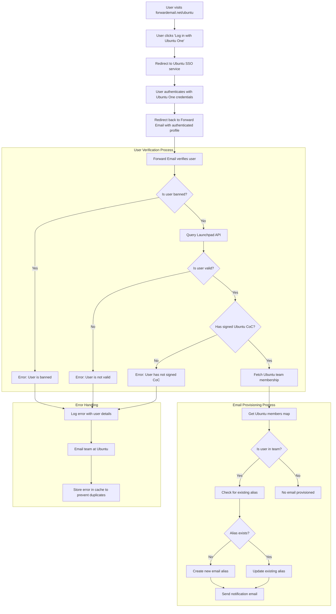

# Studi Kasus: Bagaimana Canonical Memberdayakan Manajemen Email Ubuntu dengan Solusi Perusahaan Open-Source Forward Email {#case-study-how-canonical-powers-ubuntu-email-management-with-forward-emails-open-source-enterprise-solution}


## Daftar Isi {#table-of-contents}

* [Kata pengantar](#foreword)
* [Tantangan: Mengelola Ekosistem Email yang Kompleks](#the-challenge-managing-a-complex-email-ecosystem)
* [Poin-Poin Utama](#key-takeaways)
* [Mengapa Meneruskan Email](#why-forward-email)
* [Implementasi: Integrasi SSO yang Lancar](#the-implementation-seamless-sso-integration)
  * [Visualisasi Alur Autentikasi](#authentication-flow-visualization)
  * [Detail Implementasi Teknis](#technical-implementation-details)
* [Konfigurasi DNS dan Perutean Email](#dns-configuration-and-email-routing)
* [Hasil: Manajemen Email yang Lebih Sederhana dan Keamanan yang Ditingkatkan](#results-streamlined-email-management-and-enhanced-security)
  * [Efisiensi Operasional](#operational-efficiency)
  * [Keamanan dan Privasi yang Ditingkatkan](#enhanced-security-and-privacy)
  * [Penghematan Biaya](#cost-savings)
  * [Pengalaman Kontributor yang Ditingkatkan](#improved-contributor-experience)
* [Menatap Masa Depan: Kolaborasi Berkelanjutan](#looking-forward-continued-collaboration)
* [Kesimpulan: Kemitraan Open Source yang Sempurna](#conclusion-a-perfect-open-source-partnership)
* [Mendukung Klien Perusahaan](#supporting-enterprise-clients)
  * [Hubungi Kami](#get-in-touch)
  * [Tentang Email Teruskan](#about-forward-email)

## Kata Pengantar {#foreword}

Di dunia perangkat lunak sumber terbuka, hanya sedikit nama yang memiliki pengaruh sebesar [Resmi](https://en.wikipedia.org/wiki/Canonical_\(company\)), perusahaan di balik [Ubuntu](https://en.wikipedia.org/wiki/Ubuntu), salah satu distribusi Linux terpopuler di dunia. Dengan ekosistem yang luas yang mencakup berbagai distribusi termasuk Ubuntu, [Bebas](https://en.wikipedia.org/wiki/Kubuntu), [Lubuntu](https://en.wikipedia.org/wiki/Lubuntu), [Edubuntu](https://en.wikipedia.org/wiki/Edubuntu), dan lainnya, Canonical menghadapi tantangan unik dalam mengelola alamat email di berbagai domain mereka. Studi kasus ini mengeksplorasi bagaimana Canonical bermitra dengan Forward Email untuk menciptakan solusi manajemen email perusahaan yang lancar, aman, dan berfokus pada privasi yang selaras sempurna dengan nilai-nilai sumber terbuka mereka.

## Tantangan: Mengelola Ekosistem Email yang Kompleks {#the-challenge-managing-a-complex-email-ecosystem}

Ekosistem Canonical beragam dan luas. Dengan jutaan pengguna di seluruh dunia dan ribuan kontributor di berbagai proyek, mengelola alamat email di berbagai domain menghadirkan tantangan yang signifikan. Kontributor inti membutuhkan alamat email resmi (@ubuntu.com, @kubuntu.org, dll.) yang mencerminkan keterlibatan mereka dengan proyek, sekaligus menjaga keamanan dan kemudahan penggunaan melalui sistem manajemen domain Ubuntu yang tangguh.

Sebelum menerapkan Forward Email, Canonical mengalami kesulitan dengan:

* Mengelola alamat email di beberapa domain (@ubuntu.com, @kubuntu.org, @lubuntu.me, @edubuntu.org, dan @ubuntu.net)
* Menyediakan pengalaman email yang konsisten bagi kontributor inti
* Mengintegrasikan layanan email dengan sistem Single Sign-On (SSO) [Ubuntu Satu](https://en.wikipedia.org/wiki/Ubuntu_One) yang sudah ada
* Menemukan solusi yang sejalan dengan komitmen mereka terhadap privasi, keamanan, dan keamanan email sumber terbuka
* Menskalakan infrastruktur email aman mereka secara hemat biaya

## Poin Penting {#key-takeaways}

* Canonical berhasil menerapkan solusi manajemen email terpadu di beberapa domain Ubuntu
* Pendekatan 100% sumber terbuka Forward Email selaras sempurna dengan nilai-nilai Canonical
* Integrasi SSO dengan Ubuntu One menyediakan autentikasi yang lancar bagi kontributor
* Enkripsi tahan kuantum memastikan keamanan jangka panjang untuk semua komunikasi email
* Solusi ini dapat diskalakan secara hemat biaya untuk mendukung basis kontributor Canonical yang terus berkembang

## Mengapa Meneruskan Email {#why-forward-email}

Sebagai satu-satunya penyedia layanan email 100% sumber terbuka yang berfokus pada privasi dan keamanan, Forward Email sangat cocok untuk kebutuhan penerusan email perusahaan Canonical. Nilai-nilai kami selaras sempurna dengan komitmen Canonical terhadap perangkat lunak sumber terbuka dan privasi.

Faktor utama yang menjadikan Forward Email pilihan ideal antara lain:

1. **Basis kode sumber terbuka yang lengkap**: Seluruh platform kami bersifat sumber terbuka dan tersedia di [GitHub](https://en.wikipedia.org/wiki/GitHub), memungkinkan transparansi dan kontribusi komunitas. Tidak seperti banyak penyedia email yang "berfokus pada privasi" yang hanya membuka sumber frontend mereka sementara backend mereka tetap tertutup, kami telah membuat seluruh basis kode kami—baik frontend maupun backend—tersedia untuk diperiksa siapa pun di [GitHub](https://github.com/forwardemail/forwardemail.net).

2. **Pendekatan yang berfokus pada privasi**: Tidak seperti penyedia lain, kami tidak menyimpan email dalam basis data bersama, dan kami menggunakan enkripsi yang kuat dengan TLS. Filosofi privasi dasar kami sederhana: **email Anda adalah milik Anda dan hanya Anda**. Prinsip ini memandu setiap keputusan teknis yang kami buat, mulai dari cara kami menangani penerusan email hingga cara kami menerapkan enkripsi.

3. **Tidak bergantung pada pihak ketiga**: Kami tidak menggunakan Amazon SES atau layanan pihak ketiga lainnya, memberi kami kendali penuh atas infrastruktur email dan menghilangkan potensi kebocoran privasi melalui layanan pihak ketiga.

4. **Skala hemat biaya**: Model harga kami memungkinkan organisasi untuk meningkatkan skala tanpa membayar per pengguna, menjadikannya ideal untuk basis kontributor Canonical yang besar.

5. **Enkripsi tahan kuantum**: Kami menggunakan kotak surat SQLite yang dienkripsi secara individual dengan [ChaCha20-Poly1305](https://en.wikipedia.org/wiki/ChaCha20-Poly1305) sebagai sandi untuk [enkripsi tahan kuantum](/blog/docs/best-quantum-safe-encrypted-email-service). Setiap kotak surat adalah berkas terenkripsi terpisah, artinya akses ke data satu pengguna tidak memberikan akses kepada pengguna lain.

## Implementasi: Integrasi SSO yang Lancar {#the-implementation-seamless-sso-integration}

Salah satu aspek terpenting dari implementasi ini adalah integrasi dengan sistem SSO Ubuntu One Canonical yang sudah ada. Integrasi ini akan memungkinkan kontributor inti untuk mengelola alamat surel @ubuntu.com mereka menggunakan kredensial Ubuntu One yang sudah ada.

### Visualisasi Alur Autentikasi {#authentication-flow-visualization}

Diagram berikut mengilustrasikan alur autentikasi dan penyediaan email lengkap:



### Detail Implementasi Teknis {#technical-implementation-details}

Integrasi antara Forward Email dan Ubuntu One SSO dicapai melalui implementasi khusus strategi autentikasi passport-ubuntu. Hal ini memungkinkan alur autentikasi yang lancar antara sistem Ubuntu One dan Forward Email.

#### Alur Autentikasi {#the-authentication-flow}

Proses autentikasi bekerja sebagai berikut:

1. Pengguna mengunjungi halaman khusus manajemen email Ubuntu di [forwardemail.net/ubuntu](https://forwardemail.net/ubuntu)
2. Mereka mengklik "Masuk dengan Ubuntu One" dan diarahkan ke layanan SSO Ubuntu
3. Setelah mengautentikasi dengan kredensial Ubuntu One mereka, mereka diarahkan kembali ke Forward Email dengan profil terautentikasi mereka
4. Forward Email memverifikasi status dan ketentuan kontributor mereka atau mengelola alamat email mereka sebagaimana mestinya

Implementasi teknis ini memanfaatkan paket [`passport-ubuntu`](https://www.npmjs.com/package/passport-ubuntu), yang merupakan strategi [Paspor](https://www.npmjs.com/package/passport) untuk autentikasi dengan Ubuntu menggunakan [ID Terbuka](https://en.wikipedia.org/wiki/OpenID). Konfigurasinya meliputi:

```javascript
passport.use(new UbuntuStrategy({
  returnURL: process.env.UBUNTU_CALLBACK_URL,
  realm: process.env.UBUNTU_REALM,
  stateless: true
}, function(identifier, profile, done) {
  // User verification and email provisioning logic
}));
```

#### Integrasi dan Validasi API Launchpad {#launchpad-api-integration-and-validation}

Komponen penting dari implementasi kami adalah integrasi dengan API [Landasan peluncuran](https://en.wikipedia.org/wiki/Launchpad_\(website\)) untuk memvalidasi pengguna Ubuntu dan keanggotaan tim mereka. Kami menciptakan fungsi bantuan yang dapat digunakan kembali untuk menangani integrasi ini secara efisien dan andal.

Fungsi pembantu `sync-ubuntu-user.js` bertanggung jawab untuk memvalidasi pengguna melalui API Launchpad dan mengelola alamat email mereka. Berikut versi sederhana cara kerjanya:

```javascript
async function syncUbuntuUser(user, map) {
  try {
    // Validate user object
    if (!_.isObject(user) ||
        !isSANB(user[fields.ubuntuUsername]) ||
        !isSANB(user[fields.ubuntuProfileID]) ||
        !isEmail(user.email))
      throw new TypeError('Invalid user object');

    // Get Ubuntu members map if not provided
    if (!(map instanceof Map))
      map = await getUbuntuMembersMap(resolver);

    // Check if user is banned
    if (user[config.userFields.isBanned]) {
      throw new InvalidUbuntuUserError('User was banned', { ignoreHook: true });
    }

    // Query Launchpad API to validate user
    const url = `https://api.launchpad.net/1.0/~${user[fields.ubuntuUsername]}`;
    const response = await retryRequest(url, { resolver });
    const json = await response.body.json();

    // Validate required boolean properties
    if (!json.is_valid)
      throw new InvalidUbuntuUserError('Property "is_valid" was false');

    if (!json.is_ubuntu_coc_signer)
      throw new InvalidUbuntuUserError('Property "is_ubuntu_coc_signer" was false');

    // Process each domain for the user
    await pMap([...map.keys()], async (name) => {
      // Find domain in database
      const domain = await Domains.findOne({
        name,
        plan: 'team',
        has_txt_record: true
      }).populate('members.user');

      // Process user's email alias for this domain
      if (map.get(name).has(user[fields.ubuntuUsername])) {
        // User is a member of this team, create or update alias
        let alias = await Aliases.findOne({
          user: user._id,
          domain: domain._id,
          name: user[fields.ubuntuUsername].toLowerCase()
        });

        if (!alias) {
          // Create new alias with appropriate error handling
          alias = await Aliases.create({
            user: user._id,
            domain: domain._id,
            name: user[fields.ubuntuUsername].toLowerCase(),
            recipients: [user.email],
            locale: user[config.lastLocaleField],
            is_enabled: true
          });

          // Notify admins about new alias creation
          await emailHelper({
            template: 'alert',
            message: {
              to: adminEmailsForDomain,
              subject: `New @${domain.name} email address created`
            },
            locals: {
              message: `A new email address ${user[fields.ubuntuUsername].toLowerCase()}@${domain.name} was created for ${user.email}`
            }
          });
        }
      }
    });

    return true;
  } catch (err) {
    // Handle and log errors
    await logErrorWithUser(err, user);
    throw err;
  }
}
```

Untuk menyederhanakan pengelolaan keanggotaan tim di berbagai domain Ubuntu, kami membuat pemetaan langsung antara nama domain dan tim Launchpad terkait:

```javascript
ubuntuTeamMapping: {
  'ubuntu.com': '~ubuntumembers',
  'kubuntu.org': '~kubuntu-members',
  'lubuntu.me': '~lubuntu-members',
  'edubuntu.org': '~edubuntu-members',
  'ubuntustudio.com': '~ubuntustudio-core',
  'ubuntu.net': '~ubuntu-smtp-test'
},
```

Pemetaan sederhana ini memungkinkan kami mengotomatiskan proses pemeriksaan keanggotaan tim dan penyediaan alamat email, sehingga sistem mudah dipelihara dan diperluas saat domain baru ditambahkan.

#### Penanganan Kesalahan dan Pemberitahuan {#error-handling-and-notifications}

Kami menerapkan sistem penanganan kesalahan yang kuat yang:

1. Mencatat semua kesalahan dengan informasi pengguna yang terperinci
2. Mengirimkan email ke tim Ubuntu ketika masalah terdeteksi
3. Memberi tahu administrator ketika kontributor baru mendaftar dan membuat alamat email
4. Menangani kasus-kasus khusus seperti pengguna yang belum menandatangani Kode Etik Ubuntu

Hal ini memastikan bahwa masalah apa pun segera diidentifikasi dan ditangani, sehingga integritas sistem email tetap terjaga.

## Konfigurasi DNS dan Perutean Email {#dns-configuration-and-email-routing}

Untuk setiap domain yang dikelola melalui Forward Email, Canonical menambahkan catatan DNS TXT sederhana untuk validasi:

```sh
❯ dig ubuntu.com txt
ubuntu.com.             600     IN      TXT     "forward-email-site-verification=6IsURgl2t7"
```

Catatan verifikasi ini mengonfirmasi kepemilikan domain dan memungkinkan sistem kami mengelola email untuk domain-domain ini dengan aman. Canonical merutekan email melalui layanan kami melalui Postfix, yang menyediakan infrastruktur pengiriman email yang andal dan aman.

## Hasil: Manajemen Email yang Lebih Sederhana dan Keamanan yang Ditingkatkan {#results-streamlined-email-management-and-enhanced-security}

Implementasi solusi perusahaan Forward Email telah memberikan manfaat signifikan bagi manajemen email Canonical di semua domain mereka:

### Efisiensi Operasional {#operational-efficiency}

**Manajemen terpusat**: Semua domain terkait Ubuntu kini dikelola melalui satu antarmuka
* **Mengurangi beban administratif**: Penyediaan otomatis dan manajemen swalayan untuk kontributor
* **Penyederhanaan onboarding**: Kontributor baru dapat dengan cepat mendapatkan alamat email resmi mereka

### Keamanan dan Privasi yang Ditingkatkan {#enhanced-security-and-privacy}

* **Enkripsi ujung ke ujung**: Semua email dienkripsi menggunakan standar canggih
* **Tanpa basis data bersama**: Setiap email pengguna disimpan dalam basis data SQLite terenkripsi individual, menyediakan pendekatan enkripsi sandbox yang secara fundamental lebih aman daripada basis data relasional bersama tradisional
* **Keamanan sumber terbuka**: Basis kode transparan memungkinkan tinjauan keamanan komunitas
* **Pemrosesan dalam memori**: Kami tidak menyimpan email yang diteruskan ke disk, sehingga meningkatkan perlindungan privasi
* **Tanpa penyimpanan metadata**: Kami tidak menyimpan catatan siapa yang mengirim email kepada siapa, tidak seperti kebanyakan penyedia email

### Penghematan Biaya {#cost-savings}

* **Model harga yang dapat diskalakan**: Tanpa biaya per pengguna, memungkinkan Canonical untuk menambah kontributor tanpa menambah biaya
* **Kebutuhan infrastruktur yang berkurang**: Tidak perlu mengelola server email terpisah untuk domain yang berbeda
* **Persyaratan dukungan yang lebih rendah**: Manajemen swalayan mengurangi tiket dukungan TI

### Peningkatan Pengalaman Kontributor {#improved-contributor-experience}

**Autentikasi tanpa hambatan**: Akses masuk tunggal dengan kredensial Ubuntu One yang ada
* **Branding yang konsisten**: Pengalaman terpadu di seluruh layanan terkait Ubuntu
* **Pengiriman email yang andal**: Reputasi IP berkualitas tinggi memastikan email sampai ke tujuannya

Integrasi dengan Forward Email telah menyederhanakan proses pengelolaan email Canonical secara signifikan. Kontributor kini memiliki pengalaman yang lancar dalam mengelola alamat email @ubuntu.com mereka, dengan beban administratif yang berkurang dan keamanan yang ditingkatkan.

## Menantikan: Kolaborasi Berkelanjutan {#looking-forward-continued-collaboration}

Kemitraan antara Canonical dan Forward Email terus berkembang. Kami bekerja sama dalam beberapa inisiatif:

* Memperluas layanan email ke domain terkait Ubuntu lainnya
* Meningkatkan antarmuka pengguna berdasarkan masukan kontributor
* Menerapkan fitur keamanan tambahan
* Menjelajahi cara-cara baru untuk memanfaatkan kolaborasi sumber terbuka kami

Kesimpulan ##: Kemitraan Open-Source yang Sempurna {#conclusion-a-perfect-open-source-partnership}

Kolaborasi antara Canonical dan Forward Email menunjukkan kekuatan kemitraan yang dibangun di atas nilai-nilai bersama. Dengan memilih Forward Email sebagai penyedia layanan email mereka, Canonical menemukan solusi yang tidak hanya memenuhi persyaratan teknis mereka, tetapi juga selaras sempurna dengan komitmen mereka terhadap perangkat lunak sumber terbuka, privasi, dan keamanan.

Bagi organisasi yang mengelola beberapa domain dan membutuhkan autentikasi yang lancar dengan sistem yang ada, Forward Email menawarkan solusi yang fleksibel, aman, dan mengutamakan privasi. [pendekatan sumber terbuka](https://forwardemail.net/blog/docs/why-open-source-email-security-privacy) kami memastikan transparansi dan memungkinkan kontribusi komunitas, menjadikannya pilihan ideal bagi organisasi yang menghargai prinsip-prinsip ini.

Karena Canonical dan Forward Email terus berinovasi di bidangnya masing-masing, kemitraan ini menjadi bukti kekuatan kolaborasi sumber terbuka dan nilai-nilai bersama dalam menciptakan solusi yang efektif.

Anda dapat memeriksa [status layanan waktu nyata](https://status.forwardemail.net) kami untuk melihat kinerja pengiriman email kami saat ini, yang kami pantau terus-menerus untuk memastikan reputasi IP berkualitas tinggi dan pengiriman email.

## Mendukung Klien Perusahaan {#supporting-enterprise-clients}

Meskipun studi kasus ini berfokus pada kemitraan kami dengan Canonical, Forward Email dengan bangga mendukung banyak klien perusahaan di berbagai industri yang menghargai komitmen kami terhadap prinsip privasi, keamanan, dan sumber terbuka.

Solusi perusahaan kami dirancang untuk memenuhi kebutuhan spesifik organisasi dari semua ukuran, menawarkan:

* Domain kustom [manajemen email](/) di berbagai domain
* Integrasi yang mulus dengan sistem autentikasi yang ada
* Saluran dukungan obrolan Matrix khusus
* Fitur keamanan yang ditingkatkan termasuk [enkripsi tahan kuantum](/blog/docs/best-quantum-safe-encrypted-email-service)
* Portabilitas dan kepemilikan data yang lengkap
* Infrastruktur 100% sumber terbuka untuk transparansi dan kepercayaan

### Hubungi Kami {#get-in-touch}

Jika organisasi Anda memiliki kebutuhan email perusahaan atau Anda tertarik mempelajari lebih lanjut tentang bagaimana Forward Email dapat membantu menyederhanakan pengelolaan email Anda sekaligus meningkatkan privasi dan keamanan, kami ingin mendengar pendapat Anda:

* Kirimkan email langsung ke `support@forwardemail.net`
* Kirimkan permintaan bantuan ke [halaman bantuan](https://forwardemail.net/help)
* Lihat [halaman harga](https://forwardemail.net/pricing) untuk paket perusahaan

Tim kami siap mendiskusikan persyaratan spesifik Anda dan mengembangkan solusi khusus yang selaras dengan nilai dan kebutuhan teknis organisasi Anda.

### Tentang Email Terusan {#about-forward-email}

Forward Email adalah layanan email 100% sumber terbuka dan berfokus pada privasi. Kami menyediakan layanan penerusan email domain khusus, SMTP, IMAP, dan POP3 dengan fokus pada keamanan, privasi, dan transparansi. Seluruh basis kode kami tersedia di [GitHub](https://github.com/forwardemail/forwardemail.net), dan kami berkomitmen untuk menyediakan layanan email yang menghormati privasi dan keamanan pengguna. Pelajari lebih lanjut tentang [mengapa email sumber terbuka adalah masa depan](https://forwardemail.net/blog/docs/why-open-source-email-security-privacy), [cara kerja penerusan email kami](https://forwardemail.net/blog/docs/best-email-forwarding-service), dan [pendekatan kami terhadap perlindungan privasi email](https://forwardemail.net/blog/docs/email-privacy-protection-technical-implementation).