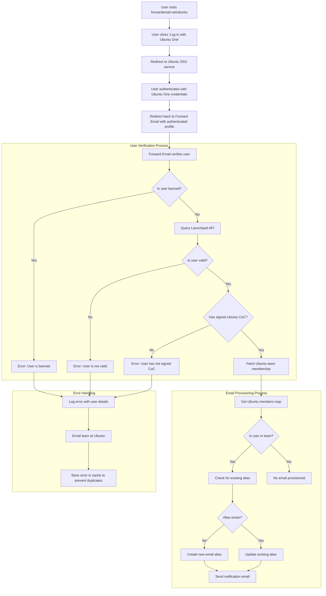

# Studi Kasus: Bagaimana Canonical Mengelola Email Ubuntu dengan Solusi Perusahaan Open-Source dari Forward Email {#case-study-how-canonical-powers-ubuntu-email-management-with-forward-emails-open-source-enterprise-solution}


## Daftar Isi {#table-of-contents}

* [Kata Pengantar](#foreword)
* [Tantangan: Mengelola Ekosistem Email yang Kompleks](#the-challenge-managing-a-complex-email-ecosystem)
* [Poin-Poin Penting](#key-takeaways)
* [Mengapa Forward Email](#why-forward-email)
* [Implementasi: Integrasi SSO yang Mulus](#the-implementation-seamless-sso-integration)
  * [Visualisasi Alur Otentikasi](#authentication-flow-visualization)
  * [Detail Implementasi Teknis](#technical-implementation-details)
* [Konfigurasi DNS dan Pengaturan Rute Email](#dns-configuration-and-email-routing)
* [Hasil: Manajemen Email yang Efisien dan Keamanan yang Ditingkatkan](#results-streamlined-email-management-and-enhanced-security)
  * [Efisiensi Operasional](#operational-efficiency)
  * [Keamanan dan Privasi yang Ditingkatkan](#enhanced-security-and-privacy)
  * [Penghematan Biaya](#cost-savings)
  * [Pengalaman Kontributor yang Lebih Baik](#improved-contributor-experience)
* [Melihat ke Depan: Kolaborasi Berkelanjutan](#looking-forward-continued-collaboration)
* [Kesimpulan: Kemitraan Open-Source yang Sempurna](#conclusion-a-perfect-open-source-partnership)
* [Mendukung Klien Perusahaan](#supporting-enterprise-clients)
  * [Hubungi Kami](#get-in-touch)
  * [Tentang Forward Email](#about-forward-email)


## Kata Pengantar {#foreword}

Dalam dunia perangkat lunak open-source, sedikit nama yang memiliki bobot sebesar [Canonical](https://en.wikipedia.org/wiki/Canonical_\(company\)), perusahaan di balik [Ubuntu](https://en.wikipedia.org/wiki/Ubuntu), salah satu distribusi Linux paling populer di dunia. Dengan ekosistem luas yang mencakup berbagai distribusi termasuk Ubuntu, [Kubuntu](https://en.wikipedia.org/wiki/Kubuntu), [Lubuntu](https://en.wikipedia.org/wiki/Lubuntu), [Edubuntu](https://en.wikipedia.org/wiki/Edubuntu), dan lainnya, Canonical menghadapi tantangan unik dalam mengelola alamat email di berbagai domain mereka. Studi kasus ini mengeksplorasi bagaimana Canonical bermitra dengan Forward Email untuk menciptakan solusi manajemen email perusahaan yang mulus, aman, dan berfokus pada privasi yang selaras sempurna dengan nilai-nilai open-source mereka.


## Tantangan: Mengelola Ekosistem Email yang Kompleks {#the-challenge-managing-a-complex-email-ecosystem}

Ekosistem Canonical sangat beragam dan luas. Dengan jutaan pengguna di seluruh dunia dan ribuan kontributor di berbagai proyek, mengelola alamat email di banyak domain menghadirkan tantangan besar. Kontributor inti membutuhkan alamat email resmi (@ubuntu.com, @kubuntu.org, dll.) yang mencerminkan keterlibatan mereka dalam proyek sambil menjaga keamanan dan kemudahan penggunaan melalui sistem manajemen domain Ubuntu yang kuat.

Sebelum menerapkan Forward Email, Canonical menghadapi kesulitan dalam:

* Mengelola alamat email di berbagai domain (@ubuntu.com, @kubuntu.org, @lubuntu.me, @edubuntu.org, dan @ubuntu.net)
* Menyediakan pengalaman email yang konsisten untuk kontributor inti
* Mengintegrasikan layanan email dengan sistem Single Sign-On (SSO) [Ubuntu One](https://en.wikipedia.org/wiki/Ubuntu_One) yang sudah ada
* Mencari solusi yang sesuai dengan komitmen mereka terhadap privasi, keamanan, dan keamanan email open-source
* Mengembangkan infrastruktur email aman mereka secara hemat biaya


## Poin-Poin Penting {#key-takeaways}

* Canonical berhasil menerapkan solusi manajemen email terpadu di berbagai domain Ubuntu
* Pendekatan 100% open-source dari Forward Email sangat sesuai dengan nilai-nilai Canonical
* Integrasi SSO dengan Ubuntu One menyediakan otentikasi mulus bagi kontributor
* Enkripsi tahan kuantum memastikan keamanan jangka panjang untuk semua komunikasi email
* Solusi ini dapat diskalakan secara hemat biaya untuk mendukung basis kontributor Canonical yang terus berkembang


## Mengapa Forward Email {#why-forward-email}
Sebagai satu-satunya penyedia layanan email 100% open-source dengan fokus pada privasi dan keamanan, Forward Email merupakan pilihan alami untuk kebutuhan penerusan email perusahaan Canonical. Nilai-nilai kami sangat selaras dengan komitmen Canonical terhadap perangkat lunak open-source dan privasi.

Faktor-faktor kunci yang menjadikan Forward Email pilihan ideal meliputi:

1. **Basis kode open-source lengkap**: Seluruh platform kami bersifat open-source dan tersedia di [GitHub](https://en.wikipedia.org/wiki/GitHub), memungkinkan transparansi dan kontribusi komunitas. Berbeda dengan banyak penyedia email "berfokus privasi" yang hanya membuka frontend mereka sementara backend tetap tertutup, kami telah membuat seluruh basis kode kami—baik frontend maupun backend—tersedia untuk siapa saja yang ingin memeriksa di [GitHub](https://github.com/forwardemail/forwardemail.net).

2. **Pendekatan berfokus privasi**: Berbeda dengan penyedia lain, kami tidak menyimpan email dalam basis data bersama, dan kami menggunakan enkripsi kuat dengan TLS. Filosofi privasi dasar kami sederhana: **email Anda adalah milik Anda dan hanya Anda**. Prinsip ini membimbing setiap keputusan teknis yang kami buat, mulai dari cara kami menangani penerusan email hingga cara kami menerapkan enkripsi.

3. **Tidak bergantung pada pihak ketiga**: Kami tidak menggunakan Amazon SES atau layanan pihak ketiga lainnya, memberikan kami kendali penuh atas infrastruktur email dan menghilangkan potensi kebocoran privasi melalui layanan pihak ketiga.

4. **Skalabilitas yang hemat biaya**: Model harga kami memungkinkan organisasi untuk berkembang tanpa membayar per pengguna, menjadikannya ideal untuk basis kontributor besar Canonical.

5. **Enkripsi tahan kuantum**: Kami menggunakan kotak surat SQLite yang dienkripsi secara individual dengan [ChaCha20-Poly1305](https://en.wikipedia.org/wiki/ChaCha20-Poly1305) sebagai cipher untuk [enkripsi tahan kuantum](/blog/docs/best-quantum-safe-encrypted-email-service). Setiap kotak surat adalah file terenkripsi terpisah, artinya akses ke data satu pengguna tidak memberikan akses ke pengguna lain.


## Implementasi: Integrasi SSO Tanpa Hambatan {#the-implementation-seamless-sso-integration}

Salah satu aspek paling penting dari implementasi adalah integrasi dengan sistem SSO Ubuntu One Canonical yang sudah ada. Integrasi ini memungkinkan kontributor inti untuk mengelola alamat email @ubuntu.com mereka menggunakan kredensial Ubuntu One yang sudah ada.

### Visualisasi Alur Otentikasi {#authentication-flow-visualization}

Diagram berikut menggambarkan alur lengkap otentikasi dan penyediaan email:


```mermaid
flowchart TD
    A[User visits forwardemail.net/ubuntu] --> B[User clicks 'Log in with Ubuntu One']
    B --> C[Redirect to Ubuntu SSO service]
    C --> D[User authenticates with Ubuntu One credentials]
    D --> E[Redirect back to Forward Email with authenticated profile]
    E --> F[Forward Email verifies user]

    subgraph "User Verification Process"
        F --> G{Is user banned?}
        G -->|Yes| H[Error: User is banned]
        G -->|No| I[Query Launchpad API]
        I --> J{Is user valid?}
        J -->|No| K[Error: User is not valid]
        J -->|Yes| L{Has signed Ubuntu CoC?}
        L -->|No| M[Error: User has not signed CoC]
        L -->|Yes| N[Fetch Ubuntu team membership]
    end

    subgraph "Email Provisioning Process"
        N --> O[Get Ubuntu members map]
        O --> P{Is user in team?}
        P -->|Yes| Q[Check for existing alias]
        Q --> R{Alias exists?}
        R -->|No| S[Create new email alias]
        R -->|Yes| T[Update existing alias]
        S --> U[Send notification email]
        T --> U
        P -->|No| V[No email provisioned]
    end

    subgraph "Error Handling"
        H --> W[Log error with user details]
        K --> W
        M --> W
        W --> X[Email team at Ubuntu]
        X --> Y[Store error in cache to prevent duplicates]
    end
```

### Detail Implementasi Teknis {#technical-implementation-details}

Integrasi antara Forward Email dan Ubuntu One SSO dicapai melalui implementasi khusus dari strategi otentikasi passport-ubuntu. Ini memungkinkan alur otentikasi yang mulus antara Ubuntu One dan sistem Forward Email.
#### Alur Otentikasi {#the-authentication-flow}

Proses otentikasi bekerja sebagai berikut:

1. Pengguna mengunjungi halaman manajemen email Ubuntu khusus di [forwardemail.net/ubuntu](https://forwardemail.net/ubuntu)
2. Mereka mengklik "Log in with Ubuntu One" dan diarahkan ke layanan SSO Ubuntu
3. Setelah mengotentikasi dengan kredensial Ubuntu One mereka, mereka diarahkan kembali ke Forward Email dengan profil yang sudah terotentikasi
4. Forward Email memverifikasi status kontributor mereka dan menyediakan atau mengelola alamat email mereka sesuai kebutuhan

Implementasi teknis menggunakan paket [`passport-ubuntu`](https://www.npmjs.com/package/passport-ubuntu), yang merupakan strategi [Passport](https://www.npmjs.com/package/passport) untuk otentikasi dengan Ubuntu menggunakan [OpenID](https://en.wikipedia.org/wiki/OpenID). Konfigurasinya meliputi:

```javascript
passport.use(new UbuntuStrategy({
  returnURL: process.env.UBUNTU_CALLBACK_URL,
  realm: process.env.UBUNTU_REALM,
  stateless: true
}, function(identifier, profile, done) {
  // Logika verifikasi pengguna dan penyediaan email
}));
```

#### Integrasi dan Validasi API Launchpad {#launchpad-api-integration-and-validation}

Komponen penting dari implementasi kami adalah integrasi dengan API [Launchpad](https://en.wikipedia.org/wiki/Launchpad_\(website\)) untuk memvalidasi pengguna Ubuntu dan keanggotaan tim mereka. Kami membuat fungsi pembantu yang dapat digunakan ulang untuk menangani integrasi ini secara efisien dan andal.

Fungsi pembantu `sync-ubuntu-user.js` bertanggung jawab untuk memvalidasi pengguna melalui API Launchpad dan mengelola alamat email mereka. Berikut adalah versi sederhana dari cara kerjanya:

```javascript
async function syncUbuntuUser(user, map) {
  try {
    // Validasi objek pengguna
    if (!_.isObject(user) ||
        !isSANB(user[fields.ubuntuUsername]) ||
        !isSANB(user[fields.ubuntuProfileID]) ||
        !isEmail(user.email))
      throw new TypeError('Objek pengguna tidak valid');

    // Dapatkan peta anggota Ubuntu jika tidak disediakan
    if (!(map instanceof Map))
      map = await getUbuntuMembersMap(resolver);

    // Periksa apakah pengguna diblokir
    if (user[config.userFields.isBanned]) {
      throw new InvalidUbuntuUserError('Pengguna diblokir', { ignoreHook: true });
    }

    // Query API Launchpad untuk memvalidasi pengguna
    const url = `https://api.launchpad.net/1.0/~${user[fields.ubuntuUsername]}`;
    const response = await retryRequest(url, { resolver });
    const json = await response.body.json();

    // Validasi properti boolean yang diperlukan
    if (!json.is_valid)
      throw new InvalidUbuntuUserError('Properti "is_valid" bernilai false');

    if (!json.is_ubuntu_coc_signer)
      throw new InvalidUbuntuUserError('Properti "is_ubuntu_coc_signer" bernilai false');

    // Proses setiap domain untuk pengguna
    await pMap([...map.keys()], async (name) => {
      // Cari domain di database
      const domain = await Domains.findOne({
        name,
        plan: 'team',
        has_txt_record: true
      }).populate('members.user');

      // Proses alias email pengguna untuk domain ini
      if (map.get(name).has(user[fields.ubuntuUsername])) {
        // Pengguna adalah anggota tim ini, buat atau perbarui alias
        let alias = await Aliases.findOne({
          user: user._id,
          domain: domain._id,
          name: user[fields.ubuntuUsername].toLowerCase()
        });

        if (!alias) {
          // Buat alias baru dengan penanganan kesalahan yang sesuai
          alias = await Aliases.create({
            user: user._id,
            domain: domain._id,
            name: user[fields.ubuntuUsername].toLowerCase(),
            recipients: [user.email],
            locale: user[config.lastLocaleField],
            is_enabled: true
          });

          // Beri tahu admin tentang pembuatan alias baru
          await emailHelper({
            template: 'alert',
            message: {
              to: adminEmailsForDomain,
              subject: `Alamat email baru @${domain.name} dibuat`
            },
            locals: {
              message: `Alamat email baru ${user[fields.ubuntuUsername].toLowerCase()}@${domain.name} dibuat untuk ${user.email}`
            }
          });
        }
      }
    });

    return true;
  } catch (err) {
    // Tangani dan catat kesalahan
    await logErrorWithUser(err, user);
    throw err;
  }
}
```
Untuk menyederhanakan pengelolaan keanggotaan tim di berbagai domain Ubuntu, kami membuat pemetaan sederhana antara nama domain dan tim Launchpad yang sesuai:

```javascript
ubuntuTeamMapping: {
  'ubuntu.com': '~ubuntumembers',
  'kubuntu.org': '~kubuntu-members',
  'lubuntu.me': '~lubuntu-members',
  'edubuntu.org': '~edubuntu-members',
  'ubuntustudio.com': '~ubuntustudio-core',
  'ubuntu.net': '~ubuntu-smtp-test'
},
```

Pemetaan sederhana ini memungkinkan kami mengotomatisasi proses pengecekan keanggotaan tim dan penyediaan alamat email, sehingga sistem mudah dipelihara dan dikembangkan saat domain baru ditambahkan.

#### Penanganan Kesalahan dan Notifikasi {#error-handling-and-notifications}

Kami menerapkan sistem penanganan kesalahan yang tangguh yang:

1. Mencatat semua kesalahan dengan informasi pengguna yang rinci
2. Mengirim email ke tim Ubuntu saat masalah terdeteksi
3. Memberi tahu administrator saat kontributor baru mendaftar dan alamat email dibuat
4. Menangani kasus khusus seperti pengguna yang belum menandatangani Kode Etik Ubuntu

Ini memastikan bahwa setiap masalah cepat teridentifikasi dan ditangani, menjaga integritas sistem email.


## Konfigurasi DNS dan Pengalihan Email {#dns-configuration-and-email-routing}

Untuk setiap domain yang dikelola melalui Forward Email, Canonical menambahkan catatan DNS TXT sederhana untuk validasi:

```sh
❯ dig ubuntu.com txt
ubuntu.com.             600     IN      TXT     "forward-email-site-verification=6IsURgl2t7"
```

Catatan verifikasi ini mengonfirmasi kepemilikan domain dan memungkinkan sistem kami mengelola email untuk domain tersebut dengan aman. Canonical mengalihkan email melalui layanan kami menggunakan Postfix, yang menyediakan infrastruktur pengiriman email yang andal dan aman.


## Hasil: Manajemen Email yang Lebih Efisien dan Keamanan yang Ditingkatkan {#results-streamlined-email-management-and-enhanced-security}

Implementasi solusi perusahaan Forward Email telah memberikan manfaat signifikan untuk manajemen email Canonical di semua domain mereka:

### Efisiensi Operasional {#operational-efficiency}

* **Manajemen terpusat**: Semua domain terkait Ubuntu kini dikelola melalui satu antarmuka
* **Pengurangan beban administratif**: Penyediaan otomatis dan manajemen swalayan untuk kontributor
* **Penyederhanaan onboarding**: Kontributor baru dapat dengan cepat mendapatkan alamat email resmi mereka

### Keamanan dan Privasi yang Ditingkatkan {#enhanced-security-and-privacy}

* **Enkripsi ujung ke ujung**: Semua email dienkripsi menggunakan standar canggih
* **Tidak ada basis data bersama**: Email setiap pengguna disimpan dalam basis data SQLite terenkripsi individual, memberikan pendekatan enkripsi sandbox yang secara fundamental lebih aman dibandingkan basis data relasional bersama tradisional
* **Keamanan sumber terbuka**: Basis kode transparan memungkinkan tinjauan keamanan oleh komunitas
* **Pemrosesan dalam memori**: Kami tidak menyimpan email yang diteruskan ke disk, meningkatkan perlindungan privasi
* **Tidak menyimpan metadata**: Kami tidak menyimpan catatan siapa mengirim email kepada siapa, berbeda dengan banyak penyedia email

### Penghematan Biaya {#cost-savings}

* **Model harga yang skalabel**: Tanpa biaya per pengguna, memungkinkan Canonical menambah kontributor tanpa meningkatkan biaya
* **Pengurangan kebutuhan infrastruktur**: Tidak perlu memelihara server email terpisah untuk domain yang berbeda
* **Pengurangan kebutuhan dukungan**: Manajemen swalayan mengurangi tiket dukungan TI

### Pengalaman Kontributor yang Ditingkatkan {#improved-contributor-experience}

* **Autentikasi mulus**: Single sign-on dengan kredensial Ubuntu One yang sudah ada
* **Branding konsisten**: Pengalaman terpadu di semua layanan terkait Ubuntu
* **Pengiriman email yang andal**: Reputasi IP berkualitas tinggi memastikan email sampai ke tujuan

Integrasi dengan Forward Email telah secara signifikan menyederhanakan proses manajemen email Canonical. Kontributor kini memiliki pengalaman mulus dalam mengelola alamat email @ubuntu.com mereka, dengan pengurangan beban administratif dan peningkatan keamanan.


## Melihat ke Depan: Kolaborasi Berkelanjutan {#looking-forward-continued-collaboration}

Kemitraan antara Canonical dan Forward Email terus berkembang. Kami bekerja sama dalam beberapa inisiatif:
* Memperluas layanan email ke domain terkait Ubuntu tambahan
* Meningkatkan antarmuka pengguna berdasarkan masukan kontributor
* Menerapkan fitur keamanan tambahan
* Menjelajahi cara baru untuk memanfaatkan kolaborasi sumber terbuka kami


## Kesimpulan: Kemitraan Sumber Terbuka yang Sempurna {#conclusion-a-perfect-open-source-partnership}

Kolaborasi antara Canonical dan Forward Email menunjukkan kekuatan kemitraan yang dibangun atas nilai-nilai bersama. Dengan memilih Forward Email sebagai penyedia layanan email mereka, Canonical menemukan solusi yang tidak hanya memenuhi kebutuhan teknis mereka tetapi juga selaras sempurna dengan komitmen mereka terhadap perangkat lunak sumber terbuka, privasi, dan keamanan.

Bagi organisasi yang mengelola banyak domain dan membutuhkan autentikasi mulus dengan sistem yang ada, Forward Email menawarkan solusi yang fleksibel, aman, dan berfokus pada privasi. Pendekatan [sumber terbuka kami](https://forwardemail.net/blog/docs/why-open-source-email-security-privacy) memastikan transparansi dan memungkinkan kontribusi komunitas, menjadikannya pilihan ideal bagi organisasi yang menghargai prinsip-prinsip ini.

Seiring Canonical dan Forward Email terus berinovasi di bidang masing-masing, kemitraan ini menjadi bukti kekuatan kolaborasi sumber terbuka dan nilai-nilai bersama dalam menciptakan solusi yang efektif.

Anda dapat memeriksa [status layanan waktu nyata kami](https://status.forwardemail.net) untuk melihat kinerja pengiriman email kami saat ini, yang kami pantau secara terus-menerus untuk memastikan reputasi IP dan keterkiriman email berkualitas tinggi.


## Mendukung Klien Perusahaan {#supporting-enterprise-clients}

Meskipun studi kasus ini berfokus pada kemitraan kami dengan Canonical, Forward Email dengan bangga mendukung banyak klien perusahaan di berbagai industri yang menghargai komitmen kami terhadap privasi, keamanan, dan prinsip sumber terbuka.

Solusi perusahaan kami disesuaikan untuk memenuhi kebutuhan spesifik organisasi dari semua ukuran, menawarkan:

* [Manajemen email](/) domain khusus di berbagai domain
* Integrasi mulus dengan sistem autentikasi yang ada
* Saluran dukungan chat Matrix khusus
* Fitur keamanan yang ditingkatkan termasuk [enkripsi tahan kuantum](/blog/docs/best-quantum-safe-encrypted-email-service)
* Portabilitas dan kepemilikan data lengkap
* Infrastruktur 100% sumber terbuka untuk transparansi dan kepercayaan

### Hubungi Kami {#get-in-touch}

Jika organisasi Anda memiliki kebutuhan email perusahaan atau Anda tertarik untuk mempelajari lebih lanjut tentang bagaimana Forward Email dapat membantu menyederhanakan manajemen email Anda sekaligus meningkatkan privasi dan keamanan, kami sangat ingin mendengar dari Anda:

* Kirim email langsung ke `support@forwardemail.net`
* Ajukan permintaan bantuan di [halaman bantuan kami](https://forwardemail.net/help)
* Periksa [halaman harga kami](https://forwardemail.net/pricing) untuk paket perusahaan

Tim kami siap untuk membahas kebutuhan spesifik Anda dan mengembangkan solusi yang disesuaikan yang selaras dengan nilai dan kebutuhan teknis organisasi Anda.

### Tentang Forward Email {#about-forward-email}

Forward Email adalah layanan email 100% sumber terbuka dan berfokus pada privasi. Kami menyediakan penerusan email domain khusus, layanan SMTP, IMAP, dan POP3 dengan fokus pada keamanan, privasi, dan transparansi. Seluruh basis kode kami tersedia di [GitHub](https://github.com/forwardemail/forwardemail.net), dan kami berkomitmen untuk menyediakan layanan email yang menghormati privasi dan keamanan pengguna. Pelajari lebih lanjut tentang [mengapa email sumber terbuka adalah masa depan](https://forwardemail.net/blog/docs/why-open-source-email-security-privacy), [bagaimana penerusan email kami bekerja](https://forwardemail.net/blog/docs/best-email-forwarding-service), dan [pendekatan kami terhadap perlindungan privasi email](https://forwardemail.net/blog/docs/email-privacy-protection-technical-implementation).
