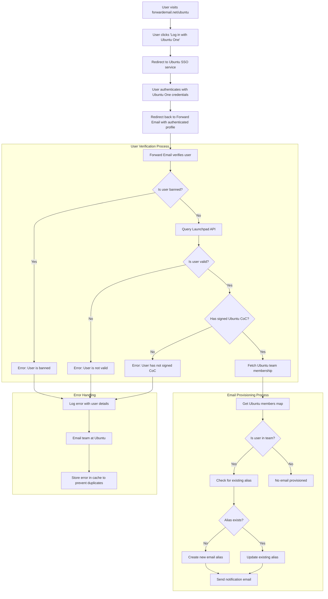

# Caso di studio: come Canonical potenzia la gestione della posta elettronica di Ubuntu con la soluzione aziendale open source di Forward Email {#case-study-how-canonical-powers-ubuntu-email-management-with-forward-emails-open-source-enterprise-solution}


## Indice {#table-of-contents}

* [Prefazione](#foreword)
* [La sfida: gestire un ecosistema di posta elettronica complesso](#the-challenge-managing-a-complex-email-ecosystem)
* [Punti chiave](#key-takeaways)
* [Perché inoltrare le e-mail](#why-forward-email)
* [L'implementazione: integrazione SSO senza soluzione di continuità](#the-implementation-seamless-sso-integration)
  * [Visualizzazione del flusso di autenticazione](#authentication-flow-visualization)
  * [Dettagli di implementazione tecnica](#technical-implementation-details)
* [Configurazione DNS e routing della posta elettronica](#dns-configuration-and-email-routing)
* [Risultati: gestione semplificata della posta elettronica e sicurezza migliorata](#results-streamlined-email-management-and-enhanced-security)
  * [Efficienza operativa](#operational-efficiency)
  * [Sicurezza e privacy migliorate](#enhanced-security-and-privacy)
  * [Risparmio sui costi](#cost-savings)
  * [Esperienza di collaborazione migliorata](#improved-contributor-experience)
* [Guardando al futuro: collaborazione continua](#looking-forward-continued-collaboration)
* [Conclusione: una partnership open source perfetta](#conclusion-a-perfect-open-source-partnership)
* [Supporto ai clienti aziendali](#supporting-enterprise-clients)
  * [Contattaci](#get-in-touch)
  * [Informazioni su Inoltra e-mail](#about-forward-email)

## Prefazione {#foreword}

Nel mondo del software open source, pochi nomi hanno lo stesso peso di [Canonico](https://en.wikipedia.org/wiki/Canonical_\(company\), l'azienda dietro [Ubuntu](https://en.wikipedia.org/wiki/Ubuntu), una delle distribuzioni Linux più diffuse al mondo. Con un vasto ecosistema che abbraccia diverse distribuzioni, tra cui Ubuntu, [Gratuito](https://en.wikipedia.org/wiki/Kubuntu), [Lubuntu](https://en.wikipedia.org/wiki/Lubuntu), [Edubuntu](https://en.wikipedia.org/wiki/Edubuntu) e altre, Canonical ha dovuto affrontare sfide uniche nella gestione degli indirizzi email sui suoi numerosi domini. Questo case study esplora la collaborazione tra Canonical e Forward Email per creare una soluzione di gestione della posta elettronica aziendale fluida, sicura e incentrata sulla privacy, in perfetta sintonia con i valori dell'azienda in ambito open source.

## La sfida: gestire un ecosistema di posta elettronica complesso {#the-challenge-managing-a-complex-email-ecosystem}

L'ecosistema di Canonical è diversificato e in continua espansione. Con milioni di utenti in tutto il mondo e migliaia di collaboratori impegnati in vari progetti, la gestione di indirizzi email su più domini ha presentato sfide significative. I collaboratori principali necessitavano di indirizzi email ufficiali (@ubuntu.com, @kubuntu.org, ecc.) che riflettessero il loro coinvolgimento nel progetto, mantenendo al contempo la sicurezza e la facilità d'uso attraverso un solido sistema di gestione dei domini Ubuntu.

Prima di implementare Forward Email, Canonical aveva difficoltà con:

* Gestire indirizzi email su più domini (@ubuntu.com, @kubuntu.org, @lubuntu.me, @edubuntu.org e @ubuntu.net)
* Offrire un'esperienza email coerente ai collaboratori principali
* Integrare i servizi email con il loro sistema Single Sign-On (SSO) [Ubuntu One](https://en.wikipedia.org/wiki/Ubuntu_One) esistente
* Trovare una soluzione in linea con il loro impegno per la privacy, la sicurezza e la sicurezza email open source
* Scalare la loro infrastruttura email sicura in modo economicamente vantaggioso

## Punti chiave {#key-takeaways}

* Canonical ha implementato con successo una soluzione di gestione email unificata su più domini Ubuntu
* L'approccio open source al 100% di Forward Email è perfettamente in linea con i valori di Canonical
* L'integrazione SSO con Ubuntu One offre un'autenticazione fluida per i collaboratori
* La crittografia a prova di quantum garantisce la sicurezza a lungo termine di tutte le comunicazioni email
* La soluzione è scalabile in modo economicamente vantaggioso per supportare la crescente base di collaboratori di Canonical

## Perché inoltrare l'email {#why-forward-email}

Essendo l'unico fornitore di servizi di posta elettronica open source al 100% con particolare attenzione alla privacy e alla sicurezza, Forward Email si è rivelata la soluzione ideale per le esigenze di inoltro delle email aziendali di Canonical. I nostri valori si allineavano perfettamente con l'impegno di Canonical per il software open source e la privacy.

I fattori chiave che hanno reso Forward Email la scelta ideale sono stati:

1. **Codice sorgente open source completo**: l'intera piattaforma è open source e disponibile su [GitHub](https://en.wikipedia.org/wiki/GitHub), garantendo trasparenza e contributi alla community. A differenza di molti provider di posta elettronica "incentrati sulla privacy" che rendono open source solo i loro frontend mantenendo chiusi i backend, abbiamo reso disponibile l'intera base di codice, sia frontend che backend, a chiunque voglia consultarla su [GitHub](https://github.com/forwardemail/forwardemail.net).

2. **Approccio incentrato sulla privacy**: a differenza di altri provider, non memorizziamo le email in database condivisi e utilizziamo una crittografia avanzata con TLS. La nostra filosofia fondamentale sulla privacy è semplice: **le tue email appartengono a te e solo a te**. Questo principio guida ogni decisione tecnica che prendiamo, dalla gestione dell'inoltro delle email all'implementazione della crittografia.

3. **Nessun affidamento a terze parti**: non utilizziamo Amazon SES o altri servizi di terze parti, il che ci consente di avere il controllo completo sull'infrastruttura di posta elettronica ed eliminare potenziali perdite di privacy tramite servizi di terze parti.

4. **Scalabilità conveniente**: il nostro modello di prezzi consente alle organizzazioni di scalare senza pagare per utente, rendendolo ideale per l'ampia base di collaboratori di Canonical.

5. **Crittografia resistente ai quantum**: Utilizziamo caselle di posta SQLite crittografate individualmente con [ChaCha20-Poly1305](https://en.wikipedia.org/wiki/ChaCha20-Poly1305) come cifrario per [crittografia resistente ai quanti](/blog/docs/best-quantum-safe-encrypted-email-service). Ogni casella di posta è un file crittografato separato, il che significa che l'accesso ai dati di un utente non garantisce l'accesso ad altri.

## Implementazione: integrazione SSO senza interruzioni {#the-implementation-seamless-sso-integration}

Uno degli aspetti più critici dell'implementazione è stata l'integrazione con il sistema Single Sign-On Ubuntu One di Canonical. Questa integrazione avrebbe consentito ai collaboratori principali di gestire i propri indirizzi email @ubuntu.com utilizzando le credenziali Ubuntu One esistenti.

### Visualizzazione del flusso di autenticazione {#authentication-flow-visualization}

Il diagramma seguente illustra il flusso completo di autenticazione e provisioning della posta elettronica:



### Dettagli di implementazione tecnica {#technical-implementation-details}

L'integrazione tra Forward Email e Ubuntu One SSO è stata realizzata tramite un'implementazione personalizzata della strategia di autenticazione Passport-Ubuntu. Ciò ha consentito un flusso di autenticazione fluido tra i sistemi di Ubuntu One e Forward Email.

#### Il flusso di autenticazione {#the-authentication-flow}

Il processo di autenticazione funziona come segue:

1. Gli utenti visitano la pagina dedicata alla gestione delle email di Ubuntu all'indirizzo [forwardemail.net/ubuntu](https://forwardemail.net/ubuntu)
2. Cliccano su "Accedi con Ubuntu One" e vengono reindirizzati al servizio Ubuntu SSO
3. Dopo l'autenticazione con le credenziali di Ubuntu One, vengono reindirizzati a Inoltra Email con il loro profilo autenticato
4. Inoltra Email verifica lo stato di collaboratore e gestisce o gestisce il loro indirizzo email di conseguenza

L'implementazione tecnica ha sfruttato il pacchetto [`passport-ubuntu`](https://www.npmjs.com/package/passport-ubuntu), che è una strategia [Passaporto](https://www.npmjs.com/package/passport) per l'autenticazione con Ubuntu tramite [OpenID](https://en.wikipedia.org/wiki/OpenID). La configurazione includeva:

```javascript
passport.use(new UbuntuStrategy({
  returnURL: process.env.UBUNTU_CALLBACK_URL,
  realm: process.env.UBUNTU_REALM,
  stateless: true
}, function(identifier, profile, done) {
  // User verification and email provisioning logic
}));
```

#### Integrazione e convalida dell'API Launchpad {#launchpad-api-integration-and-validation}

Un componente fondamentale della nostra implementazione è l'integrazione con l'API di [rampa di lancio](https://en.wikipedia.org/wiki/Launchpad_\(website\)) per convalidare gli utenti Ubuntu e le loro appartenenze ai team. Abbiamo creato funzioni di supporto riutilizzabili per gestire questa integrazione in modo efficiente e affidabile.

La funzione helper `sync-ubuntu-user.js` è responsabile della convalida degli utenti tramite l'API Launchpad e della gestione dei loro indirizzi email. Ecco una versione semplificata del suo funzionamento:

```javascript
async function syncUbuntuUser(user, map) {
  try {
    // Validate user object
    if (!_.isObject(user) ||
        !isSANB(user[fields.ubuntuUsername]) ||
        !isSANB(user[fields.ubuntuProfileID]) ||
        !isEmail(user.email))
      throw new TypeError('Invalid user object');

    // Get Ubuntu members map if not provided
    if (!(map instanceof Map))
      map = await getUbuntuMembersMap(resolver);

    // Check if user is banned
    if (user[config.userFields.isBanned]) {
      throw new InvalidUbuntuUserError('User was banned', { ignoreHook: true });
    }

    // Query Launchpad API to validate user
    const url = `https://api.launchpad.net/1.0/~${user[fields.ubuntuUsername]}`;
    const response = await retryRequest(url, { resolver });
    const json = await response.body.json();

    // Validate required boolean properties
    if (!json.is_valid)
      throw new InvalidUbuntuUserError('Property "is_valid" was false');

    if (!json.is_ubuntu_coc_signer)
      throw new InvalidUbuntuUserError('Property "is_ubuntu_coc_signer" was false');

    // Process each domain for the user
    await pMap([...map.keys()], async (name) => {
      // Find domain in database
      const domain = await Domains.findOne({
        name,
        plan: 'team',
        has_txt_record: true
      }).populate('members.user');

      // Process user's email alias for this domain
      if (map.get(name).has(user[fields.ubuntuUsername])) {
        // User is a member of this team, create or update alias
        let alias = await Aliases.findOne({
          user: user._id,
          domain: domain._id,
          name: user[fields.ubuntuUsername].toLowerCase()
        });

        if (!alias) {
          // Create new alias with appropriate error handling
          alias = await Aliases.create({
            user: user._id,
            domain: domain._id,
            name: user[fields.ubuntuUsername].toLowerCase(),
            recipients: [user.email],
            locale: user[config.lastLocaleField],
            is_enabled: true
          });

          // Notify admins about new alias creation
          await emailHelper({
            template: 'alert',
            message: {
              to: adminEmailsForDomain,
              subject: `New @${domain.name} email address created`
            },
            locals: {
              message: `A new email address ${user[fields.ubuntuUsername].toLowerCase()}@${domain.name} was created for ${user.email}`
            }
          });
        }
      }
    });

    return true;
  } catch (err) {
    // Handle and log errors
    await logErrorWithUser(err, user);
    throw err;
  }
}
```

Per semplificare la gestione delle appartenenze ai team nei diversi domini Ubuntu, abbiamo creato una mappatura semplice tra i nomi di dominio e i corrispondenti team di Launchpad:

```javascript
ubuntuTeamMapping: {
  'ubuntu.com': '~ubuntumembers',
  'kubuntu.org': '~kubuntu-members',
  'lubuntu.me': '~lubuntu-members',
  'edubuntu.org': '~edubuntu-members',
  'ubuntustudio.com': '~ubuntustudio-core',
  'ubuntu.net': '~ubuntu-smtp-test'
},
```

Questa semplice mappatura ci consente di automatizzare il processo di verifica delle appartenenze ai team e di provisioning degli indirizzi e-mail, semplificando la manutenzione e l'estensione del sistema con l'aggiunta di nuovi domini.

#### Gestione degli errori e notifiche {#error-handling-and-notifications}

Abbiamo implementato un solido sistema di gestione degli errori che:

1. Registra tutti gli errori con informazioni dettagliate sull'utente
2. Invia email al team di Ubuntu quando vengono rilevati problemi
3. Notifica agli amministratori quando nuovi collaboratori si iscrivono e creano indirizzi email
4. Gestisce casi limite, come quelli degli utenti che non hanno firmato il Codice di Condotta di Ubuntu

In questo modo si garantisce che eventuali problemi vengano rapidamente identificati e risolti, preservando l'integrità del sistema di posta elettronica.

## Configurazione DNS e routing e-mail {#dns-configuration-and-email-routing}

Per ogni dominio gestito tramite Forward Email, Canonical ha aggiunto un semplice record DNS TXT per la convalida:

```sh
❯ dig ubuntu.com txt
ubuntu.com.             600     IN      TXT     "forward-email-site-verification=6IsURgl2t7"
```

Questo record di verifica conferma la proprietà del dominio e consente al nostro sistema di gestire in modo sicuro le email per questi domini. Canonical instrada la posta attraverso il nostro servizio tramite Postfix, che fornisce un'infrastruttura di recapito email affidabile e sicura.

## Risultati: gestione semplificata della posta elettronica e sicurezza migliorata {#results-streamlined-email-management-and-enhanced-security}

L'implementazione della soluzione aziendale Forward Email ha apportato notevoli vantaggi alla gestione della posta elettronica di Canonical in tutti i suoi domini:

### Efficienza operativa {#operational-efficiency}

* **Gestione centralizzata**: tutti i domini relativi a Ubuntu sono ora gestiti tramite un'unica interfaccia
* **Riduzione dei costi amministrativi**: provisioning automatizzato e gestione self-service per i collaboratori
* **Onboarding semplificato**: i nuovi collaboratori possono ottenere rapidamente i loro indirizzi email ufficiali

### Sicurezza e privacy migliorate {#enhanced-security-and-privacy}

* **Crittografia end-to-end**: tutte le email sono crittografate utilizzando standard avanzati
* **Nessun database condiviso**: le email di ogni utente vengono archiviate in database SQLite crittografati individuali, offrendo un approccio di crittografia sandbox fondamentalmente più sicuro dei tradizionali database relazionali condivisi
* **Sicurezza open source**: la base di codice trasparente consente revisioni di sicurezza da parte della community
* **Elaborazione in memoria**: non memorizziamo le email inoltrate su disco, migliorando la protezione della privacy
* **Nessuna archiviazione di metadati**: non conserviamo i dati di chi invia email a chi, a differenza di molti provider di posta elettronica

### Risparmio sui costi {#cost-savings}

* **Modello di prezzo scalabile**: Nessun costo per utente, consentendo a Canonical di aggiungere collaboratori senza aumentare i costi
* **Riduzione delle esigenze infrastrutturali**: Nessuna necessità di gestire server di posta elettronica separati per domini diversi
* **Riduzione dei requisiti di supporto**: La gestione self-service riduce i ticket di supporto IT

### Esperienza di collaborazione migliorata {#improved-contributor-experience}

* **Autenticazione senza interruzioni**: Single Sign-On con le credenziali Ubuntu One esistenti
* **Branding coerente**: Esperienza unificata su tutti i servizi correlati a Ubuntu
* **Invio email affidabile**: La reputazione IP di alta qualità garantisce che le email raggiungano la destinazione

L'integrazione con Forward Email ha notevolmente semplificato il processo di gestione delle email di Canonical. I collaboratori ora possono gestire i propri indirizzi email @ubuntu.com in modo fluido, con una riduzione del carico amministrativo e una maggiore sicurezza.

## Guardando al futuro: collaborazione continua {#looking-forward-continued-collaboration}

La partnership tra Canonical e Forward Email continua a evolversi. Stiamo collaborando a diverse iniziative:

* Espansione dei servizi di posta elettronica ad altri domini correlati a Ubuntu
* Miglioramento dell'interfaccia utente in base al feedback dei collaboratori
* Implementazione di funzionalità di sicurezza aggiuntive
* Esplorazione di nuovi modi per sfruttare la nostra collaborazione open source

## Conclusione: una partnership open source perfetta {#conclusion-a-perfect-open-source-partnership}

La collaborazione tra Canonical e Forward Email dimostra la forza delle partnership basate su valori condivisi. Scegliendo Forward Email come fornitore di servizi di posta elettronica, Canonical ha trovato una soluzione che non solo soddisfaceva i propri requisiti tecnici, ma era anche perfettamente in linea con il proprio impegno verso software open source, privacy e sicurezza.

Per le organizzazioni che gestiscono più domini e richiedono un'autenticazione fluida con i sistemi esistenti, Forward Email offre una soluzione flessibile, sicura e incentrata sulla privacy. Il nostro [approccio open source](https://forwardemail.net/blog/docs/why-open-source-email-security-privacy) garantisce trasparenza e consente il contributo della community, rendendolo la scelta ideale per le organizzazioni che apprezzano questi principi.

Mentre Canonical e Forward Email continuano a innovare nei rispettivi campi, questa partnership è una testimonianza della potenza della collaborazione open source e dei valori condivisi nella creazione di soluzioni efficaci.

Puoi controllare il nostro [stato del servizio in tempo reale](https://status.forwardemail.net) per vedere le nostre attuali prestazioni di recapito delle email, che monitoriamo costantemente per garantire un'elevata reputazione IP e la recapitabilità delle email.

## Supporto ai clienti aziendali {#supporting-enterprise-clients}

Sebbene questo case study si concentri sulla nostra partnership con Canonical, Forward Email è orgogliosa di supportare numerosi clienti aziendali in vari settori che apprezzano il nostro impegno nei confronti della privacy, della sicurezza e dei principi open source.

Le nostre soluzioni aziendali sono studiate su misura per soddisfare le esigenze specifiche di organizzazioni di tutte le dimensioni, offrendo:

* Dominio personalizzato [gestione della posta elettronica](/) su più domini
* Integrazione perfetta con i sistemi di autenticazione esistenti
* Canale di supporto chat Matrix dedicato
* Funzionalità di sicurezza avanzate, tra cui [crittografia resistente ai quanti](/blog/docs/best-quantum-safe-encrypted-email-service)
* Portabilità e proprietà complete dei dati
* Infrastruttura open source al 100% per trasparenza e fiducia

### Contattaci {#get-in-touch}

Se la tua organizzazione ha esigenze di posta elettronica aziendale o sei interessato a saperne di più su come Forward Email può aiutarti a semplificare la gestione della posta elettronica migliorando al contempo la privacy e la sicurezza, saremo lieti di ricevere il tuo feedback:

* Inviaci un'email direttamente a `support@forwardemail.net`
* Invia una richiesta di assistenza a [pagina di aiuto](https://forwardemail.net/help)
* Consulta [pagina dei prezzi](https://forwardemail.net/pricing) per i piani aziendali

Il nostro team è pronto a discutere le tue esigenze specifiche e a sviluppare una soluzione personalizzata in linea con i valori e le esigenze tecniche della tua organizzazione.

### Informazioni su Inoltra email {#about-forward-email}

Forward Email è il servizio di posta elettronica open source al 100% e incentrato sulla privacy. Offriamo servizi di inoltro email personalizzati, SMTP, IMAP e POP3, con particolare attenzione a sicurezza, privacy e trasparenza. L'intero codice sorgente è disponibile su [GitHub](https://github.com/forwardemail/forwardemail.net) e ci impegniamo a fornire servizi di posta elettronica che rispettino la privacy e la sicurezza degli utenti. Scopri di più su [perché la posta elettronica open source è il futuro](https://forwardemail.net/blog/docs/why-open-source-email-security-privacy), [come funziona il nostro inoltro e-mail](https://forwardemail.net/blog/docs/best-email-forwarding-service) e [il nostro approccio alla protezione della privacy della posta elettronica](https://forwardemail.net/blog/docs/email-privacy-protection-technical-implementation).