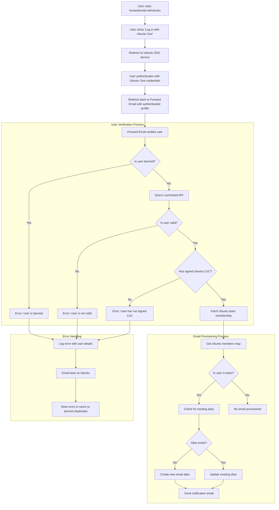

# Caso di Studio: Come Canonical Potenzia la Gestione delle Email di Ubuntu con la Soluzione Enterprise Open-Source di Forward Email {#case-study-how-canonical-powers-ubuntu-email-management-with-forward-emails-open-source-enterprise-solution}


## Indice {#table-of-contents}

* [Prefazione](#foreword)
* [La Sfida: Gestire un Ecosistema Email Complesso](#the-challenge-managing-a-complex-email-ecosystem)
* [Punti Chiave](#key-takeaways)
* [Perché Forward Email](#why-forward-email)
* [L'Implementazione: Integrazione SSO Senza Soluzione di Continuità](#the-implementation-seamless-sso-integration)
  * [Visualizzazione del Flusso di Autenticazione](#authentication-flow-visualization)
  * [Dettagli Tecnici dell'Implementazione](#technical-implementation-details)
* [Configurazione DNS e Instradamento Email](#dns-configuration-and-email-routing)
* [Risultati: Gestione Email Semplificata e Sicurezza Migliorata](#results-streamlined-email-management-and-enhanced-security)
  * [Efficienza Operativa](#operational-efficiency)
  * [Sicurezza e Privacy Potenziate](#enhanced-security-and-privacy)
  * [Risparmio sui Costi](#cost-savings)
  * [Esperienza Migliorata per i Collaboratori](#improved-contributor-experience)
* [Prospettive Future: Collaborazione Continua](#looking-forward-continued-collaboration)
* [Conclusione: Una Partnership Open-Source Perfetta](#conclusion-a-perfect-open-source-partnership)
* [Supporto ai Clienti Enterprise](#supporting-enterprise-clients)
  * [Contattaci](#get-in-touch)
  * [Informazioni su Forward Email](#about-forward-email)


## Prefazione {#foreword}

Nel mondo del software open-source, pochi nomi hanno un peso pari a quello di [Canonical](https://en.wikipedia.org/wiki/Canonical_\(company\)), l’azienda dietro a [Ubuntu](https://en.wikipedia.org/wiki/Ubuntu), una delle distribuzioni Linux più popolari a livello globale. Con un vasto ecosistema che comprende molteplici distribuzioni tra cui Ubuntu, [Kubuntu](https://en.wikipedia.org/wiki/Kubuntu), [Lubuntu](https://en.wikipedia.org/wiki/Lubuntu), [Edubuntu](https://en.wikipedia.org/wiki/Edubuntu) e altre, Canonical ha affrontato sfide uniche nella gestione degli indirizzi email attraverso i loro numerosi domini. Questo caso di studio esplora come Canonical abbia collaborato con Forward Email per creare una soluzione di gestione email aziendale fluida, sicura e focalizzata sulla privacy, perfettamente in linea con i loro valori open-source.


## La Sfida: Gestire un Ecosistema Email Complesso {#the-challenge-managing-a-complex-email-ecosystem}

L’ecosistema di Canonical è diversificato ed esteso. Con milioni di utenti in tutto il mondo e migliaia di collaboratori su vari progetti, gestire gli indirizzi email su molteplici domini ha rappresentato una sfida significativa. I collaboratori principali necessitavano di indirizzi email ufficiali (@ubuntu.com, @kubuntu.org, ecc.) che riflettessero il loro coinvolgimento nel progetto, mantenendo al contempo sicurezza e facilità d’uso tramite un sistema robusto di gestione dei domini Ubuntu.

Prima di implementare Forward Email, Canonical ha avuto difficoltà con:

* Gestire indirizzi email su molteplici domini (@ubuntu.com, @kubuntu.org, @lubuntu.me, @edubuntu.org e @ubuntu.net)
* Fornire un’esperienza email coerente per i collaboratori principali
* Integrare i servizi email con il loro sistema Single Sign-On (SSO) [Ubuntu One](https://en.wikipedia.org/wiki/Ubuntu_One) esistente
* Trovare una soluzione in linea con il loro impegno per la privacy, la sicurezza e la sicurezza email open-source
* Scalare la loro infrastruttura email sicura in modo economicamente sostenibile


## Punti Chiave {#key-takeaways}

* Canonical ha implementato con successo una soluzione unificata di gestione email su molteplici domini Ubuntu
* L’approccio 100% open-source di Forward Email si è allineato perfettamente con i valori di Canonical
* L’integrazione SSO con Ubuntu One offre un’autenticazione fluida per i collaboratori
* La crittografia resistente ai computer quantistici garantisce sicurezza a lungo termine per tutte le comunicazioni email
* La soluzione scala in modo economicamente sostenibile per supportare la crescente base di collaboratori di Canonical


## Perché Forward Email {#why-forward-email}
Come unico provider di servizi email 100% open-source con un focus su privacy e sicurezza, Forward Email è stata una scelta naturale per le esigenze di inoltro email aziendale di Canonical. I nostri valori si allineano perfettamente con l'impegno di Canonical verso il software open-source e la privacy.

I fattori chiave che hanno reso Forward Email la scelta ideale includevano:

1. **Codice completamente open-source**: L'intera nostra piattaforma è open-source e disponibile su [GitHub](https://en.wikipedia.org/wiki/GitHub), permettendo trasparenza e contributi dalla community. A differenza di molti provider email "focalizzati sulla privacy" che rendono open-source solo i loro frontend mantenendo chiusi i backend, abbiamo reso disponibile l'intero codice—sia frontend che backend—per chiunque voglia ispezionarlo su [GitHub](https://github.com/forwardemail/forwardemail.net).

2. **Approccio incentrato sulla privacy**: A differenza di altri provider, non memorizziamo le email in database condivisi e utilizziamo una crittografia robusta con TLS. La nostra filosofia fondamentale sulla privacy è semplice: **le tue email ti appartengono e solo a te**. Questo principio guida ogni decisione tecnica che prendiamo, da come gestiamo l'inoltro delle email a come implementiamo la crittografia.

3. **Nessuna dipendenza da terze parti**: Non utilizziamo Amazon SES o altri servizi di terze parti, garantendoci il completo controllo sull'infrastruttura email ed eliminando potenziali fughe di privacy tramite servizi esterni.

4. **Scalabilità economica**: Il nostro modello di pricing permette alle organizzazioni di scalare senza pagare per utente, rendendolo ideale per la vasta base di contributori di Canonical.

5. **Crittografia resistente ai quantum**: Utilizziamo caselle di posta SQLite criptate singolarmente con [ChaCha20-Poly1305](https://en.wikipedia.org/wiki/ChaCha20-Poly1305) come cifrario per la [crittografia resistente ai quantum](/blog/docs/best-quantum-safe-encrypted-email-service). Ogni casella è un file criptato separato, il che significa che l'accesso ai dati di un utente non concede accesso a quelli degli altri.


## L'Implementazione: Integrazione SSO senza soluzione di continuità {#the-implementation-seamless-sso-integration}

Uno degli aspetti più critici dell'implementazione è stata l'integrazione con il sistema SSO Ubuntu One esistente di Canonical. Questa integrazione avrebbe permesso ai contributori principali di gestire i loro indirizzi email @ubuntu.com utilizzando le credenziali Ubuntu One già esistenti.

### Visualizzazione del Flusso di Autenticazione {#authentication-flow-visualization}

Il diagramma seguente illustra il flusso completo di autenticazione e provisioning email:


```mermaid
flowchart TD
    A[User visits forwardemail.net/ubuntu] --> B[User clicks 'Log in with Ubuntu One']
    B --> C[Redirect to Ubuntu SSO service]
    C --> D[User authenticates with Ubuntu One credentials]
    D --> E[Redirect back to Forward Email with authenticated profile]
    E --> F[Forward Email verifies user]

    subgraph "User Verification Process"
        F --> G{Is user banned?}
        G -->|Yes| H[Error: User is banned]
        G -->|No| I[Query Launchpad API]
        I --> J{Is user valid?}
        J -->|No| K[Error: User is not valid]
        J -->|Yes| L{Has signed Ubuntu CoC?}
        L -->|No| M[Error: User has not signed CoC]
        L -->|Yes| N[Fetch Ubuntu team membership]
    end

    subgraph "Email Provisioning Process"
        N --> O[Get Ubuntu members map]
        O --> P{Is user in team?}
        P -->|Yes| Q[Check for existing alias]
        Q --> R{Alias exists?}
        R -->|No| S[Create new email alias]
        R -->|Yes| T[Update existing alias]
        S --> U[Send notification email]
        T --> U
        P -->|No| V[No email provisioned]
    end

    subgraph "Error Handling"
        H --> W[Log error with user details]
        K --> W
        M --> W
        W --> X[Email team at Ubuntu]
        X --> Y[Store error in cache to prevent duplicates]
    end
```

### Dettagli Tecnici dell'Implementazione {#technical-implementation-details}

L'integrazione tra Forward Email e Ubuntu One SSO è stata realizzata tramite un'implementazione personalizzata della strategia di autenticazione passport-ubuntu. Questo ha permesso un flusso di autenticazione fluido tra Ubuntu One e i sistemi di Forward Email.
#### Il Flusso di Autenticazione {#the-authentication-flow}

Il processo di autenticazione funziona come segue:

1. Gli utenti visitano la pagina dedicata alla gestione delle email Ubuntu su [forwardemail.net/ubuntu](https://forwardemail.net/ubuntu)
2. Cliccano su "Accedi con Ubuntu One" e vengono reindirizzati al servizio SSO di Ubuntu
3. Dopo essersi autenticati con le credenziali Ubuntu One, vengono reindirizzati a Forward Email con il loro profilo autenticato
4. Forward Email verifica il loro stato di contributore e provvede a fornire o gestire il loro indirizzo email di conseguenza

L'implementazione tecnica ha utilizzato il pacchetto [`passport-ubuntu`](https://www.npmjs.com/package/passport-ubuntu), che è una strategia [Passport](https://www.npmjs.com/package/passport) per autenticarsi con Ubuntu usando [OpenID](https://en.wikipedia.org/wiki/OpenID). La configurazione includeva:

```javascript
passport.use(new UbuntuStrategy({
  returnURL: process.env.UBUNTU_CALLBACK_URL,
  realm: process.env.UBUNTU_REALM,
  stateless: true
}, function(identifier, profile, done) {
  // Logica di verifica utente e provisioning email
}));
```

#### Integrazione e Validazione API Launchpad {#launchpad-api-integration-and-validation}

Un componente critico della nostra implementazione è l'integrazione con l'API di [Launchpad](https://en.wikipedia.org/wiki/Launchpad_\(website\)) per validare gli utenti Ubuntu e le loro appartenenze ai team. Abbiamo creato funzioni helper riutilizzabili per gestire questa integrazione in modo efficiente e affidabile.

La funzione helper `sync-ubuntu-user.js` è responsabile della validazione degli utenti tramite l'API Launchpad e della gestione dei loro indirizzi email. Ecco una versione semplificata di come funziona:

```javascript
async function syncUbuntuUser(user, map) {
  try {
    // Validare l'oggetto utente
    if (!_.isObject(user) ||
        !isSANB(user[fields.ubuntuUsername]) ||
        !isSANB(user[fields.ubuntuProfileID]) ||
        !isEmail(user.email))
      throw new TypeError('Oggetto utente non valido');

    // Ottenere la mappa dei membri Ubuntu se non fornita
    if (!(map instanceof Map))
      map = await getUbuntuMembersMap(resolver);

    // Verificare se l'utente è bannato
    if (user[config.userFields.isBanned]) {
      throw new InvalidUbuntuUserError('Utente bannato', { ignoreHook: true });
    }

    // Interrogare l'API Launchpad per validare l'utente
    const url = `https://api.launchpad.net/1.0/~${user[fields.ubuntuUsername]}`;
    const response = await retryRequest(url, { resolver });
    const json = await response.body.json();

    // Validare le proprietà boolean richieste
    if (!json.is_valid)
      throw new InvalidUbuntuUserError('La proprietà "is_valid" era falsa');

    if (!json.is_ubuntu_coc_signer)
      throw new InvalidUbuntuUserError('La proprietà "is_ubuntu_coc_signer" era falsa');

    // Processare ogni dominio per l'utente
    await pMap([...map.keys()], async (name) => {
      // Trovare il dominio nel database
      const domain = await Domains.findOne({
        name,
        plan: 'team',
        has_txt_record: true
      }).populate('members.user');

      // Processare l'alias email dell'utente per questo dominio
      if (map.get(name).has(user[fields.ubuntuUsername])) {
        // L'utente è membro di questo team, creare o aggiornare alias
        let alias = await Aliases.findOne({
          user: user._id,
          domain: domain._id,
          name: user[fields.ubuntuUsername].toLowerCase()
        });

        if (!alias) {
          // Creare un nuovo alias con gestione appropriata degli errori
          alias = await Aliases.create({
            user: user._id,
            domain: domain._id,
            name: user[fields.ubuntuUsername].toLowerCase(),
            recipients: [user.email],
            locale: user[config.lastLocaleField],
            is_enabled: true
          });

          // Notificare gli amministratori della creazione del nuovo alias
          await emailHelper({
            template: 'alert',
            message: {
              to: adminEmailsForDomain,
              subject: `Nuovo indirizzo email @${domain.name} creato`
            },
            locals: {
              message: `Un nuovo indirizzo email ${user[fields.ubuntuUsername].toLowerCase()}@${domain.name} è stato creato per ${user.email}`
            }
          });
        }
      }
    });

    return true;
  } catch (err) {
    // Gestire e registrare gli errori
    await logErrorWithUser(err, user);
    throw err;
  }
}
```
Per semplificare la gestione delle appartenenze ai team tra i diversi domini Ubuntu, abbiamo creato una mappatura semplice tra i nomi dei domini e i rispettivi team Launchpad:

```javascript
ubuntuTeamMapping: {
  'ubuntu.com': '~ubuntumembers',
  'kubuntu.org': '~kubuntu-members',
  'lubuntu.me': '~lubuntu-members',
  'edubuntu.org': '~edubuntu-members',
  'ubuntustudio.com': '~ubuntustudio-core',
  'ubuntu.net': '~ubuntu-smtp-test'
},
```

Questa mappatura semplice ci permette di automatizzare il processo di verifica delle appartenenze ai team e la creazione degli indirizzi email, rendendo il sistema facile da mantenere ed estendere man mano che vengono aggiunti nuovi domini.

#### Gestione degli Errori e Notifiche {#error-handling-and-notifications}

Abbiamo implementato un sistema robusto di gestione degli errori che:

1. Registra tutti gli errori con informazioni dettagliate sull’utente
2. Invia email al team Ubuntu quando vengono rilevati problemi
3. Notifica gli amministratori quando nuovi contributori si registrano e viene creato un indirizzo email
4. Gestisce casi limite come utenti che non hanno firmato il Codice di Condotta di Ubuntu

Questo garantisce che eventuali problemi vengano rapidamente identificati e risolti, mantenendo l’integrità del sistema email.


## Configurazione DNS e Instradamento Email {#dns-configuration-and-email-routing}

Per ogni dominio gestito tramite Forward Email, Canonical ha aggiunto un semplice record DNS TXT per la validazione:

```sh
❯ dig ubuntu.com txt
ubuntu.com.             600     IN      TXT     "forward-email-site-verification=6IsURgl2t7"
```

Questo record di verifica conferma la proprietà del dominio e permette al nostro sistema di gestire in modo sicuro le email per questi domini. Canonical instrada la posta attraverso il nostro servizio tramite Postfix, che fornisce un’infrastruttura affidabile e sicura per la consegna delle email.


## Risultati: Gestione Email Semplificata e Sicurezza Migliorata {#results-streamlined-email-management-and-enhanced-security}

L’implementazione della soluzione enterprise di Forward Email ha portato benefici significativi nella gestione delle email di Canonical su tutti i loro domini:

### Efficienza Operativa {#operational-efficiency}

* **Gestione centralizzata**: Tutti i domini legati a Ubuntu sono ora gestiti tramite un’unica interfaccia
* **Riduzione del carico amministrativo**: Provisioning automatizzato e gestione self-service per i contributori
* **Onboarding semplificato**: I nuovi contributori possono ottenere rapidamente i loro indirizzi email ufficiali

### Sicurezza e Privacy Migliorate {#enhanced-security-and-privacy}

* **Crittografia end-to-end**: Tutte le email sono criptate utilizzando standard avanzati
* **Nessun database condiviso**: Le email di ogni utente sono archiviate in database SQLite criptati individuali, offrendo un approccio sandboxed alla crittografia che è fondamentalmente più sicuro rispetto ai tradizionali database relazionali condivisi
* **Sicurezza open-source**: Il codice trasparente permette revisioni di sicurezza da parte della comunità
* **Elaborazione in memoria**: Non memorizziamo le email inoltrate su disco, migliorando la protezione della privacy
* **Nessuna memorizzazione di metadata**: Non conserviamo registri di chi invia email a chi, a differenza di molti provider email

### Risparmio sui Costi {#cost-savings}

* **Modello di prezzo scalabile**: Nessun costo per utente, permettendo a Canonical di aggiungere contributori senza aumentare i costi
* **Riduzione delle necessità infrastrutturali**: Non è necessario mantenere server email separati per i diversi domini
* **Minori esigenze di supporto**: La gestione self-service riduce i ticket di supporto IT

### Miglioramento dell’Esperienza del Contributore {#improved-contributor-experience}

* **Autenticazione senza interruzioni**: Single sign-on con le credenziali Ubuntu One esistenti
* **Branding coerente**: Esperienza unificata su tutti i servizi legati a Ubuntu
* **Consegna email affidabile**: Reputazione IP di alta qualità che garantisce la ricezione delle email

L’integrazione con Forward Email ha notevolmente semplificato il processo di gestione delle email di Canonical. I contributori ora hanno un’esperienza fluida nella gestione dei loro indirizzi email @ubuntu.com, con un carico amministrativo ridotto e una sicurezza migliorata.


## Prospettive Future: Collaborazione Continua {#looking-forward-continued-collaboration}

La partnership tra Canonical e Forward Email continua a evolversi. Stiamo lavorando insieme su diverse iniziative:
* Espansione dei servizi email a ulteriori domini correlati a Ubuntu
* Miglioramento dell'interfaccia utente basato sul feedback dei contributori
* Implementazione di funzionalità di sicurezza aggiuntive
* Esplorazione di nuovi modi per sfruttare la nostra collaborazione open-source


## Conclusione: Una partnership open-source perfetta {#conclusion-a-perfect-open-source-partnership}

La collaborazione tra Canonical e Forward Email dimostra la potenza delle partnership basate su valori condivisi. Scegliendo Forward Email come loro fornitore di servizi email, Canonical ha trovato una soluzione che non solo soddisfaceva i loro requisiti tecnici, ma si allineava perfettamente anche al loro impegno verso il software open-source, la privacy e la sicurezza.

Per le organizzazioni che gestiscono più domini e richiedono un'autenticazione senza soluzione di continuità con i sistemi esistenti, Forward Email offre una soluzione flessibile, sicura e focalizzata sulla privacy. Il nostro [approccio open-source](https://forwardemail.net/blog/docs/why-open-source-email-security-privacy) garantisce trasparenza e consente contributi dalla comunità, rendendolo una scelta ideale per le organizzazioni che apprezzano questi principi.

Mentre sia Canonical che Forward Email continuano a innovare nei rispettivi campi, questa partnership rappresenta una testimonianza della forza della collaborazione open-source e dei valori condivisi nella creazione di soluzioni efficaci.

Puoi controllare il nostro [stato del servizio in tempo reale](https://status.forwardemail.net) per vedere le nostre prestazioni attuali nella consegna delle email, che monitoriamo continuamente per garantire un'elevata reputazione IP e la deliverability delle email.


## Supporto ai clienti enterprise {#supporting-enterprise-clients}

Sebbene questo case study si concentri sulla nostra partnership con Canonical, Forward Email supporta con orgoglio numerosi clienti enterprise in vari settori che apprezzano il nostro impegno per la privacy, la sicurezza e i principi open-source.

Le nostre soluzioni enterprise sono personalizzate per soddisfare le esigenze specifiche di organizzazioni di tutte le dimensioni, offrendo:

* Gestione email con dominio personalizzato [email management](/) su più domini
* Integrazione senza soluzione di continuità con i sistemi di autenticazione esistenti
* Canale di supporto dedicato su Matrix chat
* Funzionalità di sicurezza avanzate inclusa la [crittografia resistente al quantum](/blog/docs/best-quantum-safe-encrypted-email-service)
* Completa portabilità e proprietà dei dati
* Infrastruttura 100% open-source per trasparenza e fiducia

### Contattaci {#get-in-touch}

Se la tua organizzazione ha esigenze enterprise per le email o sei interessato a scoprire come Forward Email può aiutarti a semplificare la gestione delle email migliorando privacy e sicurezza, ci piacerebbe sentirti:

* Scrivici direttamente a `support@forwardemail.net`
* Invia una richiesta di assistenza sulla nostra [pagina di aiuto](https://forwardemail.net/help)
* Consulta la nostra [pagina dei prezzi](https://forwardemail.net/pricing) per i piani enterprise

Il nostro team è pronto a discutere le tue esigenze specifiche e sviluppare una soluzione personalizzata che si allinei ai valori e alle necessità tecniche della tua organizzazione.

### Informazioni su Forward Email {#about-forward-email}

Forward Email è il servizio email 100% open-source e focalizzato sulla privacy. Forniamo inoltro email con dominio personalizzato, servizi SMTP, IMAP e POP3 con un focus su sicurezza, privacy e trasparenza. L'intero nostro codice è disponibile su [GitHub](https://github.com/forwardemail/forwardemail.net), e siamo impegnati a fornire servizi email che rispettano la privacy e la sicurezza degli utenti. Scopri di più su [perché l'email open-source è il futuro](https://forwardemail.net/blog/docs/why-open-source-email-security-privacy), [come funziona il nostro inoltro email](https://forwardemail.net/blog/docs/best-email-forwarding-service) e [il nostro approccio alla protezione della privacy nelle email](https://forwardemail.net/blog/docs/email-privacy-protection-technical-implementation).
