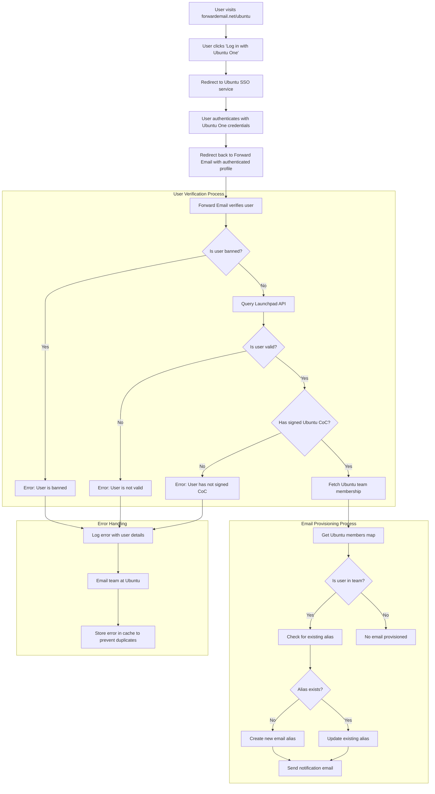

# ケーススタディ: Canonical が Forward Email のオープンソースエンタープライズソリューションを使用して Ubuntu のメール管理を強化する方法 {#case-study-how-canonical-powers-ubuntu-email-management-with-forward-emails-open-source-enterprise-solution}


## 目次 {#table-of-contents}

* [序文](#foreword)
* [課題：複雑なメールエコシステムの管理](#the-challenge-managing-a-complex-email-ecosystem)
* [重要なポイント](#key-takeaways)
* [メールを転送する理由](#why-forward-email)
* [実装: シームレスなSSO統合](#the-implementation-seamless-sso-integration)
  * [認証フローの可視化](#authentication-flow-visualization)
  * [技術的な実装の詳細](#technical-implementation-details)
* [DNS構成とメールルーティング](#dns-configuration-and-email-routing)
* [結果: 電子メール管理の合理化とセキュリティの強化](#results-streamlined-email-management-and-enhanced-security)
  * [運用効率](#operational-efficiency)
  * [強化されたセキュリティとプライバシー](#enhanced-security-and-privacy)
  * [コスト削減](#cost-savings)
  * [貢献者エクスペリエンスの向上](#improved-contributor-experience)
* [今後の展望：継続的な協力](#looking-forward-continued-collaboration)
* [結論: 完璧なオープンソースパートナーシップ](#conclusion-a-perfect-open-source-partnership)
* [エンタープライズクライアントのサポート](#supporting-enterprise-clients)
  * [お問い合わせ](#get-in-touch)
  * [メール転送について](#about-forward-email)

## 序文 {#foreword}

オープンソースソフトウェアの世界において、世界的に最も人気のあるLinuxディストリビューションの一つである[ウブントゥ](https://en.wikipedia.org/wiki/Ubuntu)を開発する企業、[正規](https://en.wikipedia.org/wiki/Canonical_\(company\)ほど影響力を持つ企業はほとんどありません。Ubuntu、[無料](https://en.wikipedia.org/wiki/Kubuntu)、[ルブントゥ](https://en.wikipedia.org/wiki/Lubuntu)、[エデュブントゥ](https://en.wikipedia.org/wiki/Edubuntu)など、複数のディストリビューションにまたがる広大なエコシステムを持つCanonicalは、多数のドメインにまたがるメールアドレスの管理において、特有の課題に直面していました。このケーススタディでは、CanonicalがForward Emailと提携し、オープンソースの価値観に完全に合致する、シームレスで安全、かつプライバシー重視のエンタープライズメール管理ソリューションを構築した方法を探ります。

## 課題: 複雑なメールエコシステムの管理 {#the-challenge-managing-a-complex-email-ecosystem}

Canonicalのエコシステムは多様で広範です。世界中に数百万人のユーザーと、様々なプロジェクトに数千人の貢献者がいるため、複数のドメインにまたがるメールアドレスの管理は大きな課題でした。コアコントリビューターは、堅牢なUbuntuドメイン管理システムを通じてセキュリティと使いやすさを維持しながら、プロジェクトへの関与を反映する公式メールアドレス（@ubuntu.com、@kubuntu.orgなど）を必要としていました。

Forward Email を実装する前、Canonical は次の問題に悩まされていました。

* 複数のドメイン（@ubuntu.com、@kubuntu.org、@lubuntu.me、@edubuntu.org、@ubuntu.net）にまたがるメールアドレスの管理
* コアコントリビューターに一貫したメールエクスペリエンスを提供する
* 既存の[Ubuntu One](https://en.wikipedia.org/wiki/Ubuntu_One)シングルサインオン（SSO）システムとメールサービスを統合する
* プライバシー、セキュリティ、オープンソースのメールセキュリティへの取り組みに沿ったソリューションを見つける
* コスト効率よく安全なメールインフラストラクチャを拡張する

## 主なポイント {#key-takeaways}

* Canonicalは、複数のUbuntuドメインにまたがる統合メール管理ソリューションの導入に成功しました。
* Forward Emailの100%オープンソースアプローチは、Canonicalの価値観と完全に一致しています。
* Ubuntu OneとのSSO統合により、コントリビューターはシームレスに認証できます。
* 耐量子暗号により、すべてのメール通信の長期的なセキュリティが確保されます。
* このソリューションは、コスト効率の高い拡張性を備え、Canonicalの拡大するコントリビューターベースをサポートします。

## メールを転送する理由 {#why-forward-email}

プライバシーとセキュリティに重点を置いた唯一の100%オープンソースのメールサービスプロバイダーであるForward Emailは、Canonicalのエンタープライズメール転送ニーズに自然に適合しました。私たちの価値観は、Canonicalのオープンソースソフトウェアとプライバシーへのコミットメントと完全に一致していました。

Forward Email が理想的な選択肢となった主な要因は次のとおりです。

1. **完全なオープンソースコードベース**：当社のプラットフォーム全体がオープンソース化されており、[GitHub](https://en.wikipedia.org/wiki/GitHub)で公開されているため、透明性とコミュニティへの貢献を実現しています。多くの「プライバシー重視」のメールプロバイダーはフロントエンドのみをオープンソース化し、バックエンドは非公開にしていますが、当社はフロントエンドとバックエンドの両方を含むコードベース全体を[GitHub](https://github.com/forwardemail/forwardemail.net)で誰でも閲覧できるようにしています。

2. **プライバシー重視のアプローチ**：他のプロバイダーとは異なり、メールを共有データベースに保存せず、TLSによる堅牢な暗号化を採用しています。私たちのプライバシーに関する基本的な理念はシンプルです。**あなたのメールはあなただけのものです**。この原則は、メール転送の処理方法から暗号化の実装方法に至るまで、私たちが行うあらゆる技術的決定の指針となっています。

3. **サードパーティへの依存なし**: Amazon SES やその他のサードパーティのサービスを使用していないため、電子メール インフラストラクチャを完全に制御でき、サードパーティのサービスによるプライバシー漏洩の可能性を排除できます。

4. **コスト効率の高いスケーリング**: 当社の価格モデルにより、組織はユーザーごとに料金を支払うことなくスケーリングできるため、Canonical の大規模な貢献者ベースに最適です。

5. **耐量子暗号**：[量子耐性暗号](/blog/docs/best-quantum-safe-encrypted-email-service)の暗号として[ChaCha20-ポリ1305](https://en.wikipedia.org/wiki/ChaCha20-Poly1305)を使用し、個別に暗号化されたSQLiteメールボックスを使用しています。各メールボックスは独立した暗号化ファイルであるため、あるユーザーのデータにアクセスしても、他のユーザーのデータへのアクセスは許可されません。

## 実装: シームレスなSSO統合 {#the-implementation-seamless-sso-integration}

実装において最も重要な点の一つは、Canonicalの既存のUbuntu One SSOシステムとの統合でした。この統合により、コアコントリビューターは既存のUbuntu One認証情報を使用して@ubuntu.comのメールアドレスを管理できるようになります。

### 認証フローの可視化 {#authentication-flow-visualization}

次の図は、完全な認証と電子メールのプロビジョニング フローを示しています。



### 技術的実装の詳細 {#technical-implementation-details}

Forward EmailとUbuntu One SSOの統合は、passport-ubuntu認証戦略のカスタム実装によって実現されました。これにより、Ubuntu OneとForward Emailのシステム間でシームレスな認証フローが実現しました。

#### 認証フロー {#the-authentication-flow}

認証プロセスは次のように機能します。

1. ユーザーは [forwardemail.net/ubuntu](https://forwardemail.net/ubuntu) にある専用の Ubuntu メール管理ページにアクセスします。
2. 「Ubuntu One でログイン」をクリックすると、Ubuntu SSO サービスにリダイレクトされます。
3. Ubuntu One の認証情報で認証すると、認証済みプロファイルを使用して Forward Email にリダイレクトされます。
4. Forward Email はユーザーの貢献者ステータスを確認し、それに応じてメールアドレスをプロビジョニングまたは管理します。

技術的な実装では、[`passport-ubuntu`](https://www.npmjs.com/package/passport-ubuntu) パッケージを活用しました。これは、[オープンID](https://en.wikipedia.org/wiki/OpenID) を使用して Ubuntu で認証するための [パスポート](https://www.npmjs.com/package/passport) 戦略です。設定には以下が含まれます。

```javascript
passport.use(new UbuntuStrategy({
  returnURL: process.env.UBUNTU_CALLBACK_URL,
  realm: process.env.UBUNTU_REALM,
  stateless: true
}, function(identifier, profile, done) {
  // User verification and email provisioning logic
}));
```

#### Launchpad API の統合と検証 {#launchpad-api-integration-and-validation}

実装の重要な要素の一つは、Ubuntuユーザーとそのチームメンバーシップを検証するための[ランチパッド](https://en.wikipedia.org/wiki/Launchpad_\(website\)のAPIとの統合です。この統合を効率的かつ確実に処理するために、再利用可能なヘルパー関数を作成しました。

`sync-ubuntu-user.js` ヘルパー関数は、Launchpad API を通じてユーザーを検証し、メールアドレスを管理する役割を担っています。その仕組みを簡略化して説明します。

```javascript
async function syncUbuntuUser(user, map) {
  try {
    // Validate user object
    if (!_.isObject(user) ||
        !isSANB(user[fields.ubuntuUsername]) ||
        !isSANB(user[fields.ubuntuProfileID]) ||
        !isEmail(user.email))
      throw new TypeError('Invalid user object');

    // Get Ubuntu members map if not provided
    if (!(map instanceof Map))
      map = await getUbuntuMembersMap(resolver);

    // Check if user is banned
    if (user[config.userFields.isBanned]) {
      throw new InvalidUbuntuUserError('User was banned', { ignoreHook: true });
    }

    // Query Launchpad API to validate user
    const url = `https://api.launchpad.net/1.0/~${user[fields.ubuntuUsername]}`;
    const response = await retryRequest(url, { resolver });
    const json = await response.body.json();

    // Validate required boolean properties
    if (!json.is_valid)
      throw new InvalidUbuntuUserError('Property "is_valid" was false');

    if (!json.is_ubuntu_coc_signer)
      throw new InvalidUbuntuUserError('Property "is_ubuntu_coc_signer" was false');

    // Process each domain for the user
    await pMap([...map.keys()], async (name) => {
      // Find domain in database
      const domain = await Domains.findOne({
        name,
        plan: 'team',
        has_txt_record: true
      }).populate('members.user');

      // Process user's email alias for this domain
      if (map.get(name).has(user[fields.ubuntuUsername])) {
        // User is a member of this team, create or update alias
        let alias = await Aliases.findOne({
          user: user._id,
          domain: domain._id,
          name: user[fields.ubuntuUsername].toLowerCase()
        });

        if (!alias) {
          // Create new alias with appropriate error handling
          alias = await Aliases.create({
            user: user._id,
            domain: domain._id,
            name: user[fields.ubuntuUsername].toLowerCase(),
            recipients: [user.email],
            locale: user[config.lastLocaleField],
            is_enabled: true
          });

          // Notify admins about new alias creation
          await emailHelper({
            template: 'alert',
            message: {
              to: adminEmailsForDomain,
              subject: `New @${domain.name} email address created`
            },
            locals: {
              message: `A new email address ${user[fields.ubuntuUsername].toLowerCase()}@${domain.name} was created for ${user.email}`
            }
          });
        }
      }
    });

    return true;
  } catch (err) {
    // Handle and log errors
    await logErrorWithUser(err, user);
    throw err;
  }
}
```

異なる Ubuntu ドメインにわたるチーム メンバーシップの管理を簡素化するために、ドメイン名とそれに対応する Launchpad チーム間の簡単なマッピングを作成しました。

```javascript
ubuntuTeamMapping: {
  'ubuntu.com': '~ubuntumembers',
  'kubuntu.org': '~kubuntu-members',
  'lubuntu.me': '~lubuntu-members',
  'edubuntu.org': '~edubuntu-members',
  'ubuntustudio.com': '~ubuntustudio-core',
  'ubuntu.net': '~ubuntu-smtp-test'
},
```

このシンプルなマッピングにより、チーム メンバーシップの確認と電子メール アドレスのプロビジョニングのプロセスを自動化できるため、新しいドメインが追加されてもシステムの保守と拡張が容易になります。

#### エラー処理と通知 {#error-handling-and-notifications}

私たちは、次のような堅牢なエラー処理システムを実装しました。

1. すべてのエラーを詳細なユーザー情報とともにログに記録します。
2. 問題が検出されると、Ubuntu チームにメールを送信します。
3. 新しいコントリビューターがサインアップし、メールアドレスが作成されると、管理者に通知します。
4. Ubuntu 行動規範に署名していないユーザーなどのエッジケースを処理します。

これにより、問題が迅速に特定され対処され、電子メール システムの整合性が維持されます。

## DNS構成とメールルーティング {#dns-configuration-and-email-routing}

Forward Email を通じて管理される各ドメインに対して、Canonical は検証用のシンプルな DNS TXT レコードを追加しました。

```sh
❯ dig ubuntu.com txt
ubuntu.com.             600     IN      TXT     "forward-email-site-verification=6IsURgl2t7"
```

この検証レコードによりドメインの所有権が確認され、Canonicalのシステムはこれらのドメインのメールを安全に管理できるようになります。Canonicalは、信頼性が高く安全なメール配信インフラストラクチャを提供するPostfixを介してメールをルーティングします。

## 結果: 合理化された電子メール管理と強化されたセキュリティ {#results-streamlined-email-management-and-enhanced-security}

Forward Email のエンタープライズ ソリューションの実装により、Canonical のすべてのドメインの電子メール管理に大きなメリットがもたらされました。

### 運用効率 {#operational-efficiency}

* **一元管理**: すべてのUbuntu関連ドメインが単一のインターフェースで管理できるようになりました
* **管理オーバーヘッドの削減**: コントリビューター向けのプロビジョニングとセルフサービス管理が自動化されました
* **オンボーディングの簡素化**: 新しいコントリビューターは公式メールアドレスをすぐに取得できます

### 強化されたセキュリティとプライバシー {#enhanced-security-and-privacy}

* **エンドツーエンド暗号化**: すべてのメールは高度な標準規格を使用して暗号化されます
* **共有データベースなし**: 各ユーザーのメールは個別に暗号化されたSQLiteデータベースに保存されます。これにより、従来の共有リレーショナルデータベースよりも根本的に安全なサンドボックス暗号化アプローチが実現します
* **オープンソースセキュリティ**: 透明性の高いコードベースにより、コミュニティによるセキュリティレビューが可能になります
* **インメモリ処理**: 転送されたメールをディスクに保存しないため、プライバシー保護が強化されます
* **メタデータ保存なし**: 多くのメールプロバイダーとは異なり、誰が誰にメールを送信したかを記録しません

### コスト削減 {#cost-savings}

* **スケーラブルな価格モデル**: ユーザーごとの料金がないため、Canonicalはコストを増やすことなくコントリビューターを追加できます
* **インフラストラクチャ要件の軽減**: ドメインごとに個別のメールサーバーを維持する必要はありません
* **サポート要件の軽減**: セルフサービス管理により、ITサポートチケットの発行数を削減

### 貢献者エクスペリエンスの向上 {#improved-contributor-experience}

* **シームレスな認証**: 既存のUbuntu One認証情報によるシングルサインオン
* **一貫したブランディング**: すべてのUbuntu関連サービスで統一されたエクスペリエンス
* **信頼性の高いメール配信**: 高品質のIPレピュテーションにより、メールが確実に宛先に届きます

Forward Emailとの統合により、Canonicalのメール管理プロセスが大幅に効率化されました。コントリビューターは、管理オーバーヘッドの削減とセキュリティ強化により、@ubuntu.comのメールアドレスをシームレスに管理できるようになりました。

## 今後の展望：継続的なコラボレーション {#looking-forward-continued-collaboration}

CanonicalとForward Emailのパートナーシップは進化を続けています。私たちは現在、いくつかの取り組みに協力しています。

* Ubuntu関連ドメインへのメールサービスの拡張
* 貢献者からのフィードバックに基づくユーザーインターフェースの強化
* 追加のセキュリティ機能の実装
* オープンソースコラボレーションを活用する新たな方法を模索

## 結論: 完璧なオープンソースパートナーシップ {#conclusion-a-perfect-open-source-partnership}

CanonicalとForward Emailのコラボレーションは、共通の価値観に基づくパートナーシップの力強さを実証しています。Canonicalは、メールサービスプロバイダーとしてForward Emailを選択することで、同社の技術要件を満たすだけでなく、オープンソースソフトウェア、プライバシー、セキュリティへのコミットメントにも完全に合致するソリューションを見つけることができました。

複数のドメインを管理し、既存のシステムとのシームレスな認証を必要とする組織にとって、Forward Emailは柔軟で安全、そしてプライバシー重視のソリューションを提供します。[オープンソースアプローチ](https://forwardemail.net/blog/docs/why-open-source-email-security-privacy)は透明性を確保し、コミュニティへの貢献を可能にするため、これらの原則を重視する組織にとって理想的な選択肢となります。

Canonical と Forward Email はそれぞれ独自の分野で革新を続けており、このパートナーシップはオープンソースのコラボレーションの力と効果的なソリューションを生み出す共通の価値観を証明するものとなっています。

[リアルタイムのサービスステータス](https://status.forwardemail.net) で、当社の現在のメール配信パフォーマンスを確認できます。当社は、高品質の IP レピュテーションとメールの配信性を確保するために、継続的にメール配信を監視しています。

## エンタープライズクライアントのサポート {#supporting-enterprise-clients}

このケーススタディは Canonical とのパートナーシップに焦点を当てていますが、Forward Email はプライバシー、セキュリティ、オープンソースの原則に対する当社の取り組みを高く評価する、さまざまな業界の多数のエンタープライズ クライアントを誇りを持ってサポートしています。

当社のエンタープライズ ソリューションは、あらゆる規模の組織の特定のニーズを満たすようにカスタマイズされており、次のようなメリットがあります。

* 複数ドメインにわたるカスタムドメイン [メール管理](/)
* 既存の認証システムとのシームレスな統合
* 専用のMatrixチャットサポートチャネル
* [量子耐性暗号](/blog/docs/best-quantum-safe-encrypted-email-service)を含む強化されたセキュリティ機能
* 完全なデータポータビリティと所有権
* 透明性と信頼性を実現する100%オープンソースのインフラストラクチャ

### お問い合わせ {#get-in-touch}

組織でエンタープライズ メールのニーズがある場合、または Forward Email がプライバシーとセキュリティを強化しながらメール管理を効率化する方法について詳しく知りたい場合は、ぜひご連絡ください。

* `support@forwardemail.net` まで直接メールでお問い合わせください。
* [ヘルプページ](https://forwardemail.net/help) までヘルプリクエストを送信してください。
* エンタープライズプランについては、[価格ページ](https://forwardemail.net/pricing) をご覧ください。

当社のチームは、お客様の特定の要件について話し合い、お客様の組織の価値観と技術的ニーズに合ったカスタマイズされたソリューションを開発する準備ができています。

### メール転送について {#about-forward-email}

Forward Emailは、100%オープンソースでプライバシーを重視したメールサービスです。セキュリティ、プライバシー、透明性を重視し、カスタムドメインメール転送、SMTP、IMAP、POP3サービスを提供しています。コードベース全体は[GitHub](https://github.com/forwardemail/forwardemail.net)で公開されており、ユーザーのプライバシーとセキュリティを尊重するメールサービスを提供することに尽力しています。[オープンソースメールが未来である理由](https://forwardemail.net/blog/docs/why-open-source-email-security-privacy)、[メール転送の仕組み](https://forwardemail.net/blog/docs/best-email-forwarding-service)、[電子メールのプライバシー保護に対する当社のアプローチ](https://forwardemail.net/blog/docs/email-privacy-protection-technical-implementation)について詳しくはこちらをご覧ください。