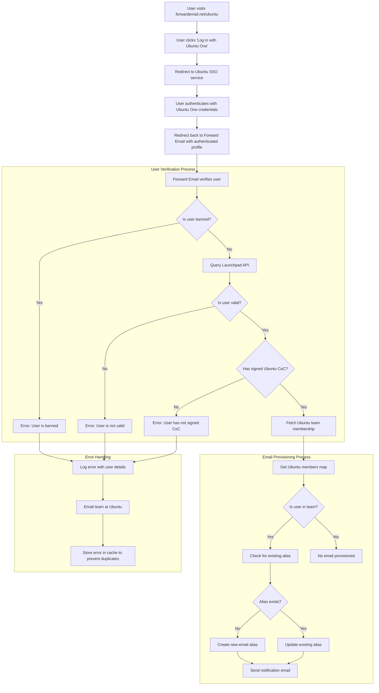

# ケーススタディ：CanonicalがForward Emailのオープンソース企業向けソリューションでUbuntuのメール管理を強化する方法 {#case-study-how-canonical-powers-ubuntu-email-management-with-forward-emails-open-source-enterprise-solution}


## 目次 {#table-of-contents}

* [序文](#foreword)
* [課題：複雑なメールエコシステムの管理](#the-challenge-managing-a-complex-email-ecosystem)
* [主なポイント](#key-takeaways)
* [なぜForward Emailか](#why-forward-email)
* [導入：シームレスなSSO統合](#the-implementation-seamless-sso-integration)
  * [認証フローの可視化](#authentication-flow-visualization)
  * [技術的実装の詳細](#technical-implementation-details)
* [DNS設定とメールルーティング](#dns-configuration-and-email-routing)
* [結果：効率化されたメール管理と強化されたセキュリティ](#results-streamlined-email-management-and-enhanced-security)
  * [運用効率](#operational-efficiency)
  * [強化されたセキュリティとプライバシー](#enhanced-security-and-privacy)
  * [コスト削減](#cost-savings)
  * [向上したコントリビューター体験](#improved-contributor-experience)
* [今後の展望：継続的な協力](#looking-forward-continued-collaboration)
* [結論：完璧なオープンソースパートナーシップ](#conclusion-a-perfect-open-source-partnership)
* [企業クライアントのサポート](#supporting-enterprise-clients)
  * [お問い合わせ](#get-in-touch)
  * [Forward Emailについて](#about-forward-email)


## 序文 {#foreword}

オープンソースソフトウェアの世界で、[Canonical](https://en.wikipedia.org/wiki/Canonical_\(company\))ほどの影響力を持つ名前は少ないです。Canonicalは、世界で最も人気のあるLinuxディストリビューションの一つである[Ubuntu](https://en.wikipedia.org/wiki/Ubuntu)の背後にある企業です。Ubuntuをはじめ、[Kubuntu](https://en.wikipedia.org/wiki/Kubuntu)、[Lubuntu](https://en.wikipedia.org/wiki/Lubuntu)、[Edubuntu](https://en.wikipedia.org/wiki/Edubuntu)など複数のディストリビューションにまたがる広大なエコシステムを持つCanonicalは、多数のドメインにわたるメールアドレス管理に独自の課題に直面していました。本ケーススタディでは、CanonicalがForward Emailと提携し、オープンソースの価値観に完全に合致したシームレスで安全かつプライバシー重視の企業向けメール管理ソリューションをどのように構築したかを探ります。


## 課題：複雑なメールエコシステムの管理 {#the-challenge-managing-a-complex-email-ecosystem}

Canonicalのエコシステムは多様かつ広範です。世界中に数百万人のユーザーと数千人のコントリビューターが存在し、複数のドメインにわたるメールアドレスの管理は大きな課題でした。コアコントリビューターには、プロジェクトへの関与を反映した公式メールアドレス（@ubuntu.com、@kubuntu.orgなど）が必要であり、堅牢なUbuntuドメイン管理システムを通じてセキュリティと使いやすさを維持する必要がありました。

Forward Email導入前のCanonicalの課題は以下の通りです：

* 複数ドメイン（@ubuntu.com、@kubuntu.org、@lubuntu.me、@edubuntu.org、@ubuntu.net）にわたるメールアドレスの管理
* コアコントリビューターに一貫したメール体験を提供すること
* 既存の[Ubuntu One](https://en.wikipedia.org/wiki/Ubuntu_One)シングルサインオン（SSO）システムとのメールサービス統合
* プライバシー、セキュリティ、オープンソースのメールセキュリティへのコミットメントに合致するソリューションの模索
* セキュアなメールインフラのコスト効率的なスケーリング


## 主なポイント {#key-takeaways}

* Canonicalは複数のUbuntuドメインにわたる統一されたメール管理ソリューションを成功裏に実装
* Forward Emailの100%オープンソースアプローチはCanonicalの価値観に完全に合致
* Ubuntu OneとのSSO統合によりコントリビューターにシームレスな認証を提供
* 量子耐性暗号化によりすべてのメール通信の長期的なセキュリティを確保
* ソリューションはCanonicalの増加するコントリビューターベースをコスト効率よくサポートするためにスケール可能


## なぜForward Emailか {#why-forward-email}
プライバシーとセキュリティに重点を置いた唯一の100％オープンソースのメールサービスプロバイダーとして、Forward EmailはCanonicalのエンタープライズメール転送ニーズに自然に適合しました。私たちの価値観は、オープンソースソフトウェアとプライバシーに対するCanonicalのコミットメントと完全に一致しています。

Forward Emailが理想的な選択となった主な要因は以下の通りです：

1. **完全なオープンソースコードベース**：私たちのプラットフォーム全体はオープンソースであり、[GitHub](https://en.wikipedia.org/wiki/GitHub)で公開されているため、透明性とコミュニティの貢献が可能です。多くの「プライバシー重視」のメールプロバイダーがフロントエンドのみをオープンソース化し、バックエンドを非公開にしているのに対し、私たちはフロントエンドとバックエンドの両方を含むコードベース全体を[GitHub](https://github.com/forwardemail/forwardemail.net)で誰でも検査できるようにしています。

2. **プライバシー重視のアプローチ**：他のプロバイダーとは異なり、私たちはメールを共有データベースに保存せず、TLSによる強力な暗号化を使用しています。私たちの基本的なプライバシー哲学はシンプルです：**あなたのメールはあなた自身のものであり、あなただけのものです**。この原則は、メール転送の取り扱いから暗号化の実装に至るまで、すべての技術的決定を導いています。

3. **第三者への依存なし**：Amazon SESやその他の第三者サービスを使用せず、メールインフラストラクチャを完全にコントロールしているため、第三者サービスを通じた潜在的なプライバシー漏洩を排除しています。

4. **コスト効率の良いスケーリング**：私たちの価格モデルはユーザーごとの課金がなく、Canonicalの大規模な貢献者ベースに理想的です。

5. **量子耐性暗号化**：[ChaCha20-Poly1305](https://en.wikipedia.org/wiki/ChaCha20-Poly1305)を暗号として使用した個別に暗号化されたSQLiteメールボックスを採用しています（[量子耐性暗号化](/blog/docs/best-quantum-safe-encrypted-email-service)）。各メールボックスは別々の暗号化ファイルであり、1人のユーザーのデータへのアクセスが他のユーザーへのアクセスを意味しません。


## 実装：シームレスなSSO統合 {#the-implementation-seamless-sso-integration}

実装の最も重要な側面の一つは、Canonicalの既存のUbuntu One SSOシステムとの統合でした。この統合により、コア貢献者は既存のUbuntu One認証情報を使って@ubuntu.comのメールアドレスを管理できるようになります。

### 認証フローの可視化 {#authentication-flow-visualization}

以下の図は、完全な認証およびメールプロビジョニングフローを示しています：


```mermaid
flowchart TD
    A[User visits forwardemail.net/ubuntu] --> B[User clicks 'Log in with Ubuntu One']
    B --> C[Redirect to Ubuntu SSO service]
    C --> D[User authenticates with Ubuntu One credentials]
    D --> E[Redirect back to Forward Email with authenticated profile]
    E --> F[Forward Email verifies user]

    subgraph "User Verification Process"
        F --> G{Is user banned?}
        G -->|Yes| H[Error: User is banned]
        G -->|No| I[Query Launchpad API]
        I --> J{Is user valid?}
        J -->|No| K[Error: User is not valid]
        J -->|Yes| L{Has signed Ubuntu CoC?}
        L -->|No| M[Error: User has not signed CoC]
        L -->|Yes| N[Fetch Ubuntu team membership]
    end

    subgraph "Email Provisioning Process"
        N --> O[Get Ubuntu members map]
        O --> P{Is user in team?}
        P -->|Yes| Q[Check for existing alias]
        Q --> R{Alias exists?}
        R -->|No| S[Create new email alias]
        R -->|Yes| T[Update existing alias]
        S --> U[Send notification email]
        T --> U
        P -->|No| V[No email provisioned]
    end

    subgraph "Error Handling"
        H --> W[Log error with user details]
        K --> W
        M --> W
        W --> X[Email team at Ubuntu]
        X --> Y[Store error in cache to prevent duplicates]
    end
```

### 技術的実装の詳細 {#technical-implementation-details}

Forward EmailとUbuntu One SSOの統合は、passport-ubuntu認証戦略のカスタム実装を通じて実現されました。これにより、Ubuntu OneとForward Emailのシステム間でシームレスな認証フローが可能になりました。
#### 認証フロー {#the-authentication-flow}

認証プロセスは以下のように動作します：

1. ユーザーは専用のUbuntuメール管理ページ [forwardemail.net/ubuntu](https://forwardemail.net/ubuntu) にアクセスします
2. 「Ubuntu Oneでログイン」をクリックし、Ubuntu SSOサービスにリダイレクトされます
3. Ubuntu Oneの認証情報で認証後、認証済みのプロフィールと共にForward Emailにリダイレクトされます
4. Forward Emailはコントリビューターのステータスを確認し、それに応じてメールアドレスをプロビジョニングまたは管理します

技術的な実装には、Ubuntuでの認証にOpenIDを使用する[Passport](https://www.npmjs.com/package/passport)戦略である[`passport-ubuntu`](https://www.npmjs.com/package/passport-ubuntu)パッケージを利用しました。設定は以下の通りです：

```javascript
passport.use(new UbuntuStrategy({
  returnURL: process.env.UBUNTU_CALLBACK_URL,
  realm: process.env.UBUNTU_REALM,
  stateless: true
}, function(identifier, profile, done) {
  // ユーザー検証とメールプロビジョニングのロジック
}));
```

#### Launchpad API統合と検証 {#launchpad-api-integration-and-validation}

実装の重要な要素は、[Launchpad](https://en.wikipedia.org/wiki/Launchpad_\(website\))のAPIと統合し、Ubuntuユーザーおよびそのチームメンバーシップを検証することです。この統合を効率的かつ信頼性高く処理するために再利用可能なヘルパー関数を作成しました。

`sync-ubuntu-user.js`ヘルパー関数は、Launchpad APIを通じてユーザーを検証し、メールアドレスを管理する役割を担っています。以下はその簡略化した動作例です：

```javascript
async function syncUbuntuUser(user, map) {
  try {
    // ユーザーオブジェクトの検証
    if (!_.isObject(user) ||
        !isSANB(user[fields.ubuntuUsername]) ||
        !isSANB(user[fields.ubuntuProfileID]) ||
        !isEmail(user.email))
      throw new TypeError('Invalid user object');

    // Ubuntuメンバーのマップが提供されていなければ取得
    if (!(map instanceof Map))
      map = await getUbuntuMembersMap(resolver);

    // ユーザーが禁止されているか確認
    if (user[config.userFields.isBanned]) {
      throw new InvalidUbuntuUserError('User was banned', { ignoreHook: true });
    }

    // Launchpad APIに問い合わせてユーザーを検証
    const url = `https://api.launchpad.net/1.0/~${user[fields.ubuntuUsername]}`;
    const response = await retryRequest(url, { resolver });
    const json = await response.body.json();

    // 必須のブールプロパティを検証
    if (!json.is_valid)
      throw new InvalidUbuntuUserError('Property "is_valid" was false');

    if (!json.is_ubuntu_coc_signer)
      throw new InvalidUbuntuUserError('Property "is_ubuntu_coc_signer" was false');

    // ユーザーの各ドメインを処理
    await pMap([...map.keys()], async (name) => {
      // データベースでドメインを検索
      const domain = await Domains.findOne({
        name,
        plan: 'team',
        has_txt_record: true
      }).populate('members.user');

      // このドメインに対するユーザーのメールエイリアスを処理
      if (map.get(name).has(user[fields.ubuntuUsername])) {
        // ユーザーはこのチームのメンバーなので、エイリアスを作成または更新
        let alias = await Aliases.findOne({
          user: user._id,
          domain: domain._id,
          name: user[fields.ubuntuUsername].toLowerCase()
        });

        if (!alias) {
          // 適切なエラーハンドリングを行い新しいエイリアスを作成
          alias = await Aliases.create({
            user: user._id,
            domain: domain._id,
            name: user[fields.ubuntuUsername].toLowerCase(),
            recipients: [user.email],
            locale: user[config.lastLocaleField],
            is_enabled: true
          });

          // 新しいエイリアス作成について管理者に通知
          await emailHelper({
            template: 'alert',
            message: {
              to: adminEmailsForDomain,
              subject: `New @${domain.name} email address created`
            },
            locals: {
              message: `新しいメールアドレス ${user[fields.ubuntuUsername].toLowerCase()}@${domain.name} が ${user.email} のために作成されました`
            }
          });
        }
      }
    });

    return true;
  } catch (err) {
    // エラーの処理とログ記録
    await logErrorWithUser(err, user);
    throw err;
  }
}
```
Ubuntuの異なるドメイン間でのチームメンバーシップ管理を簡素化するために、ドメイン名と対応するLaunchpadチームの間にシンプルなマッピングを作成しました:

```javascript
ubuntuTeamMapping: {
  'ubuntu.com': '~ubuntumembers',
  'kubuntu.org': '~kubuntu-members',
  'lubuntu.me': '~lubuntu-members',
  'edubuntu.org': '~edubuntu-members',
  'ubuntustudio.com': '~ubuntustudio-core',
  'ubuntu.net': '~ubuntu-smtp-test'
},
```

このシンプルなマッピングにより、チームメンバーシップの確認やメールアドレスのプロビジョニングのプロセスを自動化でき、新しいドメインが追加されてもシステムの保守と拡張が容易になります。

#### エラー処理と通知 {#error-handling-and-notifications}

私たちは以下の堅牢なエラー処理システムを実装しました:

1. 詳細なユーザー情報とともにすべてのエラーをログに記録
2. 問題が検出された際にUbuntuチームへメール送信
3. 新しい貢献者が登録しメールアドレスが作成された際に管理者へ通知
4. Ubuntu行動規範に署名していないユーザーなどのエッジケースの処理

これにより、問題が迅速に特定・対応され、メールシステムの整合性が維持されます。


## DNS設定とメールルーティング {#dns-configuration-and-email-routing}

Forward Emailを通じて管理される各ドメインに対して、Canonicalは検証用のシンプルなDNS TXTレコードを追加しました:

```sh
❯ dig ubuntu.com txt
ubuntu.com.             600     IN      TXT     "forward-email-site-verification=6IsURgl2t7"
```

この検証レコードはドメイン所有権を確認し、当社のシステムがこれらのドメインのメールを安全に管理できるようにします。CanonicalはPostfixを介して当社のサービス経由でメールをルーティングし、信頼性が高く安全なメール配信インフラを提供しています。


## 結果：効率化されたメール管理と強化されたセキュリティ {#results-streamlined-email-management-and-enhanced-security}

Forward Emailのエンタープライズソリューションの導入により、Canonicalの全ドメインにわたるメール管理に大きなメリットがもたらされました:

### 運用効率 {#operational-efficiency}

* **集中管理**: すべてのUbuntu関連ドメインが単一のインターフェースで管理可能に
* **管理負荷の軽減**: 貢献者向けの自動プロビジョニングとセルフサービス管理
* **オンボーディングの簡素化**: 新しい貢献者が迅速に公式メールアドレスを取得可能

### セキュリティとプライバシーの強化 {#enhanced-security-and-privacy}

* **エンドツーエンド暗号化**: すべてのメールが高度な標準で暗号化
* **共有データベースなし**: 各ユーザーのメールは個別の暗号化されたSQLiteデータベースに保存され、従来の共有リレーショナルデータベースよりも根本的に安全なサンドボックス型暗号化アプローチを提供
* **オープンソースのセキュリティ**: 透明なコードベースによりコミュニティによるセキュリティレビューが可能
* **インメモリ処理**: 転送メールをディスクに保存せず、プライバシー保護を強化
* **メタデータ非保存**: 多くのメールプロバイダーとは異なり、誰が誰にメールを送っているかの記録を保持しない

### コスト削減 {#cost-savings}

* **スケーラブルな価格モデル**: ユーザーごとの料金なしで、Canonicalは貢献者を増やしてもコストが増加しない
* **インフラストラクチャの削減**: ドメインごとに別々のメールサーバーを維持する必要なし
* **サポート負荷の軽減**: セルフサービス管理によりITサポートチケットが減少

### 貢献者体験の向上 {#improved-contributor-experience}

* **シームレスな認証**: 既存のUbuntu One認証情報によるシングルサインオン
* **一貫したブランディング**: すべてのUbuntu関連サービスで統一された体験
* **信頼性の高いメール配信**: 高品質なIPレピュテーションによりメールが確実に届く

Forward Emailとの統合により、Canonicalのメール管理プロセスは大幅に効率化されました。貢献者は@ubuntu.comのメールアドレスをシームレスに管理でき、管理負荷の軽減とセキュリティ強化が実現しています。


## 今後の展望：継続的な協力 {#looking-forward-continued-collaboration}

CanonicalとForward Emailのパートナーシップは進化を続けています。私たちはいくつかの取り組みで協力しています:
* 追加のUbuntu関連ドメインへのメールサービス拡大
* コントリビューターのフィードバックに基づくユーザーインターフェースの強化
* 追加のセキュリティ機能の実装
* オープンソースコラボレーションを活用する新しい方法の模索


## 結論：完璧なオープンソースパートナーシップ {#conclusion-a-perfect-open-source-partnership}

CanonicalとForward Emailのコラボレーションは、共有された価値観に基づくパートナーシップの力を示しています。Forward Emailをメールサービスプロバイダーとして選択することで、Canonicalは技術的要件を満たすだけでなく、オープンソースソフトウェア、プライバシー、セキュリティへのコミットメントと完全に一致するソリューションを見つけました。

複数のドメインを管理し、既存のシステムとのシームレスな認証を必要とする組織にとって、Forward Emailは柔軟で安全かつプライバシー重視のソリューションを提供します。私たちの[オープンソースアプローチ](https://forwardemail.net/blog/docs/why-open-source-email-security-privacy)は透明性を確保し、コミュニティの貢献を可能にするため、これらの原則を重視する組織にとって理想的な選択肢です。

CanonicalとForward Emailがそれぞれの分野で革新を続ける中、このパートナーシップは効果的なソリューションを生み出すオープンソースコラボレーションと共有価値の力の証となっています。

現在のメール配信パフォーマンスは、私たちの[リアルタイムサービスステータス](https://status.forwardemail.net)でご確認いただけます。高品質なIP評価とメール配信性を維持するために継続的に監視しています。


## エンタープライズクライアントのサポート {#supporting-enterprise-clients}

このケーススタディはCanonicalとのパートナーシップに焦点を当てていますが、Forward Emailはプライバシー、セキュリティ、オープンソースの原則を重視する多くの業界のエンタープライズクライアントを誇りを持ってサポートしています。

私たちのエンタープライズソリューションは、あらゆる規模の組織の特定のニーズに対応するようカスタマイズされており、以下を提供します：

* 複数ドメインにわたるカスタムドメインの[email管理](/)
* 既存の認証システムとのシームレスな統合
* 専用のMatrixチャットサポートチャンネル
* [量子耐性暗号](/blog/docs/best-quantum-safe-encrypted-email-service)を含む強化されたセキュリティ機能
* 完全なデータポータビリティと所有権
* 透明性と信頼のための100%オープンソースインフラストラクチャ

### お問い合わせ {#get-in-touch}

組織でエンタープライズメールのニーズがある場合や、Forward Emailがどのようにメール管理を効率化しつつプライバシーとセキュリティを強化できるかについて興味がある場合は、ぜひご連絡ください：

* 直接メールで `support@forwardemail.net` まで
* [ヘルプページ](https://forwardemail.net/help)からヘルプリクエストを送信
* エンタープライズプランの詳細は[料金ページ](https://forwardemail.net/pricing)をご覧ください

私たちのチームは、お客様の具体的な要件をお伺いし、組織の価値観と技術的ニーズに合ったカスタマイズソリューションを開発する準備ができています。

### Forward Emailについて {#about-forward-email}

Forward Emailは100%オープンソースでプライバシー重視のメールサービスです。カスタムドメインのメール転送、SMTP、IMAP、POP3サービスをセキュリティ、プライバシー、透明性に重点を置いて提供しています。コードベースはすべて[GitHub](https://github.com/forwardemail/forwardemail.net)で公開しており、ユーザープライバシーとセキュリティを尊重するメールサービスの提供にコミットしています。[なぜオープンソースメールが未来なのか](https://forwardemail.net/blog/docs/why-open-source-email-security-privacy)、[私たちのメール転送の仕組み](https://forwardemail.net/blog/docs/best-email-forwarding-service)、および[メールプライバシー保護へのアプローチ](https://forwardemail.net/blog/docs/email-privacy-protection-technical-implementation)について詳しくご覧ください。
