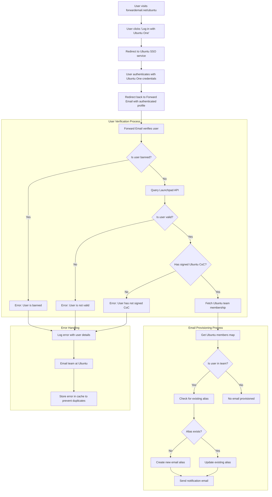

# 사례 연구: Canonical이 Forward Email의 오픈 소스 엔터프라이즈 솔루션을 통해 Ubuntu 이메일 관리를 강화하는 방법 {#case-study-how-canonical-powers-ubuntu-email-management-with-forward-emails-open-source-enterprise-solution}


## 목차 {#table-of-contents}

* [머리말](#foreword)
* [과제: 복잡한 이메일 생태계 관리](#the-challenge-managing-a-complex-email-ecosystem)
* [주요 내용](#key-takeaways)
* [이메일 전달 이유](#why-forward-email)
* [구현: 원활한 SSO 통합](#the-implementation-seamless-sso-integration)
  * [인증 흐름 시각화](#authentication-flow-visualization)
  * [기술 구현 세부 사항](#technical-implementation-details)
* [DNS 구성 및 이메일 라우팅](#dns-configuration-and-email-routing)
* [결과: 간소화된 이메일 관리 및 향상된 보안](#results-streamlined-email-management-and-enhanced-security)
  * [운영 효율성](#operational-efficiency)
  * [강화된 보안 및 개인 정보 보호](#enhanced-security-and-privacy)
  * [비용 절감](#cost-savings)
  * [개선된 기여자 경험](#improved-contributor-experience)
* [기대: 지속적인 협력](#looking-forward-continued-collaboration)
* [결론: 완벽한 오픈 소스 파트너십](#conclusion-a-perfect-open-source-partnership)
* [기업 고객 지원](#supporting-enterprise-clients)
  * [연락하세요](#get-in-touch)
  * [전달 이메일에 관하여](#about-forward-email)

## 서문 {#foreword}

오픈소스 소프트웨어 세계에서 [정식](https://en.wikipedia.org/wiki/Canonical_\(company\))만큼 큰 영향력을 가진 이름은 거의 없습니다. [우분투](https://en.wikipedia.org/wiki/Ubuntu)은 전 세계적으로 가장 인기 있는 Linux 배포판 중 하나입니다. Ubuntu, [무료](https://en.wikipedia.org/wiki/Kubuntu), [루분투](https://en.wikipedia.org/wiki/Lubuntu), [에두분투](https://en.wikipedia.org/wiki/Edubuntu) 등 다양한 배포판을 아우르는 방대한 생태계를 구축한 Canonical은 수많은 도메인에서 이메일 주소를 관리하는 데 있어 고유한 어려움에 직면했습니다. 이 사례 연구는 Canonical이 Forward Email과 협력하여 오픈소스 가치에 완벽하게 부합하는 원활하고 안전하며 개인 정보 보호에 중점을 둔 엔터프라이즈 이메일 관리 솔루션을 구축한 과정을 살펴봅니다.

## 과제: 복잡한 이메일 생태계 관리 {#the-challenge-managing-a-complex-email-ecosystem}

Canonical의 생태계는 다양하고 광범위합니다. 전 세계 수백만 명의 사용자와 다양한 프로젝트에 참여하는 수천 명의 기여자들이 있기에, 여러 도메인의 이메일 주소를 관리하는 것은 상당한 어려움을 야기했습니다. 핵심 기여자들은 프로젝트에 대한 참여를 반영하는 공식 이메일 주소(@ubuntu.com, @kubuntu.org 등)를 필요로 했으며, 동시에 강력한 Ubuntu 도메인 관리 시스템을 통해 보안과 사용 편의성을 유지해야 했습니다.

Canonical은 Forward Email을 구현하기 전에 다음과 같은 문제에 어려움을 겪었습니다.

* 여러 도메인(@ubuntu.com, @kubuntu.org, @lubuntu.me, @edubuntu.org, @ubuntu.net)의 이메일 주소 관리
* 핵심 기여자에게 일관된 이메일 경험 제공
* 기존 [우분투 원](https://en.wikipedia.org/wiki/Ubuntu_One) SSO(Single Sign-On) 시스템과 이메일 서비스 통합
* 개인정보 보호, 보안 및 오픈 소스 이메일 보안에 대한 자사의 노력에 부합하는 솔루션 모색
* 안전한 이메일 인프라를 비용 효율적으로 확장

## 주요 내용 {#key-takeaways}

* Canonical은 여러 Ubuntu 도메인에 걸쳐 통합 이메일 관리 솔루션을 성공적으로 구현했습니다.
* Forward Email의 100% 오픈소스 접근 방식은 Canonical의 가치와 완벽하게 일치했습니다.
* Ubuntu One과의 SSO 통합은 기여자에게 원활한 인증을 제공합니다.
* 양자 저항 암호화는 모든 이메일 통신의 장기적인 보안을 보장합니다.
* 이 솔루션은 Canonical의 증가하는 기여자 기반을 지원하기 위해 비용 효율적으로 확장됩니다.

## 이메일 전달 이유 {#why-forward-email}

개인정보 보호와 보안에 중점을 둔 유일한 100% 오픈 소스 이메일 서비스 제공업체인 Forward Email은 Canonical의 기업용 이메일 전달 요구 사항에 완벽하게 부합했습니다. Forward Email의 가치는 오픈 소스 소프트웨어와 개인정보 보호에 대한 Canonical의 헌신과 완벽하게 일치했습니다.

Forward Email을 이상적인 선택으로 만든 주요 요소는 다음과 같습니다.

1. **완전한 오픈소스 코드베이스**: 저희 플랫폼 전체는 오픈소스이며 [깃허브](https://en.wikipedia.org/wiki/GitHub)에서 이용 가능하여 투명성과 커뮤니티 기여를 지원합니다. 프런트엔드만 오픈소스로 공개하고 백엔드는 비공개로 유지하는 많은 "개인정보 보호 중심" 이메일 제공업체와 달리, 저희는 프런트엔드와 백엔드 모두 전체 코드베이스를 [깃허브](https://github.com/forwardemail/forwardemail.net)에서 누구나 열람할 수 있도록 공개했습니다.

2. **개인정보 보호 중심 접근 방식**: 다른 제공업체와 달리, 저희는 이메일을 공유 데이터베이스에 저장하지 않으며 TLS를 활용한 강력한 암호화를 사용합니다. 저희의 기본적인 개인정보 보호 철학은 간단합니다. **귀하의 이메일은 오직 귀하에게만 속합니다**. 이 원칙은 이메일 전달 방식부터 암호화 구현 방식까지 저희가 내리는 모든 기술적 결정의 기준이 됩니다.

3. **타사 의존 없음**: Amazon SES나 기타 타사 서비스를 사용하지 않으므로 이메일 인프라에 대한 완벽한 제어권을 확보하고 타사 서비스를 통해 발생할 수 있는 개인 정보 유출 가능성을 없앴습니다.

4. **비용 효율적인 확장**: 당사의 가격 책정 모델을 사용하면 조직이 사용자당 비용을 지불하지 않고도 확장할 수 있으므로 Canonical의 대규모 기여자 기반에 이상적입니다.

5. **양자 저항 암호화**: [차차20-폴리1305](https://en.wikipedia.org/wiki/ChaCha20-Poly1305)을 [양자 저항 암호화](/blog/docs/best-quantum-safe-encrypted-email-service)의 암호로 사용하여 개별적으로 암호화된 SQLite 사서함을 사용합니다. 각 사서함은 별도의 암호화된 파일로, 한 사용자의 데이터에 접근하더라도 다른 사용자에게는 접근 권한이 부여되지 않습니다.

## 구현: 원활한 SSO 통합 {#the-implementation-seamless-sso-integration}

구현 과정에서 가장 중요한 측면 중 하나는 Canonical의 기존 Ubuntu One SSO 시스템과의 통합이었습니다. 이 통합을 통해 핵심 기여자들은 기존 Ubuntu One 자격 증명을 사용하여 @ubuntu.com 이메일 주소를 관리할 수 있게 되었습니다.

### 인증 흐름 시각화 {#authentication-flow-visualization}

다음 다이어그램은 전체 인증 및 이메일 프로비저닝 흐름을 보여줍니다.



### 기술 구현 세부 정보 {#technical-implementation-details}

Forward Email과 Ubuntu One SSO 간의 통합은 Passport-Ubuntu 인증 전략을 사용자 정의하여 구현했습니다. 이를 통해 Ubuntu One과 Forward Email 시스템 간의 원활한 인증 흐름이 가능해졌습니다.

#### 인증 흐름 {#the-authentication-flow}

인증 과정은 다음과 같이 진행됩니다.

1. 사용자는 [forwardemail.net/ubuntu](https://forwardemail.net/ubuntu)에서 전용 Ubuntu 이메일 관리 페이지를 방문합니다.
2. "Ubuntu One으로 로그인"을 클릭하면 Ubuntu SSO 서비스로 리디렉션됩니다.
3. Ubuntu One 자격 증명으로 인증한 후, 인증된 프로필을 사용하여 Forward Email로 다시 리디렉션됩니다.
4. Forward Email은 사용자의 기여자 상태를 확인하고 이에 따라 이메일 주소를 프로비저닝하거나 관리합니다.

기술 구현에서는 [`passport-ubuntu`](https://www.npmjs.com/package/passport-ubuntu) 패키지를 활용했습니다. 이 패키지는 [여권](https://www.npmjs.com/package/passport) 전략을 기반으로 [오픈아이디](https://en.wikipedia.org/wiki/OpenID)를 사용하여 Ubuntu에서 인증하는 방식입니다. 구성에는 다음이 포함되었습니다.

```javascript
passport.use(new UbuntuStrategy({
  returnURL: process.env.UBUNTU_CALLBACK_URL,
  realm: process.env.UBUNTU_REALM,
  stateless: true
}, function(identifier, profile, done) {
  // User verification and email provisioning logic
}));
```

#### Launchpad API 통합 및 검증 {#launchpad-api-integration-and-validation}

구현의 핵심 구성 요소는 Ubuntu 사용자와 팀 멤버십을 검증하기 위한 [런치패드](https://en.wikipedia.org/wiki/Launchpad_\(website\)) API와의 통합입니다. 이 통합을 효율적이고 안정적으로 처리하기 위해 재사용 가능한 도우미 함수를 개발했습니다.

`sync-ubuntu-user.js` 도우미 함수는 Launchpad API를 통해 사용자를 검증하고 이메일 주소를 관리하는 역할을 합니다. 작동 방식을 간략하게 설명하면 다음과 같습니다.

```javascript
async function syncUbuntuUser(user, map) {
  try {
    // Validate user object
    if (!_.isObject(user) ||
        !isSANB(user[fields.ubuntuUsername]) ||
        !isSANB(user[fields.ubuntuProfileID]) ||
        !isEmail(user.email))
      throw new TypeError('Invalid user object');

    // Get Ubuntu members map if not provided
    if (!(map instanceof Map))
      map = await getUbuntuMembersMap(resolver);

    // Check if user is banned
    if (user[config.userFields.isBanned]) {
      throw new InvalidUbuntuUserError('User was banned', { ignoreHook: true });
    }

    // Query Launchpad API to validate user
    const url = `https://api.launchpad.net/1.0/~${user[fields.ubuntuUsername]}`;
    const response = await retryRequest(url, { resolver });
    const json = await response.body.json();

    // Validate required boolean properties
    if (!json.is_valid)
      throw new InvalidUbuntuUserError('Property "is_valid" was false');

    if (!json.is_ubuntu_coc_signer)
      throw new InvalidUbuntuUserError('Property "is_ubuntu_coc_signer" was false');

    // Process each domain for the user
    await pMap([...map.keys()], async (name) => {
      // Find domain in database
      const domain = await Domains.findOne({
        name,
        plan: 'team',
        has_txt_record: true
      }).populate('members.user');

      // Process user's email alias for this domain
      if (map.get(name).has(user[fields.ubuntuUsername])) {
        // User is a member of this team, create or update alias
        let alias = await Aliases.findOne({
          user: user._id,
          domain: domain._id,
          name: user[fields.ubuntuUsername].toLowerCase()
        });

        if (!alias) {
          // Create new alias with appropriate error handling
          alias = await Aliases.create({
            user: user._id,
            domain: domain._id,
            name: user[fields.ubuntuUsername].toLowerCase(),
            recipients: [user.email],
            locale: user[config.lastLocaleField],
            is_enabled: true
          });

          // Notify admins about new alias creation
          await emailHelper({
            template: 'alert',
            message: {
              to: adminEmailsForDomain,
              subject: `New @${domain.name} email address created`
            },
            locals: {
              message: `A new email address ${user[fields.ubuntuUsername].toLowerCase()}@${domain.name} was created for ${user.email}`
            }
          });
        }
      }
    });

    return true;
  } catch (err) {
    // Handle and log errors
    await logErrorWithUser(err, user);
    throw err;
  }
}
```

다양한 Ubuntu 도메인에서 팀 멤버십 관리를 단순화하기 위해 도메인 이름과 해당 Launchpad 팀 간의 간단한 매핑을 만들었습니다.

```javascript
ubuntuTeamMapping: {
  'ubuntu.com': '~ubuntumembers',
  'kubuntu.org': '~kubuntu-members',
  'lubuntu.me': '~lubuntu-members',
  'edubuntu.org': '~edubuntu-members',
  'ubuntustudio.com': '~ubuntustudio-core',
  'ubuntu.net': '~ubuntu-smtp-test'
},
```

이 간단한 매핑을 통해 팀 멤버십 확인 및 이메일 주소 프로비저닝 프로세스를 자동화하여 새로운 도메인이 추가됨에 따라 시스템을 쉽게 유지 관리하고 확장할 수 있습니다.

#### 오류 처리 및 알림 {#error-handling-and-notifications}

우리는 다음과 같은 강력한 오류 처리 시스템을 구현했습니다.

1. 자세한 사용자 정보와 함께 모든 오류를 기록합니다.
2. 문제가 감지되면 Ubuntu 팀에 이메일을 보냅니다.
3. 새로운 기여자가 가입하고 이메일 주소가 생성되면 관리자에게 알립니다.
4. Ubuntu 행동 강령에 서명하지 않은 사용자와 같은 예외적인 상황을 처리합니다.

이를 통해 문제가 발생하면 신속하게 식별하여 해결하고 이메일 시스템의 무결성을 유지할 수 있습니다.

## DNS 구성 및 이메일 라우팅 {#dns-configuration-and-email-routing}

Forward Email을 통해 관리되는 각 도메인에 대해 Canonical은 유효성 검사를 위해 간단한 DNS TXT 레코드를 추가했습니다.

```sh
❯ dig ubuntu.com txt
ubuntu.com.             600     IN      TXT     "forward-email-site-verification=6IsURgl2t7"
```

이 확인 기록은 도메인 소유권을 확인하고 저희 시스템이 해당 도메인의 이메일을 안전하게 관리할 수 있도록 합니다. 정식 경로는 안정적이고 안전한 이메일 전송 인프라를 제공하는 Postfix를 통해 저희 서비스를 통해 메일을 전송합니다.

## 결과: 간소화된 이메일 관리 및 향상된 보안 {#results-streamlined-email-management-and-enhanced-security}

Forward Email의 엔터프라이즈 솔루션을 구현함으로써 Canonical은 모든 도메인에서 이메일 관리에 상당한 이점을 얻었습니다.

### 운영 효율성 {#operational-efficiency}

* **중앙 집중식 관리**: 모든 Ubuntu 관련 도메인을 이제 단일 인터페이스를 통해 관리합니다.
* **관리 오버헤드 감소**: 기여자를 위한 자동화된 프로비저닝 및 셀프 서비스 관리
* **간소화된 온보딩**: 신규 기여자는 공식 이메일 주소를 빠르게 받을 수 있습니다.

### 강화된 보안 및 개인 정보 보호 {#enhanced-security-and-privacy}

* **종단 간 암호화**: 모든 이메일은 고급 표준을 사용하여 암호화됩니다.
* **공유 데이터베이스 없음**: 각 사용자의 이메일은 개별 암호화된 SQLite 데이터베이스에 저장되어 기존 공유 관계형 데이터베이스보다 근본적으로 더 안전한 샌드박스 암호화 방식을 제공합니다.
* **오픈소스 보안**: 투명한 코드베이스를 통해 커뮤니티 보안 검토가 가능합니다.
* **메모리 내 처리**: 전달된 이메일을 디스크에 저장하지 않아 개인정보 보호가 강화됩니다.
* **메타데이터 저장 없음**: 많은 이메일 제공업체와 달리 누가 누구에게 이메일을 보냈는지에 대한 기록을 보관하지 않습니다.

### 비용 절감 {#cost-savings}

* **확장 가능한 가격 모델**: 사용자당 요금이 없어 Canonical이 비용 증가 없이 기여자를 추가할 수 있습니다.
* **인프라 요구 감소**: 도메인별로 별도의 이메일 서버를 유지할 필요가 없습니다.
* **지원 요구 사항 감소**: 셀프 서비스 관리를 통해 IT 지원 티켓 감소

### 기여자 경험 개선 {#improved-contributor-experience}

* **원활한 인증**: 기존 Ubuntu One 자격 증명을 사용한 Single Sign-On
* **일관된 브랜딩**: 모든 Ubuntu 관련 서비스에서 통합된 경험 제공
* **안정적인 이메일 전송**: 고품질 IP 평판을 통해 이메일이 목적지에 도달하도록 보장합니다.

Forward Email과의 통합으로 Canonical의 이메일 관리 프로세스가 크게 간소화되었습니다. 이제 기여자들은 관리 부담을 줄이고 보안을 강화하면서 @ubuntu.com 이메일 주소를 원활하게 관리할 수 있습니다.

## 기대합니다: 지속적인 협업 {#looking-forward-continued-collaboration}

Canonical과 Forward Email의 파트너십은 계속해서 발전하고 있습니다. 저희는 다음과 같은 여러 가지 프로젝트를 위해 협력하고 있습니다.

* Ubuntu 관련 도메인으로 이메일 서비스 확장
* 기여자 피드백을 기반으로 사용자 인터페이스 개선
* 추가 보안 기능 구현
* 오픈 소스 협업을 활용하는 새로운 방법 모색

## 결론: 완벽한 오픈 소스 파트너십 {#conclusion-a-perfect-open-source-partnership}

캐노니컬과 포워드 이메일의 협력은 공유 가치를 기반으로 구축된 파트너십의 힘을 보여줍니다. 캐노니컬은 포워드 이메일을 이메일 서비스 공급업체로 선택함으로써 기술적 요구 사항을 충족할 뿐만 아니라 오픈 소스 소프트웨어, 개인정보 보호 및 보안에 대한 캐노니컬의 약속과도 완벽하게 부합하는 솔루션을 찾았습니다.

여러 도메인을 관리하고 기존 시스템과의 원활한 인증이 필요한 조직의 경우, Forward Email은 유연하고 안전하며 개인 정보 보호에 중점을 둔 솔루션을 제공합니다. [오픈소스 접근 방식](https://forwardemail.net/blog/docs/why-open-source-email-security-privacy)은 투명성을 보장하고 커뮤니티 기여를 허용하므로 이러한 원칙을 중시하는 조직에 이상적인 선택입니다.

Canonical과 Forward Email이 각자의 분야에서 혁신을 거듭하고 있는 가운데, 이 파트너십은 효과적인 솔루션을 창출하는 데 있어 오픈 소스 협업과 공유 가치의 힘을 입증하는 사례입니다.

당사의 [실시간 서비스 상태](https://status.forwardemail.net)에서 최신 이메일 전달 성과를 확인할 수 있습니다. 당사는 고품질 IP 평판과 이메일 전달성을 보장하기 위해 지속적으로 모니터링하고 있습니다.

## 기업 고객 지원 {#supporting-enterprise-clients}

이 사례 연구는 Canonical과의 파트너십에 초점을 맞추고 있지만, Forward Email은 개인정보 보호, 보안 및 오픈 소스 원칙에 대한 당사의 노력을 높이 평가하는 다양한 산업 분야의 수많은 기업 고객을 자랑스럽게 지원합니다.

당사의 기업 솔루션은 모든 규모의 조직의 특정 요구 사항을 충족하도록 맞춤화되어 있으며 다음을 제공합니다.

* 여러 도메인에 걸친 사용자 지정 도메인 [이메일 관리](/)
* 기존 인증 시스템과의 원활한 통합
* 전담 Matrix 채팅 지원 채널
* [양자 저항 암호화](/blog/docs/best-quantum-safe-encrypted-email-service)을 포함한 향상된 보안 기능
* 완벽한 데이터 이동성 및 소유권
* 투명성과 신뢰성을 위한 100% 오픈소스 인프라

### 문의하기 {#get-in-touch}

귀하의 조직에 기업용 이메일 요구 사항이 있거나 Forward Email이 개인정보 보호 및 보안을 강화하는 동시에 이메일 관리를 간소화하는 데 어떻게 도움이 될 수 있는지 자세히 알고 싶으시다면 저희에게 연락해 주세요.

* `support@forwardemail.net`으로 직접 이메일을 보내주세요.
* [도움말 페이지](https://forwardemail.net/help)에서 도움 요청을 제출하세요.
* 엔터프라이즈 플랜은 [가격 페이지](https://forwardemail.net/pricing)에서 확인하세요.

저희 팀은 귀사의 구체적인 요구 사항을 논의하고 귀사의 가치와 기술적 요구 사항에 맞는 맞춤형 솔루션을 개발할 준비가 되어 있습니다.

### 전달 이메일 정보 {#about-forward-email}

Forward Email은 100% 오픈 소스이며 개인정보 보호에 중점을 둔 이메일 서비스입니다. 보안, 개인정보 보호 및 투명성에 중점을 두고 맞춤형 도메인 이메일 전달, SMTP, IMAP 및 POP3 서비스를 제공합니다. 전체 코드베이스는 [깃허브](https://github.com/forwardemail/forwardemail.net)에서 사용할 수 있으며, 사용자 개인정보 보호 및 보안을 존중하는 이메일 서비스를 제공하기 위해 최선을 다하고 있습니다. [오픈소스 이메일이 미래인 이유](https://forwardemail.net/blog/docs/why-open-source-email-security-privacy), [이메일 전달이 어떻게 작동하는지](https://forwardemail.net/blog/docs/best-email-forwarding-service) 및 [이메일 개인 정보 보호에 대한 당사의 접근 방식](https://forwardemail.net/blog/docs/email-privacy-protection-technical-implementation)에 대해 자세히 알아보세요.