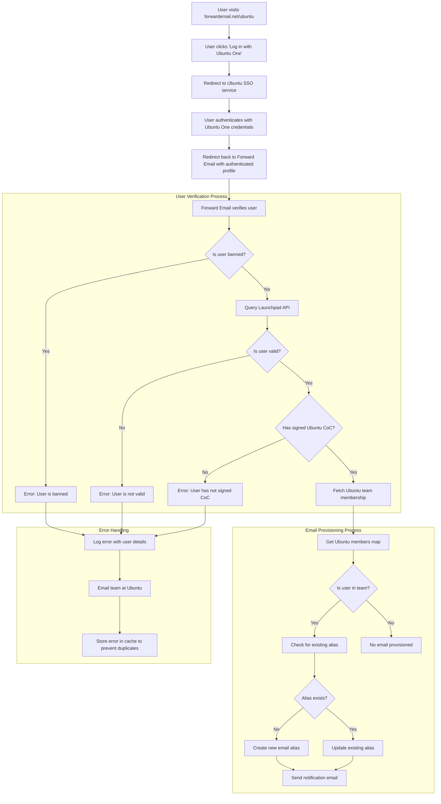

# 사례 연구: Canonical이 Forward Email의 오픈 소스 엔터프라이즈 솔루션으로 Ubuntu 이메일 관리를 강화하는 방법 {#case-study-how-canonical-powers-ubuntu-email-management-with-forward-emails-open-source-enterprise-solution}


## 목차 {#table-of-contents}

* [서문](#foreword)
* [과제: 복잡한 이메일 생태계 관리](#the-challenge-managing-a-complex-email-ecosystem)
* [핵심 내용](#key-takeaways)
* [왜 Forward Email인가](#why-forward-email)
* [구현: 원활한 SSO 통합](#the-implementation-seamless-sso-integration)
  * [인증 흐름 시각화](#authentication-flow-visualization)
  * [기술 구현 세부사항](#technical-implementation-details)
* [DNS 구성 및 이메일 라우팅](#dns-configuration-and-email-routing)
* [결과: 간소화된 이메일 관리 및 향상된 보안](#results-streamlined-email-management-and-enhanced-security)
  * [운영 효율성](#operational-efficiency)
  * [향상된 보안 및 개인정보 보호](#enhanced-security-and-privacy)
  * [비용 절감](#cost-savings)
  * [개선된 기여자 경험](#improved-contributor-experience)
* [앞으로의 전망: 지속적인 협력](#looking-forward-continued-collaboration)
* [결론: 완벽한 오픈 소스 파트너십](#conclusion-a-perfect-open-source-partnership)
* [엔터프라이즈 고객 지원](#supporting-enterprise-clients)
  * [문의하기](#get-in-touch)
  * [Forward Email 소개](#about-forward-email)


## 서문 {#foreword}

오픈 소스 소프트웨어 세계에서 [Canonical](https://en.wikipedia.org/wiki/Canonical_\(company\))만큼 영향력 있는 이름은 드뭅니다. Canonical은 전 세계적으로 가장 인기 있는 리눅스 배포판 중 하나인 [Ubuntu](https://en.wikipedia.org/wiki/Ubuntu)의 개발사입니다. Ubuntu, [Kubuntu](https://en.wikipedia.org/wiki/Kubuntu), [Lubuntu](https://en.wikipedia.org/wiki/Lubuntu), [Edubuntu](https://en.wikipedia.org/wiki/Edubuntu) 등 여러 배포판에 걸친 방대한 생태계를 가진 Canonical은 수많은 도메인에 걸쳐 이메일 주소를 관리하는 데 독특한 도전에 직면했습니다. 이 사례 연구는 Canonical이 Forward Email과 협력하여 오픈 소스 가치에 완벽히 부합하는 원활하고 안전하며 개인정보 보호에 중점을 둔 엔터프라이즈 이메일 관리 솔루션을 어떻게 구축했는지 탐구합니다.


## 과제: 복잡한 이메일 생태계 관리 {#the-challenge-managing-a-complex-email-ecosystem}

Canonical의 생태계는 다양하고 광범위합니다. 전 세계 수백만 명의 사용자와 다양한 프로젝트에 걸친 수천 명의 기여자가 있는 상황에서 여러 도메인에 걸친 이메일 주소 관리는 상당한 도전 과제였습니다. 핵심 기여자들은 프로젝트 참여를 반영하는 공식 이메일 주소(@ubuntu.com, @kubuntu.org 등)가 필요했으며, 강력한 Ubuntu 도메인 관리 시스템을 통해 보안성과 사용 편의성을 유지해야 했습니다.

Forward Email 도입 전 Canonical이 겪었던 문제는 다음과 같습니다:

* 여러 도메인(@ubuntu.com, @kubuntu.org, @lubuntu.me, @edubuntu.org, @ubuntu.net)에 걸친 이메일 주소 관리
* 핵심 기여자들에게 일관된 이메일 경험 제공
* 기존 [Ubuntu One](https://en.wikipedia.org/wiki/Ubuntu_One) 싱글 사인온(SSO) 시스템과 이메일 서비스 통합
* 개인정보 보호, 보안, 오픈 소스 이메일 보안에 대한 약속과 부합하는 솔루션 찾기
* 비용 효율적으로 보안 이메일 인프라 확장


## 핵심 내용 {#key-takeaways}

* Canonical은 여러 Ubuntu 도메인에 걸쳐 통합 이메일 관리 솔루션을 성공적으로 구현함
* Forward Email의 100% 오픈 소스 접근법이 Canonical의 가치와 완벽히 일치함
* Ubuntu One과의 SSO 통합으로 기여자들에게 원활한 인증 제공
* 양자 내성 암호화로 모든 이메일 통신의 장기 보안 보장
* 솔루션이 비용 효율적으로 확장되어 Canonical의 증가하는 기여자 기반을 지원


## 왜 Forward Email인가 {#why-forward-email}
프라이버시와 보안에 중점을 둔 유일한 100% 오픈 소스 이메일 서비스 제공업체로서, Forward Email은 Canonical의 엔터프라이즈 이메일 전달 요구에 자연스럽게 부합했습니다. 우리의 가치관은 오픈 소스 소프트웨어와 프라이버시에 대한 Canonical의 헌신과 완벽하게 일치했습니다.

Forward Email이 이상적인 선택이 된 주요 요인은 다음과 같습니다:

1. **완전한 오픈 소스 코드베이스**: 우리의 전체 플랫폼은 오픈 소스이며 [GitHub](https://en.wikipedia.org/wiki/GitHub)에서 확인할 수 있어 투명성과 커뮤니티 기여를 가능하게 합니다. 프론트엔드만 오픈 소스화하고 백엔드는 비공개로 유지하는 많은 "프라이버시 중심" 이메일 제공업체와 달리, 우리는 프론트엔드와 백엔드 모두를 포함한 전체 코드베이스를 누구나 검사할 수 있도록 [GitHub](https://github.com/forwardemail/forwardemail.net)에 공개했습니다.

2. **프라이버시 중심 접근법**: 다른 제공업체와 달리, 우리는 이메일을 공유 데이터베이스에 저장하지 않으며 TLS를 사용한 강력한 암호화를 적용합니다. 우리의 근본적인 프라이버시 철학은 간단합니다: **당신의 이메일은 당신만의 것입니다**. 이 원칙은 이메일 전달 처리 방식부터 암호화 구현에 이르기까지 모든 기술적 결정에 지침이 됩니다.

3. **제3자 의존 없음**: 우리는 Amazon SES나 기타 제3자 서비스를 사용하지 않아 이메일 인프라를 완전히 통제하며, 제3자 서비스를 통한 잠재적 프라이버시 유출을 차단합니다.

4. **비용 효율적인 확장성**: 우리의 가격 모델은 사용자당 비용을 지불하지 않고도 조직이 확장할 수 있게 하여 Canonical의 대규모 기여자 기반에 이상적입니다.

5. **양자 내성 암호화**: 우리는 [ChaCha20-Poly1305](https://en.wikipedia.org/wiki/ChaCha20-Poly1305)를 암호화 방식으로 사용하는 개별 암호화된 SQLite 메일박스를 사용하여 [양자 내성 암호화](/blog/docs/best-quantum-safe-encrypted-email-service)를 구현합니다. 각 메일박스는 별도의 암호화된 파일로, 한 사용자의 데이터 접근이 다른 사용자 데이터 접근을 허용하지 않습니다.


## 구현: 원활한 SSO 통합 {#the-implementation-seamless-sso-integration}

구현의 가장 중요한 측면 중 하나는 Canonical의 기존 Ubuntu One SSO 시스템과의 통합이었습니다. 이 통합을 통해 핵심 기여자들은 기존 Ubuntu One 자격 증명을 사용하여 @ubuntu.com 이메일 주소를 관리할 수 있게 됩니다.

### 인증 흐름 시각화 {#authentication-flow-visualization}

다음 다이어그램은 전체 인증 및 이메일 프로비저닝 흐름을 보여줍니다:


```mermaid
flowchart TD
    A[User visits forwardemail.net/ubuntu] --> B[User clicks 'Log in with Ubuntu One']
    B --> C[Redirect to Ubuntu SSO service]
    C --> D[User authenticates with Ubuntu One credentials]
    D --> E[Redirect back to Forward Email with authenticated profile]
    E --> F[Forward Email verifies user]

    subgraph "User Verification Process"
        F --> G{Is user banned?}
        G -->|Yes| H[Error: User is banned]
        G -->|No| I[Query Launchpad API]
        I --> J{Is user valid?}
        J -->|No| K[Error: User is not valid]
        J -->|Yes| L{Has signed Ubuntu CoC?}
        L -->|No| M[Error: User has not signed CoC]
        L -->|Yes| N[Fetch Ubuntu team membership]
    end

    subgraph "Email Provisioning Process"
        N --> O[Get Ubuntu members map]
        O --> P{Is user in team?}
        P -->|Yes| Q[Check for existing alias]
        Q --> R{Alias exists?}
        R -->|No| S[Create new email alias]
        R -->|Yes| T[Update existing alias]
        S --> U[Send notification email]
        T --> U
        P -->|No| V[No email provisioned]
    end

    subgraph "Error Handling"
        H --> W[Log error with user details]
        K --> W
        M --> W
        W --> X[Email team at Ubuntu]
        X --> Y[Store error in cache to prevent duplicates]
    end
```

### 기술 구현 세부사항 {#technical-implementation-details}

Forward Email과 Ubuntu One SSO 간의 통합은 passport-ubuntu 인증 전략의 맞춤 구현을 통해 이루어졌습니다. 이를 통해 Ubuntu One과 Forward Email 시스템 간에 원활한 인증 흐름이 가능해졌습니다.
#### 인증 흐름 {#the-authentication-flow}

인증 프로세스는 다음과 같이 작동합니다:

1. 사용자는 전용 Ubuntu 이메일 관리 페이지 [forwardemail.net/ubuntu](https://forwardemail.net/ubuntu)를 방문합니다
2. "Ubuntu One으로 로그인"을 클릭하면 Ubuntu SSO 서비스로 리디렉션됩니다
3. Ubuntu One 자격 증명으로 인증한 후, 인증된 프로필과 함께 Forward Email로 다시 리디렉션됩니다
4. Forward Email은 기여자 상태를 확인하고 이메일 주소를 적절히 프로비저닝하거나 관리합니다

기술적 구현은 Ubuntu 인증을 위한 [Passport](https://www.npmjs.com/package/passport) 전략인 [`passport-ubuntu`](https://www.npmjs.com/package/passport-ubuntu) 패키지를 활용했습니다. 구성은 다음과 같습니다:

```javascript
passport.use(new UbuntuStrategy({
  returnURL: process.env.UBUNTU_CALLBACK_URL,
  realm: process.env.UBUNTU_REALM,
  stateless: true
}, function(identifier, profile, done) {
  // 사용자 검증 및 이메일 프로비저닝 로직
}));
```

#### Launchpad API 통합 및 검증 {#launchpad-api-integration-and-validation}

우리 구현의 핵심 구성 요소는 [Launchpad](https://en.wikipedia.org/wiki/Launchpad_\(website\)) API와의 통합으로, Ubuntu 사용자 및 팀 멤버십을 검증합니다. 이 통합을 효율적이고 신뢰성 있게 처리하기 위해 재사용 가능한 헬퍼 함수를 만들었습니다.

`sync-ubuntu-user.js` 헬퍼 함수는 Launchpad API를 통해 사용자를 검증하고 이메일 주소를 관리하는 역할을 합니다. 작동 방식의 간략한 예시는 다음과 같습니다:

```javascript
async function syncUbuntuUser(user, map) {
  try {
    // 사용자 객체 검증
    if (!_.isObject(user) ||
        !isSANB(user[fields.ubuntuUsername]) ||
        !isSANB(user[fields.ubuntuProfileID]) ||
        !isEmail(user.email))
      throw new TypeError('잘못된 사용자 객체');

    // 제공되지 않은 경우 Ubuntu 멤버 맵 가져오기
    if (!(map instanceof Map))
      map = await getUbuntuMembersMap(resolver);

    // 사용자가 차단되었는지 확인
    if (user[config.userFields.isBanned]) {
      throw new InvalidUbuntuUserError('사용자가 차단됨', { ignoreHook: true });
    }

    // Launchpad API를 쿼리하여 사용자 검증
    const url = `https://api.launchpad.net/1.0/~${user[fields.ubuntuUsername]}`;
    const response = await retryRequest(url, { resolver });
    const json = await response.body.json();

    // 필수 불리언 속성 검증
    if (!json.is_valid)
      throw new InvalidUbuntuUserError('속성 "is_valid"가 false입니다');

    if (!json.is_ubuntu_coc_signer)
      throw new InvalidUbuntuUserError('속성 "is_ubuntu_coc_signer"가 false입니다');

    // 사용자에 대해 각 도메인 처리
    await pMap([...map.keys()], async (name) => {
      // 데이터베이스에서 도메인 찾기
      const domain = await Domains.findOne({
        name,
        plan: 'team',
        has_txt_record: true
      }).populate('members.user');

      // 이 도메인에 대한 사용자의 이메일 별칭 처리
      if (map.get(name).has(user[fields.ubuntuUsername])) {
        // 사용자가 이 팀의 멤버인 경우 별칭 생성 또는 업데이트
        let alias = await Aliases.findOne({
          user: user._id,
          domain: domain._id,
          name: user[fields.ubuntuUsername].toLowerCase()
        });

        if (!alias) {
          // 적절한 오류 처리를 포함하여 새 별칭 생성
          alias = await Aliases.create({
            user: user._id,
            domain: domain._id,
            name: user[fields.ubuntuUsername].toLowerCase(),
            recipients: [user.email],
            locale: user[config.lastLocaleField],
            is_enabled: true
          });

          // 새 별칭 생성에 대해 관리자에게 알림
          await emailHelper({
            template: 'alert',
            message: {
              to: adminEmailsForDomain,
              subject: `새로운 @${domain.name} 이메일 주소가 생성되었습니다`
            },
            locals: {
              message: `새 이메일 주소 ${user[fields.ubuntuUsername].toLowerCase()}@${domain.name}가 ${user.email}을 위해 생성되었습니다`
            }
          });
        }
      }
    });

    return true;
  } catch (err) {
    // 오류 처리 및 기록
    await logErrorWithUser(err, user);
    throw err;
  }
}
```
서로 다른 Ubuntu 도메인 간 팀 멤버십 관리를 간소화하기 위해, 도메인 이름과 해당 Launchpad 팀 간의 간단한 매핑을 만들었습니다:

```javascript
ubuntuTeamMapping: {
  'ubuntu.com': '~ubuntumembers',
  'kubuntu.org': '~kubuntu-members',
  'lubuntu.me': '~lubuntu-members',
  'edubuntu.org': '~edubuntu-members',
  'ubuntustudio.com': '~ubuntustudio-core',
  'ubuntu.net': '~ubuntu-smtp-test'
},
```

이 간단한 매핑은 팀 멤버십 확인과 이메일 주소 프로비저닝 과정을 자동화할 수 있게 하여, 새로운 도메인이 추가될 때 시스템을 쉽게 유지 관리하고 확장할 수 있도록 합니다.

#### 오류 처리 및 알림 {#error-handling-and-notifications}

우리는 다음과 같은 강력한 오류 처리 시스템을 구현했습니다:

1. 모든 오류를 상세한 사용자 정보와 함께 기록
2. 문제가 감지되면 Ubuntu 팀에 이메일 발송
3. 새로운 기여자가 가입하고 이메일 주소가 생성될 때 관리자에게 알림
4. Ubuntu 행동 강령에 서명하지 않은 사용자와 같은 예외 상황 처리

이를 통해 문제를 신속하게 식별하고 해결하여 이메일 시스템의 무결성을 유지합니다.


## DNS 구성 및 이메일 라우팅 {#dns-configuration-and-email-routing}

Forward Email을 통해 관리되는 각 도메인에 대해, Canonical은 검증을 위한 간단한 DNS TXT 레코드를 추가했습니다:

```sh
❯ dig ubuntu.com txt
ubuntu.com.             600     IN      TXT     "forward-email-site-verification=6IsURgl2t7"
```

이 검증 레코드는 도메인 소유권을 확인하며, 우리 시스템이 해당 도메인의 이메일을 안전하게 관리할 수 있도록 합니다. Canonical은 Postfix를 통해 메일을 라우팅하며, 이는 신뢰할 수 있고 안전한 이메일 전달 인프라를 제공합니다.


## 결과: 간소화된 이메일 관리 및 향상된 보안 {#results-streamlined-email-management-and-enhanced-security}

Forward Email의 엔터프라이즈 솔루션 도입은 Canonical의 모든 도메인에 걸친 이메일 관리에 상당한 이점을 제공했습니다:

### 운영 효율성 {#operational-efficiency}

* **중앙 집중식 관리**: 모든 Ubuntu 관련 도메인이 단일 인터페이스를 통해 관리됩니다
* **관리 부담 감소**: 기여자를 위한 자동 프로비저닝 및 셀프 서비스 관리
* **간편한 온보딩**: 새로운 기여자가 공식 이메일 주소를 빠르게 받을 수 있습니다

### 향상된 보안 및 개인정보 보호 {#enhanced-security-and-privacy}

* **종단 간 암호화**: 모든 이메일은 고급 표준을 사용해 암호화됩니다
* **공유 데이터베이스 없음**: 각 사용자의 이메일은 개별 암호화된 SQLite 데이터베이스에 저장되어, 전통적인 공유 관계형 데이터베이스보다 근본적으로 더 안전한 샌드박스 암호화 방식을 제공합니다
* **오픈 소스 보안**: 투명한 코드베이스로 커뮤니티 보안 검토 가능
* **메모리 내 처리**: 전달된 이메일을 디스크에 저장하지 않아 개인정보 보호 강화
* **메타데이터 저장 안 함**: 많은 이메일 제공업체와 달리 누가 누구에게 이메일을 보내는지 기록하지 않습니다

### 비용 절감 {#cost-savings}

* **확장 가능한 가격 모델**: 사용자당 요금이 없어 Canonical이 기여자를 추가해도 비용 증가 없음
* **인프라 필요성 감소**: 도메인별 별도 이메일 서버 유지 불필요
* **지원 요구 감소**: 셀프 서비스 관리로 IT 지원 티켓 감소

### 향상된 기여자 경험 {#improved-contributor-experience}

* **원활한 인증**: 기존 Ubuntu One 자격 증명으로 싱글 사인온 제공
* **일관된 브랜딩**: 모든 Ubuntu 관련 서비스에서 통합된 경험 제공
* **신뢰할 수 있는 이메일 전달**: 높은 품질의 IP 평판으로 이메일이 목적지에 도달 보장

Forward Email과의 통합은 Canonical의 이메일 관리 프로세스를 크게 간소화했습니다. 기여자들은 @ubuntu.com 이메일 주소를 관리하는 데 있어 원활한 경험을 누리며, 관리 부담은 줄고 보안은 강화되었습니다.


## 앞으로의 계획: 지속적인 협력 {#looking-forward-continued-collaboration}

Canonical과 Forward Email 간의 파트너십은 계속 발전하고 있습니다. 우리는 여러 이니셔티브에서 함께 작업하고 있습니다:
* 추가 Ubuntu 관련 도메인으로 이메일 서비스 확장
* 기여자 피드백을 기반으로 사용자 인터페이스 개선
* 추가 보안 기능 구현
* 오픈 소스 협업을 활용하는 새로운 방법 탐색


## 결론: 완벽한 오픈 소스 파트너십 {#conclusion-a-perfect-open-source-partnership}

Canonical과 Forward Email 간의 협업은 공유된 가치에 기반한 파트너십의 힘을 보여줍니다. Forward Email을 이메일 서비스 제공업체로 선택함으로써 Canonical은 기술적 요구사항을 충족할 뿐만 아니라 오픈 소스 소프트웨어, 개인정보 보호 및 보안에 대한 그들의 약속과 완벽하게 일치하는 솔루션을 찾았습니다.

여러 도메인을 관리하고 기존 시스템과 원활한 인증이 필요한 조직에게 Forward Email은 유연하고 안전하며 개인정보 보호에 중점을 둔 솔루션을 제공합니다. 우리의 [오픈 소스 접근법](https://forwardemail.net/blog/docs/why-open-source-email-security-privacy)은 투명성을 보장하고 커뮤니티 기여를 허용하여 이러한 원칙을 중요시하는 조직에 이상적인 선택이 됩니다.

Canonical과 Forward Email이 각자의 분야에서 계속 혁신을 이어가는 가운데, 이 파트너십은 효과적인 솔루션을 만드는 데 있어 오픈 소스 협업과 공유 가치의 힘을 증명하는 사례로 남습니다.

현재 이메일 전달 성능을 확인하려면 [실시간 서비스 상태](https://status.forwardemail.net)를 확인하세요. 우리는 고품질 IP 평판과 이메일 전달 가능성을 보장하기 위해 지속적으로 모니터링하고 있습니다.


## 기업 고객 지원 {#supporting-enterprise-clients}

이 사례 연구는 Canonical과의 파트너십에 초점을 맞추고 있지만, Forward Email은 개인정보 보호, 보안 및 오픈 소스 원칙에 가치를 두는 다양한 산업의 수많은 기업 고객을 자랑스럽게 지원합니다.

우리의 기업 솔루션은 모든 규모의 조직의 특정 요구를 충족하도록 맞춤화되어 있으며, 다음을 제공합니다:

* 여러 도메인에 걸친 맞춤 도메인 [이메일 관리](/)
* 기존 인증 시스템과의 원활한 통합
* 전용 Matrix 채팅 지원 채널
* [양자 내성 암호화](/blog/docs/best-quantum-safe-encrypted-email-service)를 포함한 강화된 보안 기능
* 완전한 데이터 이식성 및 소유권
* 투명성과 신뢰를 위한 100% 오픈 소스 인프라

### 문의하기 {#get-in-touch}

조직에 기업용 이메일 필요가 있거나 Forward Email이 이메일 관리를 간소화하면서 개인정보 보호 및 보안을 강화하는 데 어떻게 도움이 되는지 더 알고 싶다면, 언제든지 연락해 주세요:

* `support@forwardemail.net`으로 직접 이메일 보내기
* [도움말 페이지](https://forwardemail.net/help)에서 도움 요청 제출
* 기업용 요금제는 [가격 페이지](https://forwardemail.net/pricing) 확인

우리 팀은 귀 조직의 가치와 기술적 요구에 부합하는 맞춤형 솔루션을 논의할 준비가 되어 있습니다.

### Forward Email 소개 {#about-forward-email}

Forward Email은 100% 오픈 소스이자 개인정보 보호에 중점을 둔 이메일 서비스입니다. 맞춤 도메인 이메일 전달, SMTP, IMAP, POP3 서비스를 보안, 개인정보 보호 및 투명성에 중점을 두고 제공합니다. 전체 코드베이스는 [GitHub](https://github.com/forwardemail/forwardemail.net)에서 확인할 수 있으며, 사용자 개인정보 보호와 보안을 존중하는 이메일 서비스를 제공하기 위해 최선을 다하고 있습니다. [오픈 소스 이메일이 미래인 이유](https://forwardemail.net/blog/docs/why-open-source-email-security-privacy), [이메일 전달 작동 방식](https://forwardemail.net/blog/docs/best-email-forwarding-service), [이메일 개인정보 보호 접근법](https://forwardemail.net/blog/docs/email-privacy-protection-technical-implementation)에 대해 자세히 알아보세요.
