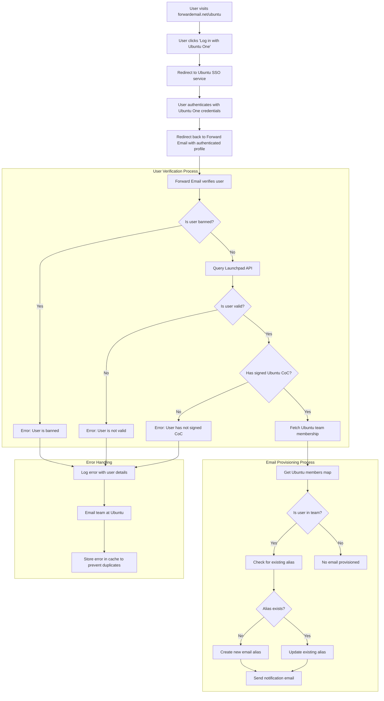

# Case Study: Hoe Canonical Ubuntu Email Management van stroom voorziet met Forward Email's open-source Enterprise Solution {#case-study-how-canonical-powers-ubuntu-email-management-with-forward-emails-open-source-enterprise-solution}


## Inhoudsopgave {#table-of-contents}

* [Voorwoord](#foreword)
* [De uitdaging: het beheren van een complex e-mailecosysteem](#the-challenge-managing-a-complex-email-ecosystem)
* [Belangrijkste punten](#key-takeaways)
* [Waarom e-mail doorsturen?](#why-forward-email)
* [De implementatie: naadloze SSO-integratie](#the-implementation-seamless-sso-integration)
  * [Visualisatie van authenticatiestroom](#authentication-flow-visualization)
  * [Technische implementatiedetails](#technical-implementation-details)
* [DNS-configuratie en e-mailroutering](#dns-configuration-and-email-routing)
* [Resultaten: gestroomlijnd e-mailbeheer en verbeterde beveiliging](#results-streamlined-email-management-and-enhanced-security)
  * [Operationele efficiëntie](#operational-efficiency)
  * [Verbeterde beveiliging en privacy](#enhanced-security-and-privacy)
  * [Kostenbesparingen](#cost-savings)
  * [Verbeterde ervaring voor bijdragers](#improved-contributor-experience)
* [Vooruitkijken: voortdurende samenwerking](#looking-forward-continued-collaboration)
* [Conclusie: een perfect open-sourcepartnerschap](#conclusion-a-perfect-open-source-partnership)
* [Ondersteuning van zakelijke klanten](#supporting-enterprise-clients)
  * [Neem contact op](#get-in-touch)
  * [Over het doorsturen van e-mail](#about-forward-email)

## Voorwoord {#foreword}

In de wereld van open-source software zijn er maar weinig namen die zoveel gewicht in de schaal leggen als [Canoniek](https://en.wikipedia.org/wiki/Canonical_\(company\), het bedrijf achter [Ubuntu](https://en.wikipedia.org/wiki/Ubuntu), een van de populairste Linux-distributies wereldwijd. Met een uitgebreid ecosysteem dat meerdere distributies omvat, waaronder Ubuntu, [Vrij](https://en.wikipedia.org/wiki/Kubuntu), [Lubuntu](https://en.wikipedia.org/wiki/Lubuntu), [Edubuntu](https://en.wikipedia.org/wiki/Edubuntu) en andere, stond Canonical voor unieke uitdagingen bij het beheren van e-mailadressen binnen hun verschillende domeinen. Deze casestudy onderzoekt hoe Canonical samenwerkte met Forward Email om een naadloze, veilige en privacygerichte oplossing voor e-mailbeheer voor bedrijven te creëren die perfect aansluit bij hun open-sourcewaarden.

## De uitdaging: een complex e-mailecosysteem beheren {#the-challenge-managing-a-complex-email-ecosystem}

Het ecosysteem van Canonical is divers en uitgebreid. Met miljoenen gebruikers wereldwijd en duizenden bijdragers in verschillende projecten, vormde het beheer van e-mailadressen over meerdere domeinen een aanzienlijke uitdaging. Kernbijdragers hadden officiële e-mailadressen (@ubuntu.com, @kubuntu.org, enz.) nodig die hun betrokkenheid bij het project weerspiegelden, maar tegelijkertijd de veiligheid en het gebruiksgemak behielden via een robuust Ubuntu-domeinbeheersysteem.

Voordat Canonical Forward Email implementeerde, kampte het met:

* Het beheren van e-mailadressen over meerdere domeinen (@ubuntu.com, @kubuntu.org, @lubuntu.me, @edubuntu.org en @ubuntu.net)
* Het bieden van een consistente e-mailervaring voor kernmedewerkers
* Het integreren van e-maildiensten met hun bestaande [Ubuntu One](https://en.wikipedia.org/wiki/Ubuntu_One) Single Sign-On (SSO)-systeem
* Het vinden van een oplossing die aansluit bij hun toewijding aan privacy, beveiliging en open-source e-mailbeveiliging
* Het kosteneffectief schalen van hun beveiligde e-mailinfrastructuur

## Belangrijkste punten {#key-takeaways}

* Canonical heeft met succes een uniforme oplossing voor e-mailbeheer geïmplementeerd voor meerdere Ubuntu-domeinen.
* De 100% open-sourcebenadering van Forward Email sloot perfect aan bij de waarden van Canonical.
* SSO-integratie met Ubuntu One biedt naadloze authenticatie voor medewerkers.
* Kwantumbestendige encryptie garandeert langdurige beveiliging voor alle e-mailcommunicatie.
* De oplossing is kosteneffectief schaalbaar om Canonicals groeiende aantal medewerkers te ondersteunen.

## Waarom e-mail doorsturen {#why-forward-email}

Als enige 100% open-source e-mailprovider met een focus op privacy en beveiliging, paste Forward Email perfect bij Canonical's behoeften op het gebied van e-maildoorsturing voor bedrijven. Onze waarden sloten perfect aan bij Canonical's toewijding aan open-source software en privacy.

Belangrijke factoren die Forward Email tot de ideale keuze maakten, waren onder meer:

1. **Volledige open-source codebase**: Ons volledige platform is open-source en beschikbaar op [GitHub](https://en.wikipedia.org/wiki/GitHub), wat transparantie en bijdragen van de community mogelijk maakt. In tegenstelling tot veel "privacygerichte" e-mailproviders die alleen hun front-ends opensourcen en hun back-ends gesloten houden, hebben wij onze volledige codebase – zowel front-end als back-end – voor iedereen beschikbaar gesteld op [GitHub](https://github.com/forwardemail/forwardemail.net).

2. **Privacygerichte aanpak**: In tegenstelling tot andere providers slaan wij e-mails niet op in gedeelde databases en gebruiken we robuuste encryptie met TLS. Onze fundamentele privacyfilosofie is simpel: **uw e-mails zijn van u en alleen van u**. Dit principe vormt de basis voor elke technische beslissing die we nemen, van hoe we e-maildoorsturing afhandelen tot hoe we encryptie implementeren.

3. **Niet afhankelijk van derden**: Wij maken geen gebruik van Amazon SES of andere diensten van derden. Hierdoor hebben wij volledige controle over de e-mailinfrastructuur en worden mogelijke privacylekken via diensten van derden uitgesloten.

4. **Kosteneffectieve schaalbaarheid**: Ons prijsmodel zorgt ervoor dat organisaties kunnen schalen zonder per gebruiker te betalen. Dit maakt het ideaal voor de grote groep bijdragers van Canonical.

5. **Kwantumbestendige encryptie**: We gebruiken individueel versleutelde SQLite-mailboxen met [ChaCha20-Poly1305](https://en.wikipedia.org/wiki/ChaCha20-Poly1305) als code voor [kwantumbestendige encryptie](/blog/docs/best-quantum-safe-encrypted-email-service). Elke mailbox is een apart versleuteld bestand, wat betekent dat toegang tot de gegevens van de ene gebruiker geen toegang verleent aan anderen.

## De implementatie: naadloze SSO-integratie {#the-implementation-seamless-sso-integration}

Een van de meest cruciale aspecten van de implementatie was de integratie met Canonical's bestaande Ubuntu One SSO-systeem. Deze integratie zou kernmedewerkers in staat stellen hun @ubuntu.com-e-mailadressen te beheren met hun bestaande Ubuntu One-inloggegevens.

### Visualisatie van authenticatiestroom {#authentication-flow-visualization}

Het onderstaande diagram illustreert de volledige authenticatie- en e-mailinrichtingsstroom:



### Technische implementatiedetails {#technical-implementation-details}

De integratie tussen Forward Email en Ubuntu One SSO werd gerealiseerd door een aangepaste implementatie van de Passport-Ubuntu authenticatiestrategie. Dit zorgde voor een naadloze authenticatiestroom tussen Ubuntu One en de systemen van Forward Email.

#### De authenticatiestroom {#the-authentication-flow}

Het authenticatieproces werkt als volgt:

1. Gebruikers bezoeken de speciale Ubuntu-pagina voor e-mailbeheer op [forwardemail.net/ubuntu](https://forwardemail.net/ubuntu)
2. Ze klikken op "Inloggen met Ubuntu One" en worden doorgestuurd naar de Ubuntu SSO-service.
3. Nadat ze zich hebben geauthenticeerd met hun Ubuntu One-inloggegevens, worden ze teruggestuurd naar Forward Email met hun geauthenticeerde profiel.
4. Forward Email verifieert hun status als bijdrager en bepaalt of beheert hun e-mailadres dienovereenkomstig.

De technische implementatie maakte gebruik van het [`passport-ubuntu`](https://www.npmjs.com/package/passport-ubuntu)-pakket, een [Paspoort](https://www.npmjs.com/package/passport)-strategie voor authenticatie met Ubuntu met behulp van [OpenID](https://en.wikipedia.org/wiki/OpenID). De configuratie omvatte:

```javascript
passport.use(new UbuntuStrategy({
  returnURL: process.env.UBUNTU_CALLBACK_URL,
  realm: process.env.UBUNTU_REALM,
  stateless: true
}, function(identifier, profile, done) {
  // User verification and email provisioning logic
}));
```

#### Launchpad API-integratie en -validatie {#launchpad-api-integration-and-validation}

Een cruciaal onderdeel van onze implementatie is de integratie met de API van [Lanceerplatform](https://en.wikipedia.org/wiki/Launchpad_\(website\)) om Ubuntu-gebruikers en hun teamlidmaatschappen te valideren. We hebben herbruikbare helperfuncties ontwikkeld om deze integratie efficiënt en betrouwbaar af te handelen.

De helperfunctie `sync-ubuntu-user.js` is verantwoordelijk voor het valideren van gebruikers via de Launchpad API en het beheren van hun e-mailadressen. Hier is een vereenvoudigde versie van hoe het werkt:

```javascript
async function syncUbuntuUser(user, map) {
  try {
    // Validate user object
    if (!_.isObject(user) ||
        !isSANB(user[fields.ubuntuUsername]) ||
        !isSANB(user[fields.ubuntuProfileID]) ||
        !isEmail(user.email))
      throw new TypeError('Invalid user object');

    // Get Ubuntu members map if not provided
    if (!(map instanceof Map))
      map = await getUbuntuMembersMap(resolver);

    // Check if user is banned
    if (user[config.userFields.isBanned]) {
      throw new InvalidUbuntuUserError('User was banned', { ignoreHook: true });
    }

    // Query Launchpad API to validate user
    const url = `https://api.launchpad.net/1.0/~${user[fields.ubuntuUsername]}`;
    const response = await retryRequest(url, { resolver });
    const json = await response.body.json();

    // Validate required boolean properties
    if (!json.is_valid)
      throw new InvalidUbuntuUserError('Property "is_valid" was false');

    if (!json.is_ubuntu_coc_signer)
      throw new InvalidUbuntuUserError('Property "is_ubuntu_coc_signer" was false');

    // Process each domain for the user
    await pMap([...map.keys()], async (name) => {
      // Find domain in database
      const domain = await Domains.findOne({
        name,
        plan: 'team',
        has_txt_record: true
      }).populate('members.user');

      // Process user's email alias for this domain
      if (map.get(name).has(user[fields.ubuntuUsername])) {
        // User is a member of this team, create or update alias
        let alias = await Aliases.findOne({
          user: user._id,
          domain: domain._id,
          name: user[fields.ubuntuUsername].toLowerCase()
        });

        if (!alias) {
          // Create new alias with appropriate error handling
          alias = await Aliases.create({
            user: user._id,
            domain: domain._id,
            name: user[fields.ubuntuUsername].toLowerCase(),
            recipients: [user.email],
            locale: user[config.lastLocaleField],
            is_enabled: true
          });

          // Notify admins about new alias creation
          await emailHelper({
            template: 'alert',
            message: {
              to: adminEmailsForDomain,
              subject: `New @${domain.name} email address created`
            },
            locals: {
              message: `A new email address ${user[fields.ubuntuUsername].toLowerCase()}@${domain.name} was created for ${user.email}`
            }
          });
        }
      }
    });

    return true;
  } catch (err) {
    // Handle and log errors
    await logErrorWithUser(err, user);
    throw err;
  }
}
```

Om het beheer van teamlidmaatschappen in verschillende Ubuntu-domeinen te vereenvoudigen, hebben we een eenvoudige koppeling gemaakt tussen domeinnamen en de bijbehorende Launchpad-teams:

```javascript
ubuntuTeamMapping: {
  'ubuntu.com': '~ubuntumembers',
  'kubuntu.org': '~kubuntu-members',
  'lubuntu.me': '~lubuntu-members',
  'edubuntu.org': '~edubuntu-members',
  'ubuntustudio.com': '~ubuntustudio-core',
  'ubuntu.net': '~ubuntu-smtp-test'
},
```

Dankzij deze eenvoudige toewijzing kunnen we het proces van het controleren van teamlidmaatschappen en het toewijzen van e-mailadressen automatiseren. Hierdoor kan het systeem eenvoudig worden onderhouden en uitgebreid wanneer er nieuwe domeinen worden toegevoegd.

#### Foutverwerking en meldingen {#error-handling-and-notifications}

We hebben een robuust systeem voor foutbehandeling geïmplementeerd dat:

1. Registreert alle fouten met gedetailleerde gebruikersinformatie.
2. Stuurt een e-mail naar het Ubuntu-team wanneer er problemen worden gedetecteerd.
3. Stelt beheerders op de hoogte wanneer nieuwe medewerkers zich aanmelden en e-mailadressen hebben aangemaakt.
4. Behandelt randgevallen, zoals gebruikers die de Ubuntu-gedragscode niet hebben ondertekend.

Zo wordt gegarandeerd dat eventuele problemen snel worden geïdentificeerd en opgelost, terwijl de integriteit van het e-mailsysteem behouden blijft.

## DNS-configuratie en e-mailroutering {#dns-configuration-and-email-routing}

Voor elk domein dat via Forward Email wordt beheerd, heeft Canonical een eenvoudige DNS TXT-record toegevoegd voor validatie:

```sh
❯ dig ubuntu.com txt
ubuntu.com.             600     IN      TXT     "forward-email-site-verification=6IsURgl2t7"
```

Dit verificatierecord bevestigt het domeineigendom en stelt ons systeem in staat om e-mail voor deze domeinen veilig te beheren. Canonical routeert e-mail via onze service via Postfix, wat een betrouwbare en veilige infrastructuur voor e-mailbezorging biedt.

## Resultaten: Gestroomlijnd e-mailbeheer en verbeterde beveiliging {#results-streamlined-email-management-and-enhanced-security}

De implementatie van de zakelijke oplossing van Forward Email heeft aanzienlijke voordelen opgeleverd voor Canonical's e-mailbeheer in al haar domeinen:

### Operationele efficiëntie {#operational-efficiency}

* **Gecentraliseerd beheer**: Alle Ubuntu-gerelateerde domeinen worden nu beheerd via één interface
* **Verminderde administratieve overhead**: Geautomatiseerde provisioning en selfservicebeheer voor bijdragers
* **Vereenvoudigde onboarding**: Nieuwe bijdragers kunnen snel hun officiële e-mailadres krijgen

### Verbeterde beveiliging en privacy {#enhanced-security-and-privacy}

* **End-to-end encryptie**: Alle e-mails worden versleuteld met behulp van geavanceerde standaarden
* **Geen gedeelde databases**: De e-mails van elke gebruiker worden opgeslagen in individuele, versleutelde SQLite-databases, wat zorgt voor een sandbox-encryptiebenadering die fundamenteel veiliger is dan traditionele, gedeelde relationele databases
* **Open-sourcebeveiliging**: De transparante codebase maakt beveiligingscontroles door de community mogelijk
* **In-memory processing**: We slaan doorgestuurde e-mails niet op schijf op, wat de privacybescherming verbetert
* **Geen metadataopslag**: We houden geen gegevens bij van wie wie e-mailt, in tegenstelling tot veel e-mailproviders

### Kostenbesparing {#cost-savings}

* **Schaalbaar prijsmodel**: Geen kosten per gebruiker, waardoor Canonical medewerkers kan toevoegen zonder de kosten te verhogen
* **Verminderde infrastructuurbehoeften**: Geen noodzaak om aparte e-mailservers voor verschillende domeinen te onderhouden
* **Lagere ondersteuningsvereisten**: Selfservicebeheer vermindert het aantal IT-supporttickets

### Verbeterde ervaring voor medewerkers {#improved-contributor-experience}

* **Naadloze authenticatie**: Single sign-on met bestaande Ubuntu One-referenties
* **Consistente branding**: Uniforme ervaring voor alle Ubuntu-gerelateerde services
* **Betrouwbare e-mailbezorging**: Een hoogwaardige IP-reputatie zorgt ervoor dat e-mails hun bestemming bereiken

De integratie met Forward Email heeft het e-mailbeheerproces van Canonical aanzienlijk gestroomlijnd. Medewerkers kunnen nu hun @ubuntu.com-e-mailadressen naadloos beheren, met minder administratieve overhead en verbeterde beveiliging.

## Vooruitkijken: voortdurende samenwerking {#looking-forward-continued-collaboration}

De samenwerking tussen Canonical en Forward Email blijft zich ontwikkelen. We werken samen aan verschillende initiatieven:

* Uitbreiding van e-maildiensten naar extra Ubuntu-gerelateerde domeinen
* Verbetering van de gebruikersinterface op basis van feedback van bijdragers
* Implementatie van extra beveiligingsfuncties
* Onderzoek naar nieuwe manieren om onze open-sourcesamenwerking te benutten

## Conclusie: een perfect open-sourcepartnerschap {#conclusion-a-perfect-open-source-partnership}

De samenwerking tussen Canonical en Forward Email toont de kracht van partnerschappen gebaseerd op gedeelde waarden. Door te kiezen voor Forward Email als e-mailprovider vond Canonical een oplossing die niet alleen voldeed aan hun technische eisen, maar ook perfect aansloot bij hun toewijding aan opensourcesoftware, privacy en beveiliging.

Voor organisaties die meerdere domeinen beheren en naadloze authenticatie met bestaande systemen nodig hebben, biedt Forward Email een flexibele, veilige en privacygerichte oplossing. Onze [open-sourcebenadering](https://forwardemail.net/blog/docs/why-open-source-email-security-privacy) garandeert transparantie en maakt bijdragen vanuit de community mogelijk, waardoor het een ideale keuze is voor organisaties die deze principes hoog in het vaandel hebben staan.

Aangezien Canonical en Forward Email beiden blijven innoveren op hun eigen vakgebied, is dit partnerschap een bewijs van de kracht van open-source-samenwerking en gedeelde waarden bij het creëren van effectieve oplossingen.

U kunt onze huidige e-mailbezorgprestaties bekijken op onze [realtime servicestatus](https://status.forwardemail.net). Deze worden continu gecontroleerd om een goede IP-reputatie en e-mailbezorging te garanderen.

## Ondersteuning voor zakelijke klanten {#supporting-enterprise-clients}

Hoewel deze casestudy zich richt op onze samenwerking met Canonical, ondersteunt Forward Email met trots talloze zakelijke klanten in verschillende sectoren die waarde hechten aan onze toewijding aan privacy, beveiliging en open-sourceprincipes.

Onze bedrijfsoplossingen zijn afgestemd op de specifieke behoeften van organisaties van elke omvang en bieden:

* Aangepast domein [e-mailbeheer](/) over meerdere domeinen
* Naadloze integratie met bestaande authenticatiesystemen
* Speciaal Matrix chatkanaal voor support
* Verbeterde beveiligingsfuncties, waaronder [kwantumbestendige encryptie](/blog/docs/best-quantum-safe-encrypted-email-service)
* Volledige dataportabiliteit en -eigendom
* 100% open-source infrastructuur voor transparantie en vertrouwen

### Neem contact op {#get-in-touch}

Heeft uw organisatie behoefte aan zakelijke e-mail of wilt u meer weten over hoe Forward Email u kan helpen uw e-mailbeheer te stroomlijnen en tegelijkertijd de privacy en beveiliging te verbeteren? Dan horen we graag van u:

* Stuur ons rechtstreeks een e-mail op `support@forwardemail.net`
* Dien een hulpverzoek in bij onze [helppagina](https://forwardemail.net/help)
* Bekijk onze [prijspagina](https://forwardemail.net/pricing) voor zakelijke abonnementen

Ons team staat klaar om uw specifieke behoeften te bespreken en een oplossing op maat te ontwikkelen die aansluit bij de waarden en technische behoeften van uw organisatie.

### Over het doorsturen van e-mail {#about-forward-email}

Forward Email is de 100% open-source en privacygerichte e-mailservice. We bieden e-mailforwarding op maat voor domeinen, SMTP, IMAP en POP3, met een focus op beveiliging, privacy en transparantie. Onze volledige codebase is beschikbaar op [GitHub](https://github.com/forwardemail/forwardemail.net) en we streven ernaar e-mailservices te leveren die de privacy en veiligheid van gebruikers respecteren. Lees meer over [Waarom open-source e-mail de toekomst is](https://forwardemail.net/blog/docs/why-open-source-email-security-privacy), [hoe onze e-maildoorsturing werkt](https://forwardemail.net/blog/docs/best-email-forwarding-service) en [onze aanpak voor de bescherming van e-mailprivacy](https://forwardemail.net/blog/docs/email-privacy-protection-technical-implementation).