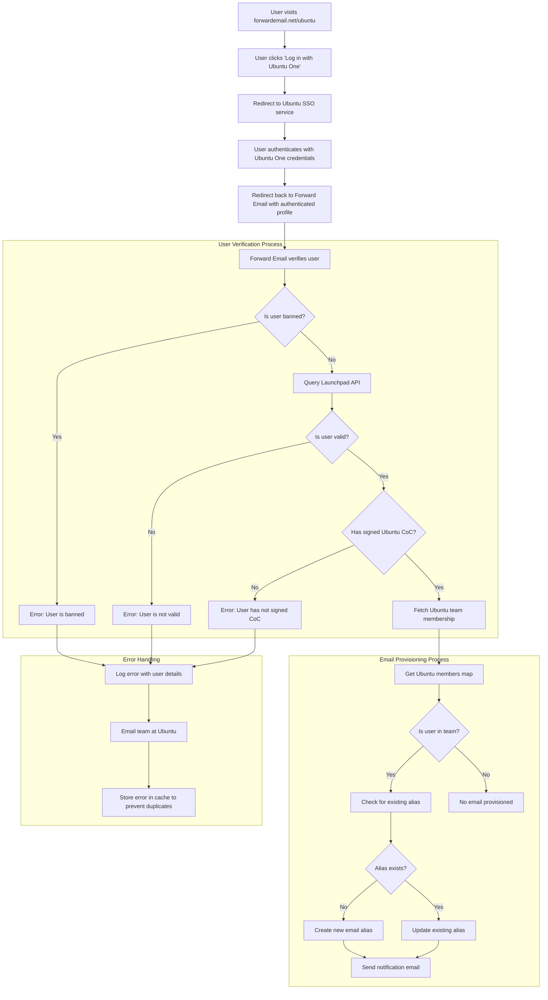

# Case Study: Hoe Canonical Ubuntu e-mailbeheer aandrijft met Forward Email's open-source enterprise oplossing {#case-study-how-canonical-powers-ubuntu-email-management-with-forward-emails-open-source-enterprise-solution}


## Inhoudsopgave {#table-of-contents}

* [Voorwoord](#foreword)
* [De Uitdaging: Het beheren van een complex e-mail ecosysteem](#the-challenge-managing-a-complex-email-ecosystem)
* [Belangrijkste Leerpunten](#key-takeaways)
* [Waarom Forward Email](#why-forward-email)
* [De Implementatie: Naadloze SSO-integratie](#the-implementation-seamless-sso-integration)
  * [Visualisatie van de authenticatiestroom](#authentication-flow-visualization)
  * [Technische implementatiedetails](#technical-implementation-details)
* [DNS-configuratie en e-mailroutering](#dns-configuration-and-email-routing)
* [Resultaten: Gestroomlijnd e-mailbeheer en verbeterde beveiliging](#results-streamlined-email-management-and-enhanced-security)
  * [Operationele efficiëntie](#operational-efficiency)
  * [Verbeterde beveiliging en privacy](#enhanced-security-and-privacy)
  * [Kostenbesparingen](#cost-savings)
  * [Verbeterde ervaring voor bijdragers](#improved-contributor-experience)
* [Vooruitblik: Voortgezette samenwerking](#looking-forward-continued-collaboration)
* [Conclusie: Een perfecte open-source samenwerking](#conclusion-a-perfect-open-source-partnership)
* [Ondersteuning van enterprise klanten](#supporting-enterprise-clients)
  * [Neem contact op](#get-in-touch)
  * [Over Forward Email](#about-forward-email)


## Voorwoord {#foreword}

In de wereld van open-source software dragen weinig namen zoveel gewicht als [Canonical](https://en.wikipedia.org/wiki/Canonical_\(company\)), het bedrijf achter [Ubuntu](https://en.wikipedia.org/wiki/Ubuntu), een van de populairste Linux-distributies wereldwijd. Met een uitgebreid ecosysteem dat meerdere distributies omvat, waaronder Ubuntu, [Kubuntu](https://en.wikipedia.org/wiki/Kubuntu), [Lubuntu](https://en.wikipedia.org/wiki/Lubuntu), [Edubuntu](https://en.wikipedia.org/wiki/Edubuntu) en anderen, stond Canonical voor unieke uitdagingen bij het beheren van e-mailadressen over hun talrijke domeinen. Deze case study onderzoekt hoe Canonical samenwerkte met Forward Email om een naadloze, veilige en privacygerichte enterprise e-mailbeheeroplossing te creëren die perfect aansluit bij hun open-source waarden.


## De Uitdaging: Het beheren van een complex e-mail ecosysteem {#the-challenge-managing-a-complex-email-ecosystem}

Het ecosysteem van Canonical is divers en omvangrijk. Met miljoenen gebruikers wereldwijd en duizenden bijdragers aan verschillende projecten, bracht het beheren van e-mailadressen over meerdere domeinen aanzienlijke uitdagingen met zich mee. Kernbijdragers hadden officiële e-mailadressen nodig (@ubuntu.com, @kubuntu.org, enz.) die hun betrokkenheid bij het project weerspiegelden, terwijl ze veiligheid en gebruiksgemak behielden via een robuust Ubuntu domeinbeheersysteem.

Voor de implementatie van Forward Email worstelde Canonical met:

* Het beheren van e-mailadressen over meerdere domeinen (@ubuntu.com, @kubuntu.org, @lubuntu.me, @edubuntu.org en @ubuntu.net)
* Het bieden van een consistente e-mailervaring voor kernbijdragers
* Het integreren van e-maildiensten met hun bestaande [Ubuntu One](https://en.wikipedia.org/wiki/Ubuntu_One) Single Sign-On (SSO) systeem
* Het vinden van een oplossing die aansloot bij hun inzet voor privacy, beveiliging en open-source e-mailbeveiliging
* Het kosteneffectief opschalen van hun veilige e-mailinfrastructuur


## Belangrijkste Leerpunten {#key-takeaways}

* Canonical implementeerde met succes een uniforme e-mailbeheeroplossing over meerdere Ubuntu-domeinen
* Forward Email's 100% open-source aanpak sloot perfect aan bij de waarden van Canonical
* SSO-integratie met Ubuntu One zorgt voor naadloze authenticatie voor bijdragers
* Kwantumresistente encryptie garandeert langdurige beveiliging voor alle e-mailcommunicatie
* De oplossing schaalt kosteneffectief mee met de groeiende groep bijdragers van Canonical


## Waarom Forward Email {#why-forward-email}
Als de enige 100% open-source e-maildienstverlener met een focus op privacy en beveiliging, was Forward Email een natuurlijke keuze voor de enterprise e-mail forwarding behoeften van Canonical. Onze waarden sloten perfect aan bij Canonical's inzet voor open-source software en privacy.

Belangrijke factoren die Forward Email de ideale keuze maakten, waren onder andere:

1. **Volledig open-source codebase**: Ons gehele platform is open-source en beschikbaar op [GitHub](https://en.wikipedia.org/wiki/GitHub), wat transparantie en bijdragen vanuit de community mogelijk maakt. In tegenstelling tot veel "privacygerichte" e-mailproviders die alleen hun frontends open-source maken terwijl ze hun backends gesloten houden, hebben wij onze volledige codebase—zowel frontend als backend—beschikbaar gesteld voor iedereen om te inspecteren op [GitHub](https://github.com/forwardemail/forwardemail.net).

2. **Privacygerichte aanpak**: In tegenstelling tot andere providers slaan wij e-mails niet op in gedeelde databases en gebruiken we robuuste encryptie met TLS. Onze fundamentele privacyfilosofie is eenvoudig: **jouw e-mails behoren toe aan jou en alleen aan jou**. Dit principe stuurt elke technische beslissing die we nemen, van hoe we e-mail forwarding afhandelen tot hoe we encryptie implementeren.

3. **Geen afhankelijkheid van derden**: We gebruiken geen Amazon SES of andere diensten van derden, wat ons volledige controle geeft over de e-mailinfrastructuur en potentiële privacylekken via derden elimineert.

4. **Kosteneffectieve schaalbaarheid**: Ons prijsmodel stelt organisaties in staat te schalen zonder per gebruiker te betalen, wat ideaal is voor Canonical's grote groep bijdragers.

5. **Quantum-resistente encryptie**: We gebruiken individueel versleutelde SQLite-mailboxen met [ChaCha20-Poly1305](https://en.wikipedia.org/wiki/ChaCha20-Poly1305) als cipher voor [quantum-resistente encryptie](/blog/docs/best-quantum-safe-encrypted-email-service). Elke mailbox is een apart versleuteld bestand, wat betekent dat toegang tot de data van één gebruiker geen toegang geeft tot die van anderen.


## De Implementatie: Naadloze SSO-integratie {#the-implementation-seamless-sso-integration}

Een van de meest kritieke aspecten van de implementatie was de integratie met Canonical's bestaande Ubuntu One SSO-systeem. Deze integratie zou kernbijdragers in staat stellen hun @ubuntu.com e-mailadressen te beheren met hun bestaande Ubuntu One-gegevens.

### Visualisatie van de authenticatiestroom {#authentication-flow-visualization}

Het volgende diagram illustreert de volledige authenticatie- en e-mailvoorzieningsstroom:


```mermaid
flowchart TD
    A[User visits forwardemail.net/ubuntu] --> B[User clicks 'Log in with Ubuntu One']
    B --> C[Redirect to Ubuntu SSO service]
    C --> D[User authenticates with Ubuntu One credentials]
    D --> E[Redirect back to Forward Email with authenticated profile]
    E --> F[Forward Email verifies user]

    subgraph "User Verification Process"
        F --> G{Is user banned?}
        G -->|Yes| H[Error: User is banned]
        G -->|No| I[Query Launchpad API]
        I --> J{Is user valid?}
        J -->|No| K[Error: User is not valid]
        J -->|Yes| L{Has signed Ubuntu CoC?}
        L -->|No| M[Error: User has not signed CoC]
        L -->|Yes| N[Fetch Ubuntu team membership]
    end

    subgraph "Email Provisioning Process"
        N --> O[Get Ubuntu members map]
        O --> P{Is user in team?}
        P -->|Yes| Q[Check for existing alias]
        Q --> R{Alias exists?}
        R -->|No| S[Create new email alias]
        R -->|Yes| T[Update existing alias]
        S --> U[Send notification email]
        T --> U
        P -->|No| V[No email provisioned]
    end

    subgraph "Error Handling"
        H --> W[Log error with user details]
        K --> W
        M --> W
        W --> X[Email team at Ubuntu]
        X --> Y[Store error in cache to prevent duplicates]
    end
```

### Technische implementatiedetails {#technical-implementation-details}

De integratie tussen Forward Email en Ubuntu One SSO werd gerealiseerd via een aangepaste implementatie van de passport-ubuntu authenticatiestrategie. Dit maakte een naadloze authenticatiestroom mogelijk tussen Ubuntu One en de systemen van Forward Email.
#### De Authenticatiestroom {#the-authentication-flow}

Het authenticatieproces werkt als volgt:

1. Gebruikers bezoeken de speciale Ubuntu e-mailbeheerpagina op [forwardemail.net/ubuntu](https://forwardemail.net/ubuntu)
2. Ze klikken op "Log in met Ubuntu One" en worden doorgestuurd naar de Ubuntu SSO-service
3. Na authenticatie met hun Ubuntu One-gegevens worden ze teruggeleid naar Forward Email met hun geverifieerde profiel
4. Forward Email controleert hun bijdragerstatus en voorziet of beheert hun e-mailadres dienovereenkomstig

De technische implementatie maakte gebruik van het [`passport-ubuntu`](https://www.npmjs.com/package/passport-ubuntu) pakket, dat een [Passport](https://www.npmjs.com/package/passport) strategie is voor authenticatie met Ubuntu via [OpenID](https://en.wikipedia.org/wiki/OpenID). De configuratie omvatte:

```javascript
passport.use(new UbuntuStrategy({
  returnURL: process.env.UBUNTU_CALLBACK_URL,
  realm: process.env.UBUNTU_REALM,
  stateless: true
}, function(identifier, profile, done) {
  // Gebruikersverificatie en e-mailvoorzieningslogica
}));
```

#### Launchpad API-integratie en Validatie {#launchpad-api-integration-and-validation}

Een cruciaal onderdeel van onze implementatie is de integratie met de API van [Launchpad](https://en.wikipedia.org/wiki/Launchpad_\(website\)) om Ubuntu-gebruikers en hun teamlidmaatschappen te valideren. We hebben herbruikbare hulpfuncties gemaakt om deze integratie efficiënt en betrouwbaar te verwerken.

De `sync-ubuntu-user.js` hulpfunctie is verantwoordelijk voor het valideren van gebruikers via de Launchpad API en het beheren van hun e-mailadressen. Hier is een vereenvoudigde versie van hoe het werkt:

```javascript
async function syncUbuntuUser(user, map) {
  try {
    // Valideer gebruikersobject
    if (!_.isObject(user) ||
        !isSANB(user[fields.ubuntuUsername]) ||
        !isSANB(user[fields.ubuntuProfileID]) ||
        !isEmail(user.email))
      throw new TypeError('Ongeldig gebruikersobject');

    // Haal Ubuntu-ledenmap op als deze niet is meegegeven
    if (!(map instanceof Map))
      map = await getUbuntuMembersMap(resolver);

    // Controleer of gebruiker is verbannen
    if (user[config.userFields.isBanned]) {
      throw new InvalidUbuntuUserError('Gebruiker was verbannen', { ignoreHook: true });
    }

    // Vraag Launchpad API aan om gebruiker te valideren
    const url = `https://api.launchpad.net/1.0/~${user[fields.ubuntuUsername]}`;
    const response = await retryRequest(url, { resolver });
    const json = await response.body.json();

    // Valideer vereiste booleaanse eigenschappen
    if (!json.is_valid)
      throw new InvalidUbuntuUserError('Eigenschap "is_valid" was onwaar');

    if (!json.is_ubuntu_coc_signer)
      throw new InvalidUbuntuUserError('Eigenschap "is_ubuntu_coc_signer" was onwaar');

    // Verwerk elk domein voor de gebruiker
    await pMap([...map.keys()], async (name) => {
      // Zoek domein in database
      const domain = await Domains.findOne({
        name,
        plan: 'team',
        has_txt_record: true
      }).populate('members.user');

      // Verwerk e-mailalias van gebruiker voor dit domein
      if (map.get(name).has(user[fields.ubuntuUsername])) {
        // Gebruiker is lid van dit team, maak alias aan of werk bij
        let alias = await Aliases.findOne({
          user: user._id,
          domain: domain._id,
          name: user[fields.ubuntuUsername].toLowerCase()
        });

        if (!alias) {
          // Maak nieuwe alias aan met passende foutafhandeling
          alias = await Aliases.create({
            user: user._id,
            domain: domain._id,
            name: user[fields.ubuntuUsername].toLowerCase(),
            recipients: [user.email],
            locale: user[config.lastLocaleField],
            is_enabled: true
          });

          // Informeer beheerders over nieuwe aliascreatie
          await emailHelper({
            template: 'alert',
            message: {
              to: adminEmailsForDomain,
              subject: `Nieuw @${domain.name} e-mailadres aangemaakt`
            },
            locals: {
              message: `Een nieuw e-mailadres ${user[fields.ubuntuUsername].toLowerCase()}@${domain.name} is aangemaakt voor ${user.email}`
            }
          });
        }
      }
    });

    return true;
  } catch (err) {
    // Fouten afhandelen en loggen
    await logErrorWithUser(err, user);
    throw err;
  }
}
```
Om het beheer van teamlidmaatschappen over verschillende Ubuntu-domeinen te vereenvoudigen, hebben we een eenvoudige koppeling gemaakt tussen domeinnamen en hun bijbehorende Launchpad-teams:

```javascript
ubuntuTeamMapping: {
  'ubuntu.com': '~ubuntumembers',
  'kubuntu.org': '~kubuntu-members',
  'lubuntu.me': '~lubuntu-members',
  'edubuntu.org': '~edubuntu-members',
  'ubuntustudio.com': '~ubuntustudio-core',
  'ubuntu.net': '~ubuntu-smtp-test'
},
```

Deze eenvoudige koppeling stelt ons in staat het proces van het controleren van teamlidmaatschappen en het aanmaken van e-mailadressen te automatiseren, waardoor het systeem gemakkelijk te onderhouden en uit te breiden is naarmate er nieuwe domeinen worden toegevoegd.

#### Foutafhandeling en Meldingen {#error-handling-and-notifications}

We hebben een robuust foutafhandelingssysteem geïmplementeerd dat:

1. Alle fouten logt met gedetailleerde gebruikersinformatie
2. Het Ubuntu-team e-mailt wanneer problemen worden gedetecteerd
3. Beheerders op de hoogte stelt wanneer nieuwe bijdragers zich aanmelden en e-mailadressen worden aangemaakt
4. Randgevallen afhandelt zoals gebruikers die de Ubuntu Code of Conduct nog niet hebben ondertekend

Dit zorgt ervoor dat eventuele problemen snel worden geïdentificeerd en opgelost, waardoor de integriteit van het e-mailsysteem behouden blijft.


## DNS-configuratie en E-mailroutering {#dns-configuration-and-email-routing}

Voor elk domein dat via Forward Email wordt beheerd, heeft Canonical een eenvoudige DNS TXT-record toegevoegd voor verificatie:

```sh
❯ dig ubuntu.com txt
ubuntu.com.             600     IN      TXT     "forward-email-site-verification=6IsURgl2t7"
```

Deze verificatierecord bevestigt het eigendom van het domein en stelt ons systeem in staat om veilig e-mail voor deze domeinen te beheren. Canonical leidt mail via onze service door via Postfix, wat een betrouwbare en veilige e-mailbezorgingsinfrastructuur biedt.


## Resultaten: Gestroomlijnd E-mailbeheer en Verbeterde Beveiliging {#results-streamlined-email-management-and-enhanced-security}

De implementatie van de enterprise-oplossing van Forward Email heeft aanzienlijke voordelen opgeleverd voor het e-mailbeheer van Canonical over al hun domeinen:

### Operationele Efficiëntie {#operational-efficiency}

* **Gecentraliseerd beheer**: Alle Ubuntu-gerelateerde domeinen worden nu beheerd via één interface
* **Verminderde administratieve lasten**: Geautomatiseerde provisioning en selfservicebeheer voor bijdragers
* **Vereenvoudigde onboarding**: Nieuwe bijdragers kunnen snel hun officiële e-mailadressen krijgen

### Verbeterde Beveiliging en Privacy {#enhanced-security-and-privacy}

* **End-to-end encryptie**: Alle e-mails worden versleuteld met geavanceerde standaarden
* **Geen gedeelde databases**: De e-mails van elke gebruiker worden opgeslagen in individuele versleutelde SQLite-databases, wat een sandboxed encryptiebenadering biedt die fundamenteel veiliger is dan traditionele gedeelde relationele databases
* **Open-source beveiliging**: De transparante codebase maakt community security reviews mogelijk
* **In-memory verwerking**: We slaan doorgestuurde e-mails niet op de schijf op, wat de privacybescherming versterkt
* **Geen metadata-opslag**: We bewaren geen gegevens over wie met wie e-mailt, in tegenstelling tot veel e-mailproviders

### Kostenbesparingen {#cost-savings}

* **Schaalbaar prijsmodel**: Geen kosten per gebruiker, waardoor Canonical bijdragers kan toevoegen zonder extra kosten
* **Verminderde infrastructuurbehoeften**: Geen noodzaak om aparte e-mailservers voor verschillende domeinen te onderhouden
* **Lagere ondersteuningsbehoefte**: Selfservicebeheer vermindert IT-supporttickets

### Verbeterde Ervaring voor Bijdragers {#improved-contributor-experience}

* **Naadloze authenticatie**: Single sign-on met bestaande Ubuntu One-gegevens
* **Consistente branding**: Uniforme ervaring over alle Ubuntu-gerelateerde diensten
* **Betrouwbare e-mailbezorging**: Hoge IP-reputatie zorgt ervoor dat e-mails hun bestemming bereiken

De integratie met Forward Email heeft het e-mailbeheerproces van Canonical aanzienlijk gestroomlijnd. Bijdragers hebben nu een naadloze ervaring bij het beheren van hun @ubuntu.com e-mailadressen, met minder administratieve lasten en verbeterde beveiliging.


## Vooruitblik: Voortgezette Samenwerking {#looking-forward-continued-collaboration}

De samenwerking tussen Canonical en Forward Email blijft zich ontwikkelen. We werken samen aan verschillende initiatieven:
* Uitbreiding van e-mailservices naar extra Ubuntu-gerelateerde domeinen
* Verbetering van de gebruikersinterface op basis van feedback van bijdragers
* Implementatie van aanvullende beveiligingsfuncties
* Verkenning van nieuwe manieren om onze open-source samenwerking te benutten


## Conclusie: Een Perfecte Open-Source Samenwerking {#conclusion-a-perfect-open-source-partnership}

De samenwerking tussen Canonical en Forward Email toont de kracht van partnerschappen die zijn gebouwd op gedeelde waarden. Door Forward Email te kiezen als hun e-mailserviceprovider vond Canonical een oplossing die niet alleen aan hun technische eisen voldeed, maar ook perfect aansloot bij hun inzet voor open-source software, privacy en beveiliging.

Voor organisaties die meerdere domeinen beheren en naadloze authenticatie met bestaande systemen vereisen, biedt Forward Email een flexibele, veilige en privacygerichte oplossing. Onze [open-source aanpak](https://forwardemail.net/blog/docs/why-open-source-email-security-privacy) zorgt voor transparantie en maakt communitybijdragen mogelijk, waardoor het een ideale keuze is voor organisaties die deze principes waarderen.

Terwijl zowel Canonical als Forward Email blijven innoveren in hun respectievelijke vakgebieden, staat deze samenwerking als een bewijs van de kracht van open-source samenwerking en gedeelde waarden bij het creëren van effectieve oplossingen.

Je kunt onze [real-time service status](https://status.forwardemail.net) bekijken om onze huidige e-mailbezorgprestaties te zien, die we continu monitoren om een hoge kwaliteit van IP-reputatie en e-mailbezorgbaarheid te waarborgen.


## Ondersteuning van Enterprise Klanten {#supporting-enterprise-clients}

Hoewel deze casestudy zich richt op onze samenwerking met Canonical, ondersteunt Forward Email met trots talrijke enterprise klanten in diverse sectoren die onze inzet voor privacy, beveiliging en open-source principes waarderen.

Onze enterprise oplossingen zijn op maat gemaakt om te voldoen aan de specifieke behoeften van organisaties van elke omvang, met onder andere:

* Beheer van aangepaste domein [e-mail](/) over meerdere domeinen
* Naadloze integratie met bestaande authenticatiesystemen
* Toegewijd Matrix chat supportkanaal
* Verbeterde beveiligingsfuncties inclusief [kwantumveilige encryptie](/blog/docs/best-quantum-safe-encrypted-email-service)
* Volledige gegevensportabiliteit en eigendom
* 100% open-source infrastructuur voor transparantie en vertrouwen

### Neem Contact Op {#get-in-touch}

Als jouw organisatie enterprise e-mailbehoeften heeft of je meer wilt weten over hoe Forward Email kan helpen bij het stroomlijnen van je e-mailbeheer terwijl privacy en beveiliging worden verbeterd, horen we graag van je:

* Stuur ons direct een e-mail naar `support@forwardemail.net`
* Dien een hulpverzoek in via onze [helppagina](https://forwardemail.net/help)
* Bekijk onze [prijspagina](https://forwardemail.net/pricing) voor enterprise plannen

Ons team staat klaar om je specifieke wensen te bespreken en een op maat gemaakte oplossing te ontwikkelen die aansluit bij de waarden en technische behoeften van jouw organisatie.

### Over Forward Email {#about-forward-email}

Forward Email is de 100% open-source en privacygerichte e-mailservice. Wij bieden e-maildoorsturing voor aangepaste domeinen, SMTP, IMAP en POP3 diensten met een focus op beveiliging, privacy en transparantie. Onze volledige codebase is beschikbaar op [GitHub](https://github.com/forwardemail/forwardemail.net), en we zetten ons in voor het leveren van e-mailservices die de privacy en beveiliging van gebruikers respecteren. Lees meer over [waarom open-source e-mail de toekomst is](https://forwardemail.net/blog/docs/why-open-source-email-security-privacy), [hoe onze e-maildoorsturing werkt](https://forwardemail.net/blog/docs/best-email-forwarding-service), en [onze aanpak van e-mailprivacybescherming](https://forwardemail.net/blog/docs/email-privacy-protection-technical-implementation).
