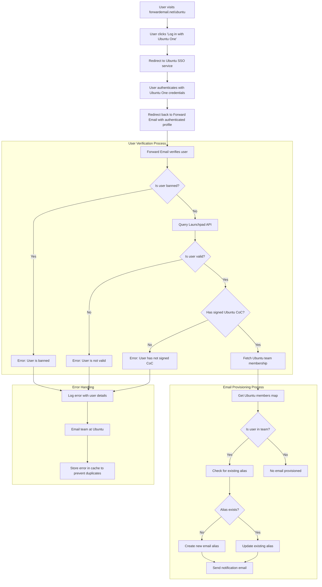

# Casestudie: Hvordan Canonical styrker Ubuntus e-postadministrasjon med videresendt e-posts åpen kildekode-løsning for bedrifter {#case-study-how-canonical-powers-ubuntu-email-management-with-forward-emails-open-source-enterprise-solution}


## Innholdsfortegnelse {#table-of-contents}

* [Forord](#foreword)
* [Utfordringen: Administrere et komplekst e-postøkosystem](#the-challenge-managing-a-complex-email-ecosystem)
* [Viktige konklusjoner](#key-takeaways)
* [Hvorfor videresende e-post](#why-forward-email)
* [Implementeringen: Sømløs SSO-integrasjon](#the-implementation-seamless-sso-integration)
  * [Visualisering av autentiseringsflyt](#authentication-flow-visualization)
  * [Tekniske implementeringsdetaljer](#technical-implementation-details)
* [DNS-konfigurasjon og e-postruting](#dns-configuration-and-email-routing)
* [Resultater: Strømlinjeformet e-posthåndtering og forbedret sikkerhet](#results-streamlined-email-management-and-enhanced-security)
  * [Driftseffektivitet](#operational-efficiency)
  * [Forbedret sikkerhet og personvern](#enhanced-security-and-privacy)
  * [Kostnadsbesparelser](#cost-savings)
  * [Forbedret bidragsyteropplevelse](#improved-contributor-experience)
* [Ser fremover: Fortsatt samarbeid](#looking-forward-continued-collaboration)
* [Konklusjon: Et perfekt partnerskap med åpen kildekode](#conclusion-a-perfect-open-source-partnership)
* [Støtte for bedriftskunder](#supporting-enterprise-clients)
  * [Ta kontakt](#get-in-touch)
  * [Om videresending av e-post](#about-forward-email)

## Forord {#foreword}

I verden av åpen kildekode-programvare er det få navn som bærer så mye vekt som [Kanonisk](https://en.wikipedia.org/wiki/Canonical_\(company\)), selskapet bak [Ubuntu](https://en.wikipedia.org/wiki/Ubuntu), en av de mest populære Linux-distribusjonene globalt. Med et stort økosystem som spenner over flere distribusjoner, inkludert Ubuntu, [Gratis](https://en.wikipedia.org/wiki/Kubuntu), [Lubuntu](https://en.wikipedia.org/wiki/Lubuntu), [Edubuntu](https://en.wikipedia.org/wiki/Edubuntu) og andre, møtte Canonical unike utfordringer med å administrere e-postadresser på tvers av sine mange domener. Denne casestudien utforsker hvordan Canonical samarbeidet med Forward Email for å lage en sømløs, sikker og personvernfokusert e-posthåndteringsløsning for bedrifter som samsvarer perfekt med deres verdier innen åpen kildekode.

## Utfordringen: Administrere et komplekst e-postøkosystem {#the-challenge-managing-a-complex-email-ecosystem}

Canonicals økosystem er mangfoldig og omfattende. Med millioner av brukere over hele verden og tusenvis av bidragsytere på tvers av ulike prosjekter, presenterte det betydelige utfordringer å administrere e-postadresser på tvers av flere domener. Kjernebidragsyterne trengte offisielle e-postadresser (@ubuntu.com, @kubuntu.org, osv.) som gjenspeilet deres involvering i prosjektet, samtidig som de opprettholdt sikkerhet og brukervennlighet gjennom et robust Ubuntu-domeneadministrasjonssystem.

Før implementeringen av videresendt e-post slet Canonical med:

* Administrere e-postadresser på tvers av flere domener (@ubuntu.com, @kubuntu.org, @lubuntu.me, @edubuntu.org og @ubuntu.net)
* Tilby en konsistent e-postopplevelse for kjernebidragsytere
* Integrere e-posttjenester med deres eksisterende [Ubuntu One](https://en.wikipedia.org/wiki/Ubuntu_One) Single Sign-On (SSO)-system
* Finne en løsning som samsvarte med deres forpliktelse til personvern, sikkerhet og åpen kildekode-e-postsikkerhet
* Skalere deres sikre e-postinfrastruktur kostnadseffektivt

## Viktige konklusjoner {#key-takeaways}

* Canonical implementerte en enhetlig e-posthåndteringsløsning på tvers av flere Ubuntu-domener
* Videresend e-posts 100 % åpen kildekode-tilnærming samsvarte perfekt med Canonicals verdier
* SSO-integrasjon med Ubuntu One gir sømløs autentisering for bidragsytere
* Kvantebestandig kryptering sikrer langsiktig sikkerhet for all e-postkommunikasjon
* Løsningen skaleres kostnadseffektivt for å støtte Canonicals voksende bidragsyterbase

## Hvorfor videresende e-post {#why-forward-email}

Som den eneste leverandøren av e-posttjenester med 100 % åpen kildekode og fokus på personvern og sikkerhet, var Forward Email et naturlig valg for Canonicals behov for videresending av e-post til bedrifter. Våre verdier stemte perfekt overens med Canonicals forpliktelse til programvare med åpen kildekode og personvern.

Viktige faktorer som gjorde Videresendt E-post til det ideelle valget inkluderte:

1. **Komplett åpen kildekodebase**: Hele plattformen vår er åpen kildekode og tilgjengelig på [GitHub](https://en.wikipedia.org/wiki/GitHub), noe som gir mulighet for åpenhet og bidrag fra fellesskapet. I motsetning til mange «personvernfokuserte» e-postleverandører som bare har åpen kildekode for frontend-ene sine mens de holder backend-ene sine lukket, har vi gjort hele kodebasen vår – både frontend og backend – tilgjengelig for alle å inspisere på [GitHub](https://github.com/forwardemail/forwardemail.net).

2. **Personvernfokusert tilnærming**: I motsetning til andre leverandører lagrer vi ikke e-poster i delte databaser, og vi bruker robust kryptering med TLS. Vår grunnleggende personvernfilosofi er enkel: **e-postene dine tilhører deg og bare deg**. Dette prinsippet veileder alle tekniske beslutninger vi tar, fra hvordan vi håndterer videresending av e-post til hvordan vi implementerer kryptering.

3. **Ingen avhengighet av tredjeparter**: Vi bruker ikke Amazon SES eller andre tredjepartstjenester, noe som gir oss full kontroll over e-postinfrastrukturen og eliminerer potensielle personvernlekkasjer gjennom tredjepartstjenester.

4. **Kostnadseffektiv skalering**: Prismodellen vår lar organisasjoner skalere uten å betale per bruker, noe som gjør den ideell for Canonicals store bidragsyterbase.

5. **Kvantebestandig kryptering**: Vi bruker individuelt krypterte SQLite-postbokser med [ChaCha20-Poly1305](https://en.wikipedia.org/wiki/ChaCha20-Poly1305) som kryptering for [kvantebestandig kryptering](/blog/docs/best-quantum-safe-encrypted-email-service). Hver postboks er en separat kryptert fil, noe som betyr at tilgang til én brukers data ikke gir tilgang til andre.

## Implementeringen: Sømløs SSO-integrasjon {#the-implementation-seamless-sso-integration}

Et av de viktigste aspektene ved implementeringen var integreringen med Canonicals eksisterende Ubuntu One SSO-system. Denne integrasjonen ville tillate kjernebidragsytere å administrere sine @ubuntu.com-e-postadresser ved å bruke sine eksisterende Ubuntu One-legitimasjonsinformasjon.

### Visualisering av autentiseringsflyt {#authentication-flow-visualization}

Følgende diagram illustrerer den komplette autentiserings- og e-postklargjøringsflyten:



### Tekniske implementeringsdetaljer {#technical-implementation-details}

Integrasjonen mellom Forward Email og Ubuntu One SSO ble oppnådd gjennom en tilpasset implementering av passport-ubuntu-autentiseringsstrategien. Dette muliggjorde en sømløs autentiseringsflyt mellom Ubuntu One og Forward Emails systemer.

#### Autentiseringsflyten {#the-authentication-flow}

Autentiseringsprosessen fungerer som følger:

1. Brukere besøker den dedikerte Ubuntu-e-postadministrasjonssiden på [forwardemail.net/ubuntu](https://forwardemail.net/ubuntu)
2. De klikker på "Logg inn med Ubuntu One" og blir omdirigert til Ubuntu SSO-tjenesten
3. Etter å ha autentisert med Ubuntu One-legitimasjonen, blir de omdirigert tilbake til Videresend e-post med den autentiserte profilen
4. Videresend e-post bekrefter bidragsyterstatusen deres og klargjør eller administrerer e-postadressen deres deretter

Den tekniske implementeringen benyttet seg av [`passport-ubuntu`](https://www.npmjs.com/package/passport-ubuntu)-pakken, som er en [Pass](https://www.npmjs.com/package/passport)-strategi for autentisering med Ubuntu ved bruk av [OpenID](https://en.wikipedia.org/wiki/OpenID). Konfigurasjonen inkluderte:

```javascript
passport.use(new UbuntuStrategy({
  returnURL: process.env.UBUNTU_CALLBACK_URL,
  realm: process.env.UBUNTU_REALM,
  stateless: true
}, function(identifier, profile, done) {
  // User verification and email provisioning logic
}));
```

#### Launchpad API-integrasjon og validering {#launchpad-api-integration-and-validation}

En kritisk del av implementeringen vår er integrasjonen med [Launchpad](https://en.wikipedia.org/wiki/Launchpad_\(website\)) sitt API for å validere Ubuntu-brukere og deres teammedlemskap. Vi har laget gjenbrukbare hjelpefunksjoner for å håndtere denne integrasjonen effektivt og pålitelig.

Hjelpefunksjonen `sync-ubuntu-user.js` er ansvarlig for å validere brukere via Launchpad API og administrere e-postadressene deres. Her er en forenklet versjon av hvordan det fungerer:

```javascript
async function syncUbuntuUser(user, map) {
  try {
    // Validate user object
    if (!_.isObject(user) ||
        !isSANB(user[fields.ubuntuUsername]) ||
        !isSANB(user[fields.ubuntuProfileID]) ||
        !isEmail(user.email))
      throw new TypeError('Invalid user object');

    // Get Ubuntu members map if not provided
    if (!(map instanceof Map))
      map = await getUbuntuMembersMap(resolver);

    // Check if user is banned
    if (user[config.userFields.isBanned]) {
      throw new InvalidUbuntuUserError('User was banned', { ignoreHook: true });
    }

    // Query Launchpad API to validate user
    const url = `https://api.launchpad.net/1.0/~${user[fields.ubuntuUsername]}`;
    const response = await retryRequest(url, { resolver });
    const json = await response.body.json();

    // Validate required boolean properties
    if (!json.is_valid)
      throw new InvalidUbuntuUserError('Property "is_valid" was false');

    if (!json.is_ubuntu_coc_signer)
      throw new InvalidUbuntuUserError('Property "is_ubuntu_coc_signer" was false');

    // Process each domain for the user
    await pMap([...map.keys()], async (name) => {
      // Find domain in database
      const domain = await Domains.findOne({
        name,
        plan: 'team',
        has_txt_record: true
      }).populate('members.user');

      // Process user's email alias for this domain
      if (map.get(name).has(user[fields.ubuntuUsername])) {
        // User is a member of this team, create or update alias
        let alias = await Aliases.findOne({
          user: user._id,
          domain: domain._id,
          name: user[fields.ubuntuUsername].toLowerCase()
        });

        if (!alias) {
          // Create new alias with appropriate error handling
          alias = await Aliases.create({
            user: user._id,
            domain: domain._id,
            name: user[fields.ubuntuUsername].toLowerCase(),
            recipients: [user.email],
            locale: user[config.lastLocaleField],
            is_enabled: true
          });

          // Notify admins about new alias creation
          await emailHelper({
            template: 'alert',
            message: {
              to: adminEmailsForDomain,
              subject: `New @${domain.name} email address created`
            },
            locals: {
              message: `A new email address ${user[fields.ubuntuUsername].toLowerCase()}@${domain.name} was created for ${user.email}`
            }
          });
        }
      }
    });

    return true;
  } catch (err) {
    // Handle and log errors
    await logErrorWithUser(err, user);
    throw err;
  }
}
```

For å forenkle administrasjonen av teammedlemskap på tvers av forskjellige Ubuntu-domener, har vi laget en enkel kartlegging mellom domenenavn og deres tilhørende Launchpad-team:

```javascript
ubuntuTeamMapping: {
  'ubuntu.com': '~ubuntumembers',
  'kubuntu.org': '~kubuntu-members',
  'lubuntu.me': '~lubuntu-members',
  'edubuntu.org': '~edubuntu-members',
  'ubuntustudio.com': '~ubuntustudio-core',
  'ubuntu.net': '~ubuntu-smtp-test'
},
```

Denne enkle kartleggingen lar oss automatisere prosessen med å sjekke teammedlemskap og klargjøre e-postadresser, noe som gjør systemet enkelt å vedlikeholde og utvide etter hvert som nye domener legges til.

#### Feilhåndtering og varsler {#error-handling-and-notifications}

Vi implementerte et robust feilhåndteringssystem som:

1. Logger alle feil med detaljert brukerinformasjon
2. Sender e-post til Ubuntu-teamet når problemer oppdages
3. Varsler administratorer når nye bidragsytere registrerer seg og får opprettet e-postadresser
4. Håndterer kantsaker, for eksempel brukere som ikke har signert Ubuntus etiske retningslinjer

Dette sikrer at eventuelle problemer raskt identifiseres og håndteres, og opprettholder e-postsystemets integritet.

## DNS-konfigurasjon og e-postruting {#dns-configuration-and-email-routing}

For hvert domene som administreres via Videresendt e-post, la Canonical til en enkel DNS TXT-post for validering:

```sh
❯ dig ubuntu.com txt
ubuntu.com.             600     IN      TXT     "forward-email-site-verification=6IsURgl2t7"
```

Denne bekreftelsesposten bekrefter domeneeierskap og gjør det mulig for systemet vårt å administrere e-post for disse domenene på en sikker måte. Canonical ruter e-post gjennom tjenesten vår via Postfix, som gir en pålitelig og sikker infrastruktur for e-postlevering.

## Resultater: Strømlinjeformet e-postadministrasjon og forbedret sikkerhet {#results-streamlined-email-management-and-enhanced-security}

Implementeringen av Forward Emails bedriftsløsning har gitt betydelige fordeler for Canonicals e-posthåndtering på tvers av alle deres domener:

### Driftseffektivitet {#operational-efficiency}

* **Sentralisert administrasjon**: Alle Ubuntu-relaterte domener administreres nå via ett enkelt grensesnitt
* **Redusert administrativ overhead**: Automatisert klargjøring og selvbetjeningsadministrasjon for bidragsytere
* **Forenklet onboarding**: Nye bidragsytere kan raskt få sine offisielle e-postadresser

### Forbedret sikkerhet og personvern {#enhanced-security-and-privacy}

* **End-to-end-kryptering**: Alle e-poster krypteres ved hjelp av avanserte standarder
* **Ingen delte databaser**: Hver brukers e-poster lagres i individuelle krypterte SQLite-databaser, noe som gir en sandkassebasert krypteringstilnærming som er fundamentalt sikrere enn tradisjonelle delte relasjonsdatabaser
* **Åpen kildekode-sikkerhet**: Den transparente kodebasen tillater sikkerhetsgjennomganger i fellesskapet
* **Prosessering i minnet**: Vi lagrer ikke videresendte e-poster på disk, noe som forbedrer personvernet
* **Ingen metadatalagring**: Vi fører ikke oversikt over hvem som sender e-post til hvem, i motsetning til mange e-postleverandører

### Kostnadsbesparelser {#cost-savings}

* **Skalerbar prismodell**: Ingen avgifter per bruker, slik at Canonical kan legge til bidragsytere uten å øke kostnadene
* **Reduserte infrastrukturbehov**: Ikke behov for å vedlikeholde separate e-postservere for forskjellige domener
* **Lavere supportkrav**: Selvbetjeningsadministrasjon reduserer IT-supporthenvendelser

### Forbedret bidragsyteropplevelse {#improved-contributor-experience}

* **Sømløs autentisering**: Enkel pålogging med eksisterende Ubuntu One-legitimasjon
* **Konsekvent merkevarebygging**: Enhetlig opplevelse på tvers av alle Ubuntu-relaterte tjenester
* **Pålitelig e-postlevering**: IP-omdømme av høy kvalitet sikrer at e-poster når frem til destinasjonen sin

Integrasjonen med Forward Email har effektivisert Canonicals e-posthåndteringsprosess betraktelig. Bidragsytere har nå en sømløs opplevelse med å administrere @ubuntu.com-e-postadressene sine, med redusert administrativ kostnad og forbedret sikkerhet.

## Ser fremover: Fortsatt samarbeid {#looking-forward-continued-collaboration}

Samarbeidet mellom Canonical og Forward Email fortsetter å utvikle seg. Vi samarbeider om flere initiativer:

* Utvide e-posttjenester til flere Ubuntu-relaterte domener
* Forbedre brukergrensesnittet basert på tilbakemeldinger fra bidragsytere
* Implementere ytterligere sikkerhetsfunksjoner
* Utforske nye måter å utnytte vårt samarbeid med åpen kildekode på

## Konklusjon: Et perfekt partnerskap med åpen kildekode {#conclusion-a-perfect-open-source-partnership}

Samarbeidet mellom Canonical og Forward Email demonstrerer kraften i partnerskap bygget på felles verdier. Ved å velge Forward Email som sin e-postleverandør fant Canonical en løsning som ikke bare oppfylte deres tekniske krav, men som også var perfekt i tråd med deres forpliktelse til åpen kildekode-programvare, personvern og sikkerhet.

For organisasjoner som administrerer flere domener og krever sømløs autentisering med eksisterende systemer, tilbyr Forward Email en fleksibel, sikker og personvernfokusert løsning. Vår [åpen kildekode-tilnærming](https://forwardemail.net/blog/docs/why-open-source-email-security-privacy) sikrer åpenhet og tillater bidrag fra fellesskapet, noe som gjør den til et ideelt valg for organisasjoner som verdsetter disse prinsippene.

Ettersom både Canonical og Forward Email fortsetter å innovere innen sine respektive felt, står dette partnerskapet som et bevis på kraften i åpen kildekode-samarbeid og delte verdier for å skape effektive løsninger.

Du kan sjekke [sanntids tjenestestatus](https://status.forwardemail.net) for å se vår nåværende e-postleveringsytelse, som vi overvåker kontinuerlig for å sikre IP-omdømme og e-postlevering av høy kvalitet.

## Støtte for bedriftskunder {#supporting-enterprise-clients}

Selv om denne casestudien fokuserer på partnerskapet vårt med Canonical, støtter Forward Email stolt en rekke bedriftskunder på tvers av ulike bransjer som verdsetter vår forpliktelse til personvern, sikkerhet og åpen kildekode-prinsipper.

Våre bedriftsløsninger er skreddersydd for å møte de spesifikke behovene til organisasjoner i alle størrelser, og tilbyr:

* Tilpasset domene [e-postadministrasjon](/) på tvers av flere domener
* Sømløs integrasjon med eksisterende autentiseringssystemer
* Dedikert Matrix-chatstøttekanal
* Forbedrede sikkerhetsfunksjoner, inkludert [kvantebestandig kryptering](/blog/docs/best-quantum-safe-encrypted-email-service)
* Fullstendig dataportabilitet og eierskap
* 100 % åpen kildekode-infrastruktur for åpenhet og tillit

### Ta kontakt {#get-in-touch}

Hvis organisasjonen din har behov for e-post i bedrifter, eller du er interessert i å lære mer om hvordan Videresend e-post kan bidra til å effektivisere e-postadministrasjonen din samtidig som personvern og sikkerhet forbedres, vil vi gjerne høre fra deg:

* Send oss en e-post direkte på `support@forwardemail.net`
* Send inn en forespørsel om hjelp på [hjelpeside](https://forwardemail.net/help)
* Sjekk [prisside](https://forwardemail.net/pricing) for bedriftsabonnementer

Teamet vårt er klart til å diskutere dine spesifikke behov og utvikle en tilpasset løsning som er i samsvar med organisasjonens verdier og tekniske behov.

### Om videresending av e-post {#about-forward-email}

Forward Email er en e-posttjeneste med 100 % åpen kildekode og fokus på personvern. Vi tilbyr videresending av e-post via tilpassede domener, SMTP, IMAP og POP3-tjenester med fokus på sikkerhet, personvern og åpenhet. Hele kodebasen vår er tilgjengelig på [GitHub](https://github.com/forwardemail/forwardemail.net), og vi er forpliktet til å tilby e-posttjenester som respekterer brukernes personvern og sikkerhet. Lær mer om [Hvorfor åpen kildekode-e-post er fremtiden](https://forwardemail.net/blog/docs/why-open-source-email-security-privacy), [hvordan videresending av e-post fungerer](https://forwardemail.net/blog/docs/best-email-forwarding-service) og [vår tilnærming til personvernbeskyttelse via e-post](https://forwardemail.net/blog/docs/email-privacy-protection-technical-implementation).