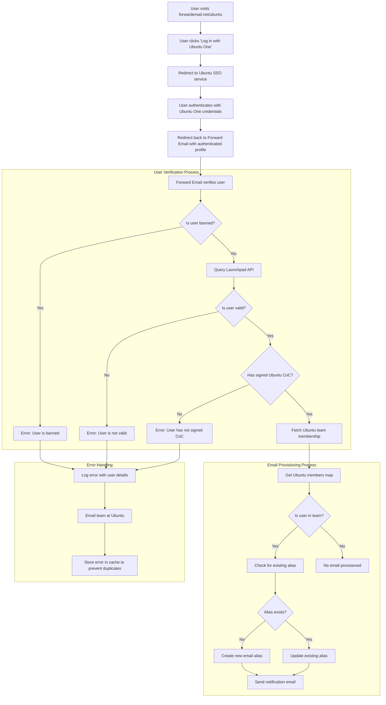

# Case Study: Hvordan Canonical driver Ubuntu e-posthåndtering med Forward Emails åpen kildekode bedriftsløsning {#case-study-how-canonical-powers-ubuntu-email-management-with-forward-emails-open-source-enterprise-solution}


## Innholdsfortegnelse {#table-of-contents}

* [Forord](#foreword)
* [Utfordringen: Å håndtere et komplekst e-postøkosystem](#the-challenge-managing-a-complex-email-ecosystem)
* [Viktige punkter](#key-takeaways)
* [Hvorfor Forward Email](#why-forward-email)
* [Implementeringen: Sømløs SSO-integrasjon](#the-implementation-seamless-sso-integration)
  * [Visualisering av autentiseringsflyt](#authentication-flow-visualization)
  * [Tekniske implementeringsdetaljer](#technical-implementation-details)
* [DNS-konfigurasjon og e-postruting](#dns-configuration-and-email-routing)
* [Resultater: Effektivisert e-posthåndtering og forbedret sikkerhet](#results-streamlined-email-management-and-enhanced-security)
  * [Operasjonell effektivitet](#operational-efficiency)
  * [Forbedret sikkerhet og personvern](#enhanced-security-and-privacy)
  * [Kostnadsbesparelser](#cost-savings)
  * [Forbedret bidragsyteropplevelse](#improved-contributor-experience)
* [Fremtiden: Fortsatt samarbeid](#looking-forward-continued-collaboration)
* [Konklusjon: Et perfekt åpen kildekode-partnerskap](#conclusion-a-perfect-open-source-partnership)
* [Støtte til bedriftskunder](#supporting-enterprise-clients)
  * [Ta kontakt](#get-in-touch)
  * [Om Forward Email](#about-forward-email)


## Forord {#foreword}

I verden av åpen kildekode-programvare er det få navn som bærer like mye tyngde som [Canonical](https://en.wikipedia.org/wiki/Canonical_\(company\)), selskapet bak [Ubuntu](https://en.wikipedia.org/wiki/Ubuntu), en av de mest populære Linux-distribusjonene globalt. Med et omfattende økosystem som spenner over flere distribusjoner inkludert Ubuntu, [Kubuntu](https://en.wikipedia.org/wiki/Kubuntu), [Lubuntu](https://en.wikipedia.org/wiki/Lubuntu), [Edubuntu](https://en.wikipedia.org/wiki/Edubuntu) og andre, sto Canonical overfor unike utfordringer med å administrere e-postadresser på tvers av deres mange domener. Denne casestudien utforsker hvordan Canonical samarbeidet med Forward Email for å skape en sømløs, sikker og personvernfokusert bedriftsløsning for e-posthåndtering som passer perfekt med deres verdier innen åpen kildekode.


## Utfordringen: Å håndtere et komplekst e-postøkosystem {#the-challenge-managing-a-complex-email-ecosystem}

Canonicals økosystem er mangfoldig og omfattende. Med millioner av brukere verden over og tusenvis av bidragsytere på tvers av ulike prosjekter, medførte håndtering av e-postadresser på tvers av flere domener betydelige utfordringer. Kjernebidragsytere trengte offisielle e-postadresser (@ubuntu.com, @kubuntu.org, osv.) som reflekterte deres engasjement i prosjektet, samtidig som sikkerhet og brukervennlighet ble ivaretatt gjennom et robust Ubuntu-domeneadministrasjonssystem.

Før implementeringen av Forward Email slet Canonical med:

* Håndtering av e-postadresser på tvers av flere domener (@ubuntu.com, @kubuntu.org, @lubuntu.me, @edubuntu.org og @ubuntu.net)
* Å tilby en konsistent e-postopplevelse for kjernebidragsytere
* Integrering av e-posttjenester med deres eksisterende [Ubuntu One](https://en.wikipedia.org/wiki/Ubuntu_One) Single Sign-On (SSO)-system
* Å finne en løsning som samsvarte med deres forpliktelse til personvern, sikkerhet og åpen kildekode e-postsikkerhet
* Å skalere deres sikre e-postinfrastruktur på en kostnadseffektiv måte


## Viktige punkter {#key-takeaways}

* Canonical implementerte med suksess en samlet løsning for e-posthåndtering på tvers av flere Ubuntu-domener
* Forward Emails 100 % åpen kildekode-tilnærming passet perfekt med Canonicals verdier
* SSO-integrasjon med Ubuntu One gir sømløs autentisering for bidragsytere
* Kvante-resistent kryptering sikrer langsiktig sikkerhet for all e-postkommunikasjon
* Løsningen skalerer kostnadseffektivt for å støtte Canonicals voksende bidragsyterbase


## Hvorfor Forward Email {#why-forward-email}
Som den eneste 100 % åpen kildekode e-posttjenesteleverandøren med fokus på personvern og sikkerhet, var Forward Email et naturlig valg for Canonicals behov for bedrifts-e-postvideresending. Våre verdier samsvarte perfekt med Canonicals forpliktelse til åpen kildekode-programvare og personvern.

Nøkkelfaktorer som gjorde Forward Email til det ideelle valget inkluderte:

1. **Fullstendig åpen kildekode-kodebase**: Hele plattformen vår er åpen kildekode og tilgjengelig på [GitHub](https://en.wikipedia.org/wiki/GitHub), noe som gir åpenhet og mulighet for bidrag fra fellesskapet. I motsetning til mange "personvernfokuserte" e-postleverandører som kun gjør frontend åpen kildekode mens backend holdes lukket, har vi gjort hele kodebasen vår—både frontend og backend—tilgjengelig for alle å inspisere på [GitHub](https://github.com/forwardemail/forwardemail.net).

2. **Personvernfokusert tilnærming**: I motsetning til andre leverandører lagrer vi ikke e-poster i delte databaser, og vi bruker robust kryptering med TLS. Vår grunnleggende personvernfilosofi er enkel: **dine e-poster tilhører deg og bare deg**. Dette prinsippet styrer alle tekniske beslutninger vi tar, fra hvordan vi håndterer e-postvideresending til hvordan vi implementerer kryptering.

3. **Ingen avhengighet av tredjepart**: Vi bruker ikke Amazon SES eller andre tredjepartstjenester, noe som gir oss full kontroll over e-postinfrastrukturen og eliminerer potensielle personvernlekkasjer gjennom tredjepartstjenester.

4. **Kostnadseffektiv skalering**: Vår prismodell lar organisasjoner skalere uten å betale per bruker, noe som gjør det ideelt for Canonicals store bidragsyterbase.

5. **Kvantemotstandsdyktig kryptering**: Vi bruker individuelt krypterte SQLite-postbokser med [ChaCha20-Poly1305](https://en.wikipedia.org/wiki/ChaCha20-Poly1305) som chiffer for [kvantemotstandsdyktig kryptering](/blog/docs/best-quantum-safe-encrypted-email-service). Hver postboks er en separat kryptert fil, noe som betyr at tilgang til én brukers data ikke gir tilgang til andres.


## Implementeringen: Sømløs SSO-integrasjon {#the-implementation-seamless-sso-integration}

En av de mest kritiske aspektene ved implementeringen var integrasjonen med Canonicals eksisterende Ubuntu One SSO-system. Denne integrasjonen ville tillate kjernebidragsytere å administrere sine @ubuntu.com e-postadresser ved å bruke sine eksisterende Ubuntu One-legitimasjoner.

### Visualisering av autentiseringsflyt {#authentication-flow-visualization}

Følgende diagram illustrerer hele autentiserings- og e-postprovisjoneringsflyten:


```mermaid
flowchart TD
    A[User visits forwardemail.net/ubuntu] --> B[User clicks 'Log in with Ubuntu One']
    B --> C[Redirect to Ubuntu SSO service]
    C --> D[User authenticates with Ubuntu One credentials]
    D --> E[Redirect back to Forward Email with authenticated profile]
    E --> F[Forward Email verifies user]

    subgraph "User Verification Process"
        F --> G{Is user banned?}
        G -->|Yes| H[Error: User is banned]
        G -->|No| I[Query Launchpad API]
        I --> J{Is user valid?}
        J -->|No| K[Error: User is not valid]
        J -->|Yes| L{Has signed Ubuntu CoC?}
        L -->|No| M[Error: User has not signed CoC]
        L -->|Yes| N[Fetch Ubuntu team membership]
    end

    subgraph "Email Provisioning Process"
        N --> O[Get Ubuntu members map]
        O --> P{Is user in team?}
        P -->|Yes| Q[Check for existing alias]
        Q --> R{Alias exists?}
        R -->|No| S[Create new email alias]
        R -->|Yes| T[Update existing alias]
        S --> U[Send notification email]
        T --> U
        P -->|No| V[No email provisioned]
    end

    subgraph "Error Handling"
        H --> W[Log error with user details]
        K --> W
        M --> W
        W --> X[Email team at Ubuntu]
        X --> Y[Store error in cache to prevent duplicates]
    end
```

### Tekniske implementasjonsdetaljer {#technical-implementation-details}

Integrasjonen mellom Forward Email og Ubuntu One SSO ble gjennomført gjennom en tilpasset implementering av autentiseringsstrategien passport-ubuntu. Dette muliggjorde en sømløs autentiseringsflyt mellom Ubuntu One og Forward Emails systemer.
#### Autentiseringsflyt {#the-authentication-flow}

Autentiseringsprosessen fungerer som følger:

1. Brukere besøker den dedikerte Ubuntu e-postadministrasjonssiden på [forwardemail.net/ubuntu](https://forwardemail.net/ubuntu)
2. De klikker på "Logg inn med Ubuntu One" og blir omdirigert til Ubuntu SSO-tjenesten
3. Etter å ha autentisert seg med sine Ubuntu One-legitimasjoner, blir de omdirigert tilbake til Forward Email med sin autentiserte profil
4. Forward Email verifiserer deres bidragsyterstatus og oppretter eller administrerer e-postadressen deres deretter

Den tekniske implementeringen benyttet [`passport-ubuntu`](https://www.npmjs.com/package/passport-ubuntu)-pakken, som er en [Passport](https://www.npmjs.com/package/passport)-strategi for autentisering med Ubuntu ved bruk av [OpenID](https://en.wikipedia.org/wiki/OpenID). Konfigurasjonen inkluderte:

```javascript
passport.use(new UbuntuStrategy({
  returnURL: process.env.UBUNTU_CALLBACK_URL,
  realm: process.env.UBUNTU_REALM,
  stateless: true
}, function(identifier, profile, done) {
  // Brukerverifisering og e-postprovisjonering logikk
}));
```

#### Launchpad API-integrasjon og validering {#launchpad-api-integration-and-validation}

En kritisk komponent i vår implementering er integrasjonen med [Launchpad](https://en.wikipedia.org/wiki/Launchpad_\(website\)) sin API for å validere Ubuntu-brukere og deres teammedlemskap. Vi laget gjenbrukbare hjelpefunksjoner for å håndtere denne integrasjonen effektivt og pålitelig.

Hjelpefunksjonen `sync-ubuntu-user.js` er ansvarlig for å validere brukere gjennom Launchpad API og administrere deres e-postadresser. Her er en forenklet versjon av hvordan den fungerer:

```javascript
async function syncUbuntuUser(user, map) {
  try {
    // Valider brukerobjekt
    if (!_.isObject(user) ||
        !isSANB(user[fields.ubuntuUsername]) ||
        !isSANB(user[fields.ubuntuProfileID]) ||
        !isEmail(user.email))
      throw new TypeError('Ugyldig brukerobjekt');

    // Hent Ubuntu-medlemskart hvis ikke oppgitt
    if (!(map instanceof Map))
      map = await getUbuntuMembersMap(resolver);

    // Sjekk om bruker er utestengt
    if (user[config.userFields.isBanned]) {
      throw new InvalidUbuntuUserError('Bruker ble utestengt', { ignoreHook: true });
    }

    // Spørr Launchpad API for å validere bruker
    const url = `https://api.launchpad.net/1.0/~${user[fields.ubuntuUsername]}`;
    const response = await retryRequest(url, { resolver });
    const json = await response.body.json();

    // Valider nødvendige boolske egenskaper
    if (!json.is_valid)
      throw new InvalidUbuntuUserError('Egenskapen "is_valid" var falsk');

    if (!json.is_ubuntu_coc_signer)
      throw new InvalidUbuntuUserError('Egenskapen "is_ubuntu_coc_signer" var falsk');

    // Behandle hvert domene for brukeren
    await pMap([...map.keys()], async (name) => {
      // Finn domene i databasen
      const domain = await Domains.findOne({
        name,
        plan: 'team',
        has_txt_record: true
      }).populate('members.user');

      // Behandle brukerens e-postalias for dette domenet
      if (map.get(name).has(user[fields.ubuntuUsername])) {
        // Bruker er medlem av dette teamet, opprett eller oppdater alias
        let alias = await Aliases.findOne({
          user: user._id,
          domain: domain._id,
          name: user[fields.ubuntuUsername].toLowerCase()
        });

        if (!alias) {
          // Opprett nytt alias med passende feilhåndtering
          alias = await Aliases.create({
            user: user._id,
            domain: domain._id,
            name: user[fields.ubuntuUsername].toLowerCase(),
            recipients: [user.email],
            locale: user[config.lastLocaleField],
            is_enabled: true
          });

          // Varsle administratorer om ny aliasopprettelse
          await emailHelper({
            template: 'alert',
            message: {
              to: adminEmailsForDomain,
              subject: `Ny @${domain.name} e-postadresse opprettet`
            },
            locals: {
              message: `En ny e-postadresse ${user[fields.ubuntuUsername].toLowerCase()}@${domain.name} ble opprettet for ${user.email}`
            }
          });
        }
      }
    });

    return true;
  } catch (err) {
    // Håndter og loggfør feil
    await logErrorWithUser(err, user);
    throw err;
  }
}
```
For å forenkle administrasjonen av teammedlemskap på tvers av ulike Ubuntu-domener, har vi laget en enkel kobling mellom domenenavn og deres tilsvarende Launchpad-team:

```javascript
ubuntuTeamMapping: {
  'ubuntu.com': '~ubuntumembers',
  'kubuntu.org': '~kubuntu-members',
  'lubuntu.me': '~lubuntu-members',
  'edubuntu.org': '~edubuntu-members',
  'ubuntustudio.com': '~ubuntustudio-core',
  'ubuntu.net': '~ubuntu-smtp-test'
},
```

Denne enkle koblingen lar oss automatisere prosessen med å sjekke teammedlemskap og opprette e-postadresser, noe som gjør systemet enkelt å vedlikeholde og utvide når nye domener legges til.

#### Feilhåndtering og varslinger {#error-handling-and-notifications}

Vi implementerte et robust feilhåndteringssystem som:

1. Logger alle feil med detaljert brukerinformasjon
2. Sender e-post til Ubuntu-teamet når problemer oppdages
3. Varsler administratorer når nye bidragsytere registrerer seg og får opprettet e-postadresser
4. Håndterer spesialtilfeller som brukere som ikke har signert Ubuntu Code of Conduct

Dette sikrer at eventuelle problemer raskt blir identifisert og løst, og opprettholder integriteten til e-postsystemet.


## DNS-konfigurasjon og e-postruting {#dns-configuration-and-email-routing}

For hvert domene som administreres gjennom Forward Email, la Canonical til en enkel DNS TXT-post for validering:

```sh
❯ dig ubuntu.com txt
ubuntu.com.             600     IN      TXT     "forward-email-site-verification=6IsURgl2t7"
```

Denne verifiseringsposten bekrefter domenets eierskap og gjør det mulig for systemet vårt å sikkert administrere e-post for disse domenene. Canonical ruter e-post gjennom vår tjeneste via Postfix, som gir en pålitelig og sikker e-postleveringsinfrastruktur.


## Resultater: Strømlinjeformet e-postadministrasjon og forbedret sikkerhet {#results-streamlined-email-management-and-enhanced-security}

Implementeringen av Forward Emails bedriftsløsning har gitt betydelige fordeler for Canonicals e-postadministrasjon på tvers av alle deres domener:

### Operasjonell effektivitet {#operational-efficiency}

* **Sentralisert administrasjon**: Alle Ubuntu-relaterte domener administreres nå gjennom ett enkelt grensesnitt
* **Redusert administrativt arbeid**: Automatisert oppretting og selvbetjent administrasjon for bidragsytere
* **Forenklet onboarding**: Nye bidragsytere kan raskt få sine offisielle e-postadresser

### Forbedret sikkerhet og personvern {#enhanced-security-and-privacy}

* **Ende-til-ende-kryptering**: Alle e-poster krypteres med avanserte standarder
* **Ingen delte databaser**: Hver brukers e-poster lagres i individuelle krypterte SQLite-databaser, som gir en isolert krypteringstilnærming som er fundamentalt sikrere enn tradisjonelle delte relasjonsdatabaser
* **Åpen kildekode-sikkerhet**: Den transparente kodebasen tillater sikkerhetsgjennomganger fra fellesskapet
* **Minnebasert behandling**: Vi lagrer ikke videresendte e-poster på disk, noe som øker personvernet
* **Ingen metadata lagres**: Vi fører ikke oversikt over hvem som sender e-post til hvem, i motsetning til mange e-postleverandører

### Kostnadsbesparelser {#cost-savings}

* **Skalerbar prismodell**: Ingen brukeravgifter, som gjør at Canonical kan legge til bidragsytere uten økte kostnader
* **Redusert behov for infrastruktur**: Ingen behov for å vedlikeholde separate e-postservere for ulike domener
* **Lavere støttebehov**: Selvbetjent administrasjon reduserer IT-supporthenvendelser

### Forbedret bidragsyteropplevelse {#improved-contributor-experience}

* **Sømløs autentisering**: Enkel pålogging med eksisterende Ubuntu One-legitimasjon
* **Konsistent merkevarebygging**: Enhetlig opplevelse på tvers av alle Ubuntu-relaterte tjenester
* **Pålitelig e-postlevering**: Høy kvalitet på IP-omdømme sikrer at e-poster når mottaker

Integrasjonen med Forward Email har betydelig strømlinjeformet Canonicals e-postadministrasjonsprosess. Bidragsytere har nå en sømløs opplevelse med å administrere sine @ubuntu.com e-postadresser, med redusert administrativt arbeid og forbedret sikkerhet.


## Fremover: Fortsatt samarbeid {#looking-forward-continued-collaboration}

Partnerskapet mellom Canonical og Forward Email fortsetter å utvikle seg. Vi jobber sammen på flere initiativer:
* Utvide e-posttjenester til flere Ubuntu-relaterte domener
* Forbedre brukergrensesnittet basert på tilbakemeldinger fra bidragsytere
* Implementere flere sikkerhetsfunksjoner
* Utforske nye måter å utnytte vårt åpen kildekode-samarbeid på


## Konklusjon: Et perfekt åpen kildekode-partnerskap {#conclusion-a-perfect-open-source-partnership}

Samarbeidet mellom Canonical og Forward Email demonstrerer kraften i partnerskap bygget på delte verdier. Ved å velge Forward Email som sin e-postleverandør fant Canonical en løsning som ikke bare oppfylte deres tekniske krav, men som også passet perfekt med deres forpliktelse til åpen kildekode-programvare, personvern og sikkerhet.

For organisasjoner som administrerer flere domener og krever sømløs autentisering med eksisterende systemer, tilbyr Forward Email en fleksibel, sikker og personvernfokusert løsning. Vår [åpen kildekode-tilnærming](https://forwardemail.net/blog/docs/why-open-source-email-security-privacy) sikrer åpenhet og tillater bidrag fra fellesskapet, noe som gjør det til et ideelt valg for organisasjoner som verdsetter disse prinsippene.

Etter hvert som både Canonical og Forward Email fortsetter å innovere innen sine respektive felt, står dette partnerskapet som et bevis på kraften i åpen kildekode-samarbeid og delte verdier i å skape effektive løsninger.

Du kan sjekke vår [realtids tjenestestatus](https://status.forwardemail.net) for å se vår nåværende e-postleveringsytelse, som vi kontinuerlig overvåker for å sikre høy kvalitet på IP-omdømme og e-postleverbarhet.


## Støtte til bedriftskunder {#supporting-enterprise-clients}

Selv om denne casestudien fokuserer på vårt partnerskap med Canonical, støtter Forward Email stolt mange bedriftskunder på tvers av ulike bransjer som verdsetter vår forpliktelse til personvern, sikkerhet og prinsipper for åpen kildekode.

Våre bedriftsløsninger er skreddersydd for å møte de spesifikke behovene til organisasjoner i alle størrelser, og tilbyr:

* Tilpasset domene [e-postadministrasjon](/) på tvers av flere domener
* Sømløs integrasjon med eksisterende autentiseringssystemer
* Dedikert Matrix chat-støttekanal
* Forbedrede sikkerhetsfunksjoner inkludert [kvante-resistent kryptering](/blog/docs/best-quantum-safe-encrypted-email-service)
* Fullstendig dataportabilitet og eierskap
* 100 % åpen kildekode-infrastruktur for åpenhet og tillit

### Ta kontakt {#get-in-touch}

Hvis din organisasjon har bedriftsbehov for e-post eller du er interessert i å lære mer om hvordan Forward Email kan hjelpe med å effektivisere e-postadministrasjonen samtidig som personvern og sikkerhet styrkes, vil vi gjerne høre fra deg:

* Send oss e-post direkte på `support@forwardemail.net`
* Send inn en hjelpesøknad på vår [hjelpeside](https://forwardemail.net/help)
* Sjekk vår [prisside](https://forwardemail.net/pricing) for bedriftsplaner

Vårt team er klare til å diskutere dine spesifikke krav og utvikle en tilpasset løsning som samsvarer med din organisasjons verdier og tekniske behov.

### Om Forward Email {#about-forward-email}

Forward Email er en 100 % åpen kildekode- og personvernfokusert e-posttjeneste. Vi tilbyr e-postvideresending for tilpassede domener, SMTP, IMAP og POP3-tjenester med fokus på sikkerhet, personvern og åpenhet. Hele vår kodebase er tilgjengelig på [GitHub](https://github.com/forwardemail/forwardemail.net), og vi er forpliktet til å tilby e-posttjenester som respekterer brukernes personvern og sikkerhet. Lær mer om [hvorfor åpen kildekode-e-post er fremtiden](https://forwardemail.net/blog/docs/why-open-source-email-security-privacy), [hvordan vår e-postvideresending fungerer](https://forwardemail.net/blog/docs/best-email-forwarding-service), og [vår tilnærming til beskyttelse av e-postpersonvern](https://forwardemail.net/blog/docs/email-privacy-protection-technical-implementation).
