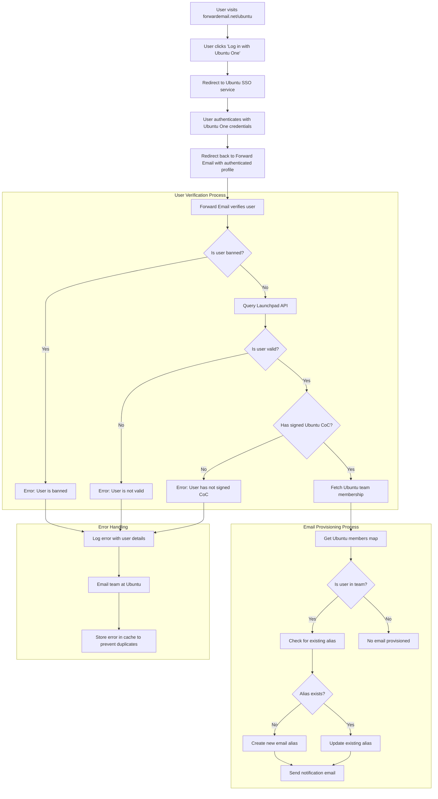

# Studium przypadku: Jak Canonical usprawnia zarządzanie pocztą e-mail w systemie Ubuntu dzięki rozwiązaniu open source firmy Forward Email dla przedsiębiorstw {#case-study-how-canonical-powers-ubuntu-email-management-with-forward-emails-open-source-enterprise-solution}


## Spis treści {#table-of-contents}

* [Przedmowa](#foreword)
* [Wyzwanie: zarządzanie złożonym ekosystemem poczty e-mail](#the-challenge-managing-a-complex-email-ecosystem)
* [Najważniejsze wnioski](#key-takeaways)
* [Dlaczego warto przekazywać dalej e-maile?](#why-forward-email)
* [Wdrożenie: bezproblemowa integracja SSO](#the-implementation-seamless-sso-integration)
  * [Wizualizacja przepływu uwierzytelniania](#authentication-flow-visualization)
  * [Szczegóły wdrożenia technicznego](#technical-implementation-details)
* [Konfiguracja DNS i routing poczty e-mail](#dns-configuration-and-email-routing)
* [Wyniki: Usprawnione zarządzanie pocztą e-mail i zwiększone bezpieczeństwo](#results-streamlined-email-management-and-enhanced-security)
  * [Efektywność operacyjna](#operational-efficiency)
  * [Zwiększone bezpieczeństwo i prywatność](#enhanced-security-and-privacy)
  * [Oszczędności kosztów](#cost-savings)
  * [Ulepszone doświadczenie współtwórcy](#improved-contributor-experience)
* [Patrząc w przyszłość: Dalsza współpraca](#looking-forward-continued-collaboration)
* [Wnioski: Idealne partnerstwo typu open source](#conclusion-a-perfect-open-source-partnership)
* [Wsparcie klientów korporacyjnych](#supporting-enterprise-clients)
  * [Skontaktuj się z nami](#get-in-touch)
  * [O funkcji przekazywania wiadomości e-mail](#about-forward-email)

## Przedmowa {#foreword}

W świecie oprogramowania open source niewiele nazw ma tak duże znaczenie jak [Kanoniczny](https://en.wikipedia.org/wiki/Canonical_\(company\)), firma stojąca za [Ubuntu](https://en.wikipedia.org/wiki/Ubuntu), jedną z najpopularniejszych dystrybucji Linuksa na świecie. Z rozległym ekosystemem obejmującym wiele dystrybucji, w tym Ubuntu, [Bezpłatny](https://en.wikipedia.org/wiki/Kubuntu), [Lubuntu](https://en.wikipedia.org/wiki/Lubuntu), [Edubuntu](https://en.wikipedia.org/wiki/Edubuntu) i inne, Canonical stanął przed wyjątkowymi wyzwaniami w zakresie zarządzania adresami e-mail w swoich licznych domenach. Niniejsze studium przypadku opisuje, jak Canonical nawiązał współpracę z Forward Email, aby stworzyć płynne, bezpieczne i zorientowane na prywatność rozwiązanie do zarządzania pocztą elektroniczną w przedsiębiorstwie, idealnie wpisując się w ich wartości open source.

## Wyzwanie: zarządzanie złożonym ekosystemem poczty e-mail {#the-challenge-managing-a-complex-email-ecosystem}

Ekosystem Canonical jest zróżnicowany i rozległy. Z milionami użytkowników na całym świecie i tysiącami współpracowników zaangażowanych w różne projekty, zarządzanie adresami e-mail w wielu domenach stanowiło poważne wyzwanie. Główni współpracownicy potrzebowali oficjalnych adresów e-mail (@ubuntu.com, @kubuntu.org itp.), które odzwierciedlałyby ich zaangażowanie w projekt, a jednocześnie zapewniały bezpieczeństwo i łatwość obsługi dzięki solidnemu systemowi zarządzania domenami Ubuntu.

Przed wdrożeniem funkcji Forward Email firma Canonical zmagała się z następującymi problemami:

* Zarządzanie adresami e-mail w wielu domenach (@ubuntu.com, @kubuntu.org, @lubuntu.me, @edubuntu.org i @ubuntu.net)
* Zapewnienie spójnego środowiska poczty e-mail dla głównych współpracowników
* Integracja usług poczty e-mail z istniejącym systemem jednokrotnego logowania (SSO) [Ubuntu One](https://en.wikipedia.org/wiki/Ubuntu_One)
* Znalezienie rozwiązania zgodnego z zaangażowaniem firmy w ochronę prywatności, bezpieczeństwo i ochronę poczty e-mail w oparciu o oprogramowanie open source
* Efektywne kosztowo skalowanie bezpiecznej infrastruktury poczty e-mail

## Najważniejsze wnioski {#key-takeaways}

* Canonical z powodzeniem wdrożył ujednolicone rozwiązanie do zarządzania pocztą e-mail w wielu domenach Ubuntu.
* W 100% otwarte podejście Forward Email idealnie wpisywało się w wartości Canonical.
* Integracja SSO z Ubuntu One zapewnia bezproblemowe uwierzytelnianie dla współpracowników.
* Szyfrowanie odporne na ataki kwantowe zapewnia długoterminowe bezpieczeństwo całej komunikacji e-mail.
* Rozwiązanie jest skalowalne w sposób ekonomiczny, aby wspierać rosnącą bazę współpracowników Canonical.

## Dlaczego warto przekazywać dalej e-maile {#why-forward-email}

Jako jedyny w 100% dostawca usług poczty elektronicznej opartych na otwartym kodzie źródłowym, koncentrujący się na prywatności i bezpieczeństwie, Forward Email idealnie wpasował się w potrzeby Canonical w zakresie przekazywania poczty elektronicznej dla przedsiębiorstw. Nasze wartości idealnie wpisywały się w zaangażowanie Canonical w rozwój oprogramowania open source i ochronę prywatności.

Do kluczowych czynników, które sprawiły, że Forward Email okazał się idealnym wyborem, należały:

1. **Kompletna baza kodu open source**: Cała nasza platforma jest dostępna na licencji open source na platformie [GitHub](https://en.wikipedia.org/wiki/GitHub), co zapewnia transparentność i możliwość udziału społeczności. W przeciwieństwie do wielu dostawców poczty e-mail, którzy „nastawieni na prywatność” udostępniają jedynie kod źródłowy swoich front-endów, a back-endy pozostają zamknięte, udostępniliśmy całą naszą bazę kodu – zarówno front-end, jak i back-end – do wglądu dla każdego na platformie [GitHub](https://github.com/forwardemail/forwardemail.net).

2. **Podejście skoncentrowane na prywatności**: W przeciwieństwie do innych dostawców, nie przechowujemy wiadomości e-mail we współdzielonych bazach danych i stosujemy solidne szyfrowanie TLS. Nasza fundamentalna filozofia prywatności jest prosta: **Twoje wiadomości e-mail należą do Ciebie i tylko do Ciebie**. Ta zasada kieruje każdą naszą decyzją techniczną, od sposobu, w jaki obsługujemy przekazywanie wiadomości e-mail, po sposób wdrażania szyfrowania.

3. **Brak korzystania z usług stron trzecich**: Nie korzystamy z Amazon SES ani innych usług stron trzecich, co daje nam pełną kontrolę nad infrastrukturą poczty e-mail i eliminuje potencjalne wycieki danych osobowych za pośrednictwem usług stron trzecich.

4. **Ekonomiczne skalowanie**: Nasz model cenowy pozwala organizacjom na skalowanie bez konieczności płacenia za każdego użytkownika, dzięki czemu idealnie nadaje się dla dużej bazy współpracowników Canonical.

5. **Szyfrowanie odporne na ataki kwantowe**: Używamy indywidualnie szyfrowanych skrzynek pocztowych SQLite z szyfrem [ChaCha20-Poly1305](https://en.wikipedia.org/wiki/ChaCha20-Poly1305) dla [szyfrowanie odporne na kwantowe](/blog/docs/best-quantum-safe-encrypted-email-service). Każda skrzynka pocztowa jest osobnym zaszyfrowanym plikiem, co oznacza, że dostęp do danych jednego użytkownika nie daje dostępu innym.

## Implementacja: bezproblemowa integracja SSO {#the-implementation-seamless-sso-integration}

Jednym z najważniejszych aspektów wdrożenia była integracja z istniejącym systemem jednokrotnego logowania (SSO) Ubuntu One firmy Canonical. Ta integracja umożliwiłaby głównym współpracownikom zarządzanie adresami e-mail @ubuntu.com przy użyciu istniejących danych logowania Ubuntu One.

### Wizualizacja przepływu uwierzytelniania {#authentication-flow-visualization}

Poniższy diagram ilustruje kompletny proces uwierzytelniania i obsługi poczty e-mail:



### Szczegóły implementacji technicznej {#technical-implementation-details}

Integracja między Forward Email a systemem jednokrotnego logowania Ubuntu One została osiągnięta poprzez niestandardową implementację strategii uwierzytelniania Passport-Ubuntu. Umożliwiło to płynny przepływ uwierzytelniania między systemami Ubuntu One i Forward Email.

#### Przepływ uwierzytelniania {#the-authentication-flow}

Proces uwierzytelniania przebiega następująco:

1. Użytkownicy odwiedzają dedykowaną stronę zarządzania pocztą e-mail Ubuntu pod adresem [forwardemail.net/ubuntu](https://forwardemail.net/ubuntu)
2. Klikają „Zaloguj się za pomocą Ubuntu One” i zostają przekierowani do usługi jednokrotnego logowania Ubuntu.
3. Po uwierzytelnieniu za pomocą danych logowania Ubuntu One, użytkownicy są przekierowywani z powrotem do usługi Forward Email ze swoim uwierzytelnionym profilem.
4. Usługa Forward Email weryfikuje status współautora i odpowiednio udostępnia lub zarządza adresem e-mail.

Implementacja techniczna wykorzystała pakiet [`passport-ubuntu`](https://www.npmjs.com/package/passport-ubuntu), który jest strategią [Paszport](https://www.npmjs.com/package/passport) do uwierzytelniania w Ubuntu przy użyciu [OpenID](https://en.wikipedia.org/wiki/OpenID). Konfiguracja obejmowała:

```javascript
passport.use(new UbuntuStrategy({
  returnURL: process.env.UBUNTU_CALLBACK_URL,
  realm: process.env.UBUNTU_REALM,
  stateless: true
}, function(identifier, profile, done) {
  // User verification and email provisioning logic
}));
```

#### Integracja i walidacja interfejsu API Launchpad {#launchpad-api-integration-and-validation}

Kluczowym elementem naszej implementacji jest integracja z API [Platforma startowa](https://en.wikipedia.org/wiki/Launchpad_\(website\), umożliwiająca weryfikację użytkowników Ubuntu i ich przynależności do zespołów. Stworzyliśmy wielokrotnego użytku funkcje pomocnicze, aby sprawnie i niezawodnie obsługiwać tę integrację.

Funkcja pomocnicza `sync-ubuntu-user.js` odpowiada za weryfikację użytkowników za pomocą API Launchpad i zarządzanie ich adresami e-mail. Oto uproszczony opis działania:

```javascript
async function syncUbuntuUser(user, map) {
  try {
    // Validate user object
    if (!_.isObject(user) ||
        !isSANB(user[fields.ubuntuUsername]) ||
        !isSANB(user[fields.ubuntuProfileID]) ||
        !isEmail(user.email))
      throw new TypeError('Invalid user object');

    // Get Ubuntu members map if not provided
    if (!(map instanceof Map))
      map = await getUbuntuMembersMap(resolver);

    // Check if user is banned
    if (user[config.userFields.isBanned]) {
      throw new InvalidUbuntuUserError('User was banned', { ignoreHook: true });
    }

    // Query Launchpad API to validate user
    const url = `https://api.launchpad.net/1.0/~${user[fields.ubuntuUsername]}`;
    const response = await retryRequest(url, { resolver });
    const json = await response.body.json();

    // Validate required boolean properties
    if (!json.is_valid)
      throw new InvalidUbuntuUserError('Property "is_valid" was false');

    if (!json.is_ubuntu_coc_signer)
      throw new InvalidUbuntuUserError('Property "is_ubuntu_coc_signer" was false');

    // Process each domain for the user
    await pMap([...map.keys()], async (name) => {
      // Find domain in database
      const domain = await Domains.findOne({
        name,
        plan: 'team',
        has_txt_record: true
      }).populate('members.user');

      // Process user's email alias for this domain
      if (map.get(name).has(user[fields.ubuntuUsername])) {
        // User is a member of this team, create or update alias
        let alias = await Aliases.findOne({
          user: user._id,
          domain: domain._id,
          name: user[fields.ubuntuUsername].toLowerCase()
        });

        if (!alias) {
          // Create new alias with appropriate error handling
          alias = await Aliases.create({
            user: user._id,
            domain: domain._id,
            name: user[fields.ubuntuUsername].toLowerCase(),
            recipients: [user.email],
            locale: user[config.lastLocaleField],
            is_enabled: true
          });

          // Notify admins about new alias creation
          await emailHelper({
            template: 'alert',
            message: {
              to: adminEmailsForDomain,
              subject: `New @${domain.name} email address created`
            },
            locals: {
              message: `A new email address ${user[fields.ubuntuUsername].toLowerCase()}@${domain.name} was created for ${user.email}`
            }
          });
        }
      }
    });

    return true;
  } catch (err) {
    // Handle and log errors
    await logErrorWithUser(err, user);
    throw err;
  }
}
```

Aby uprościć zarządzanie członkostwem w zespole w różnych domenach Ubuntu, stworzyliśmy proste mapowanie między nazwami domen i odpowiadającymi im zespołami Launchpad:

```javascript
ubuntuTeamMapping: {
  'ubuntu.com': '~ubuntumembers',
  'kubuntu.org': '~kubuntu-members',
  'lubuntu.me': '~lubuntu-members',
  'edubuntu.org': '~edubuntu-members',
  'ubuntustudio.com': '~ubuntustudio-core',
  'ubuntu.net': '~ubuntu-smtp-test'
},
```

To proste mapowanie pozwala nam zautomatyzować proces sprawdzania członkostwa w zespole i przydzielania adresów e-mail, dzięki czemu system jest łatwy w utrzymaniu i rozbudowie w miarę dodawania nowych domen.

#### Obsługa błędów i powiadomienia {#error-handling-and-notifications}

Wdrożyliśmy solidny system obsługi błędów, który:

1. Rejestruje wszystkie błędy wraz ze szczegółowymi informacjami o użytkowniku.
2. Wysyła e-maile do zespołu Ubuntu w przypadku wykrycia problemów.
3. Powiadamia administratorów o rejestracji nowych współautorów i utworzeniu adresów e-mail.
4. Obsługuje przypadki skrajne, takie jak użytkownicy, którzy nie podpisali Kodeksu Postępowania Ubuntu.

Dzięki temu wszelkie problemy można szybko zidentyfikować i rozwiązać, zachowując integralność systemu poczty elektronicznej.

## Konfiguracja DNS i routing poczty e-mail {#dns-configuration-and-email-routing}

Dla każdej domeny zarządzanej za pośrednictwem Forward Email firma Canonical dodała prosty rekord DNS TXT w celu weryfikacji:

```sh
❯ dig ubuntu.com txt
ubuntu.com.             600     IN      TXT     "forward-email-site-verification=6IsURgl2t7"
```

Ten rekord weryfikacyjny potwierdza własność domeny i umożliwia naszemu systemowi bezpieczne zarządzanie pocztą e-mail dla tych domen. Canonical kieruje pocztę przez naszą usługę za pośrednictwem Postfix, który zapewnia niezawodną i bezpieczną infrastrukturę dostarczania poczty e-mail.

## Wyniki: Usprawnione zarządzanie pocztą e-mail i zwiększone bezpieczeństwo {#results-streamlined-email-management-and-enhanced-security}

Wdrożenie rozwiązania korporacyjnego Forward Email przyniosło firmie Canonical znaczące korzyści w zakresie zarządzania pocztą e-mail we wszystkich jej domenach:

### Wydajność operacyjna {#operational-efficiency}

* **Centralne zarządzanie**: Wszystkie domeny związane z Ubuntu są teraz zarządzane za pośrednictwem jednego interfejsu.
* **Mniejsze obciążenie administracyjne**: Automatyczne wdrażanie i samoobsługowe zarządzanie dla współpracowników.
* **Uproszczone wdrażanie**: Nowi współpracownicy mogą szybko uzyskać swoje oficjalne adresy e-mail.

### Zwiększone bezpieczeństwo i prywatność {#enhanced-security-and-privacy}

* **Szyfrowanie typu end-to-end**: Wszystkie wiadomości e-mail są szyfrowane przy użyciu zaawansowanych standardów.
* **Brak współdzielonych baz danych**: Wiadomości e-mail każdego użytkownika są przechowywane w indywidualnych, szyfrowanych bazach danych SQLite, co zapewnia szyfrowanie w trybie sandbox, które jest zasadniczo bezpieczniejsze niż tradycyjne, współdzielone, relacyjne bazy danych.
* **Bezpieczeństwo open source**: Transparentna baza kodu umożliwia weryfikację bezpieczeństwa przez społeczność.
* **Przetwarzanie w pamięci**: Nie przechowujemy przekazywanych wiadomości e-mail na dysku, co zwiększa ochronę prywatności.
* **Brak przechowywania metadanych**: W przeciwieństwie do wielu dostawców poczty e-mail, nie przechowujemy danych o tym, kto do kogo wysyła wiadomości.

### Oszczędności kosztów {#cost-savings}

* **Skalowalny model cenowy**: Brak opłat za użytkownika, co pozwala Canonical na dodawanie współpracowników bez zwiększania kosztów
* **Mniejsze zapotrzebowanie na infrastrukturę**: Brak konieczności utrzymywania oddzielnych serwerów poczty e-mail dla różnych domen
* **Niższe wymagania dotyczące wsparcia**: Samodzielne zarządzanie zmniejsza liczbę zgłoszeń do pomocy technicznej

### Ulepszone środowisko dla współpracowników {#improved-contributor-experience}

* **Bezproblemowe uwierzytelnianie**: Jednokrotne logowanie przy użyciu istniejących danych logowania Ubuntu One
* **Spójny branding**: Ujednolicone doświadczenie we wszystkich usługach powiązanych z Ubuntu
* **Niezawodne dostarczanie wiadomości e-mail**: Wysokiej jakości reputacja adresów IP gwarantuje, że wiadomości e-mail dotrą do adresata

Integracja z Forward Email znacząco usprawniła proces zarządzania pocztą elektroniczną w Canonical. Współpracownicy mogą teraz bezproblemowo zarządzać swoimi adresami e-mail w domenie @ubuntu.com, przy mniejszych nakładach administracyjnych i zwiększonym bezpieczeństwie.

## Patrząc w przyszłość: Dalsza współpraca {#looking-forward-continued-collaboration}

Partnerstwo między Canonical i Forward Email stale się rozwija. Współpracujemy nad kilkoma inicjatywami:

* Rozszerzenie usług poczty e-mail na dodatkowe domeny związane z Ubuntu
* Ulepszenie interfejsu użytkownika w oparciu o opinie współpracowników
* Wdrożenie dodatkowych funkcji bezpieczeństwa
* Eksploracja nowych sposobów wykorzystania naszej współpracy open source

## Wniosek: Idealne partnerstwo open-source {#conclusion-a-perfect-open-source-partnership}

Współpraca Canonical i Forward Email pokazuje siłę partnerstwa zbudowanego na wspólnych wartościach. Wybierając Forward Email jako dostawcę usług poczty elektronicznej, Canonical znalazł rozwiązanie, które nie tylko spełniło ich wymagania techniczne, ale także idealnie wpisywało się w ich zaangażowanie w rozwój oprogramowania open source, prywatności i bezpieczeństwa.

Dla organizacji zarządzających wieloma domenami i wymagających bezproblemowego uwierzytelniania w istniejących systemach, Forward Email oferuje elastyczne, bezpieczne i zorientowane na prywatność rozwiązanie. Nasz [podejście open-source](https://forwardemail.net/blog/docs/why-open-source-email-security-privacy) zapewnia transparentność i umożliwia wkład społeczności, co czyni go idealnym wyborem dla organizacji ceniących te zasady.

Ponieważ Canonical i Forward Email nieustannie wprowadzają innowacje w swoich dziedzinach, partnerstwo to jest dowodem na siłę współpracy w ramach oprogramowania typu open source oraz wspólnych wartości w tworzeniu efektywnych rozwiązań.

Możesz sprawdzić [status usługi w czasie rzeczywistym](https://status.forwardemail.net), aby zobaczyć aktualną wydajność dostarczania wiadomości e-mail, którą stale monitorujemy, aby zapewnić wysoką jakość reputacji adresów IP i dostarczalności wiadomości e-mail.

## Wsparcie klientów korporacyjnych {#supporting-enterprise-clients}

Choć studium przypadku koncentruje się na naszym partnerstwie z Canonical, Forward Email z dumą wspiera licznych klientów korporacyjnych z różnych branż, którzy cenią nasze zaangażowanie w ochronę prywatności, bezpieczeństwo i zasady otwartego oprogramowania.

Nasze rozwiązania dla przedsiębiorstw są dostosowane do konkretnych potrzeb organizacji każdej wielkości, oferując:

* Niestandardowa domena [zarządzanie pocztą e-mail](/) w wielu domenach
* Bezproblemowa integracja z istniejącymi systemami uwierzytelniania
* Dedykowany kanał wsparcia czatu Matrix
* Ulepszone funkcje bezpieczeństwa, w tym [szyfrowanie odporne na kwantowe](/blog/docs/best-quantum-safe-encrypted-email-service)
* Pełna przenośność i własność danych
* Infrastruktura w 100% open source dla przejrzystości i zaufania

### Skontaktuj się z nami {#get-in-touch}

Jeśli Twoja organizacja potrzebuje firmowej poczty e-mail lub chcesz dowiedzieć się więcej o tym, w jaki sposób Forward Email może pomóc usprawnić zarządzanie pocztą e-mail, zwiększając jednocześnie prywatność i bezpieczeństwo, chętnie poznamy Twoją opinię:

* Napisz do nas bezpośrednio na adres `support@forwardemail.net`
* Prześlij prośbę o pomoc na adres [strona pomocy](https://forwardemail.net/help)
* Sprawdź nasz [strona z cenami](https://forwardemail.net/pricing), aby zapoznać się z planami dla przedsiębiorstw

Nasz zespół jest gotowy omówić Twoje szczegółowe wymagania i opracować rozwiązanie dostosowane do wartości i potrzeb technicznych Twojej organizacji.

### Informacje o przekazywaniu wiadomości e-mail {#about-forward-email}

Forward Email to w 100% open source'owa usługa poczty e-mail, która koncentruje się na prywatności. Oferujemy niestandardowe przekierowanie poczty e-mail w domenie, usługi SMTP, IMAP i POP3, koncentrując się na bezpieczeństwie, prywatności i transparentności. Cały nasz kod jest dostępny na platformie [GitHub](https://github.com/forwardemail/forwardemail.net) i dokładamy wszelkich starań, aby świadczyć usługi poczty e-mail, które szanują prywatność i bezpieczeństwo użytkowników. Dowiedz się więcej o [Dlaczego poczta e-mail typu open source jest przyszłością](https://forwardemail.net/blog/docs/why-open-source-email-security-privacy), [jak działa nasze przekierowywanie poczty e-mail](https://forwardemail.net/blog/docs/best-email-forwarding-service) i [nasze podejście do ochrony prywatności poczty elektronicznej](https://forwardemail.net/blog/docs/email-privacy-protection-technical-implementation).