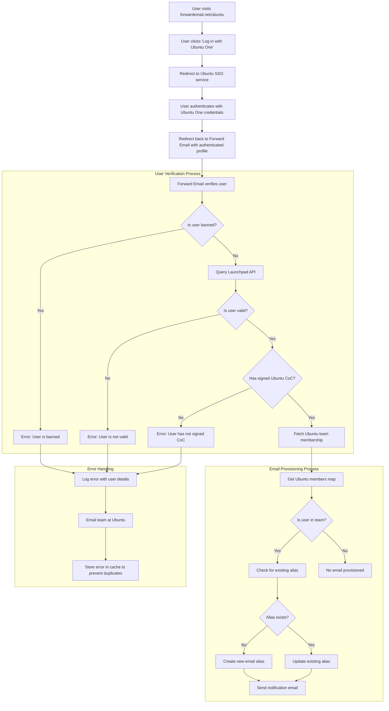

# Studium przypadku: Jak Canonical wspiera zarządzanie pocztą Ubuntu dzięki otwartoźródłowemu rozwiązaniu korporacyjnemu Forward Email {#case-study-how-canonical-powers-ubuntu-email-management-with-forward-emails-open-source-enterprise-solution}


## Spis treści {#table-of-contents}

* [Przedmowa](#foreword)
* [Wyzwanie: Zarządzanie złożonym ekosystemem pocztowym](#the-challenge-managing-a-complex-email-ecosystem)
* [Kluczowe wnioski](#key-takeaways)
* [Dlaczego Forward Email](#why-forward-email)
* [Implementacja: Bezproblemowa integracja SSO](#the-implementation-seamless-sso-integration)
  * [Wizualizacja przepływu uwierzytelniania](#authentication-flow-visualization)
  * [Szczegóły techniczne implementacji](#technical-implementation-details)
* [Konfiguracja DNS i trasowanie poczty](#dns-configuration-and-email-routing)
* [Wyniki: Usprawnione zarządzanie pocztą i zwiększone bezpieczeństwo](#results-streamlined-email-management-and-enhanced-security)
  * [Efektywność operacyjna](#operational-efficiency)
  * [Zwiększone bezpieczeństwo i prywatność](#enhanced-security-and-privacy)
  * [Oszczędności kosztów](#cost-savings)
  * [Lepsze doświadczenia współtwórców](#improved-contributor-experience)
* [Perspektywy: Kontynuacja współpracy](#looking-forward-continued-collaboration)
* [Podsumowanie: Idealne partnerstwo open-source](#conclusion-a-perfect-open-source-partnership)
* [Wsparcie klientów korporacyjnych](#supporting-enterprise-clients)
  * [Kontakt](#get-in-touch)
  * [O Forward Email](#about-forward-email)


## Przedmowa {#foreword}

W świecie oprogramowania open-source niewiele nazw ma taką wagę jak [Canonical](https://en.wikipedia.org/wiki/Canonical_\(company\)), firma stojąca za [Ubuntu](https://en.wikipedia.org/wiki/Ubuntu), jedną z najpopularniejszych dystrybucji Linuksa na świecie. Z rozległym ekosystemem obejmującym wiele dystrybucji, w tym Ubuntu, [Kubuntu](https://en.wikipedia.org/wiki/Kubuntu), [Lubuntu](https://en.wikipedia.org/wiki/Lubuntu), [Edubuntu](https://en.wikipedia.org/wiki/Edubuntu) i inne, Canonical stanęło przed unikalnymi wyzwaniami związanymi z zarządzaniem adresami e-mail w licznych domenach. To studium przypadku pokazuje, jak Canonical nawiązało współpracę z Forward Email, aby stworzyć bezproblemowe, bezpieczne i skoncentrowane na prywatności korporacyjne rozwiązanie do zarządzania pocztą, które idealnie wpisuje się w ich wartości open-source.


## Wyzwanie: Zarządzanie złożonym ekosystemem pocztowym {#the-challenge-managing-a-complex-email-ecosystem}

Ekosystem Canonical jest różnorodny i rozległy. Z milionami użytkowników na całym świecie i tysiącami współtwórców w różnych projektach, zarządzanie adresami e-mail w wielu domenach stanowiło poważne wyzwania. Główni współtwórcy potrzebowali oficjalnych adresów e-mail (@ubuntu.com, @kubuntu.org itd.), które odzwierciedlały ich zaangażowanie w projekt, przy jednoczesnym zachowaniu bezpieczeństwa i łatwości użytkowania dzięki solidnemu systemowi zarządzania domenami Ubuntu.

Przed wdrożeniem Forward Email Canonical borykało się z:

* Zarządzaniem adresami e-mail w wielu domenach (@ubuntu.com, @kubuntu.org, @lubuntu.me, @edubuntu.org oraz @ubuntu.net)
* Zapewnieniem spójnego doświadczenia pocztowego dla głównych współtwórców
* Integracją usług pocztowych z istniejącym systemem Single Sign-On (SSO) [Ubuntu One](https://en.wikipedia.org/wiki/Ubuntu_One)
* Znalezieniem rozwiązania zgodnego z ich zobowiązaniem do prywatności, bezpieczeństwa i otwartoźródłowego zabezpieczenia poczty
* Skalowaniem bezpiecznej infrastruktury pocztowej w sposób opłacalny


## Kluczowe wnioski {#key-takeaways}

* Canonical z powodzeniem wdrożyło zunifikowane rozwiązanie do zarządzania pocztą w wielu domenach Ubuntu
* W 100% otwartoźródłowe podejście Forward Email idealnie odpowiada wartościom Canonical
* Integracja SSO z Ubuntu One zapewnia bezproblemowe uwierzytelnianie dla współtwórców
* Szyfrowanie odporne na komputery kwantowe gwarantuje długoterminowe bezpieczeństwo wszystkich komunikacji e-mail
* Rozwiązanie skaluje się opłacalnie, wspierając rosnącą bazę współtwórców Canonical


## Dlaczego Forward Email {#why-forward-email}
Jako jedyny w 100% otwartoźródłowy dostawca usług e-mail z naciskiem na prywatność i bezpieczeństwo, Forward Email był naturalnym wyborem dla potrzeb korporacyjnego przekazywania poczty firmy Canonical. Nasze wartości idealnie współgrały z zaangażowaniem Canonical w oprogramowanie open-source i prywatność.

Kluczowe czynniki, które uczyniły Forward Email idealnym wyborem, to:

1. **Pełny otwartoźródłowy kod**: Cała nasza platforma jest otwartoźródłowa i dostępna na [GitHub](https://en.wikipedia.org/wiki/GitHub), co zapewnia przejrzystość i możliwość wkładu społeczności. W przeciwieństwie do wielu „skoncentrowanych na prywatności” dostawców e-mail, którzy udostępniają tylko frontend, a backend pozostawiają zamknięty, udostępniliśmy cały nasz kod — zarówno frontend, jak i backend — do wglądu dla każdego na [GitHub](https://github.com/forwardemail/forwardemail.net).

2. **Podejście skoncentrowane na prywatności**: W przeciwieństwie do innych dostawców, nie przechowujemy e-maili w współdzielonych bazach danych i stosujemy solidne szyfrowanie z TLS. Nasza podstawowa filozofia prywatności jest prosta: **Twoje e-maile należą do Ciebie i tylko do Ciebie**. Ta zasada kieruje każdą decyzją techniczną, którą podejmujemy, od sposobu obsługi przekazywania poczty po implementację szyfrowania.

3. **Brak zależności od stron trzecich**: Nie korzystamy z Amazon SES ani innych usług zewnętrznych, co daje nam pełną kontrolę nad infrastrukturą e-mailową i eliminuje potencjalne wycieki prywatności przez usługi stron trzecich.

4. **Skalowanie przyjazne kosztom**: Nasz model cenowy pozwala organizacjom na skalowanie bez opłat za użytkownika, co jest idealne dla dużej bazy współtwórców Canonical.

5. **Szyfrowanie odporne na komputery kwantowe**: Używamy indywidualnie szyfrowanych skrzynek pocztowych SQLite z [ChaCha20-Poly1305](https://en.wikipedia.org/wiki/ChaCha20-Poly1305) jako szyfrem dla [szyfrowania odpornego na komputery kwantowe](/blog/docs/best-quantum-safe-encrypted-email-service). Każda skrzynka to osobny zaszyfrowany plik, co oznacza, że dostęp do danych jednego użytkownika nie daje dostępu do innych.


## Implementacja: Bezproblemowa integracja SSO {#the-implementation-seamless-sso-integration}

Jednym z najważniejszych aspektów implementacji była integracja z istniejącym systemem Ubuntu One SSO firmy Canonical. Ta integracja pozwoliła kluczowym współtwórcom zarządzać swoimi adresami e-mail @ubuntu.com za pomocą istniejących poświadczeń Ubuntu One.

### Wizualizacja przepływu uwierzytelniania {#authentication-flow-visualization}

Poniższy diagram ilustruje pełny przepływ uwierzytelniania i udostępniania e-maili:


```mermaid
flowchart TD
    A[User visits forwardemail.net/ubuntu] --> B[User clicks 'Log in with Ubuntu One']
    B --> C[Redirect to Ubuntu SSO service]
    C --> D[User authenticates with Ubuntu One credentials]
    D --> E[Redirect back to Forward Email with authenticated profile]
    E --> F[Forward Email verifies user]

    subgraph "User Verification Process"
        F --> G{Is user banned?}
        G -->|Yes| H[Error: User is banned]
        G -->|No| I[Query Launchpad API]
        I --> J{Is user valid?}
        J -->|No| K[Error: User is not valid]
        J -->|Yes| L{Has signed Ubuntu CoC?}
        L -->|No| M[Error: User has not signed CoC]
        L -->|Yes| N[Fetch Ubuntu team membership]
    end

    subgraph "Email Provisioning Process"
        N --> O[Get Ubuntu members map]
        O --> P{Is user in team?}
        P -->|Yes| Q[Check for existing alias]
        Q --> R{Alias exists?}
        R -->|No| S[Create new email alias]
        R -->|Yes| T[Update existing alias]
        S --> U[Send notification email]
        T --> U
        P -->|No| V[No email provisioned]
    end

    subgraph "Error Handling"
        H --> W[Log error with user details]
        K --> W
        M --> W
        W --> X[Email team at Ubuntu]
        X --> Y[Store error in cache to prevent duplicates]
    end
```

### Szczegóły techniczne implementacji {#technical-implementation-details}

Integracja między Forward Email a Ubuntu One SSO została zrealizowana poprzez niestandardową implementację strategii uwierzytelniania passport-ubuntu. Pozwoliło to na bezproblemowy przepływ uwierzytelniania między systemami Ubuntu One i Forward Email.
#### Przepływ uwierzytelniania {#the-authentication-flow}

Proces uwierzytelniania działa w następujący sposób:

1. Użytkownicy odwiedzają dedykowaną stronę zarządzania pocztą Ubuntu pod adresem [forwardemail.net/ubuntu](https://forwardemail.net/ubuntu)
2. Klikają „Zaloguj się przez Ubuntu One” i są przekierowywani do usługi Ubuntu SSO
3. Po uwierzytelnieniu się za pomocą danych Ubuntu One, są przekierowywani z powrotem do Forward Email z uwierzytelnionym profilem
4. Forward Email weryfikuje ich status współtwórcy i odpowiednio przydziela lub zarządza ich adresem e-mail

Techniczna implementacja wykorzystała pakiet [`passport-ubuntu`](https://www.npmjs.com/package/passport-ubuntu), który jest strategią [Passport](https://www.npmjs.com/package/passport) do uwierzytelniania za pomocą Ubuntu przy użyciu [OpenID](https://en.wikipedia.org/wiki/OpenID). Konfiguracja obejmowała:

```javascript
passport.use(new UbuntuStrategy({
  returnURL: process.env.UBUNTU_CALLBACK_URL,
  realm: process.env.UBUNTU_REALM,
  stateless: true
}, function(identifier, profile, done) {
  // Logika weryfikacji użytkownika i przydzielania adresu e-mail
}));
```

#### Integracja i walidacja API Launchpad {#launchpad-api-integration-and-validation}

Kluczowym elementem naszej implementacji jest integracja z API [Launchpad](https://en.wikipedia.org/wiki/Launchpad_\(website\)) w celu weryfikacji użytkowników Ubuntu oraz ich członkostwa w zespołach. Stworzyliśmy wielokrotnego użytku funkcje pomocnicze, aby obsłużyć tę integrację efektywnie i niezawodnie.

Funkcja pomocnicza `sync-ubuntu-user.js` odpowiada za weryfikację użytkowników przez API Launchpad oraz zarządzanie ich adresami e-mail. Oto uproszczona wersja jej działania:

```javascript
async function syncUbuntuUser(user, map) {
  try {
    // Walidacja obiektu użytkownika
    if (!_.isObject(user) ||
        !isSANB(user[fields.ubuntuUsername]) ||
        !isSANB(user[fields.ubuntuProfileID]) ||
        !isEmail(user.email))
      throw new TypeError('Nieprawidłowy obiekt użytkownika');

    // Pobierz mapę członków Ubuntu, jeśli nie została podana
    if (!(map instanceof Map))
      map = await getUbuntuMembersMap(resolver);

    // Sprawdź, czy użytkownik jest zbanowany
    if (user[config.userFields.isBanned]) {
      throw new InvalidUbuntuUserError('Użytkownik został zbanowany', { ignoreHook: true });
    }

    // Zapytaj API Launchpad, aby zweryfikować użytkownika
    const url = `https://api.launchpad.net/1.0/~${user[fields.ubuntuUsername]}`;
    const response = await retryRequest(url, { resolver });
    const json = await response.body.json();

    // Walidacja wymaganych właściwości boolean
    if (!json.is_valid)
      throw new InvalidUbuntuUserError('Właściwość "is_valid" była fałszywa');

    if (!json.is_ubuntu_coc_signer)
      throw new InvalidUbuntuUserError('Właściwość "is_ubuntu_coc_signer" była fałszywa');

    // Przetwarzaj każdą domenę dla użytkownika
    await pMap([...map.keys()], async (name) => {
      // Znajdź domenę w bazie danych
      const domain = await Domains.findOne({
        name,
        plan: 'team',
        has_txt_record: true
      }).populate('members.user');

      // Przetwarzaj alias e-mail użytkownika dla tej domeny
      if (map.get(name).has(user[fields.ubuntuUsername])) {
        // Użytkownik jest członkiem tego zespołu, utwórz lub zaktualizuj alias
        let alias = await Aliases.findOne({
          user: user._id,
          domain: domain._id,
          name: user[fields.ubuntuUsername].toLowerCase()
        });

        if (!alias) {
          // Utwórz nowy alias z odpowiednią obsługą błędów
          alias = await Aliases.create({
            user: user._id,
            domain: domain._id,
            name: user[fields.ubuntuUsername].toLowerCase(),
            recipients: [user.email],
            locale: user[config.lastLocaleField],
            is_enabled: true
          });

          // Powiadom administratorów o utworzeniu nowego aliasu
          await emailHelper({
            template: 'alert',
            message: {
              to: adminEmailsForDomain,
              subject: `Utworzono nowy adres e-mail @${domain.name}`
            },
            locals: {
              message: `Utworzono nowy adres e-mail ${user[fields.ubuntuUsername].toLowerCase()}@${domain.name} dla ${user.email}`
            }
          });
        }
      }
    });

    return true;
  } catch (err) {
    // Obsłuż i zaloguj błędy
    await logErrorWithUser(err, user);
    throw err;
  }
}
```
Aby uprościć zarządzanie członkostwem zespołów w różnych domenach Ubuntu, stworzyliśmy prostą mapę powiązań między nazwami domen a odpowiadającymi im zespołami Launchpad:

```javascript
ubuntuTeamMapping: {
  'ubuntu.com': '~ubuntumembers',
  'kubuntu.org': '~kubuntu-members',
  'lubuntu.me': '~lubuntu-members',
  'edubuntu.org': '~edubuntu-members',
  'ubuntustudio.com': '~ubuntustudio-core',
  'ubuntu.net': '~ubuntu-smtp-test'
},
```

Ta prosta mapa pozwala nam zautomatyzować proces sprawdzania członkostwa w zespołach oraz przydzielania adresów e-mail, co sprawia, że system jest łatwy w utrzymaniu i rozbudowie wraz z dodawaniem nowych domen.

#### Obsługa błędów i powiadomienia {#error-handling-and-notifications}

Wdrożyliśmy solidny system obsługi błędów, który:

1. Rejestruje wszystkie błędy wraz ze szczegółowymi informacjami o użytkowniku
2. Wysyła e-maile do zespołu Ubuntu, gdy wykrywane są problemy
3. Powiadamia administratorów, gdy nowi współtwórcy rejestrują się i mają tworzone adresy e-mail
4. Obsługuje przypadki brzegowe, takie jak użytkownicy, którzy nie podpisali Kodeksu Postępowania Ubuntu

Zapewnia to szybkie wykrywanie i rozwiązywanie problemów, utrzymując integralność systemu e-mailowego.


## Konfiguracja DNS i trasowanie e-maili {#dns-configuration-and-email-routing}

Dla każdej domeny zarządzanej przez Forward Email, Canonical dodał prosty rekord DNS TXT do weryfikacji:

```sh
❯ dig ubuntu.com txt
ubuntu.com.             600     IN      TXT     "forward-email-site-verification=6IsURgl2t7"
```

Ten rekord weryfikacyjny potwierdza własność domeny i umożliwia naszemu systemowi bezpieczne zarządzanie pocztą dla tych domen. Canonical kieruje pocztę przez naszą usługę za pomocą Postfix, który zapewnia niezawodną i bezpieczną infrastrukturę dostarczania e-maili.


## Wyniki: Uproszczone zarządzanie e-mailami i zwiększone bezpieczeństwo {#results-streamlined-email-management-and-enhanced-security}

Wdrożenie rozwiązania korporacyjnego Forward Email przyniosło znaczące korzyści w zarządzaniu pocztą Canonical na wszystkich ich domenach:

### Efektywność operacyjna {#operational-efficiency}

* **Centralne zarządzanie**: Wszystkie domeny związane z Ubuntu są teraz zarządzane przez jeden interfejs
* **Zmniejszenie obciążenia administracyjnego**: Automatyczne przydzielanie i samoobsługa dla współtwórców
* **Uproszczone wdrożenie**: Nowi współtwórcy mogą szybko uzyskać oficjalne adresy e-mail

### Zwiększone bezpieczeństwo i prywatność {#enhanced-security-and-privacy}

* **Szyfrowanie end-to-end**: Wszystkie e-maile są szyfrowane za pomocą zaawansowanych standardów
* **Brak współdzielonych baz danych**: E-maile każdego użytkownika są przechowywane w indywidualnych zaszyfrowanych bazach SQLite, co zapewnia podejście do szyfrowania w piaskownicy, które jest zasadniczo bezpieczniejsze niż tradycyjne współdzielone relacyjne bazy danych
* **Bezpieczeństwo open-source**: Przejrzysta baza kodu umożliwia przeglądy bezpieczeństwa przez społeczność
* **Przetwarzanie w pamięci**: Nie zapisujemy przekazywanych e-maili na dysku, co zwiększa ochronę prywatności
* **Brak przechowywania metadanych**: Nie prowadzimy rejestrów, kto z kim się komunikuje, w przeciwieństwie do wielu dostawców poczty

### Oszczędności kosztów {#cost-savings}

* **Skalowalny model cenowy**: Brak opłat za użytkownika, co pozwala Canonical dodawać współtwórców bez zwiększania kosztów
* **Zmniejszone potrzeby infrastrukturalne**: Brak konieczności utrzymywania oddzielnych serwerów pocztowych dla różnych domen
* **Niższe wymagania wsparcia**: Samoobsługa zmniejsza liczbę zgłoszeń do działu IT

### Poprawione doświadczenie współtwórców {#improved-contributor-experience}

* **Bezproblemowa autoryzacja**: Jednokrotne logowanie za pomocą istniejących danych Ubuntu One
* **Spójny branding**: Jednolite doświadczenie we wszystkich usługach związanych z Ubuntu
* **Niezawodne dostarczanie e-maili**: Wysoka reputacja IP zapewnia dotarcie wiadomości do odbiorców

Integracja z Forward Email znacznie usprawniła proces zarządzania pocztą w Canonical. Współtwórcy mają teraz płynne doświadczenie zarządzania swoimi adresami @ubuntu.com, z mniejszym obciążeniem administracyjnym i zwiększonym bezpieczeństwem.


## Patrząc w przyszłość: Kontynuacja współpracy {#looking-forward-continued-collaboration}

Partnerstwo między Canonical a Forward Email nadal się rozwija. Wspólnie pracujemy nad kilkoma inicjatywami:
* Rozszerzanie usług e-mail na dodatkowe domeny związane z Ubuntu
* Ulepszanie interfejsu użytkownika na podstawie opinii współtwórców
* Wdrażanie dodatkowych funkcji bezpieczeństwa
* Eksplorowanie nowych sposobów wykorzystania naszej współpracy open-source


## Wnioski: Idealne partnerstwo open-source {#conclusion-a-perfect-open-source-partnership}

Współpraca między Canonical a Forward Email pokazuje siłę partnerstw opartych na wspólnych wartościach. Wybierając Forward Email jako dostawcę usług e-mail, Canonical znalazło rozwiązanie, które nie tylko spełniało ich wymagania techniczne, ale także idealnie wpisywało się w ich zaangażowanie w oprogramowanie open-source, prywatność i bezpieczeństwo.

Dla organizacji zarządzających wieloma domenami i wymagających bezproblemowej autoryzacji z istniejącymi systemami, Forward Email oferuje elastyczne, bezpieczne i skoncentrowane na prywatności rozwiązanie. Nasze [podejście open-source](https://forwardemail.net/blog/docs/why-open-source-email-security-privacy) zapewnia przejrzystość i umożliwia wkład społeczności, co czyni je idealnym wyborem dla organizacji ceniących te zasady.

W miarę jak zarówno Canonical, jak i Forward Email kontynuują innowacje w swoich dziedzinach, to partnerstwo stanowi świadectwo siły współpracy open-source i wspólnych wartości w tworzeniu skutecznych rozwiązań.

Możesz sprawdzić nasz [status usługi w czasie rzeczywistym](https://status.forwardemail.net), aby zobaczyć aktualną wydajność dostarczania e-maili, którą monitorujemy nieustannie, aby zapewnić wysoką jakość reputacji IP i dostarczalność wiadomości.


## Wsparcie klientów korporacyjnych {#supporting-enterprise-clients}

Chociaż to studium przypadku koncentruje się na naszej współpracy z Canonical, Forward Email z dumą wspiera liczne przedsiębiorstwa z różnych branż, które cenią nasze zaangażowanie w prywatność, bezpieczeństwo i zasady open-source.

Nasze rozwiązania korporacyjne są dostosowane do specyficznych potrzeb organizacji każdej wielkości, oferując:

* Zarządzanie [e-mailami na niestandardowych domenach](/) w wielu domenach
* Bezproblemową integrację z istniejącymi systemami uwierzytelniania
* Dedykowany kanał wsparcia na czacie Matrix
* Zaawansowane funkcje bezpieczeństwa, w tym [szyfrowanie odporne na komputery kwantowe](/blog/docs/best-quantum-safe-encrypted-email-service)
* Pełną przenośność i własność danych
* W 100% open-source’ową infrastrukturę zapewniającą przejrzystość i zaufanie

### Skontaktuj się z nami {#get-in-touch}

Jeśli Twoja organizacja ma potrzeby związane z e-mailami korporacyjnymi lub chcesz dowiedzieć się więcej o tym, jak Forward Email może pomóc usprawnić zarządzanie pocztą przy jednoczesnym zwiększeniu prywatności i bezpieczeństwa, chętnie się z Tobą skontaktujemy:

* Napisz do nas bezpośrednio na `support@forwardemail.net`
* Złóż zgłoszenie pomocy na naszej [stronie pomocy](https://forwardemail.net/help)
* Sprawdź naszą [stronę z cennikiem](https://forwardemail.net/pricing) dla planów korporacyjnych

Nasz zespół jest gotowy omówić Twoje konkretne wymagania i opracować spersonalizowane rozwiązanie, które będzie zgodne z wartościami i potrzebami technicznymi Twojej organizacji.

### O Forward Email {#about-forward-email}

Forward Email to w 100% open-source’owa i skoncentrowana na prywatności usługa e-mail. Oferujemy przekierowywanie e-maili na niestandardowe domeny, usługi SMTP, IMAP i POP3 z naciskiem na bezpieczeństwo, prywatność i przejrzystość. Cały nasz kod jest dostępny na [GitHub](https://github.com/forwardemail/forwardemail.net), a my zobowiązujemy się do świadczenia usług e-mail, które szanują prywatność i bezpieczeństwo użytkowników. Dowiedz się więcej o [dlaczego open-source’owy e-mail to przyszłość](https://forwardemail.net/blog/docs/why-open-source-email-security-privacy), [jak działa nasze przekierowywanie e-maili](https://forwardemail.net/blog/docs/best-email-forwarding-service) oraz [naszym podejściu do ochrony prywatności e-mail](https://forwardemail.net/blog/docs/email-privacy-protection-technical-implementation).
