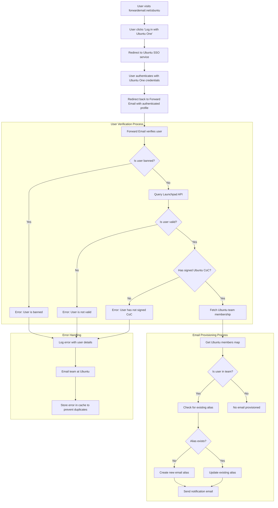

# Estudo de caso: como a Canonical potencializa o gerenciamento de e-mail do Ubuntu com a solução empresarial de código aberto da Forward Email {#case-study-how-canonical-powers-ubuntu-email-management-with-forward-emails-open-source-enterprise-solution}


## Índice {#table-of-contents}

* [Prefácio](#foreword)
* [O Desafio: Gerenciando um Ecossistema de Email Complexo](#the-challenge-managing-a-complex-email-ecosystem)
* [Principais conclusões](#key-takeaways)
* [Por que encaminhar e-mail](#why-forward-email)
* [A implementação: integração SSO perfeita](#the-implementation-seamless-sso-integration)
  * [Visualização do fluxo de autenticação](#authentication-flow-visualization)
  * [Detalhes de implementação técnica](#technical-implementation-details)
* [Configuração de DNS e roteamento de e-mail](#dns-configuration-and-email-routing)
* [Resultados: Gerenciamento de e-mail simplificado e segurança aprimorada](#results-streamlined-email-management-and-enhanced-security)
  * [Eficiência Operacional](#operational-efficiency)
  * [Segurança e privacidade aprimoradas](#enhanced-security-and-privacy)
  * [Economia de custos](#cost-savings)
  * [Experiência aprimorada do colaborador](#improved-contributor-experience)
* [Olhando para o futuro: colaboração contínua](#looking-forward-continued-collaboration)
* [Conclusão: Uma parceria perfeita de código aberto](#conclusion-a-perfect-open-source-partnership)
* [Suporte a clientes empresariais](#supporting-enterprise-clients)
  * [Entre em contato](#get-in-touch)
  * [Sobre encaminhar e-mail](#about-forward-email)

## Prefácio {#foreword}

No mundo do software de código aberto, poucos nomes têm tanto peso quanto a [Canônico](https://en.wikipedia.org/wiki/Canonical_\(company\), a empresa por trás da [Ubuntu](https://en.wikipedia.org/wiki/Ubuntu), uma das distribuições Linux mais populares do mundo. Com um vasto ecossistema abrangendo diversas distribuições, incluindo Ubuntu, [Livre](https://en.wikipedia.org/wiki/Kubuntu), [Lubuntu](https://en.wikipedia.org/wiki/Lubuntu), [Edubuntu](https://en.wikipedia.org/wiki/Edubuntu) e outras, a Canonical enfrentou desafios únicos no gerenciamento de endereços de e-mail em seus diversos domínios. Este estudo de caso explora como a Canonical fez uma parceria com a Forward Email para criar uma solução de gerenciamento de e-mail empresarial integrada, segura e com foco na privacidade, que se alinha perfeitamente aos seus valores de código aberto.

## O Desafio: Gerenciando um Ecossistema de E-mail Complexo {#the-challenge-managing-a-complex-email-ecosystem}

O ecossistema da Canonical é diverso e abrangente. Com milhões de usuários em todo o mundo e milhares de colaboradores em diversos projetos, gerenciar endereços de e-mail em múltiplos domínios representava desafios significativos. Os principais colaboradores precisavam de endereços de e-mail oficiais (@ubuntu.com, @kubuntu.org, etc.) que refletissem seu envolvimento com o projeto, mantendo a segurança e a facilidade de uso por meio de um sistema robusto de gerenciamento de domínios do Ubuntu.

Antes de implementar o Forward Email, a Canonical enfrentava dificuldades com:

* Gerenciando endereços de e-mail em múltiplos domínios (@ubuntu.com, @kubuntu.org, @lubuntu.me, @edubuntu.org e @ubuntu.net)
* Proporcionando uma experiência de e-mail consistente para os principais colaboradores
* Integrando serviços de e-mail com seu sistema de Login Único (SSO) [Ubuntu One](https://en.wikipedia.org/wiki/Ubuntu_One) existente
* Encontrando uma solução alinhada ao seu compromisso com privacidade, segurança e segurança de e-mail de código aberto
* Escalando sua infraestrutura de e-mail segura de forma econômica

## Principais conclusões {#key-takeaways}

* A Canonical implementou com sucesso uma solução unificada de gerenciamento de e-mail em vários domínios do Ubuntu
* A abordagem 100% de código aberto do Forward Email alinhou-se perfeitamente aos valores da Canonical
* A integração SSO com o Ubuntu One oferece autenticação perfeita para colaboradores
* A criptografia resistente a quantum garante segurança de longo prazo para todas as comunicações por e-mail
* A solução é escalável de forma econômica para oferecer suporte à crescente base de colaboradores da Canonical

## Por que encaminhar e-mail {#why-forward-email}

Como o único provedor de serviços de e-mail 100% de código aberto com foco em privacidade e segurança, o Forward Email foi a solução perfeita para as necessidades de encaminhamento de e-mails corporativos da Canonical. Nossos valores se alinhavam perfeitamente ao compromisso da Canonical com software de código aberto e privacidade.

Os principais fatores que fizeram do Forward Email a escolha ideal incluem:

1. **Código-base completo e de código aberto**: Toda a nossa plataforma é de código aberto e está disponível em [GitHub](https://en.wikipedia.org/wiki/GitHub), permitindo transparência e contribuições da comunidade. Ao contrário de muitos provedores de e-mail "focados em privacidade", que apenas disponibilizam seus front-ends de código aberto, mantendo seus back-ends fechados, disponibilizamos todo o nosso código-base — tanto o front-end quanto o back-end — para qualquer pessoa consultar em [GitHub](https://github.com/forwardemail/forwardemail.net).

2. **Abordagem focada em privacidade**: Ao contrário de outros provedores, não armazenamos e-mails em bancos de dados compartilhados e usamos criptografia robusta com TLS. Nossa filosofia fundamental de privacidade é simples: **seus e-mails pertencem a você e somente a você**. Este princípio orienta todas as decisões técnicas que tomamos, desde como lidamos com o encaminhamento de e-mails até como implementamos a criptografia.

3. **Sem dependência de terceiros**: Não usamos o Amazon SES ou outros serviços de terceiros, o que nos dá controle total sobre a infraestrutura de e-mail e elimina possíveis vazamentos de privacidade por meio de serviços de terceiros.

4. **Escalonamento econômico**: Nosso modelo de preços permite que as organizações escalem sem pagar por usuário, tornando-o ideal para a grande base de colaboradores da Canonical.

5. **Criptografia resistente a quantum**: Usamos caixas de correio SQLite criptografadas individualmente com [ChaCha20-Poli1305](https://en.wikipedia.org/wiki/ChaCha20-Poly1305) como cifra para [criptografia resistente a quantum](/blog/docs/best-quantum-safe-encrypted-email-service). Cada caixa de correio é um arquivo criptografado separado, o que significa que o acesso aos dados de um usuário não garante o acesso aos dados de outros.

## A implementação: Integração SSO perfeita {#the-implementation-seamless-sso-integration}

Um dos aspectos mais críticos da implementação foi a integração com o sistema SSO do Ubuntu One existente da Canonical. Essa integração permitiria que os colaboradores principais gerenciassem seus endereços de e-mail @ubuntu.com usando suas credenciais atuais do Ubuntu One.

### Visualização do fluxo de autenticação {#authentication-flow-visualization}

O diagrama a seguir ilustra o fluxo completo de autenticação e provisionamento de e-mail:



### Detalhes de implementação técnica {#technical-implementation-details}

A integração entre o Forward Email e o SSO do Ubuntu One foi realizada por meio de uma implementação personalizada da estratégia de autenticação passport-ubuntu. Isso permitiu um fluxo de autenticação perfeito entre os sistemas do Ubuntu One e do Forward Email.

#### O Fluxo de Autenticação {#the-authentication-flow}

O processo de autenticação funciona da seguinte maneira:

1. Os usuários acessam a página dedicada de gerenciamento de e-mail do Ubuntu em [forwardemail.net/ubuntu](https://forwardemail.net/ubuntu)
2. Eles clicam em "Fazer login com o Ubuntu One" e são redirecionados para o serviço Ubuntu SSO
3. Após a autenticação com suas credenciais do Ubuntu One, eles são redirecionados de volta para o Forward Email com seu perfil autenticado
4. O Forward Email verifica seu status de colaborador e provisiona ou gerencia seu endereço de e-mail adequadamente

A implementação técnica utilizou o pacote [`passport-ubuntu`](https://www.npmjs.com/package/passport-ubuntu), que é uma estratégia [Passaporte](https://www.npmjs.com/package/passport) para autenticação no Ubuntu usando [ID aberto](https://en.wikipedia.org/wiki/OpenID). A configuração incluiu:

```javascript
passport.use(new UbuntuStrategy({
  returnURL: process.env.UBUNTU_CALLBACK_URL,
  realm: process.env.UBUNTU_REALM,
  stateless: true
}, function(identifier, profile, done) {
  // User verification and email provisioning logic
}));
```

#### Integração e validação da API do Launchpad {#launchpad-api-integration-and-validation}

Um componente crítico da nossa implementação é a integração com a API do [Plataforma de lançamento](https://en.wikipedia.org/wiki/Launchpad_\(website\) para validar usuários do Ubuntu e suas associações de equipe. Criamos funções auxiliares reutilizáveis para lidar com essa integração de forma eficiente e confiável.

A função auxiliar `sync-ubuntu-user.js` é responsável por validar usuários por meio da API do Launchpad e gerenciar seus endereços de e-mail. Veja uma versão simplificada de como funciona:

```javascript
async function syncUbuntuUser(user, map) {
  try {
    // Validate user object
    if (!_.isObject(user) ||
        !isSANB(user[fields.ubuntuUsername]) ||
        !isSANB(user[fields.ubuntuProfileID]) ||
        !isEmail(user.email))
      throw new TypeError('Invalid user object');

    // Get Ubuntu members map if not provided
    if (!(map instanceof Map))
      map = await getUbuntuMembersMap(resolver);

    // Check if user is banned
    if (user[config.userFields.isBanned]) {
      throw new InvalidUbuntuUserError('User was banned', { ignoreHook: true });
    }

    // Query Launchpad API to validate user
    const url = `https://api.launchpad.net/1.0/~${user[fields.ubuntuUsername]}`;
    const response = await retryRequest(url, { resolver });
    const json = await response.body.json();

    // Validate required boolean properties
    if (!json.is_valid)
      throw new InvalidUbuntuUserError('Property "is_valid" was false');

    if (!json.is_ubuntu_coc_signer)
      throw new InvalidUbuntuUserError('Property "is_ubuntu_coc_signer" was false');

    // Process each domain for the user
    await pMap([...map.keys()], async (name) => {
      // Find domain in database
      const domain = await Domains.findOne({
        name,
        plan: 'team',
        has_txt_record: true
      }).populate('members.user');

      // Process user's email alias for this domain
      if (map.get(name).has(user[fields.ubuntuUsername])) {
        // User is a member of this team, create or update alias
        let alias = await Aliases.findOne({
          user: user._id,
          domain: domain._id,
          name: user[fields.ubuntuUsername].toLowerCase()
        });

        if (!alias) {
          // Create new alias with appropriate error handling
          alias = await Aliases.create({
            user: user._id,
            domain: domain._id,
            name: user[fields.ubuntuUsername].toLowerCase(),
            recipients: [user.email],
            locale: user[config.lastLocaleField],
            is_enabled: true
          });

          // Notify admins about new alias creation
          await emailHelper({
            template: 'alert',
            message: {
              to: adminEmailsForDomain,
              subject: `New @${domain.name} email address created`
            },
            locals: {
              message: `A new email address ${user[fields.ubuntuUsername].toLowerCase()}@${domain.name} was created for ${user.email}`
            }
          });
        }
      }
    });

    return true;
  } catch (err) {
    // Handle and log errors
    await logErrorWithUser(err, user);
    throw err;
  }
}
```

Para simplificar o gerenciamento de associações de equipe em diferentes domínios do Ubuntu, criamos um mapeamento direto entre nomes de domínio e suas equipes correspondentes do Launchpad:

```javascript
ubuntuTeamMapping: {
  'ubuntu.com': '~ubuntumembers',
  'kubuntu.org': '~kubuntu-members',
  'lubuntu.me': '~lubuntu-members',
  'edubuntu.org': '~edubuntu-members',
  'ubuntustudio.com': '~ubuntustudio-core',
  'ubuntu.net': '~ubuntu-smtp-test'
},
```

Esse mapeamento simples nos permite automatizar o processo de verificação de associações de equipe e provisionamento de endereços de e-mail, tornando o sistema fácil de manter e ampliar à medida que novos domínios são adicionados.

#### Tratamento de erros e notificações {#error-handling-and-notifications}

Implementamos um sistema robusto de tratamento de erros que:

1. Registra todos os erros com informações detalhadas do usuário
2. Envia e-mails para a equipe do Ubuntu quando problemas são detectados
3. Notifica os administradores quando novos colaboradores se inscrevem e têm endereços de e-mail criados
4. Lida com casos extremos, como usuários que não assinaram o Código de Conduta do Ubuntu

Isso garante que quaisquer problemas sejam identificados e resolvidos rapidamente, mantendo a integridade do sistema de e-mail.

## Configuração de DNS e roteamento de e-mail {#dns-configuration-and-email-routing}

Para cada domínio gerenciado pelo Forward Email, a Canonical adicionou um registro DNS TXT simples para validação:

```sh
❯ dig ubuntu.com txt
ubuntu.com.             600     IN      TXT     "forward-email-site-verification=6IsURgl2t7"
```

Este registro de verificação confirma a propriedade do domínio e permite que nosso sistema gerencie e-mails para esses domínios com segurança. A Canonical encaminha e-mails por meio do nosso serviço via Postfix, que fornece uma infraestrutura de entrega de e-mails confiável e segura.

Resultados do ##: Gerenciamento de e-mail simplificado e segurança aprimorada {#results-streamlined-email-management-and-enhanced-security}

A implementação da solução empresarial da Forward Email trouxe benefícios significativos para o gerenciamento de e-mail da Canonical em todos os seus domínios:

### Eficiência Operacional {#operational-efficiency}

* **Gerenciamento centralizado**: Todos os domínios relacionados ao Ubuntu agora são gerenciados por meio de uma única interface
* **Redução da sobrecarga administrativa**: Provisionamento automatizado e gerenciamento de autoatendimento para colaboradores
* **Integração simplificada**: Novos colaboradores podem obter rapidamente seus endereços de e-mail oficiais

### Segurança e privacidade aprimoradas {#enhanced-security-and-privacy}

* **Criptografia de ponta a ponta**: Todos os e-mails são criptografados usando padrões avançados
* **Sem bancos de dados compartilhados**: Os e-mails de cada usuário são armazenados em bancos de dados SQLite criptografados individuais, proporcionando uma abordagem de criptografia em sandbox que é fundamentalmente mais segura do que os bancos de dados relacionais compartilhados tradicionais
* **Segurança de código aberto**: A base de código transparente permite revisões de segurança pela comunidade
* **Processamento na memória**: Não armazenamos e-mails encaminhados em disco, aumentando a proteção da privacidade
* **Sem armazenamento de metadados**: Não mantemos registros de quem está enviando e-mails para quem, ao contrário de muitos provedores de e-mail

### Economia de custos {#cost-savings}

* **Modelo de preços escalável**: Sem taxas por usuário, permitindo que a Canonical adicione colaboradores sem aumentar os custos
* **Necessidades de infraestrutura reduzidas**: Não é necessário manter servidores de e-mail separados para domínios diferentes
* **Redução dos requisitos de suporte**: O gerenciamento de autoatendimento reduz os tíquetes de suporte de TI

### Experiência aprimorada do colaborador {#improved-contributor-experience}

* **Autenticação perfeita**: Login único com credenciais existentes do Ubuntu One
* **Marca consistente**: Experiência unificada em todos os serviços relacionados ao Ubuntu
* **Entrega confiável de e-mails**: Reputação de IP de alta qualidade garante que os e-mails cheguem ao destino

A integração com o Forward Email simplificou significativamente o processo de gerenciamento de e-mails da Canonical. Os colaboradores agora têm uma experiência integrada no gerenciamento de seus endereços de e-mail @ubuntu.com, com redução de custos administrativos e segurança aprimorada.

## Olhando para o futuro: colaboração contínua {#looking-forward-continued-collaboration}

A parceria entre a Canonical e a Forward Email continua a evoluir. Estamos trabalhando juntos em diversas iniciativas:

* Expandindo os serviços de e-mail para domínios adicionais relacionados ao Ubuntu
* Aprimorando a interface do usuário com base no feedback dos colaboradores
* Implementando recursos de segurança adicionais
* Explorando novas maneiras de alavancar nossa colaboração de código aberto

## Conclusão: Uma parceria perfeita de código aberto {#conclusion-a-perfect-open-source-partnership}

A colaboração entre a Canonical e a Forward Email demonstra o poder das parcerias construídas com base em valores compartilhados. Ao escolher a Forward Email como provedora de serviços de e-mail, a Canonical encontrou uma solução que não só atendia aos seus requisitos técnicos, mas também se alinhava perfeitamente ao seu compromisso com software de código aberto, privacidade e segurança.

Para organizações que gerenciam múltiplos domínios e exigem autenticação integrada com sistemas existentes, o Forward Email oferece uma solução flexível, segura e focada na privacidade. Nosso [abordagem de código aberto](https://forwardemail.net/blog/docs/why-open-source-email-security-privacy) garante transparência e permite contribuições da comunidade, tornando-o a escolha ideal para organizações que valorizam esses princípios.

À medida que a Canonical e a Forward Email continuam inovando em seus respectivos campos, essa parceria é uma prova do poder da colaboração de código aberto e dos valores compartilhados na criação de soluções eficazes.

Você pode verificar nosso [status do serviço em tempo real](https://status.forwardemail.net) para ver nosso desempenho atual de entrega de e-mail, que monitoramos continuamente para garantir reputação de IP de alta qualidade e capacidade de entrega de e-mail.

## Suporte a clientes corporativos {#supporting-enterprise-clients}

Embora este estudo de caso se concentre em nossa parceria com a Canonical, a Forward Email tem orgulho de oferecer suporte a diversos clientes empresariais em vários setores que valorizam nosso compromisso com privacidade, segurança e princípios de código aberto.

Nossas soluções empresariais são adaptadas para atender às necessidades específicas de organizações de todos os tamanhos, oferecendo:

* Domínio personalizado [gerenciamento de e-mail](/) em vários domínios
* Integração perfeita com sistemas de autenticação existentes
* Canal de suporte por chat dedicado da Matrix
* Recursos de segurança aprimorados, incluindo [criptografia resistente a quantum](/blog/docs/best-quantum-safe-encrypted-email-service)
* Portabilidade e propriedade completas de dados
* Infraestrutura 100% de código aberto para transparência e confiança

### Entre em contato {#get-in-touch}

Se sua organização tem necessidades de e-mail empresarial ou você está interessado em saber mais sobre como o Forward Email pode ajudar a otimizar seu gerenciamento de e-mail e, ao mesmo tempo, melhorar a privacidade e a segurança, gostaríamos de saber sua opinião:

* Envie um e-mail diretamente para `support@forwardemail.net`
* Envie uma solicitação de ajuda para [página de ajuda](https://forwardemail.net/help)
* Consulte [página de preços](https://forwardemail.net/pricing) para planos empresariais

Nossa equipe está pronta para discutir suas necessidades específicas e desenvolver uma solução personalizada que esteja alinhada aos valores e às necessidades técnicas da sua organização.

### Sobre encaminhar e-mail {#about-forward-email}

O Forward Email é um serviço de e-mail 100% de código aberto e focado em privacidade. Oferecemos encaminhamento de e-mail com domínio personalizado, além de serviços SMTP, IMAP e POP3, com foco em segurança, privacidade e transparência. Toda a nossa base de código está disponível em [GitHub](https://github.com/forwardemail/forwardemail.net), e temos o compromisso de fornecer serviços de e-mail que respeitam a privacidade e a segurança do usuário. Saiba mais sobre [por que o e-mail de código aberto é o futuro](https://forwardemail.net/blog/docs/why-open-source-email-security-privacy), [como funciona nosso encaminhamento de e-mail](https://forwardemail.net/blog/docs/best-email-forwarding-service) e [nossa abordagem para proteção de privacidade de e-mail](https://forwardemail.net/blog/docs/email-privacy-protection-technical-implementation).