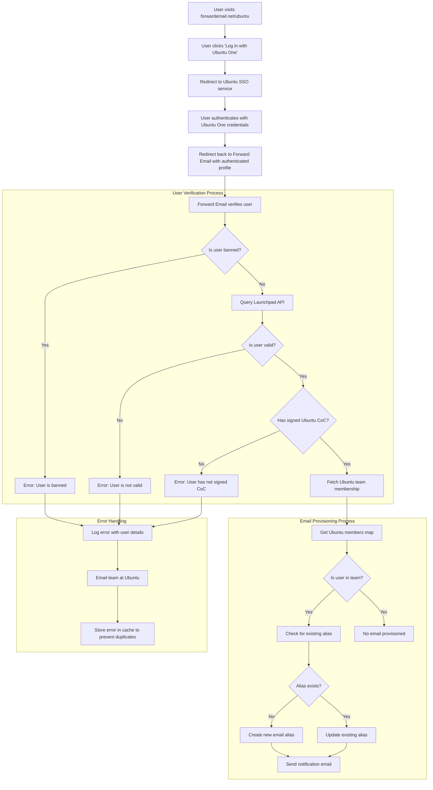

# Estudo de Caso: Como a Canonical Potencializa a Gestão de Email do Ubuntu com a Solução Empresarial Open-Source do Forward Email {#case-study-how-canonical-powers-ubuntu-email-management-with-forward-emails-open-source-enterprise-solution}


## Índice {#table-of-contents}

* [Prefácio](#foreword)
* [O Desafio: Gerenciando um Ecossistema Complexo de Email](#the-challenge-managing-a-complex-email-ecosystem)
* [Principais Lições](#key-takeaways)
* [Por que Forward Email](#why-forward-email)
* [A Implementação: Integração SSO Sem Falhas](#the-implementation-seamless-sso-integration)
  * [Visualização do Fluxo de Autenticação](#authentication-flow-visualization)
  * [Detalhes Técnicos da Implementação](#technical-implementation-details)
* [Configuração DNS e Roteamento de Email](#dns-configuration-and-email-routing)
* [Resultados: Gestão de Email Simplificada e Segurança Aprimorada](#results-streamlined-email-management-and-enhanced-security)
  * [Eficiência Operacional](#operational-efficiency)
  * [Segurança e Privacidade Aprimoradas](#enhanced-security-and-privacy)
  * [Economia de Custos](#cost-savings)
  * [Melhoria na Experiência dos Colaboradores](#improved-contributor-experience)
* [Perspectivas Futuras: Colaboração Contínua](#looking-forward-continued-collaboration)
* [Conclusão: Uma Parceria Open-Source Perfeita](#conclusion-a-perfect-open-source-partnership)
* [Apoio a Clientes Empresariais](#supporting-enterprise-clients)
  * [Entre em Contato](#get-in-touch)
  * [Sobre o Forward Email](#about-forward-email)


## Prefácio {#foreword}

No mundo do software open-source, poucos nomes têm tanto peso quanto a [Canonical](https://en.wikipedia.org/wiki/Canonical_\(company\)), a empresa por trás do [Ubuntu](https://en.wikipedia.org/wiki/Ubuntu), uma das distribuições Linux mais populares globalmente. Com um vasto ecossistema que abrange múltiplas distribuições incluindo Ubuntu, [Kubuntu](https://en.wikipedia.org/wiki/Kubuntu), [Lubuntu](https://en.wikipedia.org/wiki/Lubuntu), [Edubuntu](https://en.wikipedia.org/wiki/Edubuntu) e outras, a Canonical enfrentava desafios únicos na gestão de endereços de email em seus inúmeros domínios. Este estudo de caso explora como a Canonical fez parceria com o Forward Email para criar uma solução empresarial de gestão de email que é fluida, segura e focada em privacidade, alinhando-se perfeitamente com seus valores open-source.


## O Desafio: Gerenciando um Ecossistema Complexo de Email {#the-challenge-managing-a-complex-email-ecosystem}

O ecossistema da Canonical é diverso e expansivo. Com milhões de usuários no mundo todo e milhares de colaboradores em vários projetos, gerenciar endereços de email em múltiplos domínios apresentava desafios significativos. Colaboradores principais precisavam de endereços oficiais de email (@ubuntu.com, @kubuntu.org, etc.) que refletissem seu envolvimento com o projeto, mantendo segurança e facilidade de uso por meio de um sistema robusto de gestão de domínios Ubuntu.

Antes de implementar o Forward Email, a Canonical enfrentava dificuldades em:

* Gerenciar endereços de email em múltiplos domínios (@ubuntu.com, @kubuntu.org, @lubuntu.me, @edubuntu.org e @ubuntu.net)
* Prover uma experiência consistente de email para colaboradores principais
* Integrar serviços de email com seu sistema existente de Single Sign-On (SSO) [Ubuntu One](https://en.wikipedia.org/wiki/Ubuntu_One)
* Encontrar uma solução alinhada com seu compromisso com privacidade, segurança e segurança de email open-source
* Escalar sua infraestrutura segura de email de forma econômica


## Principais Lições {#key-takeaways}

* A Canonical implementou com sucesso uma solução unificada de gestão de email em múltiplos domínios Ubuntu
* A abordagem 100% open-source do Forward Email alinhou-se perfeitamente com os valores da Canonical
* A integração SSO com Ubuntu One proporciona autenticação fluida para colaboradores
* A criptografia resistente a computação quântica garante segurança a longo prazo para todas as comunicações por email
* A solução escala de forma econômica para suportar a crescente base de colaboradores da Canonical


## Por que Forward Email {#why-forward-email}
Como o único provedor de serviço de e-mail 100% open-source com foco em privacidade e segurança, o Forward Email foi uma escolha natural para as necessidades de encaminhamento de e-mail corporativo da Canonical. Nossos valores se alinharam perfeitamente com o compromisso da Canonical com software open-source e privacidade.

Fatores-chave que fizeram do Forward Email a escolha ideal incluíram:

1. **Código-fonte completamente open-source**: Toda a nossa plataforma é open-source e disponível no [GitHub](https://en.wikipedia.org/wiki/GitHub), permitindo transparência e contribuições da comunidade. Diferente de muitos provedores de e-mail "focados em privacidade" que apenas liberam seus frontends enquanto mantêm seus backends fechados, disponibilizamos todo o nosso código—tanto frontend quanto backend—para qualquer pessoa inspecionar no [GitHub](https://github.com/forwardemail/forwardemail.net).

2. **Abordagem focada em privacidade**: Diferente de outros provedores, não armazenamos e-mails em bancos de dados compartilhados, e usamos criptografia robusta com TLS. Nossa filosofia fundamental de privacidade é simples: **seus e-mails pertencem a você e somente a você**. Esse princípio guia toda decisão técnica que tomamos, desde como lidamos com o encaminhamento de e-mails até como implementamos a criptografia.

3. **Sem dependência de terceiros**: Não usamos Amazon SES ou outros serviços de terceiros, o que nos dá controle total sobre a infraestrutura de e-mail e elimina potenciais vazamentos de privacidade por meio de serviços externos.

4. **Escalabilidade econômica**: Nosso modelo de preços permite que organizações escalem sem pagar por usuário, tornando-o ideal para a grande base de colaboradores da Canonical.

5. **Criptografia resistente a computadores quânticos**: Usamos caixas postais SQLite criptografadas individualmente com [ChaCha20-Poly1305](https://en.wikipedia.org/wiki/ChaCha20-Poly1305) como cifra para [criptografia resistente a computadores quânticos](/blog/docs/best-quantum-safe-encrypted-email-service). Cada caixa postal é um arquivo criptografado separado, o que significa que o acesso aos dados de um usuário não concede acesso aos dados de outros.


## A Implementação: Integração SSO Sem Falhas {#the-implementation-seamless-sso-integration}

Um dos aspectos mais críticos da implementação foi a integração com o sistema SSO Ubuntu One já existente da Canonical. Essa integração permitiria que colaboradores principais gerenciassem seus endereços de e-mail @ubuntu.com usando suas credenciais Ubuntu One existentes.

### Visualização do Fluxo de Autenticação {#authentication-flow-visualization}

O diagrama a seguir ilustra o fluxo completo de autenticação e provisionamento de e-mail:


```mermaid
flowchart TD
    A[User visits forwardemail.net/ubuntu] --> B[User clicks 'Log in with Ubuntu One']
    B --> C[Redirect to Ubuntu SSO service]
    C --> D[User authenticates with Ubuntu One credentials]
    D --> E[Redirect back to Forward Email with authenticated profile]
    E --> F[Forward Email verifies user]

    subgraph "User Verification Process"
        F --> G{Is user banned?}
        G -->|Yes| H[Error: User is banned]
        G -->|No| I[Query Launchpad API]
        I --> J{Is user valid?}
        J -->|No| K[Error: User is not valid]
        J -->|Yes| L{Has signed Ubuntu CoC?}
        L -->|No| M[Error: User has not signed CoC]
        L -->|Yes| N[Fetch Ubuntu team membership]
    end

    subgraph "Email Provisioning Process"
        N --> O[Get Ubuntu members map]
        O --> P{Is user in team?}
        P -->|Yes| Q[Check for existing alias]
        Q --> R{Alias exists?}
        R -->|No| S[Create new email alias]
        R -->|Yes| T[Update existing alias]
        S --> U[Send notification email]
        T --> U
        P -->|No| V[No email provisioned]
    end

    subgraph "Error Handling"
        H --> W[Log error with user details]
        K --> W
        M --> W
        W --> X[Email team at Ubuntu]
        X --> Y[Store error in cache to prevent duplicates]
    end
```

### Detalhes Técnicos da Implementação {#technical-implementation-details}

A integração entre Forward Email e Ubuntu One SSO foi realizada por meio de uma implementação personalizada da estratégia de autenticação passport-ubuntu. Isso permitiu um fluxo de autenticação fluido entre os sistemas Ubuntu One e Forward Email.
#### O Fluxo de Autenticação {#the-authentication-flow}

O processo de autenticação funciona da seguinte forma:

1. Os usuários visitam a página dedicada à gestão de e-mails do Ubuntu em [forwardemail.net/ubuntu](https://forwardemail.net/ubuntu)
2. Eles clicam em "Entrar com Ubuntu One" e são redirecionados para o serviço SSO do Ubuntu
3. Após autenticar com suas credenciais do Ubuntu One, são redirecionados de volta para o Forward Email com seu perfil autenticado
4. O Forward Email verifica o status de colaborador e provisiona ou gerencia seu endereço de e-mail conforme necessário

A implementação técnica utilizou o pacote [`passport-ubuntu`](https://www.npmjs.com/package/passport-ubuntu), que é uma estratégia do [Passport](https://www.npmjs.com/package/passport) para autenticação com Ubuntu usando [OpenID](https://en.wikipedia.org/wiki/OpenID). A configuração incluiu:

```javascript
passport.use(new UbuntuStrategy({
  returnURL: process.env.UBUNTU_CALLBACK_URL,
  realm: process.env.UBUNTU_REALM,
  stateless: true
}, function(identifier, profile, done) {
  // User verification and email provisioning logic
}));
```

#### Integração e Validação da API do Launchpad {#launchpad-api-integration-and-validation}

Um componente crítico da nossa implementação é a integração com a API do [Launchpad](https://en.wikipedia.org/wiki/Launchpad_\(website\)) para validar usuários do Ubuntu e suas associações a equipes. Criamos funções auxiliares reutilizáveis para lidar com essa integração de forma eficiente e confiável.

A função auxiliar `sync-ubuntu-user.js` é responsável por validar usuários através da API do Launchpad e gerenciar seus endereços de e-mail. Aqui está uma versão simplificada de como ela funciona:

```javascript
async function syncUbuntuUser(user, map) {
  try {
    // Validar objeto do usuário
    if (!_.isObject(user) ||
        !isSANB(user[fields.ubuntuUsername]) ||
        !isSANB(user[fields.ubuntuProfileID]) ||
        !isEmail(user.email))
      throw new TypeError('Objeto de usuário inválido');

    // Obter mapa de membros do Ubuntu se não fornecido
    if (!(map instanceof Map))
      map = await getUbuntuMembersMap(resolver);

    // Verificar se o usuário está banido
    if (user[config.userFields.isBanned]) {
      throw new InvalidUbuntuUserError('Usuário foi banido', { ignoreHook: true });
    }

    // Consultar API do Launchpad para validar usuário
    const url = `https://api.launchpad.net/1.0/~${user[fields.ubuntuUsername]}`;
    const response = await retryRequest(url, { resolver });
    const json = await response.body.json();

    // Validar propriedades booleanas obrigatórias
    if (!json.is_valid)
      throw new InvalidUbuntuUserError('Propriedade "is_valid" estava falsa');

    if (!json.is_ubuntu_coc_signer)
      throw new InvalidUbuntuUserError('Propriedade "is_ubuntu_coc_signer" estava falsa');

    // Processar cada domínio para o usuário
    await pMap([...map.keys()], async (name) => {
      // Encontrar domínio no banco de dados
      const domain = await Domains.findOne({
        name,
        plan: 'team',
        has_txt_record: true
      }).populate('members.user');

      // Processar alias de e-mail do usuário para este domínio
      if (map.get(name).has(user[fields.ubuntuUsername])) {
        // Usuário é membro desta equipe, criar ou atualizar alias
        let alias = await Aliases.findOne({
          user: user._id,
          domain: domain._id,
          name: user[fields.ubuntuUsername].toLowerCase()
        });

        if (!alias) {
          // Criar novo alias com tratamento adequado de erros
          alias = await Aliases.create({
            user: user._id,
            domain: domain._id,
            name: user[fields.ubuntuUsername].toLowerCase(),
            recipients: [user.email],
            locale: user[config.lastLocaleField],
            is_enabled: true
          });

          // Notificar administradores sobre a criação do novo alias
          await emailHelper({
            template: 'alert',
            message: {
              to: adminEmailsForDomain,
              subject: `Novo endereço de e-mail @${domain.name} criado`
            },
            locals: {
              message: `Um novo endereço de e-mail ${user[fields.ubuntuUsername].toLowerCase()}@${domain.name} foi criado para ${user.email}`
            }
          });
        }
      }
    });

    return true;
  } catch (err) {
    // Tratar e registrar erros
    await logErrorWithUser(err, user);
    throw err;
  }
}
```
Para simplificar o gerenciamento das associações de equipes em diferentes domínios Ubuntu, criamos um mapeamento simples entre nomes de domínio e suas equipes correspondentes no Launchpad:

```javascript
ubuntuTeamMapping: {
  'ubuntu.com': '~ubuntumembers',
  'kubuntu.org': '~kubuntu-members',
  'lubuntu.me': '~lubuntu-members',
  'edubuntu.org': '~edubuntu-members',
  'ubuntustudio.com': '~ubuntustudio-core',
  'ubuntu.net': '~ubuntu-smtp-test'
},
```

Esse mapeamento simples nos permite automatizar o processo de verificação das associações de equipe e o provisionamento de endereços de e-mail, tornando o sistema fácil de manter e expandir conforme novos domínios são adicionados.

#### Tratamento de Erros e Notificações {#error-handling-and-notifications}

Implementamos um sistema robusto de tratamento de erros que:

1. Registra todos os erros com informações detalhadas do usuário
2. Envia e-mails para a equipe Ubuntu quando problemas são detectados
3. Notifica os administradores quando novos colaboradores se inscrevem e têm endereços de e-mail criados
4. Trata casos extremos, como usuários que não assinaram o Código de Conduta do Ubuntu

Isso garante que quaisquer problemas sejam rapidamente identificados e resolvidos, mantendo a integridade do sistema de e-mail.


## Configuração de DNS e Roteamento de E-mail {#dns-configuration-and-email-routing}

Para cada domínio gerenciado através do Forward Email, a Canonical adicionou um registro DNS TXT simples para validação:

```sh
❯ dig ubuntu.com txt
ubuntu.com.             600     IN      TXT     "forward-email-site-verification=6IsURgl2t7"
```

Esse registro de verificação confirma a propriedade do domínio e permite que nosso sistema gerencie e-mails para esses domínios de forma segura. A Canonical roteia o correio através do nosso serviço via Postfix, que fornece uma infraestrutura confiável e segura para entrega de e-mails.


## Resultados: Gestão de E-mail Simplificada e Segurança Aprimorada {#results-streamlined-email-management-and-enhanced-security}

A implementação da solução empresarial do Forward Email trouxe benefícios significativos para a gestão de e-mails da Canonical em todos os seus domínios:

### Eficiência Operacional {#operational-efficiency}

* **Gerenciamento centralizado**: Todos os domínios relacionados ao Ubuntu agora são gerenciados por uma única interface
* **Redução da carga administrativa**: Provisionamento automatizado e gerenciamento self-service para colaboradores
* **Onboarding simplificado**: Novos colaboradores podem obter rapidamente seus endereços oficiais de e-mail

### Segurança e Privacidade Aprimoradas {#enhanced-security-and-privacy}

* **Criptografia de ponta a ponta**: Todos os e-mails são criptografados usando padrões avançados
* **Sem bancos de dados compartilhados**: Os e-mails de cada usuário são armazenados em bancos de dados SQLite criptografados individualmente, proporcionando uma abordagem de criptografia isolada que é fundamentalmente mais segura do que bancos de dados relacionais compartilhados tradicionais
* **Segurança open-source**: O código transparente permite revisões de segurança pela comunidade
* **Processamento em memória**: Não armazenamos e-mails encaminhados em disco, aumentando a proteção da privacidade
* **Sem armazenamento de metadados**: Não mantemos registros de quem está enviando e-mail para quem, ao contrário de muitos provedores de e-mail

### Economia de Custos {#cost-savings}

* **Modelo de preços escalável**: Sem taxas por usuário, permitindo que a Canonical adicione colaboradores sem aumentar custos
* **Redução das necessidades de infraestrutura**: Não há necessidade de manter servidores de e-mail separados para diferentes domínios
* **Menor demanda de suporte**: O gerenciamento self-service reduz os chamados de suporte de TI

### Experiência Melhorada para Colaboradores {#improved-contributor-experience}

* **Autenticação integrada**: Single sign-on com as credenciais existentes do Ubuntu One
* **Branding consistente**: Experiência unificada em todos os serviços relacionados ao Ubuntu
* **Entrega confiável de e-mails**: Reputação de IP de alta qualidade garante que os e-mails cheguem ao destino

A integração com o Forward Email simplificou significativamente o processo de gestão de e-mails da Canonical. Os colaboradores agora têm uma experiência fluida ao gerenciar seus endereços de e-mail @ubuntu.com, com redução da carga administrativa e segurança aprimorada.


## Perspectivas Futuras: Colaboração Contínua {#looking-forward-continued-collaboration}

A parceria entre a Canonical e o Forward Email continua a evoluir. Estamos trabalhando juntos em várias iniciativas:
* Expandindo os serviços de email para domínios adicionais relacionados ao Ubuntu
* Melhorando a interface do usuário com base no feedback dos colaboradores
* Implementando recursos adicionais de segurança
* Explorando novas formas de aproveitar nossa colaboração open-source


## Conclusão: Uma Parceria Open-Source Perfeita {#conclusion-a-perfect-open-source-partnership}

A colaboração entre a Canonical e o Forward Email demonstra o poder das parcerias construídas com base em valores compartilhados. Ao escolher o Forward Email como seu provedor de serviço de email, a Canonical encontrou uma solução que não apenas atendeu aos seus requisitos técnicos, mas também se alinhou perfeitamente com seu compromisso com software open-source, privacidade e segurança.

Para organizações que gerenciam múltiplos domínios e requerem autenticação integrada com sistemas existentes, o Forward Email oferece uma solução flexível, segura e focada em privacidade. Nossa [abordagem open-source](https://forwardemail.net/blog/docs/why-open-source-email-security-privacy) garante transparência e permite contribuições da comunidade, tornando-a uma escolha ideal para organizações que valorizam esses princípios.

À medida que tanto a Canonical quanto o Forward Email continuam a inovar em seus respectivos campos, essa parceria se destaca como um testemunho do poder da colaboração open-source e dos valores compartilhados na criação de soluções eficazes.

Você pode verificar nosso [status do serviço em tempo real](https://status.forwardemail.net) para ver nosso desempenho atual na entrega de emails, que monitoramos continuamente para garantir alta reputação de IP e entregabilidade de emails.


## Suporte a Clientes Corporativos {#supporting-enterprise-clients}

Embora este estudo de caso foque em nossa parceria com a Canonical, o Forward Email orgulhosamente apoia inúmeros clientes corporativos em diversos setores que valorizam nosso compromisso com privacidade, segurança e princípios open-source.

Nossas soluções corporativas são personalizadas para atender às necessidades específicas de organizações de todos os tamanhos, oferecendo:

* [Gerenciamento de email](/) para domínios personalizados em múltiplos domínios
* Integração perfeita com sistemas de autenticação existentes
* Canal dedicado de suporte via chat Matrix
* Recursos avançados de segurança incluindo [criptografia resistente a computadores quânticos](/blog/docs/best-quantum-safe-encrypted-email-service)
* Portabilidade e propriedade completa dos dados
* Infraestrutura 100% open-source para transparência e confiança

### Entre em Contato {#get-in-touch}

Se sua organização possui necessidades corporativas de email ou você tem interesse em saber mais sobre como o Forward Email pode ajudar a simplificar o gerenciamento de emails enquanto aprimora a privacidade e segurança, adoraríamos ouvir você:

* Envie um email diretamente para `support@forwardemail.net`
* Envie uma solicitação de ajuda em nossa [página de ajuda](https://forwardemail.net/help)
* Confira nossa [página de preços](https://forwardemail.net/pricing) para planos corporativos

Nossa equipe está pronta para discutir seus requisitos específicos e desenvolver uma solução personalizada que se alinhe aos valores e necessidades técnicas da sua organização.

### Sobre o Forward Email {#about-forward-email}

O Forward Email é um serviço de email 100% open-source e focado em privacidade. Oferecemos encaminhamento de email para domínios personalizados, serviços SMTP, IMAP e POP3 com foco em segurança, privacidade e transparência. Todo o nosso código-fonte está disponível no [GitHub](https://github.com/forwardemail/forwardemail.net), e estamos comprometidos em fornecer serviços de email que respeitam a privacidade e segurança dos usuários. Saiba mais sobre [por que o email open-source é o futuro](https://forwardemail.net/blog/docs/why-open-source-email-security-privacy), [como nosso encaminhamento de email funciona](https://forwardemail.net/blog/docs/best-email-forwarding-service) e [nossa abordagem para proteção da privacidade no email](https://forwardemail.net/blog/docs/email-privacy-protection-technical-implementation).
