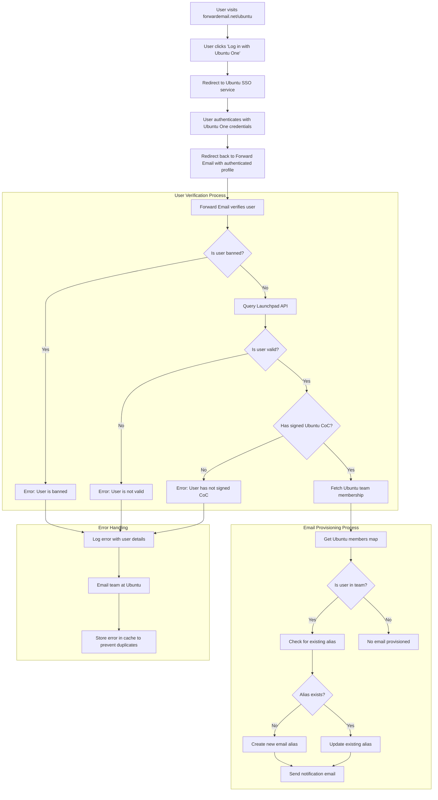

# Пример использования: Как Canonical обеспечивает управление электронной почтой Ubuntu с помощью корпоративного решения с открытым исходным кодом Forward Email {#case-study-how-canonical-powers-ubuntu-email-management-with-forward-emails-open-source-enterprise-solution}


## Содержание {#table-of-contents}

* [Предисловие](#foreword)
* [Задача: управление сложной экосистемой электронной почты](#the-challenge-managing-a-complex-email-ecosystem)
* [Ключевые выводы](#key-takeaways)
* [Зачем пересылать электронную почту](#why-forward-email)
* [Реализация: бесшовная интеграция SSO](#the-implementation-seamless-sso-integration)
  * [Визуализация потока аутентификации](#authentication-flow-visualization)
  * [Подробности технической реализации](#technical-implementation-details)
* [Конфигурация DNS и маршрутизация электронной почты](#dns-configuration-and-email-routing)
* [Результаты: оптимизированное управление электронной почтой и повышенная безопасность](#results-streamlined-email-management-and-enhanced-security)
  * [Операционная эффективность](#operational-efficiency)
  * [Повышенная безопасность и конфиденциальность](#enhanced-security-and-privacy)
  * [Экономия средств](#cost-savings)
  * [Улучшенный опыт участников](#improved-contributor-experience)
* [Взгляд в будущее: продолжение сотрудничества](#looking-forward-continued-collaboration)
* [Заключение: Идеальное партнерство с открытым исходным кодом](#conclusion-a-perfect-open-source-partnership)
* [Поддержка корпоративных клиентов](#supporting-enterprise-clients)
  * [Свяжитесь с нами](#get-in-touch)
  * [О пересылке электронной почты](#about-forward-email)

## Предисловие {#foreword}

В мире программного обеспечения с открытым исходным кодом мало какое имя имеет такой же вес, как [Канонический](https://en.wikipedia.org/wiki/Canonical_\(company\), компания, стоящая за [Убунту](https://en.wikipedia.org/wiki/Ubuntu), одним из самых популярных дистрибутивов Linux в мире. Имея обширную экосистему, охватывающую множество дистрибутивов, включая Ubuntu, [Бесплатно](https://en.wikipedia.org/wiki/Kubuntu), [Лубунту](https://en.wikipedia.org/wiki/Lubuntu), [Эдубунту](https://en.wikipedia.org/wiki/Edubuntu) и другие, Canonical столкнулась с уникальными проблемами управления адресами электронной почты в своих многочисленных доменах. В этом примере рассматривается, как Canonical совместно с Forward Email создала удобное, безопасное и конфиденциальное решение для управления корпоративной электронной почтой, идеально соответствующее принципам открытого исходного кода.

## Задача: управление сложной экосистемой электронной почты {#the-challenge-managing-a-complex-email-ecosystem}

Экосистема Canonical разнообразна и обширна. Учитывая миллионы пользователей по всему миру и тысячи участников различных проектов, управление адресами электронной почты в нескольких доменах представляло собой серьёзную проблему. Ключевым участникам требовались официальные адреса электронной почты (@ubuntu.com, @kubuntu.org и т. д.), отражающие их участие в проекте, но при этом обеспечивающие безопасность и простоту использования благодаря надёжной системе управления доменами Ubuntu.

До внедрения функции пересылки электронной почты компания Canonical сталкивалась со следующими проблемами:

* Управление адресами электронной почты в нескольких доменах (@ubuntu.com, @kubuntu.org, @lubuntu.me, @edubuntu.org и @ubuntu.net)
* Обеспечение единообразного взаимодействия с электронной почтой для основных участников
* Интеграция почтовых сервисов с существующей системой единого входа (SSO) [Ubuntu One](https://en.wikipedia.org/wiki/Ubuntu_One)
* Поиск решения, соответствующего их обязательствам по конфиденциальности, безопасности и безопасности электронной почты с открытым исходным кодом
* Масштабирование инфраструктуры безопасной электронной почты с минимальными затратами

## Ключевые выводы {#key-takeaways}

* Canonical успешно внедрила унифицированное решение для управления электронной почтой на нескольких доменах Ubuntu.
* Полностью открытый исходный код Forward Email идеально соответствует ценностям Canonical.
* Интеграция единого входа (SSO) с Ubuntu One обеспечивает бесперебойную аутентификацию участников.
* Квантово-устойчивое шифрование обеспечивает долгосрочную безопасность всех электронных сообщений.
* Решение масштабируется экономически эффективно для поддержки растущей базы участников Canonical.

## Зачем пересылать электронную почту {#why-forward-email}

Forward Email — единственный поставщик услуг электронной почты с открытым исходным кодом, уделяющий особое внимание конфиденциальности и безопасности. Он идеально подошёл Canonical для решения корпоративных задач пересылки электронной почты. Наши ценности идеально соответствуют приверженности Canonical принципам открытого программного обеспечения и конфиденциальности.

Ключевые факторы, которые сделали Forward Email идеальным выбором:

1. **Полностью открытая кодовая база**: Вся наша платформа имеет открытый исходный код и доступна по адресу [GitHub](https://en.wikipedia.org/wiki/GitHub), что обеспечивает прозрачность и возможность участия сообщества. В отличие от многих «зацикленных на конфиденциальности» почтовых провайдеров, которые открывают только код своих frontend-ов, оставляя backend-ы закрытыми, мы сделали всю нашу кодовую базу — как frontend-ов, так и backend-ов — доступной для всех желающих по адресу [GitHub](https://github.com/forwardemail/forwardemail.net).

2. **Подход, ориентированный на конфиденциальность**: В отличие от других провайдеров, мы не храним электронные письма в общих базах данных и используем надёжное шифрование TLS. Наша фундаментальная философия конфиденциальности проста: **ваши письма принадлежат вам и только вам**. Этот принцип лежит в основе всех принимаемых нами технических решений, от организации пересылки писем до внедрения шифрования.

3. **Отсутствие зависимости от третьих лиц**: мы не используем Amazon SES или другие сторонние сервисы, что дает нам полный контроль над инфраструктурой электронной почты и исключает потенциальные утечки конфиденциальной информации через сторонние сервисы.

4. **Экономически эффективное масштабирование**: наша модель ценообразования позволяет организациям масштабироваться без оплаты за каждого пользователя, что делает ее идеальной для большой базы авторов Canonical.

5. **Квантово-устойчивое шифрование**: Мы используем индивидуально зашифрованные почтовые ящики SQLite с [ChaCha20-Poly1305](https://en.wikipedia.org/wiki/ChaCha20-Poly1305) в качестве шифра для [квантово-устойчивое шифрование](/blog/docs/best-quantum-safe-encrypted-email-service). Каждый почтовый ящик представляет собой отдельный зашифрованный файл, то есть доступ к данным одного пользователя не даёт доступа другим.

## Реализация: бесшовная интеграция единого входа {#the-implementation-seamless-sso-integration}

Одним из важнейших аспектов внедрения стала интеграция с существующей системой единого входа (SSO) Ubuntu One от Canonical. Эта интеграция позволила бы основным участникам управлять своими адресами электронной почты @ubuntu.com, используя существующие учётные данные Ubuntu One.

### Визуализация потока аутентификации {#authentication-flow-visualization}

На следующей диаграмме показан полный процесс аутентификации и подготовки электронной почты:



### Подробности технической реализации {#technical-implementation-details}

Интеграция Forward Email и системы единого входа Ubuntu One была достигнута благодаря реализации стратегии аутентификации Passport-Ubuntu. Это обеспечило бесперебойную аутентификацию между системами Ubuntu One и Forward Email.

#### Поток аутентификации {#the-authentication-flow}

Процесс аутентификации работает следующим образом:

1. Пользователи посещают специальную страницу управления электронной почтой Ubuntu по адресу [forwardemail.net/ubuntu](https://forwardemail.net/ubuntu).
2. Они нажимают «Войти с Ubuntu One» и перенаправляются в службу единого входа Ubuntu.
3. После аутентификации с использованием своих учётных данных Ubuntu One они перенаправляются обратно в службу пересылки электронной почты с их аутентифицированным профилем.
4. Служба пересылки электронной почты подтверждает их статус участника и соответствующим образом предоставляет или управляет их адресом электронной почты.

Техническая реализация использовала пакет [`passport-ubuntu`](https://www.npmjs.com/package/passport-ubuntu), представляющий собой стратегию [Паспорт](https://www.npmjs.com/package/passport) для аутентификации в Ubuntu с использованием [OpenID](https://en.wikipedia.org/wiki/OpenID). Конфигурация включала:

```javascript
passport.use(new UbuntuStrategy({
  returnURL: process.env.UBUNTU_CALLBACK_URL,
  realm: process.env.UBUNTU_REALM,
  stateless: true
}, function(identifier, profile, done) {
  // User verification and email provisioning logic
}));
```

#### Интеграция и проверка API Launchpad {#launchpad-api-integration-and-validation}

Важнейшим компонентом нашей реализации является интеграция с API [Стартовая площадка](https://en.wikipedia.org/wiki/Launchpad_\(website\) для проверки пользователей Ubuntu и их членства в командах. Мы создали многоразовые вспомогательные функции для эффективной и надёжной реализации этой интеграции.

Вспомогательная функция `sync-ubuntu-user.js` отвечает за проверку пользователей через API Launchpad и управление их адресами электронной почты. Вот упрощённая версия её работы:

```javascript
async function syncUbuntuUser(user, map) {
  try {
    // Validate user object
    if (!_.isObject(user) ||
        !isSANB(user[fields.ubuntuUsername]) ||
        !isSANB(user[fields.ubuntuProfileID]) ||
        !isEmail(user.email))
      throw new TypeError('Invalid user object');

    // Get Ubuntu members map if not provided
    if (!(map instanceof Map))
      map = await getUbuntuMembersMap(resolver);

    // Check if user is banned
    if (user[config.userFields.isBanned]) {
      throw new InvalidUbuntuUserError('User was banned', { ignoreHook: true });
    }

    // Query Launchpad API to validate user
    const url = `https://api.launchpad.net/1.0/~${user[fields.ubuntuUsername]}`;
    const response = await retryRequest(url, { resolver });
    const json = await response.body.json();

    // Validate required boolean properties
    if (!json.is_valid)
      throw new InvalidUbuntuUserError('Property "is_valid" was false');

    if (!json.is_ubuntu_coc_signer)
      throw new InvalidUbuntuUserError('Property "is_ubuntu_coc_signer" was false');

    // Process each domain for the user
    await pMap([...map.keys()], async (name) => {
      // Find domain in database
      const domain = await Domains.findOne({
        name,
        plan: 'team',
        has_txt_record: true
      }).populate('members.user');

      // Process user's email alias for this domain
      if (map.get(name).has(user[fields.ubuntuUsername])) {
        // User is a member of this team, create or update alias
        let alias = await Aliases.findOne({
          user: user._id,
          domain: domain._id,
          name: user[fields.ubuntuUsername].toLowerCase()
        });

        if (!alias) {
          // Create new alias with appropriate error handling
          alias = await Aliases.create({
            user: user._id,
            domain: domain._id,
            name: user[fields.ubuntuUsername].toLowerCase(),
            recipients: [user.email],
            locale: user[config.lastLocaleField],
            is_enabled: true
          });

          // Notify admins about new alias creation
          await emailHelper({
            template: 'alert',
            message: {
              to: adminEmailsForDomain,
              subject: `New @${domain.name} email address created`
            },
            locals: {
              message: `A new email address ${user[fields.ubuntuUsername].toLowerCase()}@${domain.name} was created for ${user.email}`
            }
          });
        }
      }
    });

    return true;
  } catch (err) {
    // Handle and log errors
    await logErrorWithUser(err, user);
    throw err;
  }
}
```

Чтобы упростить управление членством в командах в разных доменах Ubuntu, мы создали простое сопоставление между именами доменов и соответствующими им командами Launchpad:

```javascript
ubuntuTeamMapping: {
  'ubuntu.com': '~ubuntumembers',
  'kubuntu.org': '~kubuntu-members',
  'lubuntu.me': '~lubuntu-members',
  'edubuntu.org': '~edubuntu-members',
  'ubuntustudio.com': '~ubuntustudio-core',
  'ubuntu.net': '~ubuntu-smtp-test'
},
```

Это простое сопоставление позволяет нам автоматизировать процесс проверки членства в команде и предоставления адресов электронной почты, что упрощает обслуживание и расширение системы по мере добавления новых доменов.

#### Обработка ошибок и уведомления {#error-handling-and-notifications}

Мы внедрили надежную систему обработки ошибок, которая:

1. Регистрирует все ошибки с подробной информацией о пользователях.
2. Отправляет команде Ubuntu электронное письмо при обнаружении проблем.
3. Уведомляет администраторов о регистрации новых участников и создании ими адресов электронной почты.
4. Обрабатывает особые случаи, например, когда пользователи не подписали Кодекс поведения Ubuntu.

Это гарантирует быстрое выявление и решение любых проблем, сохраняя целостность системы электронной почты.

## Конфигурация DNS и маршрутизация электронной почты {#dns-configuration-and-email-routing}

Для каждого домена, управляемого через пересылку электронной почты, Canonical добавила простую запись DNS TXT для проверки:

```sh
❯ dig ubuntu.com txt
ubuntu.com.             600     IN      TXT     "forward-email-site-verification=6IsURgl2t7"
```

Эта проверочная запись подтверждает право собственности на домен и позволяет нашей системе безопасно управлять электронной почтой для этих доменов. Canonical направляет почту через наш сервис через Postfix, который обеспечивает надёжную и безопасную инфраструктуру доставки электронной почты.

Результаты ##: оптимизированное управление электронной почтой и улучшенная безопасность {#results-streamlined-email-management-and-enhanced-security}

Внедрение корпоративного решения Forward Email обеспечило Canonical значительные преимущества в управлении электронной почтой во всех доменах:

### Операционная эффективность {#operational-efficiency}

* **Централизованное управление**: Все домены, связанные с Ubuntu, теперь управляются через единый интерфейс.
* **Снижение административных расходов**: Автоматизированное выделение ресурсов и самостоятельное управление для участников.
* **Упрощенная регистрация**: Новые участники могут быстро получить свои официальные адреса электронной почты.

### Улучшенная безопасность и конфиденциальность {#enhanced-security-and-privacy}

* **Сквозное шифрование**: Все письма шифруются с использованием передовых стандартов.
* **Отсутствие общих баз данных**: Письма каждого пользователя хранятся в отдельных зашифрованных базах данных SQLite, что обеспечивает изолированное шифрование, которое принципиально более безопасно, чем традиционные общие реляционные базы данных.
* **Безопасность с открытым исходным кодом**: Прозрачная кодовая база позволяет проводить проверки безопасности сообществом.
* **Обработка данных в памяти**: Мы не храним пересланные письма на диске, что повышает защиту конфиденциальности.
* **Отсутствие хранения метаданных**: В отличие от многих почтовых сервисов, мы не храним записи о том, кто кому отправляет письма.

### Экономия средств {#cost-savings}

* **Масштабируемая модель ценообразования**: отсутствие платы за каждого пользователя, что позволяет Canonical добавлять участников без увеличения затрат.
* **Снижение требований к инфраструктуре**: отсутствие необходимости поддерживать отдельные почтовые серверы для разных доменов.
* **Снижение требований к поддержке**: самостоятельное управление сокращает количество обращений в службу ИТ-поддержки.

### Улучшенный опыт для авторов {#improved-contributor-experience}

* **Беспроблемная аутентификация**: единый вход с использованием существующих учётных данных Ubuntu One
* **Единый брендинг**: единый интерфейс для всех сервисов Ubuntu
* **Надежная доставка электронной почты**: высокая репутация IP гарантирует, что письма будут доставлены получателю

Интеграция с Forward Email значительно упростила процесс управления электронной почтой Canonical. Теперь участники могут легко управлять своими адресами электронной почты @ubuntu.com, сокращая административные расходы и повышая безопасность.

## Взгляд в будущее: продолжение сотрудничества {#looking-forward-continued-collaboration}

Партнёрство Canonical и Forward Email продолжает развиваться. Мы работаем вместе над несколькими инициативами:

* Расширение почтовых сервисов на дополнительные домены, связанные с Ubuntu
* Улучшение пользовательского интерфейса на основе отзывов участников
* Реализация дополнительных функций безопасности
* Изучение новых способов использования нашего сотрудничества в области открытого исходного кода

## Заключение: Идеальное партнерство с открытым исходным кодом {#conclusion-a-perfect-open-source-partnership}

Сотрудничество Canonical и Forward Email демонстрирует силу партнёрства, основанного на общих ценностях. Выбрав Forward Email в качестве поставщика услуг электронной почты, Canonical нашла решение, которое не только отвечало их техническим требованиям, но и идеально соответствовало их приверженности открытому программному обеспечению, конфиденциальности и безопасности.

Для организаций, управляющих несколькими доменами и требующих бесперебойной аутентификации в существующих системах, Forward Email предлагает гибкое, безопасное и конфиденциальное решение. Наш [подход с открытым исходным кодом](https://forwardemail.net/blog/docs/why-open-source-email-security-privacy) обеспечивает прозрачность и позволяет вносить вклад в сообщество, что делает его идеальным выбором для организаций, которые ценят эти принципы.

Поскольку Canonical и Forward Email продолжают внедрять инновации в своих областях, это партнерство является свидетельством силы сотрудничества с открытым исходным кодом и общих ценностей в создании эффективных решений.

Вы можете проверить наш [статус обслуживания в реальном времени](https://status.forwardemail.net), чтобы увидеть текущую эффективность доставки электронной почты, которую мы постоянно отслеживаем, чтобы гарантировать высокую репутацию IP-адреса и доставку электронной почты.

## Поддержка корпоративных клиентов {#supporting-enterprise-clients}

Хотя в этом тематическом исследовании основное внимание уделяется нашему партнерству с Canonical, Forward Email с гордостью оказывает поддержку многочисленным корпоративным клиентам из различных отраслей, которые ценят нашу приверженность принципам конфиденциальности, безопасности и открытого исходного кода.

Наши корпоративные решения разработаны с учетом конкретных потребностей организаций любого размера и предлагают:

* Пользовательский домен [управление электронной почтой](/) для нескольких доменов
* Простая интеграция с существующими системами аутентификации
* Выделенный канал поддержки чата Matrix
* Расширенные функции безопасности, включая [квантово-устойчивое шифрование](/blog/docs/best-quantum-safe-encrypted-email-service)
* Полная переносимость данных и права собственности
* Полностью открытая инфраструктура для прозрачности и доверия

### Свяжитесь с нами {#get-in-touch}

Если вашей организации требуется корпоративная электронная почта или вы хотите узнать больше о том, как Forward Email может помочь оптимизировать управление электронной почтой, одновременно повышая конфиденциальность и безопасность, мы будем рады услышать от вас:

* Напишите нам напрямую по адресу `support@forwardemail.net`
* Отправьте запрос на помощь по адресу [страница помощи](https://forwardemail.net/help)
* Проверьте корпоративные тарифы по адресу [страница с ценами](https://forwardemail.net/pricing)

Наша команда готова обсудить ваши конкретные требования и разработать индивидуальное решение, соответствующее ценностям и техническим потребностям вашей организации.

### О пересылке электронной почты {#about-forward-email}

Forward Email — это почтовый сервис с полностью открытым исходным кодом, ориентированный на конфиденциальность. Мы предоставляем услуги пересылки электронной почты на настраиваемые домены, а также услуги SMTP, IMAP и POP3, уделяя особое внимание безопасности, конфиденциальности и прозрачности. Вся наша кодовая база доступна на [GitHub](https://github.com/forwardemail/forwardemail.net), и мы стремимся предоставлять почтовые сервисы, обеспечивающие конфиденциальность и безопасность пользователей. Узнайте больше о [почему электронная почта с открытым исходным кодом — это будущее](https://forwardemail.net/blog/docs/why-open-source-email-security-privacy), [как работает наша пересылка электронной почты](https://forwardemail.net/blog/docs/best-email-forwarding-service) и [наш подход к защите конфиденциальности электронной почты](https://forwardemail.net/blog/docs/email-privacy-protection-technical-implementation).