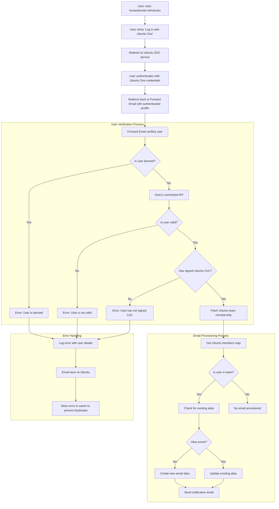

# Кейc: Как Canonical обеспечивает управление электронной почтой Ubuntu с помощью открытого корпоративного решения Forward Email {#case-study-how-canonical-powers-ubuntu-email-management-with-forward-emails-open-source-enterprise-solution}


## Содержание {#table-of-contents}

* [Предисловие](#foreword)
* [Задача: управление сложной экосистемой электронной почты](#the-challenge-managing-a-complex-email-ecosystem)
* [Основные выводы](#key-takeaways)
* [Почему Forward Email](#why-forward-email)
* [Реализация: бесшовная интеграция SSO](#the-implementation-seamless-sso-integration)
  * [Визуализация потока аутентификации](#authentication-flow-visualization)
  * [Технические детали реализации](#technical-implementation-details)
* [Настройка DNS и маршрутизация электронной почты](#dns-configuration-and-email-routing)
* [Результаты: оптимизированное управление почтой и повышенная безопасность](#results-streamlined-email-management-and-enhanced-security)
  * [Операционная эффективность](#operational-efficiency)
  * [Повышенная безопасность и конфиденциальность](#enhanced-security-and-privacy)
  * [Экономия средств](#cost-savings)
  * [Улучшенный опыт участников](#improved-contributor-experience)
* [Взгляд в будущее: продолжение сотрудничества](#looking-forward-continued-collaboration)
* [Заключение: идеальное партнерство в области открытого ПО](#conclusion-a-perfect-open-source-partnership)
* [Поддержка корпоративных клиентов](#supporting-enterprise-clients)
  * [Связаться с нами](#get-in-touch)
  * [О Forward Email](#about-forward-email)


## Предисловие {#foreword}

В мире открытого программного обеспечения немногие имена имеют такой вес, как [Canonical](https://en.wikipedia.org/wiki/Canonical_\(company\)) — компания, стоящая за [Ubuntu](https://en.wikipedia.org/wiki/Ubuntu), одной из самых популярных дистрибутивов Linux в мире. С обширной экосистемой, охватывающей несколько дистрибутивов, включая Ubuntu, [Kubuntu](https://en.wikipedia.org/wiki/Kubuntu), [Lubuntu](https://en.wikipedia.org/wiki/Lubuntu), [Edubuntu](https://en.wikipedia.org/wiki/Edubuntu) и другие, Canonical столкнулась с уникальными задачами управления адресами электронной почты на множестве своих доменов. В этом кейсе рассматривается, как Canonical сотрудничала с Forward Email для создания бесшовного, безопасного и ориентированного на конфиденциальность корпоративного решения для управления электронной почтой, которое идеально соответствует их ценностям открытого ПО.


## Задача: управление сложной экосистемой электронной почты {#the-challenge-managing-a-complex-email-ecosystem}

Экосистема Canonical разнообразна и обширна. С миллионами пользователей по всему миру и тысячами участников в различных проектах управление адресами электронной почты на множестве доменов представляло значительные сложности. Основным участникам требовались официальные адреса электронной почты (@ubuntu.com, @kubuntu.org и др.), отражающие их участие в проекте, при этом обеспечивающие безопасность и удобство использования через надежную систему управления доменами Ubuntu.

До внедрения Forward Email Canonical сталкивалась с проблемами:

* Управления адресами электронной почты на множестве доменов (@ubuntu.com, @kubuntu.org, @lubuntu.me, @edubuntu.org и @ubuntu.net)
* Обеспечения единообразного опыта работы с почтой для основных участников
* Интеграции почтовых сервисов с существующей системой единого входа (SSO) [Ubuntu One](https://en.wikipedia.org/wiki/Ubuntu_One)
* Поиска решения, соответствующего их обязательствам по конфиденциальности, безопасности и открытой безопасности электронной почты
* Масштабирования защищенной почтовой инфраструктуры с оптимальными затратами


## Основные выводы {#key-takeaways}

* Canonical успешно внедрила единое решение для управления электронной почтой на нескольких доменах Ubuntu
* 100% открытый исходный код Forward Email идеально соответствует ценностям Canonical
* Интеграция SSO с Ubuntu One обеспечивает бесшовную аутентификацию участников
* Квантово-устойчивое шифрование гарантирует долгосрочную безопасность всех почтовых коммуникаций
* Решение масштабируется с оптимальными затратами для поддержки растущей базы участников Canonical


## Почему Forward Email {#why-forward-email}
Как единственный 100% открытый почтовый сервис с акцентом на конфиденциальность и безопасность, Forward Email стал естественным выбором для корпоративных потребностей Canonical в пересылке электронной почты. Наши ценности идеально совпадали с приверженностью Canonical к открытому программному обеспечению и конфиденциальности.

Ключевые факторы, которые сделали Forward Email идеальным выбором, включали:

1. **Полностью открытый исходный код**: Вся наша платформа является открытой и доступна на [GitHub](https://en.wikipedia.org/wiki/GitHub), что обеспечивает прозрачность и возможность участия сообщества. В отличие от многих «ориентированных на конфиденциальность» почтовых провайдеров, которые открывают только фронтенд, оставляя бэкенд закрытым, мы сделали весь наш код — как фронтенд, так и бэкенд — доступным для проверки на [GitHub](https://github.com/forwardemail/forwardemail.net).

2. **Подход, ориентированный на конфиденциальность**: В отличие от других провайдеров, мы не храним письма в общих базах данных и используем надежное шифрование с TLS. Наша основная философия конфиденциальности проста: **ваши письма принадлежат вам и только вам**. Этот принцип направляет каждое техническое решение, которое мы принимаем, от обработки пересылки почты до реализации шифрования.

3. **Отсутствие зависимости от третьих сторон**: Мы не используем Amazon SES или другие сторонние сервисы, что дает нам полный контроль над почтовой инфраструктурой и исключает возможные утечки конфиденциальности через сторонние сервисы.

4. **Экономичное масштабирование**: Наша модель ценообразования позволяет организациям масштабироваться без оплаты за каждого пользователя, что идеально подходит для большой базы участников Canonical.

5. **Квантово-устойчивое шифрование**: Мы используем индивидуально зашифрованные почтовые ящики SQLite с [ChaCha20-Poly1305](https://en.wikipedia.org/wiki/ChaCha20-Poly1305) в качестве шифра для [квантово-устойчивого шифрования](/blog/docs/best-quantum-safe-encrypted-email-service). Каждый почтовый ящик — это отдельный зашифрованный файл, что означает, что доступ к данным одного пользователя не дает доступа к данным других.


## Реализация: Бесшовная интеграция SSO {#the-implementation-seamless-sso-integration}

Одним из самых важных аспектов реализации была интеграция с существующей системой Ubuntu One SSO от Canonical. Эта интеграция позволила основным участникам управлять своими адресами электронной почты @ubuntu.com, используя существующие учетные данные Ubuntu One.

### Визуализация потока аутентификации {#authentication-flow-visualization}

Следующая диаграмма иллюстрирует полный процесс аутентификации и предоставления электронной почты:


```mermaid
flowchart TD
    A[User visits forwardemail.net/ubuntu] --> B[User clicks 'Log in with Ubuntu One']
    B --> C[Redirect to Ubuntu SSO service]
    C --> D[User authenticates with Ubuntu One credentials]
    D --> E[Redirect back to Forward Email with authenticated profile]
    E --> F[Forward Email verifies user]

    subgraph "User Verification Process"
        F --> G{Is user banned?}
        G -->|Yes| H[Error: User is banned]
        G -->|No| I[Query Launchpad API]
        I --> J{Is user valid?}
        J -->|No| K[Error: User is not valid]
        J -->|Yes| L{Has signed Ubuntu CoC?}
        L -->|No| M[Error: User has not signed CoC]
        L -->|Yes| N[Fetch Ubuntu team membership]
    end

    subgraph "Email Provisioning Process"
        N --> O[Get Ubuntu members map]
        O --> P{Is user in team?}
        P -->|Yes| Q[Check for existing alias]
        Q --> R{Alias exists?}
        R -->|No| S[Create new email alias]
        R -->|Yes| T[Update existing alias]
        S --> U[Send notification email]
        T --> U
        P -->|No| V[No email provisioned]
    end

    subgraph "Error Handling"
        H --> W[Log error with user details]
        K --> W
        M --> W
        W --> X[Email team at Ubuntu]
        X --> Y[Store error in cache to prevent duplicates]
    end
```

### Технические детали реализации {#technical-implementation-details}

Интеграция между Forward Email и Ubuntu One SSO была выполнена с помощью кастомной реализации стратегии аутентификации passport-ubuntu. Это позволило обеспечить бесшовный поток аутентификации между системами Ubuntu One и Forward Email.
#### Поток аутентификации {#the-authentication-flow}

Процесс аутентификации работает следующим образом:

1. Пользователи посещают специальную страницу управления электронной почтой Ubuntu по адресу [forwardemail.net/ubuntu](https://forwardemail.net/ubuntu)
2. Они нажимают «Войти через Ubuntu One» и перенаправляются на сервис Ubuntu SSO
3. После аутентификации с использованием учетных данных Ubuntu One они перенаправляются обратно в Forward Email с их аутентифицированным профилем
4. Forward Email проверяет их статус участника и соответственно предоставляет или управляет их адресом электронной почты

Техническая реализация использовала пакет [`passport-ubuntu`](https://www.npmjs.com/package/passport-ubuntu), который является стратегией [Passport](https://www.npmjs.com/package/passport) для аутентификации с Ubuntu с помощью [OpenID](https://en.wikipedia.org/wiki/OpenID). Конфигурация включала:

```javascript
passport.use(new UbuntuStrategy({
  returnURL: process.env.UBUNTU_CALLBACK_URL,
  realm: process.env.UBUNTU_REALM,
  stateless: true
}, function(identifier, profile, done) {
  // Логика проверки пользователя и предоставления электронной почты
}));
```

#### Интеграция и валидация API Launchpad {#launchpad-api-integration-and-validation}

Критическим компонентом нашей реализации является интеграция с API [Launchpad](https://en.wikipedia.org/wiki/Launchpad_\(website\)) для проверки пользователей Ubuntu и их членства в командах. Мы создали переиспользуемые вспомогательные функции для эффективной и надежной работы с этой интеграцией.

Вспомогательная функция `sync-ubuntu-user.js` отвечает за проверку пользователей через API Launchpad и управление их адресами электронной почты. Вот упрощённая версия того, как она работает:

```javascript
async function syncUbuntuUser(user, map) {
  try {
    // Проверка объекта пользователя
    if (!_.isObject(user) ||
        !isSANB(user[fields.ubuntuUsername]) ||
        !isSANB(user[fields.ubuntuProfileID]) ||
        !isEmail(user.email))
      throw new TypeError('Неверный объект пользователя');

    // Получить карту участников Ubuntu, если не предоставлена
    if (!(map instanceof Map))
      map = await getUbuntuMembersMap(resolver);

    // Проверить, заблокирован ли пользователь
    if (user[config.userFields.isBanned]) {
      throw new InvalidUbuntuUserError('Пользователь был заблокирован', { ignoreHook: true });
    }

    // Запрос к API Launchpad для проверки пользователя
    const url = `https://api.launchpad.net/1.0/~${user[fields.ubuntuUsername]}`;
    const response = await retryRequest(url, { resolver });
    const json = await response.body.json();

    // Проверка обязательных булевых свойств
    if (!json.is_valid)
      throw new InvalidUbuntuUserError('Свойство "is_valid" было ложным');

    if (!json.is_ubuntu_coc_signer)
      throw new InvalidUbuntuUserError('Свойство "is_ubuntu_coc_signer" было ложным');

    // Обработка каждого домена для пользователя
    await pMap([...map.keys()], async (name) => {
      // Поиск домена в базе данных
      const domain = await Domains.findOne({
        name,
        plan: 'team',
        has_txt_record: true
      }).populate('members.user');

      // Обработка псевдонима электронной почты пользователя для этого домена
      if (map.get(name).has(user[fields.ubuntuUsername])) {
        // Пользователь является членом этой команды, создать или обновить псевдоним
        let alias = await Aliases.findOne({
          user: user._id,
          domain: domain._id,
          name: user[fields.ubuntuUsername].toLowerCase()
        });

        if (!alias) {
          // Создать новый псевдоним с соответствующей обработкой ошибок
          alias = await Aliases.create({
            user: user._id,
            domain: domain._id,
            name: user[fields.ubuntuUsername].toLowerCase(),
            recipients: [user.email],
            locale: user[config.lastLocaleField],
            is_enabled: true
          });

          // Уведомить администраторов о создании нового псевдонима
          await emailHelper({
            template: 'alert',
            message: {
              to: adminEmailsForDomain,
              subject: `Создан новый адрес электронной почты @${domain.name}`
            },
            locals: {
              message: `Для ${user.email} был создан новый адрес электронной почты ${user[fields.ubuntuUsername].toLowerCase()}@${domain.name}`
            }
          });
        }
      }
    });

    return true;
  } catch (err) {
    // Обработка и логирование ошибок
    await logErrorWithUser(err, user);
    throw err;
  }
}
```
Чтобы упростить управление членством в командах для разных доменов Ubuntu, мы создали простое сопоставление между именами доменов и соответствующими командами Launchpad:

```javascript
ubuntuTeamMapping: {
  'ubuntu.com': '~ubuntumembers',
  'kubuntu.org': '~kubuntu-members',
  'lubuntu.me': '~lubuntu-members',
  'edubuntu.org': '~edubuntu-members',
  'ubuntustudio.com': '~ubuntustudio-core',
  'ubuntu.net': '~ubuntu-smtp-test'
},
```

Это простое сопоставление позволяет автоматизировать процесс проверки членства в командах и предоставления адресов электронной почты, делая систему легкой для поддержки и расширения при добавлении новых доменов.

#### Обработка ошибок и уведомления {#error-handling-and-notifications}

Мы реализовали надежную систему обработки ошибок, которая:

1. Регистрирует все ошибки с подробной информацией о пользователях
2. Отправляет электронные письма команде Ubuntu при обнаружении проблем
3. Уведомляет администраторов, когда новые участники регистрируются и им создаются адреса электронной почты
4. Обрабатывает крайние случаи, такие как пользователи, не подписавшие Кодекс поведения Ubuntu

Это гарантирует, что любые проблемы быстро выявляются и устраняются, поддерживая целостность системы электронной почты.


## Конфигурация DNS и маршрутизация электронной почты {#dns-configuration-and-email-routing}

Для каждого домена, управляемого через Forward Email, Canonical добавила простой DNS TXT-запись для проверки:

```sh
❯ dig ubuntu.com txt
ubuntu.com.             600     IN      TXT     "forward-email-site-verification=6IsURgl2t7"
```

Эта запись подтверждает владение доменом и позволяет нашей системе безопасно управлять электронной почтой для этих доменов. Canonical маршрутизирует почту через наш сервис с помощью Postfix, который обеспечивает надежную и безопасную инфраструктуру доставки электронной почты.


## Результаты: оптимизированное управление электронной почтой и повышенная безопасность {#results-streamlined-email-management-and-enhanced-security}

Внедрение корпоративного решения Forward Email принесло значительные преимущества для управления электронной почтой Canonical во всех их доменах:

### Операционная эффективность {#operational-efficiency}

* **Централизованное управление**: Все домены, связанные с Ubuntu, теперь управляются через единый интерфейс
* **Снижение административной нагрузки**: Автоматическое предоставление и самостоятельное управление для участников
* **Упрощённый процесс адаптации**: Новые участники могут быстро получить официальные адреса электронной почты

### Повышенная безопасность и конфиденциальность {#enhanced-security-and-privacy}

* **Сквозное шифрование**: Все письма шифруются с использованием современных стандартов
* **Отсутствие общих баз данных**: Письма каждого пользователя хранятся в отдельных зашифрованных базах данных SQLite, обеспечивая изолированный подход к шифрованию, который принципиально безопаснее традиционных общих реляционных баз данных
* **Безопасность с открытым исходным кодом**: Прозрачная кодовая база позволяет сообществу проводить проверки безопасности
* **Обработка в памяти**: Мы не сохраняем пересылаемые письма на диск, что повышает защиту конфиденциальности
* **Отсутствие хранения метаданных**: Мы не ведём учёт того, кто кому пишет, в отличие от многих почтовых провайдеров

### Экономия средств {#cost-savings}

* **Масштабируемая модель ценообразования**: Отсутствие платы за каждого пользователя, что позволяет Canonical добавлять участников без увеличения затрат
* **Снижение потребностей в инфраструктуре**: Нет необходимости поддерживать отдельные почтовые серверы для разных доменов
* **Меньше запросов в службу поддержки**: Самостоятельное управление снижает количество обращений в ИТ-поддержку

### Улучшенный опыт участников {#improved-contributor-experience}

* **Бесшовная аутентификация**: Единый вход с использованием существующих учётных данных Ubuntu One
* **Единый фирменный стиль**: Унифицированный опыт во всех сервисах, связанных с Ubuntu
* **Надёжная доставка почты**: Высокая репутация IP-адресов гарантирует доставку писем по назначению

Интеграция с Forward Email значительно упростила процесс управления электронной почтой Canonical. Участники теперь имеют беспрепятственный опыт управления своими адресами @ubuntu.com с уменьшенной административной нагрузкой и повышенной безопасностью.


## Взгляд в будущее: продолжение сотрудничества {#looking-forward-continued-collaboration}

Партнёрство между Canonical и Forward Email продолжает развиваться. Мы совместно работаем над несколькими инициативами:
* Расширение почтовых сервисов на дополнительные домены, связанные с Ubuntu  
* Улучшение пользовательского интерфейса на основе отзывов участников  
* Внедрение дополнительных функций безопасности  
* Изучение новых способов использования нашего открытого сотрудничества  

## Заключение: Идеальное партнерство в области открытого программного обеспечения {#conclusion-a-perfect-open-source-partnership}

Сотрудничество между Canonical и Forward Email демонстрирует силу партнерств, основанных на общих ценностях. Выбрав Forward Email в качестве поставщика почтовых услуг, Canonical получила решение, которое не только соответствовало их техническим требованиям, но и идеально совпадало с их приверженностью открытому программному обеспечению, конфиденциальности и безопасности.

Для организаций, управляющих несколькими доменами и требующих бесшовной аутентификации с существующими системами, Forward Email предлагает гибкое, безопасное и ориентированное на конфиденциальность решение. Наш [подход с открытым исходным кодом](https://forwardemail.net/blog/docs/why-open-source-email-security-privacy) обеспечивает прозрачность и позволяет сообществу вносить вклад, что делает его идеальным выбором для организаций, ценящих эти принципы.

Поскольку Canonical и Forward Email продолжают внедрять инновации в своих областях, это партнерство служит доказательством силы сотрудничества с открытым исходным кодом и общих ценностей в создании эффективных решений.

Вы можете проверить наш [статус сервиса в реальном времени](https://status.forwardemail.net), чтобы увидеть текущую производительность доставки почты, которую мы постоянно контролируем для обеспечения высокого качества репутации IP и доставляемости писем.  

## Поддержка корпоративных клиентов {#supporting-enterprise-clients}

Хотя это исследование посвящено нашему партнерству с Canonical, Forward Email с гордостью поддерживает множество корпоративных клиентов из различных отраслей, которые ценят нашу приверженность конфиденциальности, безопасности и принципам открытого исходного кода.

Наши корпоративные решения адаптированы для удовлетворения конкретных потребностей организаций любого размера и предлагают:

* Управление [электронной почтой с пользовательскими доменами](/) на нескольких доменах  
* Бесшовную интеграцию с существующими системами аутентификации  
* Выделенный канал поддержки в чате Matrix  
* Расширенные функции безопасности, включая [квантово-устойчивое шифрование](/blog/docs/best-quantum-safe-encrypted-email-service)  
* Полную переносимость и владение данными  
* 100% инфраструктуру с открытым исходным кодом для прозрачности и доверия  

### Свяжитесь с нами {#get-in-touch}

Если вашей организации нужны корпоративные почтовые решения или вы хотите узнать больше о том, как Forward Email может помочь упростить управление почтой, одновременно повышая конфиденциальность и безопасность, мы будем рады услышать вас:

* Напишите нам напрямую на `support@forwardemail.net`  
* Отправьте запрос на помощь на нашей [странице помощи](https://forwardemail.net/help)  
* Ознакомьтесь с нашими [тарифами](https://forwardemail.net/pricing) для корпоративных планов  

Наша команда готова обсудить ваши конкретные требования и разработать индивидуальное решение, соответствующее ценностям и техническим потребностям вашей организации.  

### О Forward Email {#about-forward-email}

Forward Email — это 100% открытый и ориентированный на конфиденциальность почтовый сервис. Мы предоставляем пересылку почты с пользовательских доменов, SMTP, IMAP и POP3 с акцентом на безопасность, конфиденциальность и прозрачность. Весь наш исходный код доступен на [GitHub](https://github.com/forwardemail/forwardemail.net), и мы стремимся предоставлять почтовые услуги, которые уважают конфиденциальность и безопасность пользователей. Узнайте больше о [почему открытая почта — это будущее](https://forwardemail.net/blog/docs/why-open-source-email-security-privacy), [как работает наша пересылка почты](https://forwardemail.net/blog/docs/best-email-forwarding-service) и [наш подход к защите конфиденциальности электронной почты](https://forwardemail.net/blog/docs/email-privacy-protection-technical-implementation).
