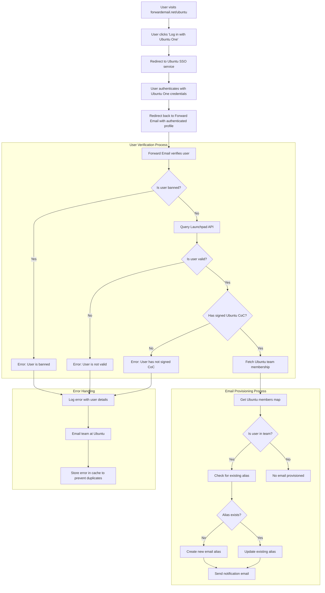

# Fallstudie: Hur Canonical styrker Ubuntus e-posthantering med vidarebefordran av e-posts öppen källkod för företag {#case-study-how-canonical-powers-ubuntu-email-management-with-forward-emails-open-source-enterprise-solution}


## Innehållsförteckning {#table-of-contents}

* [Förord](#foreword)
* [Utmaningen: Att hantera ett komplext e-postekosystem](#the-challenge-managing-a-complex-email-ecosystem)
* [Viktiga slutsatser](#key-takeaways)
* [Varför vidarebefordra e-post](#why-forward-email)
* [Implementeringen: Sömlös SSO-integration](#the-implementation-seamless-sso-integration)
  * [Visualisering av autentiseringsflöde](#authentication-flow-visualization)
  * [Tekniska implementeringsdetaljer](#technical-implementation-details)
* [DNS-konfiguration och e-postrouting](#dns-configuration-and-email-routing)
* [Resultat: Effektiviserad e-posthantering och förbättrad säkerhet](#results-streamlined-email-management-and-enhanced-security)
  * [Operativ effektivitet](#operational-efficiency)
  * [Förbättrad säkerhet och integritet](#enhanced-security-and-privacy)
  * [Kostnadsbesparingar](#cost-savings)
  * [Förbättrad bidragsupplevelse](#improved-contributor-experience)
* [Framåtblick: Fortsatt samarbete](#looking-forward-continued-collaboration)
* [Slutsats: Ett perfekt partnerskap med öppen källkod](#conclusion-a-perfect-open-source-partnership)
* [Stödja företagskunder](#supporting-enterprise-clients)
  * [Kontakta oss](#get-in-touch)
  * [Om vidarebefordran av e-post](#about-forward-email)

## Förord {#foreword}

I världen av öppen källkodsprogramvara är det få namn som har så stor vikt som [Kanonisk](https://en.wikipedia.org/wiki/Canonical_\(company\)), företaget bakom [Ubuntu](https://en.wikipedia.org/wiki/Ubuntu), en av de mest populära Linuxdistributionerna globalt. Med ett stort ekosystem som spänner över flera distributioner, inklusive Ubuntu, [Gratis](https://en.wikipedia.org/wiki/Kubuntu), [Lubuntu](https://en.wikipedia.org/wiki/Lubuntu), [Edubuntu](https://en.wikipedia.org/wiki/Edubuntu) och andra, stod Canonical inför unika utmaningar när det gällde att hantera e-postadresser över sina många domäner. Denna fallstudie utforskar hur Canonical samarbetade med Forward Email för att skapa en sömlös, säker och integritetsfokuserad e-posthanteringslösning för företag som perfekt överensstämmer med deras värderingar inom öppen källkod.

## Utmaningen: Hantera ett komplext e-postekosystem {#the-challenge-managing-a-complex-email-ecosystem}

Canonicals ekosystem är mångsidigt och omfattande. Med miljontals användare världen över och tusentals bidragsgivare i olika projekt, innebar det betydande utmaningar att hantera e-postadresser över flera domäner. Kärnbidragsgivarna behövde officiella e-postadresser (@ubuntu.com, @kubuntu.org, etc.) som återspeglade deras engagemang i projektet samtidigt som säkerhet och användarvänlighet bibehölls genom ett robust Ubuntu-domänhanteringssystem.

Innan Canonical implementerade vidarebefordran av e-post hade de problem med:

* Hantera e-postadresser över flera domäner (@ubuntu.com, @kubuntu.org, @lubuntu.me, @edubuntu.org och @ubuntu.net)
* Erbjuda en konsekvent e-postupplevelse för kärnbidragsgivare
* Integrera e-posttjänster med deras befintliga [Ubuntu One](https://en.wikipedia.org/wiki/Ubuntu_One) Single Sign-On (SSO)-system
* Hitta en lösning som överensstämde med deras engagemang för integritet, säkerhet och öppen källkod för e-postsäkerhet
* Skala upp sin säkra e-postinfrastruktur kostnadseffektivt

## Viktiga slutsatser {#key-takeaways}

* Canonical implementerade framgångsrikt en enhetlig e-posthanteringslösning över flera Ubuntu-domäner
* Vidarebefordra e-posts 100 % öppna källkodsstrategi överensstämde perfekt med Canonicals värderingar
* SSO-integration med Ubuntu One ger sömlös autentisering för bidragsgivare
* Kvantresistent kryptering säkerställer långsiktig säkerhet för all e-postkommunikation
* Lösningen skalas kostnadseffektivt för att stödja Canonicals växande bidragsgivarbas

## Varför vidarebefordra e-post {#why-forward-email}

Som den enda leverantören av e-posttjänster med 100 % öppen källkod och fokus på integritet och säkerhet, var Forward Email en naturlig lösning för Canonicals behov av vidarebefordran av e-post för företag. Våra värderingar stämde perfekt överens med Canonicals engagemang för programvara med öppen källkod och integritet.

Viktiga faktorer som gjorde Forward Email till det ideala valet inkluderade:

1. **Komplett öppen källkodsbas**: Hela vår plattform är öppen källkod och tillgänglig på [GitHub](https://en.wikipedia.org/wiki/GitHub), vilket möjliggör transparens och bidrag från communityn. Till skillnad från många "integritetsfokuserade" e-postleverantörer som bara har öppen källkod för sina frontends men håller sina backends stängda, har vi gjort hela vår kodbas – både frontend och backend – tillgänglig för alla att granska på [GitHub](https://github.com/forwardemail/forwardemail.net).

2. **Integritetsfokuserad strategi**: Till skillnad från andra leverantörer lagrar vi inte e-postmeddelanden i delade databaser, och vi använder robust kryptering med TLS. Vår grundläggande integritetsfilosofi är enkel: **dina e-postmeddelanden tillhör dig och bara dig**. Denna princip vägleder alla tekniska beslut vi fattar, från hur vi hanterar vidarebefordran av e-post till hur vi implementerar kryptering.

3. **Inget beroende av tredje part**: Vi använder inte Amazon SES eller andra tredjepartstjänster, vilket ger oss fullständig kontroll över e-postinfrastrukturen och eliminerar potentiella integritetsläckor genom tredjepartstjänster.

4. **Kostnadseffektiv skalning**: Vår prismodell gör det möjligt för organisationer att skala utan att betala per användare, vilket gör den idealisk för Canonicals stora bidragsgivare.

5. **Kvantresistent kryptering**: Vi använder individuellt krypterade SQLite-postlådor med [ChaCha20-Poly1305](https://en.wikipedia.org/wiki/ChaCha20-Poly1305) som chiffer för [kvantresistent kryptering](/blog/docs/best-quantum-safe-encrypted-email-service). Varje postlåda är en separat krypterad fil, vilket innebär att åtkomst till en användares data inte ger åtkomst till andra.

## Implementeringen: Sömlös SSO-integrering {#the-implementation-seamless-sso-integration}

En av de viktigaste aspekterna av implementeringen var integrationen med Canonicals befintliga Ubuntu One SSO-system. Denna integration skulle göra det möjligt för kärnbidragsgivare att hantera sina @ubuntu.com-e-postadresser med hjälp av sina befintliga Ubuntu One-inloggningsuppgifter.

### Visualisering av autentiseringsflöde {#authentication-flow-visualization}

Följande diagram illustrerar det fullständiga flödet för autentisering och e-postprovisionering:



### Tekniska implementeringsdetaljer {#technical-implementation-details}

Integrationen mellan Forward Email och Ubuntu One SSO genomfördes genom en anpassad implementering av passport-ubuntu-autentiseringsstrategin. Detta möjliggjorde ett sömlöst autentiseringsflöde mellan Ubuntu One och Forward Emails system.

#### Autentiseringsflödet {#the-authentication-flow}

Autentiseringsprocessen fungerar enligt följande:

1. Användare besöker den dedikerade sidan för e-posthantering i Ubuntu på [forwardemail.net/ubuntu](https://forwardemail.net/ubuntu)
2. De klickar på "Logga in med Ubuntu One" och omdirigeras till Ubuntu SSO-tjänsten
3. Efter att ha autentiserat med sina Ubuntu One-uppgifter omdirigeras de tillbaka till Vidarebefordra e-post med sin autentiserade profil
4. Vidarebefordra e-post verifierar deras bidragsstatus och tillhandahåller eller hanterar deras e-postadress i enlighet därmed

Den tekniska implementeringen utnyttjade [`passport-ubuntu`](https://www.npmjs.com/package/passport-ubuntu)-paketet, vilket är en [Pass](https://www.npmjs.com/package/passport)-strategi för autentisering med Ubuntu med hjälp av [OpenID](https://en.wikipedia.org/wiki/OpenID). Konfigurationen inkluderade:

```javascript
passport.use(new UbuntuStrategy({
  returnURL: process.env.UBUNTU_CALLBACK_URL,
  realm: process.env.UBUNTU_REALM,
  stateless: true
}, function(identifier, profile, done) {
  // User verification and email provisioning logic
}));
```

#### Launchpad API-integration och validering {#launchpad-api-integration-and-validation}

En kritisk del av vår implementering är integrationen med [Launchpad](https://en.wikipedia.org/wiki/Launchpad_\(website\))s API för att validera Ubuntu-användare och deras teammedlemskap. Vi skapade återanvändbara hjälpfunktioner för att hantera denna integration effektivt och tillförlitligt.

Hjälpfunktionen `sync-ubuntu-user.js` ansvarar för att validera användare via Launchpad API och hantera deras e-postadresser. Här är en förenklad version av hur det fungerar:

```javascript
async function syncUbuntuUser(user, map) {
  try {
    // Validate user object
    if (!_.isObject(user) ||
        !isSANB(user[fields.ubuntuUsername]) ||
        !isSANB(user[fields.ubuntuProfileID]) ||
        !isEmail(user.email))
      throw new TypeError('Invalid user object');

    // Get Ubuntu members map if not provided
    if (!(map instanceof Map))
      map = await getUbuntuMembersMap(resolver);

    // Check if user is banned
    if (user[config.userFields.isBanned]) {
      throw new InvalidUbuntuUserError('User was banned', { ignoreHook: true });
    }

    // Query Launchpad API to validate user
    const url = `https://api.launchpad.net/1.0/~${user[fields.ubuntuUsername]}`;
    const response = await retryRequest(url, { resolver });
    const json = await response.body.json();

    // Validate required boolean properties
    if (!json.is_valid)
      throw new InvalidUbuntuUserError('Property "is_valid" was false');

    if (!json.is_ubuntu_coc_signer)
      throw new InvalidUbuntuUserError('Property "is_ubuntu_coc_signer" was false');

    // Process each domain for the user
    await pMap([...map.keys()], async (name) => {
      // Find domain in database
      const domain = await Domains.findOne({
        name,
        plan: 'team',
        has_txt_record: true
      }).populate('members.user');

      // Process user's email alias for this domain
      if (map.get(name).has(user[fields.ubuntuUsername])) {
        // User is a member of this team, create or update alias
        let alias = await Aliases.findOne({
          user: user._id,
          domain: domain._id,
          name: user[fields.ubuntuUsername].toLowerCase()
        });

        if (!alias) {
          // Create new alias with appropriate error handling
          alias = await Aliases.create({
            user: user._id,
            domain: domain._id,
            name: user[fields.ubuntuUsername].toLowerCase(),
            recipients: [user.email],
            locale: user[config.lastLocaleField],
            is_enabled: true
          });

          // Notify admins about new alias creation
          await emailHelper({
            template: 'alert',
            message: {
              to: adminEmailsForDomain,
              subject: `New @${domain.name} email address created`
            },
            locals: {
              message: `A new email address ${user[fields.ubuntuUsername].toLowerCase()}@${domain.name} was created for ${user.email}`
            }
          });
        }
      }
    });

    return true;
  } catch (err) {
    // Handle and log errors
    await logErrorWithUser(err, user);
    throw err;
  }
}
```

För att förenkla hanteringen av teammedlemskap över olika Ubuntu-domäner skapade vi en enkel mappning mellan domännamn och deras motsvarande Launchpad-team:

```javascript
ubuntuTeamMapping: {
  'ubuntu.com': '~ubuntumembers',
  'kubuntu.org': '~kubuntu-members',
  'lubuntu.me': '~lubuntu-members',
  'edubuntu.org': '~edubuntu-members',
  'ubuntustudio.com': '~ubuntustudio-core',
  'ubuntu.net': '~ubuntu-smtp-test'
},
```

Denna enkla mappning gör det möjligt för oss att automatisera processen för att kontrollera teammedlemskap och tillhandahålla e-postadresser, vilket gör systemet enkelt att underhålla och utöka allt eftersom nya domäner läggs till.

#### Felhantering och aviseringar {#error-handling-and-notifications}

Vi implementerade ett robust felhanteringssystem som:

1. Loggar alla fel med detaljerad användarinformation
2. Skickar e-post till Ubuntu-teamet när problem upptäcks
3. Meddelar administratörer när nya bidragsgivare registrerar sig och får e-postadresser skapade
4. Hanterar edge-ärenden som användare som inte har undertecknat Ubuntus uppförandekod

Detta säkerställer att eventuella problem snabbt identifieras och åtgärdas, vilket bibehåller e-postsystemets integritet.

## DNS-konfiguration och e-postrouting {#dns-configuration-and-email-routing}

För varje domän som hanteras via Forward Email lade Canonical till en enkel DNS TXT-post för validering:

```sh
❯ dig ubuntu.com txt
ubuntu.com.             600     IN      TXT     "forward-email-site-verification=6IsURgl2t7"
```

Denna verifieringspost bekräftar domänägande och gör det möjligt för vårt system att säkert hantera e-post för dessa domäner. Canonical skickar e-post genom vår tjänst via Postfix, vilket tillhandahåller en pålitlig och säker infrastruktur för e-postleverans.

## Resultat: Effektiviserad e-posthantering och förbättrad säkerhet {#results-streamlined-email-management-and-enhanced-security}

Implementeringen av Forward Emails företagslösning har gett betydande fördelar för Canonicals e-posthantering inom alla deras domäner:

### Driftseffektivitet {#operational-efficiency}

* **Centraliserad hantering**: Alla Ubuntu-relaterade domäner hanteras nu via ett enda gränssnitt
* **Minskad administrativ omkostnad**: Automatiserad provisionering och självbetjäningshantering för bidragsgivare
* **Förenklad onboarding**: Nya bidragsgivare kan snabbt få sina officiella e-postadresser

### Förbättrad säkerhet och integritet {#enhanced-security-and-privacy}

* **End-to-end-kryptering**: Alla e-postmeddelanden krypteras med avancerade standarder
* **Inga delade databaser**: Varje användares e-postmeddelanden lagras i individuella krypterade SQLite-databaser, vilket ger en sandlådebaserad krypteringsmetod som är fundamentalt säkrare än traditionella delade relationsdatabaser
* **Säkerhet med öppen källkod**: Den transparenta kodbasen möjliggör säkerhetsgranskningar i communityt
* **Bearbetning i minnet**: Vi lagrar inte vidarebefordrade e-postmeddelanden på disk, vilket förbättrar integritetsskyddet
* **Ingen metadatalagring**: Vi för inte register över vem som skickar e-post till vem, till skillnad från många e-postleverantörer

### Kostnadsbesparingar {#cost-savings}

* **Skalbar prismodell**: Inga avgifter per användare, vilket gör att Canonical kan lägga till bidragsgivare utan att öka kostnaderna
* **Minskade infrastrukturbehov**: Inget behov av att underhålla separata e-postservrar för olika domäner
* **Lägre supportkrav**: Självbetjäningshantering minskar IT-supportärenden

### Förbättrad bidragsupplevelse {#improved-contributor-experience}

* **Sömlös autentisering**: Enkel inloggning med befintliga Ubuntu One-inloggningsuppgifter
* **Konsekvent varumärkesbyggande**: Enhetlig upplevelse över alla Ubuntu-relaterade tjänster
* **Pålitlig e-postleverans**: Högkvalitativt IP-rykte säkerställer att e-postmeddelanden når sin destination

Integrationen med Forward Email har avsevärt effektiviserat Canonicals e-posthanteringsprocess. Medarbetare har nu en smidig upplevelse med att hantera sina @ubuntu.com-e-postadresser, med minskad administrativ omkostnad och förbättrad säkerhet.

## Framåtblick: Fortsatt samarbete {#looking-forward-continued-collaboration}

Partnerskapet mellan Canonical och Forward Email fortsätter att utvecklas. Vi samarbetar på flera initiativ:

* Utöka e-posttjänster till ytterligare Ubuntu-relaterade domäner
* Förbättra användargränssnittet baserat på feedback från bidragsgivare
* Implementera ytterligare säkerhetsfunktioner
* Utforska nya sätt att utnyttja vårt samarbete med öppen källkod

## Slutsats: Ett perfekt partnerskap med öppen källkod {#conclusion-a-perfect-open-source-partnership}

Samarbetet mellan Canonical och Forward Email visar på kraften i partnerskap som bygger på gemensamma värderingar. Genom att välja Forward Email som sin e-postleverantör fann Canonical en lösning som inte bara uppfyllde deras tekniska krav utan också passade perfekt ihop med deras engagemang för öppen källkodsprogramvara, integritet och säkerhet.

För organisationer som hanterar flera domäner och kräver sömlös autentisering med befintliga system erbjuder Forward Email en flexibel, säker och integritetsfokuserad lösning. Vår [öppen källkodsmetod](https://forwardemail.net/blog/docs/why-open-source-email-security-privacy) säkerställer transparens och möjliggör bidrag från communityn, vilket gör den till ett idealiskt val för organisationer som värdesätter dessa principer.

I takt med att både Canonical och Forward Email fortsätter att förnya sig inom sina respektive områden, står detta partnerskap som ett bevis på kraften i samarbete med öppen källkod och gemensamma värderingar för att skapa effektiva lösningar.

Du kan kontrollera vår [realtidstjänststatus](https://status.forwardemail.net) för att se vår nuvarande e-postleveransprestanda, som vi övervakar kontinuerligt för att säkerställa högkvalitativt IP-rykte och e-postleverans.

## Stödjer företagskunder {#supporting-enterprise-clients}

Även om denna fallstudie fokuserar på vårt partnerskap med Canonical, stöder Forward Email stolt ett flertal företagskunder inom olika branscher som värdesätter vårt engagemang för integritet, säkerhet och öppen källkod.

Våra företagslösningar är skräddarsydda för att möta de specifika behoven hos organisationer av alla storlekar och erbjuder:

* Anpassad domän [e-posthantering](/) över flera domäner
* Sömlös integration med befintliga autentiseringssystem
* Dedikerad Matrix-chattsupportkanal
* Förbättrade säkerhetsfunktioner inklusive [kvantresistent kryptering](/blog/docs/best-quantum-safe-encrypted-email-service)
* Fullständig dataportabilitet och äganderätt
* 100 % öppen källkodsinfrastruktur för transparens och förtroende

### Kontakta oss {#get-in-touch}

Om din organisation har behov av e-post för företag eller om du är intresserad av att lära dig mer om hur Vidarebefordra e-post kan hjälpa dig att effektivisera din e-posthantering samtidigt som du förbättrar integritet och säkerhet, vill vi gärna höra från dig:

* Maila oss direkt på `support@forwardemail.net`
* Skicka in en hjälpförfrågan på vår [hjälpsida](https://forwardemail.net/help)
* Kolla vår [prissida](https://forwardemail.net/pricing) för företagsabonnemang

Vårt team är redo att diskutera era specifika krav och utveckla en skräddarsydd lösning som överensstämmer med er organisations värderingar och tekniska behov.

### Om vidarebefordran av e-post {#about-forward-email}

Vidarebefordra e-post är en e-posttjänst med 100 % öppen källkod och integritetsfokus. Vi tillhandahåller vidarebefordran av e-post via domänanpassad e-post, SMTP, IMAP och POP3 med fokus på säkerhet, integritet och transparens. Hela vår kodbas finns tillgänglig på [GitHub](https://github.com/forwardemail/forwardemail.net), och vi är engagerade i att tillhandahålla e-posttjänster som respekterar användarnas integritet och säkerhet. Läs mer om [varför öppen källkod för e-post är framtiden](https://forwardemail.net/blog/docs/why-open-source-email-security-privacy), [hur vår vidarebefordran av e-post fungerar](https://forwardemail.net/blog/docs/best-email-forwarding-service) och [vår strategi för skydd av e-postsekretess](https://forwardemail.net/blog/docs/email-privacy-protection-technical-implementation).