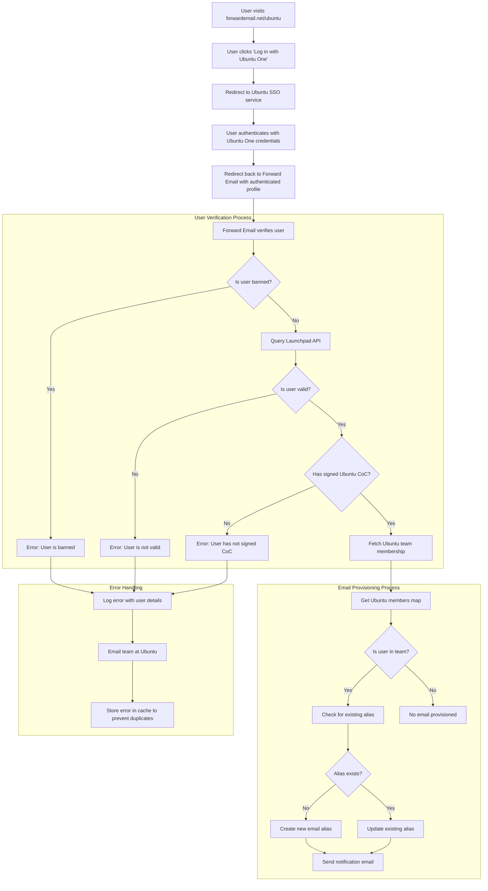

# Fallstudie: Hur Canonical driver Ubuntu e-posthantering med Forward Emails open-source företagslösning {#case-study-how-canonical-powers-ubuntu-email-management-with-forward-emails-open-source-enterprise-solution}


## Innehållsförteckning {#table-of-contents}

* [Förord](#foreword)
* [Utmaningen: Hantera ett komplext e-post-ekosystem](#the-challenge-managing-a-complex-email-ecosystem)
* [Viktiga insikter](#key-takeaways)
* [Varför Forward Email](#why-forward-email)
* [Implementeringen: Sömlös SSO-integration](#the-implementation-seamless-sso-integration)
  * [Visualisering av autentiseringsflöde](#authentication-flow-visualization)
  * [Tekniska implementeringsdetaljer](#technical-implementation-details)
* [DNS-konfiguration och e-postdirigering](#dns-configuration-and-email-routing)
* [Resultat: Effektiviserad e-posthantering och förbättrad säkerhet](#results-streamlined-email-management-and-enhanced-security)
  * [Operativ effektivitet](#operational-efficiency)
  * [Förbättrad säkerhet och integritet](#enhanced-security-and-privacy)
  * [Kostnadsbesparingar](#cost-savings)
  * [Förbättrad bidragsgivares upplevelse](#improved-contributor-experience)
* [Framåtblick: Fortsatt samarbete](#looking-forward-continued-collaboration)
* [Slutsats: Ett perfekt open-source partnerskap](#conclusion-a-perfect-open-source-partnership)
* [Stöd för företagskunder](#supporting-enterprise-clients)
  * [Kontakta oss](#get-in-touch)
  * [Om Forward Email](#about-forward-email)


## Förord {#foreword}

I open-source-världen finns få namn som väger lika tungt som [Canonical](https://en.wikipedia.org/wiki/Canonical_\(company\)), företaget bakom [Ubuntu](https://en.wikipedia.org/wiki/Ubuntu), en av de mest populära Linux-distributionerna globalt. Med ett omfattande ekosystem som sträcker sig över flera distributioner inklusive Ubuntu, [Kubuntu](https://en.wikipedia.org/wiki/Kubuntu), [Lubuntu](https://en.wikipedia.org/wiki/Lubuntu), [Edubuntu](https://en.wikipedia.org/wiki/Edubuntu) och andra, stod Canonical inför unika utmaningar när det gällde att hantera e-postadresser över deras många domäner. Denna fallstudie utforskar hur Canonical samarbetade med Forward Email för att skapa en sömlös, säker och integritetsfokuserad företagslösning för e-posthantering som passar perfekt med deras open-source-värderingar.


## Utmaningen: Hantera ett komplext e-post-ekosystem {#the-challenge-managing-a-complex-email-ecosystem}

Canonicals ekosystem är mångfacetterat och omfattande. Med miljontals användare världen över och tusentals bidragsgivare över olika projekt, innebar hanteringen av e-postadresser över flera domäner betydande utmaningar. Kärnbidragsgivare behövde officiella e-postadresser (@ubuntu.com, @kubuntu.org, etc.) som speglade deras engagemang i projektet samtidigt som säkerhet och användarvänlighet upprätthölls genom ett robust Ubuntu-domänhanteringssystem.

Innan Forward Email implementerades kämpade Canonical med:

* Hantering av e-postadresser över flera domäner (@ubuntu.com, @kubuntu.org, @lubuntu.me, @edubuntu.org och @ubuntu.net)
* Att erbjuda en konsekvent e-postupplevelse för kärnbidragsgivare
* Att integrera e-posttjänster med deras befintliga [Ubuntu One](https://en.wikipedia.org/wiki/Ubuntu_One) Single Sign-On (SSO) system
* Att hitta en lösning som stämde överens med deras engagemang för integritet, säkerhet och open-source e-postsäkerhet
* Att skala upp deras säkra e-postinfrastruktur på ett kostnadseffektivt sätt


## Viktiga insikter {#key-takeaways}

* Canonical implementerade framgångsrikt en enhetlig e-posthanteringslösning över flera Ubuntu-domäner
* Forward Emails 100% open-source-ansats stämde perfekt överens med Canonicals värderingar
* SSO-integration med Ubuntu One ger sömlös autentisering för bidragsgivare
* Kvantresistent kryptering säkerställer långsiktig säkerhet för all e-postkommunikation
* Lösningen skalar kostnadseffektivt för att stödja Canonicals växande bidragsgivarbas


## Varför Forward Email {#why-forward-email}
Som den enda 100 % open-source e-postleverantören med fokus på integritet och säkerhet var Forward Email ett naturligt val för Canonicals företagsbehov av e-postvidarebefordran. Våra värderingar stämde perfekt överens med Canonicals engagemang för open-source mjukvara och integritet.

Viktiga faktorer som gjorde Forward Email till det idealiska valet inkluderade:

1. **Fullständig open-source kodbas**: Hela vår plattform är open-source och tillgänglig på [GitHub](https://en.wikipedia.org/wiki/GitHub), vilket möjliggör transparens och bidrag från communityn. Till skillnad från många "integritetsfokuserade" e-postleverantörer som endast open-sourcar sina frontend medan deras backend är stängd, har vi gjort hela vår kodbas—både frontend och backend—tillgänglig för alla att granska på [GitHub](https://github.com/forwardemail/forwardemail.net).

2. **Integritetsfokuserad strategi**: Till skillnad från andra leverantörer lagrar vi inte e-post i delade databaser, och vi använder robust kryptering med TLS. Vår grundläggande integritetsfilosofi är enkel: **dina e-postmeddelanden tillhör dig och bara dig**. Denna princip styr varje tekniskt beslut vi tar, från hur vi hanterar e-postvidarebefordran till hur vi implementerar kryptering.

3. **Ingen beroende av tredje part**: Vi använder inte Amazon SES eller andra tredjepartstjänster, vilket ger oss full kontroll över e-postinfrastrukturen och eliminerar potentiella integritetsläckor via tredjepartstjänster.

4. **Kostnadseffektiv skalning**: Vår prismodell tillåter organisationer att skala utan att betala per användare, vilket gör den idealisk för Canonicals stora bidragsgivarbassäng.

5. **Kvantresistent kryptering**: Vi använder individuellt krypterade SQLite-postlådor med [ChaCha20-Poly1305](https://en.wikipedia.org/wiki/ChaCha20-Poly1305) som chiffer för [kvantresistent kryptering](/blog/docs/best-quantum-safe-encrypted-email-service). Varje postlåda är en separat krypterad fil, vilket innebär att åtkomst till en användares data inte ger åtkomst till andra.


## Implementeringen: Sömlös SSO-integration {#the-implementation-seamless-sso-integration}

En av de mest kritiska aspekterna av implementeringen var integrationen med Canonicals befintliga Ubuntu One SSO-system. Denna integration skulle tillåta kärnbidragsgivare att hantera sina @ubuntu.com e-postadresser med sina befintliga Ubuntu One-inloggningsuppgifter.

### Visualisering av autentiseringsflödet {#authentication-flow-visualization}

Följande diagram illustrerar det kompletta autentiserings- och e-postprovisioneringsflödet:


```mermaid
flowchart TD
    A[User visits forwardemail.net/ubuntu] --> B[User clicks 'Log in with Ubuntu One']
    B --> C[Redirect to Ubuntu SSO service]
    C --> D[User authenticates with Ubuntu One credentials]
    D --> E[Redirect back to Forward Email with authenticated profile]
    E --> F[Forward Email verifies user]

    subgraph "User Verification Process"
        F --> G{Is user banned?}
        G -->|Yes| H[Error: User is banned]
        G -->|No| I[Query Launchpad API]
        I --> J{Is user valid?}
        J -->|No| K[Error: User is not valid]
        J -->|Yes| L{Has signed Ubuntu CoC?}
        L -->|No| M[Error: User has not signed CoC]
        L -->|Yes| N[Fetch Ubuntu team membership]
    end

    subgraph "Email Provisioning Process"
        N --> O[Get Ubuntu members map]
        O --> P{Is user in team?}
        P -->|Yes| Q[Check for existing alias]
        Q --> R{Alias exists?}
        R -->|No| S[Create new email alias]
        R -->|Yes| T[Update existing alias]
        S --> U[Send notification email]
        T --> U
        P -->|No| V[No email provisioned]
    end

    subgraph "Error Handling"
        H --> W[Log error with user details]
        K --> W
        M --> W
        W --> X[Email team at Ubuntu]
        X --> Y[Store error in cache to prevent duplicates]
    end
```

### Tekniska implementeringsdetaljer {#technical-implementation-details}

Integrationen mellan Forward Email och Ubuntu One SSO genomfördes via en anpassad implementation av autentiseringsstrategin passport-ubuntu. Detta möjliggjorde ett sömlöst autentiseringsflöde mellan Ubuntu One och Forward Emails system.
#### Autentiseringsflödet {#the-authentication-flow}

Autentiseringsprocessen fungerar enligt följande:

1. Användare besöker den dedikerade Ubuntu-sidan för e-posthantering på [forwardemail.net/ubuntu](https://forwardemail.net/ubuntu)
2. De klickar på "Logga in med Ubuntu One" och omdirigeras till Ubuntu SSO-tjänsten
3. Efter att ha autentiserat sig med sina Ubuntu One-uppgifter omdirigeras de tillbaka till Forward Email med sin autentiserade profil
4. Forward Email verifierar deras bidragsgivarstatus och tilldelar eller hanterar deras e-postadress därefter

Den tekniska implementeringen använde paketet [`passport-ubuntu`](https://www.npmjs.com/package/passport-ubuntu), som är en [Passport](https://www.npmjs.com/package/passport)-strategi för autentisering med Ubuntu via [OpenID](https://en.wikipedia.org/wiki/OpenID). Konfigurationen inkluderade:

```javascript
passport.use(new UbuntuStrategy({
  returnURL: process.env.UBUNTU_CALLBACK_URL,
  realm: process.env.UBUNTU_REALM,
  stateless: true
}, function(identifier, profile, done) {
  // Användarverifiering och logik för e-posttilldelning
}));
```

#### Launchpad API-integration och validering {#launchpad-api-integration-and-validation}

En kritisk komponent i vår implementation är integrationen med [Launchpad](https://en.wikipedia.org/wiki/Launchpad_\(website\))'s API för att validera Ubuntu-användare och deras teammedlemskap. Vi skapade återanvändbara hjälpfunktioner för att hantera denna integration effektivt och pålitligt.

Hjälpfunktionen `sync-ubuntu-user.js` ansvarar för att validera användare via Launchpad API och hantera deras e-postadresser. Här är en förenklad version av hur den fungerar:

```javascript
async function syncUbuntuUser(user, map) {
  try {
    // Validera användarobjekt
    if (!_.isObject(user) ||
        !isSANB(user[fields.ubuntuUsername]) ||
        !isSANB(user[fields.ubuntuProfileID]) ||
        !isEmail(user.email))
      throw new TypeError('Ogiltigt användarobjekt');

    // Hämta Ubuntu-medlemskarta om den inte tillhandahålls
    if (!(map instanceof Map))
      map = await getUbuntuMembersMap(resolver);

    // Kontrollera om användaren är avstängd
    if (user[config.userFields.isBanned]) {
      throw new InvalidUbuntuUserError('Användaren var avstängd', { ignoreHook: true });
    }

    // Anropa Launchpad API för att validera användaren
    const url = `https://api.launchpad.net/1.0/~${user[fields.ubuntuUsername]}`;
    const response = await retryRequest(url, { resolver });
    const json = await response.body.json();

    // Validera obligatoriska boolean-egenskaper
    if (!json.is_valid)
      throw new InvalidUbuntuUserError('Egenskapen "is_valid" var falsk');

    if (!json.is_ubuntu_coc_signer)
      throw new InvalidUbuntuUserError('Egenskapen "is_ubuntu_coc_signer" var falsk');

    // Bearbeta varje domän för användaren
    await pMap([...map.keys()], async (name) => {
      // Hitta domän i databasen
      const domain = await Domains.findOne({
        name,
        plan: 'team',
        has_txt_record: true
      }).populate('members.user');

      // Hantera användarens e-postalias för denna domän
      if (map.get(name).has(user[fields.ubuntuUsername])) {
        // Användaren är medlem i detta team, skapa eller uppdatera alias
        let alias = await Aliases.findOne({
          user: user._id,
          domain: domain._id,
          name: user[fields.ubuntuUsername].toLowerCase()
        });

        if (!alias) {
          // Skapa nytt alias med lämplig felhantering
          alias = await Aliases.create({
            user: user._id,
            domain: domain._id,
            name: user[fields.ubuntuUsername].toLowerCase(),
            recipients: [user.email],
            locale: user[config.lastLocaleField],
            is_enabled: true
          });

          // Informera administratörer om nytt alias
          await emailHelper({
            template: 'alert',
            message: {
              to: adminEmailsForDomain,
              subject: `Ny @${domain.name} e-postadress skapad`
            },
            locals: {
              message: `En ny e-postadress ${user[fields.ubuntuUsername].toLowerCase()}@${domain.name} skapades för ${user.email}`
            }
          });
        }
      }
    });

    return true;
  } catch (err) {
    // Hantera och logga fel
    await logErrorWithUser(err, user);
    throw err;
  }
}
```
För att förenkla hanteringen av teammedlemskap över olika Ubuntu-domäner skapade vi en enkel koppling mellan domännamn och deras motsvarande Launchpad-team:

```javascript
ubuntuTeamMapping: {
  'ubuntu.com': '~ubuntumembers',
  'kubuntu.org': '~kubuntu-members',
  'lubuntu.me': '~lubuntu-members',
  'edubuntu.org': '~edubuntu-members',
  'ubuntustudio.com': '~ubuntustudio-core',
  'ubuntu.net': '~ubuntu-smtp-test'
},
```

Denna enkla koppling gör det möjligt för oss att automatisera processen för att kontrollera teammedlemskap och tilldela e-postadresser, vilket gör systemet lätt att underhålla och utöka när nya domäner läggs till.

#### Felhantering och aviseringar {#error-handling-and-notifications}

Vi implementerade ett robust felhanteringssystem som:

1. Loggar alla fel med detaljerad användarinformation
2. Skickar e-post till Ubuntu-teamet när problem upptäcks
3. Meddelar administratörer när nya bidragsgivare registrerar sig och får e-postadresser skapade
4. Hanterar specialfall som användare som inte har undertecknat Ubuntus uppförandekod

Detta säkerställer att eventuella problem snabbt identifieras och åtgärdas, vilket upprätthåller integriteten i e-postsystemet.


## DNS-konfiguration och e-postdirigering {#dns-configuration-and-email-routing}

För varje domän som hanteras via Forward Email lade Canonical till en enkel DNS TXT-post för validering:

```sh
❯ dig ubuntu.com txt
ubuntu.com.             600     IN      TXT     "forward-email-site-verification=6IsURgl2t7"
```

Denna verifieringspost bekräftar domänägarskap och gör det möjligt för vårt system att säkert hantera e-post för dessa domäner. Canonical dirigerar e-post via vår tjänst med Postfix, som tillhandahåller en pålitlig och säker e-postleveransinfrastruktur.


## Resultat: Effektiviserad e-posthantering och förbättrad säkerhet {#results-streamlined-email-management-and-enhanced-security}

Implementeringen av Forward Emails företagslösning har gett betydande fördelar för Canonicals e-posthantering över alla deras domäner:

### Operativ effektivitet {#operational-efficiency}

* **Centraliserad hantering**: Alla Ubuntu-relaterade domäner hanteras nu via ett enda gränssnitt
* **Minskad administrativ börda**: Automatiserad tilldelning och självbetjäning för bidragsgivare
* **Förenklad introduktion**: Nya bidragsgivare kan snabbt få sina officiella e-postadresser

### Förbättrad säkerhet och integritet {#enhanced-security-and-privacy}

* **End-to-end-kryptering**: All e-post är krypterad med avancerade standarder
* **Inga delade databaser**: Varje användares e-post lagras i individuella krypterade SQLite-databaser, vilket ger en sandboxad krypteringsmetod som är fundamentalt säkrare än traditionella delade relationsdatabaser
* **Öppen källkodssäkerhet**: Den transparenta kodbasen möjliggör säkerhetsgranskningar av communityn
* **Bearbetning i minnet**: Vi lagrar inte vidarebefordrad e-post på disk, vilket förbättrar integritetsskyddet
* **Ingen metadata lagring**: Vi sparar inga register över vem som e-postar vem, till skillnad från många e-postleverantörer

### Kostnadsbesparingar {#cost-savings}

* **Skalbar prismodell**: Inga avgifter per användare, vilket gör att Canonical kan lägga till bidragsgivare utan ökade kostnader
* **Minskade infrastrukturbehov**: Ingen behov av att underhålla separata e-postservrar för olika domäner
* **Lägre supportbehov**: Självbetjäning minskar IT-supportärenden

### Förbättrad bidragsgivarupplevelse {#improved-contributor-experience}

* **Sömlös autentisering**: Single sign-on med befintliga Ubuntu One-uppgifter
* **Konsekvent varumärke**: Enhetlig upplevelse över alla Ubuntu-relaterade tjänster
* **Pålitlig e-postleverans**: Högkvalitativ IP-reputation säkerställer att e-post når sin destination

Integrationen med Forward Email har avsevärt effektiviserat Canonicals e-posthanteringsprocess. Bidragsgivare har nu en sömlös upplevelse när de hanterar sina @ubuntu.com-e-postadresser, med minskad administrativ börda och förbättrad säkerhet.


## Framåtblick: Fortsatt samarbete {#looking-forward-continued-collaboration}

Partnerskapet mellan Canonical och Forward Email fortsätter att utvecklas. Vi arbetar tillsammans med flera initiativ:
* Utöka e-posttjänster till ytterligare Ubuntu-relaterade domäner
* Förbättra användargränssnittet baserat på bidragsgivares feedback
* Implementera ytterligare säkerhetsfunktioner
* Utforska nya sätt att utnyttja vårt open-source-samarbete


## Slutsats: Ett perfekt open-source-partnerskap {#conclusion-a-perfect-open-source-partnership}

Samarbetet mellan Canonical och Forward Email visar styrkan i partnerskap byggda på gemensamma värderingar. Genom att välja Forward Email som sin e-postleverantör fann Canonical en lösning som inte bara uppfyllde deras tekniska krav utan också stämde perfekt överens med deras engagemang för öppen källkod, integritet och säkerhet.

För organisationer som hanterar flera domäner och kräver sömlös autentisering med befintliga system erbjuder Forward Email en flexibel, säker och integritetsfokuserad lösning. Vår [open-source-ansats](https://forwardemail.net/blog/docs/why-open-source-email-security-privacy) säkerställer transparens och möjliggör bidrag från communityn, vilket gör det till ett idealiskt val för organisationer som värdesätter dessa principer.

När både Canonical och Forward Email fortsätter att förnya sig inom sina respektive områden står detta partnerskap som ett bevis på styrkan i open-source-samarbete och gemensamma värderingar för att skapa effektiva lösningar.

Du kan kolla vår [tjänststatus i realtid](https://status.forwardemail.net) för att se vår aktuella e-postleveransprestanda, som vi kontinuerligt övervakar för att säkerställa högkvalitativ IP-reputation och e-postleverans.


## Stöd till företagskunder {#supporting-enterprise-clients}

Även om denna fallstudie fokuserar på vårt partnerskap med Canonical, stödjer Forward Email stolt många företagskunder inom olika branscher som värdesätter vårt engagemang för integritet, säkerhet och open-source-principer.

Våra företagslösningar är anpassade för att möta specifika behov hos organisationer i alla storlekar och erbjuder:

* Anpassad domän [e-posthantering](/) över flera domäner
* Sömlös integration med befintliga autentiseringssystem
* Dedikerad Matrix-chatt supportkanal
* Förbättrade säkerhetsfunktioner inklusive [kvantresistent kryptering](/blog/docs/best-quantum-safe-encrypted-email-service)
* Fullständig dataportabilitet och ägandeskap
* 100% open-source-infrastruktur för transparens och förtroende

### Kontakta oss {#get-in-touch}

Om din organisation har företagsbehov för e-post eller om du är intresserad av att lära dig mer om hur Forward Email kan hjälpa till att effektivisera din e-posthantering samtidigt som integritet och säkerhet förbättras, vill vi gärna höra från dig:

* Mejla oss direkt på `support@forwardemail.net`
* Skicka en hjälpförfrågan på vår [hjälpsida](https://forwardemail.net/help)
* Kolla vår [prissida](https://forwardemail.net/pricing) för företagsplaner

Vårt team är redo att diskutera dina specifika krav och utveckla en skräddarsydd lösning som stämmer överens med din organisations värderingar och tekniska behov.

### Om Forward Email {#about-forward-email}

Forward Email är en 100% open-source och integritetsfokuserad e-posttjänst. Vi erbjuder e-post vidarebefordran för anpassade domäner, SMTP, IMAP och POP3-tjänster med fokus på säkerhet, integritet och transparens. Vår hela kodbas finns tillgänglig på [GitHub](https://github.com/forwardemail/forwardemail.net), och vi är engagerade i att tillhandahålla e-posttjänster som respekterar användarens integritet och säkerhet. Läs mer om [varför open-source e-post är framtiden](https://forwardemail.net/blog/docs/why-open-source-email-security-privacy), [hur vår e-post vidarebefordran fungerar](https://forwardemail.net/blog/docs/best-email-forwarding-service) och [vår ansats till e-postintegritetsskydd](https://forwardemail.net/blog/docs/email-privacy-protection-technical-implementation).
