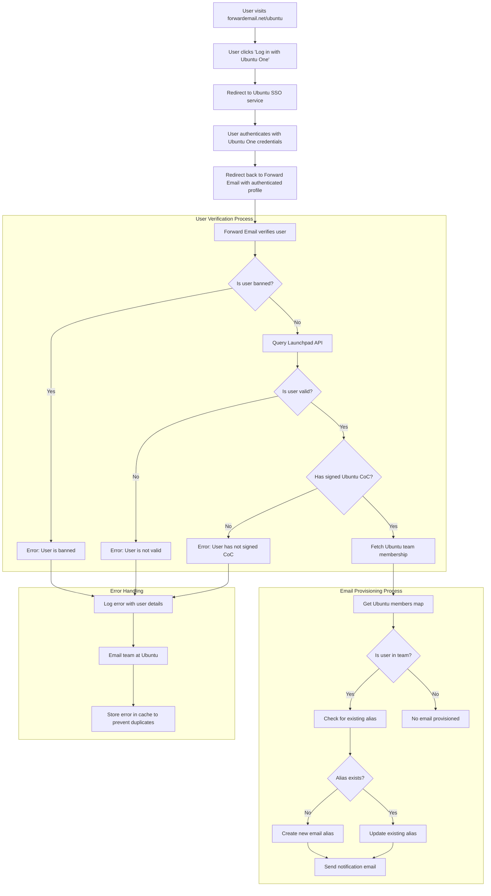

# กรณีศึกษา: Canonical ขับเคลื่อนการจัดการอีเมล Ubuntu ด้วยโซลูชันองค์กรโอเพ่นซอร์สของ Forward Email อย่างไร {#case-study-how-canonical-powers-ubuntu-email-management-with-forward-emails-open-source-enterprise-solution}


## สารบัญ {#table-of-contents}

* [คำนำ](#foreword)
* [ความท้าทาย: การจัดการระบบนิเวศอีเมลที่ซับซ้อน](#the-challenge-managing-a-complex-email-ecosystem)
* [ประเด็นสำคัญ](#key-takeaways)
* [เหตุใดจึงต้องส่งต่ออีเมล](#why-forward-email)
* [การใช้งาน: การรวม SSO แบบไร้รอยต่อ](#the-implementation-seamless-sso-integration)
  * [การแสดงภาพการไหลของการตรวจสอบสิทธิ์](#authentication-flow-visualization)
  * [รายละเอียดการใช้งานทางเทคนิค](#technical-implementation-details)
* [การกำหนดค่า DNS และการกำหนดเส้นทางอีเมล](#dns-configuration-and-email-routing)
* [ผลลัพธ์: การจัดการอีเมลที่ปรับปรุงใหม่และการรักษาความปลอดภัยที่ได้รับการปรับปรุง](#results-streamlined-email-management-and-enhanced-security)
  * [ประสิทธิภาพการดำเนินงาน](#operational-efficiency)
  * [ความปลอดภัยและความเป็นส่วนตัวที่ได้รับการปรับปรุง](#enhanced-security-and-privacy)
  * [การประหยัดต้นทุน](#cost-savings)
  * [ประสบการณ์ผู้สนับสนุนที่ได้รับการปรับปรุง](#improved-contributor-experience)
* [มองไปข้างหน้า: ความร่วมมืออย่างต่อเนื่อง](#looking-forward-continued-collaboration)
* [บทสรุป: ความร่วมมือแบบโอเพ่นซอร์สที่สมบูรณ์แบบ](#conclusion-a-perfect-open-source-partnership)
* [การสนับสนุนลูกค้าองค์กร](#supporting-enterprise-clients)
  * [ติดต่อเรา](#get-in-touch)
  * [เกี่ยวกับการส่งต่ออีเมล](#about-forward-email)

## คำนำ {#foreword}

ในโลกของซอฟต์แวร์โอเพนซอร์ส มีเพียงไม่กี่ชื่อเท่านั้นที่มีอิทธิพลมากเท่ากับ [แคนนอนิคัล](https://en.wikipedia.org/wiki/Canonical_\(company\) (บริษัทที่อยู่เบื้องหลัง [อูบุนตู](https://en.wikipedia.org/wiki/Ubuntu)) หนึ่งในดิสทริบิวชัน Linux ที่ได้รับความนิยมสูงสุดทั่วโลก ด้วยระบบนิเวศอันกว้างใหญ่ที่ครอบคลุมดิสทริบิวชันที่หลากหลาย รวมถึง Ubuntu, [ฟรี](https://en.wikipedia.org/wiki/Kubuntu), [ลูบันตู](https://en.wikipedia.org/wiki/Lubuntu), [เอดูบันตู](https://en.wikipedia.org/wiki/Edubuntu) และอื่นๆ Canonical จึงต้องเผชิญกับความท้าทายที่ไม่เหมือนใครในการจัดการที่อยู่อีเมลในโดเมนต่างๆ มากมาย กรณีศึกษานี้จะศึกษาว่า Canonical ได้ร่วมมือกับ Forward Email อย่างไร เพื่อสร้างโซลูชันการจัดการอีเมลระดับองค์กรที่ราบรื่น ปลอดภัย และเน้นความเป็นส่วนตัว ซึ่งสอดคล้องกับค่านิยมโอเพนซอร์สของพวกเขาอย่างสมบูรณ์แบบ

## ความท้าทาย: การจัดการระบบนิเวศอีเมลที่ซับซ้อน {#the-challenge-managing-a-complex-email-ecosystem}

ระบบนิเวศของ Canonical มีความหลากหลายและกว้างขวาง ด้วยจำนวนผู้ใช้หลายล้านคนทั่วโลกและผู้ร่วมพัฒนาหลายพันคนในหลากหลายโครงการ การจัดการที่อยู่อีเมลในหลายโดเมนจึงนำมาซึ่งความท้าทายที่สำคัญ ผู้ร่วมพัฒนาหลักต้องการที่อยู่อีเมลอย่างเป็นทางการ (@ubuntu.com, @kubuntu.org ฯลฯ) ที่สะท้อนถึงการมีส่วนร่วมในโครงการ ขณะเดียวกันก็รักษาความปลอดภัยและใช้งานง่ายผ่านระบบการจัดการโดเมน Ubuntu ที่แข็งแกร่ง

ก่อนที่จะนำ Forward Email มาใช้ Canonical ประสบปัญหาดังต่อไปนี้:

* การจัดการที่อยู่อีเมลในหลายโดเมน (@ubuntu.com, @kubuntu.org, @lubuntu.me, @edubuntu.org และ @ubuntu.net)
* มอบประสบการณ์การใช้งานอีเมลที่สอดคล้องกันสำหรับผู้ให้บริการหลัก
* การผสานรวมบริการอีเมลเข้ากับระบบการลงชื่อเข้าใช้ครั้งเดียว (SSO) [อูบุนตู วัน](https://en.wikipedia.org/wiki/Ubuntu_One) ที่มีอยู่
* การค้นหาโซลูชันที่สอดคล้องกับความมุ่งมั่นด้านความเป็นส่วนตัว ความปลอดภัย และความปลอดภัยของอีเมลแบบโอเพนซอร์ส
* การปรับขนาดโครงสร้างพื้นฐานอีเมลที่ปลอดภัยอย่างคุ้มค่า

## สิ่งสำคัญที่ต้องจำ {#key-takeaways}

* Canonical ประสบความสำเร็จในการนำโซลูชันการจัดการอีเมลแบบรวมศูนย์ไปใช้ในหลายโดเมนของ Ubuntu
* แนวทางโอเพนซอร์ส 100% ของ Forward Email สอดคล้องกับค่านิยมของ Canonical อย่างสมบูรณ์แบบ
* การผสานรวม SSO กับ Ubuntu One ช่วยให้การยืนยันตัวตนเป็นไปอย่างราบรื่นสำหรับผู้ร่วมให้ข้อมูล
* การเข้ารหัสแบบ Quantum-resistant ช่วยให้มั่นใจได้ถึงความปลอดภัยในระยะยาวสำหรับการสื่อสารทางอีเมลทั้งหมด
* โซลูชันนี้ปรับขนาดได้อย่างคุ้มค่าเพื่อรองรับฐานผู้ร่วมให้ข้อมูลที่กำลังเติบโตของ Canonical

## เหตุใดจึงส่งต่ออีเมล {#why-forward-email}

ในฐานะผู้ให้บริการอีเมลโอเพนซอร์ส 100% รายเดียวที่มุ่งเน้นความเป็นส่วนตัวและความปลอดภัย Forward Email จึงเหมาะสมกับความต้องการในการส่งต่ออีเมลระดับองค์กรของ Canonical ค่านิยมของเราสอดคล้องอย่างสมบูรณ์แบบกับความมุ่งมั่นของ Canonical ที่มีต่อซอฟต์แวร์โอเพนซอร์สและความเป็นส่วนตัว

ปัจจัยสำคัญที่ทำให้ Forward Email เป็นตัวเลือกที่เหมาะสม ได้แก่:

1. **ฐานโค้ดโอเพนซอร์สแบบสมบูรณ์**: แพลตฟอร์มทั้งหมดของเราเป็นโอเพนซอร์สและพร้อมใช้งานบน [GitHub](https://en.wikipedia.org/wiki/GitHub) ซึ่งช่วยให้เกิดความโปร่งใสและการมีส่วนร่วมของชุมชน แตกต่างจากผู้ให้บริการอีเมล "ที่เน้นความเป็นส่วนตัว" จำนวนมากที่โอเพนซอร์สเฉพาะส่วนหน้า (frontend) ของตนเองโดยปิดส่วนหลัง (backend) ไว้ เราได้ทำให้ฐานโค้ดทั้งหมดของเรา ทั้งส่วนหน้าและส่วนหลัง (backend) เปิดให้ทุกคนตรวจสอบได้ที่ [GitHub](https://github.com/forwardemail/forwardemail.net)

2. **แนวทางที่เน้นความเป็นส่วนตัว**: แตกต่างจากผู้ให้บริการรายอื่น เราไม่จัดเก็บอีเมลในฐานข้อมูลที่ใช้ร่วมกัน และเราใช้การเข้ารหัสที่แข็งแกร่งด้วย TLS ปรัชญาความเป็นส่วนตัวพื้นฐานของเรานั้นเรียบง่าย: **อีเมลของคุณเป็นของคุณและคุณเท่านั้น** หลักการนี้เป็นแนวทางในการตัดสินใจทางเทคนิคทุกอย่างของเรา ตั้งแต่วิธีการจัดการการส่งต่ออีเมลไปจนถึงวิธีการนำการเข้ารหัสไปใช้

3. **ไม่ต้องพึ่งพาบุคคลที่สาม**: เราไม่ใช้ Amazon SES หรือบริการของบุคคลที่สามอื่นๆ ทำให้เราควบคุมโครงสร้างพื้นฐานอีเมลได้อย่างสมบูรณ์และขจัดการรั่วไหลของความเป็นส่วนตัวที่อาจเกิดขึ้นผ่านบริการของบุคคลที่สาม

4. **การปรับขนาดที่คุ้มต้นทุน**: รูปแบบการกำหนดราคาของเราช่วยให้องค์กรปรับขนาดได้โดยไม่ต้องจ่ายเงินต่อผู้ใช้ ทำให้เหมาะอย่างยิ่งสำหรับฐานผู้สนับสนุนขนาดใหญ่ของ Canonical

5. **การเข้ารหัสแบบ Quantum-resistant**: เราใช้กล่องจดหมาย SQLite ที่เข้ารหัสแยกกัน โดยใช้ [ชาชา20-โพลี1305](https://en.wikipedia.org/wiki/ChaCha20-Poly1305) เป็นรหัสสำหรับ [การเข้ารหัสที่ทนทานต่อควอนตัม](/blog/docs/best-quantum-safe-encrypted-email-service) กล่องจดหมายแต่ละกล่องเป็นไฟล์เข้ารหัสแยกกัน ซึ่งหมายความว่าการเข้าถึงข้อมูลของผู้ใช้รายหนึ่งจะไม่เป็นการให้สิทธิ์แก่ผู้อื่น

## การใช้งาน: การรวม SSO แบบไร้รอยต่อ {#the-implementation-seamless-sso-integration}

หนึ่งในแง่มุมที่สำคัญที่สุดของการใช้งานคือการผสานรวมกับระบบ Ubuntu One SSO ที่มีอยู่ของ Canonical การผสานรวมนี้จะช่วยให้ผู้สนับสนุนหลักสามารถจัดการที่อยู่อีเมล @ubuntu.com ของตนโดยใช้ข้อมูลประจำตัว Ubuntu One ที่มีอยู่

### การแสดงภาพการไหลของการตรวจสอบสิทธิ์ {#authentication-flow-visualization}

แผนภาพต่อไปนี้แสดงให้เห็นขั้นตอนการตรวจสอบสิทธิ์และการจัดเตรียมอีเมลแบบสมบูรณ์:



### รายละเอียดการใช้งานทางเทคนิค {#technical-implementation-details}

การผสานรวมระหว่าง Forward Email และ Ubuntu One SSO สำเร็จได้ด้วยการนำกลยุทธ์การยืนยันตัวตนแบบ passport-ubuntu มาใช้ ซึ่งทำให้การยืนยันตัวตนระหว่าง Ubuntu One และระบบของ Forward Email เป็นไปอย่างราบรื่น

#### กระแสการตรวจสอบสิทธิ์ {#the-authentication-flow}

กระบวนการพิสูจน์ตัวตนทำงานดังต่อไปนี้:

1. ผู้ใช้ไปที่หน้าการจัดการอีเมล Ubuntu เฉพาะที่ [forwardemail.net/ubuntu](https://forwardemail.net/ubuntu)
2. คลิก "เข้าสู่ระบบด้วย Ubuntu One" และเปลี่ยนเส้นทางไปยังบริการ Ubuntu SSO
3. หลังจากยืนยันตัวตนด้วยข้อมูลประจำตัว Ubuntu One แล้ว ผู้ใช้จะถูกเปลี่ยนเส้นทางกลับไปยังส่วนส่งต่ออีเมลพร้อมโปรไฟล์ที่ยืนยันตัวตนแล้ว
4. ส่วนส่งต่ออีเมลจะตรวจสอบสถานะผู้สนับสนุนและข้อกำหนด หรือจัดการที่อยู่อีเมลตามความเหมาะสม

การใช้งานทางเทคนิคนี้ใช้ประโยชน์จากแพ็กเกจ [`passport-ubuntu`](https://www.npmjs.com/package/passport-ubuntu) ซึ่งเป็นกลยุทธ์ [หนังสือเดินทาง](https://www.npmjs.com/package/passport) สำหรับการตรวจสอบสิทธิ์กับ Ubuntu โดยใช้ [โอเพ่นไอดี](https://en.wikipedia.org/wiki/OpenID) การกำหนดค่าประกอบด้วย:

```javascript
passport.use(new UbuntuStrategy({
  returnURL: process.env.UBUNTU_CALLBACK_URL,
  realm: process.env.UBUNTU_REALM,
  stateless: true
}, function(identifier, profile, done) {
  // User verification and email provisioning logic
}));
```

#### การรวมและการตรวจสอบ API ของ Launchpad {#launchpad-api-integration-and-validation}

องค์ประกอบสำคัญของการใช้งานของเราคือการผสานรวมกับ API ของ [แท่นปล่อย](https://en.wikipedia.org/wiki/Launchpad_\(website\) เพื่อตรวจสอบผู้ใช้ Ubuntu และสมาชิกในทีม เราได้สร้างฟังก์ชันตัวช่วยที่นำมาใช้ซ้ำได้เพื่อจัดการการผสานรวมนี้อย่างมีประสิทธิภาพและเชื่อถือได้

ฟังก์ชันตัวช่วย `sync-ubuntu-user.js` มีหน้าที่ตรวจสอบผู้ใช้ผ่าน Launchpad API และจัดการที่อยู่อีเมลของพวกเขา ต่อไปนี้คือวิธีการทำงานของฟังก์ชันแบบง่าย:

```javascript
async function syncUbuntuUser(user, map) {
  try {
    // Validate user object
    if (!_.isObject(user) ||
        !isSANB(user[fields.ubuntuUsername]) ||
        !isSANB(user[fields.ubuntuProfileID]) ||
        !isEmail(user.email))
      throw new TypeError('Invalid user object');

    // Get Ubuntu members map if not provided
    if (!(map instanceof Map))
      map = await getUbuntuMembersMap(resolver);

    // Check if user is banned
    if (user[config.userFields.isBanned]) {
      throw new InvalidUbuntuUserError('User was banned', { ignoreHook: true });
    }

    // Query Launchpad API to validate user
    const url = `https://api.launchpad.net/1.0/~${user[fields.ubuntuUsername]}`;
    const response = await retryRequest(url, { resolver });
    const json = await response.body.json();

    // Validate required boolean properties
    if (!json.is_valid)
      throw new InvalidUbuntuUserError('Property "is_valid" was false');

    if (!json.is_ubuntu_coc_signer)
      throw new InvalidUbuntuUserError('Property "is_ubuntu_coc_signer" was false');

    // Process each domain for the user
    await pMap([...map.keys()], async (name) => {
      // Find domain in database
      const domain = await Domains.findOne({
        name,
        plan: 'team',
        has_txt_record: true
      }).populate('members.user');

      // Process user's email alias for this domain
      if (map.get(name).has(user[fields.ubuntuUsername])) {
        // User is a member of this team, create or update alias
        let alias = await Aliases.findOne({
          user: user._id,
          domain: domain._id,
          name: user[fields.ubuntuUsername].toLowerCase()
        });

        if (!alias) {
          // Create new alias with appropriate error handling
          alias = await Aliases.create({
            user: user._id,
            domain: domain._id,
            name: user[fields.ubuntuUsername].toLowerCase(),
            recipients: [user.email],
            locale: user[config.lastLocaleField],
            is_enabled: true
          });

          // Notify admins about new alias creation
          await emailHelper({
            template: 'alert',
            message: {
              to: adminEmailsForDomain,
              subject: `New @${domain.name} email address created`
            },
            locals: {
              message: `A new email address ${user[fields.ubuntuUsername].toLowerCase()}@${domain.name} was created for ${user.email}`
            }
          });
        }
      }
    });

    return true;
  } catch (err) {
    // Handle and log errors
    await logErrorWithUser(err, user);
    throw err;
  }
}
```

เพื่อลดความยุ่งยากในการจัดการสมาชิกทีมในโดเมน Ubuntu ที่แตกต่างกัน เราได้สร้างการแมปแบบตรงไปตรงมาระหว่างชื่อโดเมนและทีม Launchpad ที่เกี่ยวข้อง:

```javascript
ubuntuTeamMapping: {
  'ubuntu.com': '~ubuntumembers',
  'kubuntu.org': '~kubuntu-members',
  'lubuntu.me': '~lubuntu-members',
  'edubuntu.org': '~edubuntu-members',
  'ubuntustudio.com': '~ubuntustudio-core',
  'ubuntu.net': '~ubuntu-smtp-test'
},
```

การแมปแบบง่าย ๆ นี้ช่วยให้เราสามารถทำงานอัตโนมัติของกระบวนการตรวจสอบสมาชิกในทีมและกำหนดที่อยู่อีเมล ทำให้ง่ายต่อการดูแลรักษาและขยายระบบเมื่อมีการเพิ่มโดเมนใหม่

#### การจัดการข้อผิดพลาดและการแจ้งเตือน {#error-handling-and-notifications}

เราได้นำระบบการจัดการข้อผิดพลาดที่แข็งแกร่งมาใช้ซึ่ง:

1. บันทึกข้อผิดพลาดทั้งหมดพร้อมข้อมูลผู้ใช้โดยละเอียด
2. ส่งอีเมลถึงทีม Ubuntu เมื่อตรวจพบปัญหา
3. แจ้งเตือนผู้ดูแลระบบเมื่อมีผู้ร่วมสนับสนุนรายใหม่สมัครใช้งานและสร้างที่อยู่อีเมล
4. จัดการกรณีพิเศษ เช่น ผู้ใช้ที่ยังไม่ได้ลงนามในจรรยาบรรณของ Ubuntu

ซึ่งช่วยให้มั่นใจได้ว่าปัญหาใดๆ จะได้รับการระบุและแก้ไขอย่างรวดเร็ว และยังรักษาความสมบูรณ์ของระบบอีเมลไว้ด้วย

## การกำหนดค่า DNS และการกำหนดเส้นทางอีเมล {#dns-configuration-and-email-routing}

สำหรับแต่ละโดเมนที่จัดการผ่านอีเมลส่งต่อ Canonical ได้เพิ่มบันทึก DNS TXT ง่ายๆ เพื่อการตรวจสอบ:

```sh
❯ dig ubuntu.com txt
ubuntu.com.             600     IN      TXT     "forward-email-site-verification=6IsURgl2t7"
```

บันทึกการยืนยันนี้ยืนยันความเป็นเจ้าของโดเมนและช่วยให้ระบบของเราสามารถจัดการอีเมลสำหรับโดเมนเหล่านี้ได้อย่างปลอดภัย Canonical ส่งอีเมลผ่านบริการของเราผ่าน Postfix ซึ่งมอบโครงสร้างพื้นฐานการส่งอีเมลที่เชื่อถือได้และปลอดภัย

ผลลัพธ์ ##: การจัดการอีเมลที่ปรับปรุงใหม่และการรักษาความปลอดภัยที่ได้รับการปรับปรุง {#results-streamlined-email-management-and-enhanced-security}

การนำโซลูชันระดับองค์กรของ Forward Email มาใช้นั้นส่งผลดีอย่างมากต่อการจัดการอีเมลของ Canonical ทั่วทั้งโดเมน:

### ประสิทธิภาพการทำงาน {#operational-efficiency}

* **การจัดการแบบรวมศูนย์**: ขณะนี้โดเมนที่เกี่ยวข้องกับ Ubuntu ทั้งหมดได้รับการจัดการผ่านอินเทอร์เฟซเดียว
* **ลดค่าใช้จ่ายในการดูแลระบบ**: การจัดเตรียมและการจัดการด้วยตนเองสำหรับผู้ร่วมสนับสนุนโดยอัตโนมัติ
* **การออนบอร์ดที่ง่ายขึ้น**: ผู้ร่วมสนับสนุนรายใหม่สามารถรับที่อยู่อีเมลอย่างเป็นทางการได้อย่างรวดเร็ว

### ความปลอดภัยและความเป็นส่วนตัวที่ได้รับการปรับปรุง {#enhanced-security-and-privacy}

* **การเข้ารหัสแบบ End-to-end**: อีเมลทั้งหมดถูกเข้ารหัสโดยใช้มาตรฐานขั้นสูง
* **ไม่มีฐานข้อมูลที่ใช้ร่วมกัน**: อีเมลของผู้ใช้แต่ละรายจะถูกเก็บไว้ในฐานข้อมูล SQLite ที่เข้ารหัสเฉพาะบุคคล มอบวิธีการเข้ารหัสแบบแซนด์บ็อกซ์ที่ปลอดภัยกว่าฐานข้อมูลเชิงสัมพันธ์ที่ใช้ร่วมกันแบบดั้งเดิมโดยพื้นฐาน
* **ความปลอดภัยแบบโอเพนซอร์ส**: ฐานโค้ดที่โปร่งใสช่วยให้สามารถตรวจสอบความปลอดภัยของชุมชนได้
* **การประมวลผลในหน่วยความจำ**: เราไม่จัดเก็บอีเมลที่ส่งต่อไปยังดิสก์ ซึ่งช่วยยกระดับการปกป้องความเป็นส่วนตัว
* **ไม่มีการจัดเก็บเมตาดาต้า**: เราไม่เก็บบันทึกว่าใครส่งอีเมลถึงใคร ซึ่งแตกต่างจากผู้ให้บริการอีเมลหลายราย

### ประหยัดค่าใช้จ่าย {#cost-savings}

* **รูปแบบการกำหนดราคาที่ปรับขนาดได้**: ไม่มีค่าธรรมเนียมต่อผู้ใช้ ช่วยให้ Canonical สามารถเพิ่มผู้ร่วมสนับสนุนได้โดยไม่ต้องเพิ่มต้นทุน
* **ลดความต้องการโครงสร้างพื้นฐาน**: ไม่จำเป็นต้องบำรุงรักษาเซิร์ฟเวอร์อีเมลแยกต่างหากสำหรับโดเมนต่างๆ
* **ลดความต้องการการสนับสนุน**: การจัดการแบบบริการตนเองช่วยลดปัญหาเรื่องการสนับสนุนด้านไอที

### ปรับปรุงประสบการณ์ผู้สนับสนุน {#improved-contributor-experience}

* **การยืนยันตัวตนแบบไร้รอยต่อ**: การลงชื่อเข้าใช้ครั้งเดียวด้วยข้อมูลประจำตัว Ubuntu One ที่มีอยู่
* **การสร้างแบรนด์ที่สอดคล้องกัน**: ประสบการณ์ที่เป็นหนึ่งเดียวในทุกบริการที่เกี่ยวข้องกับ Ubuntu
* **การส่งอีเมลที่เชื่อถือได้**: ชื่อเสียง IP คุณภาพสูงรับประกันว่าอีเมลจะถึงปลายทาง

การผสานรวมกับ Forward Email ช่วยปรับปรุงกระบวนการจัดการอีเมลของ Canonical อย่างมีนัยสำคัญ ผู้ร่วมสนับสนุนสามารถจัดการที่อยู่อีเมล @ubuntu.com ได้อย่างราบรื่น พร้อมลดภาระงานด้านการดูแลระบบและเพิ่มความปลอดภัย

## มองไปข้างหน้า: ความร่วมมืออย่างต่อเนื่อง {#looking-forward-continued-collaboration}

ความร่วมมือระหว่าง Canonical และ Forward Email ยังคงพัฒนาอย่างต่อเนื่อง เรากำลังทำงานร่วมกันในโครงการริเริ่มต่างๆ ดังนี้

* ขยายบริการอีเมลไปยังโดเมนที่เกี่ยวข้องกับ Ubuntu เพิ่มเติม
* ปรับปรุงอินเทอร์เฟซผู้ใช้ตามความคิดเห็นของผู้ร่วมให้ข้อมูล
* ใช้งานฟีเจอร์ความปลอดภัยเพิ่มเติม
* ศึกษาวิธีการใหม่ๆ ในการใช้ประโยชน์จากการทำงานร่วมกันแบบโอเพนซอร์สของเรา

## บทสรุป: ความร่วมมือโอเพนซอร์สที่สมบูรณ์แบบ {#conclusion-a-perfect-open-source-partnership}

ความร่วมมือระหว่าง Canonical และ Forward Email แสดงให้เห็นถึงพลังของความร่วมมือที่ตั้งอยู่บนคุณค่าร่วมกัน การเลือก Forward Email เป็นผู้ให้บริการอีเมลของ Canonical ทำให้ Canonical ค้นพบโซลูชันที่ไม่เพียงแต่ตอบโจทย์ความต้องการทางเทคนิค แต่ยังสอดคล้องกับความมุ่งมั่นด้านซอฟต์แวร์โอเพนซอร์ส ความเป็นส่วนตัว และความปลอดภัยอีกด้วย

สำหรับองค์กรที่จัดการหลายโดเมนและต้องการการยืนยันตัวตนที่ราบรื่นกับระบบที่มีอยู่ Forward Email นำเสนอโซลูชันที่ยืดหยุ่น ปลอดภัย และเน้นความเป็นส่วนตัว [แนวทางโอเพนซอร์ส](https://forwardemail.net/blog/docs/why-open-source-email-security-privacy) ของเรารับประกันความโปร่งใสและเปิดโอกาสให้ชุมชนมีส่วนร่วม จึงเป็นตัวเลือกที่เหมาะสำหรับองค์กรที่ให้ความสำคัญกับหลักการเหล่านี้

ในขณะที่ Canonical และ Forward Email ยังคงพัฒนานวัตกรรมในสาขาของตนเอง ความร่วมมือนี้ถือเป็นเครื่องพิสูจน์ถึงพลังของการทำงานร่วมกันแบบโอเพ่นซอร์สและคุณค่าร่วมกันในการสร้างสรรค์โซลูชันที่มีประสิทธิภาพ

คุณสามารถตรวจสอบ [สถานะการให้บริการแบบเรียลไทม์](https://status.forwardemail.net) เพื่อดูประสิทธิภาพในการส่งอีเมลปัจจุบันของเรา ซึ่งเราตรวจสอบอย่างต่อเนื่องเพื่อให้มั่นใจถึงชื่อเสียง IP คุณภาพสูงและการส่งอีเมลได้

## รองรับไคลเอนต์องค์กร {#supporting-enterprise-clients}

แม้ว่ากรณีศึกษาจะเน้นที่ความร่วมมือของเรากับ Canonical แต่ Forward Email ก็รู้สึกภาคภูมิใจที่ได้สนับสนุนลูกค้าองค์กรจำนวนมากในหลากหลายอุตสาหกรรม ซึ่งเห็นคุณค่าในความมุ่งมั่นของเราในการรักษาความเป็นส่วนตัว ความปลอดภัย และหลักการโอเพ่นซอร์ส

โซลูชันสำหรับองค์กรของเราได้รับการออกแบบมาเพื่อตอบสนองความต้องการเฉพาะขององค์กรทุกขนาด โดยนำเสนอ:

* โดเมนที่กำหนดเอง [การจัดการอีเมล](/) ครอบคลุมหลายโดเมน
* การผสานรวมที่ราบรื่นกับระบบยืนยันตัวตนที่มีอยู่
* ช่องทางการสนับสนุนทางแชท Matrix เฉพาะ
* คุณสมบัติด้านความปลอดภัยขั้นสูง รวมถึง [การเข้ารหัสที่ทนทานต่อควอนตัม](/blog/docs/best-quantum-safe-encrypted-email-service)
* ความสามารถในการพกพาและการเป็นเจ้าของข้อมูลอย่างสมบูรณ์
* โครงสร้างพื้นฐานโอเพนซอร์ส 100% เพื่อความโปร่งใสและความน่าเชื่อถือ

### ติดต่อเรา {#get-in-touch}

หากองค์กรของคุณมีความต้องการอีเมลขององค์กรหรือคุณสนใจที่จะเรียนรู้เพิ่มเติมเกี่ยวกับวิธีที่ Forward Email จะช่วยปรับปรุงการจัดการอีเมลของคุณในขณะที่เพิ่มความเป็นส่วนตัวและความปลอดภัย เราอยากจะรับฟังจากคุณ:

* ส่งอีเมลถึงเราโดยตรงที่ `support@forwardemail.net`
* ส่งคำขอความช่วยเหลือได้ที่ [หน้าช่วยเหลือ](https://forwardemail.net/help)
* ตรวจสอบ [หน้าราคา](https://forwardemail.net/pricing) สำหรับแพ็กเกจองค์กร

ทีมงานของเราพร้อมที่จะหารือเกี่ยวกับความต้องการเฉพาะของคุณและพัฒนาโซลูชันที่ปรับแต่งให้สอดคล้องกับค่านิยมและความต้องการทางเทคนิคขององค์กรของคุณ

### เกี่ยวกับการส่งต่ออีเมล {#about-forward-email}

Forward Email คือบริการอีเมลแบบโอเพนซอร์ส 100% ที่เน้นความเป็นส่วนตัว เราให้บริการส่งต่ออีเมลตามโดเมน, SMTP, IMAP และ POP3 ที่กำหนดเอง โดยมุ่งเน้นด้านความปลอดภัย ความเป็นส่วนตัว และความโปร่งใส ฐานโค้ดทั้งหมดของเราพร้อมใช้งานบน [GitHub](https://github.com/forwardemail/forwardemail.net) และเรามุ่งมั่นที่จะให้บริการอีเมลที่เคารพความเป็นส่วนตัวและความปลอดภัยของผู้ใช้ เรียนรู้เพิ่มเติมเกี่ยวกับ [เหตุใดอีเมลโอเพนซอร์สจึงเป็นอนาคต](https://forwardemail.net/blog/docs/why-open-source-email-security-privacy), [การส่งต่ออีเมลของเราทำงานอย่างไร](https://forwardemail.net/blog/docs/best-email-forwarding-service) และ [แนวทางของเราในการปกป้องความเป็นส่วนตัวของอีเมล](https://forwardemail.net/blog/docs/email-privacy-protection-technical-implementation)