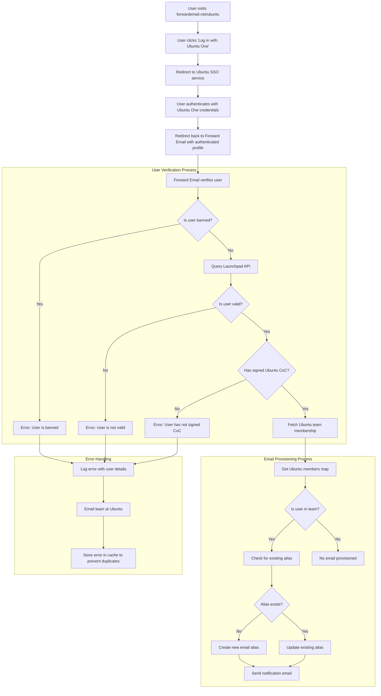

# กรณีศึกษา: Canonical ขับเคลื่อนการจัดการอีเมลของ Ubuntu ด้วยโซลูชันองค์กรโอเพนซอร์สของ Forward Email {#case-study-how-canonical-powers-ubuntu-email-management-with-forward-emails-open-source-enterprise-solution}


## สารบัญ {#table-of-contents}

* [คำนำ](#foreword)
* [ความท้าทาย: การจัดการระบบอีเมลที่ซับซ้อน](#the-challenge-managing-a-complex-email-ecosystem)
* [ข้อสรุปสำคัญ](#key-takeaways)
* [ทำไมต้อง Forward Email](#why-forward-email)
* [การนำไปใช้: การผสานรวม SSO อย่างราบรื่น](#the-implementation-seamless-sso-integration)
  * [ภาพรวมการไหลของการตรวจสอบสิทธิ์](#authentication-flow-visualization)
  * [รายละเอียดทางเทคนิคของการนำไปใช้](#technical-implementation-details)
* [การตั้งค่า DNS และการกำหนดเส้นทางอีเมล](#dns-configuration-and-email-routing)
* [ผลลัพธ์: การจัดการอีเมลที่มีประสิทธิภาพและความปลอดภัยที่เพิ่มขึ้น](#results-streamlined-email-management-and-enhanced-security)
  * [ประสิทธิภาพการดำเนินงาน](#operational-efficiency)
  * [ความปลอดภัยและความเป็นส่วนตัวที่เพิ่มขึ้น](#enhanced-security-and-privacy)
  * [การประหยัดค่าใช้จ่าย](#cost-savings)
  * [ประสบการณ์ที่ดีขึ้นสำหรับผู้ร่วมพัฒนา](#improved-contributor-experience)
* [มองไปข้างหน้า: ความร่วมมือที่ต่อเนื่อง](#looking-forward-continued-collaboration)
* [บทสรุป: ความร่วมมือโอเพนซอร์สที่สมบูรณ์แบบ](#conclusion-a-perfect-open-source-partnership)
* [สนับสนุนลูกค้าองค์กร](#supporting-enterprise-clients)
  * [ติดต่อเรา](#get-in-touch)
  * [เกี่ยวกับ Forward Email](#about-forward-email)


## คำนำ {#foreword}

ในโลกของซอฟต์แวร์โอเพนซอร์ส มีชื่อไม่กี่ชื่อที่มีน้ำหนักเทียบเท่ากับ [Canonical](https://en.wikipedia.org/wiki/Canonical_\(company\)) บริษัทผู้พัฒนา [Ubuntu](https://en.wikipedia.org/wiki/Ubuntu) หนึ่งในดิสโทรลินุกซ์ที่ได้รับความนิยมมากที่สุดในโลก ด้วยระบบนิเวศที่กว้างขวางครอบคลุมหลายดิสโทรรวมถึง Ubuntu, [Kubuntu](https://en.wikipedia.org/wiki/Kubuntu), [Lubuntu](https://en.wikipedia.org/wiki/Lubuntu), [Edubuntu](https://en.wikipedia.org/wiki/Edubuntu) และอื่น ๆ Canonical เผชิญกับความท้าทายเฉพาะในการจัดการที่อยู่อีเมลในหลายโดเมน กรณีศึกษานี้สำรวจว่าคุณ Canonical ร่วมมือกับ Forward Email อย่างไรเพื่อสร้างโซลูชันการจัดการอีเมลองค์กรที่ราบรื่น ปลอดภัย และเน้นความเป็นส่วนตัว ซึ่งสอดคล้องอย่างสมบูรณ์กับค่านิยมโอเพนซอร์สของพวกเขา


## ความท้าทาย: การจัดการระบบอีเมลที่ซับซ้อน {#the-challenge-managing-a-complex-email-ecosystem}

ระบบนิเวศของ Canonical มีความหลากหลายและกว้างขวาง ด้วยผู้ใช้หลายล้านคนทั่วโลกและผู้ร่วมพัฒนาหลายพันคนในโครงการต่าง ๆ การจัดการที่อยู่อีเมลในหลายโดเมนจึงเป็นความท้าทายที่สำคัญ ผู้ร่วมพัฒนาหลักต้องการที่อยู่อีเมลอย่างเป็นทางการ (@ubuntu.com, @kubuntu.org, ฯลฯ) ที่สะท้อนถึงการมีส่วนร่วมในโครงการ พร้อมทั้งรักษาความปลอดภัยและความสะดวกในการใช้งานผ่านระบบจัดการโดเมน Ubuntu ที่แข็งแกร่ง

ก่อนที่จะนำ Forward Email มาใช้ Canonical ประสบปัญหาในการ:

* จัดการที่อยู่อีเมลในหลายโดเมน (@ubuntu.com, @kubuntu.org, @lubuntu.me, @edubuntu.org และ @ubuntu.net)
* มอบประสบการณ์อีเมลที่สอดคล้องสำหรับผู้ร่วมพัฒนาหลัก
* ผสานรวมบริการอีเมลกับระบบ Single Sign-On (SSO) ของ [Ubuntu One](https://en.wikipedia.org/wiki/Ubuntu_One) ที่มีอยู่
* ค้นหาโซลูชันที่สอดคล้องกับความมุ่งมั่นด้านความเป็นส่วนตัว ความปลอดภัย และความปลอดภัยของอีเมลโอเพนซอร์ส
* ขยายโครงสร้างพื้นฐานอีเมลที่ปลอดภัยอย่างมีประสิทธิภาพด้านต้นทุน


## ข้อสรุปสำคัญ {#key-takeaways}

* Canonical นำโซลูชันการจัดการอีเมลแบบรวมศูนย์มาใช้ได้สำเร็จในหลายโดเมนของ Ubuntu
* แนวทางโอเพนซอร์ส 100% ของ Forward Email สอดคล้องอย่างสมบูรณ์กับค่านิยมของ Canonical
* การผสานรวม SSO กับ Ubuntu One มอบการตรวจสอบสิทธิ์ที่ราบรื่นสำหรับผู้ร่วมพัฒนา
* การเข้ารหัสที่ต้านทานควอนตัมรับประกันความปลอดภัยระยะยาวสำหรับการสื่อสารอีเมลทั้งหมด
* โซลูชันสามารถขยายได้อย่างมีประสิทธิภาพด้านต้นทุนเพื่อรองรับฐานผู้ร่วมพัฒนาที่เติบโตของ Canonical


## ทำไมต้อง Forward Email {#why-forward-email}
ในฐานะผู้ให้บริการอีเมลโอเพนซอร์ส 100% รายเดียวที่เน้นความเป็นส่วนตัวและความปลอดภัย Forward Email จึงเป็นตัวเลือกที่เหมาะสมอย่างยิ่งสำหรับความต้องการการส่งต่ออีเมลองค์กรของ Canonical ค่านิยมของเราสอดคล้องอย่างสมบูรณ์แบบกับความมุ่งมั่นของ Canonical ต่อซอฟต์แวร์โอเพนซอร์สและความเป็นส่วนตัว

ปัจจัยสำคัญที่ทำให้ Forward Email เป็นตัวเลือกที่เหมาะสม ได้แก่:

1. **ฐานรหัสโอเพนซอร์สครบถ้วน**: แพลตฟอร์มทั้งหมดของเราเป็นโอเพนซอร์สและพร้อมใช้งานบน [GitHub](https://en.wikipedia.org/wiki/GitHub) ช่วยให้โปร่งใสและเปิดโอกาสให้ชุมชนมีส่วนร่วม แตกต่างจากผู้ให้บริการอีเมล "เน้นความเป็นส่วนตัว" หลายรายที่เปิดซอร์สเฉพาะส่วนหน้าของระบบแต่เก็บส่วนหลังไว้เป็นความลับ เราได้เปิดเผยฐานรหัสทั้งหมด—ทั้งส่วนหน้าและส่วนหลัง—ให้ทุกคนตรวจสอบได้ที่ [GitHub](https://github.com/forwardemail/forwardemail.net)

2. **แนวทางเน้นความเป็นส่วนตัว**: แตกต่างจากผู้ให้บริการรายอื่น เราไม่เก็บอีเมลในฐานข้อมูลที่ใช้ร่วมกัน และเราใช้การเข้ารหัสที่แข็งแกร่งด้วย TLS ปรัชญาความเป็นส่วนตัวพื้นฐานของเราง่ายมาก: **อีเมลของคุณเป็นของคุณและมีเพียงคุณเท่านั้น** หลักการนี้ชี้นำทุกการตัดสินใจทางเทคนิคที่เราทำ ตั้งแต่การจัดการการส่งต่ออีเมลจนถึงการใช้งานการเข้ารหัส

3. **ไม่พึ่งพาบุคคลที่สาม**: เราไม่ใช้ Amazon SES หรือบริการบุคคลที่สามอื่น ๆ ทำให้เราควบคุมโครงสร้างพื้นฐานอีเมลได้อย่างเต็มที่และขจัดความเสี่ยงของการรั่วไหลข้อมูลส่วนตัวผ่านบริการบุคคลที่สาม

4. **การขยายตัวที่คุ้มค่า**: รูปแบบการตั้งราคาของเราช่วยให้องค์กรสามารถขยายตัวได้โดยไม่ต้องจ่ายต่อผู้ใช้ เหมาะอย่างยิ่งสำหรับฐานผู้ร่วมพัฒนาขนาดใหญ่ของ Canonical

5. **การเข้ารหัสต้านทานควอนตัม**: เราใช้กล่องจดหมาย SQLite ที่เข้ารหัสแยกกันด้วย [ChaCha20-Poly1305](https://en.wikipedia.org/wiki/ChaCha20-Poly1305) เป็นตัวเข้ารหัสสำหรับ [การเข้ารหัสต้านทานควอนตัม](/blog/docs/best-quantum-safe-encrypted-email-service) กล่องจดหมายแต่ละกล่องเป็นไฟล์เข้ารหัสแยกต่างหาก หมายความว่าการเข้าถึงข้อมูลของผู้ใช้คนหนึ่งจะไม่สามารถเข้าถึงข้อมูลของผู้อื่นได้


## การดำเนินการ: การผสานรวม SSO อย่างไร้รอยต่อ {#the-implementation-seamless-sso-integration}

หนึ่งในแง่มุมที่สำคัญที่สุดของการดำเนินการคือการผสานรวมกับระบบ Ubuntu One SSO ที่มีอยู่ของ Canonical การผสานรวมนี้จะช่วยให้ผู้ร่วมพัฒนาหลักสามารถจัดการที่อยู่อีเมล @ubuntu.com ของตนโดยใช้ข้อมูลประจำตัว Ubuntu One ที่มีอยู่แล้ว

### การแสดงภาพกระบวนการตรวจสอบสิทธิ์ {#authentication-flow-visualization}

แผนภาพต่อไปนี้แสดงภาพรวมของกระบวนการตรวจสอบสิทธิ์และการจัดสรรอีเมลอย่างครบถ้วน:


```mermaid
flowchart TD
    A[User visits forwardemail.net/ubuntu] --> B[User clicks 'Log in with Ubuntu One']
    B --> C[Redirect to Ubuntu SSO service]
    C --> D[User authenticates with Ubuntu One credentials]
    D --> E[Redirect back to Forward Email with authenticated profile]
    E --> F[Forward Email verifies user]

    subgraph "User Verification Process"
        F --> G{Is user banned?}
        G -->|Yes| H[Error: User is banned]
        G -->|No| I[Query Launchpad API]
        I --> J{Is user valid?}
        J -->|No| K[Error: User is not valid]
        J -->|Yes| L{Has signed Ubuntu CoC?}
        L -->|No| M[Error: User has not signed CoC]
        L -->|Yes| N[Fetch Ubuntu team membership]
    end

    subgraph "Email Provisioning Process"
        N --> O[Get Ubuntu members map]
        O --> P{Is user in team?}
        P -->|Yes| Q[Check for existing alias]
        Q --> R{Alias exists?}
        R -->|No| S[Create new email alias]
        R -->|Yes| T[Update existing alias]
        S --> U[Send notification email]
        T --> U
        P -->|No| V[No email provisioned]
    end

    subgraph "Error Handling"
        H --> W[Log error with user details]
        K --> W
        M --> W
        W --> X[Email team at Ubuntu]
        X --> Y[Store error in cache to prevent duplicates]
    end
```

### รายละเอียดการดำเนินการทางเทคนิค {#technical-implementation-details}

การผสานรวมระหว่าง Forward Email กับ Ubuntu One SSO ได้รับการดำเนินการผ่านการใช้งานกลยุทธ์การตรวจสอบสิทธิ์ passport-ubuntu แบบกำหนดเอง ซึ่งช่วยให้กระบวนการตรวจสอบสิทธิ์ระหว่าง Ubuntu One และระบบของ Forward Email เป็นไปอย่างไร้รอยต่อ
#### The Authentication Flow {#the-authentication-flow}

กระบวนการตรวจสอบสิทธิ์ทำงานดังนี้:

1. ผู้ใช้เยี่ยมชมหน้าการจัดการอีเมล Ubuntu ที่ [forwardemail.net/ubuntu](https://forwardemail.net/ubuntu)
2. พวกเขาคลิก "Log in with Ubuntu One" และถูกเปลี่ยนเส้นทางไปยังบริการ Ubuntu SSO
3. หลังจากตรวจสอบสิทธิ์ด้วยข้อมูลประจำตัว Ubuntu One ของพวกเขาแล้ว พวกเขาจะถูกเปลี่ยนเส้นทางกลับไปยัง Forward Email พร้อมโปรไฟล์ที่ได้รับการตรวจสอบสิทธิ์
4. Forward Email ตรวจสอบสถานะผู้ร่วมพัฒนาและจัดเตรียมหรือจัดการที่อยู่อีเมลของพวกเขาตามนั้น

การใช้งานทางเทคนิคใช้แพ็กเกจ [`passport-ubuntu`](https://www.npmjs.com/package/passport-ubuntu) ซึ่งเป็นกลยุทธ์ [Passport](https://www.npmjs.com/package/passport) สำหรับการตรวจสอบสิทธิ์กับ Ubuntu โดยใช้ [OpenID](https://en.wikipedia.org/wiki/OpenID) การตั้งค่ารวมถึง:

```javascript
passport.use(new UbuntuStrategy({
  returnURL: process.env.UBUNTU_CALLBACK_URL,
  realm: process.env.UBUNTU_REALM,
  stateless: true
}, function(identifier, profile, done) {
  // User verification and email provisioning logic
}));
```

#### Launchpad API Integration and Validation {#launchpad-api-integration-and-validation}

ส่วนสำคัญของการใช้งานของเราคือการรวมกับ API ของ [Launchpad](https://en.wikipedia.org/wiki/Launchpad_\(website\)) เพื่อยืนยันผู้ใช้ Ubuntu และการเป็นสมาชิกทีมของพวกเขา เราสร้างฟังก์ชันช่วยเหลือที่นำกลับมาใช้ใหม่ได้เพื่อจัดการการรวมนี้อย่างมีประสิทธิภาพและเชื่อถือได้

ฟังก์ชันช่วยเหลือ `sync-ubuntu-user.js` มีหน้าที่ตรวจสอบผู้ใช้ผ่าน Launchpad API และจัดการที่อยู่อีเมลของพวกเขา นี่คือเวอร์ชันที่เรียบง่ายของวิธีการทำงาน:

```javascript
async function syncUbuntuUser(user, map) {
  try {
    // Validate user object
    if (!_.isObject(user) ||
        !isSANB(user[fields.ubuntuUsername]) ||
        !isSANB(user[fields.ubuntuProfileID]) ||
        !isEmail(user.email))
      throw new TypeError('Invalid user object');

    // Get Ubuntu members map if not provided
    if (!(map instanceof Map))
      map = await getUbuntuMembersMap(resolver);

    // Check if user is banned
    if (user[config.userFields.isBanned]) {
      throw new InvalidUbuntuUserError('User was banned', { ignoreHook: true });
    }

    // Query Launchpad API to validate user
    const url = `https://api.launchpad.net/1.0/~${user[fields.ubuntuUsername]}`;
    const response = await retryRequest(url, { resolver });
    const json = await response.body.json();

    // Validate required boolean properties
    if (!json.is_valid)
      throw new InvalidUbuntuUserError('Property "is_valid" was false');

    if (!json.is_ubuntu_coc_signer)
      throw new InvalidUbuntuUserError('Property "is_ubuntu_coc_signer" was false');

    // Process each domain for the user
    await pMap([...map.keys()], async (name) => {
      // Find domain in database
      const domain = await Domains.findOne({
        name,
        plan: 'team',
        has_txt_record: true
      }).populate('members.user');

      // Process user's email alias for this domain
      if (map.get(name).has(user[fields.ubuntuUsername])) {
        // User is a member of this team, create or update alias
        let alias = await Aliases.findOne({
          user: user._id,
          domain: domain._id,
          name: user[fields.ubuntuUsername].toLowerCase()
        });

        if (!alias) {
          // Create new alias with appropriate error handling
          alias = await Aliases.create({
            user: user._id,
            domain: domain._id,
            name: user[fields.ubuntuUsername].toLowerCase(),
            recipients: [user.email],
            locale: user[config.lastLocaleField],
            is_enabled: true
          });

          // Notify admins about new alias creation
          await emailHelper({
            template: 'alert',
            message: {
              to: adminEmailsForDomain,
              subject: `New @${domain.name} email address created`
            },
            locals: {
              message: `A new email address ${user[fields.ubuntuUsername].toLowerCase()}@${domain.name} was created for ${user.email}`
            }
          });
        }
      }
    });

    return true;
  } catch (err) {
    // Handle and log errors
    await logErrorWithUser(err, user);
    throw err;
  }
}
```
เพื่อให้ง่ายต่อการจัดการสมาชิกทีมในโดเมน Ubuntu ต่างๆ เราได้สร้างการแมปที่เรียบง่ายระหว่างชื่อโดเมนและทีม Launchpad ที่เกี่ยวข้อง:

```javascript
ubuntuTeamMapping: {
  'ubuntu.com': '~ubuntumembers',
  'kubuntu.org': '~kubuntu-members',
  'lubuntu.me': '~lubuntu-members',
  'edubuntu.org': '~edubuntu-members',
  'ubuntustudio.com': '~ubuntustudio-core',
  'ubuntu.net': '~ubuntu-smtp-test'
},
```

การแมปที่เรียบง่ายนี้ช่วยให้เราสามารถทำงานอัตโนมัติในการตรวจสอบสมาชิกทีมและการจัดเตรียมที่อยู่อีเมล ทำให้ระบบง่ายต่อการบำรุงรักษาและขยายเมื่อมีการเพิ่มโดเมนใหม่

#### การจัดการข้อผิดพลาดและการแจ้งเตือน {#error-handling-and-notifications}

เราได้พัฒนาระบบจัดการข้อผิดพลาดที่แข็งแกร่งซึ่ง:

1. บันทึกข้อผิดพลาดทั้งหมดพร้อมข้อมูลผู้ใช้โดยละเอียด
2. ส่งอีเมลแจ้งทีม Ubuntu เมื่อพบปัญหา
3. แจ้งผู้ดูแลระบบเมื่อมีผู้ร่วมใหม่ลงทะเบียนและมีการสร้างที่อยู่อีเมล
4. จัดการกรณีพิเศษ เช่น ผู้ใช้ที่ยังไม่ได้ลงนามใน Ubuntu Code of Conduct

สิ่งนี้ช่วยให้ปัญหาทุกอย่างถูกระบุและแก้ไขอย่างรวดเร็ว รักษาความสมบูรณ์ของระบบอีเมล

## การตั้งค่า DNS และการกำหนดเส้นทางอีเมล {#dns-configuration-and-email-routing}

สำหรับแต่ละโดเมนที่จัดการผ่าน Forward Email Canonical ได้เพิ่มระเบียน DNS TXT ง่ายๆ สำหรับการยืนยัน:

```sh
❯ dig ubuntu.com txt
ubuntu.com.             600     IN      TXT     "forward-email-site-verification=6IsURgl2t7"
```

ระเบียนยืนยันนี้ยืนยันความเป็นเจ้าของโดเมนและเปิดใช้งานระบบของเราให้จัดการอีเมลสำหรับโดเมนเหล่านี้อย่างปลอดภัย Canonical กำหนดเส้นทางอีเมลผ่านบริการของเราผ่าน Postfix ซึ่งให้โครงสร้างพื้นฐานการส่งอีเมลที่เชื่อถือได้และปลอดภัย

## ผลลัพธ์: การจัดการอีเมลที่มีประสิทธิภาพและความปลอดภัยที่เพิ่มขึ้น {#results-streamlined-email-management-and-enhanced-security}

การนำโซลูชันองค์กรของ Forward Email มาใช้ได้มอบประโยชน์อย่างมากสำหรับการจัดการอีเมลของ Canonical ในทุกโดเมนของพวกเขา:

### ประสิทธิภาพการดำเนินงาน {#operational-efficiency}

* **การจัดการแบบรวมศูนย์**: โดเมนที่เกี่ยวข้องกับ Ubuntu ทั้งหมดถูกจัดการผ่านอินเทอร์เฟซเดียว
* **ลดภาระงานฝ่ายบริหาร**: การจัดเตรียมอัตโนมัติและการจัดการแบบบริการตนเองสำหรับผู้ร่วม
* **การเริ่มต้นใช้งานที่ง่ายขึ้น**: ผู้ร่วมใหม่สามารถรับที่อยู่อีเมลอย่างเป็นทางการได้อย่างรวดเร็ว

### ความปลอดภัยและความเป็นส่วนตัวที่เพิ่มขึ้น {#enhanced-security-and-privacy}

* **การเข้ารหัสแบบ end-to-end**: อีเมลทั้งหมดถูกเข้ารหัสโดยใช้มาตรฐานขั้นสูง
* **ไม่มีฐานข้อมูลร่วมกัน**: อีเมลของแต่ละผู้ใช้ถูกเก็บในฐานข้อมูล SQLite ที่เข้ารหัสแยกกัน ซึ่งให้แนวทางการเข้ารหัสแบบแซนด์บ็อกซ์ที่ปลอดภัยกว่าฐานข้อมูลเชิงสัมพันธ์แบบดั้งเดิม
* **ความปลอดภัยแบบโอเพนซอร์ส**: โค้ดที่โปร่งใสช่วยให้ชุมชนสามารถตรวจสอบความปลอดภัยได้
* **การประมวลผลในหน่วยความจำ**: เราไม่เก็บอีเมลที่ถูกส่งต่อไว้ในดิสก์ ช่วยเพิ่มการปกป้องความเป็นส่วนตัว
* **ไม่มีการเก็บข้อมูลเมตา**: เราไม่เก็บบันทึกว่าใครส่งอีเมลถึงใคร ต่างจากผู้ให้บริการอีเมลหลายราย

### การประหยัดค่าใช้จ่าย {#cost-savings}

* **โมเดลราคาที่ปรับขนาดได้**: ไม่มีค่าธรรมเนียมต่อผู้ใช้ ทำให้ Canonical สามารถเพิ่มผู้ร่วมได้โดยไม่เพิ่มค่าใช้จ่าย
* **ลดความต้องการโครงสร้างพื้นฐาน**: ไม่จำเป็นต้องดูแลเซิร์ฟเวอร์อีเมลแยกสำหรับโดเมนต่างๆ
* **ลดความต้องการสนับสนุน**: การจัดการแบบบริการตนเองช่วยลดตั๋วสนับสนุน IT

### ประสบการณ์ผู้ร่วมที่ดีขึ้น {#improved-contributor-experience}

* **การพิสูจน์ตัวตนที่ราบรื่น**: การเข้าสู่ระบบครั้งเดียวด้วยข้อมูลประจำตัว Ubuntu One ที่มีอยู่
* **การสร้างแบรนด์ที่สอดคล้องกัน**: ประสบการณ์ที่เป็นหนึ่งเดียวในทุกบริการที่เกี่ยวข้องกับ Ubuntu
* **การส่งอีเมลที่เชื่อถือได้**: ชื่อเสียง IP คุณภาพสูงช่วยให้อีเมลถึงปลายทางอย่างแน่นอน

การผสานรวมกับ Forward Email ได้ช่วยให้กระบวนการจัดการอีเมลของ Canonical มีความเรียบง่ายมากขึ้น ผู้ร่วมงานมีประสบการณ์ที่ราบรื่นในการจัดการที่อยู่อีเมล @ubuntu.com ของตน พร้อมทั้งลดภาระงานฝ่ายบริหารและเพิ่มความปลอดภัย

## มองไปข้างหน้า: ความร่วมมือที่ต่อเนื่อง {#looking-forward-continued-collaboration}

ความร่วมมือระหว่าง Canonical และ Forward Email ยังคงพัฒนาอย่างต่อเนื่อง เรากำลังทำงานร่วมกันในหลายโครงการ:
* ขยายบริการอีเมลไปยังโดเมนที่เกี่ยวข้องกับ Ubuntu เพิ่มเติม
* ปรับปรุงส่วนติดต่อผู้ใช้ตามคำติชมจากผู้ร่วมพัฒนา
* นำฟีเจอร์ความปลอดภัยเพิ่มเติมมาใช้
* สำรวจวิธีใหม่ๆ ในการใช้ประโยชน์จากความร่วมมือแบบโอเพนซอร์สของเรา


## Conclusion: A Perfect Open-Source Partnership {#conclusion-a-perfect-open-source-partnership}

ความร่วมมือระหว่าง Canonical และ Forward Email แสดงให้เห็นถึงพลังของความร่วมมือที่สร้างขึ้นบนค่านิยมร่วมกัน ด้วยการเลือก Forward Email เป็นผู้ให้บริการอีเมล Canonical ได้พบกับโซลูชันที่ไม่เพียงแต่ตอบสนองความต้องการทางเทคนิคของพวกเขาเท่านั้น แต่ยังสอดคล้องอย่างสมบูรณ์แบบกับความมุ่งมั่นของพวกเขาต่อซอฟต์แวร์โอเพนซอร์ส ความเป็นส่วนตัว และความปลอดภัย

สำหรับองค์กรที่จัดการโดเมนหลายแห่งและต้องการการยืนยันตัวตนที่ราบรื่นกับระบบที่มีอยู่ Forward Email นำเสนอโซลูชันที่ยืดหยุ่น ปลอดภัย และเน้นความเป็นส่วนตัว วิธีการ [โอเพนซอร์สของเรา](https://forwardemail.net/blog/docs/why-open-source-email-security-privacy) รับประกันความโปร่งใสและเปิดโอกาสให้ชุมชนมีส่วนร่วม ทำให้เป็นตัวเลือกที่เหมาะสมสำหรับองค์กรที่ให้ความสำคัญกับหลักการเหล่านี้

ในขณะที่ Canonical และ Forward Email ยังคงสร้างนวัตกรรมในสาขาของตน ความร่วมมือนี้จึงเป็นเครื่องพิสูจน์ถึงพลังของความร่วมมือแบบโอเพนซอร์สและค่านิยมร่วมกันในการสร้างโซลูชันที่มีประสิทธิภาพ

คุณสามารถตรวจสอบ [สถานะบริการแบบเรียลไทม์](https://status.forwardemail.net) ของเราเพื่อดูประสิทธิภาพการส่งอีเมลปัจจุบัน ซึ่งเราติดตามอย่างต่อเนื่องเพื่อให้มั่นใจในชื่อเสียง IP ที่ดีและการส่งอีเมลที่มีคุณภาพสูง


## Supporting Enterprise Clients {#supporting-enterprise-clients}

แม้ว่ากรณีศึกษานี้จะเน้นที่ความร่วมมือกับ Canonical แต่ Forward Email ภูมิใจที่ได้สนับสนุนลูกค้าองค์กรจำนวนมากในหลากหลายอุตสาหกรรมที่ให้ความสำคัญกับความมุ่งมั่นของเราในเรื่องความเป็นส่วนตัว ความปลอดภัย และหลักการโอเพนซอร์ส

โซลูชันองค์กรของเราได้รับการปรับแต่งเพื่อตอบสนองความต้องการเฉพาะขององค์กรทุกขนาด โดยมีบริการดังนี้:

* การ [จัดการอีเมลโดเมนที่กำหนดเอง](/) หลายโดเมน
* การผสานรวมอย่างราบรื่นกับระบบยืนยันตัวตนที่มีอยู่
* ช่องทางสนับสนุนแชท Matrix เฉพาะ
* ฟีเจอร์ความปลอดภัยขั้นสูงรวมถึง [การเข้ารหัสที่ต้านทานควอนตัม](/blog/docs/best-quantum-safe-encrypted-email-service)
* การโอนย้ายและเป็นเจ้าของข้อมูลอย่างสมบูรณ์
* โครงสร้างพื้นฐาน 100% โอเพนซอร์สเพื่อความโปร่งใสและความน่าเชื่อถือ

### Get in Touch {#get-in-touch}

หากองค์กรของคุณมีความต้องการอีเมลระดับองค์กร หรือสนใจเรียนรู้เพิ่มเติมเกี่ยวกับวิธีที่ Forward Email สามารถช่วยจัดการอีเมลของคุณให้มีประสิทธิภาพมากขึ้นพร้อมทั้งเพิ่มความเป็นส่วนตัวและความปลอดภัย เรายินดีรับฟังจากคุณ:

* ส่งอีเมลถึงเราที่ `support@forwardemail.net`
* ส่งคำขอความช่วยเหลือที่ [หน้าช่วยเหลือ](https://forwardemail.net/help)
* ตรวจสอบ [หน้าราคาของเรา](https://forwardemail.net/pricing) สำหรับแผนองค์กร

ทีมงานของเราพร้อมที่จะพูดคุยเกี่ยวกับความต้องการเฉพาะของคุณและพัฒนาโซลูชันที่ปรับแต่งให้สอดคล้องกับค่านิยมและความต้องการทางเทคนิคขององค์กรคุณ

### About Forward Email {#about-forward-email}

Forward Email คือบริการอีเมลที่ 100% เป็นโอเพนซอร์สและเน้นความเป็นส่วนตัว เราให้บริการส่งต่ออีเมลโดเมนที่กำหนดเอง, SMTP, IMAP และ POP3 โดยเน้นที่ความปลอดภัย ความเป็นส่วนตัว และความโปร่งใส โค้ดทั้งหมดของเราพร้อมให้ดูได้ที่ [GitHub](https://github.com/forwardemail/forwardemail.net) และเรามุ่งมั่นที่จะให้บริการอีเมลที่เคารพความเป็นส่วนตัวและความปลอดภัยของผู้ใช้ เรียนรู้เพิ่มเติมเกี่ยวกับ [ทำไมอีเมลโอเพนซอร์สจึงเป็นอนาคต](https://forwardemail.net/blog/docs/why-open-source-email-security-privacy), [วิธีการส่งต่ออีเมลของเรา](https://forwardemail.net/blog/docs/best-email-forwarding-service) และ [แนวทางของเราในการปกป้องความเป็นส่วนตัวของอีเมล](https://forwardemail.net/blog/docs/email-privacy-protection-technical-implementation)
