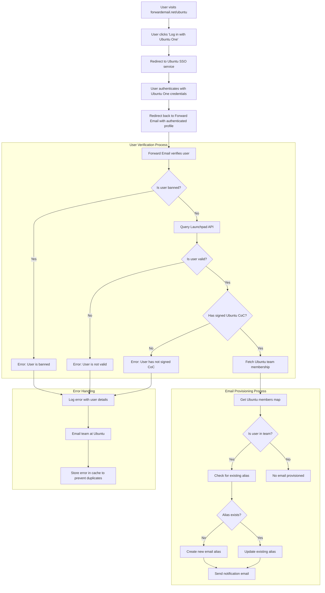

# Vaka Çalışması: Canonical, Forward Email'in Açık Kaynaklı Kurumsal Çözümüyle Ubuntu E-posta Yönetimini Nasıl Güçlendiriyor? {#case-study-how-canonical-powers-ubuntu-email-management-with-forward-emails-open-source-enterprise-solution}


## İçindekiler {#table-of-contents}

* [Önsöz](#foreword)
* [Zorluk: Karmaşık Bir E-posta Ekosistemini Yönetmek](#the-challenge-managing-a-complex-email-ecosystem)
* [Önemli Çıkarımlar](#key-takeaways)
* [E-postayı Neden İletmelisiniz?](#why-forward-email)
* [Uygulama: Kusursuz SSO Entegrasyonu](#the-implementation-seamless-sso-integration)
  * [Kimlik Doğrulama Akışı Görselleştirmesi](#authentication-flow-visualization)
  * [Teknik Uygulama Ayrıntıları](#technical-implementation-details)
* [DNS Yapılandırması ve E-posta Yönlendirmesi](#dns-configuration-and-email-routing)
* [Sonuçlar: Kolaylaştırılmış E-posta Yönetimi ve Gelişmiş Güvenlik](#results-streamlined-email-management-and-enhanced-security)
  * [Operasyonel Verimlilik](#operational-efficiency)
  * [Gelişmiş Güvenlik ve Gizlilik](#enhanced-security-and-privacy)
  * [Maliyet Tasarrufu](#cost-savings)
  * [Geliştirilmiş Katkıda Bulunan Deneyimi](#improved-contributor-experience)
* [İleriye Bakış: Sürekli İşbirliği](#looking-forward-continued-collaboration)
* [Sonuç: Mükemmel Bir Açık Kaynak Ortaklığı](#conclusion-a-perfect-open-source-partnership)
* [Kurumsal Müşterileri Destekleme](#supporting-enterprise-clients)
  * [İletişime Geçin](#get-in-touch)
  * [E-postayı İletme Hakkında](#about-forward-email)

## Önsöz {#foreword}

Açık kaynaklı yazılım dünyasında, dünyanın en popüler Linux dağıtımlarından biri olan [Ubuntu](https://en.wikipedia.org/wiki/Ubuntu)'in arkasındaki şirket olan [Kanonik](https://en.wikipedia.org/wiki/Canonical_\(company\) kadar önemli çok az isim vardır. Ubuntu, [Özgür](https://en.wikipedia.org/wiki/Kubuntu), [Lubuntu](https://en.wikipedia.org/wiki/Lubuntu), [Edubuntu](https://en.wikipedia.org/wiki/Edubuntu) ve diğerleri de dahil olmak üzere birçok dağıtımı kapsayan geniş bir ekosisteme sahip olan Canonical, çok sayıda etki alanındaki e-posta adreslerini yönetmede benzersiz zorluklarla karşı karşıyaydı. Bu vaka çalışması, Canonical'ın Forward Email ile iş birliği yaparak açık kaynaklı değerleriyle mükemmel uyum sağlayan, kusursuz, güvenli ve gizlilik odaklı bir kurumsal e-posta yönetim çözümü oluşturmasını incelemektedir.

## Zorluk: Karmaşık Bir E-posta Ekosistemini Yönetmek {#the-challenge-managing-a-complex-email-ecosystem}

Canonical'ın ekosistemi çeşitli ve kapsamlıdır. Dünya çapında milyonlarca kullanıcı ve çeşitli projelerde binlerce katılımcıyla, birden fazla alan adında e-posta adreslerini yönetmek önemli zorluklar ortaya çıkarıyordu. Temel katılımcılar, sağlam bir Ubuntu alan adı yönetim sistemi aracılığıyla güvenlik ve kullanım kolaylığını korurken, projeye katılımlarını yansıtan resmi e-posta adreslerine (@ubuntu.com, @kubuntu.org vb.) ihtiyaç duyuyordu.

Canonical, Forward Email'i uygulamadan önce şu sorunlarla mücadele ediyordu:

* Birden fazla alan adındaki e-posta adreslerini yönetmek (@ubuntu.com, @kubuntu.org, @lubuntu.me, @edubuntu.org ve @ubuntu.net)
* Temel katılımcılar için tutarlı bir e-posta deneyimi sağlamak
* E-posta hizmetlerini mevcut [Ubuntu One](https://en.wikipedia.org/wiki/Ubuntu_One) Tek Oturum Açma (SSO) sistemleriyle entegre etmek
* Gizlilik, güvenlik ve açık kaynaklı e-posta güvenliğine olan bağlılıklarıyla uyumlu bir çözüm bulmak
* Güvenli e-posta altyapılarını uygun maliyetli bir şekilde ölçeklendirmek

## Önemli Noktalar {#key-takeaways}

* Canonical, birden fazla Ubuntu etki alanında birleşik bir e-posta yönetim çözümünü başarıyla uyguladı.
* Forward Email'in %100 açık kaynaklı yaklaşımı, Canonical değerleriyle mükemmel bir şekilde uyumlu.
* Ubuntu One ile SSO entegrasyonu, katkıda bulunanlar için sorunsuz kimlik doğrulaması sağlıyor.
* Kuantum dirençli şifreleme, tüm e-posta iletişimleri için uzun vadeli güvenlik sağlıyor.
* Çözüm, Canonical'ın büyüyen katkıda bulunan tabanını desteklemek için uygun maliyetli bir şekilde ölçekleniyor.

## E-postayı Neden İletmelisiniz? {#why-forward-email}

Gizlilik ve güvenliğe odaklanan tek %100 açık kaynaklı e-posta hizmeti sağlayıcısı olan Forward Email, Canonical'ın kurumsal e-posta yönlendirme ihtiyaçları için doğal bir uyumdu. Değerlerimiz, Canonical'ın açık kaynaklı yazılım ve gizliliğe olan bağlılığıyla mükemmel bir şekilde örtüşüyordu.

Forward Email'i ideal bir seçim yapan temel faktörler şunlardır:

1. **Tamamen açık kaynaklı kod tabanı**: Platformumuzun tamamı açık kaynaklıdır ve [GitHub](https://en.wikipedia.org/wiki/GitHub) adresinde mevcuttur, bu da şeffaflık ve topluluk katkılarına olanak tanır. Arka uçlarını kapalı tutarken yalnızca ön uçlarını açık kaynaklı hale getiren birçok "gizlilik odaklı" e-posta sağlayıcısının aksine, hem ön ucu hem de arka ucuyla tüm kod tabanımızı [GitHub](https://github.com/forwardemail/forwardemail.net) adresinden herkesin incelemesine açtık.

2. **Gizlilik odaklı yaklaşım**: Diğer sağlayıcıların aksine, e-postaları paylaşımlı veritabanlarında saklamıyoruz ve TLS ile güçlü şifreleme kullanıyoruz. Temel gizlilik felsefemiz basittir: **E-postalarınız yalnızca size aittir**. Bu ilke, e-posta yönlendirmeyi nasıl ele aldığımızdan şifrelemeyi nasıl uyguladığımıza kadar verdiğimiz her teknik karara rehberlik eder.

3. **Üçüncü taraflara güvenmeme**: Amazon SES veya diğer üçüncü taraf hizmetlerini kullanmıyoruz. Bu da bize e-posta altyapısı üzerinde tam kontrol sağlıyor ve üçüncü taraf hizmetler aracılığıyla olası gizlilik sızıntılarını ortadan kaldırıyor.

4. **Maliyet etkin ölçekleme**: Fiyatlandırma modelimiz, kuruluşların kullanıcı başına ödeme yapmadan ölçeklenmesine olanak tanır ve bu da onu Canonical'ın geniş katılımcı tabanı için ideal hale getirir.

5. **Kuantum dirençli şifreleme**: [kuantum dirençli şifreleme](/blog/docs/best-quantum-safe-encrypted-email-service) için şifre olarak [ChaCha20-Poly1305](https://en.wikipedia.org/wiki/ChaCha20-Poly1305) kullanan ayrı ayrı şifrelenmiş SQLite posta kutuları kullanıyoruz. Her posta kutusu ayrı bir şifrelenmiş dosyadır; yani bir kullanıcının verilerine erişim, diğerlerine erişim hakkı vermez.

## Uygulama: Sorunsuz SSO Entegrasyonu {#the-implementation-seamless-sso-integration}

Uygulamanın en kritik yönlerinden biri, Canonical'ın mevcut Ubuntu One SSO sistemiyle entegrasyon sağlamaktı. Bu entegrasyon, temel katılımcıların @ubuntu.com e-posta adreslerini mevcut Ubuntu One kimlik bilgilerini kullanarak yönetmelerine olanak tanıyacaktı.

### Kimlik Doğrulama Akışı Görselleştirmesi {#authentication-flow-visualization}

Aşağıdaki diyagram, kimlik doğrulama ve e-posta sağlama akışının tamamını göstermektedir:



### Teknik Uygulama Ayrıntıları {#technical-implementation-details}

Forward Email ve Ubuntu One SSO arasındaki entegrasyon, passport-ubuntu kimlik doğrulama stratejisinin özel bir uygulamasıyla gerçekleştirildi. Bu, Ubuntu One ve Forward Email sistemleri arasında sorunsuz bir kimlik doğrulama akışı sağladı.

#### Kimlik Doğrulama Akışı {#the-authentication-flow}

Kimlik doğrulama süreci şu şekilde işliyor:

1. Kullanıcılar [forwardemail.net/ubuntu](https://forwardemail.net/ubuntu) adresindeki özel Ubuntu e-posta yönetim sayfasını ziyaret eder.
2. "Ubuntu One ile Giriş Yap"a tıklar ve Ubuntu SSO hizmetine yönlendirilirler.
3. Ubuntu One kimlik bilgileriyle kimlik doğrulaması yaptıktan sonra, kimliği doğrulanmış profilleriyle E-postayı İlet'e yönlendirilirler.
4. E-postayı İlet, katkıda bulunanların durumunu doğrular ve e-posta adreslerini buna göre ayarlar veya yönetir.

Teknik uygulama, [Açık Kimlik](https://en.wikipedia.org/wiki/OpenID) kullanarak Ubuntu ile kimlik doğrulaması yapmak için bir [Pasaport](https://www.npmjs.com/package/passport) stratejisi olan [`passport-ubuntu`](https://www.npmjs.com/package/passport-ubuntu) paketinden yararlandı. Yapılandırma şunları içeriyordu:

```javascript
passport.use(new UbuntuStrategy({
  returnURL: process.env.UBUNTU_CALLBACK_URL,
  realm: process.env.UBUNTU_REALM,
  stateless: true
}, function(identifier, profile, done) {
  // User verification and email provisioning logic
}));
```

#### Launchpad API Entegrasyonu ve Doğrulaması {#launchpad-api-integration-and-validation}

Uygulamamızın kritik bir bileşeni, Ubuntu kullanıcılarını ve ekip üyeliklerini doğrulamak için [Fırlatma rampası](https://en.wikipedia.org/wiki/Launchpad_\(website\)) API'siyle entegrasyondur. Bu entegrasyonu verimli ve güvenilir bir şekilde yönetmek için yeniden kullanılabilir yardımcı işlevler oluşturduk.

`sync-ubuntu-user.js` yardımcı işlevi, kullanıcıları Launchpad API aracılığıyla doğrulamaktan ve e-posta adreslerini yönetmekten sorumludur. İşte nasıl çalıştığına dair basitleştirilmiş bir açıklama:

```javascript
async function syncUbuntuUser(user, map) {
  try {
    // Validate user object
    if (!_.isObject(user) ||
        !isSANB(user[fields.ubuntuUsername]) ||
        !isSANB(user[fields.ubuntuProfileID]) ||
        !isEmail(user.email))
      throw new TypeError('Invalid user object');

    // Get Ubuntu members map if not provided
    if (!(map instanceof Map))
      map = await getUbuntuMembersMap(resolver);

    // Check if user is banned
    if (user[config.userFields.isBanned]) {
      throw new InvalidUbuntuUserError('User was banned', { ignoreHook: true });
    }

    // Query Launchpad API to validate user
    const url = `https://api.launchpad.net/1.0/~${user[fields.ubuntuUsername]}`;
    const response = await retryRequest(url, { resolver });
    const json = await response.body.json();

    // Validate required boolean properties
    if (!json.is_valid)
      throw new InvalidUbuntuUserError('Property "is_valid" was false');

    if (!json.is_ubuntu_coc_signer)
      throw new InvalidUbuntuUserError('Property "is_ubuntu_coc_signer" was false');

    // Process each domain for the user
    await pMap([...map.keys()], async (name) => {
      // Find domain in database
      const domain = await Domains.findOne({
        name,
        plan: 'team',
        has_txt_record: true
      }).populate('members.user');

      // Process user's email alias for this domain
      if (map.get(name).has(user[fields.ubuntuUsername])) {
        // User is a member of this team, create or update alias
        let alias = await Aliases.findOne({
          user: user._id,
          domain: domain._id,
          name: user[fields.ubuntuUsername].toLowerCase()
        });

        if (!alias) {
          // Create new alias with appropriate error handling
          alias = await Aliases.create({
            user: user._id,
            domain: domain._id,
            name: user[fields.ubuntuUsername].toLowerCase(),
            recipients: [user.email],
            locale: user[config.lastLocaleField],
            is_enabled: true
          });

          // Notify admins about new alias creation
          await emailHelper({
            template: 'alert',
            message: {
              to: adminEmailsForDomain,
              subject: `New @${domain.name} email address created`
            },
            locals: {
              message: `A new email address ${user[fields.ubuntuUsername].toLowerCase()}@${domain.name} was created for ${user.email}`
            }
          });
        }
      }
    });

    return true;
  } catch (err) {
    // Handle and log errors
    await logErrorWithUser(err, user);
    throw err;
  }
}
```

Farklı Ubuntu etki alanlarındaki ekip üyeliklerinin yönetimini basitleştirmek için, etki alanı adları ve bunlara karşılık gelen Launchpad ekipleri arasında basit bir eşleme oluşturduk:

```javascript
ubuntuTeamMapping: {
  'ubuntu.com': '~ubuntumembers',
  'kubuntu.org': '~kubuntu-members',
  'lubuntu.me': '~lubuntu-members',
  'edubuntu.org': '~edubuntu-members',
  'ubuntustudio.com': '~ubuntustudio-core',
  'ubuntu.net': '~ubuntu-smtp-test'
},
```

Bu basit eşleme, ekip üyeliklerini kontrol etme ve e-posta adresleri sağlama sürecini otomatikleştirmemizi sağlayarak, yeni alan adları eklendikçe sistemin bakımını ve genişletilmesini kolaylaştırır.

#### Hata İşleme ve Bildirimler {#error-handling-and-notifications}

Şunları sağlayan güçlü bir hata işleme sistemi uyguladık:

1. Tüm hataları ayrıntılı kullanıcı bilgileriyle kaydeder
2. Sorunlar tespit edildiğinde Ubuntu ekibine e-posta gönderir
3. Yeni katılımcılar kaydolduğunda ve e-posta adresleri oluşturulduğunda yöneticileri bilgilendirir
4. Ubuntu Davranış Kuralları'nı imzalamamış kullanıcılar gibi uç durumları ele alır

Bu, e-posta sisteminin bütünlüğünü koruyarak sorunların hızla tespit edilip çözülmesini sağlar.

## DNS Yapılandırması ve E-posta Yönlendirmesi {#dns-configuration-and-email-routing}

Canonical, Forward Email aracılığıyla yönetilen her alan adı için doğrulama amacıyla basit bir DNS TXT kaydı ekledi:

```sh
❯ dig ubuntu.com txt
ubuntu.com.             600     IN      TXT     "forward-email-site-verification=6IsURgl2t7"
```

Bu doğrulama kaydı, alan adı sahipliğini onaylar ve sistemimizin bu alan adlarına ait e-postaları güvenli bir şekilde yönetmesini sağlar. Canonical, güvenilir ve emniyetli bir e-posta dağıtım altyapısı sağlayan Postfix aracılığıyla postaları hizmetimiz üzerinden yönlendirir.

## Sonuçlar: Kolaylaştırılmış E-posta Yönetimi ve Gelişmiş Güvenlik {#results-streamlined-email-management-and-enhanced-security}

Forward Email'in kurumsal çözümünün uygulanması, Canonical'ın tüm etki alanlarında e-posta yönetimi için önemli avantajlar sağladı:

### Operasyonel Verimlilik {#operational-efficiency}

* **Merkezi yönetim**: Ubuntu ile ilgili tüm alan adları artık tek bir arayüz üzerinden yönetiliyor.
* **Azaltılmış yönetim yükü**: Katkıda bulunanlar için otomatik tedarik ve self servis yönetimi
* **Basitleştirilmiş katılım**: Yeni katkıda bulunanlar, resmi e-posta adreslerini hızla alabilirler.

### Gelişmiş Güvenlik ve Gizlilik {#enhanced-security-and-privacy}

* **Uçtan uca şifreleme**: Tüm e-postalar gelişmiş standartlar kullanılarak şifrelenir.
* **Paylaşımlı veritabanları yok**: Her kullanıcının e-postaları, geleneksel paylaşımlı ilişkisel veritabanlarından temelde daha güvenli bir korumalı alan şifreleme yaklaşımı sağlayan, ayrı şifreli SQLite veritabanlarında saklanır.
* **Açık kaynaklı güvenlik**: Şeffaf kod tabanı, topluluk güvenlik incelemelerine olanak tanır.
* **Bellek içi işleme**: İletilen e-postaları diske kaydetmeyerek gizlilik korumasını artırırız.
* **Meta veri depolama yok**: Birçok e-posta sağlayıcısının aksine, kimin kime e-posta gönderdiğinin kaydını tutmuyoruz.

### Maliyet Tasarrufu {#cost-savings}

* **Ölçeklenebilir fiyatlandırma modeli**: Kullanıcı başına ücret yok, bu da Canonical'ın maliyetleri artırmadan katkıda bulunanlar eklemesine olanak tanır
* **Azaltılmış altyapı ihtiyaçları**: Farklı alanlar için ayrı e-posta sunucuları bulundurmaya gerek kalmaz
* **Daha düşük destek gereksinimleri**: Self servis yönetim, BT destek taleplerini azaltır

### Geliştirilmiş Katkıda Bulunan Deneyimi {#improved-contributor-experience}

* **Kusursuz kimlik doğrulama**: Mevcut Ubuntu One kimlik bilgileriyle tek oturum açma
* **Tutarlı marka bilinci oluşturma**: Ubuntu ile ilgili tüm hizmetlerde birleşik deneyim
* **Güvenilir e-posta teslimi**: Yüksek kaliteli IP itibarı, e-postaların hedeflerine ulaşmasını sağlar

Forward Email ile entegrasyon, Canonical'ın e-posta yönetim sürecini önemli ölçüde kolaylaştırdı. Katkıda bulunanlar artık @ubuntu.com e-posta adreslerini yönetirken sorunsuz bir deneyime sahip oluyor, yönetimsel yükleri azaltılıyor ve güvenlik artırılıyor.

## İleriye Bakış: Sürekli İşbirliği {#looking-forward-continued-collaboration}

Canonical ve Forward Email arasındaki ortaklık gelişmeye devam ediyor. Birkaç girişim üzerinde birlikte çalışıyoruz:

* E-posta hizmetlerini Ubuntu ile ilgili ek alanlara genişletmek
* Katkıda bulunanların geri bildirimlerine dayanarak kullanıcı arayüzünü geliştirmek
* Ek güvenlik özellikleri uygulamak
* Açık kaynaklı iş birliğimizden yararlanmanın yeni yollarını keşfetmek

## Sonuç: Mükemmel Bir Açık Kaynak Ortaklığı {#conclusion-a-perfect-open-source-partnership}

Canonical ve Forward Email arasındaki iş birliği, ortak değerler üzerine kurulu ortaklıkların gücünü ortaya koyuyor. Canonical, e-posta servis sağlayıcısı olarak Forward Email'i seçerek, yalnızca teknik gereksinimlerini karşılamakla kalmayıp aynı zamanda açık kaynaklı yazılım, gizlilik ve güvenlik taahhütleriyle de mükemmel bir şekilde uyumlu bir çözüm buldu.

Birden fazla alan adı yöneten ve mevcut sistemlerle sorunsuz kimlik doğrulaması gerektiren kuruluşlar için Forward Email, esnek, güvenli ve gizlilik odaklı bir çözüm sunar. [açık kaynaklı yaklaşım](https://forwardemail.net/blog/docs/why-open-source-email-security-privacy), şeffaflığı garanti eder ve topluluk katkılarına olanak tanır; bu da onu bu ilkelere değer veren kuruluşlar için ideal bir seçim haline getirir.

Hem Canonical hem de Forward Email kendi alanlarında yenilikler yapmaya devam ederken, bu ortaklık, etkili çözümler yaratmada açık kaynaklı iş birliğinin ve paylaşılan değerlerin gücünün bir kanıtı niteliğindedir.

Yüksek kaliteli IP itibarı ve e-posta teslim edilebilirliğini sağlamak için sürekli olarak izlediğimiz güncel e-posta teslim performansımızı görmek için [gerçek zamanlı servis durumu](https://status.forwardemail.net)'ımızı kontrol edebilirsiniz.

## Kurumsal İstemcileri Destekleme {#supporting-enterprise-clients}

Bu vaka çalışması Canonical ile olan ortaklığımıza odaklanırken, Forward Email olarak gizlilik, güvenlik ve açık kaynak ilkelerine olan bağlılığımıza değer veren çeşitli sektörlerdeki çok sayıda kurumsal müşteriyi gururla destekliyoruz.

Kurumsal çözümlerimiz her ölçekteki kuruluşun özel ihtiyaçlarını karşılayacak şekilde tasarlanmıştır ve şunları sunar:

* Birden fazla etki alanında özel [e-posta yönetimi](/) etki alanı
* Mevcut kimlik doğrulama sistemleriyle sorunsuz entegrasyon
* Özel Matrix sohbet destek kanalı
* [kuantum dirençli şifreleme](/blog/docs/best-quantum-safe-encrypted-email-service) dahil gelişmiş güvenlik özellikleri
* Eksiksiz veri taşınabilirliği ve sahipliği
* Şeffaflık ve güven için %100 açık kaynaklı altyapı

### İletişime Geçin {#get-in-touch}

Kuruluşunuzun kurumsal e-posta ihtiyaçları varsa veya Forward Email'in gizliliği ve güvenliği artırırken e-posta yönetiminizi nasıl kolaylaştırabileceği hakkında daha fazla bilgi edinmek istiyorsanız, sizden haber almak isteriz:

* Bize doğrudan `support@forwardemail.net` adresinden e-posta gönderin
* [yardım sayfası](https://forwardemail.net/help) adresinden yardım talebinde bulunun
* Kurumsal planlar için [fiyatlandırma sayfası](https://forwardemail.net/pricing) adresimizi kontrol edin

Ekibimiz, sizin özel ihtiyaçlarınızı tartışmaya ve kuruluşunuzun değerleri ve teknik ihtiyaçlarıyla uyumlu, özelleştirilmiş bir çözüm geliştirmeye hazırdır.

### E-postayı İletme Hakkında {#about-forward-email}

Forward Email, %100 açık kaynaklı ve gizlilik odaklı bir e-posta hizmetidir. Güvenlik, gizlilik ve şeffaflığa odaklanarak özel alan adı e-posta yönlendirme, SMTP, IMAP ve POP3 hizmetleri sunuyoruz. Tüm kod tabanımız [GitHub](https://github.com/forwardemail/forwardemail.net) üzerinde mevcuttur ve kullanıcı gizliliğine ve güvenliğine saygılı e-posta hizmetleri sunmaya kararlıyız. [açık kaynaklı e-postanın neden gelecek olduğu](https://forwardemail.net/blog/docs/why-open-source-email-security-privacy), [e-posta yönlendirmemiz nasıl çalışır](https://forwardemail.net/blog/docs/best-email-forwarding-service) ve [e-posta gizliliğinin korunmasına yönelik yaklaşımımız](https://forwardemail.net/blog/docs/email-privacy-protection-technical-implementation) hakkında daha fazla bilgi edinin.