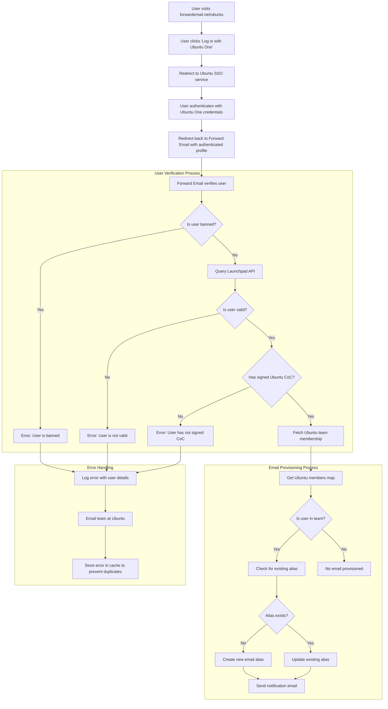

# Vaka Çalışması: Canonical, Forward Email'in Açık Kaynak Kurumsal Çözümü ile Ubuntu E-posta Yönetimini Nasıl Güçlendiriyor {#case-study-how-canonical-powers-ubuntu-email-management-with-forward-emails-open-source-enterprise-solution}


## İçindekiler {#table-of-contents}

* [Önsöz](#foreword)
* [Zorluk: Karmaşık Bir E-posta Ekosistemini Yönetmek](#the-challenge-managing-a-complex-email-ecosystem)
* [Önemli Çıkarımlar](#key-takeaways)
* [Neden Forward Email](#why-forward-email)
* [Uygulama: Sorunsuz SSO Entegrasyonu](#the-implementation-seamless-sso-integration)
  * [Kimlik Doğrulama Akışı Görselleştirmesi](#authentication-flow-visualization)
  * [Teknik Uygulama Detayları](#technical-implementation-details)
* [DNS Yapılandırması ve E-posta Yönlendirme](#dns-configuration-and-email-routing)
* [Sonuçlar: Düzenlenmiş E-posta Yönetimi ve Geliştirilmiş Güvenlik](#results-streamlined-email-management-and-enhanced-security)
  * [Operasyonel Verimlilik](#operational-efficiency)
  * [Geliştirilmiş Güvenlik ve Gizlilik](#enhanced-security-and-privacy)
  * [Maliyet Tasarrufu](#cost-savings)
  * [Geliştirilmiş Katılımcı Deneyimi](#improved-contributor-experience)
* [Geleceğe Bakış: Süregelen İş Birliği](#looking-forward-continued-collaboration)
* [Sonuç: Mükemmel Bir Açık Kaynak Ortaklığı](#conclusion-a-perfect-open-source-partnership)
* [Kurumsal Müşterilere Destek](#supporting-enterprise-clients)
  * [İletişime Geçin](#get-in-touch)
  * [Forward Email Hakkında](#about-forward-email)


## Önsöz {#foreword}

Açık kaynak yazılım dünyasında, [Canonical](https://en.wikipedia.org/wiki/Canonical_\(company\)) gibi isimler çok büyük bir ağırlığa sahiptir; Canonical, dünya çapında en popüler Linux dağıtımlarından biri olan [Ubuntu](https://en.wikipedia.org/wiki/Ubuntu) şirketidir. Ubuntu, [Kubuntu](https://en.wikipedia.org/wiki/Kubuntu), [Lubuntu](https://en.wikipedia.org/wiki/Lubuntu), [Edubuntu](https://en.wikipedia.org/wiki/Edubuntu) ve diğerlerini içeren geniş bir ekosisteme sahip olan Canonical, çok sayıda alan adı arasında e-posta adreslerini yönetirken benzersiz zorluklarla karşılaştı. Bu vaka çalışması, Canonical'ın Forward Email ile nasıl iş birliği yaparak açık kaynak değerleriyle mükemmel uyumlu, sorunsuz, güvenli ve gizlilik odaklı bir kurumsal e-posta yönetim çözümü oluşturduğunu inceliyor.


## Zorluk: Karmaşık Bir E-posta Ekosistemini Yönetmek {#the-challenge-managing-a-complex-email-ecosystem}

Canonical'ın ekosistemi çeşitli ve geniştir. Dünya çapında milyonlarca kullanıcı ve çeşitli projelerde binlerce katkıda bulunan ile, birden fazla alan adı arasında e-posta adreslerini yönetmek önemli zorluklar ortaya koydu. Temel katkıda bulunanların, projeye katılımlarını yansıtan resmi e-posta adreslerine (@ubuntu.com, @kubuntu.org vb.) ihtiyacı vardı ve bu adreslerin güvenlik ve kullanım kolaylığı açısından sağlam bir Ubuntu alan adı yönetim sistemiyle desteklenmesi gerekiyordu.

Forward Email'i uygulamadan önce Canonical şu sorunlarla mücadele ediyordu:

* Birden fazla alan adı arasında e-posta adreslerini yönetmek (@ubuntu.com, @kubuntu.org, @lubuntu.me, @edubuntu.org ve @ubuntu.net)
* Temel katkıda bulunanlar için tutarlı bir e-posta deneyimi sağlamak
* E-posta hizmetlerini mevcut [Ubuntu One](https://en.wikipedia.org/wiki/Ubuntu_One) Tek Oturum Açma (SSO) sistemi ile entegre etmek
* Gizlilik, güvenlik ve açık kaynak e-posta güvenliği taahhütlerine uygun bir çözüm bulmak
* Güvenli e-posta altyapısını maliyet etkin şekilde ölçeklendirmek


## Önemli Çıkarımlar {#key-takeaways}

* Canonical, birden fazla Ubuntu alan adı arasında birleşik bir e-posta yönetim çözümünü başarıyla uyguladı
* Forward Email'in %100 açık kaynak yaklaşımı Canonical'ın değerleriyle mükemmel uyum sağladı
* Ubuntu One ile SSO entegrasyonu, katkıda bulunanlar için sorunsuz kimlik doğrulama sağlıyor
* Kuantum dirençli şifreleme, tüm e-posta iletişimleri için uzun vadeli güvenlik sunuyor
* Çözüm, Canonical'ın büyüyen katkıda bulunan tabanını desteklemek için maliyet etkin şekilde ölçekleniyor


## Neden Forward Email {#why-forward-email}
Gizlilik ve güvenliğe odaklanan tek %100 açık kaynaklı e-posta servis sağlayıcısı olarak, Forward Email Canonical'ın kurumsal e-posta yönlendirme ihtiyaçları için doğal bir uyum sağladı. Değerlerimiz, Canonical'ın açık kaynak yazılım ve gizlilik taahhüdü ile mükemmel şekilde örtüştü.

Forward Email'i ideal seçim yapan temel faktörler şunlardı:

1. **Tamamen açık kaynak kod tabanı**: Platformumuzun tamamı açık kaynaklıdır ve [GitHub](https://en.wikipedia.org/wiki/GitHub) üzerinde erişilebilir, bu da şeffaflık ve topluluk katkılarına olanak tanır. Sadece ön yüzlerini açık kaynak yapan ve arka uçlarını kapalı tutan birçok "gizlilik odaklı" e-posta sağlayıcısının aksine, tüm kod tabanımızı—hem ön yüz hem arka uç—herkesin incelemesi için [GitHub](https://github.com/forwardemail/forwardemail.net) üzerinde erişime açtık.

2. **Gizlilik odaklı yaklaşım**: Diğer sağlayıcıların aksine, e-postaları paylaşılan veritabanlarında saklamıyoruz ve TLS ile güçlü şifreleme kullanıyoruz. Temel gizlilik felsefemiz basittir: **e-postalarınız size ve sadece size aittir**. Bu ilke, e-posta yönlendirmeyi nasıl ele aldığımızdan şifrelemeyi nasıl uyguladığımıza kadar her teknik kararı yönlendirir.

3. **Üçüncü taraflara bağımlılık yok**: Amazon SES veya diğer üçüncü taraf hizmetleri kullanmıyoruz, böylece e-posta altyapısı üzerinde tam kontrol sağlıyor ve üçüncü taraf hizmetler yoluyla olası gizlilik sızıntılarını ortadan kaldırıyoruz.

4. **Maliyet etkin ölçeklenebilirlik**: Fiyatlandırma modelimiz, kuruluşların kullanıcı başına ödeme yapmadan ölçeklenmesine olanak tanır, bu da Canonical'ın geniş katkı sağlayıcı tabanı için idealdir.

5. **Kuantuma dayanıklı şifreleme**: Her biri ayrı ayrı şifrelenmiş SQLite posta kutuları kullanıyoruz ve şifreleme için [ChaCha20-Poly1305](https://en.wikipedia.org/wiki/ChaCha20-Poly1305) algoritmasını tercih ediyoruz [kuantuma dayanıklı şifreleme](/blog/docs/best-quantum-safe-encrypted-email-service) kapsamında. Her posta kutusu ayrı bir şifreli dosyadır, bu da bir kullanıcının verilerine erişimin diğerlerine erişim sağlamadığı anlamına gelir.


## Uygulama: Sorunsuz SSO Entegrasyonu {#the-implementation-seamless-sso-integration}

Uygulamanın en kritik yönlerinden biri, Canonical'ın mevcut Ubuntu One SSO sistemi ile entegrasyondu. Bu entegrasyon, temel katkı sağlayıcıların @ubuntu.com e-posta adreslerini mevcut Ubuntu One kimlik bilgileriyle yönetmelerine olanak tanıyacaktı.

### Kimlik Doğrulama Akışı Görselleştirmesi {#authentication-flow-visualization}

Aşağıdaki diyagram, tam kimlik doğrulama ve e-posta sağlama akışını göstermektedir:


```mermaid
flowchart TD
    A[User visits forwardemail.net/ubuntu] --> B[User clicks 'Log in with Ubuntu One']
    B --> C[Redirect to Ubuntu SSO service]
    C --> D[User authenticates with Ubuntu One credentials]
    D --> E[Redirect back to Forward Email with authenticated profile]
    E --> F[Forward Email verifies user]

    subgraph "User Verification Process"
        F --> G{Is user banned?}
        G -->|Yes| H[Error: User is banned]
        G -->|No| I[Query Launchpad API]
        I --> J{Is user valid?}
        J -->|No| K[Error: User is not valid]
        J -->|Yes| L{Has signed Ubuntu CoC?}
        L -->|No| M[Error: User has not signed CoC]
        L -->|Yes| N[Fetch Ubuntu team membership]
    end

    subgraph "Email Provisioning Process"
        N --> O[Get Ubuntu members map]
        O --> P{Is user in team?}
        P -->|Yes| Q[Check for existing alias]
        Q --> R{Alias exists?}
        R -->|No| S[Create new email alias]
        R -->|Yes| T[Update existing alias]
        S --> U[Send notification email]
        T --> U
        P -->|No| V[No email provisioned]
    end

    subgraph "Error Handling"
        H --> W[Log error with user details]
        K --> W
        M --> W
        W --> X[Email team at Ubuntu]
        X --> Y[Store error in cache to prevent duplicates]
    end
```

### Teknik Uygulama Detayları {#technical-implementation-details}

Forward Email ile Ubuntu One SSO arasındaki entegrasyon, passport-ubuntu kimlik doğrulama stratejisinin özel bir uygulamasıyla gerçekleştirildi. Bu, Ubuntu One ile Forward Email sistemleri arasında sorunsuz bir kimlik doğrulama akışı sağladı.
#### Kimlik Doğrulama Akışı {#the-authentication-flow}

Kimlik doğrulama süreci şu şekilde işler:

1. Kullanıcılar, özel Ubuntu e-posta yönetim sayfasını [forwardemail.net/ubuntu](https://forwardemail.net/ubuntu) adresinde ziyaret eder
2. "Ubuntu One ile Giriş Yap" seçeneğine tıklar ve Ubuntu SSO servisine yönlendirilirler
3. Ubuntu One kimlik bilgileriyle doğrulandıktan sonra, kimlik doğrulanmış profilleriyle Forward Email'e geri yönlendirilirler
4. Forward Email, katkıda bulunan statülerini doğrular ve e-posta adreslerini buna göre sağlar veya yönetir

Teknik uygulama, Ubuntu ile [OpenID](https://en.wikipedia.org/wiki/OpenID) kullanarak kimlik doğrulama için bir [Passport](https://www.npmjs.com/package/passport) stratejisi olan [`passport-ubuntu`](https://www.npmjs.com/package/passport-ubuntu) paketini kullandı. Yapılandırma şunları içeriyordu:

```javascript
passport.use(new UbuntuStrategy({
  returnURL: process.env.UBUNTU_CALLBACK_URL,
  realm: process.env.UBUNTU_REALM,
  stateless: true
}, function(identifier, profile, done) {
  // Kullanıcı doğrulama ve e-posta sağlama mantığı
}));
```

#### Launchpad API Entegrasyonu ve Doğrulama {#launchpad-api-integration-and-validation}

Uygulamamızın kritik bir bileşeni, Ubuntu kullanıcılarını ve takım üyeliklerini doğrulamak için [Launchpad](https://en.wikipedia.org/wiki/Launchpad_\(website\)) API'si ile entegrasyondur. Bu entegrasyonu verimli ve güvenilir şekilde yönetmek için yeniden kullanılabilir yardımcı fonksiyonlar oluşturduk.

`sync-ubuntu-user.js` yardımcı fonksiyonu, kullanıcıları Launchpad API üzerinden doğrulamak ve e-posta adreslerini yönetmekten sorumludur. İşleyişinin basitleştirilmiş hali şöyledir:

```javascript
async function syncUbuntuUser(user, map) {
  try {
    // Kullanıcı nesnesini doğrula
    if (!_.isObject(user) ||
        !isSANB(user[fields.ubuntuUsername]) ||
        !isSANB(user[fields.ubuntuProfileID]) ||
        !isEmail(user.email))
      throw new TypeError('Geçersiz kullanıcı nesnesi');

    // Ubuntu üyeler haritası sağlanmadıysa al
    if (!(map instanceof Map))
      map = await getUbuntuMembersMap(resolver);

    // Kullanıcının yasaklı olup olmadığını kontrol et
    if (user[config.userFields.isBanned]) {
      throw new InvalidUbuntuUserError('Kullanıcı yasaklandı', { ignoreHook: true });
    }

    // Kullanıcıyı doğrulamak için Launchpad API'sine sorgu gönder
    const url = `https://api.launchpad.net/1.0/~${user[fields.ubuntuUsername]}`;
    const response = await retryRequest(url, { resolver });
    const json = await response.body.json();

    // Gerekli boolean özellikleri doğrula
    if (!json.is_valid)
      throw new InvalidUbuntuUserError('"is_valid" özelliği false döndü');

    if (!json.is_ubuntu_coc_signer)
      throw new InvalidUbuntuUserError('"is_ubuntu_coc_signer" özelliği false döndü');

    // Kullanıcı için her alanı işle
    await pMap([...map.keys()], async (name) => {
      // Veritabanında alan adını bul
      const domain = await Domains.findOne({
        name,
        plan: 'team',
        has_txt_record: true
      }).populate('members.user');

      // Bu alan için kullanıcının e-posta takma adını işle
      if (map.get(name).has(user[fields.ubuntuUsername])) {
        // Kullanıcı bu takımın üyesi, takma adı oluştur veya güncelle
        let alias = await Aliases.findOne({
          user: user._id,
          domain: domain._id,
          name: user[fields.ubuntuUsername].toLowerCase()
        });

        if (!alias) {
          // Uygun hata yönetimi ile yeni takma ad oluştur
          alias = await Aliases.create({
            user: user._id,
            domain: domain._id,
            name: user[fields.ubuntuUsername].toLowerCase(),
            recipients: [user.email],
            locale: user[config.lastLocaleField],
            is_enabled: true
          });

          // Yeni takma ad oluşturulduğuna dair yöneticilere bildirim gönder
          await emailHelper({
            template: 'alert',
            message: {
              to: adminEmailsForDomain,
              subject: `Yeni @${domain.name} e-posta adresi oluşturuldu`
            },
            locals: {
              message: `${user.email} için yeni bir e-posta adresi ${user[fields.ubuntuUsername].toLowerCase()}@${domain.name} oluşturuldu`
            }
          });
        }
      }
    });

    return true;
  } catch (err) {
    // Hataları yönet ve kaydet
    await logErrorWithUser(err, user);
    throw err;
  }
}
```
Farklı Ubuntu alan adları arasında ekip üyeliklerinin yönetimini basitleştirmek için, alan adları ile karşılık gelen Launchpad ekipleri arasında basit bir eşleme oluşturduk:

```javascript
ubuntuTeamMapping: {
  'ubuntu.com': '~ubuntumembers',
  'kubuntu.org': '~kubuntu-members',
  'lubuntu.me': '~lubuntu-members',
  'edubuntu.org': '~edubuntu-members',
  'ubuntustudio.com': '~ubuntustudio-core',
  'ubuntu.net': '~ubuntu-smtp-test'
},
```

Bu basit eşleme, ekip üyeliklerinin kontrol edilmesi ve e-posta adreslerinin sağlanması sürecini otomatikleştirmemize olanak tanır, böylece sistem yeni alan adları eklendikçe kolayca bakım yapılabilir ve genişletilebilir.

#### Hata Yönetimi ve Bildirimler {#error-handling-and-notifications}

Aşağıdaki özelliklere sahip sağlam bir hata yönetim sistemi uyguladık:

1. Tüm hataları ayrıntılı kullanıcı bilgileriyle kaydeder
2. Sorun tespit edildiğinde Ubuntu ekibine e-posta gönderir
3. Yeni katkıda bulunanlar kayıt olduğunda ve e-posta adresleri oluşturulduğunda yöneticileri bilgilendirir
4. Ubuntu Davranış Kuralları'nı imzalamamış kullanıcılar gibi uç durumları ele alır

Bu, herhangi bir sorunun hızlıca tespit edilip çözülmesini sağlar ve e-posta sisteminin bütünlüğünü korur.


## DNS Yapılandırması ve E-posta Yönlendirme {#dns-configuration-and-email-routing}

Forward Email aracılığıyla yönetilen her alan adı için Canonical, doğrulama amacıyla basit bir DNS TXT kaydı ekledi:

```sh
❯ dig ubuntu.com txt
ubuntu.com.             600     IN      TXT     "forward-email-site-verification=6IsURgl2t7"
```

Bu doğrulama kaydı, alan adı sahipliğini onaylar ve sistemimizin bu alan adları için güvenli bir şekilde e-posta yönetimi yapmasını sağlar. Canonical, Postfix üzerinden hizmetimize posta yönlendirir; bu da güvenilir ve güvenli bir e-posta teslim altyapısı sunar.


## Sonuçlar: Kolaylaştırılmış E-posta Yönetimi ve Geliştirilmiş Güvenlik {#results-streamlined-email-management-and-enhanced-security}

Forward Email'in kurumsal çözümünün uygulanması, Canonical'ın tüm alan adları genelinde e-posta yönetiminde önemli faydalar sağladı:

### Operasyonel Verimlilik {#operational-efficiency}

* **Merkezi yönetim**: Tüm Ubuntu ile ilgili alan adları artık tek bir arayüz üzerinden yönetiliyor
* **Azaltılmış idari yük**: Katkıda bulunanlar için otomatik sağlama ve kendi kendine yönetim
* **Basitleştirilmiş işe alım**: Yeni katkıda bulunanlar resmi e-posta adreslerini hızlıca alabilir

### Geliştirilmiş Güvenlik ve Gizlilik {#enhanced-security-and-privacy}

* **Uçtan uca şifreleme**: Tüm e-postalar gelişmiş standartlarla şifrelenir
* **Paylaşılan veritabanı yok**: Her kullanıcının e-postaları, geleneksel paylaşılan ilişkisel veritabanlarından temel olarak daha güvenli olan bireysel şifrelenmiş SQLite veritabanlarında saklanır; bu, sandbox'lanmış bir şifreleme yaklaşımıdır
* **Açık kaynak güvenliği**: Şeffaf kod tabanı topluluk güvenlik incelemelerine olanak tanır
* **Bellek içi işleme**: İletilen e-postaları diske kaydetmeyiz, bu da gizlilik korumasını artırır
* **Meta veri saklanmaz**: Pek çok e-posta sağlayıcısının aksine, kimin kime e-posta gönderdiğine dair kayıt tutmayız

### Maliyet Tasarrufu {#cost-savings}

* **Ölçeklenebilir fiyatlandırma modeli**: Kullanıcı başına ücret yok, bu sayede Canonical katkıda bulunan ekledikçe maliyet artmaz
* **Azaltılmış altyapı ihtiyacı**: Farklı alan adları için ayrı e-posta sunucuları tutmaya gerek yok
* **Daha az destek gereksinimi**: Kendi kendine yönetim, BT destek taleplerini azaltır

### Geliştirilmiş Katkıda Bulunan Deneyimi {#improved-contributor-experience}

* **Sorunsuz kimlik doğrulama**: Mevcut Ubuntu One kimlik bilgileriyle tek oturum açma
* **Tutarlı marka deneyimi**: Tüm Ubuntu ile ilgili hizmetlerde birleşik deneyim
* **Güvenilir e-posta teslimi**: Yüksek kaliteli IP itibarı, e-postaların hedefe ulaşmasını sağlar

Forward Email ile entegrasyon, Canonical'ın e-posta yönetim sürecini önemli ölçüde kolaylaştırdı. Katkıda bulunanlar artık @ubuntu.com e-posta adreslerini yönetirken sorunsuz bir deneyim yaşamakta, idari yük azalmış ve güvenlik artırılmıştır.


## Geleceğe Bakış: Süregelen İş Birliği {#looking-forward-continued-collaboration}

Canonical ile Forward Email arasındaki ortaklık gelişmeye devam ediyor. Birlikte birkaç girişim üzerinde çalışıyoruz:
* Ek e-posta hizmetlerini Ubuntu ile ilgili diğer alan adlarına genişletmek
* Katılımcı geri bildirimlerine dayanarak kullanıcı arayüzünü geliştirmek
* Ek güvenlik özellikleri uygulamak
* Açık kaynak iş birliğimizi kullanmanın yeni yollarını keşfetmek


## Sonuç: Mükemmel Bir Açık Kaynak Ortaklığı {#conclusion-a-perfect-open-source-partnership}

Canonical ile Forward Email arasındaki iş birliği, paylaşılan değerlere dayalı ortaklıkların gücünü göstermektedir. Forward Email'i e-posta hizmet sağlayıcısı olarak seçerek, Canonical teknik gereksinimlerini karşılayan ve aynı zamanda açık kaynak yazılım, gizlilik ve güvenlik taahhütleriyle mükemmel şekilde uyumlu bir çözüm buldu.

Birden fazla alan adını yöneten ve mevcut sistemlerle sorunsuz kimlik doğrulama gerektiren organizasyonlar için Forward Email esnek, güvenli ve gizliliğe odaklı bir çözüm sunar. Bizim [açık kaynak yaklaşımımız](https://forwardemail.net/blog/docs/why-open-source-email-security-privacy) şeffaflık sağlar ve topluluk katkılarına izin verir, bu da bu ilkeleri önemseyen organizasyonlar için ideal bir seçimdir.

Canonical ve Forward Email kendi alanlarında yenilik yapmaya devam ederken, bu ortaklık açık kaynak iş birliği ve paylaşılan değerlerin etkili çözümler yaratmadaki gücünün bir kanıtı olarak durmaktadır.

Mevcut e-posta teslim performansımızı görmek için [gerçek zamanlı hizmet durumumuzu](https://status.forwardemail.net) kontrol edebilirsiniz; yüksek kaliteli IP itibarı ve e-posta teslim edilebilirliğini sağlamak için sürekli izlemekteyiz.


## Kurumsal Müşterilere Destek {#supporting-enterprise-clients}

Bu vaka çalışması Canonical ile ortaklığımıza odaklansa da, Forward Email gizlilik, güvenlik ve açık kaynak ilkelerine bağlılığımızı değer veren çeşitli sektörlerdeki çok sayıda kurumsal müşteriye gururla destek vermektedir.

Kurumsal çözümlerimiz, her büyüklükteki organizasyonun özel ihtiyaçlarını karşılayacak şekilde uyarlanmıştır ve şunları sunar:

* Birden fazla alan adı arasında özel alan adı [e-posta yönetimi](/)
* Mevcut kimlik doğrulama sistemleriyle sorunsuz entegrasyon
* Özel Matrix sohbet destek kanalı
* [Kuantum dirençli şifreleme](/blog/docs/best-quantum-safe-encrypted-email-service) dahil geliştirilmiş güvenlik özellikleri
* Tam veri taşınabilirliği ve sahipliği
* Şeffaflık ve güven için %100 açık kaynak altyapı

### İletişime Geçin {#get-in-touch}

Organizasyonunuzun kurumsal e-posta ihtiyaçları varsa veya Forward Email'in e-posta yönetiminizi kolaylaştırırken gizlilik ve güvenliği nasıl artırabileceği hakkında daha fazla bilgi edinmek istiyorsanız, sizden haber almak isteriz:

* Doğrudan bize `support@forwardemail.net` adresinden e-posta gönderin
* [Yardım sayfamızdan](https://forwardemail.net/help) destek talebi gönderin
* Kurumsal planlar için [fiyatlandırma sayfamızı](https://forwardemail.net/pricing) kontrol edin

Ekibimiz, özel gereksinimlerinizi görüşmeye ve organizasyonunuzun değerleri ile teknik ihtiyaçlarına uygun özelleştirilmiş bir çözüm geliştirmeye hazırdır.

### Forward Email Hakkında {#about-forward-email}

Forward Email, %100 açık kaynaklı ve gizlilik odaklı bir e-posta hizmetidir. Güvenlik, gizlilik ve şeffaflığa odaklanarak özel alan adı e-posta yönlendirme, SMTP, IMAP ve POP3 hizmetleri sunarız. Tüm kod tabanımız [GitHub](https://github.com/forwardemail/forwardemail.net) üzerinde mevcuttur ve kullanıcı gizliliği ile güvenliğine saygı duyan e-posta hizmetleri sağlamaya kararlıyız. [Neden açık kaynak e-postanın geleceği olduğunu](https://forwardemail.net/blog/docs/why-open-source-email-security-privacy), [e-posta yönlendirmemizin nasıl çalıştığını](https://forwardemail.net/blog/docs/best-email-forwarding-service) ve [e-posta gizliliği koruma yaklaşımımızı](https://forwardemail.net/blog/docs/email-privacy-protection-technical-implementation) öğrenin.
