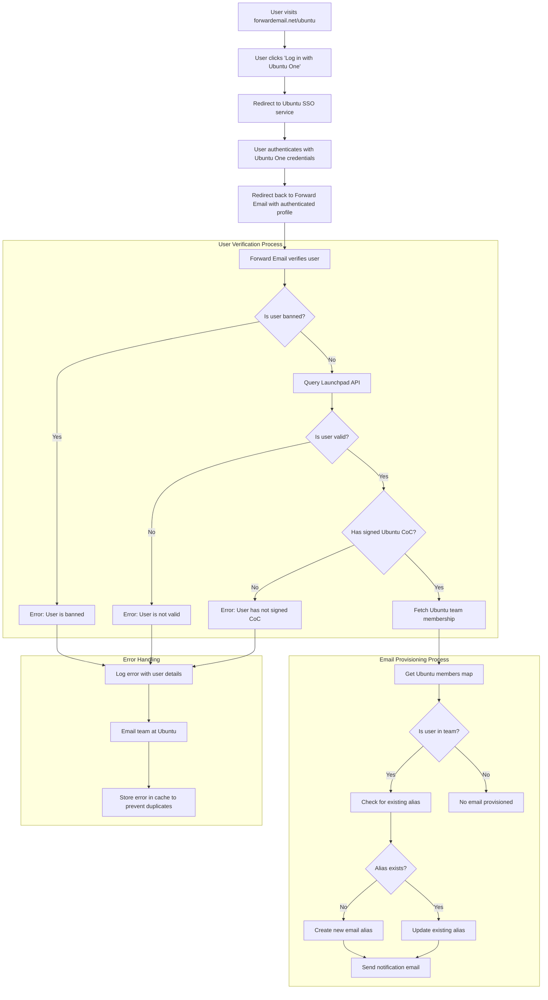

# Тематичне дослідження: Як Canonical покращує управління електронною поштою в Ubuntu за допомогою корпоративного рішення з відкритим кодом Forward Email {#case-study-how-canonical-powers-ubuntu-email-management-with-forward-emails-open-source-enterprise-solution}


## Зміст {#table-of-contents}

* [Передмова](#foreword)
* [Завдання: Управління складною екосистемою електронної пошти](#the-challenge-managing-a-complex-email-ecosystem)
* [Ключові висновки](#key-takeaways)
* [Навіщо пересилати електронні листи](#why-forward-email)
* [Впровадження: безперебійна інтеграція SSO](#the-implementation-seamless-sso-integration)
  * [Візуалізація процесу автентифікації](#authentication-flow-visualization)
  * [Деталі технічної реалізації](#technical-implementation-details)
* [Налаштування DNS та маршрутизація електронної пошти](#dns-configuration-and-email-routing)
* [Результати: Оптимізоване керування електронною поштою та покращена безпека](#results-streamlined-email-management-and-enhanced-security)
  * [Операційна ефективність](#operational-efficiency)
  * [Покращена безпека та конфіденційність](#enhanced-security-and-privacy)
  * [Економія коштів](#cost-savings)
  * [Покращений досвід роботи з авторами](#improved-contributor-experience)
* [Погляд у майбутнє: продовження співпраці](#looking-forward-continued-collaboration)
* [Висновок: Ідеальне партнерство з відкритим кодом](#conclusion-a-perfect-open-source-partnership)
* [Підтримка корпоративних клієнтів](#supporting-enterprise-clients)
  * [Зв'яжіться з нами](#get-in-touch)
  * [Про пересилання електронної пошти](#about-forward-email)

## Передмова {#foreword}

У світі програмного забезпечення з відкритим кодом мало хто має таку вагу, як [Канонічний](https://en.wikipedia.org/wiki/Canonical_\(company\)), компанія, що стоїть за [Убунту](https://en.wikipedia.org/wiki/Ubuntu), одним із найпопулярніших дистрибутивів Linux у світі. Маючи величезну екосистему, що охоплює кілька дистрибутивів, включаючи Ubuntu, [Безкоштовно](https://en.wikipedia.org/wiki/Kubuntu), [Лубунту](https://en.wikipedia.org/wiki/Lubuntu), [Едубунту](https://en.wikipedia.org/wiki/Edubuntu) та інші, Canonical зіткнулася з унікальними проблемами в управлінні адресами електронної пошти на своїх численних доменах. У цьому тематичному дослідженні досліджується, як Canonical співпрацювала з Forward Email, щоб створити безперебійне, безпечне та орієнтоване на конфіденційність корпоративне рішення для управління електронною поштою, яке ідеально відповідає їхнім цінностям відкритого коду.

## Завдання: керування складною екосистемою електронної пошти {#the-challenge-managing-a-complex-email-ecosystem}

Екосистема Canonical різноманітна та розширена. З мільйонами користувачів по всьому світу та тисячами учасників у різних проектах, керування адресами електронної пошти в кількох доменах становило значні труднощі. Основним учасникам потрібні були офіційні адреси електронної пошти (@ubuntu.com, @kubuntu.org тощо), які б відображали їхню причетність до проекту, зберігаючи при цьому безпеку та зручність використання завдяки надійній системі керування доменами Ubuntu.

Перед впровадженням Forward Email, Canonical мала такі труднощі:

* Керування адресами електронної пошти в кількох доменах (@ubuntu.com, @kubuntu.org, @lubuntu.me, @edubuntu.org та @ubuntu.net)
* Забезпечення узгодженого користування електронною поштою для основних учасників
* Інтеграція поштових служб з їхньою існуючою системою єдиного входу (SSO) [Ubuntu Один](https://en.wikipedia.org/wiki/Ubuntu_One)
* Пошук рішення, яке відповідає їхнім зобов'язанням щодо конфіденційності, безпеки та безпеки електронної пошти з відкритим кодом
* Масштабування їхньої безпечної інфраструктури електронної пошти економічно ефективним способом

## Ключові висновки {#key-takeaways}

* Canonical успішно впровадила єдине рішення для керування електронною поштою на кількох доменах Ubuntu
* Підхід Forward Email з відкритим кодом на 100% ідеально відповідає цінностям Canonical
* Інтеграція SSO з Ubuntu One забезпечує безперебійну автентифікацію для учасників
* Квантово-стійке шифрування гарантує довгострокову безпеку всіх електронних листів
* Рішення масштабується економічно ефективно для підтримки зростаючої бази учасників Canonical

## Чому пересилати електронні листи {#why-forward-email}

Як єдиний постачальник послуг електронної пошти зі 100% відкритим кодом, який зосереджується на конфіденційності та безпеці, Forward Email був природним рішенням для потреб Canonical у пересиланні електронної пошти підприємств. Наші цінності ідеально узгоджувалися з зобов'язанням Canonical щодо програмного забезпечення з відкритим кодом та конфіденційності.

Ключові фактори, які зробили Forward Email ідеальним вибором, включають:

1. **Повна база коду з відкритим вихідним кодом**: Уся наша платформа має відкритий вихідний код і доступна на [GitHub](https://en.wikipedia.org/wiki/GitHub), що забезпечує прозорість та внесок спільноти. На відміну від багатьох постачальників електронної пошти, які «орієнтовані на конфіденційність» і надають відкритий вихідний код лише своїм фронтендам, залишаючи свої серверні частини закритими, ми зробили всю нашу базу коду — як фронтенд, так і серверну — доступною для ознайомлення будь-кого на [GitHub](https://github.com/forwardemail/forwardemail.net).

2. **Підхід, орієнтований на конфіденційність**: На відміну від інших постачальників, ми не зберігаємо електронні листи у спільних базах даних і використовуємо надійне шифрування за допомогою TLS. Наша фундаментальна філософія конфіденційності проста: **ваші електронні листи належать вам і тільки вам**. Цей принцип керує кожним нашим технічним рішенням, від того, як ми пересилаємо електронні листи, до того, як ми впроваджуємо шифрування.

3. **Відсутність залежності від третіх сторін**: Ми не використовуємо Amazon SES чи інші сторонні сервіси, що дає нам повний контроль над інфраструктурою електронної пошти та усуває потенційні витоки конфіденційності через сторонні сервіси.

4. **Економічно ефективне масштабування**: Наша модель ціноутворення дозволяє організаціям масштабуватися, не платячи за кожного користувача, що робить її ідеальною для великої бази учасників Canonical.

5. **Квантово-стійке шифрування**: Ми використовуємо індивідуально зашифровані поштові скриньки SQLite з [ЧаЧа20-Полі1305](https://en.wikipedia.org/wiki/ChaCha20-Poly1305) як шифром для [квантово-стійке шифрування](/blog/docs/best-quantum-safe-encrypted-email-service). Кожна поштова скринька — це окремий зашифрований файл, тобто доступ до даних одного користувача не надає доступу іншим.

## Реалізація: Безшовна інтеграція SSO {#the-implementation-seamless-sso-integration}

Одним із найважливіших аспектів впровадження була інтеграція з існуючою системою єдиного входу Ubuntu One від Canonical. Ця інтеграція дозволила б основним учасникам керувати своїми адресами електронної пошти @ubuntu.com, використовуючи свої існуючі облікові дані Ubuntu One.

### Візуалізація процесу автентифікації {#authentication-flow-visualization}

Наведена нижче діаграма ілюструє повний процес автентифікації та налаштування електронної пошти:



### Технічні деталі впровадження {#technical-implementation-details}

Інтеграцію між Forward Email та єдиним вхідним входом Ubuntu One було здійснено за допомогою спеціальної реалізації стратегії автентифікації passport-ubuntu. Це забезпечило безперебійний потік автентифікації між системами Ubuntu One та Forward Email.

#### Процес автентифікації {#the-authentication-flow}

Процес автентифікації працює наступним чином:

1. Користувачі відвідують спеціальну сторінку керування електронною поштою Ubuntu за адресою [forwardemail.net/ubuntu](https://forwardemail.net/ubuntu)
2. Вони натискають кнопку «Увійти за допомогою Ubuntu One» та перенаправляються до служби єдиного входу Ubuntu
3. Після автентифікації за допомогою своїх облікових даних Ubuntu One їх перенаправляє назад до служби «Переадресація електронної пошти» з їхнім автентифікованим профілем
4. Служба «Переадресація електронної пошти» перевіряє їхній статус учасника та відповідно надає або керує їхньою адресою електронної пошти

Технічна реалізація використовувала пакет [`passport-ubuntu`](https://www.npmjs.com/package/passport-ubuntu), який є стратегією [Паспорт](https://www.npmjs.com/package/passport) для автентифікації в Ubuntu за допомогою [OpenID](https://en.wikipedia.org/wiki/OpenID). Конфігурація включала:

```javascript
passport.use(new UbuntuStrategy({
  returnURL: process.env.UBUNTU_CALLBACK_URL,
  realm: process.env.UBUNTU_REALM,
  stateless: true
}, function(identifier, profile, done) {
  // User verification and email provisioning logic
}));
```

#### Інтеграція та перевірка API Launchpad {#launchpad-api-integration-and-validation}

Критичним компонентом нашої реалізації є інтеграція з API [Стартова панель](https://en.wikipedia.org/wiki/Launchpad_\(website\)) для перевірки користувачів Ubuntu та їхньої членської приналежності до команд. Ми створили допоміжні функції багаторазового використання для ефективної та надійної обробки цієї інтеграції.

Допоміжна функція `sync-ubuntu-user.js` відповідає за перевірку користувачів через API Launchpad та керування їхніми адресами електронної пошти. Ось спрощена версія того, як вона працює:

```javascript
async function syncUbuntuUser(user, map) {
  try {
    // Validate user object
    if (!_.isObject(user) ||
        !isSANB(user[fields.ubuntuUsername]) ||
        !isSANB(user[fields.ubuntuProfileID]) ||
        !isEmail(user.email))
      throw new TypeError('Invalid user object');

    // Get Ubuntu members map if not provided
    if (!(map instanceof Map))
      map = await getUbuntuMembersMap(resolver);

    // Check if user is banned
    if (user[config.userFields.isBanned]) {
      throw new InvalidUbuntuUserError('User was banned', { ignoreHook: true });
    }

    // Query Launchpad API to validate user
    const url = `https://api.launchpad.net/1.0/~${user[fields.ubuntuUsername]}`;
    const response = await retryRequest(url, { resolver });
    const json = await response.body.json();

    // Validate required boolean properties
    if (!json.is_valid)
      throw new InvalidUbuntuUserError('Property "is_valid" was false');

    if (!json.is_ubuntu_coc_signer)
      throw new InvalidUbuntuUserError('Property "is_ubuntu_coc_signer" was false');

    // Process each domain for the user
    await pMap([...map.keys()], async (name) => {
      // Find domain in database
      const domain = await Domains.findOne({
        name,
        plan: 'team',
        has_txt_record: true
      }).populate('members.user');

      // Process user's email alias for this domain
      if (map.get(name).has(user[fields.ubuntuUsername])) {
        // User is a member of this team, create or update alias
        let alias = await Aliases.findOne({
          user: user._id,
          domain: domain._id,
          name: user[fields.ubuntuUsername].toLowerCase()
        });

        if (!alias) {
          // Create new alias with appropriate error handling
          alias = await Aliases.create({
            user: user._id,
            domain: domain._id,
            name: user[fields.ubuntuUsername].toLowerCase(),
            recipients: [user.email],
            locale: user[config.lastLocaleField],
            is_enabled: true
          });

          // Notify admins about new alias creation
          await emailHelper({
            template: 'alert',
            message: {
              to: adminEmailsForDomain,
              subject: `New @${domain.name} email address created`
            },
            locals: {
              message: `A new email address ${user[fields.ubuntuUsername].toLowerCase()}@${domain.name} was created for ${user.email}`
            }
          });
        }
      }
    });

    return true;
  } catch (err) {
    // Handle and log errors
    await logErrorWithUser(err, user);
    throw err;
  }
}
```

Щоб спростити керування членством у командах у різних доменах Ubuntu, ми створили просте зіставлення між доменними іменами та відповідними їм командами Launchpad:

```javascript
ubuntuTeamMapping: {
  'ubuntu.com': '~ubuntumembers',
  'kubuntu.org': '~kubuntu-members',
  'lubuntu.me': '~lubuntu-members',
  'edubuntu.org': '~edubuntu-members',
  'ubuntustudio.com': '~ubuntustudio-core',
  'ubuntu.net': '~ubuntu-smtp-test'
},
```

Це просте зіставлення дозволяє нам автоматизувати процес перевірки членства в команді та надання адрес електронної пошти, що спрощує обслуговування та розширення системи в міру додавання нових доменів.

#### Обробка помилок та сповіщення {#error-handling-and-notifications}

Ми впровадили надійну систему обробки помилок, яка:

1. Реєструє всі помилки з детальною інформацією про користувачів.
2. Надсилає електронні листи команді Ubuntu про виявлення проблем.
3. Повідомляє адміністраторів про реєстрацію нових учасників та створення адрес електронної пошти.
4. Обробляє крайні випадки, такі як користувачі, які не підписали Кодекс поведінки Ubuntu.

Це гарантує швидке виявлення та вирішення будь-яких проблем, зберігаючи цілісність системи електронної пошти.

## Налаштування DNS та маршрутизація електронної пошти {#dns-configuration-and-email-routing}

Для кожного домену, керованого через Forward Email, Canonical додала простий TXT-запис DNS для перевірки:

```sh
❯ dig ubuntu.com txt
ubuntu.com.             600     IN      TXT     "forward-email-site-verification=6IsURgl2t7"
```

Цей запис підтвердження підтверджує право власності на домен і дозволяє нашій системі безпечно керувати електронною поштою для цих доменів. Canonical направляє пошту через наш сервіс через Postfix, що забезпечує надійну та безпечну інфраструктуру доставки електронної пошти.

## Результати: Оптимізоване керування електронною поштою та покращена безпека {#results-streamlined-email-management-and-enhanced-security}

Впровадження корпоративного рішення Forward Email принесло значні переваги для управління електронною поштою Canonical у всіх їхніх доменах:

### Операційна ефективність {#operational-efficiency}

* **Централізоване керування**: Усі домени, пов’язані з Ubuntu, тепер керуються через єдиний інтерфейс
* **Зменшення адміністративних витрат**: Автоматизоване налаштування та самостійне керування для учасників
* **Спрощена адаптація**: Нові учасники можуть швидко отримати свої офіційні адреси електронної пошти

### Покращена безпека та конфіденційність {#enhanced-security-and-privacy}

* **Наскрізне шифрування**: Усі електронні листи шифруються за допомогою передових стандартів
* **Без спільних баз даних**: Електронні листи кожного користувача зберігаються в окремих зашифрованих базах даних SQLite, що забезпечує ізольований підхід до шифрування, який є принципово безпечнішим, ніж традиційні спільні реляційні бази даних
* **Безпека з відкритим вихідним кодом**: Прозора база коду дозволяє проводити перевірки безпеки спільнотою
* **Обробка в пам'яті**: Ми не зберігаємо переслані електронні листи на диску, що покращує захист конфіденційності
* **Без зберігання метаданих**: Ми не ведемо облік того, хто кому надсилає електронні листи, на відміну від багатьох постачальників послуг електронної пошти

### Економія коштів {#cost-savings}

* **Масштабована модель ціноутворення**: Відсутність плати за кожного користувача, що дозволяє Canonical додавати учасників без збільшення витрат
* **Зменшення потреб у інфраструктурі**: Немає потреби підтримувати окремі поштові сервери для різних доменів
* **Нижчі вимоги до підтримки**: Самостійне керування зменшує кількість заявок на ІТ-підтримку

### Покращений досвід роботи з авторами {#improved-contributor-experience}

* **Безперешкодна автентифікація**: єдиний вхід з існуючими обліковими даними Ubuntu One
* **Узгоджений брендинг**: єдиний інтерфейс для всіх сервісів, пов’язаних з Ubuntu
* **Надійна доставка електронної пошти**: висока репутація IP-адреси гарантує, що листи досягнуть місця призначення

Інтеграція з Forward Email значно спростила процес керування електронною поштою Canonical. Тепер учасники мають безперешкодний процес керування своїми адресами електронної пошти @ubuntu.com зі зменшенням адміністративних витрат та підвищеною безпекою.

## З нетерпінням чекаємо: продовження співпраці {#looking-forward-continued-collaboration}

Партнерство між Canonical та Forward Email продовжує розвиватися. Ми працюємо разом над кількома ініціативами:

* Розширення поштових служб на додаткові домени, пов'язані з Ubuntu
* Покращення інтерфейсу користувача на основі відгуків учасників
* Впровадження додаткових функцій безпеки
* Вивчення нових способів використання нашої співпраці з відкритим кодом

## Висновок: Ідеальне партнерство з відкритим кодом {#conclusion-a-perfect-open-source-partnership}

Співпраця між Canonical та Forward Email демонструє силу партнерських відносин, побудованих на спільних цінностях. Обравши Forward Email своїм постачальником послуг електронної пошти, Canonical знайшла рішення, яке не лише відповідало їхнім технічним вимогам, але й ідеально відповідало їхній відданості програмному забезпеченню з відкритим кодом, конфіденційності та безпеці.

Для організацій, які керують кількома доменами та потребують безперебійної автентифікації за допомогою існуючих систем, Forward Email пропонує гнучке, безпечне та орієнтоване на конфіденційність рішення. Наш [підхід з відкритим кодом](https://forwardemail.net/blog/docs/why-open-source-email-security-privacy) забезпечує прозорість та дозволяє робити внески спільноти, що робить його ідеальним вибором для організацій, які цінують ці принципи.

Оскільки Canonical та Forward Email продовжують впроваджувати інновації у своїх відповідних галузях, це партнерство є свідченням сили співпраці з відкритим кодом та спільних цінностей у створенні ефективних рішень.

Ви можете перевірити наш [стан послуги в режимі реального часу](https://status.forwardemail.net), щоб побачити поточну ефективність доставки електронної пошти, яку ми постійно контролюємо, щоб забезпечити високу якість репутації IP-адреси та доставку електронної пошти.

## Підтримка корпоративних клієнтів {#supporting-enterprise-clients}

Хоча цей тематичний аналіз зосереджений на нашому партнерстві з Canonical, Forward Email з гордістю підтримує численних корпоративних клієнтів з різних галузей, які цінують нашу відданість принципам конфіденційності, безпеки та відкритого коду.

Наші корпоративні рішення адаптовані до конкретних потреб організацій будь-якого розміру, пропонуючи:

* Власний домен [управління електронною поштою](/) для кількох доменів
* Безперешкодна інтеграція з існуючими системами автентифікації
* Спеціальний канал підтримки Matrix у чаті
* Розширені функції безпеки, включаючи [квантово-стійке шифрування](/blog/docs/best-quantum-safe-encrypted-email-service)
* Повна портативність даних та право власності
* 100% інфраструктура з відкритим вихідним кодом для прозорості та довіри

### Зв'яжіться з нами {#get-in-touch}

Якщо ваша організація потребує корпоративної електронної пошти або ви зацікавлені дізнатися більше про те, як функція «Пересилання електронної пошти» може допомогти оптимізувати керування електронною поштою, одночасно підвищуючи конфіденційність і безпеку, ми будемо раді почути від вас:

* Напишіть нам безпосередньо на адресу `support@forwardemail.net`
* Надішліть запит на допомогу на нашій сторінці [сторінка довідки](https://forwardemail.net/help)
* Перегляньте нашу сторінку [сторінка з цінами](https://forwardemail.net/pricing) для планів підприємств

Наша команда готова обговорити ваші конкретні вимоги та розробити індивідуальне рішення, яке відповідає цінностям та технічним потребам вашої організації.

### Про пересилання електронної пошти {#about-forward-email}

Forward Email – це сервіс електронної пошти зі 100% відкритим кодом, орієнтований на конфіденційність. Ми надаємо послуги переадресації електронної пошти на користувацькі домени, SMTP, IMAP та POP3, зосереджуючись на безпеці, конфіденційності та прозорості. Уся наша кодова база доступна на [GitHub](https://github.com/forwardemail/forwardemail.net), і ми прагнемо надавати послуги електронної пошти, які поважають конфіденційність та безпеку користувачів. Дізнайтеся більше про [чому електронна пошта з відкритим кодом — це майбутнє](https://forwardemail.net/blog/docs/why-open-source-email-security-privacy), [як працює наша переадресація електронної пошти](https://forwardemail.net/blog/docs/best-email-forwarding-service) та [наш підхід до захисту конфіденційності електронної пошти](https://forwardemail.net/blog/docs/email-privacy-protection-technical-implementation).