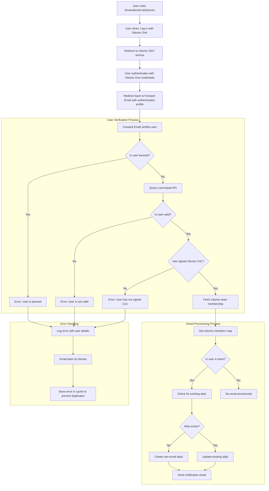

# Кейс: Як Canonical забезпечує управління електронною поштою Ubuntu за допомогою відкритого корпоративного рішення Forward Email {#case-study-how-canonical-powers-ubuntu-email-management-with-forward-emails-open-source-enterprise-solution}


## Зміст {#table-of-contents}

* [Передмова](#foreword)
* [Виклик: Управління складною екосистемою електронної пошти](#the-challenge-managing-a-complex-email-ecosystem)
* [Основні висновки](#key-takeaways)
* [Чому Forward Email](#why-forward-email)
* [Впровадження: Безшовна інтеграція SSO](#the-implementation-seamless-sso-integration)
  * [Візуалізація потоку автентифікації](#authentication-flow-visualization)
  * [Технічні деталі впровадження](#technical-implementation-details)
* [Налаштування DNS та маршрутизація електронної пошти](#dns-configuration-and-email-routing)
* [Результати: Оптимізоване управління електронною поштою та підвищена безпека](#results-streamlined-email-management-and-enhanced-security)
  * [Оперативна ефективність](#operational-efficiency)
  * [Покращена безпека та конфіденційність](#enhanced-security-and-privacy)
  * [Економія коштів](#cost-savings)
  * [Покращений досвід учасників](#improved-contributor-experience)
* [Погляд у майбутнє: Продовження співпраці](#looking-forward-continued-collaboration)
* [Висновок: Ідеальне партнерство у відкритому коді](#conclusion-a-perfect-open-source-partnership)
* [Підтримка корпоративних клієнтів](#supporting-enterprise-clients)
  * [Зв’язатися з нами](#get-in-touch)
  * [Про Forward Email](#about-forward-email)


## Передмова {#foreword}

У світі програмного забезпечення з відкритим кодом небагато імен мають таку вагу, як [Canonical](https://en.wikipedia.org/wiki/Canonical_\(company\)) — компанія, що стоїть за [Ubuntu](https://en.wikipedia.org/wiki/Ubuntu), однією з найпопулярніших дистрибутивів Linux у світі. Маючи велику екосистему, що охоплює кілька дистрибутивів, включно з Ubuntu, [Kubuntu](https://en.wikipedia.org/wiki/Kubuntu), [Lubuntu](https://en.wikipedia.org/wiki/Lubuntu), [Edubuntu](https://en.wikipedia.org/wiki/Edubuntu) та іншими, Canonical стикнулася з унікальними викликами в управлінні електронними адресами на численних доменах. Цей кейс досліджує, як Canonical співпрацювала з Forward Email для створення безшовного, безпечного та орієнтованого на конфіденційність корпоративного рішення для управління електронною поштою, яке ідеально відповідає їхнім цінностям відкритого коду.


## Виклик: Управління складною екосистемою електронної пошти {#the-challenge-managing-a-complex-email-ecosystem}

Екосистема Canonical є різноманітною та масштабною. Маючи мільйони користувачів по всьому світу та тисячі учасників у різних проєктах, управління електронними адресами на численних доменах було значним викликом. Основним учасникам потрібні були офіційні електронні адреси (@ubuntu.com, @kubuntu.org тощо), які відображали їхню участь у проєкті, при цьому забезпечуючи безпеку та зручність використання через надійну систему управління доменами Ubuntu.

До впровадження Forward Email Canonical стикалася з такими проблемами:

* Управління електронними адресами на кількох доменах (@ubuntu.com, @kubuntu.org, @lubuntu.me, @edubuntu.org та @ubuntu.net)
* Забезпечення послідовного досвіду користування електронною поштою для основних учасників
* Інтеграція поштових сервісів із їхньою існуючою системою єдиного входу (SSO) [Ubuntu One](https://en.wikipedia.org/wiki/Ubuntu_One)
* Пошук рішення, що відповідало б їхнім зобов’язанням щодо конфіденційності, безпеки та відкритого коду для безпеки електронної пошти
* Масштабування безпечної поштової інфраструктури з урахуванням витрат


## Основні висновки {#key-takeaways}

* Canonical успішно впровадила єдине рішення для управління електронною поштою на кількох доменах Ubuntu
* 100% відкритий підхід Forward Email ідеально відповідав цінностям Canonical
* Інтеграція SSO з Ubuntu One забезпечує безшовну автентифікацію для учасників
* Квантово-стійке шифрування гарантує довгострокову безпеку всіх електронних комунікацій
* Рішення масштабуються з урахуванням витрат для підтримки зростаючої бази учасників Canonical


## Чому Forward Email {#why-forward-email}
Як єдиний 100% відкритий провайдер електронної пошти з акцентом на конфіденційність та безпеку, Forward Email ідеально підходив для потреб Canonical у корпоративному пересиланні електронної пошти. Наші цінності ідеально збігалися з прагненням Canonical до відкритого програмного забезпечення та конфіденційності.

Ключові фактори, які зробили Forward Email ідеальним вибором, включали:

1. **Повністю відкритий код**: Вся наша платформа є відкритою і доступна на [GitHub](https://en.wikipedia.org/wiki/GitHub), що забезпечує прозорість і внески спільноти. На відміну від багатьох "орієнтованих на конфіденційність" провайдерів електронної пошти, які відкривають лише фронтенд, залишаючи бекенд закритим, ми зробили весь наш код — як фронтенд, так і бекенд — доступним для будь-кого на [GitHub](https://github.com/forwardemail/forwardemail.net).

2. **Підхід, орієнтований на конфіденційність**: На відміну від інших провайдерів, ми не зберігаємо листи у спільних базах даних і використовуємо надійне шифрування з TLS. Наша основна філософія конфіденційності проста: **ваші листи належать вам і тільки вам**. Цей принцип керує кожним технічним рішенням, яке ми приймаємо, від того, як ми обробляємо пересилання пошти, до того, як реалізуємо шифрування.

3. **Відсутність залежності від третіх сторін**: Ми не використовуємо Amazon SES або інші сторонні сервіси, що дає нам повний контроль над інфраструктурою електронної пошти і усуває потенційні витоки конфіденційності через сторонні сервіси.

4. **Економічне масштабування**: Наша модель ціноутворення дозволяє організаціям масштабуватися без оплати за кожного користувача, що ідеально підходить для великої бази учасників Canonical.

5. **Квантово-стійке шифрування**: Ми використовуємо індивідуально зашифровані поштові скриньки SQLite з [ChaCha20-Poly1305](https://en.wikipedia.org/wiki/ChaCha20-Poly1305) як шифр для [квантово-стійкого шифрування](/blog/docs/best-quantum-safe-encrypted-email-service). Кожна скринька — це окремий зашифрований файл, що означає, що доступ до даних одного користувача не дає доступу до інших.


## Реалізація: Безшовна інтеграція SSO {#the-implementation-seamless-sso-integration}

Одним із найважливіших аспектів реалізації була інтеграція з існуючою системою Ubuntu One SSO від Canonical. Ця інтеграція дозволила основним учасникам керувати своїми електронними адресами @ubuntu.com, використовуючи наявні облікові дані Ubuntu One.

### Візуалізація потоку автентифікації {#authentication-flow-visualization}

Наступна діаграма ілюструє повний потік автентифікації та надання електронної пошти:


```mermaid
flowchart TD
    A[User visits forwardemail.net/ubuntu] --> B[User clicks 'Log in with Ubuntu One']
    B --> C[Redirect to Ubuntu SSO service]
    C --> D[User authenticates with Ubuntu One credentials]
    D --> E[Redirect back to Forward Email with authenticated profile]
    E --> F[Forward Email verifies user]

    subgraph "User Verification Process"
        F --> G{Is user banned?}
        G -->|Yes| H[Error: User is banned]
        G -->|No| I[Query Launchpad API]
        I --> J{Is user valid?}
        J -->|No| K[Error: User is not valid]
        J -->|Yes| L{Has signed Ubuntu CoC?}
        L -->|No| M[Error: User has not signed CoC]
        L -->|Yes| N[Fetch Ubuntu team membership]
    end

    subgraph "Email Provisioning Process"
        N --> O[Get Ubuntu members map]
        O --> P{Is user in team?}
        P -->|Yes| Q[Check for existing alias]
        Q --> R{Alias exists?}
        R -->|No| S[Create new email alias]
        R -->|Yes| T[Update existing alias]
        S --> U[Send notification email]
        T --> U
        P -->|No| V[No email provisioned]
    end

    subgraph "Error Handling"
        H --> W[Log error with user details]
        K --> W
        M --> W
        W --> X[Email team at Ubuntu]
        X --> Y[Store error in cache to prevent duplicates]
    end
```

### Технічні деталі реалізації {#technical-implementation-details}

Інтеграція між Forward Email та Ubuntu One SSO була здійснена через власну реалізацію стратегії автентифікації passport-ubuntu. Це дозволило забезпечити безшовний потік автентифікації між системами Ubuntu One та Forward Email.
#### Потік автентифікації {#the-authentication-flow}

Процес автентифікації працює наступним чином:

1. Користувачі відвідують спеціальну сторінку управління електронною поштою Ubuntu за адресою [forwardemail.net/ubuntu](https://forwardemail.net/ubuntu)
2. Вони натискають "Увійти через Ubuntu One" і перенаправляються до служби Ubuntu SSO
3. Після автентифікації за допомогою облікових даних Ubuntu One їх перенаправляють назад до Forward Email з їхнім автентифікованим профілем
4. Forward Email перевіряє їхній статус контриб’ютора та відповідно надає або керує їхньою електронною адресою

Технічна реалізація використовувала пакет [`passport-ubuntu`](https://www.npmjs.com/package/passport-ubuntu), який є стратегією [Passport](https://www.npmjs.com/package/passport) для автентифікації з Ubuntu за допомогою [OpenID](https://en.wikipedia.org/wiki/OpenID). Конфігурація включала:

```javascript
passport.use(new UbuntuStrategy({
  returnURL: process.env.UBUNTU_CALLBACK_URL,
  realm: process.env.UBUNTU_REALM,
  stateless: true
}, function(identifier, profile, done) {
  // Логіка перевірки користувача та надання електронної пошти
}));
```

#### Інтеграція та валідація API Launchpad {#launchpad-api-integration-and-validation}

Критичною складовою нашої реалізації є інтеграція з API [Launchpad](https://en.wikipedia.org/wiki/Launchpad_\(website\)) для валідації користувачів Ubuntu та їх членства в командах. Ми створили багаторазові допоміжні функції для ефективної та надійної роботи з цією інтеграцією.

Допоміжна функція `sync-ubuntu-user.js` відповідає за валідацію користувачів через API Launchpad та керування їх електронними адресами. Ось спрощена версія того, як вона працює:

```javascript
async function syncUbuntuUser(user, map) {
  try {
    // Перевірка об’єкта користувача
    if (!_.isObject(user) ||
        !isSANB(user[fields.ubuntuUsername]) ||
        !isSANB(user[fields.ubuntuProfileID]) ||
        !isEmail(user.email))
      throw new TypeError('Неправильний об’єкт користувача');

    // Отримати карту учасників Ubuntu, якщо не надано
    if (!(map instanceof Map))
      map = await getUbuntuMembersMap(resolver);

    // Перевірка, чи користувач заблокований
    if (user[config.userFields.isBanned]) {
      throw new InvalidUbuntuUserError('Користувача заблоковано', { ignoreHook: true });
    }

    // Запит до API Launchpad для валідації користувача
    const url = `https://api.launchpad.net/1.0/~${user[fields.ubuntuUsername]}`;
    const response = await retryRequest(url, { resolver });
    const json = await response.body.json();

    // Перевірка обов’язкових булевих властивостей
    if (!json.is_valid)
      throw new InvalidUbuntuUserError('Властивість "is_valid" була хибною');

    if (!json.is_ubuntu_coc_signer)
      throw new InvalidUbuntuUserError('Властивість "is_ubuntu_coc_signer" була хибною');

    // Обробка кожного домену для користувача
    await pMap([...map.keys()], async (name) => {
      // Знаходження домену в базі даних
      const domain = await Domains.findOne({
        name,
        plan: 'team',
        has_txt_record: true
      }).populate('members.user');

      // Обробка псевдоніму електронної пошти користувача для цього домену
      if (map.get(name).has(user[fields.ubuntuUsername])) {
        // Користувач є членом цієї команди, створити або оновити псевдонім
        let alias = await Aliases.findOne({
          user: user._id,
          domain: domain._id,
          name: user[fields.ubuntuUsername].toLowerCase()
        });

        if (!alias) {
          // Створення нового псевдоніму з відповідною обробкою помилок
          alias = await Aliases.create({
            user: user._id,
            domain: domain._id,
            name: user[fields.ubuntuUsername].toLowerCase(),
            recipients: [user.email],
            locale: user[config.lastLocaleField],
            is_enabled: true
          });

          // Повідомлення адміністраторів про створення нового псевдоніму
          await emailHelper({
            template: 'alert',
            message: {
              to: adminEmailsForDomain,
              subject: `Створено нову електронну адресу @${domain.name}`
            },
            locals: {
              message: `Для ${user.email} створено нову електронну адресу ${user[fields.ubuntuUsername].toLowerCase()}@${domain.name}`
            }
          });
        }
      }
    });

    return true;
  } catch (err) {
    // Обробка та логування помилок
    await logErrorWithUser(err, user);
    throw err;
  }
}
```
Щоб спростити керування членством у командах для різних доменів Ubuntu, ми створили просте відображення між іменами доменів та відповідними командами Launchpad:

```javascript
ubuntuTeamMapping: {
  'ubuntu.com': '~ubuntumembers',
  'kubuntu.org': '~kubuntu-members',
  'lubuntu.me': '~lubuntu-members',
  'edubuntu.org': '~edubuntu-members',
  'ubuntustudio.com': '~ubuntustudio-core',
  'ubuntu.net': '~ubuntu-smtp-test'
},
```

Це просте відображення дозволяє автоматизувати процес перевірки членства в командах та надання електронних адрес, роблячи систему легкою для підтримки та розширення при додаванні нових доменів.

#### Обробка помилок та сповіщення {#error-handling-and-notifications}

Ми реалізували надійну систему обробки помилок, яка:

1. Логує всі помилки з детальною інформацією про користувача
2. Надсилає електронні листи команді Ubuntu при виявленні проблем
3. Сповіщає адміністраторів, коли нові учасники реєструються і їм створюються електронні адреси
4. Обробляє крайні випадки, такі як користувачі, які не підписали Кодекс поведінки Ubuntu

Це гарантує, що будь-які проблеми швидко виявляються та вирішуються, підтримуючи цілісність системи електронної пошти.


## Налаштування DNS та маршрутизація електронної пошти {#dns-configuration-and-email-routing}

Для кожного домену, керованого через Forward Email, Canonical додала простий DNS TXT запис для верифікації:

```sh
❯ dig ubuntu.com txt
ubuntu.com.             600     IN      TXT     "forward-email-site-verification=6IsURgl2t7"
```

Цей запис підтверджує право власності на домен і дозволяє нашій системі безпечно керувати електронною поштою для цих доменів. Canonical маршрутизує пошту через наш сервіс за допомогою Postfix, що забезпечує надійну та безпечну інфраструктуру доставки електронної пошти.


## Результати: Оптимізоване керування електронною поштою та підвищена безпека {#results-streamlined-email-management-and-enhanced-security}

Впровадження корпоративного рішення Forward Email принесло значні переваги для керування електронною поштою Canonical у всіх їхніх доменах:

### Оперативна ефективність {#operational-efficiency}

* **Централізоване керування**: Всі домени, пов’язані з Ubuntu, тепер керуються через єдиний інтерфейс
* **Зменшення адміністративного навантаження**: Автоматизоване надання та самостійне керування для учасників
* **Спрощене введення в експлуатацію**: Нові учасники можуть швидко отримати офіційні електронні адреси

### Підвищена безпека та конфіденційність {#enhanced-security-and-privacy}

* **Кінцева шифрація**: Всі листи шифруються за допомогою сучасних стандартів
* **Відсутність спільних баз даних**: Листи кожного користувача зберігаються в окремих зашифрованих базах SQLite, що забезпечує ізольований підхід до шифрування, який є фундаментально безпечнішим за традиційні спільні реляційні бази даних
* **Відкрите програмне забезпечення**: Прозорий код дозволяє спільноті проводити огляди безпеки
* **Обробка в пам’яті**: Ми не зберігаємо переслані листи на диск, що підвищує захист конфіденційності
* **Відсутність зберігання метаданих**: Ми не ведемо облік того, хто кому надсилає листи, на відміну від багатьох провайдерів електронної пошти

### Економія коштів {#cost-savings}

* **Масштабована модель ціноутворення**: Відсутність плати за користувача, що дозволяє Canonical додавати учасників без збільшення витрат
* **Зменшення потреб у інфраструктурі**: Відсутність необхідності підтримувати окремі сервери електронної пошти для різних доменів
* **Зниження потреб у підтримці**: Самостійне керування зменшує кількість звернень до ІТ-підтримки

### Покращений досвід учасників {#improved-contributor-experience}

* **Безшовна автентифікація**: Єдиний вхід за допомогою існуючих облікових даних Ubuntu One
* **Послідовний брендинг**: Єдиний досвід для всіх сервісів, пов’язаних з Ubuntu
* **Надійна доставка листів**: Висока репутація IP забезпечує доставку листів за призначенням

Інтеграція з Forward Email значно спростила процес керування електронною поштою Canonical. Учасники тепер мають безшовний досвід керування своїми адресами @ubuntu.com, зменшене адміністративне навантаження та підвищену безпеку.


## Погляд у майбутнє: Продовження співпраці {#looking-forward-continued-collaboration}

Партнерство між Canonical та Forward Email продовжує розвиватися. Ми працюємо разом над кількома ініціативами:
* Розширення послуг електронної пошти на додаткові домени, пов’язані з Ubuntu
* Покращення інтерфейсу користувача на основі відгуків учасників
* Впровадження додаткових функцій безпеки
* Вивчення нових способів використання нашої відкритої співпраці


## Висновок: Ідеальне партнерство у відкритому програмному забезпеченні {#conclusion-a-perfect-open-source-partnership}

Співпраця між Canonical та Forward Email демонструє силу партнерств, побудованих на спільних цінностях. Обравши Forward Email як свого провайдера послуг електронної пошти, Canonical знайшла рішення, яке не лише відповідало їхнім технічним вимогам, а й ідеально узгоджувалося з їхнім прагненням до відкритого програмного забезпечення, конфіденційності та безпеки.

Для організацій, які керують кількома доменами і потребують безперебійної автентифікації з існуючими системами, Forward Email пропонує гнучке, безпечне та орієнтоване на конфіденційність рішення. Наш [підхід з відкритим кодом](https://forwardemail.net/blog/docs/why-open-source-email-security-privacy) забезпечує прозорість і дозволяє вносити внесок спільноти, що робить його ідеальним вибором для організацій, які цінують ці принципи.

Оскільки Canonical і Forward Email продовжують впроваджувати інновації у своїх відповідних сферах, це партнерство є свідченням сили відкритої співпраці та спільних цінностей у створенні ефективних рішень.

Ви можете перевірити наш [статус сервісу в реальному часі](https://status.forwardemail.net), щоб побачити поточну продуктивність доставки електронної пошти, яку ми постійно контролюємо для забезпечення високої репутації IP та доставляння листів.


## Підтримка корпоративних клієнтів {#supporting-enterprise-clients}

Хоча це дослідження випадку зосереджене на нашому партнерстві з Canonical, Forward Email з гордістю підтримує численних корпоративних клієнтів у різних галузях, які цінують нашу відданість конфіденційності, безпеці та принципам відкритого програмного забезпечення.

Наші корпоративні рішення адаптовані для задоволення конкретних потреб організацій будь-якого розміру, пропонуючи:

* Керування електронною поштою на власних доменах [email management](/) на кількох доменах
* Безшовну інтеграцію з існуючими системами автентифікації
* Виділений канал підтримки в чаті Matrix
* Покращені функції безпеки, включно з [квантово-стійким шифруванням](/blog/docs/best-quantum-safe-encrypted-email-service)
* Повну портативність і власність даних
* 100% інфраструктуру з відкритим кодом для прозорості та довіри

### Зв’яжіться з нами {#get-in-touch}

Якщо ваша організація має корпоративні потреби в електронній пошті або ви хочете дізнатися більше про те, як Forward Email може допомогти оптимізувати керування електронною поштою, одночасно підвищуючи конфіденційність і безпеку, ми будемо раді почути вас:

* Напишіть нам безпосередньо на `support@forwardemail.net`
* Надішліть запит на допомогу на нашій [сторінці допомоги](https://forwardemail.net/help)
* Перегляньте нашу [сторінку з цінами](https://forwardemail.net/pricing) для корпоративних планів

Наша команда готова обговорити ваші конкретні вимоги та розробити індивідуальне рішення, яке відповідатиме цінностям і технічним потребам вашої організації.

### Про Forward Email {#about-forward-email}

Forward Email — це 100% відкритий та орієнтований на конфіденційність сервіс електронної пошти. Ми надаємо пересилання електронної пошти на власних доменах, SMTP, IMAP та POP3 сервіси з акцентом на безпеку, конфіденційність і прозорість. Весь наш код доступний на [GitHub](https://github.com/forwardemail/forwardemail.net), і ми прагнемо надавати послуги електронної пошти, які поважають конфіденційність і безпеку користувачів. Дізнайтеся більше про [чому відкритий код — це майбутнє електронної пошти](https://forwardemail.net/blog/docs/why-open-source-email-security-privacy), [як працює наше пересилання електронної пошти](https://forwardemail.net/blog/docs/best-email-forwarding-service) та [наш підхід до захисту конфіденційності електронної пошти](https://forwardemail.net/blog/docs/email-privacy-protection-technical-implementation).
