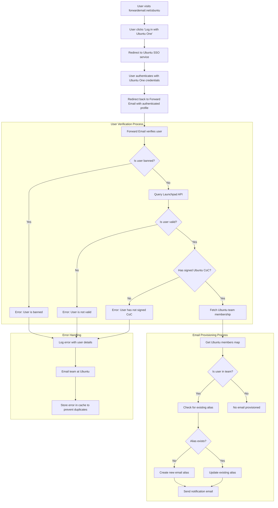

# Nghiên cứu điển hình: Canonical hỗ trợ quản lý email Ubuntu như thế nào với giải pháp doanh nghiệp nguồn mở của Forward Email {#case-study-how-canonical-powers-ubuntu-email-management-with-forward-emails-open-source-enterprise-solution}


## Mục lục {#table-of-contents}

* [Lời nói đầu](#foreword)
* [Thách thức: Quản lý hệ sinh thái email phức tạp](#the-challenge-managing-a-complex-email-ecosystem)
* [Những điểm chính](#key-takeaways)
* [Tại sao nên chuyển tiếp email](#why-forward-email)
* [Việc triển khai: Tích hợp SSO liền mạch](#the-implementation-seamless-sso-integration)
  * [Hình ảnh hóa luồng xác thực](#authentication-flow-visualization)
  * [Chi tiết triển khai kỹ thuật](#technical-implementation-details)
* [Cấu hình DNS và định tuyến email](#dns-configuration-and-email-routing)
* [Kết quả: Quản lý email hợp lý và bảo mật nâng cao](#results-streamlined-email-management-and-enhanced-security)
  * [Hiệu quả hoạt động](#operational-efficiency)
  * [Bảo mật và quyền riêng tư được nâng cao](#enhanced-security-and-privacy)
  * [Tiết kiệm chi phí](#cost-savings)
  * [Trải nghiệm của người đóng góp được cải thiện](#improved-contributor-experience)
* [Nhìn về phía trước: Tiếp tục hợp tác](#looking-forward-continued-collaboration)
* [Kết luận: Một sự hợp tác nguồn mở hoàn hảo](#conclusion-a-perfect-open-source-partnership)
* [Hỗ trợ khách hàng doanh nghiệp](#supporting-enterprise-clients)
  * [Liên hệ](#get-in-touch)
  * [Giới thiệu về Chuyển tiếp Email](#about-forward-email)

## Lời nói đầu {#foreword}

Trong thế giới phần mềm nguồn mở, ít cái tên nào có sức nặng như [Chính tắc](https://en.wikipedia.org/wiki/Canonical_\(company\)), công ty đứng sau [Ubuntu](https://en.wikipedia.org/wiki/Ubuntu), một trong những bản phân phối Linux phổ biến nhất trên toàn cầu. Với hệ sinh thái rộng lớn trải dài trên nhiều bản phân phối, bao gồm Ubuntu, [Miễn phí](https://en.wikipedia.org/wiki/Kubuntu), [Lubuntu](https://en.wikipedia.org/wiki/Lubuntu), [Edubuntu](https://en.wikipedia.org/wiki/Edubuntu) và nhiều bản phân phối khác, Canonical đã phải đối mặt với những thách thức đặc thù trong việc quản lý địa chỉ email trên nhiều tên miền của mình. Nghiên cứu điển hình này khám phá cách Canonical hợp tác với Forward Email để tạo ra một giải pháp quản lý email doanh nghiệp liền mạch, bảo mật và tập trung vào quyền riêng tư, hoàn toàn phù hợp với các giá trị nguồn mở của họ.

## Thử thách: Quản lý hệ sinh thái email phức tạp {#the-challenge-managing-a-complex-email-ecosystem}

Hệ sinh thái của Canonical rất đa dạng và rộng lớn. Với hàng triệu người dùng trên toàn thế giới và hàng ngàn cộng tác viên trên nhiều dự án khác nhau, việc quản lý địa chỉ email trên nhiều tên miền đặt ra những thách thức đáng kể. Các cộng tác viên cốt lõi cần địa chỉ email chính thức (@ubuntu.com, @kubuntu.org, v.v.) thể hiện sự tham gia của họ vào dự án, đồng thời vẫn đảm bảo tính bảo mật và dễ sử dụng thông qua hệ thống quản lý tên miền Ubuntu mạnh mẽ.

Trước khi triển khai Forward Email, Canonical đã gặp khó khăn với:

* Quản lý địa chỉ email trên nhiều tên miền (@ubuntu.com, @kubuntu.org, @lubuntu.me, @edubuntu.org và @ubuntu.net)
* Cung cấp trải nghiệm email nhất quán cho những người đóng góp cốt lõi
* Tích hợp dịch vụ email với hệ thống Đăng nhập Một lần (SSO) [Ubuntu Một](https://en.wikipedia.org/wiki/Ubuntu_One) hiện có
* Tìm giải pháp phù hợp với cam kết của họ về quyền riêng tư, bảo mật và bảo mật email nguồn mở
* Mở rộng cơ sở hạ tầng email an toàn một cách hiệu quả về chi phí

## Những điểm chính cần ghi nhớ {#key-takeaways}

* Canonical đã triển khai thành công giải pháp quản lý email thống nhất trên nhiều miền Ubuntu
* Phương pháp tiếp cận mã nguồn mở 100% của Forward Email hoàn toàn phù hợp với các giá trị của Canonical
* Tích hợp SSO với Ubuntu One cung cấp xác thực liền mạch cho người đóng góp
* Mã hóa lượng tử đảm bảo an ninh lâu dài cho tất cả các giao tiếp email
* Giải pháp có khả năng mở rộng hiệu quả về chi phí để hỗ trợ cộng đồng người đóng góp ngày càng tăng của Canonical

## Tại sao chuyển tiếp email {#why-forward-email}

Là nhà cung cấp dịch vụ email mã nguồn mở 100% duy nhất tập trung vào quyền riêng tư và bảo mật, Forward Email hoàn toàn phù hợp với nhu cầu chuyển tiếp email doanh nghiệp của Canonical. Các giá trị của chúng tôi hoàn toàn phù hợp với cam kết của Canonical đối với phần mềm mã nguồn mở và quyền riêng tư.

Các yếu tố chính khiến Forward Email trở thành lựa chọn lý tưởng bao gồm:

1. **Cơ sở mã nguồn mở hoàn chỉnh**: Toàn bộ nền tảng của chúng tôi là mã nguồn mở và có sẵn trên [GitHub](https://en.wikipedia.org/wiki/GitHub), cho phép minh bạch và cộng đồng đóng góp. Không giống như nhiều nhà cung cấp email "tập trung vào quyền riêng tư" chỉ cung cấp mã nguồn mở cho frontend trong khi vẫn giữ backend ở chế độ đóng, chúng tôi đã cung cấp toàn bộ cơ sở mã nguồn của mình - cả frontend và backend - cho phép bất kỳ ai cũng có thể kiểm tra tại [GitHub](https://github.com/forwardemail/forwardemail.net).

2. **Phương pháp tiếp cận tập trung vào quyền riêng tư**: Không giống như các nhà cung cấp khác, chúng tôi không lưu trữ email trong cơ sở dữ liệu dùng chung và sử dụng mã hóa mạnh mẽ với TLS. Triết lý bảo mật cơ bản của chúng tôi rất đơn giản: **email của bạn thuộc về bạn và chỉ bạn mà thôi**. Nguyên tắc này chi phối mọi quyết định kỹ thuật mà chúng tôi đưa ra, từ cách chúng tôi xử lý việc chuyển tiếp email đến cách chúng tôi triển khai mã hóa.

3. **Không phụ thuộc vào bên thứ ba**: Chúng tôi không sử dụng Amazon SES hoặc các dịch vụ của bên thứ ba khác, giúp chúng tôi kiểm soát hoàn toàn cơ sở hạ tầng email và loại bỏ nguy cơ rò rỉ quyền riêng tư thông qua các dịch vụ của bên thứ ba.

4. **Khả năng mở rộng hiệu quả về mặt chi phí**: Mô hình định giá của chúng tôi cho phép các tổ chức mở rộng mà không phải trả tiền cho mỗi người dùng, rất lý tưởng cho lượng cộng tác viên lớn của Canonical.

5. **Mã hóa chống lượng tử**: Chúng tôi sử dụng các hộp thư SQLite được mã hóa riêng lẻ với [ChaCha20-Poly1305](https://en.wikipedia.org/wiki/ChaCha20-Poly1305) làm mật mã cho [mã hóa chống lượng tử](/blog/docs/best-quantum-safe-encrypted-email-service). Mỗi hộp thư là một tệp được mã hóa riêng biệt, nghĩa là quyền truy cập vào dữ liệu của một người dùng không cấp quyền truy cập cho người khác.

## Việc triển khai: Tích hợp SSO liền mạch {#the-implementation-seamless-sso-integration}

Một trong những khía cạnh quan trọng nhất của việc triển khai là tích hợp với hệ thống SSO Ubuntu One hiện có của Canonical. Việc tích hợp này sẽ cho phép những người đóng góp cốt lõi quản lý địa chỉ email @ubuntu.com của họ bằng thông tin đăng nhập Ubuntu One hiện có.

### Hình ảnh hóa luồng xác thực {#authentication-flow-visualization}

Sơ đồ sau đây minh họa toàn bộ quy trình xác thực và cung cấp email:



### Chi tiết triển khai kỹ thuật {#technical-implementation-details}

Việc tích hợp giữa Forward Email và Ubuntu One SSO được thực hiện thông qua việc triển khai tùy chỉnh chiến lược xác thực passport-ubuntu. Điều này cho phép luồng xác thực liền mạch giữa các hệ thống Ubuntu One và Forward Email.

#### Luồng xác thực {#the-authentication-flow}

Quá trình xác thực hoạt động như sau:

1. Người dùng truy cập trang quản lý email Ubuntu chuyên dụng tại [forwardemail.net/ubuntu](https://forwardemail.net/ubuntu)
2. Nhấp vào "Đăng nhập bằng Ubuntu One" và được chuyển hướng đến dịch vụ Ubuntu SSO
3. Sau khi xác thực bằng thông tin đăng nhập Ubuntu One, người dùng sẽ được chuyển hướng trở lại Forward Email với hồ sơ đã được xác thực.
4. Forward Email sẽ xác minh trạng thái cộng tác viên và các điều khoản hoặc quản lý địa chỉ email của người dùng cho phù hợp.

Việc triển khai kỹ thuật này tận dụng gói [`passport-ubuntu`](https://www.npmjs.com/package/passport-ubuntu), một chiến lược [Hộ chiếu](https://www.npmjs.com/package/passport) để xác thực với Ubuntu bằng [ID mở](https://en.wikipedia.org/wiki/OpenID). Cấu hình bao gồm:

```javascript
passport.use(new UbuntuStrategy({
  returnURL: process.env.UBUNTU_CALLBACK_URL,
  realm: process.env.UBUNTU_REALM,
  stateless: true
}, function(identifier, profile, done) {
  // User verification and email provisioning logic
}));
```

#### Tích hợp và xác thực API Launchpad {#launchpad-api-integration-and-validation}

Một thành phần quan trọng trong quá trình triển khai của chúng tôi là tích hợp với API của [Bệ phóng](https://en.wikipedia.org/wiki/Launchpad_\(website\)) để xác thực người dùng Ubuntu và tư cách thành viên nhóm của họ. Chúng tôi đã tạo ra các hàm trợ giúp có thể tái sử dụng để xử lý việc tích hợp này một cách hiệu quả và đáng tin cậy.

Hàm trợ giúp `sync-ubuntu-user.js` chịu trách nhiệm xác thực người dùng thông qua API Launchpad và quản lý địa chỉ email của họ. Sau đây là phiên bản đơn giản hóa về cách thức hoạt động của hàm:

```javascript
async function syncUbuntuUser(user, map) {
  try {
    // Validate user object
    if (!_.isObject(user) ||
        !isSANB(user[fields.ubuntuUsername]) ||
        !isSANB(user[fields.ubuntuProfileID]) ||
        !isEmail(user.email))
      throw new TypeError('Invalid user object');

    // Get Ubuntu members map if not provided
    if (!(map instanceof Map))
      map = await getUbuntuMembersMap(resolver);

    // Check if user is banned
    if (user[config.userFields.isBanned]) {
      throw new InvalidUbuntuUserError('User was banned', { ignoreHook: true });
    }

    // Query Launchpad API to validate user
    const url = `https://api.launchpad.net/1.0/~${user[fields.ubuntuUsername]}`;
    const response = await retryRequest(url, { resolver });
    const json = await response.body.json();

    // Validate required boolean properties
    if (!json.is_valid)
      throw new InvalidUbuntuUserError('Property "is_valid" was false');

    if (!json.is_ubuntu_coc_signer)
      throw new InvalidUbuntuUserError('Property "is_ubuntu_coc_signer" was false');

    // Process each domain for the user
    await pMap([...map.keys()], async (name) => {
      // Find domain in database
      const domain = await Domains.findOne({
        name,
        plan: 'team',
        has_txt_record: true
      }).populate('members.user');

      // Process user's email alias for this domain
      if (map.get(name).has(user[fields.ubuntuUsername])) {
        // User is a member of this team, create or update alias
        let alias = await Aliases.findOne({
          user: user._id,
          domain: domain._id,
          name: user[fields.ubuntuUsername].toLowerCase()
        });

        if (!alias) {
          // Create new alias with appropriate error handling
          alias = await Aliases.create({
            user: user._id,
            domain: domain._id,
            name: user[fields.ubuntuUsername].toLowerCase(),
            recipients: [user.email],
            locale: user[config.lastLocaleField],
            is_enabled: true
          });

          // Notify admins about new alias creation
          await emailHelper({
            template: 'alert',
            message: {
              to: adminEmailsForDomain,
              subject: `New @${domain.name} email address created`
            },
            locals: {
              message: `A new email address ${user[fields.ubuntuUsername].toLowerCase()}@${domain.name} was created for ${user.email}`
            }
          });
        }
      }
    });

    return true;
  } catch (err) {
    // Handle and log errors
    await logErrorWithUser(err, user);
    throw err;
  }
}
```

Để đơn giản hóa việc quản lý thành viên nhóm trên nhiều miền Ubuntu khác nhau, chúng tôi đã tạo ra một ánh xạ đơn giản giữa các tên miền và nhóm Launchpad tương ứng:

```javascript
ubuntuTeamMapping: {
  'ubuntu.com': '~ubuntumembers',
  'kubuntu.org': '~kubuntu-members',
  'lubuntu.me': '~lubuntu-members',
  'edubuntu.org': '~edubuntu-members',
  'ubuntustudio.com': '~ubuntustudio-core',
  'ubuntu.net': '~ubuntu-smtp-test'
},
```

Việc ánh xạ đơn giản này cho phép chúng tôi tự động hóa quy trình kiểm tra tư cách thành viên nhóm và cung cấp địa chỉ email, giúp hệ thống dễ bảo trì và mở rộng khi thêm tên miền mới.

#### Xử lý lỗi và thông báo {#error-handling-and-notifications}

Chúng tôi đã triển khai một hệ thống xử lý lỗi mạnh mẽ:

1. Ghi lại tất cả lỗi kèm theo thông tin người dùng chi tiết
2. Gửi email cho nhóm Ubuntu khi phát hiện sự cố
3. Thông báo cho quản trị viên khi có cộng tác viên mới đăng ký và tạo địa chỉ email
4. Xử lý các trường hợp ngoại lệ như người dùng chưa ký Quy tắc Ứng xử của Ubuntu

Điều này đảm bảo mọi vấn đề đều được xác định và giải quyết nhanh chóng, duy trì tính toàn vẹn của hệ thống email.

## Cấu hình DNS và Định tuyến Email {#dns-configuration-and-email-routing}

Đối với mỗi tên miền được quản lý thông qua Forward Email, Canonical đã thêm một bản ghi DNS TXT đơn giản để xác thực:

```sh
❯ dig ubuntu.com txt
ubuntu.com.             600     IN      TXT     "forward-email-site-verification=6IsURgl2t7"
```

Bản ghi xác minh này xác nhận quyền sở hữu tên miền và cho phép hệ thống của chúng tôi quản lý email an toàn cho các tên miền này. Canonical định tuyến thư qua dịch vụ của chúng tôi thông qua Postfix, cung cấp cơ sở hạ tầng phân phối email đáng tin cậy và an toàn.

## Kết quả: Quản lý email hợp lý và bảo mật nâng cao {#results-streamlined-email-management-and-enhanced-security}

Việc triển khai giải pháp doanh nghiệp của Forward Email đã mang lại những lợi ích đáng kể cho hoạt động quản lý email của Canonical trên tất cả các miền của họ:

### Hiệu quả hoạt động {#operational-efficiency}

* **Quản lý tập trung**: Tất cả các tên miền liên quan đến Ubuntu giờ đây được quản lý thông qua một giao diện duy nhất
* **Giảm chi phí quản trị**: Tự động cung cấp và quản lý tự phục vụ cho người đóng góp
* **Đơn giản hóa quy trình đăng ký**: Người đóng góp mới có thể nhanh chóng nhận được địa chỉ email chính thức của mình

### Bảo mật và quyền riêng tư được nâng cao {#enhanced-security-and-privacy}

* **Mã hóa đầu cuối**: Tất cả email đều được mã hóa bằng các tiêu chuẩn tiên tiến
* **Không dùng chung cơ sở dữ liệu**: Email của mỗi người dùng được lưu trữ trong các cơ sở dữ liệu SQLite được mã hóa riêng biệt, cung cấp phương pháp mã hóa hộp cát, về cơ bản an toàn hơn so với các cơ sở dữ liệu quan hệ dùng chung truyền thống
* **Bảo mật nguồn mở**: Cơ sở mã minh bạch cho phép cộng đồng đánh giá bảo mật
* **Xử lý trong bộ nhớ**: Chúng tôi không lưu trữ email đã chuyển tiếp vào đĩa, tăng cường bảo vệ quyền riêng tư
* **Không lưu trữ siêu dữ liệu**: Chúng tôi không lưu trữ hồ sơ về việc ai đang gửi email cho ai, không giống như nhiều nhà cung cấp dịch vụ email khác

### Tiết kiệm chi phí {#cost-savings}

* **Mô hình định giá có thể mở rộng**: Không tính phí theo người dùng, cho phép Canonical thêm người đóng góp mà không làm tăng chi phí.
* **Nhu cầu cơ sở hạ tầng giảm**: Không cần duy trì máy chủ email riêng cho các tên miền khác nhau.
* **Yêu cầu hỗ trợ thấp hơn**: Quản lý tự phục vụ giúp giảm số lượng phiếu yêu cầu hỗ trợ CNTT

### Cải thiện trải nghiệm của người đóng góp {#improved-contributor-experience}

* **Xác thực liền mạch**: Đăng nhập một lần với thông tin đăng nhập Ubuntu One hiện có
* **Thương hiệu nhất quán**: Trải nghiệm thống nhất trên tất cả các dịch vụ liên quan đến Ubuntu
* **Chuyển phát email đáng tin cậy**: Uy tín IP chất lượng cao đảm bảo email đến đích

Việc tích hợp với Forward Email đã đơn giản hóa đáng kể quy trình quản lý email của Canonical. Người dùng giờ đây có thể quản lý địa chỉ email @ubuntu.com một cách liền mạch, giảm thiểu chi phí quản trị và tăng cường bảo mật.

## Mong đợi: Tiếp tục hợp tác {#looking-forward-continued-collaboration}

Quan hệ đối tác giữa Canonical và Forward Email vẫn đang tiếp tục phát triển. Chúng tôi đang hợp tác trong một số sáng kiến:

* Mở rộng dịch vụ email sang các tên miền liên quan đến Ubuntu khác
* Cải thiện giao diện người dùng dựa trên phản hồi của cộng tác viên
* Triển khai các tính năng bảo mật bổ sung
* Khám phá những cách mới để tận dụng khả năng cộng tác mã nguồn mở của chúng tôi

## Kết luận: Một sự hợp tác nguồn mở hoàn hảo {#conclusion-a-perfect-open-source-partnership}

Sự hợp tác giữa Canonical và Forward Email thể hiện sức mạnh của mối quan hệ đối tác được xây dựng dựa trên các giá trị chung. Bằng cách chọn Forward Email làm nhà cung cấp dịch vụ email, Canonical đã tìm thấy một giải pháp không chỉ đáp ứng các yêu cầu kỹ thuật mà còn hoàn toàn phù hợp với cam kết của họ đối với phần mềm nguồn mở, quyền riêng tư và bảo mật.

Đối với các tổ chức quản lý nhiều tên miền và yêu cầu xác thực liền mạch với các hệ thống hiện có, Forward Email cung cấp một giải pháp linh hoạt, bảo mật và tập trung vào quyền riêng tư. [phương pháp tiếp cận nguồn mở](https://forwardemail.net/blog/docs/why-open-source-email-security-privacy) của chúng tôi đảm bảo tính minh bạch và cho phép cộng đồng đóng góp, khiến đây trở thành lựa chọn lý tưởng cho các tổ chức coi trọng những nguyên tắc này.

Khi cả Canonical và Forward Email tiếp tục đổi mới trong lĩnh vực của mình, mối quan hệ hợp tác này là minh chứng cho sức mạnh của sự hợp tác nguồn mở và các giá trị chung trong việc tạo ra các giải pháp hiệu quả.

Bạn có thể kiểm tra [trạng thái dịch vụ thời gian thực](https://status.forwardemail.net) để xem hiệu suất gửi email hiện tại của chúng tôi, hiệu suất này được chúng tôi theo dõi liên tục để đảm bảo uy tín IP chất lượng cao và khả năng gửi email.

## Hỗ trợ khách hàng doanh nghiệp {#supporting-enterprise-clients}

Trong khi nghiên cứu điển hình này tập trung vào mối quan hệ đối tác của chúng tôi với Canonical, Forward Email tự hào hỗ trợ nhiều khách hàng doanh nghiệp trong nhiều ngành khác nhau coi trọng cam kết của chúng tôi đối với quyền riêng tư, bảo mật và các nguyên tắc nguồn mở.

Các giải pháp doanh nghiệp của chúng tôi được thiết kế riêng để đáp ứng nhu cầu cụ thể của các tổ chức ở mọi quy mô, cung cấp:

* Tên miền [quản lý email](/) tùy chỉnh trên nhiều tên miền
* Tích hợp liền mạch với các hệ thống xác thực hiện có
* Kênh hỗ trợ trò chuyện Matrix chuyên dụng
* Các tính năng bảo mật nâng cao bao gồm [mã hóa chống lượng tử](/blog/docs/best-quantum-safe-encrypted-email-service)
* Khả năng di chuyển và sở hữu dữ liệu hoàn toàn
* Cơ sở hạ tầng mã nguồn mở 100% đảm bảo tính minh bạch và tin cậy

### Liên hệ {#get-in-touch}

Nếu tổ chức của bạn có nhu cầu về email doanh nghiệp hoặc bạn muốn tìm hiểu thêm về cách Forward Email có thể giúp hợp lý hóa việc quản lý email của bạn đồng thời tăng cường quyền riêng tư và bảo mật, chúng tôi rất mong nhận được phản hồi từ bạn:

* Gửi email trực tiếp cho chúng tôi theo địa chỉ `support@forwardemail.net`
* Gửi yêu cầu trợ giúp theo địa chỉ [trang trợ giúp](https://forwardemail.net/help)
* Xem [trang giá cả](https://forwardemail.net/pricing) của chúng tôi để biết các gói doanh nghiệp

Nhóm của chúng tôi sẵn sàng thảo luận về các yêu cầu cụ thể của bạn và phát triển giải pháp tùy chỉnh phù hợp với các giá trị và nhu cầu kỹ thuật của tổ chức bạn.

### Giới thiệu về Chuyển tiếp Email {#about-forward-email}

Forward Email là dịch vụ email mã nguồn mở 100% và tập trung vào quyền riêng tư. Chúng tôi cung cấp dịch vụ chuyển tiếp email theo tên miền tùy chỉnh, SMTP, IMAP và POP3, tập trung vào bảo mật, quyền riêng tư và tính minh bạch. Toàn bộ cơ sở mã nguồn của chúng tôi có sẵn trên [GitHub](https://github.com/forwardemail/forwardemail.net), và chúng tôi cam kết cung cấp các dịch vụ email tôn trọng quyền riêng tư và bảo mật của người dùng. Tìm hiểu thêm về [tại sao email nguồn mở là tương lai](https://forwardemail.net/blog/docs/why-open-source-email-security-privacy), [cách chuyển tiếp email của chúng tôi hoạt động](https://forwardemail.net/blog/docs/best-email-forwarding-service) và [cách tiếp cận của chúng tôi đối với việc bảo vệ quyền riêng tư email](https://forwardemail.net/blog/docs/email-privacy-protection-technical-implementation).