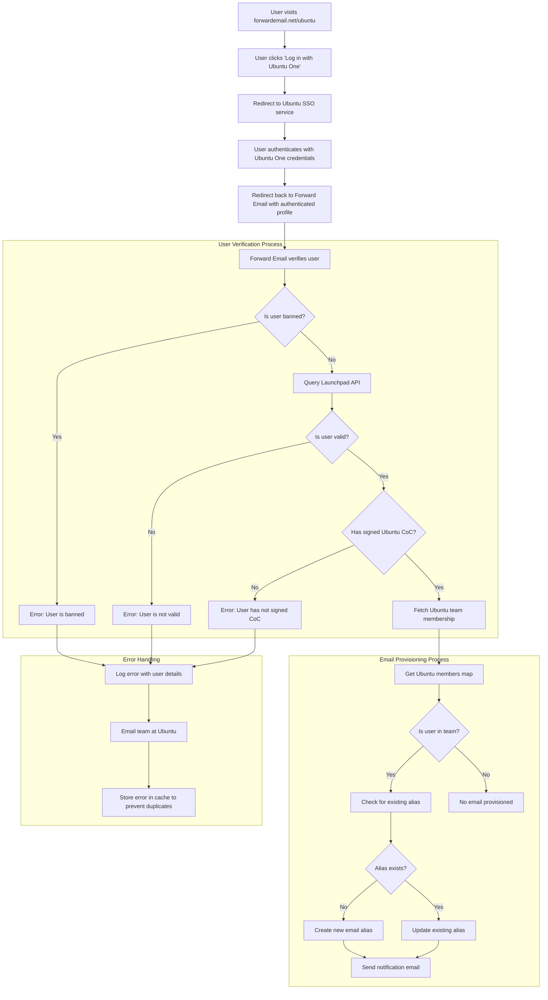

# Nghiên Cứu Tình Huống: Canonical Quản Lý Email Ubuntu Như Thế Nào Với Giải Pháp Doanh Nghiệp Mã Nguồn Mở của Forward Email {#case-study-how-canonical-powers-ubuntu-email-management-with-forward-emails-open-source-enterprise-solution}


## Mục Lục {#table-of-contents}

* [Lời Nói Đầu](#foreword)
* [Thách Thức: Quản Lý Hệ Sinh Thái Email Phức Tạp](#the-challenge-managing-a-complex-email-ecosystem)
* [Những Điểm Chính Rút Ra](#key-takeaways)
* [Tại Sao Chọn Forward Email](#why-forward-email)
* [Việc Triển Khai: Tích Hợp SSO Mượt Mà](#the-implementation-seamless-sso-integration)
  * [Minh Họa Luồng Xác Thực](#authentication-flow-visualization)
  * [Chi Tiết Triển Khai Kỹ Thuật](#technical-implementation-details)
* [Cấu Hình DNS và Định Tuyến Email](#dns-configuration-and-email-routing)
* [Kết Quả: Quản Lý Email Tinh Gọn và Tăng Cường Bảo Mật](#results-streamlined-email-management-and-enhanced-security)
  * [Hiệu Quả Vận Hành](#operational-efficiency)
  * [Tăng Cường Bảo Mật và Quyền Riêng Tư](#enhanced-security-and-privacy)
  * [Tiết Kiệm Chi Phí](#cost-savings)
  * [Cải Thiện Trải Nghiệm Người Đóng Góp](#improved-contributor-experience)
* [Hướng Tới Tương Lai: Hợp Tác Tiếp Tục](#looking-forward-continued-collaboration)
* [Kết Luận: Một Sự Hợp Tác Mã Nguồn Mở Hoàn Hảo](#conclusion-a-perfect-open-source-partnership)
* [Hỗ Trợ Khách Hàng Doanh Nghiệp](#supporting-enterprise-clients)
  * [Liên Hệ](#get-in-touch)
  * [Về Forward Email](#about-forward-email)


## Lời Nói Đầu {#foreword}

Trong thế giới phần mềm mã nguồn mở, ít cái tên nào có sức ảnh hưởng như [Canonical](https://en.wikipedia.org/wiki/Canonical_\(company\)), công ty đứng sau [Ubuntu](https://en.wikipedia.org/wiki/Ubuntu), một trong những bản phân phối Linux phổ biến nhất toàn cầu. Với một hệ sinh thái rộng lớn bao gồm nhiều bản phân phối như Ubuntu, [Kubuntu](https://en.wikipedia.org/wiki/Kubuntu), [Lubuntu](https://en.wikipedia.org/wiki/Lubuntu), [Edubuntu](https://en.wikipedia.org/wiki/Edubuntu), và nhiều hơn nữa, Canonical đã đối mặt với những thách thức đặc biệt trong việc quản lý các địa chỉ email trên nhiều tên miền khác nhau. Nghiên cứu tình huống này khám phá cách Canonical hợp tác với Forward Email để tạo ra một giải pháp quản lý email doanh nghiệp liền mạch, an toàn và tập trung vào quyền riêng tư, phù hợp hoàn hảo với các giá trị mã nguồn mở của họ.


## Thách Thức: Quản Lý Hệ Sinh Thái Email Phức Tạp {#the-challenge-managing-a-complex-email-ecosystem}

Hệ sinh thái của Canonical rất đa dạng và rộng lớn. Với hàng triệu người dùng trên toàn thế giới và hàng nghìn cộng tác viên trong nhiều dự án khác nhau, việc quản lý các địa chỉ email trên nhiều tên miền đã đặt ra những thách thức lớn. Các cộng tác viên cốt lõi cần các địa chỉ email chính thức (@ubuntu.com, @kubuntu.org, v.v.) phản ánh sự tham gia của họ với dự án đồng thời duy trì bảo mật và dễ sử dụng thông qua một hệ thống quản lý tên miền Ubuntu mạnh mẽ.

Trước khi triển khai Forward Email, Canonical gặp khó khăn với:

* Quản lý các địa chỉ email trên nhiều tên miền (@ubuntu.com, @kubuntu.org, @lubuntu.me, @edubuntu.org, và @ubuntu.net)
* Cung cấp trải nghiệm email nhất quán cho các cộng tác viên cốt lõi
* Tích hợp dịch vụ email với hệ thống Đăng Nhập Một Lần (SSO) [Ubuntu One](https://en.wikipedia.org/wiki/Ubuntu_One) hiện có
* Tìm kiếm một giải pháp phù hợp với cam kết về quyền riêng tư, bảo mật và bảo mật email mã nguồn mở
* Mở rộng hạ tầng email an toàn một cách hiệu quả về chi phí


## Những Điểm Chính Rút Ra {#key-takeaways}

* Canonical đã triển khai thành công giải pháp quản lý email thống nhất trên nhiều tên miền Ubuntu
* Phương pháp 100% mã nguồn mở của Forward Email hoàn toàn phù hợp với giá trị của Canonical
* Tích hợp SSO với Ubuntu One cung cấp xác thực liền mạch cho các cộng tác viên
* Mã hóa chống lượng tử đảm bảo bảo mật lâu dài cho tất cả các giao tiếp email
* Giải pháp mở rộng hiệu quả về chi phí để hỗ trợ cơ sở cộng tác viên ngày càng tăng của Canonical


## Tại Sao Chọn Forward Email {#why-forward-email}
Là nhà cung cấp dịch vụ email mã nguồn mở 100% duy nhất tập trung vào quyền riêng tư và bảo mật, Forward Email là lựa chọn tự nhiên cho nhu cầu chuyển tiếp email doanh nghiệp của Canonical. Giá trị của chúng tôi hoàn toàn phù hợp với cam kết của Canonical về phần mềm mã nguồn mở và quyền riêng tư.

Các yếu tố chính khiến Forward Email trở thành lựa chọn lý tưởng bao gồm:

1. **Mã nguồn mở hoàn chỉnh**: Toàn bộ nền tảng của chúng tôi là mã nguồn mở và có sẵn trên [GitHub](https://en.wikipedia.org/wiki/GitHub), cho phép minh bạch và đóng góp từ cộng đồng. Khác với nhiều nhà cung cấp email "tập trung vào quyền riêng tư" chỉ mở mã nguồn giao diện người dùng trong khi giữ mã nguồn backend đóng, chúng tôi đã công khai toàn bộ mã nguồn—cả frontend và backend—cho bất kỳ ai kiểm tra tại [GitHub](https://github.com/forwardemail/forwardemail.net).

2. **Phương pháp tập trung vào quyền riêng tư**: Khác với các nhà cung cấp khác, chúng tôi không lưu trữ email trong cơ sở dữ liệu dùng chung, và sử dụng mã hóa mạnh với TLS. Triết lý quyền riêng tư cơ bản của chúng tôi rất đơn giản: **email của bạn thuộc về bạn và chỉ bạn mà thôi**. Nguyên tắc này hướng dẫn mọi quyết định kỹ thuật chúng tôi thực hiện, từ cách xử lý chuyển tiếp email đến cách triển khai mã hóa.

3. **Không phụ thuộc bên thứ ba**: Chúng tôi không sử dụng Amazon SES hay các dịch vụ bên thứ ba khác, giúp chúng tôi kiểm soát hoàn toàn hạ tầng email và loại bỏ khả năng rò rỉ quyền riêng tư qua các dịch vụ bên thứ ba.

4. **Mở rộng chi phí hiệu quả**: Mô hình giá của chúng tôi cho phép các tổ chức mở rộng mà không phải trả phí theo người dùng, rất phù hợp với lượng đóng góp lớn của Canonical.

5. **Mã hóa chống lượng tử**: Chúng tôi sử dụng hộp thư SQLite được mã hóa riêng lẻ với [ChaCha20-Poly1305](https://en.wikipedia.org/wiki/ChaCha20-Poly1305) làm thuật toán cho [mã hóa chống lượng tử](/blog/docs/best-quantum-safe-encrypted-email-service). Mỗi hộp thư là một tệp mã hóa riêng biệt, nghĩa là truy cập dữ liệu của một người dùng không đồng nghĩa với việc truy cập được dữ liệu của người khác.


## Việc Triển Khai: Tích Hợp SSO Mượt Mà {#the-implementation-seamless-sso-integration}

Một trong những khía cạnh quan trọng nhất của việc triển khai là tích hợp với hệ thống Ubuntu One SSO hiện có của Canonical. Việc tích hợp này sẽ cho phép các cộng tác viên cốt lõi quản lý địa chỉ email @ubuntu.com của họ bằng thông tin đăng nhập Ubuntu One hiện có.

### Minh Họa Luồng Xác Thực {#authentication-flow-visualization}

Sơ đồ sau minh họa luồng xác thực và cung cấp email hoàn chỉnh:


```mermaid
flowchart TD
    A[User visits forwardemail.net/ubuntu] --> B[User clicks 'Log in with Ubuntu One']
    B --> C[Redirect to Ubuntu SSO service]
    C --> D[User authenticates with Ubuntu One credentials]
    D --> E[Redirect back to Forward Email with authenticated profile]
    E --> F[Forward Email verifies user]

    subgraph "User Verification Process"
        F --> G{Is user banned?}
        G -->|Yes| H[Error: User is banned]
        G -->|No| I[Query Launchpad API]
        I --> J{Is user valid?}
        J -->|No| K[Error: User is not valid]
        J -->|Yes| L{Has signed Ubuntu CoC?}
        L -->|No| M[Error: User has not signed CoC]
        L -->|Yes| N[Fetch Ubuntu team membership]
    end

    subgraph "Email Provisioning Process"
        N --> O[Get Ubuntu members map]
        O --> P{Is user in team?}
        P -->|Yes| Q[Check for existing alias]
        Q --> R{Alias exists?}
        R -->|No| S[Create new email alias]
        R -->|Yes| T[Update existing alias]
        S --> U[Send notification email]
        T --> U
        P -->|No| V[No email provisioned]
    end

    subgraph "Error Handling"
        H --> W[Log error with user details]
        K --> W
        M --> W
        W --> X[Email team at Ubuntu]
        X --> Y[Store error in cache to prevent duplicates]
    end
```

### Chi Tiết Triển Khai Kỹ Thuật {#technical-implementation-details}

Việc tích hợp giữa Forward Email và Ubuntu One SSO được thực hiện thông qua một triển khai tùy chỉnh của chiến lược xác thực passport-ubuntu. Điều này cho phép luồng xác thực liền mạch giữa Ubuntu One và hệ thống của Forward Email.
#### Luồng Xác Thực {#the-authentication-flow}

Quá trình xác thực hoạt động như sau:

1. Người dùng truy cập trang quản lý email Ubuntu chuyên dụng tại [forwardemail.net/ubuntu](https://forwardemail.net/ubuntu)
2. Họ nhấn "Đăng nhập với Ubuntu One" và được chuyển hướng đến dịch vụ SSO của Ubuntu
3. Sau khi xác thực bằng thông tin đăng nhập Ubuntu One, họ được chuyển hướng trở lại Forward Email với hồ sơ đã xác thực
4. Forward Email xác minh trạng thái cộng tác viên của họ và cấp phát hoặc quản lý địa chỉ email tương ứng

Việc triển khai kỹ thuật sử dụng gói [`passport-ubuntu`](https://www.npmjs.com/package/passport-ubuntu), đây là một chiến lược [Passport](https://www.npmjs.com/package/passport) để xác thực với Ubuntu sử dụng [OpenID](https://en.wikipedia.org/wiki/OpenID). Cấu hình bao gồm:

```javascript
passport.use(new UbuntuStrategy({
  returnURL: process.env.UBUNTU_CALLBACK_URL,
  realm: process.env.UBUNTU_REALM,
  stateless: true
}, function(identifier, profile, done) {
  // Logic xác minh người dùng và cấp phát email
}));
```

#### Tích Hợp và Xác Thực API Launchpad {#launchpad-api-integration-and-validation}

Một thành phần quan trọng trong việc triển khai của chúng tôi là tích hợp với API của [Launchpad](https://en.wikipedia.org/wiki/Launchpad_\(website\)) để xác thực người dùng Ubuntu và thành viên nhóm của họ. Chúng tôi đã tạo các hàm trợ giúp tái sử dụng để xử lý tích hợp này một cách hiệu quả và đáng tin cậy.

Hàm trợ giúp `sync-ubuntu-user.js` chịu trách nhiệm xác thực người dùng qua API Launchpad và quản lý địa chỉ email của họ. Dưới đây là phiên bản đơn giản hóa cách hoạt động:

```javascript
async function syncUbuntuUser(user, map) {
  try {
    // Xác thực đối tượng người dùng
    if (!_.isObject(user) ||
        !isSANB(user[fields.ubuntuUsername]) ||
        !isSANB(user[fields.ubuntuProfileID]) ||
        !isEmail(user.email))
      throw new TypeError('Đối tượng người dùng không hợp lệ');

    // Lấy bản đồ thành viên Ubuntu nếu chưa được cung cấp
    if (!(map instanceof Map))
      map = await getUbuntuMembersMap(resolver);

    // Kiểm tra xem người dùng có bị cấm không
    if (user[config.userFields.isBanned]) {
      throw new InvalidUbuntuUserError('Người dùng đã bị cấm', { ignoreHook: true });
    }

    // Gọi API Launchpad để xác thực người dùng
    const url = `https://api.launchpad.net/1.0/~${user[fields.ubuntuUsername]}`;
    const response = await retryRequest(url, { resolver });
    const json = await response.body.json();

    // Xác thực các thuộc tính boolean bắt buộc
    if (!json.is_valid)
      throw new InvalidUbuntuUserError('Thuộc tính "is_valid" là false');

    if (!json.is_ubuntu_coc_signer)
      throw new InvalidUbuntuUserError('Thuộc tính "is_ubuntu_coc_signer" là false');

    // Xử lý từng domain cho người dùng
    await pMap([...map.keys()], async (name) => {
      // Tìm domain trong cơ sở dữ liệu
      const domain = await Domains.findOne({
        name,
        plan: 'team',
        has_txt_record: true
      }).populate('members.user');

      // Xử lý bí danh email của người dùng cho domain này
      if (map.get(name).has(user[fields.ubuntuUsername])) {
        // Người dùng là thành viên của nhóm này, tạo hoặc cập nhật bí danh
        let alias = await Aliases.findOne({
          user: user._id,
          domain: domain._id,
          name: user[fields.ubuntuUsername].toLowerCase()
        });

        if (!alias) {
          // Tạo bí danh mới với xử lý lỗi phù hợp
          alias = await Aliases.create({
            user: user._id,
            domain: domain._id,
            name: user[fields.ubuntuUsername].toLowerCase(),
            recipients: [user.email],
            locale: user[config.lastLocaleField],
            is_enabled: true
          });

          // Thông báo cho quản trị viên về việc tạo bí danh mới
          await emailHelper({
            template: 'alert',
            message: {
              to: adminEmailsForDomain,
              subject: `Địa chỉ email mới @${domain.name} đã được tạo`
            },
            locals: {
              message: `Một địa chỉ email mới ${user[fields.ubuntuUsername].toLowerCase()}@${domain.name} đã được tạo cho ${user.email}`
            }
          });
        }
      }
    });

    return true;
  } catch (err) {
    // Xử lý và ghi lại lỗi
    await logErrorWithUser(err, user);
    throw err;
  }
}
```
Để đơn giản hóa việc quản lý thành viên nhóm trên các miền Ubuntu khác nhau, chúng tôi đã tạo một bảng ánh xạ đơn giản giữa tên miền và các nhóm Launchpad tương ứng:

```javascript
ubuntuTeamMapping: {
  'ubuntu.com': '~ubuntumembers',
  'kubuntu.org': '~kubuntu-members',
  'lubuntu.me': '~lubuntu-members',
  'edubuntu.org': '~edubuntu-members',
  'ubuntustudio.com': '~ubuntustudio-core',
  'ubuntu.net': '~ubuntu-smtp-test'
},
```

Bảng ánh xạ đơn giản này cho phép chúng tôi tự động hóa quá trình kiểm tra thành viên nhóm và cấp phát địa chỉ email, giúp hệ thống dễ dàng bảo trì và mở rộng khi thêm các miền mới.

#### Xử lý lỗi và Thông báo {#error-handling-and-notifications}

Chúng tôi đã triển khai một hệ thống xử lý lỗi mạnh mẽ mà:

1. Ghi lại tất cả các lỗi với thông tin người dùng chi tiết
2. Gửi email cho nhóm Ubuntu khi phát hiện sự cố
3. Thông báo cho quản trị viên khi có người đóng góp mới đăng ký và được tạo địa chỉ email
4. Xử lý các trường hợp đặc biệt như người dùng chưa ký Bộ Quy Tắc Ứng Xử của Ubuntu

Điều này đảm bảo rằng mọi sự cố được phát hiện và xử lý nhanh chóng, duy trì tính toàn vẹn của hệ thống email.


## Cấu hình DNS và Định tuyến Email {#dns-configuration-and-email-routing}

Đối với mỗi miền được quản lý thông qua Forward Email, Canonical đã thêm một bản ghi DNS TXT đơn giản để xác thực:

```sh
❯ dig ubuntu.com txt
ubuntu.com.             600     IN      TXT     "forward-email-site-verification=6IsURgl2t7"
```

Bản ghi xác thực này xác nhận quyền sở hữu miền và cho phép hệ thống của chúng tôi quản lý email cho các miền này một cách an toàn. Canonical định tuyến thư qua dịch vụ của chúng tôi thông qua Postfix, cung cấp một hạ tầng gửi email đáng tin cậy và an toàn.


## Kết quả: Quản lý Email Tinh gọn và Tăng cường Bảo mật {#results-streamlined-email-management-and-enhanced-security}

Việc triển khai giải pháp doanh nghiệp của Forward Email đã mang lại lợi ích đáng kể cho việc quản lý email của Canonical trên tất cả các miền của họ:

### Hiệu quả Vận hành {#operational-efficiency}

* **Quản lý tập trung**: Tất cả các miền liên quan đến Ubuntu hiện được quản lý qua một giao diện duy nhất
* **Giảm tải quản trị**: Tự động cấp phát và quản lý tự phục vụ cho người đóng góp
* **Đơn giản hóa việc tiếp nhận**: Người đóng góp mới có thể nhanh chóng nhận được địa chỉ email chính thức

### Tăng cường Bảo mật và Quyền riêng tư {#enhanced-security-and-privacy}

* **Mã hóa đầu cuối**: Tất cả email được mã hóa bằng các tiêu chuẩn tiên tiến
* **Không dùng cơ sở dữ liệu chia sẻ**: Email của từng người dùng được lưu trữ trong các cơ sở dữ liệu SQLite mã hóa riêng biệt, cung cấp phương pháp mã hóa cách ly an toàn hơn nhiều so với các cơ sở dữ liệu quan hệ chia sẻ truyền thống
* **Bảo mật mã nguồn mở**: Mã nguồn minh bạch cho phép cộng đồng đánh giá bảo mật
* **Xử lý trong bộ nhớ**: Chúng tôi không lưu email chuyển tiếp trên đĩa, tăng cường bảo vệ quyền riêng tư
* **Không lưu trữ siêu dữ liệu**: Chúng tôi không giữ hồ sơ ai gửi email cho ai, khác với nhiều nhà cung cấp email

### Tiết kiệm Chi phí {#cost-savings}

* **Mô hình giá linh hoạt**: Không tính phí theo người dùng, cho phép Canonical thêm người đóng góp mà không tăng chi phí
* **Giảm nhu cầu hạ tầng**: Không cần duy trì các máy chủ email riêng biệt cho các miền khác nhau
* **Giảm yêu cầu hỗ trợ**: Quản lý tự phục vụ giảm số lượng phiếu hỗ trợ IT

### Cải thiện Trải nghiệm Người đóng góp {#improved-contributor-experience}

* **Xác thực liền mạch**: Đăng nhập một lần với thông tin đăng nhập Ubuntu One hiện có
* **Thương hiệu nhất quán**: Trải nghiệm đồng nhất trên tất cả dịch vụ liên quan đến Ubuntu
* **Giao nhận email đáng tin cậy**: Danh tiếng IP chất lượng cao đảm bảo email đến nơi nhận

Việc tích hợp với Forward Email đã giúp Canonical tinh gọn đáng kể quy trình quản lý email. Người đóng góp giờ đây có trải nghiệm liền mạch khi quản lý địa chỉ email @ubuntu.com của họ, với giảm tải quản trị và tăng cường bảo mật.


## Hướng tới tương lai: Hợp tác tiếp tục {#looking-forward-continued-collaboration}

Quan hệ đối tác giữa Canonical và Forward Email tiếp tục phát triển. Chúng tôi đang cùng nhau thực hiện một số sáng kiến:
* Mở rộng dịch vụ email đến các tên miền liên quan đến Ubuntu khác
* Cải thiện giao diện người dùng dựa trên phản hồi của cộng tác viên
* Triển khai các tính năng bảo mật bổ sung
* Khám phá các cách mới để tận dụng sự hợp tác mã nguồn mở của chúng tôi


## Kết luận: Một Quan Hệ Đối Tác Mã Nguồn Mở Hoàn Hảo {#conclusion-a-perfect-open-source-partnership}

Sự hợp tác giữa Canonical và Forward Email thể hiện sức mạnh của các quan hệ đối tác được xây dựng trên các giá trị chung. Bằng cách chọn Forward Email làm nhà cung cấp dịch vụ email, Canonical đã tìm thấy một giải pháp không chỉ đáp ứng các yêu cầu kỹ thuật mà còn hoàn toàn phù hợp với cam kết của họ đối với phần mềm mã nguồn mở, quyền riêng tư và bảo mật.

Đối với các tổ chức quản lý nhiều tên miền và yêu cầu xác thực liền mạch với các hệ thống hiện có, Forward Email cung cấp một giải pháp linh hoạt, an toàn và tập trung vào quyền riêng tư. [Phương pháp mã nguồn mở](https://forwardemail.net/blog/docs/why-open-source-email-security-privacy) của chúng tôi đảm bảo tính minh bạch và cho phép sự đóng góp của cộng đồng, làm cho nó trở thành lựa chọn lý tưởng cho các tổ chức coi trọng những nguyên tắc này.

Khi cả Canonical và Forward Email tiếp tục đổi mới trong các lĩnh vực tương ứng của mình, quan hệ đối tác này là minh chứng cho sức mạnh của sự hợp tác mã nguồn mở và các giá trị chung trong việc tạo ra các giải pháp hiệu quả.

Bạn có thể kiểm tra [tình trạng dịch vụ theo thời gian thực](https://status.forwardemail.net) của chúng tôi để xem hiệu suất gửi email hiện tại, mà chúng tôi liên tục giám sát nhằm đảm bảo uy tín IP và khả năng gửi email chất lượng cao.


## Hỗ Trợ Khách Hàng Doanh Nghiệp {#supporting-enterprise-clients}

Mặc dù nghiên cứu trường hợp này tập trung vào quan hệ đối tác với Canonical, Forward Email tự hào hỗ trợ nhiều khách hàng doanh nghiệp trong các ngành khác nhau, những người đánh giá cao cam kết của chúng tôi về quyền riêng tư, bảo mật và các nguyên tắc mã nguồn mở.

Các giải pháp doanh nghiệp của chúng tôi được thiết kế để đáp ứng các nhu cầu cụ thể của các tổ chức ở mọi quy mô, cung cấp:

* [Quản lý email](/) tên miền tùy chỉnh trên nhiều tên miền
* Tích hợp liền mạch với các hệ thống xác thực hiện có
* Kênh hỗ trợ chat Matrix chuyên dụng
* Các tính năng bảo mật nâng cao bao gồm [mã hóa chống lượng tử](/blog/docs/best-quantum-safe-encrypted-email-service)
* Toàn quyền di chuyển và sở hữu dữ liệu
* Hạ tầng 100% mã nguồn mở đảm bảo minh bạch và tin cậy

### Liên Hệ {#get-in-touch}

Nếu tổ chức của bạn có nhu cầu email doanh nghiệp hoặc bạn quan tâm tìm hiểu thêm về cách Forward Email có thể giúp đơn giản hóa quản lý email đồng thời nâng cao quyền riêng tư và bảo mật, chúng tôi rất mong được nghe từ bạn:

* Gửi email trực tiếp cho chúng tôi tại `support@forwardemail.net`
* Gửi yêu cầu trợ giúp tại [trang trợ giúp](https://forwardemail.net/help)
* Xem [trang giá](https://forwardemail.net/pricing) cho các gói doanh nghiệp

Đội ngũ của chúng tôi sẵn sàng thảo luận về các yêu cầu cụ thể của bạn và phát triển giải pháp tùy chỉnh phù hợp với giá trị và nhu cầu kỹ thuật của tổ chức bạn.

### Về Forward Email {#about-forward-email}

Forward Email là dịch vụ email 100% mã nguồn mở và tập trung vào quyền riêng tư. Chúng tôi cung cấp dịch vụ chuyển tiếp email tên miền tùy chỉnh, SMTP, IMAP và POP3 với trọng tâm là bảo mật, quyền riêng tư và minh bạch. Toàn bộ mã nguồn của chúng tôi có trên [GitHub](https://github.com/forwardemail/forwardemail.net), và chúng tôi cam kết cung cấp dịch vụ email tôn trọng quyền riêng tư và bảo mật người dùng. Tìm hiểu thêm về [tại sao email mã nguồn mở là tương lai](https://forwardemail.net/blog/docs/why-open-source-email-security-privacy), [cách chuyển tiếp email của chúng tôi hoạt động](https://forwardemail.net/blog/docs/best-email-forwarding-service), và [phương pháp bảo vệ quyền riêng tư email của chúng tôi](https://forwardemail.net/blog/docs/email-privacy-protection-technical-implementation).
