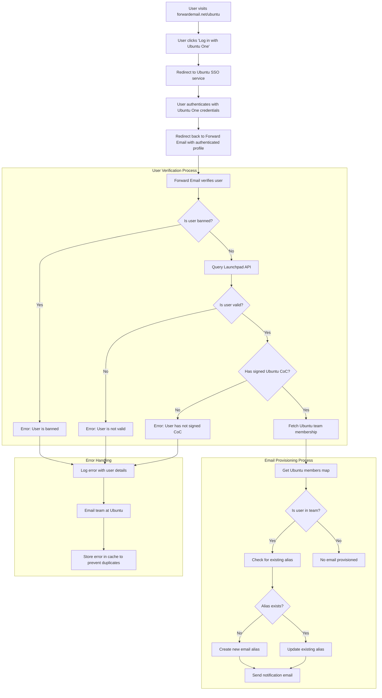

# 案例研究：Canonical 如何利用 Forward Email 的开源企业解决方案为 Ubuntu 电子邮件管理提供支持 {#case-study-how-canonical-powers-ubuntu-email-management-with-forward-emails-open-source-enterprise-solution}


## 目录 {#table-of-contents}

* [前言](#foreword)
* [挑战：管理复杂的电子邮件生态系统](#the-challenge-managing-a-complex-email-ecosystem)
* [关键要点](#key-takeaways)
* [为什么要转发电子邮件](#why-forward-email)
* [实施：无缝 SSO 集成](#the-implementation-seamless-sso-integration)
  * [身份验证流程可视化](#authentication-flow-visualization)
  * [技术实施细节](#technical-implementation-details)
* [DNS 配置和电子邮件路由](#dns-configuration-and-email-routing)
* [成果：简化电子邮件管理并增强安全性](#results-streamlined-email-management-and-enhanced-security)
  * [运营效率](#operational-efficiency)
  * [增强安全性和隐私性](#enhanced-security-and-privacy)
  * [节省成本](#cost-savings)
  * [改善贡献者体验](#improved-contributor-experience)
* [展望未来：持续合作](#looking-forward-continued-collaboration)
* [结论：完美的开源合作伙伴关系](#conclusion-a-perfect-open-source-partnership)
* [支持企业客户](#supporting-enterprise-clients)
  * [联系我们](#get-in-touch)
  * [关于转发电子邮件](#about-forward-email)

## 前言 {#foreword}

在开源软件领域，很少有公司能像 [典范](https://en.wikipedia.org/wiki/Canonical_\(company\) 一样举足轻重。[Ubuntu](https://en.wikipedia.org/wiki/Ubuntu) 是全球最受欢迎的 Linux 发行版之一。Canonical 拥有庞大的生态系统，涵盖多个发行版，包括 Ubuntu、[自由的](https://en.wikipedia.org/wiki/Kubuntu)、[鲁班图](https://en.wikipedia.org/wiki/Lubuntu)、[教育版](https://en.wikipedia.org/wiki/Edubuntu) 等。因此，在管理众多域名的电子邮件地址方面，Canonical 面临着独特的挑战。本案例研究探讨了 Canonical 如何与 Forward Email 合作，打造一个无缝、安全且注重隐私的企业电子邮件管理解决方案，完美契合 Canonical 的开源价值观。

## 挑战：管理复杂的电子邮件生态系统 {#the-challenge-managing-a-complex-email-ecosystem}

Canonical 的生态系统多元而广阔。由于全球拥有数百万用户和数千名来自不同项目的贡献者，管理跨多个域名的电子邮件地址是一项艰巨的挑战。核心贡献者需要官方电子邮件地址（@ubuntu.com、@kubuntu.org 等），以反映他们对项目的参与，同时通过强大的 Ubuntu 域名管理系统确保安全性和易用性。

在实施“转发电子邮件”之前，Canonical 面临以下困难：

* 管理跨多个域名的电子邮件地址（@ubuntu.com、@kubuntu.org、@lubuntu.me、@edubuntu.org 和 @ubuntu.net）
* 为核心贡献者提供一致的电子邮件体验
* 将电子邮件服务与其现有的 [Ubuntu One](https://en.wikipedia.org/wiki/Ubuntu_One) 单点登录 (SSO) 系统集成
* 寻找符合其隐私、安全和开源电子邮件安全承诺的解决方案
* 以经济高效的方式扩展其安全的电子邮件基础设施

## 关键要点 {#key-takeaways}

* Canonical 成功在多个 Ubuntu 域中部署了统一的电子邮件管理解决方案
* Forward Email 的 100% 开源方法与 Canonical 的价值观完美契合
* 与 Ubuntu One 的 SSO 集成为贡献者提供无缝身份验证
* 抗量子加密确保所有电子邮件通信的长期安全
* 该解决方案能够经济高效地扩展，以支持 Canonical 不断增长的贡献者群体

## 为什么转发电子邮件 {#why-forward-email}

作为唯一一家专注于隐私和安全的 100% 开源电子邮件服务提供商，Forward Email 非常适合 Canonical 的企业电子邮件转发需求。我们的价值观与 Canonical 对开源软件和隐私的承诺完美契合。

使 Forward Email 成为理想选择的关键因素包括：

1. **完整的开源代码库**：我们的整个平台都是开源的，可在 [GitHub](https://en.wikipedia.org/wiki/GitHub) 上访问，从而实现透明度并促进社区贡献。与许多“注重隐私”的电子邮件提供商（他们只开源前端而对后端保持封闭）不同，我们将整个代码库（包括前端和后端）开放给任何人，均可在 [GitHub](https://github.com/forwardemail/forwardemail.net) 上查看。

2. **注重隐私**：与其他提供商不同，我们不将电子邮件存储在共享数据库中，而是使用强大的 TLS 加密技术。我们的基本隐私理念很简单：**您的电子邮件只属于您**。从如何处理电子邮件转发到如何实施加密，这一原则指导着我们做出的每一个技术决策。

3. **不依赖第三方**：我们不使用 Amazon SES 或其他第三方服务，这使我们能够完全控制电子邮件基础设施并消除通过第三方服务可能造成的隐私泄露。

4.**经济高效的扩展**：我们的定价模式允许组织扩展而无需按用户付费，这对于 Canonical 庞大的贡献者群体来说是理想的选择。

5. **抗量子加密**：我们使用单独加密的 SQLite 邮箱，并使用 [ChaCha20-Poly1305](https://en.wikipedia.org/wiki/ChaCha20-Poly1305) 作为 [抗量子加密](/blog/docs/best-quantum-safe-encrypted-email-service) 的密码。每个邮箱都是一个单独的加密文件，这意味着访问一个用户的数据并不意味着其他用户也能访问。

## 实施：无缝 SSO 集成 {#the-implementation-seamless-sso-integration}

实施过程中最关键的一点是与 Canonical 现有的 Ubuntu One SSO 系统集成。此集成将允许核心贡献者使用其现有的 Ubuntu One 凭证管理他们的 @ubuntu.com 电子邮件地址。

### 身份验证流程可视化 {#authentication-flow-visualization}

下图说明了完整的身份验证和电子邮件配置流程：



### 技术实施细节 {#technical-implementation-details}

Forward Email 与 Ubuntu One SSO 的集成是通过自定义实现的 Passport-ubuntu 身份验证策略实现的。这使得 Ubuntu One 和 Forward Email 系统之间的身份验证流程无缝衔接。

#### 身份验证流程 {#the-authentication-flow}

身份验证过程如下：

1. 用户访问位于 [forwardemail.net/ubuntu](https://forwardemail.net/ubuntu) 的专用 Ubuntu 电子邮件管理页面
2. 点击“使用 Ubuntu One 登录”，然后重定向到 Ubuntu SSO 服务
3. 使用 Ubuntu One 凭据进行身份验证后，用户将使用已验证的个人资料重定向回 Forward Email
4. Forward Email 验证用户的贡献者身份，并相应地提供或管理其电子邮件地址

该技术实现利用了 [`passport-ubuntu`](https://www.npmjs.com/package/passport-ubuntu) 软件包，该软件包是一个 [护照](https://www.npmjs.com/package/passport) 策略，用于使用 [OpenID](https://en.wikipedia.org/wiki/OpenID) 进行 Ubuntu 身份验证。配置包括：

```javascript
passport.use(new UbuntuStrategy({
  returnURL: process.env.UBUNTU_CALLBACK_URL,
  realm: process.env.UBUNTU_REALM,
  stateless: true
}, function(identifier, profile, done) {
  // User verification and email provisioning logic
}));
```

#### Launchpad API 集成和验证 {#launchpad-api-integration-and-validation}

我们实现的一个关键组件是与 [启动板](https://en.wikipedia.org/wiki/Launchpad_\(website\)) 的 API 集成，以验证 Ubuntu 用户及其团队成员资格。我们创建了可重用的辅助函数，以高效可靠地处理此集成。

`sync-ubuntu-user.js` 辅助函数负责通过 Launchpad API 验证用户并管理其电子邮件地址。以下是其工作原理的简化版本：

```javascript
async function syncUbuntuUser(user, map) {
  try {
    // Validate user object
    if (!_.isObject(user) ||
        !isSANB(user[fields.ubuntuUsername]) ||
        !isSANB(user[fields.ubuntuProfileID]) ||
        !isEmail(user.email))
      throw new TypeError('Invalid user object');

    // Get Ubuntu members map if not provided
    if (!(map instanceof Map))
      map = await getUbuntuMembersMap(resolver);

    // Check if user is banned
    if (user[config.userFields.isBanned]) {
      throw new InvalidUbuntuUserError('User was banned', { ignoreHook: true });
    }

    // Query Launchpad API to validate user
    const url = `https://api.launchpad.net/1.0/~${user[fields.ubuntuUsername]}`;
    const response = await retryRequest(url, { resolver });
    const json = await response.body.json();

    // Validate required boolean properties
    if (!json.is_valid)
      throw new InvalidUbuntuUserError('Property "is_valid" was false');

    if (!json.is_ubuntu_coc_signer)
      throw new InvalidUbuntuUserError('Property "is_ubuntu_coc_signer" was false');

    // Process each domain for the user
    await pMap([...map.keys()], async (name) => {
      // Find domain in database
      const domain = await Domains.findOne({
        name,
        plan: 'team',
        has_txt_record: true
      }).populate('members.user');

      // Process user's email alias for this domain
      if (map.get(name).has(user[fields.ubuntuUsername])) {
        // User is a member of this team, create or update alias
        let alias = await Aliases.findOne({
          user: user._id,
          domain: domain._id,
          name: user[fields.ubuntuUsername].toLowerCase()
        });

        if (!alias) {
          // Create new alias with appropriate error handling
          alias = await Aliases.create({
            user: user._id,
            domain: domain._id,
            name: user[fields.ubuntuUsername].toLowerCase(),
            recipients: [user.email],
            locale: user[config.lastLocaleField],
            is_enabled: true
          });

          // Notify admins about new alias creation
          await emailHelper({
            template: 'alert',
            message: {
              to: adminEmailsForDomain,
              subject: `New @${domain.name} email address created`
            },
            locals: {
              message: `A new email address ${user[fields.ubuntuUsername].toLowerCase()}@${domain.name} was created for ${user.email}`
            }
          });
        }
      }
    });

    return true;
  } catch (err) {
    // Handle and log errors
    await logErrorWithUser(err, user);
    throw err;
  }
}
```

为了简化跨不同 Ubuntu 域的团队成员资格管理，我们在域名和其对应的 Launchpad 团队之间创建了一个简单的映射：

```javascript
ubuntuTeamMapping: {
  'ubuntu.com': '~ubuntumembers',
  'kubuntu.org': '~kubuntu-members',
  'lubuntu.me': '~lubuntu-members',
  'edubuntu.org': '~edubuntu-members',
  'ubuntustudio.com': '~ubuntustudio-core',
  'ubuntu.net': '~ubuntu-smtp-test'
},
```

这种简单的映射使我们能够自动执行检查团队成员资格和提供电子邮件地址的过程，使得系统在添加新域时易于维护和扩展。

#### 错误处理和通知 {#error-handling-and-notifications}

我们实施了一个强大的错误处理系统：

1. 记录所有错误以及详细的用户信息
2. 检测到问题时向 Ubuntu 团队发送电子邮件
3. 新贡献者注册并创建电子邮件地址时通知管理员
4. 处理特殊情况，例如用户未签署 Ubuntu 行为准则

这可确保快速识别和解决任何问题，从而维护电子邮件系统的完整性。

## DNS 配置和电子邮件路由 {#dns-configuration-and-email-routing}

对于通过 Forward Email 管理的每个域，Canonical 添加了一个简单的 DNS TXT 记录用于验证：

```sh
❯ dig ubuntu.com txt
ubuntu.com.             600     IN      TXT     "forward-email-site-verification=6IsURgl2t7"
```

此验证记录确认了域名所有权，并使我们的系统能够安全地管理这些域名的电子邮件。Canonical 通过 Postfix 服务路由邮件，Postfix 提供了可靠且安全的电子邮件递送基础设施。

## 结果：简化电子邮件管理并增强安全性 {#results-streamlined-email-management-and-enhanced-security}

Forward Email 企业解决方案的实施为 Canonical 所有域的电子邮件管理带来了显著的优势：

### 运营效率 {#operational-efficiency}

* **集中管理**：所有与 Ubuntu 相关的域名现在都通过单一界面进行管理
* **降低管理开销**：为贡献者提供自动化配置和自助管理
* **简化入职流程**：新贡献者可以快速获取他们的官方电子邮件地址

### 增强的安全性和隐私性 {#enhanced-security-and-privacy}

* **端到端加密**：所有电子邮件均采用高级标准加密
* **无共享数据库**：每位用户的电子邮件都存储在单独的加密 SQLite 数据库中，提供比传统共享关系数据库更安全的沙盒加密方法
* **开源安全**：透明的代码库允许社区进行安全审查
* **内存处理**：我们不会将转发的电子邮件存储到磁盘，从而增强隐私保护
* **无元数据存储**：与许多电子邮件提供商不同，我们不会记录谁给谁发送了电子邮件

### 成本节省 {#cost-savings}

* **可扩展的定价模式**：无需按用户付费，Canonical 可以在不增加成本的情况下添加贡献者
* **减少基础设施需求**：无需为不同域名维护单独的电子邮件服务器
* **降低支持要求**：自助服务管理可减少 IT 支持工单数量

### 改进了贡献者的体验 {#improved-contributor-experience}

* **无缝身份验证**：使用现有 Ubuntu One 凭据进行单点登录
* **一致的品牌标识**：所有 Ubuntu 相关服务的统一体验
* **可靠的电子邮件递送**：高质量的 IP 信誉确保电子邮件到达目的地

与 Forward Email 的集成显著简化了 Canonical 的电子邮件管理流程。贡献者现在可以无缝管理他们的 @ubuntu.com 电子邮件地址，同时减少管理开销并增强安全性。

## 展望未来：持续合作 {#looking-forward-continued-collaboration}

Canonical 和 Forward Email 的合作关系不断发展。我们正在合作开展以下几项计划：

* 将电子邮件服务扩展到更多 Ubuntu 相关域
* 根据贡献者的反馈改进用户界面
* 实现更多安全功能
* 探索利用开源协作的新方法

## 结论：完美的开源合作伙伴关系 {#conclusion-a-perfect-open-source-partnership}

Canonical 与 Forward Email 的合作彰显了基于共同价值观的伙伴关系的力量。通过选择 Forward Email 作为其电子邮件服务提供商，Canonical 找到了一个不仅满足其技术需求，而且完全符合其对开源软件、隐私和安全承诺的解决方案。

对于管理多个域名并需要与现有系统无缝身份验证的组织，Forward Email 提供了灵活、安全且注重隐私的解决方案。我们的 [开源方法](https://forwardemail.net/blog/docs/why-open-source-email-security-privacy) 确保透明度并允许社区贡献，使其成为重视这些原则的组织的理想选择。

随着 Canonical 和 Forward Email 都在各自的领域不断创新，此次合作证明了开源协作和共享价值观在创造有效解决方案方面的力量。

您可以检查我们的 [实时服务状态](https://status.forwardemail.net) 来了解我们当前的电子邮件传递性能，我们会持续监控以确保高质量的 IP 信誉和电子邮件传递能力。

## 支持企业客户 {#supporting-enterprise-clients}

虽然本案例研究的重点是我们与 Canonical 的合作关系，但 Forward Email 自豪地为各行各业的众多企业客户提供支持，他们重视我们对隐私、安全和开源原则的承诺。

我们的企业解决方案专为满足各种规模组织的特定需求而量身定制，提供：

* 跨多个域名的自定义域名 [电子邮件管理](/)
* 与现有身份验证系统无缝集成
* 专用 Matrix 聊天支持渠道
* 增强的安全功能，包括 [抗量子加密](/blog/docs/best-quantum-safe-encrypted-email-service)
* 完全的数据可移植性和所有权
* 100% 开源基础架构，确保透明度和信任

### 取得联系 {#get-in-touch}

如果您的组织有企业电子邮件需求，或者您有兴趣了解有关 Forward Email 如何帮助简化电子邮件管理同时增强隐私和安全性的更多信息，我们很乐意听取您的意见：

* 直接发送电子邮件至 `support@forwardemail.net`
* 在我们的 [帮助页面](https://forwardemail.net/help) 提交帮助请求
* 查看我们的 [定价页面](https://forwardemail.net/pricing) 了解企业计划

我们的团队随时准备讨论您的具体要求并制定符合您组织的价值观和技术需求的定制解决方案。

### 关于转发电子邮件 {#about-forward-email}

Forward Email 是 100% 开源且注重隐私的电子邮件服务。我们提供自定义域名电子邮件转发、SMTP、IMAP 和 POP3 服务，并注重安全性、隐私性和透明度。我们的全部代码库均可在 [GitHub](https://github.com/forwardemail/forwardemail.net) 上使用，我们致力于提供尊重用户隐私和安全的电子邮件服务。了解更多关于 [为什么开源电子邮件是未来](https://forwardemail.net/blog/docs/why-open-source-email-security-privacy)、[我们的电子邮件转发如何运作](https://forwardemail.net/blog/docs/best-email-forwarding-service) 和 [我们的电子邮件隐私保护方法](https://forwardemail.net/blog/docs/email-privacy-protection-technical-implementation) 的信息。